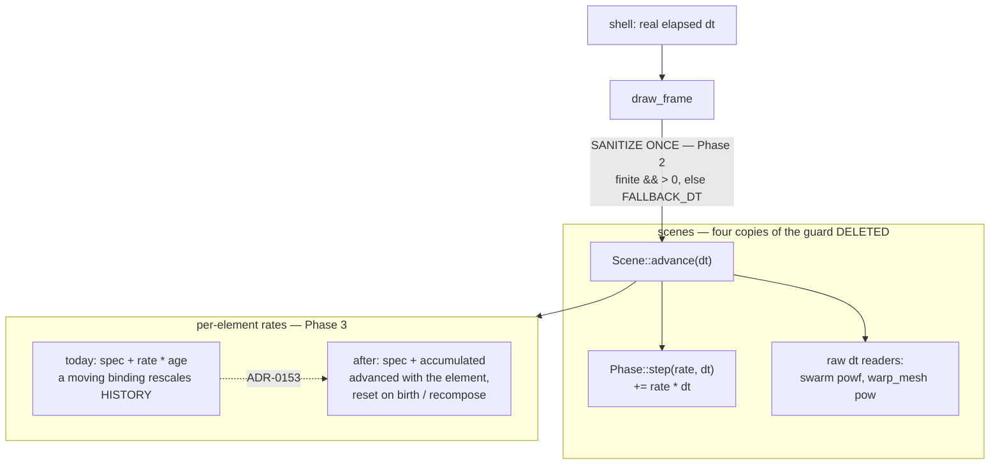

# 0140 — Every rate integrates, for real

> **Status:** in-progress
> **Created:** 2026-08-29
> **Owner skill(s):** dev, human
> **Related ADRs:** [0152](../adrs/0152-the-frame-delta-is-sanitized-at-the-scene-seam.md) (proposed),
> [0153](../adrs/0153-a-per-element-rate-integrates-per-element.md) (proposed)
> **Closes:** design-backlog 0149, 0150. **0142 is carried, not closed** — see Phase 6.

## TL;DR

Plan 0122 made every rate integrate — against the clock it grepped for. **Three more rates multiply
a per-element `age` instead**, which is the same defect against a different clock, and the
`hygiene.rs` guard matches the shared clock by name so it passes all three. Three shipped presets
bind them to audio, more content than the `swarm` pair Plan 0122 existed to fix, and
`presets/README.md` documents the defective form as the safe one. Separately, `Phase::step` accepts
any `dt`, so the guard against a permanently-poisoned accumulator is four byte-identical copies in
callers — and the attractor, which holds a `Phase`, has none. The first visible behavior is
`presets/README.md` no longer teaching a rate form that ADR-0132 forbids.

## Context & problem

Both entries were raised at Plan 0122's Mode 4 close review — one by grepping for the *mechanism*
(`* age`) rather than the spelling the guard knows, one from the review's second `minor`. They are
one plan because they are the same failure at two levels: **a rule enforced by a list of sites, and
the site that is not on the list.**

That is ADR-0135's own sentence. Its Context calls four copies of three lines *"a rule enforced by a
list of sites"* and rejects its Alternative A on the ground that duplication is how the defect
returns. Four copies of the `dt` guard is that sentence again; `particles/mod.rs` is the site it
predicts. And ADR-0132's rule about rates is enforced by a guard that knows one spelling, so three
rates against a different clock were never in scope.

Neither has been observed in the wild, and both are filed at the size they are because **the cost of
repair only grows.** `Phase` is now the engine's one rate mechanism, so every rate added after this
inherits whichever answer is not chosen.

The user-visible half is real, though, and it is the quiet passage. `shape_collage`'s `recompose` is
gated on `hash(beat_index)`, so with no onsets it never fires, `age` grows unbounded, and **the first
bass hit after a long quiet stretch lands the full accumulated swing.** In ordinary playback the
same defect is a ~49x single-frame jitter on `spin` and ~35x on `drift`.

## Decision

**Fix the documentation first, then the invariant, then the rates.** Phase 1 is the
`presets/README.md` correction — ADR-0153 says explicitly it is worth making whether or not the
engine repair is taken, and it is what stops the content lane writing a fourth affected preset.
Phase 2 implements [ADR-0152](../adrs/0152-the-frame-delta-is-sanitized-at-the-scene-seam.md).
Phases 3-5 implement [ADR-0153](../adrs/0153-a-per-element-rate-integrates-per-element.md), with the
emitter's third case **measured before it is repaired**. Phase 6 is the honest note on backlog 0142.

We rejected copying the fourth `dt` guard into `particles/mod.rs` — it leaves five copies, which is
the option ADR-0135 rejected by name. We rejected baking the collage rates at spawn (ADR-0153
Alternative A) because it makes a moving binding affect only new elements, which on an onset-gated
recompose is close to no reactivity in the passages that want it. And we rejected widening
`hygiene.rs` to `* age`, because `emitter`'s `v0 * age` ballistics are legitimate and a guard needing
an allowlist teaches suppression.

## Architecture diagram

## Implementation phases

### Phase 1 — The operator doc stops teaching the defect
- **Owner skill:** dev
- **What:** Correct `presets/README.md:2066`, which describes the defective form as the safe one.
- **Files touched:** `presets/README.md`.
- **Notes for the implementer:**
  - The sentence is *"Integrated against real elapsed time, so the canvas moves identically at any
    refresh rate."* It is **true about frame-rate independence and false about ADR-0132** — the rate
    scales the accumulation rather than being integrated into it. Correct the second claim without
    losing the first, which is still right.
  - **The line number moved and the row did not** — the sentence was at `:1536` when this plan was
    written and is at `:2066` now. It sits well clear of the ADR-0170 generated region
    (`<!-- params:begin -->` … `<!-- params:end -->`, lines 403-845), so it is hand-written prose and
    yours to edit. A correction inside those markers would be overwritten by the generator instead.
  - The `pump_*` row three lines below says *"drive the depth from the music"* and is load-bearing
    for the `preset-author` lane. Check it says something still true after this phase.
  - **This lands first on purpose.** It is one sentence, and it is the thing that produced three
    affected presets.
- **Done when:** `presets/README.md` no longer describes a `rate · age` form as integrated, and the
  row names what an author should bind instead.

### Phase 2 — The frame delta is sanitized at the seam
- **Owner skill:** dev
- **What:** Implement ADR-0152. Sanitize `dt` in `draw_frame` before `Scene::advance`, delete the
  **six** in-scene copies, and state the new contract on the trait.
- **Files touched:** `core/src/render/mod.rs`, `core/src/render/scenes/mod.rs`,
  `fragment_field.rs`, `lines/parametric.rs`, `swarm.rs`, `warp_mesh/mod.rs`,
  `warp_mesh/draw.rs`, `shape_collage.rs`, `particles/mod.rs`, `core/src/render/tests.rs`.
- **Notes for the implementer:**
  - **Read [ADR-0152](../adrs/0152-the-frame-delta-is-sanitized-at-the-scene-seam.md)'s
    `## Correction — 2026-09-07` before starting.** The guard population is **six**, not the four
    the ADR's Context lists — Plan 0126's splits added `shape_collage.rs:1165` and
    `warp_mesh/draw.rs:235` after it was written — and the correction is what this file list and the
    two bullets below are built from.
  - **Write the guarantee into `Scene::advance`'s doc comment**, or it is forgotten. ADR-0152's
    Negative section says this is the only thing standing where six visible guards used to be.
  - The six deleted guards each carry a separately-written comment giving the same reason. **That
    reasoning has to survive in one place**, at the seam — do not let the *why* go with the
    duplication.
  - `FALLBACK_DT` moves to the seam and keeps its value. **The six sites did not agree on a
    fallback** — four substitute `FALLBACK_DT`, `shape_collage` freezes at `0.0`, and `Exposure`
    substitutes rate `1.0`, which at `NOMINAL_FPS = 30.0` is `dt = 1/30` rather than `1/60`. One
    seam makes that one policy; the divergence is unobservable afterwards because the branch is
    unreachable, so this moves no golden.
  - **At `Exposure::new` (`warp_mesh/draw.rs:235`) delete the guard and keep the
    `.clamp(0.0, 4.0)`.** The clamp caps a long frame at four nominal frames and is not part of this
    invariant.
  - **`transition.rs:329` is NOT in scope and keeps its guard.** `Transition` is not a `Scene`, the
    contract clause lands on `Scene::advance` and says nothing about it, and its guard **holds** the
    dissolve rather than stepping it — a different policy, not a copy of this one.
    `a_degenerate_dt_holds_progress` (`transition.rs:1203`) asserts exactly that. Do not delete
    either. `now_playing.advance(dt)` (`mod.rs:974`) is called **before** `draw_frame` and is
    likewise untouched.
  - The attractor's `self.dt = dt` at `particles/mod.rs:1513` is the live hole; after this phase it is
    safe **because of the seam**, not because it gained a guard. Do not add a seventh copy.
  - `FixedStep::advance` self-heals via `accumulator.min(step)`, which is why the omission read as
    safe. Leave that alone; it is correct.
- **Done when:**
  - A test feeding `NaN`, a negative and a zero `dt` through `draw_frame` leaves every scene's `Phase`
    finite and advancing, **including the attractor's `spin_time`**, which today would be poisoned
    permanently.
  - No `dt.is_finite() && dt > 0.0` remains in any scene. (`transition.rs` is not a scene and is
    excluded by name — see the note above.)
  - The golden suite is unmoved and unblessed.

### Phase 3 — The collage rates integrate per element
- **Owner skill:** dev
- **What:** Implement ADR-0153 for `shape_collage`'s `drift` and `spin`, and state in
  `presets/README.md` that they now integrate.
- **Files touched:** `core/src/render/scenes/shape_collage.rs`, `presets/README.md`.
- **Notes for the implementer:**
  - **Read [ADR-0153](../adrs/0153-a-per-element-rate-integrates-per-element.md)'s
    `## Correction — 2026-09-07` before starting.** Its Decision stands; its justification paragraph
    and one Negative bullet do not, and the two bullets below replace them.
  - **This is not `scenes::Phase`.** `Phase` is one accumulator per scene, reset never; these reset
    per element-set. That difference is why Plan 0122 scoped them out.
  - **The storage is two `f32` per set, not per element.** `age` is `self.elapsed - self.born` —
    one value shared by every element in a set — so `drift` and `spin` each get one accumulator for
    `live` and one for `outgoing`, four in total, advanced once per frame in `step`. The placement
    becomes `p.spec.center + p.vel * drift_accum` and `p.spec.angle_deg + (p.spin * spin_accum)`.
    Per-set and per-element coincide here because elements are born only when the canvas is
    regenerated; there is no per-element birth anywhere in the scene.
  - **There are TWO reset points, not one**, and both must zero both accumulators: `rebuild()`
    (`shape_collage.rs:1124`, fires when the recipe moved) and the recompose edge (`:1183`). Each is
    a site that already writes `self.born`, so the edit is one line beside each. Getting either
    wrong reintroduces the unbounded-`age` cliff in a new form — and on the `outgoing` swap the
    accumulator moves with the set, exactly as `outgoing_born = born` does today.
  - **No cost measurement is owed.** The ADR's "write per element per frame" is falsified by the
    per-set shape: the work is two adds per frame, constant in element count, and the per-element
    read loses a multiply.
  - **Goldens will move here**, and that is expected rather than a finding — the response genuinely
    changes. Bless deliberately and say so in the log; do not bless anything from Phase 2.
  - **This phase owns the `drift`/`spin` row in `presets/README.md`** (architect ruling, 2026-09-07,
    on the resume note's question). Phase 1 removed the false *"Integrated against real elapsed
    time"* claim and put nothing back; **this is the commit that makes the positive statement true**,
    so the statement lands here rather than in Phase 5. Add one clause to the hand-written row
    (currently `:2066`, the *"Both scale a motion that accumulates over the whole life of a canvas"*
    sentence) saying the two **integrate a phase per canvas** in ADR-0132's sense: a binding that
    moves steers the motion from that moment and does not rescale what is already on screen, and the
    accumulation resets when the canvas is regenerated. The `swarm` paragraph at `:1063` is the
    house phrasing for this and is worth reading first.
  - **Do not write the row to satisfy a probe.** Backlog 0149's fifth verification asserts the old
    sentence is *present* and went red on Phase 1's delivery; the entry's repair is architect's at
    the close. Choose the wording that is true, not the wording that turns a probe green.
  - **If any `ParamSpec` description in this file changes, regenerate the ADR-0170 block** —
    `shape_collage`'s rows at `presets/README.md:742-748` are generated from the declarations beside
    `set_param`, and `the_parameter_reference_block_is_current` goes red if the file is not
    regenerated with `RLX_UPDATE_PARAM_REFERENCE=1`. Neither current description is falsified by
    this phase, so the likely answer is that no declaration changes and the block does not move.
- **Done when:**
  - A binding that moves changes the canvas from that moment forward and does not retroactively
    rescale an element's existing placement, asserted as a test over two frames with a moved binding.
  - The quiet-passage case — no onsets for a long stretch, then a bass hit — no longer lands an
    accumulated swing.
  - `presets/README.md`'s `drift`/`spin` row states that the two integrate, in ADR-0132's sense,
    and the row is still true of the frame-rate fact Phase 1 preserved.

### Phase 4 — Measure the emitter's third case
- **Owner skill:** dev
- **What:** Measure whether `emitter::sprite_angle`'s `base + rate * age` (`emitter.rs:747`) is
  observable, then repair or document.
- **Files touched:** `core/src/render/scenes/emitter.rs`, `docs/design-backlog.md`.
- **Notes for the implementer:**
  - Sprites are short-lived, so `age` is small and the defect **may be unobservable**. Backlog 0149
    says to measure before spending anything on it.
  - `spin` here is bound only to constants in shipped content today — the same status
    `parametric_curve`'s `spin` and `warp_mesh`'s `deposit_spin` had when ADR-0132 corrected them
    anyway. **A rate whose clock cannot grow is a different fact from a rate nobody happens to bind**,
    and the measurement is what separates them.
  - **Do not repair `emitter.rs:349-350`'s `v0 * age`.** That is legitimate ballistics with a
    spawn-baked velocity, and it is the reason the guard is not widened.
  - If left unrepaired, record it as a stated exception with the measurement behind it.
- **Done when:** the sprite rotation is either integrated per element or documented as
  bounded-by-lifetime with the measured `age` range that justifies it.

### Phase 5 — The three collage presets are retuned
- **Owner skill:** dev
- **What:** Re-tune `collage_onwhite`, `collage_suprematist` and `collage_mono` against the corrected
  response, and re-bless.
- **Files touched:** the three presets, golden baselines.
- **Notes for the implementer:**
  - Their `[smoothing]` values (all ~0.6) were tuned against the defective response, where a moving
    binding was amplified by `age`. After Phase 3 the same numbers produce a much smaller motion.
  - **This is the boundary case for the lane split.** ADR-0081 puts new preset content in
    `preset-author`, but this is `dev` editing presets because an engine change forced it, which is
    the stated exception. Keep it to restoring the intended motion — **not** re-designing the look.
  - If the looks need real re-design, that is a `preset-author` hand-off, and say so rather than
    doing it here.
- **Done when:** the three presets read as they did before the engine change, with bindings that now
  steer rather than rescale, and the moved goldens are blessed with the reason stated.

### Phase 6 — The dissolve note
- **Owner skill:** dev
- **What:** Record what this plan does and does not do for backlog 0142.
- **Files touched:** `docs/design-backlog.md`.
- **Notes for the implementer:**
  - Backlog 0142 — a same-system dissolve runs `Scene::update` twice in one frame, so every stateful
    scene advances at 2x for its duration — is **filed rather than planned** solely because *"nothing
    in the suite can currently observe the bug, so nothing can observe the repair either."*
  - Phase 2 does **not** fix it and does not make it observable: sanitizing `dt` says nothing about
    `update` running twice. Say that plainly rather than letting a reader assume the rate work
    covered it.
  - What *has* changed is the population: with Phase 3, `shape_collage` joins the scenes carrying
    per-frame state that is not idempotent, so the dissolve defect now reaches one more system.
    **That is a size update on 0142 and it belongs on the entry.**
- **Done when:** backlog 0142 carries a dated update stating that this plan did not repair it, and
  that its affected population grew.

## Risks & open questions

- **Both ADRs carry a dated `## Correction` written 2026-09-07, before acceptance, and the phases
  above are built from them.** The tree moved under this plan between its drafting and its
  implementation: ADR-0152's guard population is six rather than four, and ADR-0153's per-element
  storage argument does not hold because `shape_collage` has no per-element birth. Neither Decision
  changed. **Read the correction before the section it corrects** — the ADR bodies are unedited and
  still state the falsified facts in their own voice.
- **Phase 2 leaves one guard standing on purpose**, at `transition.rs:329`, and after this plan the
  engine holds two policies for a degenerate frame — the seam steps a nominal `FALLBACK_DT`, the
  transition holds. That is filed as design-backlog 0188 rather than settled here, because deciding
  it needs a claim about what a stalled dissolve should look like that this plan has no business
  making.
- **Phase 3 moves goldens and Phase 2 must not.** Running them in one session risks blessing Phase
  2's suite by accident. Commit Phase 2 with an unmoved suite before starting Phase 3.
- **Phase 5 is a retune under a `dev` owner tag**, which is the lane boundary's stated exception and
  also where it is most likely to be abused. If the presets need more than restoring intended motion,
  stop and hand off.
- **The guard still cannot see this class after this plan.** ADR-0153 declines to widen `hygiene.rs`
  for good reasons, which means the next per-element rate has nothing catching it but review — the
  exact route these three arrived by. Phase 1 is the only durable mitigation, and it is a doc.
- **Phase 2 contends with [Plan 0125](done/0125-the-scenes-share-their-gpu-boilerplate.md)** — that plan
  touches all twelve scenes' boilerplate and this one edits five of them. Take them in series.
- **The 49x and 35x figures are computed, not measured**, from a one-pole at `tau = 0.6` and
  `SPIN_SPEED = 0.07`. Per ADR-0071 do not assert them; they justify the work, they are not a
  done-when.

## What this plan does NOT do

- **It does not fix backlog 0142.** Phase 6 records why, and the instrument question — making the
  dual-live render path reachable from a test — is its own design problem.
- **It does not widen the `hygiene.rs` guard.** ADR-0153 Alternative B says why.
- **It does not introduce a `Dt` newtype.** ADR-0152 Alternative B records it as the right long-term
  shape and defers it on diff size against Plan 0126's concurrent splits.
- **It does not touch the six rates Plan 0122 already fixed**, or `Phase` itself.

## Implementation log

> Written by `dev` — one row per phase as that phase's commit lands, and the close block after the
> last one. **The phases above are the contract; everything here is what happened.**

**Lane:** `WORK/rlx-0140-rates` on `plan-0140-every-rate-integrates-for-real`, branched from `main`
at `775ef18`.

| phase | owner | state | commit |
|---|---|---|---|
| 1 — The operator doc stops teaching the defect | dev | done | `d310598` |
| 2 — The frame delta is sanitized at the seam | dev | done | `2a50d1a` |
| 3 — The collage rates integrate per element | dev | done | committed with this row |
| 4 — Measure the emitter's third case | dev | not started | |
| 5 — The three collage presets are retuned | dev | not started | |
| 6 — The dissolve note | dev | not started | |

### Notes

- **Phase 1's row is written to survive Phase 3, which is a narrower edit than the phase text
  implies.** The done-when's "no longer describes a `rate · age` form as integrated" is met by
  removing the claim; it is not met by documenting the defect, because Phase 3 lands in this same
  plan and would falsify that within two commits. The row now states the frame-rate fact (true in
  both worlds), says the motion accumulates over a canvas's life (true in both worlds), and gives
  binding guidance that holds either way. **No phase owns the positive restatement** — that
  `drift`/`spin` integrate per element — once Phase 3 lands; `presets/README.md` is not in Phase 3's
  or Phase 5's file list.
- **Phase 1 turned backlog 0149's first probe red**, which is the on-delivery behaviour its author
  wrote it for, not decay: `docs/design-backlog.md:2575`
  `present: Integrated against real elapsed time in: presets/README.md`. The entry is one this plan's
  header claims to close. Left untouched — repairing it is an architect call.
- **`particles/mod.rs` is in Phase 2's file list and was not edited.** `self.dt = dt` is correct
  once the seam runs, and the only edit available there was a comment saying so — which is the
  list-of-sites the phase exists to end. The `Scene::advance` doc comment carries it instead.
- **`FALLBACK_DT` did not move.** The phase says it "moves to the seam and keeps its value"; the
  constant stays in `scenes/mod.rs` and the seam reads `scenes::FALLBACK_DT`. Moving the
  declaration would edit `capture_api.rs` and `feedback.rs`, which read it for their own reasons
  and are in no phase's file list. Only the guard moved.
- **The Phase 2 test carries a negative control the done-when does not ask for.** Byte-equality
  between a bad-delta run and a clean run is satisfied trivially by a scene that ignores `dt`, so
  each probe first asserts that a *valid* longer first frame does change the final picture. All six
  probes pass both halves.

- **Phase 3's test landed outside the phase's file list.** The done-when asks for an assertion over
  two frames with a moved binding; the phase names `core/src/render/scenes/shape_collage.rs` and
  `presets/README.md`, and `shape_collage.rs:1681` is a bare `mod tests;`. The two tests and their
  four helpers are in `core/src/render/scenes/shape_collage/tests.rs`.
- **The plan's "Goldens will move here" did not happen, and the suite cannot see this phase at all.**
  `--test golden` is 3/3 unmoved and nothing was blessed. Both fixtures — `shape_collage.toml` and
  `shape_collage_roster.toml` — leave `drift` and `spin` at their `0` defaults, so both accumulators
  stay zero and every element composes byte-identically under either form. No golden fixture in the
  repo binds either rate. The shipped presets that do bind them are covered only by the pass/fail
  sweeps, which are green: `animation`, `distinctness`, `sanity`, `reactivity`, `preset`,
  `collage_layout` and `collage_cost` are 351/351.
- **Phase 3 edited `core/src/render/tests.rs`, which is Phase 2's file, on the user's explicit
  authorization.** Integrating the collage rates turned Phase 2's
  `a_degenerate_frame_delta_cannot_reach_a_scene` red at its negative control. `evaluate_preset`
  (`evaluate.rs:312`) advances a scene **before** it applies the preset's bindings, so frame 1 always
  integrates at the scene's own defaults — zero for `drift` and `spin` — and the probe's stretched
  *first* frame therefore lands nowhere for `SeamCollage`. The `rate * age` form was immune because
  the current rate multiplied the whole age retroactively; that immunity is the defect. The repair
  moves only the negative control's stretch to the second frame; the bad delta stays on the first,
  where `0.0 * NaN` is `NaN` and the poisoning it guards is still reachable. All six probes pass.
- **A followup noticed and not acted on:** the first frame of every preset integrates at the scene's
  default rates rather than the preset's, for the six rates Plan 0122 converted as well as these two.
  It is bounded at one frame and no gate observes it. Not filed — the entry is architect's call.
- **The `presets/README.md` row was landed here** per the architect ruling recorded in the resume
  note below. It states the integration, keeps Phase 1's frame-rate sentence and the wrap, and gives
  the reason a rate still wants a band envelope rather than an onset.

### Resume note — 2026-09-07, paused after Phase 2 (scaffolding; strip at the close)

**Paused for an architect ruling, not blocked on code.** Phases 3-6 are untouched and nothing is
half-landed: the tree at `2a50d1a` is green, `fmt` and `clippy --workspace --all-targets -D warnings`
are clean, `-P fast` is 1339/1339, and `--test golden --test attractor` is 10/10 with no baseline
blessed.

**The question.** Phase 1 corrected `presets/README.md`'s `drift`/`spin` row by *removing* the false
"Integrated against real elapsed time" claim rather than by documenting the defect — because Phase 3
makes the form genuinely integrated two commits later, and a row describing the defect would have
been false by then. The row as it stands is true both before and after Phase 3 and states the
frame-rate fact, but it **no longer says the two integrate**, which is the engine-wide rule of
ADR-0132 and the thing `preset-author` reads that file for. **No phase owns putting that back:**
`presets/README.md` is in Phase 1's file list only, and Phases 3 and 5 name `shape_collage.rs` and
the three presets.

**What architect decides:** which phase owns the row, and amend that phase's `Files touched`. The
candidate text is one row, and Phase 3 is the natural owner because it is the commit that makes the
statement true. Phase 5 is the alternative, since it is already the content-facing phase.

**Architect ruling — 2026-09-07: Phase 3 owns the row.** Its `Files touched`, notes and done-when are
amended above. Reasons, for the record: a doc claim lands in the commit that makes it true, and
Phases 3-4 would otherwise ship the rule with the operator doc silent on it; Phase 5 is preset
content under a `dev` tag — the lane split's stated exception, and the one phase the plan already
flags as handing off if it grows — so a reference-doc clause parked there is parked behind an escape
hatch; and Phase 3 is already the phase that can move `presets/README.md` mechanically, since the
ADR-0170 block's `shape_collage` rows are generated from declarations in its only other file.
Phase 4 needs nothing here: the emitter's `spin` row (`presets/README.md:1256`) makes no integration
claim, so whichever way its measurement falls, that row stays true.

**Where to resume:** Phase 3, with the amended file list. Nothing else in the plan needs re-reading —
the two ADR corrections dated 2026-09-07 are already folded into the phase notes.

### Close triggers

_(filled at the close.)_
