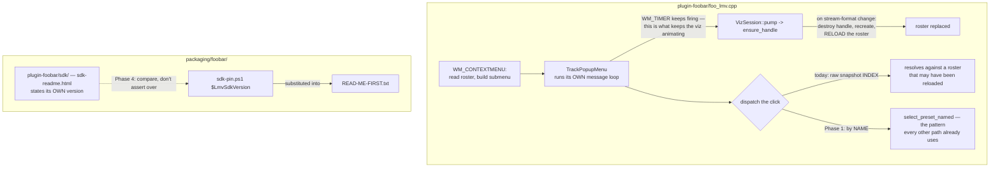

# 0141 — The plugin's seams stop drifting

> **Status:** in-progress
> **Created:** 2026-08-29
> **Owner skill(s):** dev
> **Related ADRs:** none — three mechanical repairs, no rejected alternative worth recording.
> **Closes:** design-backlog 0117, 0118, 0105.

## TL;DR

Three claims on the foobar2000 side that are no longer true. The preset menu dispatches a click by a
**snapshot index** across a modal wait, justified by a comment saying *"nothing on this thread can
reload presets between the build and the click"* — which is false, because `TrackPopupMenu` runs its
own message loop and keeps dispatching `WM_TIMER`, and that handler can destroy the handle, rebuild
it and reload the roster. `foo_lmv.dll` has grown **400 KB** since the C ABI spec measured it, so the
spec advertises ~1.07 MB of headroom where ~0.72 MB remains. And the shipped `READ-ME-FIRST.txt`
asserts an SDK version that, on the pre-staged route, nothing checks. The first visible behavior is
the preset menu selecting by name.

## Context & problem

This plan exists because **`plugin-foobar/` is the one area no plan on the current roster touches**,
so all three entries have sat since 2026-08-16 to 2026-08-18 with nothing scheduled to pick them up.
They are grouped by locality rather than by mechanism, and they are all small.

What they share is a shape worth naming: **each is a written claim that was true when written.** The
menu comment was true before `ensure_handle` grew the ability to reload a roster mid-playback. The
spec's headroom sentence was true at Plan 0097. The `READ-ME-FIRST` substitution was true on the
fetch route, which was the only route until ADR-0115 made the pre-staged route first-class. None of
them is a bug someone introduced; all three are statements the code drifted out from under.

The 0118 entry names what makes that self-correcting badly: the spec instructs a re-measure *"when a
dependency is added to this crate"*, and **the growth arrived without one**. Plan 0107 is confirmed
not to be the cause — it links nothing new. Plan 0100's MilkDrop conversion work landed between the
two measurements and is the obvious suspect, but nothing has attributed it, which is the point of
filing it.

## Decision

**Take the three repairs in order of how much they protect a user**, and attribute the size growth
rather than only correcting the number. Phase 1 is the menu dispatch — it removes a false claim from
a file whose comments are load-bearing, and it is a few lines. Phase 2 corrects the spec's size table
into a dated series. Phase 3 bisects the growth, because a soft cap nobody can attribute movement in
is a cap that gets discovered breached. Phase 4 makes the packaging recipe read the SDK's own version
marker instead of asserting over it.

No ADR: each entry states its own fix and none names a rejected alternative worth recording. 0117's
fix is the pattern every *other* selection path in the file already uses.

## Architecture diagram



## Implementation phases

### Phase 1 — The preset menu selects by name
- **Owner skill:** dev
- **What:** Close backlog 0117. Dispatch the menu click by preset name rather than by snapshot index,
  and correct the comment.
- **Files touched:** `plugin-foobar/foo_lmv.cpp`.
- **Notes for the implementer:**
  - The helper already exists and **every other selection path in the file uses it**, precisely
    because indices are snapshot-scoped (ADR-0117). The entry carries the exact shape:

    ```cpp
    } else if (listed != 0 && ucmd >= kMenuPresetBase && ucmd < kMenuPresetBase + listed) {
        if (select_preset_named(g_session.handle, snap.names[ucmd - kMenuPresetBase]))
            remember_current_preset(g_session.handle);
    }
    ```
  - **Correct the comment, and correct it accurately.** The safety comes from *re-resolving*, not
    from modality. Leaving the modality claim would be worse than the index, because it is the reason
    the index looked safe.
  - The existing post-dismiss guard checks `g_session.owner != wnd || g_session.handle == nullptr`. A
    handle that was **replaced** rather than dropped passes it — note that in the comment, since it is
    the second half of why the old reasoning failed.
  - **This contends with [Plan 0103](0103-the-project-gets-an-audience.md) Phase 1**, which rewrites
    this same handler. Backlog 0117 calls itself a natural pickup for whoever takes that phase; if
    0103 is live, coordinate rather than racing.
- **Done when:** a menu click selects the preset whose name was displayed, and no code path resolves a
  preset by an index that outlived the snapshot it came from.

### Phase 2 — The size table becomes a dated series
- **Owner skill:** dev
- **What:** Close the first half of backlog 0118. Correct `docs/specs/0001-c-abi.md`'s size table.
- **Files touched:** `docs/specs/0001-c-abi.md`.
- **Notes for the implementer:**
  - Measured on the dev box at Plan 0107's close, release x64:

    | Artifact | Spec records (Plan 0097) | Measured 2026-08-18 | Delta |
    |---|---|---|---|
    | `foo_lmv.dll` — shipped | 8,879,104 B | 9,279,488 B | +400,384 B |
    | `lmv_core_c.dll` — built, not shipped | 8,824,320 B | 9,218,048 B | +393,728 B |

  - Against NFR §4's ~10 MB soft cap the real headroom is **~0.72 MB**, not the ~1.07 MB the spec
    claims. Delete that sentence rather than editing its number.
  - **Make it a series, not a new frozen pair.** The defect is that a before/after pair reads as a
    fact; a dated series reads as a trend, which is what a reader needs.
  - **Re-measure rather than copying the table above.** It is 2026-08-18 and plans have landed since.
    Per ADR-0071 the row names its machine and configuration.
  - Fix the re-measure trigger too: *"when a dependency is added to this crate"* did not fire, because
    the growth arrived without one.
- **Done when:** the spec carries a dated size series with a current measurement, states the real
  headroom, and names a trigger that would have caught this growth.

### Phase 3 — Attribute the 400 KB
- **Owner skill:** dev
- **What:** Close the second half of backlog 0118. Bisect the component size across Plans 0100-0106.
- **Files touched:** `docs/specs/0001-c-abi.md` (the finding).
- **Notes for the implementer:**
  - **This is a measurement phase, not a repair.** Nothing is over cap; the deliverable is knowing
    what moved.
  - Plan 0100's MilkDrop conversion work is the obvious suspect and Plan 0107 is confirmed not to be
    (it links nothing new — two small Rust functions and ~200 lines of C++). Confirm or refute rather
    than assuming.
  - Build only `core-cabi` — `cargo build -p lmv-core-cabi --release` — at each bisect point. That is
    the crate whose size is in question.
  - **This phase builds repeatedly and needs a free machine.** Do not start it during a show.
  - If the growth is attributable and unwanted, that is a **new backlog entry**, not a fix in this
    plan.
- **Done when:** the spec names which plan or dependency the ~400 KB came from, or records that a
  bisect could not attribute it and what was ruled out.

### Phase 4 — The recipe reads the SDK's own version
- **Owner skill:** dev
- **What:** Close backlog 0105. `build-component.ps1` fails when the staged SDK's version disagrees
  with the pin, instead of substituting the pin into `READ-ME-FIRST.txt` over it.
- **Files touched:** `packaging/foobar/build-component.ps1`.
- **Notes for the implementer:**
  - **The recipe is one grep short of it.** The SDK archive ships `sdk-readme.html` carrying
    `<h1>foobar2000 SDK, version 2025-03-07</h1>`, so the staged tree states its own version.
  - This also closes the smaller half: the script's `ok: SDK <version> staged` line currently prints
    **the pin, not what is staged**.
  - Today the only assertion about the staged tree is that `foobar2000/SDK/foobar2000.h` exists. The
    pin and the staged tree are the same fact **only on the fetch route**, where `fetch-sdk.ps1`
    checked a SHA-256.
  - The argument this repairs is ADR-0038's model as applied by ADR-0115: a local run is held to CI's
    bar. This is the one assertion where the local route was held to a looser one.
- **Done when:** a hand-staged SDK whose version disagrees with `sdk-pin.ps1` fails the build with a
  named error, and the `ok:` line prints the staged version rather than the pin.

## Risks & open questions

- **Phase 1 contends directly with Plan 0103 Phase 1**, which rewrites the same handler and is
  `approved`. If 0103 is in flight, this phase should be dropped into it instead of taken here —
  backlog 0117 says as much. Check the roster before starting.
- **Phase 3 may attribute nothing.** A bisect across six plans on a 400 KB delta can land on "the
  sum of many small things", which is a legitimate and unsatisfying result. Record it rather than
  forcing an attribution.
- **Phase 4 cannot be tested on CI**, which takes the fetch route by construction — that is exactly
  why the hole exists. The check needs a deliberately mis-staged SDK locally, and `dev` should state
  how it was exercised.
- **None of this is user-visible on the happy path.** All three are latent claims, and the plan will
  feel like it produced nothing. The counter is that two of them mislead a *developer* and the third
  ships a false statement to a user.

## What this plan does NOT do

- **It does not address backlog 0102 or 0103** (the 1x1 surface and the shadowed context menu). Both
  are claimed by Plan 0103's Phase 1 and one of them is the High.
- **It does not move the NFR soft cap.** Phase 2 corrects what is claimed about the headroom; whether
  ~10 MB is still the right cap is a different question and nothing here argues it.
- **It does not repair whatever Phase 3 finds.** An attributable and unwanted 400 KB is a new entry.

## Implementation log

> Written by `dev` — one row per phase as that phase's commit lands, and the close block after the
> last one. **The phases above are the contract; everything here is what happened.**

**Lane:** `WORK/lmv-plan-0141` on `plan-0141-plugin-seams`, branched from `main` at `f2b37d5`.

| phase | owner | state | commit |
|---|---|---|---|
| 1 — The preset menu selects by name | dev | done | committed with this row |
| 2 — The size table becomes a dated series | dev | not started | — |
| 3 — Attribute the 400 KB | dev | not started | — |
| 4 — The recipe reads the SDK's own version | dev | not started | — |

### Notes

- Phase 1's done-when reads as a live check ("a menu click selects the preset whose name was
  displayed"), which needs foobar2000 running with the component installed. Verified instead by
  build and by call-site sweep: `lmv_select_preset` has exactly two call sites, one of them inside
  `select_preset_named` against a snapshot that helper read itself, and the menu path now routes
  through the helper. The live click is carried, not run.
