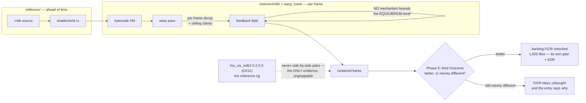

# 0142 — The MilkDrop import earns its verdict

> **Status:** approved
> **Created:** 2026-08-29
> **Owner skill(s):** dev, human
> **Related ADRs:** [0113](../adrs/0113-milkdrop-presets-are-translated-ahead-of-time-onto-a-warp-mesh-idiom.md)
> (accepted — this plan appends its third `Outcome`)
> **Closes:** design-backlog 0113, 0124. **0109 is not taken — this plan decides whether it may be.**

## TL;DR

`docs/design-backlog.md` entry 0113 is the **only High** in the backlog: the converted feedback field
equilibrates far brighter than the reference's, it is the dominant fidelity defect of the MilkDrop
import, and three hypotheses are already dead. Meanwhile ADR-0113's founding claim — *"the same
preset should look better here"* — has read **"provisionally negative"** since 2026-08-16 on evidence
that is now two plans and four ADRs old, because two look gates ran and neither produced a third
`Outcome`. This plan repairs the wash, then re-takes that verdict, and the verdict is what decides
whether backlog 0109's 1,826-file reach work is worth buying at all.

## Context & problem

These two entries are one plan because **each is the other's blocker.**

Backlog 0124 asks for a third `Outcome` on ADR-0113 and says honestly that a re-take today *"may
honestly still read merely different, with the wash dominating"* — because backlog 0113 is live,
having survived Plan 0111's bisect and reversed back to the field, and three of 0109 Phase 5's seven
pairs still read washed. So the verdict cannot be taken cleanly while the wash stands.

And backlog 0109 — disk textures, **1,826 files, 88.7 % of every conversion failure** — carries an
explicit ordering instruction: *"Do not take it before Plan 0108's Phase 2, whose verdict on whether
these presets read as better or merely different is exactly the evidence for how much reach is
worth."* That verdict has been taken twice and both times read **"still merely different"**. So the
reach work's own precondition is currently **unmet**, and the thing that would change it is the wash.

That chain is the plan: **fix the wash → re-take the verdict → the verdict decides 0109.**

What is already known about 0113, so nobody re-runs it: the warp pass has no mechanism bounding the
field's equilibrium level, only a per-frame decay and a ceiling clamp. Plan 0111 built an instrument,
ruled the field clean, and killed three hypotheses; the defect reversed back to the field afterward.
The evidence is seven side-by-side pairs against `foo_vis_milk2` 0.2.0.0 (DX11), recorded in Plan
0108's look-gate section — **it lives in no greppable line**, which is why the entry carries an
`unprobeable:`.

## Decision

**Instrument first, diagnose second, repair third, and only then judge.** Phases 1-2 rebuild and
extend the equilibrium instrument across the whole chain rather than at one seam, because three
hypotheses died at single seams already. Phase 3 is the repair. Phase 4 is the look gate against the
reference rig. Phase 5 writes ADR-0113's third `Outcome` — **which is a legitimate deliverable even
if the answer is still "merely different"**, dated and naming what remains, rather than leaving
2026-08-16's silence to stand for it. Phase 6 records the go/no-go for backlog 0109.

We rejected taking 0109 in this plan. Its own entry forbids it before the verdict, it *"wants an ADR
and an interview rather than a phase"*, and its four routes differ on a provenance question Plan 0100
Phase 8 deferred — *decide later, nothing third-party in the repository or a release* — which is the
same decision seen from two sides, since a texture is third-party content exactly as a preset is.

## Architecture diagram

## Implementation phases

### Phase 1 — The equilibrium instrument, across the whole chain
- **Owner skill:** dev
- **What:** Rebuild Plan 0111's instrument and extend it to measure the field's level at **every**
  seam of the chain, for a washed pair and a clean one.
- **Files touched:** `core/tests/` (the instrument), `core/src/render/scenes/warp_mesh/`.
- **Notes for the implementer:**
  - **Three hypotheses are already dead and the field was ruled clean once.** Do not re-run them;
    read Plan 0111's implementation log first and record which seams it already covered.
  - Measure in **linear light**, not code values. If [Plan 0137](done/0137-the-metrics-measure-light.md)
    has landed, use its level statistic rather than writing a fourth private decode — that is exactly
    the duplication it exists to retire.
  - The defect is an **equilibrium**, not a frame: the field converges to the wrong level over time.
    A single-frame measurement is what makes a seam look clean, so the instrument must report a
    settled level over many frames.
  - Pair a washed preset with one that reads correctly. A measurement with no control cannot separate
    "this seam is bright" from "this preset is bright".
- **Done when:** the instrument reports a settled field level at each seam for both a washed and a
  clean preset, and the table is in the implementation log.

### Phase 2 — Name the mechanism
- **Owner skill:** dev
- **What:** Identify what sets the equilibrium, or state precisely that the instrument cannot see it.
- **Files touched:** `docs/design-backlog.md` (a dated update on 0113).
- **Notes for the implementer:**
  - The known fact is that only a per-frame decay and a ceiling clamp exist — **nothing bounds the
    equilibrium level**. A decay plus a source term has an equilibrium at `source / (1 - decay)`, so
    the candidates are the decay's units, the source's scale, or the clamp interacting with both.
  - Backlog 0121 (closed) found MilkDrop's `decay` read as a per-second value when it is per-frame —
    **that was corrected, and it silently corrupted Plan 0109 Phase 4's own instrument and every
    measurement before it.** Any historical number predating that fix is suspect; re-measure rather
    than citing.
  - **A phase that ends "the instrument cannot see it" is a legitimate outcome** and stops the plan
    honestly at Phase 5, which then writes an Outcome saying the claim is not yet answerable. That is
    better than a speculative repair.
- **Done when:** backlog 0113 carries a dated update naming the mechanism with the measurement behind
  it, or stating what was ruled out and what instrument would be needed next.

### Phase 3 — Bound the equilibrium
- **Owner skill:** dev
- **What:** Repair the mechanism Phase 2 named.
- **Files touched:** `core/src/render/scenes/warp_mesh/`.
- **Notes for the implementer:**
  - **Runs only if Phase 2 named a mechanism.** If it did not, skip to Phase 5 and say so.
  - This moves converted-preset output by design, so **the goldens covering `warp_mesh` will move**.
    Bless deliberately and state which baselines moved and why. Nothing outside `warp_mesh` should
    move; anything that does is a finding.
  - `warp_mesh` ships no preset of its own, so the visible surface is converted `.milk` content plus
    whatever fixture the suite uses — check what the golden set actually covers before assuming a
    moved baseline is expected.
- **Done when:** the washed pairs' settled field level lands within the reference's, measured by
  Phase 1's instrument, and the moved goldens are blessed with reasons.

### Phase 4 — The look gate
- **Owner skill:** human
- **What:** Re-run the seven side-by-side pairs against the reference rig.
- **Files touched:** none.
- **Notes for the implementer:**
  - The rig is `foo_vis_milk2` 0.2.0.0 (DX11), and it reads only from
    `%APPDATA%\foobar2000-v2\milkdrop2\`. The same seven pairs, the same rig — comparability with
    0108's and 0109's gates is the whole value, so **do not change the pair set**.
  - 0109 Phase 5 read three of seven as **fixed**, including the portal and *Blur Mix 3*'s traces,
    and three still washed. Those three are the ones this plan is about.
  - **This needs a free machine and the rig staged.** Not a show-night task.
  - Record per-pair verdicts, not an overall impression — the per-pair table is what Phase 5 writes
    its Outcome from.
- **Done when:** a per-pair table exists for all seven, comparable to 0108's and 0109's.

### Phase 5 — ADR-0113's third Outcome
- **Owner skill:** dev
- **What:** Close backlog 0124. Append a dated `Outcome` to ADR-0113 recording the current verdict on
  its founding claim.
- **Files touched:** `docs/adrs/0113-milkdrop-presets-are-translated-ahead-of-time-onto-a-warp-mesh-idiom.md`.
- **Notes for the implementer:**
  - **This phase runs whatever Phases 2-4 produced.** Backlog 0124 is explicit: a re-take that still
    reads *"merely different, with the wash dominating"* is *"a perfectly good third Outcome"* — dated,
    naming what remains, and saying the claim is not yet answerable rather than leaving silence.
  - The ADR is accepted and **append-only**: a dated `Outcome` section, never an edit to the body.
    That is the ADR-0054 / ADR-0074 precedent.
  - Quote the load-bearing sentence being updated — *"merely different, not better"* — so a reader
    sees what moved.
  - `dev` writes the section; **the verdict itself is the user's from Phase 4.** Do not invent one.
- **Done when:** ADR-0113 carries a third dated `Outcome` citing Phase 4's per-pair table, and
  backlog 0124's premise — that no gate produced one — is false.

### Phase 6 — The reach decision
- **Owner skill:** dev
- **What:** Record whether backlog 0109 is now buyable.
- **Files touched:** `docs/design-backlog.md`, `docs/plans/README.md`.
- **Notes for the implementer:**
  - 0109's precondition is a verdict that converted presets are **worth having more of**. Two gates
    have said "still merely different"; Phase 4 is the third.
  - **If the verdict is better:** 0109 is unlocked and wants **its own plan with an ADR and an
    interview** — its four routes (user's own `textures/` directory; procedural substitution; a
    curated shipped set; keep the exclusion and stop calling it a corner) differ on the provenance
    question Plan 0100 Phase 8 deferred, not on mechanism. Do not start it here.
  - **If the verdict is still merely different:** say so on 0109 with the date, so the third
    "unbought" is recorded rather than the entry looking merely un-picked-up.
  - Either way, note that 0109 sits **above** backlog 0108 by its own arithmetic — ~1,826 files
    against ~71, a 25x difference — so if reach is ever bought, this is the one to buy.
- **Done when:** backlog 0109 carries a dated go/no-go with the verdict behind it, and the plans
  README's MilkDrop sequencing note reflects it.

## Risks & open questions

- **Phase 2 may not name a mechanism**, and this is the likeliest way the plan underdelivers. Three
  hypotheses are already dead and the field was ruled clean once before reversing back to it. The
  plan is built to stop honestly at Phase 5 rather than ship a speculative repair.
- **The only evidence is a human look against an external reference**, which no CI can run and no
  probe can hold — hence 0113's `unprobeable:`. Every verdict here is a judgement, and the mitigation
  is that the pair set and rig are fixed so verdicts are comparable across four gates.
- **Any measurement predating backlog 0121's fix is suspect.** The `decay` units bug corrupted Plan
  0109 Phase 4's own instrument. Re-measure; do not cite historical numbers.
- **Phases 1, 3 and 4 need a free GPU and the reference rig staged.** This is the least
  show-compatible plan on the roster.
- **A "still merely different" verdict is a real possible outcome of the whole plan**, and it would
  leave the import's founding claim unvindicated after five plans. That is information worth having,
  and it is what Phase 5 exists to record.

## What this plan does NOT do

- **It does not take backlog 0109.** Phase 6 decides whether it may be taken; the work itself is a
  separate plan with an ADR and an interview.
- **It does not take backlog 0108** (the conversion tail — HLSL arrays, ~71 files, and 218 MD2
  presets that convert but render blank). It is 25x smaller than 0109 by 0109's own arithmetic and
  waits behind it.
- **It does not reopen ADR-0113's translation approach.** Phase 5 records the verdict on its
  motivating claim; superseding the decision would be a new ADR and is not in scope.
- **It does not change the converter.** Everything here is runtime — `core/src/milk/` and
  `warp_mesh` — not `milkconv/`.
