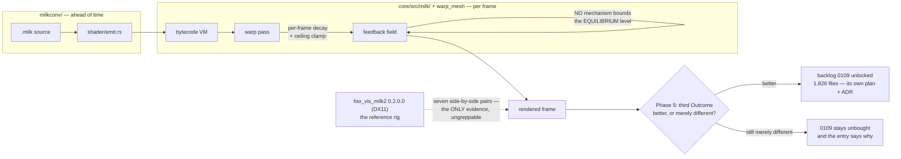

# 0142 — The MilkDrop import earns its verdict

> **Status:** in-progress
> **Created:** 2026-08-29
> **Owner skill(s):** dev, human
> **Related ADRs:** [0113](../adrs/0113-milkdrop-presets-are-translated-ahead-of-time-onto-a-warp-mesh-idiom.md)
> (accepted — this plan appends its third `Outcome`)
> **Closes:** design-backlog 0113, 0124. **0109 is not taken — this plan decides whether it may be.**
> **Runs after:** [Plan 0180](done/0180-the-converted-picture-follows-the-source.md), all of it.

> **Amended 2026-09-14**, at a validity sweep of the active roster. Edited in place:
>
> - **Sequencing.** Plan 0180 runs first. It re-draws the waveform, which is a source term of the
>   field this plan measures, and it re-draws the pictures Phase 4 judges.
> - **Phase 1.** It extends the instrument Plan 0111 left in `core/src/render/milk_wash.rs` rather
>   than rebuilding it. It reads that module's `edge` statistic, not `metrics::mean_lit_level`,
>   which excludes the background by design.
> - **Decision.** It names the source commit, `xeiraex/milkdrop2` `d4c843a`. Plan 0173 did not read
>   the feedback loop, so Phase 2's read is still new.
> - **Phase 2.** It names the source's aspect-corrected uv chain as a candidate cause (backlog 0214).
> - **Phase 4.** It gains a "seam present?" column (backlog 0215) and one unit-scale mode-0 capture
>   for ADR-0199.
> - **Phase 5.** Its `Outcome` names backlog 0216's residue if any remains.
> - **Phase 6.** It re-ranks backlog 0108, whose 0106/0107 gate has expired.

> **Amended 2026-09-16, at [Plan 0180](done/0180-the-converted-picture-follows-the-source.md)'s
> close. That plan landed, and it moved this plan's measurement subject, not just its pictures.**
> The 2026-09-14 amendment above anticipated the waveform being redrawn. Two things it did not:
>
> - **The deposit term is gone from both `milk_wash` fixtures.** Plan 0180 Phase 7 found that
>   `milkconv` emitted a `[params]` comment saying the scene's deposit stayed off and never emitted
>   the key, so `DEFAULT_DEPOSIT = 1.6` laid a ring into every converted preset; it now binds
>   `deposit = "0.0"`, and `milk_wash_fog_tunnel.toml` and `milk_wash_blur_mix_3.toml` bind it too.
>   **Phase 1's settled level is therefore a different number from every reading in this repository
>   that predates 2026-09-16**, and Phase 2's `source / (1 - decay)` arithmetic is taken on a field
>   with one fewer source term. Re-measure; cite no historical figure.
> - **The clean control has no wash left to measure.** The bisect probe now reads
>   `blur mix 3` at **exactly `0.00000000`** at all three seams, where it read
>   `0.0202 / 0.0885 / 0.2521` before. *Fog Tunnel* keeps a residue (`0.1304`, down from `0.2972`),
>   and that residue is backlog 0113 proper. A control that is exactly zero cannot bound anything by
>   ratio, so Phase 1 may need a second control or a stated reason it does not.
>
> Phase 4's rig session also inherits two questions from that plan:
> [ADR-0199](../adrs/0199-a-converted-waveform-draws-the-sources-figure-at-the-hosts-scale.md)'s
> unit-scale mode-0 capture (its `k` is confirmed on mode 6 alone) and whether the reference shows
> the seam at all.

## TL;DR

`docs/design-backlog.md` entry 0113 is the **only High** in the backlog: the converted feedback field
equilibrates far brighter than the reference's, it is the dominant fidelity defect of the MilkDrop
import, and three hypotheses are already dead. Meanwhile ADR-0113's founding claim — *"the same
preset should look better here"* — has read **"provisionally negative"** since 2026-08-16 on evidence
that is now two plans and four ADRs old, because two look gates ran and neither produced a third
`Outcome`. This plan repairs the wash, then re-takes that verdict, and the verdict is what decides
whether backlog 0109's 1,826-file reach work is worth buying at all.

## Context & problem

These two entries are one plan because **each is the other's blocker.**

Backlog 0124 asks for a third `Outcome` on ADR-0113 and says honestly that a re-take today *"may
honestly still read merely different, with the wash dominating"* — because backlog 0113 is live,
having survived Plan 0111's bisect and reversed back to the field, and three of 0109 Phase 5's seven
pairs still read washed. So the verdict cannot be taken cleanly while the wash stands.

And backlog 0109 — disk textures, **1,826 files, 88.7 % of every conversion failure** — carries an
explicit ordering instruction: *"Do not take it before Plan 0108's Phase 2, whose verdict on whether
these presets read as better or merely different is exactly the evidence for how much reach is
worth."* That verdict has been taken twice and both times read **"still merely different"**. So the
reach work's own precondition is currently **unmet**, and the thing that would change it is the wash.

That chain is the plan: **fix the wash → re-take the verdict → the verdict decides 0109.**

What is already known about 0113, so nobody re-runs it: the warp pass has no mechanism bounding the
field's equilibrium level, only a per-frame decay and a ceiling clamp. Plan 0111 built an instrument,
ruled the field clean, and killed three hypotheses; the defect reversed back to the field afterward.
The evidence is seven side-by-side pairs against `foo_vis_milk2` 0.2.0.0 (DX11), recorded in Plan
0108's look-gate section — **it lives in no greppable line**, which is why the entry carries an
`unprobeable:`.

## Decision

**Instrument first, diagnose second, repair third, and only then judge.** Phase 1 extends the
equilibrium instrument Plan 0111 left in `core/src/render/milk_wash.rs`, and Phase 2 reads the
source against it. Three hypotheses died at single seams already. Phase 3 is the repair. Phase 4 is the look gate against the
reference rig. Phase 5 writes ADR-0113's third `Outcome` — **which is a legitimate deliverable even
if the answer is still "merely different"**, dated and naming what remains, rather than leaving
2026-08-16's silence to stand for it. Phase 6 records the go/no-go for backlog 0109.

We rejected taking 0109 in this plan. Its own entry forbids it before the verdict, it *"wants an ADR
and an interview rather than a phase"*, and its four routes differ on a provenance question Plan 0100
Phase 8 deferred — *decide later, nothing third-party in the repository or a release* — which is the
same decision seen from two sides, since a texture is third-party content exactly as a preset is.

**Revised 2026-09-11: Phase 2 reads the source before it infers.** MilkDrop 2's source was released
under BSD-3-Clause on 2013-05-13 and is public, with the feedback loop in `vis_milk2/milkdropfs.cpp`.
Every earlier attempt on 0113 inferred the reference's behaviour from pictures, because no source was
reachable. Phase 2 now derives the equilibrium the reference's own warp, decay, echo and gamma path
implies for a preset with no warp shader (all five washed presets are that kind), and compares it with
our measured field — *Fog Tunnel*'s background reads 0.298 linear at the field. It repairs only a
divergence that arithmetic names, and stops as written if there is none. Nothing from the source is
copied into the repository.

**The commit is named.** [Plan 0173](done/0173-the-milkdrop-geometry-reads-the-source.md) read
`xeiraex/milkdrop2` at `d4c843a` (v2.25c) for the mesh's `ang` and the waveform, and this plan reads
the same commit. **Plan 0173 did not read the feedback loop**, meaning the decay, echo, gamma and
their order and domain. Its log says so, and Phase 2's read is still new work.

**Plan 0180 runs first, and why (added 2026-09-14).** That plan makes three changes:

- It re-draws the built-in waveform from the source.
- It aspect-corrects the per-vertex `x`/`y` a converted program reads.
- It gives the comp stage the source's polar pair.

The waveform is a **source term** of the equilibrium this plan computes. `milk_wash.rs` renders *Fog
Tunnel* (mode 0) and *Blur Mix 3* (mode 6) on a silent frame, where mode 0's resting circle still
deposits light. And every change above moves the pictures Phase 4 judges. Plan 0180 needs no rig, so
the ordering costs this plan no rig time.

## Architecture diagram



## Implementation phases

### Phase 1 — The equilibrium instrument, across the whole chain
- **Owner skill:** dev
- **What:** Extend the instrument Plan 0111 left behind so it measures the settled field level at
  every seam of the chain, for a washed subject and a clean one, on the tree Plan 0180 produced.
- **Files touched:** `core/src/render/milk_wash.rs` (the three-seam bisect,
  `the_wash_bisect_reports_every_seam`); its fixtures `core/tests/fixtures/milk_wash_fog_tunnel.toml`
  and `milk_wash_blur_mix_3.toml`; `FieldTrace` in `core/src/render/scenes/warp_mesh/tests.rs`, the
  per-frame field probe.
- **Notes for the implementer:**
  - **The instrument exists, and so does the pair.** `milk_wash.rs` already renders the washed *Fog
    Tunnel* and the clean control *Blur Mix 3* for 300 frames, three of the ~100-frame time
    constants Plan 0111 Phase 1 measured. It reads one statistic at every seam that exists for these
    subjects: the field, the present pass and the display. Its module docs say why the backdrop and
    bloom seams collapse for them. **Extend it; do not rebuild it.** Read its dated table and the
    Plan 0111 log first, and record which seams it already covered.
  - **Its readings predate Plan 0180.** That plan re-draws mode 0's resting circle, which these
    fixtures deposit even on a silent frame. Re-take the table rather than citing the 2026-08-19
    one.
  - Measure in **linear light**, not code values, **with `milk_wash`'s `edge` statistic**, the mean
    over the outermost ring of texels of an `Rgba16Float` intermediate. Do **not** use Plan 0137's
    `metrics::mean_lit_level`: it decodes 8-bit captures and excludes the background by design, and
    its own doc states the blind spot, *"a preset that goes wrong by changing its background is
    invisible here"*. The wash is a background defect in a float field. `edge` has its own caveat
    for *Fog Tunnel*, since it may sample the solid tube that is the defect. Carry that caveat
    forward rather than dropping it.
  - The defect is an **equilibrium**, not a frame: the field converges to the wrong level over time.
    A single-frame measurement is what makes a seam look clean, so the instrument must report a
    settled level over many frames.
  - Pair a washed preset with one that reads correctly. A measurement with no control cannot separate
    "this seam is bright" from "this preset is bright".
- **Done when:** the instrument reports a settled field level at each seam for both a washed and a
  clean preset, and the table is in the implementation log.

### Phase 2 — Name the mechanism
- **Owner skill:** dev
- **What:** Identify what sets the equilibrium, or state precisely that the instrument cannot see it.
- **Files touched:** `docs/design-backlog.md` (a dated update on 0113).
- **Notes for the implementer:**
  - **Start from the reference's source** (revised 2026-09-11, see Decision). Write down its per-frame
    arithmetic for the built-in warp path — decay, echo, gamma, the order they apply in and the domain
    each multiplies in (8-bit encoded or linear) — and the equilibrium it implies for *Fog Tunnel*'s
    bundle. Compare that with Phase 1's settled level. A divergence the arithmetic names is Phase 3's
    target; no divergence is the honest stop this phase already allows. Cite file, function, line and
    commit, and copy nothing.
  - **A named candidate that is not level: the uv chain's space.** The source runs zoom, `sx`/`sy`,
    rotation and `dx`/`dy` in an aspect-corrected space it undoes at the end
    (`milkdropfs.cpp` `CPlugin::ComputeGridAlphaValues`, l.1839-1916, backlog 0214). *Fog Tunnel*'s
    defect reads as a solid tube where the reference draws discrete rings, and that could be
    geometry as easily as brightness: a resample landing on the wrong texels fills the gaps between
    rings. Plan 0180 Phase 1 records whether this engine's chain (`vs_main` in
    `core/src/render/scenes/warp_mesh/shaders.rs`) matches, and Phase 3 repairs any stage it names.
    Read that log before attributing the tube to level. The per-frame `decay` exponent is applied in
    `upload_uniforms` (`warp_mesh/encode.rs`) since the scene's `mod.rs` was split on 2026-09-02.
  - The known fact is that only a per-frame decay and a ceiling clamp exist — **nothing bounds the
    equilibrium level**. A decay plus a source term has an equilibrium at `source / (1 - decay)`, so
    the candidates are the decay's units, the source's scale, or the clamp interacting with both.
  - Backlog 0121 (closed) found MilkDrop's `decay` read as a per-second value when it is per-frame —
    **that was corrected, and it silently corrupted Plan 0109 Phase 4's own instrument and every
    measurement before it.** Any historical number predating that fix is suspect; re-measure rather
    than citing.
  - **A phase that ends "the instrument cannot see it" is a legitimate outcome** and stops the plan
    honestly at Phase 5, which then writes an Outcome saying the claim is not yet answerable. That is
    better than a speculative repair.
- **Done when:** backlog 0113 carries a dated update naming the mechanism with the measurement behind
  it, or stating what was ruled out and what instrument would be needed next.

### Phase 3 — Bound the equilibrium
- **Owner skill:** dev
- **What:** Repair the mechanism Phase 2 named.
- **Files touched:** `core/src/render/scenes/warp_mesh/`.
- **Notes for the implementer:**
  - **Runs only if Phase 2 named a mechanism.** If it did not, skip to Phase 5 and say so.
  - This moves converted-preset output by design, so **the goldens covering `warp_mesh` will move**.
    Bless deliberately and state which baselines moved and why. Nothing outside `warp_mesh` should
    move; anything that does is a finding.
  - `warp_mesh` ships no preset of its own, so the visible surface is converted `.milk` content plus
    whatever fixture the suite uses — check what the golden set actually covers before assuming a
    moved baseline is expected.
- **Done when:** the washed pairs' settled field level lands within the reference's, measured by
  Phase 1's instrument, and the moved goldens are blessed with reasons.

### Phase 4 — The look gate
- **Owner skill:** human
- **What:** Re-run the seven side-by-side pairs against the reference rig.
- **Files touched:** none.
- **Notes for the implementer:**
  - The rig is `foo_vis_milk2` 0.2.0.0 (DX11), and it reads only from
    `%APPDATA%\foobar2000-v2\milkdrop2\`. The same seven pairs, the same rig — comparability with
    0108's and 0109's gates is the whole value, so **do not change the pair set**.
  - 0109 Phase 5 read three of seven as **fixed**, including the portal and *Blur Mix 3*'s traces,
    and three still washed. Those three are the ones this plan is about.
  - **This needs a free machine and the rig staged.** Not a show-night task.
  - Record per-pair verdicts, not an overall impression — the per-pair table is what Phase 5 writes
    its Outcome from.
  - **Add a "seam present?" column** for *Aderrasi - Songflower (Moss Posy)* and *Eo.S. + Phat -
    chasers 19 Portal*, in both renderers (backlog 0215). Plan 0180 Phase 4 owns the diagnosis and
    has already located the seam's ray on this engine. What only this session can say is whether the
    reference shows the same seam: a left-edge seam in both is authored-against. Record it; do not
    diagnose here.
  - **One extra capture for ADR-0199:** a purpose-authored unit-scale `nWaveMode = 0` preset
    (`fWaveScale = 1`, `fWaveSmoothing = 0`, neutral warp, thin white line on black), on the same
    full-scale 200 Hz sine Plan 0127 used for mode 6. Record the circle's radius swing in frame
    heights. It confirms or refutes that one host factor, fitted on mode 6, carries to the other
    modes. It is recorded here and written into ADR-0199 as an `Outcome`; it is not a verdict on
    this plan's pairs.
- **Done when:** a per-pair table exists for all seven, comparable to 0108's and 0109's, with the
  seam column filled for the two seam presets and the mode-0 reading recorded.

### Phase 5 — ADR-0113's third Outcome
- **Owner skill:** dev
- **What:** Close backlog 0124. Append a dated `Outcome` to ADR-0113 recording the current verdict on
  its founding claim.
- **Files touched:** `docs/adrs/0113-milkdrop-presets-are-translated-ahead-of-time-onto-a-warp-mesh-idiom.md`.
- **Notes for the implementer:**
  - **This phase runs whatever Phases 2-4 produced.** Backlog 0124 is explicit: a re-take that still
    reads *"merely different, with the wash dominating"* is *"a perfectly good third Outcome"* — dated,
    naming what remains, and saying the claim is not yet answerable rather than leaving silence.
  - The ADR is accepted and **append-only**: a dated `Outcome` section, never an edit to the body.
    That is the ADR-0054 / ADR-0074 precedent.
  - Quote the load-bearing sentence being updated — *"merely different, not better"* — so a reader
    sees what moved.
  - `dev` writes the section; **the verdict itself is the user's from Phase 4.** Do not invent one.
  - **Name what is still different that is not the wash**, so a "merely different" verdict is not
    blamed on the wash alone. That means whatever Plan 0180 left open or stopped on (backlog 0216's
    waveform contract, including the mono stand-in if its Phase 5 stopped; 0215's seam if its ray
    matched neither branch), plus anything the seam column or the mode-0 capture turned up.
- **Done when:** ADR-0113 carries a third dated `Outcome` citing Phase 4's per-pair table, and
  backlog 0124's premise — that no gate produced one — is false.

### Phase 6 — The reach decision
- **Owner skill:** dev
- **What:** Record whether backlog 0109 is now buyable.
- **Files touched:** `docs/design-backlog.md`, `docs/plans/README.md`.
- **Notes for the implementer:**
  - 0109's precondition is a verdict that converted presets are **worth having more of**. Two gates
    have said "still merely different"; Phase 4 is the third.
  - **If the verdict is better:** 0109 is unlocked and wants **its own plan with an ADR and an
    interview** — its four routes (user's own `textures/` directory; procedural substitution; a
    curated shipped set; keep the exclusion and stop calling it a corner) differ on the provenance
    question Plan 0100 Phase 8 deferred, not on mechanism. Do not start it here.
  - **If the verdict is still merely different:** say so on 0109 with the date, so the third
    "unbought" is recorded rather than the entry looking merely un-picked-up.
  - Either way, note that 0109 sits **above** backlog 0108 by its own arithmetic — ~1,826 files
    against ~71, a 25x difference — so if reach is ever bought, this is the one to buy.
  - **Re-rank backlog 0108 in the same edit.** Its priority line reads Low "until 0106/0107 land",
    and both are archived, so that gate has expired and the line points at nothing. Give it a dated
    update tying its priority to this phase's verdict, behind 0109. Its 218 "convert but render
    blank" count predates every fidelity plan since and is un-recounted; say so rather than restating
    it.
- **Done when:** backlog 0109 carries a dated go/no-go with the verdict behind it, backlog 0108 a
  dated re-rank against it, and the plans README's MilkDrop sequencing note reflects both.

## Risks & open questions

- **Phase 2 may not name a mechanism**, and this is the likeliest way the plan underdelivers. Three
  hypotheses are already dead and the field was ruled clean once before reversing back to it. The
  plan is built to stop honestly at Phase 5 rather than ship a speculative repair.
- **The only evidence is a human look against an external reference**, which no CI can run and no
  probe can hold — hence 0113's `unprobeable:`. Every verdict here is a judgement, and the mitigation
  is that the pair set and rig are fixed so verdicts are comparable across four gates.
- **Any measurement predating backlog 0121's fix is suspect.** The `decay` units bug corrupted Plan
  0109 Phase 4's own instrument. Re-measure; do not cite historical numbers.
- **Phases 1, 3 and 4 need a free GPU and the reference rig staged.** This is the least
  show-compatible plan on the roster.
- **Starting before Plan 0180 closes takes Phase 1's table on figures that plan will change.** If it
  happens anyway, the log says so, and Phase 1 re-takes the table after 0180 lands.
- **A "still merely different" verdict is a real possible outcome of the whole plan**, and it would
  leave the import's founding claim unvindicated after five plans. That is information worth having,
  and it is what Phase 5 exists to record.

## What this plan does NOT do

- **It does not take backlog 0109.** Phase 6 decides whether it may be taken; the work itself is a
  separate plan with an ADR and an interview.
- **It does not take backlog 0108** (the conversion tail — HLSL arrays, ~71 files, and 218 MD2
  presets that convert but render blank). It is 25x smaller than 0109 by 0109's own arithmetic and
  waits behind it.
- **It does not reopen ADR-0113's translation approach.** Phase 5 records the verdict on its
  motivating claim; superseding the decision would be a new ADR and is not in scope.
- **It does not change the converter.** Everything here is runtime — `core/src/milk/` and
  `warp_mesh` — not `milkconv/`. The one converter fidelity fix in view, the comp stage's `rad`/`ang`
  (backlog 0214), is Plan 0180 Phase 2.
- **It does not repair the seam or the waveform** (backlog 0215, 0216). Plan 0180 owns both; this
  plan only records what the reference shows.

## Implementation log

> Written by `dev` — one row per phase as that phase's commit lands, and the close block after the
> last one. **The phases above are the contract; everything here is what happened.**

**Lane:** `WORK/rlx-plan-0142`, on `plan-0142-the-milkdrop-import-earns-its-verdict`

| phase | owner | state | commit |
|---|---|---|---|
| 1 — The equilibrium instrument | dev | done | `20ba8731` |
| 2 — Name the mechanism | dev | done | `cc2488cd` |
| 3 — Bound the equilibrium | dev | done | `42b4bb97` |
| 4 — The look gate | human | done | `15514a8a` |
| 5 — ADR-0113's third Outcome | dev | done | committed with this row |
| 6 — The reach decision | dev | not started | |

### Phase 1 — the re-taken table

Dev box (hardware adapter), 128x128, `AnalysisFrame::default()`, quantizer at
`DEFAULT_QUANTIZE_STEPS = 255`. `edge` in linear light at A and B, display-referred at E. `settled`
is the mean over f100/f200/f300 and `spread` its half-spread as a fraction of that mean.

```text
  subject      seam               f30          f100          f200          f300       settled  spread
  fog tunnel   A field     0.09276785    0.13548748    0.14085685    0.13043343    0.13559258   3.84%
  fog tunnel   B present*  0.17703269    0.25443807    0.26188728    0.24317567    0.25316700   3.70%
  fog tunnel   E display   0.33025211    0.40570471    0.41156110    0.39624831    0.40450469   1.89%
  blur mix 3   A field     0.00000000    0.00000000    0.00000000    0.00000000    0.00000000   0.00%
  blur mix 3   B present*  0.00000000    0.00000000    0.00000000    0.00000000    0.00000000   0.00%
  blur mix 3   E display   0.00000000    0.00000000    0.00000000    0.00000000    0.00000000   0.00%

  present-pass gain B/A on the settled level: fog tunnel 1.867, blur mix 3 n/a
  * B is also seams C and D: no post stage is active and the backdrop is unbound
```

Seams covered before this phase: A, B (collapsed with C and D) and E, each at one frame count
(300). What the phase added is the checkpoint set, the settled band and its spread, the transient
probe at f30, and the present-pass gain.

- **The washed level is not stationary at any frame.** f200 is the highest of the three band
  readings, so the residual is not a residual climb; the band is +-3.8 % at the field.
- **The control reads exactly `0.00000000` at every seam and every checkpoint**, f30 included, so
  the washed/control ratio the earlier bisect was built on has no value at any seam.

### Phase 3 — the same table, after the repair

Same box, same fixture, same statistic as Phase 1's table above.

```text
  subject      seam           Phase 1        Phase 3   ratio
  fog tunnel   A field     0.13559258     0.08623820   1.572
  fog tunnel   B present*  0.25316700     0.16459735   1.538
  fog tunnel   E display   0.40450469     0.32970616   1.227
  blur mix 3   every seam  0.00000000     0.00000000   n/a

  present-pass gain B/A on the settled level: 1.867 -> 1.909
```

The undeposited-fade probe, in the reference's own encoded domain over the same
2.650 s window: `0.3034` before, `0.1948` after, against the reference's
arithmetic `0.2007` — **-2.9 %**, where a pure-linear multiply predicts `0.4819`.

### Phase 4 — the look gate, as run (2026-09-18)

`foo_vis_milk2` 0.2.0.0 (DX11) in foobar2000 v2 beside this lane's release build (`42b4bb97`,
reported as 0.129.0), one track through foobar2000 feeding both, ours taking it over loopback at
164-165 fps. The seven were re-converted by `milkconv` at `main` 0.131.0 into `WORK/rlx-gate-0142/`
and loaded through `RLX_PRESET_DIR`; that directory also holds the fixture and stimulus below and is
outside the repository, as Plan 0127's material is. **Verdicts are the owner's, taken live.**

| pair | verdict | what dominates | seam |
|---|---|---|---|
| *chasers 19 Portal* | washed | ground saturates to near-white; the traces survive under it | **none in either** |
| *Blur Mix 3* (control) | washed | traces horizontal and correct; ground grey with blown blobs, not black | n/a |
| *Songflower (Moss Posy)* | wrong, and not on brightness | the reference's woven lattice is **absent**: ours draws the bare grid with no nesting | **none in either** |
| *Cauldron painterly 5* | better, centre blown | terrain and spiro both read; the core clips white |  n/a |
| *Contortion (Escher's Tunnel Mix)* | good | sphere, tunnel and arcs all read; ground comparable | n/a |
| *Cosmic Dust 2* | good, ours darker | ours is **sparser** than the reference rather than brighter | n/a |
| *Fog Tunnel* | **fixed** | black ground, tube reads against the reference's structure | n/a |

**The plan's own subject moved:** *Fog Tunnel* read "still washed" at both earlier gates and now
reads fixed. **Hue is ruled out of every verdict** — both renderers animate their palettes off their
own clock, so two stills sit at different palette phases; that is why *Contortion* and *Cosmic
Dust 2* read good against obviously different colour.

**The mode-0 capture (ADR-0199) does not confirm what that ADR asks it to.**
`!LMV-0142-mode0-unit.milk` is `!LMV-0127-A-crisp.milk` with `nWaveMode` 6 -> 0 and nothing else
moved, over a 60 s full-scale 200 Hz sine verified at 0.0 dBFS peak / -3.0 dB mean, at 2000x1125 —
Plan 0127's own size. Radius is taken about the trace's own bounding-box centre, because the figure
translates between frames, over 720 angle bins. Swing at thresholds 140 and 200: **0.1366 / 0.1364 H
over a 0.3055 H base radius** (the reading of record), corroborated by a second capture at
0.1295 / 0.1288 H over 0.3067 H — stable to ~0.5 % on both. For `r(theta) = R0 + k*s(theta)` with
`s` in `[-1, 1]` the swing is `2k`, so **`k ~ 0.068`** against the **`0.158`** Plan 0127 derived from
mode 6 on this same rig and stimulus, a ratio of **0.43**. ADR-0199's Negative calls modes 0-5
sharing mode 6's gap *"an inference from where the gap lives, not a measurement"*; this does not
support it. **Bound:** MilkDrop gains the waveform before drawing, so full-scale input is not
necessarily a unit sample at the draw call — which weakens the absolute `k`, not the ratio.

### Notes

- **Phase 3's done-when is not measurable as stated, and what was measured
  instead.** It reads *"the washed pairs' settled field level lands within the
  reference's, measured by Phase 1's instrument"*, and there is no instrument on
  the reference: it is an external renderer, which is why backlog 0113 carries an
  `unprobeable:`. What is measurable is the loop's own per-frame factor, and that
  is what the repair matches — `the_field_fades_at_the_references_own_rate`
  asserts the field's fade against `d^T`, the reference's arithmetic, and
  `the_converted_decay_is_truncated_on_the_nominal_frame` asserts the factor
  itself against `(int)(fDecay*255)/255` at seven authored values. The settled
  levels are reported above rather than asserted.
- **Phase 2's arithmetic predicted a `2.6x` to `7.0x` fall at the field and the
  instrument read `1.572x`.** The prediction takes the equilibrium as
  `s / (1 - d)`, which assumes the warp resample's dominant eigenvalue is 1 — true
  of a still field, not of this subject. Solving the measured ratio for it gives
  about `0.948` at the edge ring, which is what *Fog Tunnel*'s `zoom = 1.042`
  does to light there. The mechanism and the direction stand; the magnitude was an
  upper bound on a still field and is not a prediction for this preset.
- **The repair's gate is `quantize_steps`, not the presence of a bundle**, and the
  first attempt used the latter. Under it both arms of
  `the_field_equilibrates_only_when_the_quantizer_runs` moved — its unquantized
  control converged (`0.2586` at f120 to `0.3553` at f300, under the probe's
  `1.5x` bar), so the probe would have been asserting that a field with an
  equilibrium has none. On `quantize_steps` both probes' OFF arms are unchanged to
  the digit against their recorded tables, and only the ON arms move.
- **Two comment blocks in `warp_mesh/tests.rs` were rewritten beyond the
  repair.** The first is the *"Dead hypothesis: the decay multiply's domain"*
  paragraph, which the repair makes false. The second is the *"live hypothesis"*
  paragraph beside it, which claimed the shader-`decay` gap *"predicts the look
  gate's own pattern: the five washed presets are shader presets"* — backlog
  0113's own 2026-08-19 census already recorded the inverse, and the source read
  settles it (`WarpedBlit_Shaders` applies no host decay either, so that path is
  not a divergence from the reference).
- **The converted-warp-shader path was not touched**, and it carries the same
  domain question: a preset whose HLSL says `ret *= decay` multiplies linear light
  here and encoded values there. It reaches 1 253 corpus files, none of them among
  the seven pairs, and it is noted under Followups rather than repaired.
- **Phase 1 took no second control**, which the 2026-09-16 amendment left as a choice against a
  stated reason. The reason is in `milk_wash.rs`'s module docs: a control at exactly zero rules an
  *additive* stage out of the whole chain, which is stronger than a ratio, and leaves a
  *multiplicative* stage invisible — bounded instead by the washed subject's own seam-to-seam gain,
  now printed. A third fixture would also not be one of the seven pairs the look gates judge.
- **`FieldTrace` in `warp_mesh/tests.rs` was listed under Files touched and was not changed.** It is
  the synthetic per-frame probe driven by an empty bundle, and nothing the re-taken table needed
  reached it.
- **Phase 2's dated update went to `docs/design-backlog-archive.md`, not to the
  `docs/design-backlog.md` its `Files touched` names.** Backlog 0113's body moved to the archive on
  2026-09-15 on promotion (ADR-0206), the day after the amendment that wrote that line; the live
  file carries no 0113 body to update. Nothing was added to the live file.
- **Phase 2 named a mechanism, so Phase 3 runs rather than skipping to Phase 5.** The reading is
  backlog 0113's `### Update 2026-09-17` in the archive: the reference's per-frame arithmetic with
  file, function and line, the two terms of the divergence, the bound each puts on it, and the one
  source-scale term the arithmetic does not settle.
- **`git` outside the lane is denied to this session**, so the source checkout's commit was not
  re-verified here; the read is of the tree at `WORK/milkdrop2-src`, which the owner's session
  recorded as `d4c843a`. The rig the look gate uses is the later `foo_vis_milk2` 0.2.0.0 DX11 port
  of the same project, and whether that port kept `D3DCOLOR_RGBA_01`'s truncation is not readable
  from this tree.

- **Phase 4 — what the session could not settle, with the test that would.** Ours ran at 164-165 fps
  against the rig's own frame cap. Transforms convert per second and the owner read the motion as
  matching, which tests that conversion; the **deposit is per frame and is not converted**, so a rate
  mismatch raises the field by `1/(1 - d)` — hardest on high-`fDecay` presets, which is the shape of
  the result above. Not settleable by eye: render one washed preset through `shot --render` at
  `--fps 30` and at `--fps 165` and compare the ground level.
- **Phase 4 — *Songflower*'s defect is not this plan's.** It sets `fDecay = 1.000`, so no decay runs
  and Phase 3's repair cannot reach it. It sets `fVideoEchoAlpha = 1.0` with `echo_zoom` and
  `echo_orient` driven from its per-frame code, and the reference's nested weave is that echo
  compositing the previous frame zoomed and flipped. The engine carries `echo_alpha`/`echo_zoom`/
  `echo_orient` as params, so the reading is "the echo is bound and is not producing the nesting" —
  a different finding from Plan 0108's "no video-echo stage".
- **Phase 4 — the seam question is answered negatively for both presets** (backlog 0215): none in the
  reference and none in ours. Plan 0180 Phase 4 located a ray on our side; nothing shown here had one.
- **Phase 5 — the mode-0 capture was not written into ADR-0199, and no phase's `Files touched` allows
  it.** Phase 4's note says the reading "is recorded here and written into ADR-0199 as an `Outcome`";
  Phase 4 is `human` with `Files touched: none` and Phase 5's list is ADR-0113 alone. ADR-0113's
  third `Outcome` carries the reading and the `0.43` ratio, so it is on the record; ADR-0199 still
  says its `k` rests on one mode and asks Plan 0142 for the confirmation. Under Followups.
- **Phase 5 — *Blur Mix 3* is read as the gate read it, and that is not reconciled with Phase 1's
  instrument.** It was the control at both earlier gates (Plan 0100: *"the one pair whose tone
  survived looked genuinely good"*; Plan 0109 Phase 5: traces fixed) and this gate reads its ground
  washed, while `milk_wash_blur_mix_3.toml` reads exactly `0.00000000` at every seam. The two are not
  the same subject — the fixture is a 128x128 silent frame of a cut-down bundle, the gate is the
  whole converted preset on a track — so nothing here contradicts, and nothing here explains it
  either. The Outcome states the verdict and does not attempt the reconciliation.

### Close triggers

_(filled at the last implementer phase)_

## Followups (after this lands)

- **The converted-warp-shader path applies `decay` in linear light too.** Phase 3
  repaired only the built-in fragment, gated on `quantize_steps`. A preset whose
  own HLSL says `ret *= decay` runs that multiply on this engine's linear field
  and on the reference's 8-bit one, which is the same domain divergence at the
  same `1/(1 - d)` amplification. 1 253 of the corpus's 8 162 warp-shader files
  name `decay`; none of the seven look-gate pairs is one, which is why it is here
  rather than in the phase. It is a `milk/shader.rs` epilogue question and it
  wants the reference on screen before it is answered.
- **ADR-0199 owes an `Outcome` for the mode-0 capture.** That ADR's Negative asks this plan's rig
  session for it and says *"Until one lands, this ADR says so"*. The capture landed (Phase 4's table:
  `k ~ 0.068` against `0.158`, ratio `0.43`, which does not support the inference) and is quoted in
  ADR-0113's third `Outcome`, but ADR-0199 itself was not edited: no phase of this plan lists it
  under `Files touched`. A one-section append is all it wants.
