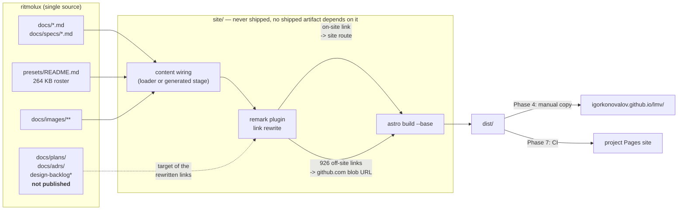

# 0143 — The documentation gets a front end

> **Status:** approved, **parked 2026-09-01**
> **Parked until:** the application's new name is chosen. The site bakes the project name into
> the Starlight title, the Pages subpath every published URL carries, and the header of every
> page — so publishing under `ritmolux` buys a full republish and a dead set of
> external links as soon as the rename lands. The rename is itself parked with a shortlist
> (Ritmolux, Clavilux) and no ADR or plan yet; **that decision is the named trigger for this one**.
> **Created:** 2026-08-30
> **Approved:** 2026-08-30 (user)
> **Owner skill(s):** dev, human
> **Related ADRs:** [0154](../adrs/0154-the-reader-facing-docs-publish-as-a-site.md)
> **Coordinates with:** [0103](0103-the-project-gets-an-audience.md) — that plan owns `README.md`
> and the repository front door; **this plan does not touch `README.md`**
> **Lane guidance:** build on `main` directly, **not** in a worktree. ADR-0053's default does not pay
> here: every phase but 5 is JavaScript, markdown and config, and a fresh worktree would buy a cold
> `target/` — ADR-0147 puts a lane at 8-18 GB — purely so Phase 5 can run `shot --release` once.
> Phases 1-4 and 6-7 touch no Rust at all. A parallel lane is live in `standalone/` on `main`, and
> this plan's paths (`site/`, `scripts/`, `docs/images/`, `.github/workflows/`) are disjoint from it
> — so stage by explicit path, as the hook already requires, and the two do not collide.

## TL;DR

The reader-facing documentation is about 1 MB of markdown whose largest file — the 264 KB parameter
roster at `presets/README.md` — can only be searched with find-in-page. This plan publishes that
subset as an Astro Starlight site with real search, leaving `docs/` untouched as the single source
and rewriting links at build time. The first visible result is a browsable, searchable roster at a
subpath of the existing personal GitHub Pages site, reached without configuring Pages on this
repository and without editing `.github/workflows/` at all.

## Context & problem

The user asked to explore better human-readable documentation, "kind of a git pages". Measured on
2026-08-30, the corpus is 6,714,932 bytes across 315 markdown files, and roughly 5.5 MB of that is
the working record — 154 ADRs, 144 plans, and 1.26 MB of backlog and plan archives — which is
written to be grepped by fresh skill sessions and is well served by staying plain files.

The problem is the other ~1 MB. `presets/README.md` is 263,729 bytes of per-system parameter tables,
and it is the catalogue the `preset-author` lane is deliberately pointed at *instead of* keeping a
copy of its own, because the private copies rotted while this file stayed current. It is read
non-linearly and it has no index. `docs/capturing.md` is 150,770 bytes, `docs/presets.md` — the
expression-language reference — is 75,355, and `docs/preset-palettes.md` is 63,867. None of these are
long from padding; they are long because they are complete.

**The technical problem is linking, not rendering.** The reader-facing set holds 1,059 relative
markdown links and 926 of them (87 %) point outside that set: 451 into `adrs/`, 387 into `plans/`,
87 into `design-backlog`, 1 into `specs/`. They cannot be rewritten in place — `check-doc-links.mjs`
requires them relative and resolving, it runs in `.githooks/pre-push` and CI's `links` job, and the
relative form is what makes these files navigable in an editor and on GitHub.

Two facts bound the work. Mermaid appears in exactly **one** file across the whole reader-facing
candidate set — `README.md`, which this plan does not publish — so diagram rendering is a non-issue.
And `IgorKonovalov/IgorKonovalov.github.io` already exists, is public, and is on default branch
`master`, while the project repository has no Pages site at all (`gh api .../pages` returns 404).

## Decision

Build the site with Astro Starlight per [ADR-0154](../adrs/0154-the-reader-facing-docs-publish-as-a-site.md),
keep `docs/` as the single source with all transformation in a build-time remark plugin, and stage
the hosting: a hand-copied build into a subdirectory of the personal user site first, a CI-deployed
project Pages site second. We rejected MkDocs Material (better technical fit — `docs_dir: docs` is
its default and it resolves `.md` links natively — but weaker presentation and no per-release
versioning) and mdBook (its `SUMMARY.md` / `src/` root would force `docs/` to move or be staged,
which is the split-source hazard itself).

The published set is the reader-facing subset only. Plans, ADRs, the design backlog and both
archives stay unpublished; links into them become absolute GitHub URLs.

## Architecture diagram

## The published set

Two entrances, per the interview. A file not listed here does **not** join the site by existing.

**Entrance A — Use it / author presets**

| Page | Source |
|---|---|
| Preset guide | `docs/preset-guide.md` |
| Expression language | `docs/presets.md` |
| Colour and palettes | `docs/preset-palettes.md` |
| Tuning walkthrough | `docs/preset-tuning-walkthrough.md` |
| Parameter roster | `presets/README.md` *(outside `docs/` — the loader must reach it)* |
| Gallery | generated, Phase 5 |

**Entrance B — Understand and build it**

| Page | Source |
|---|---|
| Non-functional requirements | `docs/nfr.md` |
| Headless capture and video | `docs/capturing.md` |
| Technique catalogue | `docs/generative-techniques-catalogue.md` |
| Diffusion filter | `docs/diffusion-filter.md` |
| On-device validation | `docs/on-device-validation.md` |
| Releasing | `docs/releasing.md` |
| C ABI contract | `docs/specs/0001-c-abi.md` |
| Ring determinism | `docs/specs/0002-ring-determinism.md` |

**Excluded — decided 2026-08-30 by the user, not an open question:** `docs/content-brief.md` (the
curation brief — internal intent rather than reader documentation) and `docs/roadmap-visual-richness.md`
(forward planning, which dates badly in public). Links into both are rewritten to GitHub like any
other off-site target. `dev` should not re-raise this.

## Implementation phases

### Phase 1 — the site renders the published set from one source
- **Owner skill:** dev
- **What:** An Astro Starlight project under `site/`, wired to read the published set **in place**
  from `docs/`, `docs/specs/` and `presets/README.md`, with `site: 'https://igorkonovalov.github.io'`
  and `base: '/lmv/'` set from the first build, and the two-entrance sidebar structure in place.
- **Files touched:** `site/package.json`, `site/astro.config.mjs`, `site/src/content.config.ts`,
  `site/README.md`, `.gitignore`.
- **Notes for `dev`:** prefer an Astro content-layer `glob` loader pointed at the repo's own
  directories, so no copy exists at all. **If the installed Starlight version will not accept a
  loader rooted outside its content directory, the fallback is a generated stage** — a build step
  that copies the published set into a git-ignored directory under `site/` on every build. That
  fallback is explicitly permitted by ADR-0154: the hazard is a second *source*, not a second file.
  Whichever mechanism is used, **no markdown file in `docs/` or `presets/` may be edited by this
  phase.**
- **Done when:** the dev server renders every page in the published set; `presets/README.md` appears
  as the roster page with its headings in the page navigation; `git status` shows no modification to
  any file under `docs/` or `presets/`; and `node scripts/check-doc-links.mjs` still exits 0.

### Phase 2 — links resolve across the publish boundary
- **Owner skill:** dev
- **What:** A remark plugin that rewrites every relative markdown link at build time — targets
  inside the published set become site routes, targets outside it become absolute
  `https://github.com/IgorKonovalov/ritmolux/blob/<ref>/<path>` URLs — plus a gate that
  checks the *built output*, because this is the one class of breakage the source cannot show.
- **Files touched:** `site/src/plugins/rewrite-links.mjs`, `site/astro.config.mjs`,
  `scripts/check-site-links.mjs`.
- **Notes for `dev`:** the pinned `<ref>` is a staleness surface either way (ADR-0154's Negative
  section) — pick one, and write the choice and its failure mode into the plugin's header comment.
  Relative image references into `docs/images/**` must survive the same pass.
- **Done when:** `scripts/check-site-links.mjs` exits 0 against a fresh build, asserting these three
  properties: **no `href` in the built output ends in `.md`**; every site-relative `href` resolves to
  a file that exists in the build output; and every rewritten off-site `href` is an absolute `https`
  URL. All three are exact — there is no threshold to tune. The check must also fail loudly when run
  against a build that has not happened, rather than passing vacuously on an empty directory.

### Phase 3 — the home page routes, and does not pitch
- **Owner skill:** dev
- **What:** The site landing page: a short hero, two entrance cards (A and B above), and a strip of
  the nine existing `docs/images/gallery/` renders.
- **Files touched:** `site/src/content/docs/index.mdx`, `site/src/styles/`.
- **Notes for `dev`:** **this page carries no product prose.** Plan 0103 Phase 2 owns the product
  pitch and it lives in `README.md`; duplicating it here creates the second copy ADR-0154 exists to
  prevent. Link to the repository for "what is this"; the site's job starts after the reader has
  decided to read.
- **Done when:** the landing page reaches both entrances and the repository in one click each, and
  contains no sentence copied from `README.md`.

### Phase 4 — the demo goes live on the personal site
- **Owner skill:** human
- **What:** Copy this repository's built `site/dist/` into **`public/lmv/`** of the
  `IgorKonovalov/IgorKonovalov.github.io` working copy, add one `.prettierignore` line there, commit
  and push to `master`, and report the URL.
- **Notes — verified against that repository on 2026-08-30:**
  - It is itself an **Astro 5.17.3** static site (MDX + sitemap, i18n `en`/`ru`), deployed by
    `.github/workflows/deploy.yml` on push to `main` or `master`, which runs `yarn build` and
    uploads `dist/` via `actions/upload-pages-artifact`. Its Pages `build_type` is `workflow`.
  - **The destination must be `public/`, not the repository root.** Pages there serves the *build
    artifact*, not the repository tree, and `public/**` is the only directory Astro copies verbatim
    into `dist/`. A folder dropped at the root would be committed and never published.
  - **No `.nojekyll` is needed and none should be added.** Jekyll never runs on a `workflow`-type
    Pages site, so Astro's `_astro/` asset directory is safe — the usual underscore trap does not
    apply here.
  - **One change is required in that repository:** add `public/lmv/` to its `.prettierignore`. Husky
    + lint-staged run `prettier --write` over `*.{js,css,…}` on commit, which would reformat the
    minified `_astro` bundle. ESLint is already safe — its flat config ignores `public/` outright.
  - Its `public/CNAME` contains `igorkonovalov.github.io`, the default Pages domain, and the Pages
    API reports `cname: null` — so there is no custom domain to account for.
  - Nothing in this phase touches *this* repository, so the `workflow` OAuth scope is not involved.
- **Done when:** `https://igorkonovalov.github.io/lmv/` serves the landing page, the roster page
  loads, typing a parameter name into the site search returns the roster entry for it, and the
  personal site's own pages still render — the demo must not disturb its host.

### Phase 5 — the gallery covers everything that ships
- **Owner skill:** dev
- **What:** Extend `scripts/docs-shots.mjs` to render one card image per shipped preset — 81 today
  across 12 families — and build a gallery page grouped by family. Renders are produced locally on
  the hardware GPU and committed, per the interview; no CI render cost.
- **Files touched:** `scripts/docs-shots.mjs`, `docs/images/gallery/presets/**`, the gallery page.
- **Notes for `dev`:** `docs-shots.mjs` currently asserts the gallery holds **exactly one image per
  `SystemKind::from_name`**, and refuses any write outside `docs/images/`. The per-preset set is a
  **second** collection — extend the manifest and its self-check to cover both without weakening the
  existing per-system invariant, and keep the write-refusal intact.
- **Done when:** the manifest's self-check fails if a shipped preset has no card or a card has no
  preset (the same shape as the existing per-system check), and the gallery page groups every card
  under its family.

### Phase 6 — the permanent home builds itself
- **Owner skill:** dev
- **What:** A `.github/workflows/pages.yml` that builds `site/` and deploys to the project
  repository's Pages, with `base` switched to the project path, plus a CI step that fails when the
  site does not build — the guard against the site silently falling behind `docs/`.
- **Files touched:** `.github/workflows/pages.yml`, `site/astro.config.mjs`.
- **Done when:** the workflow builds the site and runs `scripts/check-site-links.mjs` on the result,
  and a deliberately broken link in a scratch commit fails the job.

### Phase 7 — Pages is enabled and the demo is retired
- **Owner skill:** human
- **What:** Enable GitHub Pages on `ritmolux` with the Actions source, push the branch,
  confirm the deploy, and replace the `ritmolux/` copy on the personal site with a redirect or remove it.
- **Notes:** pushing Phase 6's workflow file **requires the `workflow` OAuth scope on the git
  credential**; without it the push is rejected. `gh auth refresh -s workflow` is the fix, and it is
  worth doing before the push rather than diagnosing the rejection after.
- **Done when:** the project Pages URL serves the site, and the personal-site copy no longer serves a
  divergent second version of it.

## Risks & open questions

- **The Starlight content-layer loader may not read outside its own tree.** Phase 1 names the
  fallback (a git-ignored generated stage) so this cannot block the plan; the risk is that `dev`
  discovers it late. Try the loader first, time-box it, take the fallback.
- **Two renderers, two results.** Anything GitHub tolerates and Astro does not becomes a defect
  visible on only one surface. Mermaid — the usual worst case — is absent from the published set, but
  tables, footnotes and raw HTML are not. Spot-check the four largest pages against their GitHub
  rendering during Phase 1.
- **`presets/README.md` is 264 KB on one route.** It is the whole point of the site and also the page
  most likely to be slow to build, slow to index, or awkward to navigate as a single document. If it
  needs splitting, **that is a docs restructuring decision and does not belong in this plan** —
  surface it and it becomes its own.
- **The pinned ref in 926 rewritten URLs.** A tag rots as documents move; `main` can 404 between a
  deploy and a later rename. Phase 2 picks one and documents the failure mode; neither is free.
- **The demo is stale by construction.** A hand-copied build diverges from `docs/` on the next commit.
  Acceptable for a demo, and it is exactly what Phase 6 pays off — but if Phases 6–7 stall, the demo
  URL becomes a confidently wrong second source. Retire it rather than let it drift.
- **First npm tree in this repository.** Every existing gate is a dependency-free `.mjs`. A lockfile
  and transitive dependencies are new maintenance, and a site build can break for reasons unrelated
  to any documentation change. ADR-0154 records this as the price of the generator choice.
- **The demo's host is a real site, not a scratch space.** `public/lmv/` lands inside a live personal
  site with its own build, lint and format hooks. The `.prettierignore` line is the known
  interaction; the general risk is that a large committed build directory slows or annoys that
  repository's own workflow. Phase 5's per-preset gallery makes this materially worse — if the demo
  is still the only home by then, prefer bringing Phases 6-7 forward over growing the copy.

## What this plan does NOT do

- **It does not touch `README.md`.** Plan 0103 owns the repository front door and its Phase 2 rewrite;
  this plan consumes the README as-is and links to it.
- **No promotional landing page and no custom domain.** ADR-0154 narrows Plan 0103's exclusion to
  permit a documentation site; it does not reverse the rest of it.
- **It does not publish plans, ADRs, the design backlog or either archive.** Links into them become
  GitHub URLs.
- **No per-release doc versioning.** Starlight supports it and it is a reason the generator was
  chosen, but a single current-version site ships first.
- **It does not restructure or split any existing document,** including the 264 KB roster.
- **It does not change `scripts/check-doc-links.mjs`** or any existing gate. The site adds a gate; it
  does not modify one.
- **No CI render cost for the gallery.** Renders are produced locally and committed.

## Implementation log

> Written by `dev` — one row per phase as that phase's commit lands, and the close block after the
> last one. **The phases above are the contract; everything here is what happened.**

**Lane:** _(to be filled by `dev`)_

| phase | owner | state | commit |
|---|---|---|---|
| 1 — the site renders the published set from one source | dev | not started | |
| 2 — links resolve across the publish boundary | dev | not started | |
| 3 — the home page routes, and does not pitch | dev | not started | |
| 4 — the demo goes live on the personal site | human | not started | |
| 5 — the gallery covers everything that ships | dev | not started | |
| 6 — the permanent home builds itself | dev | not started | |
| 7 — Pages is enabled and the demo is retired | human | not started | |

### Notes

_(to be filled by `dev`)_

### Close triggers

- **`presets/` touched:** _(to be filled)_
- **Plan header `Closes:`** none
- **What shipped:** _(to be filled)_
- **Operator docs touched:** _(to be filled)_
- **Backlog probes (`node scripts/check-backlog-claims.mjs`):** _(to be filled)_
- **Outstanding `human` phases:** _(to be filled)_

## Followups (after this lands)

- Per-release doc versioning, if testers start reading docs that do not match their zip.
- Publishing the 154 ADRs as an "Architecture" section — it would absorb 451 of the 926 boundary
  links, and it was the option not taken at interview.
- A custom domain, if the site outgrows a `github.io` subpath.
