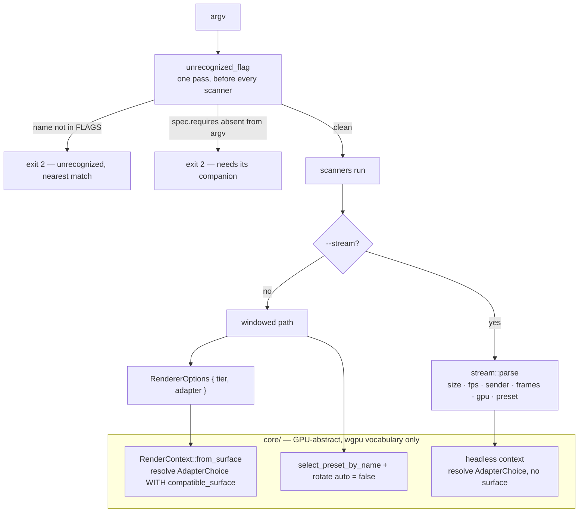

# 0144 — The flags mean what they say

> **Status:** in-progress
> **Created:** 2026-08-30
> **Owner skill(s):** dev
> **Closes:** design-backlog 0167, design-backlog 0168, design-backlog 0169
> **Related ADRs:** [ADR-0155](../adrs/0155-the-window-takes-the-adapter-and-the-preset-the-operator-names.md)
> (proposed with this plan — the decision it implements), [ADR-0148](../adrs/0148-the-cli-refuses-an-argument-no-scanner-claimed.md)
> (the roster this extends), [ADR-0146](../adrs/0146-one-name-selects-the-gpu-and-each-side-matches-its-own-roster.md)
> (the `--gpu` question this answers), [ADR-0127](../adrs/0127-a-comment-carries-the-mechanism-and-the-decision-record-stays-in-docs.md)
> (the gate Phase 4 extends)

## TL;DR

Six flags are accepted and silently ignored without `--stream`. Two of them —`--gpu` and
`--preset` — turn out to have a windowed meaning the engine already implements, and one of those is
why every windowed frame-time figure this project has quoted is an integrated-GPU figure. So the
roster learns to state a dependency and refuses the four that have nothing behind them, while the
two that do get wired to the window. Then three pieces of debt that Plan 0124 found and could not
reach: the broken-literal defect becomes a scanned class instead of a six-item list, the eleven
inline skip blocks fold into the harness 0124 built, and `cargo doc` becomes a gate so ADR-0127's
one exempted link form is actually checked.

## Context & problem

Plan 0135 shipped [ADR-0148](../adrs/0148-the-cli-refuses-an-argument-no-scanner-claimed.md): `lmv`
refuses an argument no scanner claimed, so a misspelt `--osc` is a startup error naming `--osc`.
Design-backlog 0167, filed at that plan's own Mode 4 review, found the case it left standing.
`standalone/src/stream.rs`'s `parse` opens with

```rust
if !args.iter().any(|arg| arg == "--stream") {
    return Ok(None);
}
```

so `--size`, `--fps`, `--gpu`, `--sender`, `--preset` and `--frames` are walked past by
`unrecognized_flag` as recognized, read by nothing, and never mentioned again. `lmv --gpu 1` starts
normally and renders on whatever adapter it would have picked anyway. The roster's existence makes
the gap look closed, which is the property that gets a class of bug forgotten.

**Investigating it turned up something the backlog entry did not have.** Two of the six are not
missing features — they are features the engine already has, unreachable from the window:

- `RenderContext::from_surface` (`core/src/render/context.rs:347`) requests its adapter with
  `RequestAdapterOptions { compatible_surface, ..Default::default() }`. That default power
  preference is the power-saving GPU on a hybrid laptop, which is design-backlog 0165's finding:
  the windowed app runs on the integrated adapter on a machine that also holds an RTX 3080, so every
  windowed frame-time figure ever quoted here is an iGPU figure — and `--gpu` reaching `--stream`
  only is exactly why the window cannot ask for the other one.
- `Renderer::select_preset_by_name` is already what `--stream` calls to hold a scene, and
  `[rotate] auto` already defaults off for the window (ADR-0027).

[ADR-0146](../adrs/0146-one-name-selects-the-gpu-and-each-side-matches-its-own-roster.md)'s Neutral
section left this open in as many words — *"widening the flag to the windowed app is a separate
question this does not answer"* — and [ADR-0155](../adrs/0155-the-window-takes-the-adapter-and-the-preset-the-operator-names.md),
proposed with this plan, answers it.

**Three further items come from Plan 0124's close and are the same kind of work.** They are here
rather than in their own plan because each is a few files, none moves a pixel, and 0124's harness
had to land first for two of them to be buildable at all:

- **design-backlog 0168** — the broken-literal defect (a `format!` string split across source lines
  with no trailing `\`, so the operator reads twenty-odd spaces mid-sentence) was fixed in six
  places and guarded by a test that enumerates those six call sites. Roughly twenty literals
  repo-wide still carry it, three of them reaching a human.
- **design-backlog 0169** — `cargo doc --workspace --no-deps` emits 64 intra-doc-link warnings, and
  neither `.githooks/pre-push` nor CI ever runs `cargo doc`. ADR-0127 keeps rustdoc intra-doc links
  as its one exempted link form *on the grounds that `rustc` checks them*. In this repo nothing asks
  it to, so the exemption is stated as a property and is not one.
- **Plan 0124's own followups** — the `#[allow(clippy::indexing_slicing, …)]` now on
  `Particles::seed` is inert (`dev` probed it twice and disclosed it: removing it leaves clippy
  green, because the lint does not fire on a constant index into a fixed-size array), and eleven
  inline ADR-0016 skip blocks sit in bespoke `capture_at`-shaped functions that Phase 1's stated set
  did not reach.

## Decision

**Refuse the four flags with nothing behind them; wire the two that the engine already implements.**
`FlagSpec` gains `requires: Option<&'static str>`, `unrecognized_flag` refuses a rostered flag whose
companion is absent, and `--help` renders the dependency from that field rather than from prose in
each help string. `--gpu` and `--preset` clear their `requires` in the phases that wire them, so
every phase leaves the tree honest about what it accepts.

The windowed adapter choice rides the existing `RendererOptions` rather than a new parameter on
`Renderer::new`, so the C ABI path and every headless caller keep today's behaviour by
`Default::default()` and `LMV_ABI_VERSION` does not move. **With no `--gpu` the window asks for
`AdapterChoice::Default`, exactly what it asks for today** — the flag is a lever, not a new default;
re-basing every published frame-time figure is design-backlog 0165's question and not this plan's.

Rejected: refusing all six as the backlog filed it (it would decide by omission that the window can
never be pinned, against the evidence in 0165), and warning instead of refusing (ADR-0148
Alternative C, on its own recorded grounds). Both are argued in ADR-0155.

## Architecture diagram



## Implementation phases

### Phase 1 — The roster states a dependency

- **Owner skill:** dev
- **What:** Add `requires: Option<&'static str>` to `FlagSpec` and set it to `Some("--stream")` on
  all six of `--size`, `--fps`, `--gpu`, `--sender`, `--preset`, `--frames` (Phases 2 and 3 clear
  two of them). Add the arm to `unrecognized_flag`: a rostered flag whose `requires` names a flag
  not present in the same argument list is returned for refusal, in the same shape as an
  unrecognized one — the name, the reason, exit 2, before any scanner runs. `--help` appends the
  dependency from the field; the six help strings drop the `--stream` prose they carry today
  (`"<n> --stream frame rate (default 60)"` becomes `"<n> frame rate (default 60)"` plus the
  rendered `requires --stream`), so the coupling is stated once.
- **Files touched:** `standalone/src/main.rs`, `standalone/tests/help_cli.rs`.
- **Done when:** `lmv --gpu 1` with no `--stream` exits 2 and its stderr names both `--gpu` and
  `--stream`; `lmv --stream --gpu 1` is unaffected; the existing
  `every_scanner_flag_is_rostered` test still passes and a sibling asserts that every flag carrying
  `requires` names a flag that is itself in `FLAGS` (a typo in the field is otherwise unfalsifiable);
  `--help` prints each dependency exactly once and no help string contains the literal `--stream`
  twice. `cargo nextest run --workspace` green.

### Phase 2 — `--gpu` reaches the window

- **Owner skill:** dev
- **What:** Add `adapter: AdapterChoice` to `RendererOptions`, defaulting to `AdapterChoice::Default`.
  `RenderContext::new` and `new_unsafe` take `&AdapterChoice` and pass it to `from_surface`, which
  resolves the five variants **with `compatible_surface` still set** — the preference variants
  through `RequestAdapterOptions`, the `Named`/`Index` variants through the enumerated roster
  followed by a surface-support check. A named adapter that cannot present to this window is a
  `RenderError` naming the adapter and the reason, not a silent fallback. `Renderer::new` forwards
  `opts.adapter`; `new_from_win32_hwnd` keeps `RendererOptions::default()` and is behaviourally
  unchanged. In `standalone`, the windowed path resolves `--gpu` through a sibling of
  `gpu::renderer_choice` whose `None` arm is `AdapterChoice::Default` **and not
  `HighPerformance`** — `renderer_choice` is `--stream`'s function and its `None` is a live-source
  decision, so reusing it verbatim would silently re-base every windowed measurement. Clear
  `requires` on `--gpu`. The startup line that already names the running adapter carries the flag
  that changed it.
- **Files touched:** `core/src/render/context.rs`, `core/src/render/mod.rs`, `standalone/src/gpu.rs`,
  `standalone/src/main.rs`, `README.md`, `docs/on-device-validation.md`.
- **Done when:** a `core` unit test asserts `RendererOptions::default().adapter` is
  `AdapterChoice::Default`, so the shim's path is pinned against drift; a `standalone` unit test
  asserts the windowed `None` arm is `Default` while `renderer_choice(None)` is still
  `HighPerformance` (the two must not converge); `lmv --gpu <a name no adapter has>` exits non-zero
  naming the string and listing the roster, and `lmv --gpu <index>` on this machine starts and its
  startup line names the adapter the index selects. **`docs/on-device-validation.md:292`'s
  parenthetical `--gpu` reaches `--stream` only (ADR-0146)` is false after this phase** — rewrite it
  and record the windowed dGPU reading as an item the checklist now makes reachable. Golden suite
  green unblessed; `cargo nextest run --workspace` green.

### Phase 3 — `--preset` holds a scene in the window

- **Owner skill:** dev
- **What:** In the windowed path, when `--preset <name>` is given, call
  `Renderer::select_preset_by_name` after the renderer exists and build the director with
  `Rotate { auto: false, ..config }` — the same two mechanisms `--stream` uses. An unknown name is a
  startup error naming the string, exiting before the window opens rather than falling back to
  rotation. Clear `requires` on `--preset`. Hotkeys still work: this pins the *starting* scene and
  disables the dwell timer, it does not lock the operator out of the roster.
- **Files touched:** `standalone/src/main.rs`, `README.md`.
- **Done when:** `lmv --preset <a name no preset has>` exits non-zero naming the string and does not
  open a window (assert it from outside the process, as `help_cli.rs` does for `--help` — inside the
  process the absence of a window is not observable); a unit test asserts the windowed rotate config
  built for a `Some(name)` request has `auto == false` and the one for `None` is the operator's
  config unchanged; `README.md`'s flag list stops calling `--preset` `--stream`-only.
  `cargo nextest run --workspace` green.

### Phase 4 — The broken literal becomes a scanned class

- **Owner skill:** dev
- **What:** Extend `scripts/check-comment-hygiene.mjs` with a string-literal pass over the spans its
  Rust and C lexers already identify (Plan 0124 Phase 3 made that walk repo-wide), reporting **a run
  of four or more spaces inside a string literal**. Four, not two: two- and three-space runs are
  separators an author typed on purpose (`"next up  -  nothing to rotate to"`), while every instance
  of this defect carries a continuation-line indent, which is far wider. Format-width specs
  (`{:>12}`) are not runs of spaces in the source and need no exemption. Then fix every conviction.
  Deliberate column-aligned diagnostic tables — `milk_wash.rs:246`, `warp_mesh/tests.rs:911`,
  `tonemap/tests.rs:1273`, `shape_field/tests.rs:357` and the `console/tests.rs` report — are
  genuine false positives and take `hygiene-allow: <reason>`, the escape ADR-0127 already defines.
  Seed one fixture per form under `scripts/fixtures/comment-hygiene/` and update that directory's
  expected-count table. The gate lands green on the tree, in the same commit as the fixes.
- **Files touched:** `scripts/check-comment-hygiene.mjs`, `scripts/fixtures/comment-hygiene/*`,
  `scripts/fixtures/README.md`, and the convicted files — known to include
  `core/src/dsp/mod.rs:57`, `standalone/src/stream.rs:393`, `standalone/src/console.rs:450`,
  `milkconv/src/convert.rs:430`, plus assertion messages in `star/tests.rs` and `particles/tests.rs`.
- **Done when:** `node scripts/check-comment-hygiene.mjs` exits 0 on the tree;
  `node scripts/check-comment-hygiene.mjs scripts/fixtures` reports every seeded file, old and new,
  and nothing else; re-breaking one repaired literal makes the gate red (state the bite in the log);
  `core/tests/preset.rs::operator_messages_carry_no_run_of_spaces` still passes unchanged — the
  scanner supersedes its *reach*, not the test. **`dev` reports the number of `hygiene-allow`
  escapes added**; more than six says the four-space threshold is over-reaching and the reviewer
  should be asked rather than the threshold quietly raised.

### Phase 5 — The dead attribute goes and the last skip blocks fold in

- **Owner skill:** dev
- **What:** Delete the `#[allow(clippy::indexing_slicing, reason = "spread/centre/pos index fixed
  [f32; 3] at constant offsets, always in-bounds")]` from `Particles::seed` — Plan 0124 proved it
  inert in both its old and its new position, and an `#[allow]` that suppresses nothing tells a
  reader the lint would otherwise fire. Fold the eleven inline ADR-0016 skip blocks — in `arc_cost`,
  `attractor`, `backdrop_palette`, `backdrop_ramp`, `background_composite`, `beat`, `collage_cost`,
  `field_cost`, `mark_cost`, `palette_contour`, `reaction_diffusion` — onto `core/tests/common/`'s
  `build()`, which is now the one place that skip lives. These sit inside bespoke `capture_at`-shaped
  functions, so the fold is at the point the renderer is constructed, not a whole-function rewrite.
- **Files touched:** `core/src/render/scenes/particles/mod.rs`, `core/tests/common/mod.rs` (if a new
  entry point is needed), the eleven named test files.
- **Done when:** `cargo clippy --workspace --all-targets -- -D warnings` is green with the attribute
  gone; `grep -rn "DeviceType::Cpu" core/tests/*.rs` returns only `common/mod.rs`; `#[test]` count
  under `core/tests/` is unchanged and `cargo nextest run --workspace` reports the same passed/skipped
  split as before the phase (state both numbers); the skip **notice text** is unchanged from the
  copies it replaces, which is the ADR-0016 shape and not merely the outcome.

### Phase 6 — `cargo doc` becomes a gate

- **Owner skill:** dev
- **What:** Clear the 64 intra-doc-link warnings `cargo doc --workspace --no-deps` emits over 31
  files, then add `RUSTDOCFLAGS="-D warnings" cargo doc --workspace --no-deps` to the CI job that
  already builds. **The order is fixed** — adding the gate first reds every push. Repair means
  making the link resolve or reducing it to prose; a link to a private item, to a type behind a
  disabled feature, or to something that no longer exists each want a different answer, and `dev`
  states in the log which classes the 64 fell into.
- **Files touched:** `.github/workflows/ci.yml`, the ~31 files carrying the warnings.
- **Done when:** `cargo doc --workspace --no-deps` emits **zero** warnings; the same command with
  `RUSTDOCFLAGS="-D warnings"` exits 0; CI runs it. Not added to `.githooks/pre-push` — the hook's
  budget is ~28 s and a full `cargo doc` does not fit; CI is where this one lives, which `dev`
  should not read as an oversight.

## Data shapes

Two additive fields, no new type:

```rust
// illustrative — standalone/src/main.rs
struct FlagSpec {
    name: &'static str,
    takes_value: bool,
    /// The flag this one is only read alongside. `None` is unconditional.
    requires: Option<&'static str>,
    help: &'static str,
}

// illustrative — core/src/render/mod.rs
pub struct RendererOptions {
    pub tier: Option<Tier>,
    /// Which adapter the surface context asks for. `Default` is what the
    /// window has always asked for; the shim's path relies on it.
    pub adapter: AdapterChoice,
}
```

## Risks & open questions

- **A private operator script passing one of the four to a windowed `lmv` starts failing.** Nothing
  in this repo does — every documented invocation pairs them with `--stream`, and
  `packaging/windows/READ-ME-FIRST.md` shows both forms correctly. The user's own show scripts are
  not visible from here; this is called out so the first show after the release is not the place it
  is discovered.
- **Phase 2's surface-support check has no CI coverage and one machine's worth of evidence.** CI
  runners have one adapter, so the interesting case — a named adapter that cannot present to the
  window — is unreachable there and unreachable on any single-GPU box. The test asserts the *choice*
  is plumbed; whether a real driver refuses is a `human` reading on the hybrid machine, and it
  belongs on the on-device checklist rather than being claimed here.
- **Phase 4's four-space threshold is a judgement, not a measurement.** It separates the sample
  found by sweeping this tree today; a future author who types five spaces deliberately gets a false
  positive and an escape. The escape count is the signal, which is why the done-when asks for it.
- **Phase 6's 64 warnings are `dev`'s number, re-measured from Plan 0124's log rather than by this
  plan.** If the count on the tree differs materially at the time the phase runs, that is worth a
  line in the log — it would mean something moved them between the close and the phase.
- **Open (architect, not this plan):** design-backlog 0161 says three committed scripts resolve
  cargo output under `<repo>/target`, *"which the artifact-store docs assert nothing does"*.
  [ADR-0147](../adrs/0147-the-shared-artifact-store-is-revoked-and-the-linker-stays.md) revoked that
  redirect, so `<repo>/target` may now be correct again and the entry's premise may be dead. It is a
  live entry with an `unprobeable:` verification, so nothing will convict it. Re-read it at this
  plan's close.

## What this plan does NOT do

- **It does not change what the window asks for with no `--gpu`.** That stays
  `AdapterChoice::Default`. Making it `HighPerformance` is ADR-0155's Alternative C: it re-bases
  every frame-time figure in `docs/nfr.md`, on the on-device checklist and in every soak comparison,
  and it wants its own ADR and its own measurement pass. This plan ships the lever that makes that
  pass possible.
- **It does not add a `config.toml` key for the adapter or the pinned preset** (ADR-0155
  Alternative D). Two surfaces for one choice is more mechanism, and the right default is not known
  until the flag has been used.
- **It does not give `--size`, `--fps`, `--sender` or `--frames` a windowed meaning.** A window has
  a size the user drags and a rate the display dictates; the refusal is the answer, not a stopgap.
- **It does not touch `LMV_ABI_VERSION` or any `extern "C"` signature.** `RendererOptions::default()`
  is what the shim's path passes and it yields today's behaviour.
- **It does not delete `milk-softness.mjs` or `softness-sheets.mjs`.** Plan 0124 Phase 6 kept them on
  the user's instruction and `CLAUDE.md` now names all five unwired scripts; design-backlog 0161's
  verification bullet still points at the pair. That followup is discharged, not deferred.
- **It does not add `cargo doc` to `.githooks/pre-push`** — see Phase 6.

## Implementation log

> Written by `dev` — one row per phase as that phase's commit lands, and the close block after the
> last one. **The phases above are the contract; everything here is what happened.**
> **Observations, never conclusions:** this says where to look, architect decides how it went.
> No per-criterion pass list, no self-assessment, no narrative — but a deviation from the plan or
> an unmet done-when is always disclosed. Stays shorter than `## Implementation phases` above.

**Lane:** `WORK/lmv-plan-0144` on `plan-0144-the-flags-mean-what-they-say`.

| phase | owner | state | commit |
|---|---|---|---|
| 1 — The roster states a dependency | dev | done | committed with this row |
| 2 — `--gpu` reaches the window | dev | | |
| 3 — `--preset` holds a scene in the window | dev | | |
| 4 — The broken literal becomes a scanned class | dev | | |
| 5 — The dead attribute goes and the last skip blocks fold in | dev | | |
| 6 — `cargo doc` becomes a gate | dev | | |
