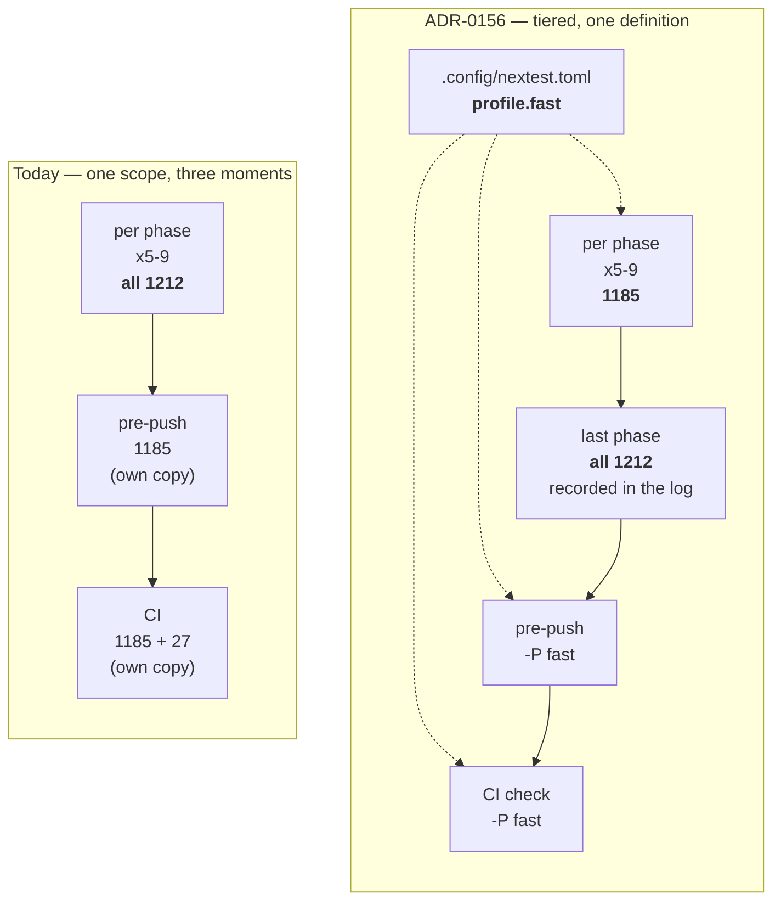

# 0145 — The per-phase gate stops paying for the preset library

> **Status:** approved
> **Created:** 2026-08-31
> **Owner skill(s):** dev
> **Related ADRs:** [0156](../adrs/0156-the-per-phase-gate-is-scoped-and-the-suite-is-owed-once-per-plan.md)
> (proposed), [0033](../adrs/0033-testing-strategy-coverage-ratchet-and-pre-push-gate.md),
> [0071](../adrs/0071-a-numeric-test-contract-states-a-property-or-names-its-machine.md)

## TL;DR

The `dev` lane runs the whole test suite before every phase commit, and 27 of its 1212 tests — the
nine GPU sweeps whose price is set by the shipped preset count, not by the code under test — carry
most of that cost. This plan gives the per-phase moment the tier it never had: **narrowed per phase,
whole suite once per plan at the last phase**, with the filter defined **once** as a nextest profile
that the hook, CI and `dev` all cite. Nothing is deleted; 27 tests move to a different moment.

## Context & problem

The user's report: *"recent 10-20 plans were implemented really slowly. I believe that during
implementation we are running full test suite after each step, which maybe fine but slows process a
lot."*

The premise is half right, and the half that is wrong redirects the work. Compilation is **not** the
bottleneck — Plan 0129 already fixed that, and a warm rebuild after a one-file core edit is small.
What is left is the suite run itself plus the test-binary link, paid five to nine times per plan.

Four facts, none of them timings, establish the shape (see
[ADR-0156](../adrs/0156-the-per-phase-gate-is-scoped-and-the-suite-is-owed-once-per-plan.md) for the
full argument):

| fact | value | source |
|---|---|---|
| tests in the workspace | **1212** | `cargo nextest list --workspace` |
| tests in the nine GPU suites | **27** (2.2 %) | the same, minus the pre-push filter |
| shipped presets at Plan 0129's close → today | **54 → 81** | `git ls-tree ed8a787` vs `presets/` |
| copies of the exclusion filter that `dev` can see | **0 of 2** | `.githooks/pre-push`, `ci.yml` |

Four of the nine suites sweep the shipped preset set, so the gate's price is set by the
`preset-author` lane's output and rises every time it ships. And the uniform rule is already not
being followed: Plan 0135's `test(core): one shared harness for the integration tests` landed two
minutes after the commit before it, which no full suite run fits inside. `dev` narrows silently
today, inconsistently, and no phase records what it ran.

### The measured baseline

Taken 2026-08-31 at `fd7f55b` on an idle box — no other `cargo`/`cargo-nextest`/`rustc` process at
the start of the pair, verified before and after each run. Machine per ADR-0071: AMD Ryzen 9 5900HS,
Windows 10 19045, rustc 1.97.1, cargo-nextest 0.9.140, on AC.

| step, after touching `core/src/lib.rs` | wall |
|---|---|
| `cargo build` | 16 s |
| `cargo fmt --all --check` | 2 s |
| `cargo clippy --workspace --all-targets -- -D warnings` | 8 s |
| `cargo nextest run --workspace --no-run` (link 46 binaries) | 38 s |
| **compile / lint / link floor** | **64 s** |
| `cargo nextest run --workspace` — 1217 tests, 24 slow | **869 s** |
| the same under the pre-push filter — 1190 tests, 3 slow | **163 s** |

**27 tests carry 706 s, and one test carries 758 s of it.** The suite is not slow because it has
many tests — it is slow because four `#[test]` functions each loop the *whole* preset roster
serially, and nextest parallelizes across tests, never inside one:

| the serial monoliths | wall |
|---|---|
| `animation::every_preset_animates_over_time` | **758 s — 87 % of the whole suite's 869 s** |
| `reactivity::every_preset_reacts_to_at_least_one_band` | 667 s |
| `distinctness::report_family_distinctness` | 665 s |
| `sanity::a_louder_frame_is_reported_against_a_quieter_one` | 473 s |
| `sanity::every_preset_draws_a_real_shape` | 432 s |

Concurrency tells the same story from the other side. Summed test-wall over elapsed, on 16 logical
CPUs:

| run | summed test-wall | elapsed | average concurrency |
|---|---|---|---|
| full | 7,965 s | 869 s | **9.2** — 43 % of the machine idle |
| narrow | 2,229 s | 163 s | **13.7** — near-saturated |

Within the full run the nine excluded binaries hold **3,929 of the 7,965 s — 49 %**, near parity with
everything else. So the exclusion does not buy its 706 s by removing half the work: it buys it by
removing the *unparallelizable* half. The full run's whole deficit is its tail, where only the five
monoliths remain and twelve threads have nothing to do.

**This bounds what any preset-sampling change can achieve, and points at a cheaper lever** — see
Followups: splitting a monolith into one test per preset costs no coverage at all.

**The full-suite figure is not stable, and that is itself a finding.** Three readings of the same
command on the same tree within one hour: **885 s**, **489 s**, **873 s**. The first was contended by
another lane; the 489 s is unexplained. Phase 1 owes the spread, not just a number.

**One flake was observed.** The narrowed run exited 100 on one contended pass and 0 on the two
others, same tree. Not diagnosed here; Phase 1 should name it if it recurs.

**An earlier attempt at this measurement was discarded outright.** Three lanes (0092, 0125, 0144)
were live and two other sessions were running suites against it, so every figure was an upper bound
of unknown looseness. It is recorded in ADR-0156's Notes rather than used.

### Running this alongside other lanes

**Phases 2–5 are parallel-safe and can start immediately.** This plan touches `.config/`,
`.githooks/`, `.github/` and `.claude/skills/` and nothing else; checked 2026-08-31, the only live
lane (0144) touches **none** of those four paths, so the file-level conflict set is empty. Neither
needs a GPU, so neither contends for the one adapter.

**Phases 1 and 6 are the exception, and they are not blocking.** They need an idle box — three
attempts on 2026-08-31 were contaminated by other sessions' suites. The scheduling relief is that
**Phase 1 does not gate Phases 2–5**: the "before" arm is `cargo nextest run --workspace`, which this
plan never removes, so both arms stay measurable forever. Run the whole measurement as one
back-to-back pair in an announced quiet window whenever one is available — before Phases 2–5, after
them, or in the middle. The `## Implementation log` records when it was taken.

Two ordering notes rather than blockers. Phase 3 edits `.githooks/pre-push`, and each worktree uses
its own copy, so a live lane keeps the old hook until it merges `main` — the exposure starts at that
merge, which is what Phase 3's list-diff done-when is for. And Plan 0144 modifies 13 files under
`core/tests/` (the shared harness) while **adding and deleting no test binary**, so it moves per-test
cost without moving the binary count; if the measurement is taken before that merges, say so, because
the link figure belongs to the tree it was taken on.

## Decision

Adopt ADR-0156: the per-phase gate is `build` + `clippy` + `fmt` + a **narrowed** nextest run; the
full `--workspace` run is owed **once per plan**, at the last phase, and recorded in the
implementation log. Two upward overrides stay with `dev` — a phase whose `Done when` names one of the
nine, and a phase that changes what those suites measure. The filter becomes a `fast` profile in
`.config/nextest.toml`, replacing the two existing copies rather than adding a third.

We rejected making the sweeps cheaper first (a coverage argument this plan does not make), a
touched-files-to-suite map (its failure mode is silent under-running), deferring the nine to CI
alone (the goldens would never run locally before a close), and an async full-suite run beside the
next phase (a red result landing after the commit it convicts). Full reasoning in ADR-0156.

## Architecture diagram



## Implementation phases

### Phase 1 — Confirm the baseline, and pin its spread
- **Owner skill:** dev
- **What:** Re-take the readings above and establish how repeatable they are. The architect's pair
  (869 s / 163 s) is one sample; the three full-suite readings spanned 489–885 s, so the number this
  plan is judged against needs a spread, not a point.
- **Files touched:** none (this plan's `## Implementation log` only).
- **Done when:** the log records, from this machine, the wall time of each of `cargo build`,
  `cargo clippy --workspace --all-targets -- -D warnings`, `cargo fmt --all --check` and
  `cargo nextest run --workspace --no-run` after a one-file edit to `core/src/lib.rs`, plus
  `cargo nextest run --workspace` and the same run under the current pre-push filter — **and** the
  machine identification ADR-0071 requires. **No threshold is asserted and none is owed**: the phase
  produces readings, not a bar. **At least three full-suite runs**, so the spread above is either
  reproduced or contradicted; if it is contradicted, say so — the architect's sample is one reading
  and this phase outranks it. Quiet is a stated precondition, not an assumption: enumerate
  `cargo`/`cargo-nextest`/`rustc` processes immediately before and after the run and record that
  none but this one was present. If that cannot be achieved, record the readings **and** what else
  was running, and mark them contended — a contended reading is reportable, a laundered one is not.

### Phase 2 — Define the filter once, as a nextest profile
- **Owner skill:** dev
- **What:** A `fast` profile carrying the exclusion, so one file defines what three consumers run.
- **Files touched:** `.config/nextest.toml`.
- **Done when:** `cargo nextest list --workspace -P fast` and `cargo nextest list --workspace -E`
  with the expression currently in `.githooks/pre-push` enumerate the **identical** test set —
  compared as sorted lists with an empty diff, not as equal counts. A **union check** proves nothing
  fell out: the `-P fast` set plus the tests in the nine excluded binaries equals the unfiltered
  `--workspace` set exactly. The existing `[[profile.default.overrides]]` that keeps the four
  reporting tests audible must still apply under `-P fast` — verify by running one of those tests
  under the profile and seeing its output; if a custom profile does not inherit the override, the
  override is restated under `profile.fast` and the file says why the duplication exists.

### Phase 3 — Point the hook and CI at the profile
- **Owner skill:** dev
- **What:** Delete both copies of the expression in favour of the profile.
- **Files touched:** `.githooks/pre-push`, `.github/workflows/ci.yml`.
- **Done when:** neither file contains the filter expression, both invoke `-P fast`, and
  `cargo nextest list` under each file's new command enumerates the same set as under its old one
  (empty diff, captured before the edit). The hook's header comment still explains *why* the nine
  are excluded and now says where the list lives; the reasoning does not move into the toml as a
  second prose copy. `.githooks/pre-push` exits 0 on a clean tree.

### Phase 4 — Give the per-phase loop its tier
- **Owner skill:** dev
- **What:** State in `dev`'s own instructions what a phase owes and what the last phase owes.
- **Files touched:** `.claude/skills/dev/SKILL.md`,
  `.claude/skills/dev/references/project-context.md`.
- **Done when:** `project-context.md`'s *"All four of build / test / clippy / fmt-check must be green
  before you commit a phase"* is replaced by ADR-0156's tier — narrowed per phase, full at the last
  phase, and the two upward overrides stated as `dev`'s to apply. The canonical-commands table
  carries a `-P fast` row and marks the bare `--workspace` run as the last-phase and close scope,
  keeping ADR-0072's warning that `--workspace` is load-bearing for `lmv-core-cabi` on **both** rows.
  `SKILL.md` Step 3 item 3 names the tier, and its close block requires the full run before the
  handoff. `node scripts/check-doc-links.mjs` exits 0.

### Phase 5 — Make the full-suite run a recorded fact
- **Owner skill:** dev
- **What:** The once-per-plan run leaves evidence, so the close review reads it instead of assuming.
- **Files touched:** `.claude/skills/architect/references/templates/plan.md`,
  `.claude/skills/architect/SKILL.md`.
- **Done when:** the plan template's `### Close triggers` carries a `**Full suite:**` bullet naming
  the command run, its exit code and the pass/skip counts; the architect skill's Mode 4 lens 1 names
  that bullet among the claims it verifies rather than trusts, consistent with the section's existing
  rule that the log is claims and not evidence. `node scripts/check-doc-links.mjs` and
  `node scripts/check-index-rows.mjs` both exit 0.

### Phase 6 — Re-measure, and do the per-plan arithmetic
- **Owner skill:** dev
- **What:** What the change actually bought, on the same machine under the same quiet precondition.
- **Files touched:** none (this plan's `## Implementation log` only).
- **Done when:** the log records Phase 1's readings retaken after Phases 2–5, under the same stated
  quiet precondition and with the same machine identification, **and** the per-plan arithmetic
  written out for a 6-phase plan (this repo's median): the old shape as six full gates, the new shape
  as six narrow gates plus one full run. The plan records the difference it measured and asserts no
  target — if the difference is small, that is the finding and it is reported as such.

## Data shapes

```toml
# illustrative — the profile Phase 2 adds to .config/nextest.toml.
# One line on purpose: a backslash continuation is NOT a line continuation inside a
# TOML literal string, so the expression either stays on one line or moves to a
# multi-line literal ('''...''').
[profile.fast]
default-filter = 'not (binary(golden) + binary(attractor) + binary(reaction_diffusion) + binary(background_composite) + binary(ink) + binary(reactivity) + binary(animation) + binary(sanity) + binary(distinctness))'
```

Verified 2026-08-31 on cargo-nextest 0.9.140 via `--config-file` against a scratch copy: the profile
form and the `-E` form both enumerate **1185** tests, against **1212** unfiltered.

## Risks & open questions

- **Deferred detection is the price, and it is real.** A `golden` or `sanity` regression introduced
  in phase 2 of a nine-phase plan surfaces at phase 9, and bisecting costs a full suite per candidate
  commit. Mitigation is the upward override in Phase 4: a phase touching a scene, the composite, the
  preset engine or the embedded set runs the affected suite. That rests on `dev`'s judgement and no
  gate enforces it — stated in ADR-0156's Negative section rather than papered over.
- **Editing `.github/workflows/ci.yml` needs the `workflow` OAuth scope on the credential**, or the
  push is rejected after the commits are already made. Known trap on this machine.
- **A custom nextest profile may not inherit `[[profile.default.overrides]]`.** Phase 2's done-when
  tests this rather than assuming it, and states the fallback.
- **Phase 1 and Phase 6 need the other lanes idle**, and the GPU suites serialize on one adapter, so
  a concurrent lane inflates any reading. Both phases verify and record the condition instead of
  asserting it held. They do **not** gate the rest of the plan — see "Running this alongside other
  lanes" above.
- **Plan 0144's merge can move the baseline.** It modifies 13 files under `core/tests/`, including
  the shared harness, adding and deleting no binary. A measurement taken across that merge is a
  measurement of two trees; name which tree each reading belongs to.
- **Open:** whether once-per-plan is the right cadence for a plan of 9+ phases, or whether the full
  run should also fire at a midpoint. Deliberately not decided here — Phase 6's arithmetic is the
  evidence to decide it from, and ADR-0156 Alternative D is the fallback if it proves too coarse.

## What this plan does NOT do

- **It does not make the sweeps cheaper.** Sampling the preset set rather than sweeping it is
  permitted by the lifted budget and is ADR-0156 Alternative A; it is a coverage decision needing its
  own argument about what a sample proves, and it is not smuggled in here.
- **It does not touch the 42 integration-test binaries or their link cost**, which is paid per phase
  regardless of which suites run. Scoped out by the user on 2026-08-31 ("gate scoping only, for now").
- **It does not change the coverage ratchet, CI's job structure, or what any test asserts.** The same
  1212 tests run; 27 of them run at a different moment.
- **It does not address concurrent lanes contending for one GPU**, which the discarded measurement
  exposed as a second, independent cost centre. Filed as a followup.

## Implementation log

> Written by `dev` — one row per phase as that phase's commit lands, and the close block after the
> last one. **The phases above are the contract; everything here is what happened.**

**Lane:** _(to be filled by `dev`)_

| phase | owner | state | commit |
|---|---|---|---|
| 1 — Take the baseline on a quiet box | dev | not started | |
| 2 — Define the filter once, as a nextest profile | dev | not started | |
| 3 — Point the hook and CI at the profile | dev | not started | |
| 4 — Give the per-phase loop its tier | dev | not started | |
| 5 — Make the full-suite run a recorded fact | dev | not started | |
| 6 — Re-measure, and do the per-plan arithmetic | dev | not started | |

### Notes

### Close triggers

- **`presets/` touched:**
- **Plan header `Closes:`** none
- **What shipped:**
- **Operator docs touched:**
- **Backlog probes (`node scripts/check-backlog-claims.mjs`):**
- **Outstanding `human` phases:**

## Followups (after this lands)

- **Concurrent lanes serialize on one GPU.** Three lanes running the nine suites at once cost each
  of them roughly three times as long. Worth a look now that the per-phase gate no longer runs them
  — the contention may largely evaporate, which would itself be the finding.
- **The sweeps' cost scales with the preset library** (54 → 81 in two days). ADR-0156 Alternative A
  is available under the lifted budget; the argument it owes is what a sampled sweep proves that a
  full one does not.
- **CI pays the cost this plan reduces locally, on every push** — Plan 0129 left the same followup
  and it is still open.
- **The exclusion list may be under-inclusive.** Six binaries outside the nine cost more than 200
  CPU-seconds each in the measured run — `warp_mesh` 377, `easing` 313, `tempo_probe` 281, `feedback`
  266, `transition` 236, `bloom` 201 — and were never candidates because the list predates them. Not
  touched here (the list moves as-is into the profile, so this plan changes *where* it is defined and
  not *what* it holds), but re-deriving it by measurement is now a one-file edit.
- **The full suite's wall time is not repeatable to better than ~1.8x** on this box (489–885 s across
  three readings within an hour). Worth understanding on its own: it makes every before/after claim
  about test cost, including this plan's, weaker than it looks.
- **A narrowed run exited 100 once and 0 twice on the same tree.** Undiagnosed. If it is a real flake
  it will outlive this plan and belongs in the backlog with a probe.
