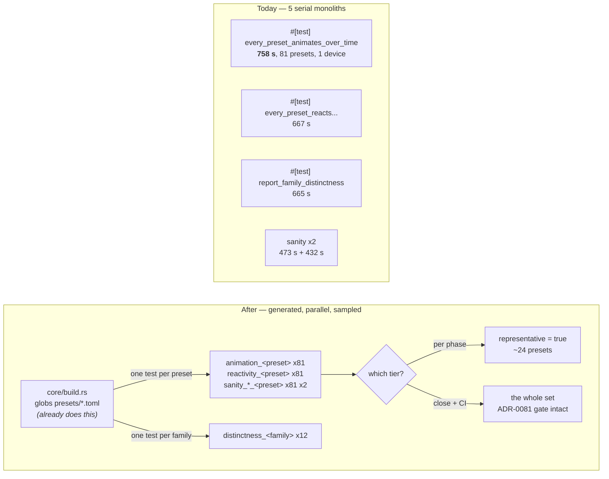

# 0146 — The preset sweeps stop being one long test

> **Status:** draft
> **Created:** 2026-08-31
> **Owner skill(s):** dev
> **Related ADRs:** [0157](../adrs/0157-the-preset-sweeps-split-per-preset-and-the-phase-tier-samples-a-declared-representative.md)
> (proposed), [0156](../adrs/0156-the-per-phase-gate-is-scoped-and-the-suite-is-owed-once-per-plan.md),
> [0081](../adrs/0081-the-content-lane-lands-presets-and-architect-curates-the-set.md),
> [0022](../adrs/0022-build-time-preset-embedding.md)
>
> **Sequenced after [0145](0145-the-per-phase-gate-stops-paying-for-the-preset-library.md)**, whose
> `fast` nextest profile is where Phase 6 hangs the sample.

## TL;DR

Five `#[test]` functions each render the whole 81-preset roster serially, and one of them is 87 % of
the suite's wall time. This plan generates **one test per preset** from the glob `build.rs` already
runs, splits `distinctness` per family, and adds a declared `representative` key so the per-phase
tier renders a sample while the close and CI keep rendering everything. Phase 1 is a spike that may
abort the whole plan.

## Context & problem

The user's ask: *"maybe we also should minimize number of presets that are used in tests, lets say we
have 2 per family."*

Measured on an idle box at `fd7f55b`, the sweeps are not slow because there is much work — they are
slow because the work cannot be spread. Full run: **7,965 s of test-wall in 869 s elapsed, average
concurrency 9.2 on 16 CPUs — 43 % of the machine idle.** The narrow run reaches 13.7 on the same box.
The whole gap is the tail, where only these five processes remain:

| roster monolith | wall |
|---|---|
| `animation::every_preset_animates_over_time` | **758 s (87 % of the suite)** |
| `reactivity::every_preset_reacts_to_at_least_one_band` | 667 s |
| `distinctness::report_family_distinctness` | 665 s |
| `sanity::a_louder_frame_is_reported_against_a_quieter_one` | 473 s |
| `sanity::every_preset_draws_a_real_shape` | 432 s |

Two arithmetic facts set the ceiling, and they are why this plan does both halves rather than either.
**Splitting only redistributes**: the five are similar sizes, so splitting one promotes the next, and
splitting all five reaches the packing floor of 7,965/16 ≈ **500 s** and stops — a 1.6x win.
**Only cutting the roster removes work.** The set is 81 presets across 12 families, lopsided:

```
attractor 19 · fragment_field 13 · reaction_diffusion 7 · shape_field 6
spectrum 5 · parametric_curve 5 · lsystem 5 · emitter 5
warp_mesh 4 · swarm 4 · star_pattern 4 · shape_collage 4
```

so two per family is 24 of 81, drawing most of its saving from two families.

## Decision

Adopt [ADR-0157](../adrs/0157-the-preset-sweeps-split-per-preset-and-the-phase-tier-samples-a-declared-representative.md):
the four per-preset sweeps generate one test per preset from `build.rs`'s existing glob;
`distinctness` splits per family, never per preset, because its claim is pairwise within one; and a
declared `representative` key selects what the **per-phase tier** renders while the close and CI keep
rendering the whole set, so ADR-0081's curation gate is untouched.

We rejected sampling without splitting (leaves the machine 43 % idle and failures still name a loop
index), splitting without sampling (reaches ~500 s and cannot return the sweeps to the per-phase
gate — retained as this plan's fallback), and deriving the sample rather than declaring it
(first-N never samples a newly landed preset; hash rotation makes the same tree gate differently on
different commits). Full reasoning in ADR-0157.

## Architecture diagram



## Implementation phases

### Phase 1 — Spike: split the worst sweep, and find out whether this works at all
- **Owner skill:** dev
- **What:** Generate one test per preset for `animation::every_preset_animates_over_time` only, and
  measure. **This phase may end the plan** — see the stop condition.
- **Files touched:** `core/build.rs`, `core/tests/animation.rs`.
- **Done when:** the generated tests make the same assertions the loop made, one per preset, named
  after the preset; the roster is still enumerated from the glob so a new `.toml` gets a test by
  existing; and the log records, on an idle box with the precondition verified before and after:
  the wall of `-E 'binary(animation)'` before and after, the summed test-wall both ways, and the
  **per-test device-creation cost** derived from the difference. `cargo nextest list` shows one test
  per shipped preset.
- **Stop condition, and it is a real one:** each sweep builds **one** headless renderer today and
  reuses it for all 81 presets, while nextest runs each test in its own process — so the split pays
  81 device creations against 1. If the summed test-wall rises by more than it saves in elapsed, or
  the binary's wall does not fall, **stop, record both numbers, and route back to architect.**
  ADR-0157 Alternative B (split only, no sampling) and Alternative A (sample only, no split) are both
  live fallbacks and neither needs this phase to have succeeded.

### Phase 2 — Split the remaining per-preset sweeps
- **Owner skill:** dev
- **What:** The same generation for `reactivity`'s roster test and `sanity`'s two.
- **Files touched:** `core/build.rs`, `core/tests/reactivity.rs`, `core/tests/sanity.rs`.
- **Done when:** all four sweeps are generated per preset with their assertions unchanged; the full
  suite's average concurrency, recomputed as summed-test-wall over elapsed, is **higher than the 9.2
  measured at `fd7f55b`** — this is the phase's real claim, and it is a property rather than a
  threshold, since the packing floor depends on the machine. Record the new elapsed beside it.
  `sanity`'s two tests keep their **reports** as well as their gates: the coverage distribution and
  the loud/moderate ratio are printed today and must still be printed, per ADR-0071.

### Phase 3 — Split `distinctness` per family
- **Owner skill:** dev
- **What:** Twelve tests, one per family, each doing that family's pairwise comparison.
- **Files touched:** `core/tests/distinctness.rs`.
- **Done when:** every family is its own test, the pairwise set within each family is exactly what the
  single test compared before (no pair dropped, no pair added — assert the pair count per family), and
  the printed matrix survives per family. **No sampling is applied here in this or any later phase**,
  and the file says why in a comment: two per family leaves one comparison and retires the check.

### Phase 4 — The `representative` key and its floor
- **Owner skill:** dev
- **What:** The schema key, its parsing, and the test that stops the sample rotting.
- **Files touched:** `core/src/preset/schema.rs`, `core/build.rs`, `core/tests/preset.rs`,
  `presets/README.md`, `docs/presets.md`.
- **Done when:** a preset may declare `representative = true`, absent means false, and an unknown
  value is a load-time error consistent with the rest of the schema. A test asserts the floor —
  **every family has at least two representatives** — and fails naming the family that does not. The
  two authoring docs describe the key, what it is for, and that it changes *nothing* about what the
  close and CI run.

### Phase 5 — Seed the representatives, and curate them
- **Owner skill:** dev
- **What:** Populate the key across all 12 families.
- **Files touched:** `presets/*.toml`.
- **Done when:** every family has at least two, seeded from `distinctness`'s own pairwise matrix by
  taking the two furthest-apart presets in that family, and the plan's log records the matrix reading
  each choice came from. This is a mechanical application of a stated rule, not a taste judgement —
  where the matrix is ambiguous (a tie, or a family of exactly four where the choice barely matters),
  say so in the log and let the close-ceremony curation settle it rather than inventing a preference.

### Phase 6 — Hang the sample on the per-phase tier
- **Owner skill:** dev
- **What:** Wire the sample to Plan 0145's `fast` profile so a phase renders representatives and the
  close renders everything.
- **Files touched:** `.config/nextest.toml`, `.claude/skills/dev/references/project-context.md`.
- **Done when:** the per-phase scope runs the representatives' generated tests and skips the rest,
  while a bare `cargo nextest run --workspace` still runs **every** preset — verified by a list diff,
  not by inspection. `dev`'s canonical-commands table says which scope renders which set. The
  close/CI path is unchanged, so ADR-0081's gate still sees the whole library.

### Phase 7 — Measure, and state what it cost
- **Owner skill:** dev
- **What:** The closing numbers, on an idle box.
- **Done when:** the log records elapsed and average concurrency for the full suite and for the
  per-phase scope, before and after, with the machine named per ADR-0071 and the quiet precondition
  verified. **The per-phase coverage gap is stated as a count, not a feeling:** how many of the 81
  presets a phase now renders, and how many wait for the close.

## Data shapes

```toml
# illustrative — the key Phase 4 adds, in a preset .toml
system = "attractor"
representative = true   # absent means false; the per-phase tier renders only these
```

```rust
// illustrative — what build.rs emits per preset, per sweep, in Phase 1
#[test]
fn animation_attractor_leviathan() {
    animates_over_time("attractor_leviathan");
}
```

## Risks & open questions

- **Device creation may eat the win, and it is the whole premise.** 81 processes each building a
  headless renderer against 1 renderer reused 81 times. Phase 1 exists to find out first and is
  allowed to end the plan.
- **The sweeps run on the WARP software adapter** (`headless()` prefers software), so they are
  CPU-bound and parallel tests compete for the same 16 threads rather than for a GPU. The packing
  floor is therefore real and near — do not expect better than total-work ÷ cores.
- **Sampling widens a per-phase blind spot exactly where the library is thickest** — `attractor` 19
  and `fragment_field` 13 both drop to 2. The close and CI still render everything, which is what
  keeps ADR-0081 intact, but a defect in preset 17 of 19 now waits for the close.
- **The floor test catches absence, never staleness.** Two representatives that stop being
  representative of a grown family still pass. That is a curation duty with no gate behind it, and it
  should be said plainly in `presets/README.md` rather than assumed.
- **A `build.rs` defect becomes a test-suite defect** across five suites rather than one table.
- **Open:** whether two per family is the right floor for `attractor` at 19. Deliberately not decided
  here — Phase 7's coverage count is the evidence to revisit it from.
- **`distinctness` is quadratic, cannot be sampled, and is the wall this plan does not remove.** Its
  665 s covers **349 pairs at 1.91 s each**; `attractor` at 19 presets is **171 of them — 326 s, 49 %
  of the test**. Adding one attractor preset adds 19 pairs (**36 s**), which is *more than the other
  four sweeps add combined* (29 s). After Phase 3 splits it, `distinctness_attractor` is already the
  longest single test at ~328 s, and it overtakes the ~539 s packing floor at about **24 presets in
  one family** — five away. Nothing in this plan changes that, and sampling by construction cannot.
  See Followups.

## What this plan does NOT do

- **It does not change any assertion.** The same claims are made about the same presets; what changes
  is how many processes make them, and which presets the per-phase tier visits.
- **It does not sample `distinctness`**, ever — Phase 3 splits it and stops.
- **It does not weaken the close or CI sweep**, which is what ADR-0081 rests on.
- **It does not touch the per-phase gate's structure**, which is Plan 0145's; this plan only hangs a
  sample on the profile that plan creates.
- **It does not address the 43 % idle machine anywhere but these five tests.** Other tail effects, if
  any, are out of scope.

## Implementation log

> Written by `dev` — one row per phase as that phase's commit lands, and the close block after the
> last one. **The phases above are the contract; everything here is what happened.**

**Lane:** _(to be filled by `dev`)_

| phase | owner | state | commit |
|---|---|---|---|
| 1 — Spike: split the worst sweep | dev | not started | |
| 2 — Split the remaining per-preset sweeps | dev | not started | |
| 3 — Split `distinctness` per family | dev | not started | |
| 4 — The `representative` key and its floor | dev | not started | |
| 5 — Seed the representatives | dev | not started | |
| 6 — Hang the sample on the per-phase tier | dev | not started | |
| 7 — Measure, and state what it cost | dev | not started | |

### Notes

### Close triggers

- **`presets/` touched:**
- **Plan header `Closes:`** none
- **What shipped:**
- **Operator docs touched:**
- **Backlog probes (`node scripts/check-backlog-claims.mjs`):**
- **Outstanding `human` phases:**
- **Full suite:**

## Followups (after this lands)

- **The next wall is `distinctness`, and it is quadratic.** Everything else in this plan makes a new
  preset roughly free — **+0 s per phase** unless it is a representative, and ~2–4 s on the close/CI
  wall against **~29 s of suite wall today**. `distinctness` is the exception: it grows as
  `n(n-1)/2` per family, it is the one sweep that cannot be sampled without retiring its own claim,
  and at ~24 presets in a single family it becomes the critical path again. `attractor` is at 19.
  **This is the thing to design next if the library keeps growing** — plausibly by comparing each
  preset against a family reference or its k nearest rather than against all pairs, which is an
  O(n) or O(n·k) claim and an ADR-worthy change to what the check asserts. Not attempted here.
- **Two per family may be wrong for the lopsided families.** Phase 7's count is the evidence.
- **The exclusion list Plan 0145 moves into the profile may be under-inclusive** — six binaries
  outside the nine each cost over 200 s. Once these five split, re-deriving that list by measurement
  is a one-file edit.
- **CI pays this reduction too**, on every push, across three jobs. Plan 0129 and Plan 0145 both left
  the same followup open.
