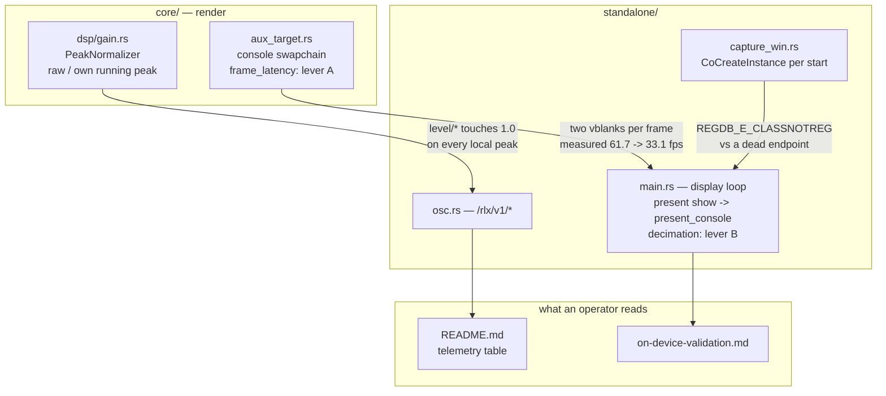

# 0147 — What the show costs, and what its numbers mean

> **Status:** in-progress
> **Created:** 2026-09-01
> **Owner skill(s):** dev, human
> **Related ADRs:** none for Phases 1-3 and 6 — mechanism fixes and prose under decisions that
> already exist. Phase 3b implements
> [ADR-0172](../adrs/0172-a-null-cost-measurement-names-the-witness-that-the-thing-ran.md), written
> at the Phases 1-3 review after a first Phase 4 window produced a null nothing could read. Phase 5
> writes a second `Outcome` onto
> [ADR-0143](../adrs/0143-the-operator-console-is-a-second-surface-and-the-shell-owns-its-meaning.md) rather than superseding it,
> and names the ADR a fifth phase would owe if neither lever moves the cost.
> **Closes:** design-backlog 0164, 0163. **0154 is half-discharged, not closed** — see Phase 2.
> **0165 stays live with a dated update** — see Phase 6.

## TL;DR

Four surfaces an operator reads during a show state something the machine does not do. The console
costs the output **half its frame rate** while two comments say it cannot. `level/bass` is
*designed* to touch 1.0 on every kick and nothing anywhere says so, which sent a live operator to an
input-gain control that provably cannot move it. A WASAPI activation that failed for its own reasons
reads as a dead device. And every windowed frame-time figure this project has published is an
integrated-GPU figure. The first visible behavior is one sentence in `README.md`'s telemetry table
saying what `level/*` is normalized against — the cheapest item here and the one with a deadline,
because [Plan 0133](0133-the-engine-drives-the-lights.md) brings a lighting consumer in-house and
will meet it on its first evening.

## Context & problem

The 2026-08-29 live set was the first full show driven end to end by this app, and the entries it
produced share a shape that is not "the code is wrong". In three of the four, **the code is
correct and the claim about it is not** — which is the more expensive failure, because it sends an
operator to the wrong lever during the one hour when there is no time to discover that.

**The console halves the output's frame rate.** Two 95 s release runs differing only by `--console`,
both hands-off, with `[console] enabled` reset to false so the closed arm was genuinely closed:

| | closed | open |
|---|---|---|
| mean fps over 18 samples | **61.7** | **33.1** |
| `frame_ms_p99_steady` | **18.6 ms** | **47.3 ms** |
| frames over the same 90 s | 5,549 | 2,976 |

**+29 ms per frame is far more than a full-frame copy plus a 900x640 blit accounts for**, and
landing within 3 % of exactly half is the shape of two presents serialising rather than of copy
cost. The console's present mode was confirmed as `Mailbox`, so the non-blocking arm was taken and
the halving happened *with* it. Two levers are visible in the diff and **neither has been tried**:
the console swapchain asks for `desired_maximum_frame_latency = 1`, so its `get_current_texture`
waits for its own previous present to retire — one vblank — while the output's present waits for
another; and `present_console` runs synchronously in the display loop on every frame with no
decimation. Two comments state the property the measurement denies: `standalone/src/app_state.rs` says
the console *"must not delay the frame it reports on"* (being after *this* frame's present does not
stop it delaying the next one), and `core/src/render/aux_target.rs` says a stalling console *"cannot
alter what the show displays"*. What actually holds is narrower: the show's **pixels** are
unaffected, asserted byte-exactly; its **cadence** is not, measured at ~2x.

**`level/bass` reads exactly 1.0 by construction.** Over the 8h08m set the `bass` term reached
`1.0000` repeatedly and the room read flat. `bass` is levelled by `PeakNormalizer` (ADR-0049):
instant attack, 2.5 s exponential release, reading `(clean / p).clamp(0.0, 1.0)` against **its own**
running peak. So `bass == 1.0` does not mean "loud" and does not mean "clipped" — it means *this hop
is the loudest bass since the peak last released*, which on four-on-the-floor material is **every
kick, at any input level**. The reading is scale-invariant: `raw / peak` is unchanged when the input
halves. Gain portability is the entire purpose of ADR-0049, and it is the specific trap for a
lighting consumer that wants a magnitude and is handed a normalized excitation. The night recorded
the finding as *"the mic level was hot enough to saturate the band term"*; the code falsifies that,
and **the wrong diagnosis is the expensive part**. Nothing is broken — `/rlx/v1/raw/bass` is
published beside it and documented. What is missing is the property, stated anywhere.

**A COM failure and a dead endpoint read alike.** Since Plan 0130, `capture_win::start` runs on
every input swap and every recovery attempt, each spawning a thread that does `CoInitializeEx`,
`CoCreateInstance(MMDeviceEnumerator)`, `CoUninitialize`. One swap in 22 failed at that
`CoCreateInstance` with `REGDB_E_CLASSNOTREG`. The shell degraded exactly as designed. The hazard is
narrower and real: `poll_input_lost` reopens up to `INPUT_RECOVERY_ATTEMPTS = 3` times on
**consecutive frames**, and the budget **cannot distinguish an activation that failed for its own
reasons from one that failed because the endpoint is gone** — so a real loss whose reopens drew this
error would spend all three attempts on the wrong failure and write a `lost …` verdict about a
device that was fine.

**Every windowed frame-time figure is an iGPU figure.** [Plan 0144](done/0144-the-flags-mean-what-they-say.md)
landed `--gpu` on the windowed path and it was observed working. It deliberately left the unflagged
request at `AdapterChoice::Default` so no existing number would move underneath a CLI change — which
is right, and means the published figures are still iGPU figures, now **by choice rather than by
impossibility**. What is owed is a measurement pass producing a **new row** beside them.

## Decision

**Measure before fixing the console, and fix the prose everywhere else.** Phase 3 makes both of
0164's levers reachable without choosing between them; Phase 4 is a single announced hands-off
window that measures four arms; Phase 5 takes whichever verdict arrives, sets the defaults and
rewrites the two comments to the property that survives. That ordering exists because 0164's own
measurement bounds itself — *"the measurement says the cost is real and large; it does not say the
present mode is the mechanism"* — and a fix shipped against an unnamed mechanism is a tuning, not a
repair.

Everything else here is prose or a verdict string, and lands first because it is cheap and because
one item has a deadline: Plan 0133 is approved and will meet backlog 0163 on its first evening.

We rejected **fixing the console by picking a lever and shipping it** because both levers are
plausible, they compose, and the instrument that separates them costs three minutes. We rejected
**taking backlog 0154's mechanism fix** (retry-in-place, or a long-lived enumerator) because that
entry says choosing between its three shapes *"wants the unplug evidence rather than more
reasoning"*, and that evidence needs a removable audio interface this box does not have — so this
plan takes only its third shape, which is a reporting fix independent of the mechanism. We rejected
**re-taking the published frame-time figures on the discrete GPU** in place of adding rows beside
them, because a corrected number and a second number answer different questions and only the second
one preserves the comparison.

## Architecture diagram



## Implementation phases

### Phase 1 — `level/*` says what it is normalized against
- **Owner skill:** dev
- **What:** close backlog 0163. State, where a consumer actually reads, that `level/*` is a
  normalized excitation against its own running peak and reaches 1.0 on every local peak of periodic
  material, and that `raw/*` is the absolute twin to reach for when a magnitude is wanted.
- **Files touched:** `README.md` (the telemetry table), `docs/nfr.md` only if a section cites the term,
  `core/src/dsp/gain.rs` (a one-line doc pointer only if the module does not already say it).
- **Done when:** the telemetry table's `level/*` rows carry the normalization reference and the
  "reaches 1.0 on every local peak" property, and name `raw/*` as the magnitude; a reader who has
  not opened `core/src/dsp/gain.rs` can tell from `README.md` alone why turning an input gain down
  does not move a `level/*` reading. **No code behaviour changes in this phase** — the diff outside
  doc comments is empty.

### Phase 2 — A failed activation and a dead endpoint stop reading alike
- **Owner skill:** dev
- **What:** backlog 0154's third shape only. `failed … Class not registered` and `lost …` become
  distinguishable verdicts about different subjects — one about an activation, one about a device.
  **The mechanism halves of 0154 (retry-in-place, a long-lived enumerator) are explicitly not taken
  here**; the entry stays live for them.
- **Files touched:** `standalone/src/capture_win.rs`, `standalone/src/app_state.rs` (the verdict string
  and whatever renders it).
- **Done when:** an activation failure and an endpoint loss produce verdicts that a reader can tell
  apart without knowing the `HRESULT`, asserted by a test that constructs both and compares the two
  strings; and the recovery budget's own accounting still treats both as an attempt (this phase
  changes what is *reported*, not what is *counted* — changing the counting is the mechanism
  question 0154 parks).

### Phase 3 — Both console levers become reachable, neither becomes the default
- **Owner skill:** dev
- **What:** make `desired_maximum_frame_latency` and the console present cadence settable so Phase 4
  can measure four arms in one window. Defaults are **unchanged** in this phase — a run with no new
  setting is byte-identical and cadence-identical to today, so Phase 4's baseline arm is the shipped
  build.
- **Files touched:** `core/src/render/aux_target.rs`, `standalone/src/app_state.rs`, the console config
  block.
- **Done when:** a run can select frame latency 1 or 2 and console present cadence every-frame or
  every-Nth, in any of the four combinations; the default combination is (1, every-frame); and a
  test pins that default so a later phase changing it is a visible diff rather than a silent one.
  **No golden moves** — the console is an aux target and the show's pixels are unaffected, which is
  the one property both falsified comments got right.

### Phase 3b — The console present becomes countable
- **Owner skill:** dev
- **What:** give Phase 4 a witness that the thing it is pricing actually ran.
  `AuxTarget::present` returns `Ok(())` on `Timeout | Occluded` and again on `Outdated | Lost`,
  both **before any encoder work**, and `present_aux` propagates that `Ok`. Nothing counts. So *"the
  console costs nothing"* and *"the console never presented"* are the same reading from every
  surface this project has, and a null result from Phase 4 would be uninterpretable rather than
  negative ([ADR-0172](../adrs/0172-a-null-cost-measurement-names-the-witness-that-the-thing-ran.md)).
  **The pattern already exists one file away**: the show's own `acquire` skip calls
  `record_dropped()`, `record_frame()` runs only after `queue.present`, and `frames_dropped` is a
  column in `diagnostics.log`. Do the same thing for the second surface.
- **Files touched:** `core/src/render/aux_target.rs`, `core/src/render/mod.rs`,
  `standalone/src/app_state.rs` (the display loop's decimation site and the diagnostic note).
- **Done when:**
  - `AuxTarget::present` counts a **present** only on the path that reaches its own present call,
    and a **skip** on each of the four surface states it currently swallows. Breaking the four out
    by reason is optional; separating presents from skips is not.
  - The display loop's own decimation is counted too, so the three totals reconcile against the
    output: **presented + skipped + decimated equals the output frames rendered while the console
    was open.** That identity is the done-when, because two counters that do not add up to the
    frame count leave the same ambiguity in a different place.
  - The totals reach `diagnostics.log` — as columns, or in the `# console closed:` note. **A run
    whose console never presented is distinguishable from one that presented every frame, from the
    log alone.**
  - The counters are exposed through the renderer and read `None` while detached. The present path
    itself cannot be driven headless and this phase does not pretend otherwise; what a test can pin
    is the decimation arithmetic and the detached case, and that is what it pins.
  - **No default changes and no golden moves.**

### Phase 3c — The give-up verdict is scoped to the incident the budget counts
- **Owner skill:** dev
- **What:** repair the wiring Phase 2 landed. `CaptureVerdict::Lost` carries a `LossCause` and the
  two tokens are distinguishable — that half holds. What picks between them does not.
  `reopen_reached_endpoint` is cleared on the **`input_lost` rising edge**, but a reopen that
  *succeeds* clears `input_lost`, so the next re-loss inside the same budget presents as a fresh
  incident and wipes the evidence. The budget's incident is wider: `RecoveryPolicy` keeps
  `attempts` until `INPUT_RECOVERY_SETTLE_SECS` of unbroken delivery. The give-up verdict is a
  statement about **that** incident. So in the flap path `capture_start.rs`'s own
  `a_stream_that_dies_as_fast_as_it_opens_still_gives_up` models — reopen, one live frame, lost
  again, three times — every attempt reaches an endpoint and the verdict reads *"none of which
  reached an endpoint"*. Phase 2 replaced one false verdict with another on that path.
- **Files touched:** `standalone/src/app_state.rs`, `standalone/src/capture_start.rs`.
- **Done when:**
  - The evidence is cleared by the **same event that restores the budget** — `RecoveryPolicy`
    returning to its default — and never by the lost flag alone.
  - The decision is exercised by a test that replays both sequences and asserts the **token**,
    which is what a reader sees: the flap sequence gives `LossCause::Endpoint`, three consecutive
    activation failures give `Activation`. Nothing headless can drive an `AppState`, so **extract
    the decision into something a test can call** — a function over (the incident's evidence, a
    start's `failed_at_activation`) — rather than leaving it inline and untested, which is how this
    defect shipped.
  - **The retry budget is still untouched.** `RecoveryPolicy` gains no knowledge of failure class;
    its existing bound tests continue to assert what they assert.

### Phase 4 — Human: four arms, one hands-off window
- **Owner skill:** human
- **What:** measure which lever, if either, removes the halving. Four arms — (latency 1,
  every-frame) as the re-taken baseline, (latency 2, every-frame), (latency 1, every-2nd), (latency
  2, every-2nd) — plus a console-closed control, all in **one announced hands-off window** on an
  otherwise idle box.
- **Files touched:** none (a measurement; its output feeds Phase 5).
- **Done when:** five arms are recorded with mean fps and `frame_ms_p99_steady` each, **and every
  row names the adapter that produced it** (ADR-0071). Five method constraints. The first three
  have each voided a measurement in this repo before; the last two were added at the Phases 1-3
  review, after a first window on 2026-09-06 satisfied the first three and still produced nothing
  readable.
  - **The baseline is re-taken in this window**, not compared against the 61.7 / 33.1 figures above
    — those came from a different build, and a cross-build comparison is not one this plan can make.
  - **No other lane may be building or testing**, checked for `cargo` / `cargo-nextest` processes
    **before and after** the window. Any hit voids every figure in it.
  - **The operator does not drive the app mid-run.** An A/B comparison in which one arm was touched
    is void.
  - **Every console-open arm reports a non-zero present count**, from Phase 3b's instrument, with
    its skip and decimation totals beside it. An arm whose console presented nothing is void, not
    cheap — and an arm whose skips dominate is a finding about the harness, not about the console.
  - **At least one arm runs in the regime the claim is about.** The mechanism under test costs at
    most a vblank or two; on a 165 Hz display that is 6.06 ms, which cannot halve a 34 ms frame and
    cannot be seen against one. The 61.7 -> 33.1 reading sits at ~16 ms closed — **two to three
    vblanks per frame** — and the window must reach it. The 2026-09-06 attempt could not: no
    shipped preset screened between 45 and 90 fps closed on that box, which is a fact about the
    library, not a null. If no preset lands there, **reach it another way and say so** — window
    size, `--tier`, or a preset the roster does not ship — rather than reporting a null taken
    outside the regime.
  - The valid outcomes include *"neither lever moves it"*, and that is a result, not a failure —
    **but only from inside the regime, and only with a present count beside it.**

### Phase 5 — The verdict becomes the default, and the two comments become true
- **Owner skill:** dev
- **What:** set the console defaults to whatever Phase 4 established, and replace the false comments
  with the property that survives. **There are four of them, not two** — the roster below was
  established at the Phases 1-3 review; the two this plan originally named were an undercount, and
  one of those two no longer exists.
- **Files touched:** `core/src/render/aux_target.rs`, `core/src/render/mod.rs`,
  `standalone/src/hud.rs`, `standalone/src/app_state.rs`, `README.md`,
  `docs/adrs/0143-*.md` (a second `Outcome` section, dated — never an edit to the body or to the
  `Outcome` already there), `docs/on-device-validation.md`.
- **Done when:**
  - The defaults match Phase 4's best arm, and the previous default is still reachable.
  - **No comment claims the console cannot affect the show.** All four state the property that is
    actually held — the show's *pixels* are unaffected and that is asserted byte-exactly; the show's
    *cadence* is affected, by the amount Phase 4 measured, on the adapter Phase 4 names. The roster:
    - `core/src/render/aux_target.rs` — `AuxPresentMode::NonBlocking`'s doc, *"so it cannot pace the
      output."*
    - `core/src/render/aux_target.rs` — `present`'s doc, *"cannot alter what the show displays."*
    - `core/src/render/mod.rs` — `present_aux`'s doc, *"a console that stalls cannot pace the
      show."* Named by no earlier version of this plan and by no backlog entry until 2026-09-06.
    - `standalone/src/hud.rs` — `present_console`'s doc, *"must cost the show nothing."* The plan
      originally expected this claim in `standalone/src/app_state.rs`; that is where its twin was,
      and Phase 3 removed that sentence while rewriting the block for the decimation, replacing it
      with the mechanism. **Nothing false stands in `app_state.rs` — do not go looking for it.**
  - **ADR-0143 already carries a dated `Outcome`** (2026-08-30, at Plan 0131's close) convicting the
    cadence claim with the 61.7 / 33.1 figures. This phase therefore **appends a second dated
    `Outcome`** carrying Phase 4's verdict — which lever, or neither, and the present counts that
    make the arm readable. It does not restate the first and it does not edit it.
  - **`README.md` documents `[console] frame_latency` and `[console] present_every_n`.** Phase 3
    shipped two operator-settable keys and no doc for either; the section already names `enabled`,
    `display` and `display_name`. This is owed whichever way Phase 4 lands, and it is the one item
    here that is not conditional on the verdict.
  - **If Phase 4 found that neither lever moves the cost**, this phase ships the comment repair, the
    `README.md` keys and the `Outcome` alone, and the plan's Followups carry the off-display-thread
    present as the ADR 0164 says it would be. Shipping a fix is conditional; correcting the claim is
    not.

### Phase 6 — Human: the first frame-time row that names the discrete GPU
- **Owner skill:** human
- **What:** re-take the standalone's windowed frame-time figures with `ritmolux --gpu <discrete>` and
  record them as a **new row beside** the existing ones. Backlog 0165's remaining half.
- **Files touched:** `docs/nfr.md` (a second column or a second row, not an edit to the first),
  `docs/on-device-validation.md`, backlog 0165 (a dated update).
- **Done when:** at least one published windowed frame-time figure exists that names
  `NVIDIA GeForce RTX 3080 Laptop GPU (Dx12, DiscreteGpu)` as its adapter; **no existing iGPU figure
  is edited or removed**; and the run records whether the console's dual-GPU degrade path
  (`console surface unavailable on this adapter`) became reachable — it has never executed, and a
  window pinned to the adapter that does not drive the display is the first configuration in which
  it could. **Whether it fires is a finding either way**, and this phase does not promise it will.
  Backlog 0165 gets a dated update rather than being closed if the degrade path stays unexercised.

## Data shapes

No new types. The one shape worth pinning is the console tuning pair, which exists only so Phase 4
can vary it:

```rust
// illustrative — not the final interface
pub struct ConsolePacing {
    /// Swapchain `desired_maximum_frame_latency`. `1` is the shipped value and
    /// the suspected second vblank; `2` is the lever.
    pub frame_latency: u32,
    /// Present the console every Nth output frame. `1` is the shipped value —
    /// synchronous, undecimated, in the display loop.
    pub present_every_n: u32,
}
```

## Risks & open questions

- **Phase 4 may find neither lever moves it**, which 0164 anticipates: *"if neither lever moves it,
  the mechanism is elsewhere"*. Phase 5 is written to ship value in that case — the comments are
  wrong regardless of what causes the cost.
- **The measurement is bounded by its configuration and will stay bounded.** Both surfaces sit on
  **one display at one refresh rate**, which 0164 notes is precisely the configuration that cannot
  separate the two pacing sources. The cross-refresh two-display run that would name the mechanism
  is still owed and stays on the checklist; this plan does not claim to close it.
- **Phase 6 may not be able to put a window on the discrete adapter and a console on the display's.**
  Plan 0144 established that a named adapter which cannot present is refused by name rather than
  silently swapped, so the failure is legible — but it may simply mean the degrade path stays
  unreachable here.
- **Phase 2 could be read as settling backlog 0154.** It does not, and the phase text says so; the
  risk is a future reader seeing the entry marked half-discharged and assuming the mechanism was
  chosen. The dated update on the entry has to say which half.
- **Decimating the console is an operator-visible change**, not just a performance one: at every-2nd
  the console's own readout updates at half rate. If Phase 4 finds decimation is the lever, Phase 5
  owes a line in the operator docs saying the monitor is sampled, not continuous.

## What this plan does NOT do

- **It does not choose backlog 0154's mechanism.** Retry-in-place and the long-lived enumerator both
  stay filed, pending the unplug evidence, and the entry stays live.
- **It does not run the unplug test.** That is `docs/on-device-validation.md`'s carried item and
  still needs hardware the box lacks.
- **It does not touch the OSC vocabulary.** Backlog 0157 and 0158 — the missing bar grid and the
  unfolded tempo octave — are [Plan 0133](0133-the-engine-drives-the-lights.md) Phase 2's, and this
  plan must not pre-empt them. Phase 1 documents an existing term; it publishes nothing new.
- **It does not move a published frame-time figure.** Phase 6 adds rows only.
- **It does not present the console off the display thread.** That is a real design change and an
  ADR, and it is only reached if Phase 4 says both levers failed.

## Implementation log

> Written by `dev` — one row per phase as that phase's commit lands, and the close block after the
> last one. **The phases above are the contract; everything here is what happened.**

**Lane:** `plan-0147-show-costs`, worktree `WORK/lmv-plan-0147`

| phase | owner | state | commit |
|---|---|---|---|
| 1 — `level/*` says what it is normalized against | dev | done | `eacaf8c` |
| 2 — A failed activation and a dead endpoint stop reading alike | dev | done | `bdbba7f` |
| 3 — Both console levers become reachable | dev | done | `9e7dee1` |
| 3b — The console present becomes countable | dev | done | `76e3452` |
| 3c — The give-up verdict is scoped to the incident the budget counts | dev | done | committed with this row |
| 4 — Human: four arms, one hands-off window | human | not started | |
| 5 — The verdict becomes the default | dev | not started | |
| 6 — Human: the first frame-time row that names the discrete GPU | human | not started | |

### Notes

**Phase 2 touched two files the phase does not list.** The phase names
`standalone/src/capture_win.rs` and `standalone/src/app_state.rs` *(the verdict string and whatever
renders it)*; the verdict string is in `standalone/src/capture_verdict.rs` and its Windows
construction site is in `standalone/src/capture_start.rs`, so both were edited. `app_state.rs` was
edited too, for the give-up arm. No other file moved.

**Phase 3 also touched `core/src/render/mod.rs`**, which the phase does not list: `attach_aux` is the
only caller of `AuxTarget::new`, so the new `frame_latency` parameter passes through it. The same
edit added `Renderer::aux_frame_latency`, so the shell's "console opened" note quotes the depth the
swapchain got rather than the one the config asked for — which Phase 4 needs, since a clamped value
would otherwise be reported as the requested one.

**Phase 3b's totals reach `diagnostics.log` as a `#` note on a 30 s cadence, not only on close.** The
done-when allows columns or the `# console closed:` note; the phase's file list does not include
`standalone/src/diaglog.rs`, so columns were out of scope, and a close-only note is never written by
a run that ends by closing the *app* — which is every measurement arm. So `note_console_totals` runs
from the display loop every `CONSOLE_CENSUS_SECS` while the console is open (`# console open: …`)
and once from `close_console` (`# console closed: …`), the latter before `detach_aux`, since the
present and skip counts live on the target. The bare `console closed` note is gone; the line that
replaced it starts with the same two words.

**`AuxTarget::present`'s `Validation` arm counts as a skip too**, which is a fifth state beyond the
four the done-when names. It is the only exit that returns `Err`, the shell closes the console on
it, and leaving it uncounted breaks the reconciliation by one frame on exactly the frame a console
dies.

**Phase 3c's extracted decision is a value, not a function.** The done-when asks for "a function over
(the incident's evidence, a start's `failed_at_activation`)"; what landed is
`RecoveryIncident` in `standalone/src/capture_start.rs`, holding the `RecoveryPolicy` and the
evidence together and delegating `poll` / `on_restart` to it. The clearing rule is then structural
rather than a caller convention — the evidence is cleared inside the same two calls that can restore
the budget, so no call site can get the pairing wrong. `RecoveryPolicy` is unchanged and its five
bound tests are untouched. `AppState`'s `reopen_reached_endpoint` field is gone; `input_recovery` is
the one value.

Both new tests were checked against a mutation (evidence cleared on every poll): both fail, so
neither passes on the strength of the token's shape alone.

**Phase 5's comment repair has one more site than the plan names, and one fewer.** The falsified
cadence claim is in three places, not two, and one of the two the plan names is no longer where it
was. The exact list at this tip:

- `core/src/render/aux_target.rs:184` — `AuxPresentMode::NonBlocking`'s doc, *"the console's present
  cannot block on its own display's vblank, so it cannot pace the output."* Not named by the plan;
  same claim, third site.
- `core/src/render/aux_target.rs:323` — *"cannot alter what the show displays."* The one the plan
  names in this file. Untouched.
- `standalone/src/hud.rs:307` — `present_console`'s doc, *"a frame it drops or a present that stalls
  must cost the show nothing."* The plan expects this claim in `standalone/src/app_state.rs`; that
  is where its twin was, and Phase 3 **removed** that sentence while rewriting the block to place
  the decimation. It was replaced with the cadence mechanism, not with the property Phase 5 owes, so
  nothing false stands there now — but the same claim in `hud.rs` was never touched.

**How to run Phase 4's arms.** `[console] frame_latency` (1 or 2) and `[console] present_every_n`
(1 or 2) in `config.toml`, then `ritmolux --soak --console`; the console-closed control is the same
without `--console`. Each arm is a relaunch, so the two keys are edited between arms. The
`console opened:` line in `diagnostics.log` names the present mode, the frame latency **after
clamping**, and the cadence, so every row can name the combination that actually ran.

**`node scripts/check-backlog-claims.mjs` now exits 1 with three broken probes, and all three broke
because these phases landed.** The script's own text says repairing a falsified entry is an
`architect` call, so none was touched:

- `0154 absent: REGDB in: standalone/src` — now matches, at `standalone/src/capture_verdict.rs`. The
  entry's claim was that *nothing* distinguishes an activation failure from a dead endpoint; Phase 2
  is what falsifies it.
- `0164 present: desired_maximum_frame_latency = 1 in: core/src/render/aux_target.rs` — the literal
  assignment is gone; the value now arrives from the caller and is clamped.
- `0164 present: must not delay the frame it reports on in: standalone/src/app_state.rs` — that
  sentence was rewritten when the decimation moved the cadence decision to the display loop. **The
  claim it made is not yet repaired**: the surviving comment no longer asserts the console cannot
  delay a frame, but the two comments Phase 5 names still stand, and Phase 5 is where they are
  corrected.

**Those three were repaired in the review commit `c2c18de`, and the gate is green again at the 3c
tip**: `backlog claims: OK — 107 stated reductions still hold across all 46 live entries`, exit 0.
Phases 3b and 3c break no further probe.

### Close triggers

- **`presets/` touched:**
- **Plan header `Closes:`** design-backlog 0164, 0163; 0154 half; 0165 dated update
- **What shipped:**
- **Operator docs touched:**
- **Backlog probes (`node scripts/check-backlog-claims.mjs`):**
- **Full suite:**
- **Outstanding `human` phases:**

## Followups (after this lands)

- If Phase 4 exonerates both levers: an ADR for presenting the console off the display thread.
- The cross-refresh, two-display run that would name the pacing mechanism (carried from 0164).
- Backlog 0154's mechanism half, once an unplug has run.
