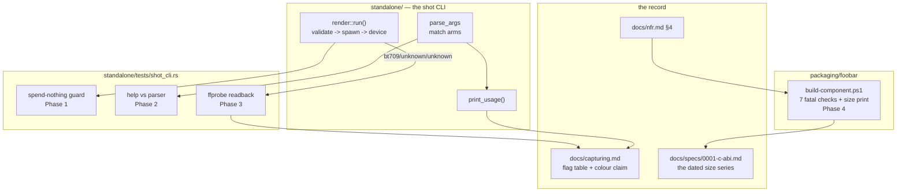

# 0148 — The shipped artifacts carry their own guarantees

> **Status:** in-progress — **unparked 2026-09-02, two phases owed.** Phases 1-4 are landed,
> reviewed and green (2026-09-01: no blockers, one major, six minors). The park's condition is
> **met**: `lmv-plan-0136` and `lmv-plan-0149` both closed on 2026-09-02 and this is now the only
> open lane, so Phase 5's method constraint — no other lane building while the size series is
> taken — holds for the first time since the plan opened. **It holds only until the next lane
> opens.** Run **Phase 6 first** (the review's repairs, no special conditions, and it makes the
> tree correct before the bisect reads it), then **Phase 5**. Until this plan closes, its lane is
> what holds Plan 0150's freeze gate.
> **Created:** 2026-09-01
> **Owner skill(s):** dev
> **Related ADRs:** [0159](../adrs/0159-the-component-gets-its-own-size-cap-and-the-recipe-carries-it.md)
> (proposed — the plugin's own cap and the recipe that carries it),
> [0071](../adrs/0071-a-numeric-test-contract-states-a-property-or-names-its-machine.md) (why a size
> is printed and a parser property is asserted),
> [0148](../adrs/0148-the-cli-refuses-an-argument-no-scanner-claimed.md) (the roster discipline
> Phase 2 extends to the second CLI)
> **Closes:** design-backlog 0175, 0176, 0174, 0177, 0178.

## TL;DR

Five claims this project makes about what it ships, none of which anything checks.
[Plan 0139](done/0139-the-render-path-validates-before-it-spends.md)'s spend-nothing ordering — the
entire reason that plan exists — is held up by nothing but the current line order in `render::run()`.
`shot`'s usage text and its parser can drift, on the CLI the `preset-author` lane has no other way to
discover a flag from. Two of the four colour tags `docs/capturing.md` calls *"the half most likely to
ship wrong"* do not survive into the container. The component's size cap has a trigger and no
carrier. And the larger half of its growth has never been looked at. The first visible behavior is a
test that fails if `--render` ever spends before it validates again.

## Context & problem

Four of these five came out of the closes of Plans 0139 and 0141 — the two plans that most recently
touched what gets shipped — and they share one shape: **the behaviour is correct today and nothing
holds it there.**

**Plan 0139's ordering is unguarded.** Its Phase 1 done-when is that a misspelt `--preset` *"exits 1
naming the roster's keys, spawns no child process, builds no GPU device, and leaves **nothing** at
`<path>`"*. The first clause is asserted; the last three are not. `resolve_preset` is tested as a
pure function, and **it returns the same answer whether its call site sits before or after
`Encoder::spawn`** — so the defect the plan exists to remove (a valid, playable, 262-byte audio-only
MP4 left at the destination) comes back the moment anyone reorders that function. Plan 0139's own
risks section warns against *"merging it into a larger refactor of `render::run()`"*; that refactor
reintroduces the artifact **with a green suite**. Two cross-flag rejections the same plan added —
`--crf` without `--ffmpeg`, and `--crf` outside `--render` — are also uncovered, and their `--ffmpeg`
siblings are asserted three lines apart in the same test file.

**The two CLIs are not held to the same standard.** [Plan 0144](done/0144-the-flags-mean-what-they-say.md)
built a flag roster for `lmv` and two tests over it, so that binary's help cannot fall behind its
scanner. `shot` has the same failure mode, no roster and no test: its flags are matched in one
`match` arm each and re-typed by hand into `print_usage()` and again into `docs/capturing.md`'s flag
table. Plan 0139 added `--crf` to all three correctly, and **nothing would have reported it if it had
not**. That matters here specifically because `shot` is the CLI the `preset-author` lane drives, and
`CLAUDE.md` routes that lane to `docs/capturing.md`, whose flag table is transcribed from the usage
text nobody checks — so a flag that exists and is undocumented is invisible to the only consumer that
needs it.

**Two colour tags do not reach the file.** `ffprobe` reads a file produced by the generated command
line as **`bt709/unknown/unknown`**, with `-color_trc bt709` and `-color_primaries bt709` both on that
command line. It was identical on both arms of Plan 0139 Phase 2's `--crf` comparison, so it is a
property of the shipped invocation and not of the new flag. `docs/capturing.md` states that *"the four
colour tags are the half most likely to ship wrong"* and argues `-color_trc bt709` over
`iec61966-2-1` on the ground that *"every player assumes the former"* — reasoning applied to arguments
that may have no effect. Nothing is known to be wrong on screen: the **range** tag produces the
washed-out failure and it does survive. What is wrong is that a guarantee is stated as a property and
is not verified as one, on the path [Plan 0103](0103-the-project-gets-an-audience.md) publishes from.

**The size cap is a duty, not a guard.** `packaging/foobar/build-component.ps1` runs seven fatal
checks over `foo_lmv.dll` and parses PE headers by hand to do it, but **never reads the file's
length** — the cheapest fact about the artifact and the only one NFR §4 constrains. Plan 0141 Phase 2
gave the re-measure a trigger that actually fires (every release) and it is still a duty performed
from memory. The record says that is not enough: the component grew **+3,015,168 B across Plan 0097
to Plan 0141**, every byte noticed retroactively, twice, by a reviewer rather than by the build.

**And the larger half of that growth is unattributed.** Plan 0141 Phase 3 bisected the window backlog
0118 named and attributed **98.4 %** of it to Plan 0100's MilkDrop work — a clean result that closed
its entry. It is also the *smaller* half: the re-measure found **+510,464 B beyond** the figure the
bisect ended at, larger than the +400,384 B that was worth filing an entry over, across roughly
twenty plans that have never been looked at. What makes it worth a second bisect rather than a shrug
is that the first one paid off — the answer was one plan, not "the sum of many small things".

## Decision

**Take the guards first, the investigations second, and let each investigation's phase state both
outcomes it is allowed to reach.** Phases 1 and 2 are pure test additions against behaviour that is
already correct, and they are the cheapest items here by a wide margin. Phase 3 establishes what is
actually true about the colour tags before changing either the command or the paragraph — backlog
0174 names argument *position* as the first suspect and the plan does not assume it. Phase 4
implements [ADR-0159](../adrs/0159-the-component-gets-its-own-size-cap-and-the-recipe-carries-it.md).
Phase 5 is the second bisect, last because it is the longest-running and the only one whose value is
a fact rather than a mechanism.

We rejected **building a shared flag-roster type both binaries construct from**, which backlog 0176
raises and declines: it is not obviously worth it for two CLIs, and the cheap half — one test
asserting `--help` prints every literal the parser accepts — buys the property that was actually
missing. We rejected **making the size check fatal** for the reasons ADR-0159 records. We rejected
**attributing every byte of the +510,464 B**: Phase 5 asks only what moved, and if the answer is
"one plan, and the growth is unwanted", that is a third entry rather than more of this plan.

## Architecture diagram



## Implementation phases

### Phase 1 — `--render` is held to spending nothing
- **Owner skill:** dev
- **What:** close backlog 0175. Assert the three clauses of Plan 0139 Phase 1's done-when that
  nothing checks, plus the two uncovered cross-flag rejections from its Phase 2.
- **Files touched:** `standalone/tests/shot_cli.rs`.
- **Done when:**
  - Driving `--render` with a name the roster does not hold **leaves no file at `--out`** and the
    process exits 1 naming the roster's keys. The reproduction backlog 0175 names is the one to use:
    `--preset attractor_leviathan` — a *filename* against a roster keyed on `name` — with
    `--ffmpeg no_such_encoder_binary`, so **no real encoder is needed**. If the ordering regresses,
    the spawn failure arrives first and the assertion on the roster keys fails.
  - The same test asserts stderr **does not** name `--ffmpeg`, which is what separates "validated
    first" from "tried to spawn and failed".
  - `--crf` without `--ffmpeg`, and `--crf` outside `--render`, are each rejected by an assertion,
    beside their existing `--ffmpeg` siblings.
  - `a_missing_encoder_names_the_flag_rather_than_falling_back` is the template — it asserts the
    mirror property of the same ordering — and the existing helpers (`render_clip()`, `run()`,
    `scratch()`, `assert_failed_naming()`) are reused rather than reinvented.

### Phase 2 — `shot`'s help cannot fall behind its parser
- **Owner skill:** dev
- **What:** close backlog 0176. Give `shot` the property Plan 0144 decided was worth holding for
  `lmv`: every flag literal the parser accepts appears in the usage text.
- **Files touched:** `standalone/src/shot/` (wherever `parse_args` and `print_usage` live),
  `standalone/tests/shot_cli.rs`, `docs/capturing.md` if the test finds the table already drifted.
- **Done when:** a test extracts the flag literals the parser's `match` arms accept — the way
  `every_scanner_flag_literal_is_rostered` extracts them — and asserts `--help`'s output contains
  every one; **it convicts under mutation**, verified by deleting one flag from the usage text and
  watching the test name it. A flag added to the parser and to nothing else fails the build.
  **The shared-roster type is explicitly not built**, per backlog 0176's own reasoning.

### Phase 3 — What the container actually carries
- **Owner skill:** dev
- **What:** close backlog 0174. Establish whether `-color_trc` and `-color_primaries` reach the file,
  then either move them or correct the paragraph that promises they do.
- **Files touched:** `standalone/src/shot/render.rs`, `standalone/tests/shot_cli.rs`,
  `docs/capturing.md`.
- **Done when:** the ordering is established by `ffprobe -show_streams` on a produced file — **not
  reasoned about** — and one of two things is true, stated explicitly in the commit message:
  - **They were being dropped** (argument position is the first suspect: colour options ahead of the
    output codec can bind to the input). They are moved, and a readback assertion in
    `standalone/tests/shot_cli.rs` — gated on the existing `ffmpeg_on_path()` — pins that a produced
    file reports all four tags. The claim in `docs/capturing.md` then becomes true and stays checked.
  - **They cannot survive H.264-in-MP4 as this command writes them.** The command is left alone and
    **`docs/capturing.md`'s paragraph is corrected** to claim only what the artifact carries — which
    means dropping the `-color_trc bt709` over `iec61966-2-1` argument, since it reasons about a flag
    with no effect.

  Either way the phase ends with the doc and the artifact agreeing, and the agreement asserted where
  an encoder is available.

### Phase 4 — The recipe reads its own output's length
- **Owner skill:** dev
- **What:** close backlog 0177 by implementing ADR-0159 — the component's own cap in `docs/nfr.md`,
  and a size print plus a soft warning in the recipe.
- **Files touched:** `packaging/foobar/build-component.ps1`, `docs/nfr.md` (§4),
  `docs/specs/0001-c-abi.md` (the series' cap reference).
- **Done when:**
  - `docs/nfr.md` §4 states the component's cap as **12,582,912 B (12 MiB)**, with the unit in the
    number, and the exe's line carries a unit too. Neither figure is written with a tilde any more.
  - The recipe prints the produced DLL's length on every build, in bytes, in the same units the
    spec's series records — so extending that series is a copy, not a measurement.
  - It emits a **warning** — never a `Die` — above **11,324,620 B** (90 % of the cap). The seven
    existing fatal checks are untouched, and a release cannot fail on a size.
  - **The warning arm is exercised, not merely written.** It is verified against a forced threshold
    (or a fixture length), because at today's 9,789,952 B the real branch is 1,534,668 B away and
    would otherwise ship untested.
  - The constant cites NFR §4 by section, and a packaging test asserts the two agree — two copies of
    a number is the shape this project keeps finding rot in.

### Phase 5 — The second bisect
- **Owner skill:** dev
- **What:** close backlog 0178. Find what moved the component's **+510,464 B** between 2026-08-18
  and 2026-09-01.
- **Files touched:** `docs/specs/0001-c-abi.md` (the series gains attribution),
  `docs/design-backlog.md`.
- **Done when:** the window's `chore: Release` commits have each been built (`core-cabi` only) and
  `lmv_core_c.dll` read, and the phase reports **one of two findings**, both of which are results:
  - **A dominant step** — one commit window accounting for the majority of the growth, named in the
    spec's series the way Plan 0100 now is.
  - **Distributed growth** — no single step above **66,560 B** (5x the noise floor below), reported
    as such rather than as a failure to find a cause.

  Three method constraints Plan 0141's bisect learned and this one inherits:
  - **Record the `rustc` version at every point.** Rebuilding `22bb460` in 2026-09 gave a number
    **13,312 B** from the one measured at that commit in 2026-08 under the same build command, and
    nothing recorded at either date explains the gap. **That is the working noise floor for this
    column: any single step under ~13,312 B is uninterpretable.**
  - **Read the cdylib, ship the number for `foo_lmv.dll`.** The shim links the staticlib, so
    `lmv_core_c.dll` is a proxy — fine for *locating* a step, not the artifact the cap is about.
  - **No other lane may be building** while the series is taken, or the wall-time is void and the
    builds contend. (Sizes are not timings, but a contended build can fail and be silently retried.)

  **If the growth turns out to be attributable and unwanted, that is a third backlog entry**, not
  more of this phase. This phase asks only what moved.

### Phase 6 — The repairs the close review found
- **Owner skill:** dev
- **What:** the review of Phases 1-4 (2026-09-01, this session) found one major and three minors in
  the code and the records. They are listed here rather than in the log because they are contract,
  not report. The ADR-0159 items the same review found are already repaired — that document is
  `architect`-owned and still `proposed`.
- **Files touched:** `docs/specs/0001-c-abi.md`, `docs/releasing.md`,
  `packaging/foobar/build-component.ps1`, `standalone/src/shot/render.rs`, `docs/capturing.md`,
  `standalone/tests/shot_cli.rs`.
- **Done when:**
  - **`docs/specs/0001-c-abi.md` stops contradicting itself.** Its size-series paragraph (edited by
    Phase 4) says the recipe prints the length on every build; ~80 lines below, the re-measure
    paragraph still says *"Nothing **mechanically** reads the size yet: the recipe never looks at
    its own output's `Length`"* and *"this remains a duty a person performs"*. The second passage is
    rewritten to describe the guard Phase 4 built. Its `design-backlog 0177` citation points at
    `design-backlog-archive.md` once that entry is archived at the close.
  - **`docs/releasing.md`'s *"While you are here: read the component's size"* section is rewritten.**
    All three of its claims are now false: the `~10 MB soft cap` it attributes to NFR §4 (which now
    states 12,582,912 B for the component), the hand `(Get-Item ...).Length` two code blocks below
    the recipe that prints exactly that, and *"Nothing enforces this yet"*. The section keeps its
    purpose — telling a releaser what to do with the number — and states that the figure now arrives
    in the build output and that the recipe warns above 11,324,620 B. This file was missing from
    Phase 4's file list and from the log's `Operator docs touched` bullet.
  - **`packaging/foobar/build-component.ps1`'s header stops saying every check is fatal.** Line 16
    reads *"Every check below is fatal"*; the size step below it is a `Step`/`Check` in the same
    vocabulary as the seven fatal ones and deliberately never `Die`s. One clause naming the
    exception is enough.
  - **`a_render_that_cannot_name_its_preset_spends_nothing` pins its own roster.** It passes no
    `--presets`/`--preset-file`, so `err.contains("Leviathan") && err.contains("Supernova")` is an
    assertion about the machine's per-user preset directory, which outranks the embedded set and is
    seeded write-if-absent — a preset renamed in `presets/` leaves a stale copy there and the test
    keeps passing off it. Adding `--presets presets` pins it to the repository. The ordering
    property under test is unchanged, and the test must still convict when `Encoder::spawn` is moved
    above `resolve_preset` (verified at the review by doing exactly that).
  - **The dropped-tag finding names the build it was measured on.** `standalone/src/shot/render.rs`
    and `docs/capturing.md` both attribute the loss to *"the libx264 path"* without qualification;
    the measurement is ffmpeg 8.1 (gyan.dev full build), recorded only in this plan's log, and the
    readback test runs only where `ffmpeg` and a GPU are both present. Per ADR-0071's prose
    corollary, one clause naming the build goes in both places. The finding reproduced independently
    at the review on that build; nothing claims it was seen on a second one.

## Data shapes

No new types. The one thing worth pinning is the cap constant's shape in the recipe, because
ADR-0159's negative is that it can drift from the NFR:

```powershell
# illustrative — not the final script
# NFR section 4: the component's soft cap. A size is a MEASUREMENT (ADR-0071):
# printed always, warned on above 90 %, and never fatal.
$ComponentCapBytes  = 12582912
$ComponentWarnBytes = 11324620
```

## Risks & open questions

- **Phase 3 may find a third answer.** `bt709/unknown/unknown` could be an `ffprobe` reporting
  convention rather than a missing tag. The phase's done-when is written around establishing what is
  true, not around either repair, so a third finding is representable — it lands as the doc
  correction with the reason stated.
- **Phase 5 may not resolve.** Twenty plans of small steps under a 13,312 B noise floor is a real
  possible outcome and the phase names it as a finding rather than a miss.
- **Phase 4's warning threshold is the only untested branch this plan adds**, which is why its
  done-when requires exercising it rather than writing it.
- **Phase 1's test depends on a failure path staying a failure path.** It uses
  `--ffmpeg no_such_encoder_binary` so no encoder is needed; if a future change makes a missing
  encoder non-fatal, the test's mechanism changes meaning. The assertion that stderr does **not**
  name `--ffmpeg` is what keeps that legible.
- **Phase 2 could pass vacuously** if the extraction finds no literals. The mutation check in its
  done-when is what makes it convict, and is not optional — backlog 0104 is this repository's
  standing example of a detector that matches nothing and exits 0.

## What this plan does NOT do

- **It does not build a shared CLI roster type.** Backlog 0176 names that as the expensive half and
  declines it for two CLIs; so does this plan.
- **It does not change what `shot --render` encodes.** Phase 3 may move where two arguments sit on
  the command line; it does not touch the codec, the rate, or `--crf`.
- **It does not make the size cap enforceable.** ADR-0159 decides it warns, and a release must
  remain possible over it.
- **It does not measure the standalone exe's size**, so NFR §4's exe cap keeps its inherited value
  and gains only a unit.
- **It does not act on Phase 5's finding.** Attribution is the deliverable; a reduction, if one is
  wanted, is a later entry.

## Implementation log

> Written by `dev` — one row per phase as that phase's commit lands, and the close block after the
> last one. **The phases above are the contract; everything here is what happened.**

**Lane:** `plan-0148-the-shipped-artifacts-carry-their-own-guarantees`, worktree `WORK/lmv-plan-0148`, forked from `main` at `fd54b43`.

| phase | owner | state | commit |
|---|---|---|---|
| 1 — `--render` is held to spending nothing | dev | done | d527820 |
| 2 — `shot`'s help cannot fall behind its parser | dev | done | 277e372 |
| 3 — What the container actually carries | dev | done | 393a332 |
| 4 — The recipe reads its own output's length | dev | done | 690fb29 |
| 5 — The second bisect | dev | done | committed with this row |
| 6 — The repairs the close review found | dev | done | e3af0c3 |

### Notes

**Phase 3 reached neither of the two outcomes its done-when names, and took a third.** The
done-when asks for the finding to be stated explicitly, so:

- **Argument position is not the cause.** The colour options ahead of `-pix_fmt` read back
  identically, and so does dropping `-color_range pc` — the range tag comes off the Y4M header,
  which declares `XCOLORRANGE=FULL`, so that argument was already redundant.
- **The tags are not unwritable in H.264-in-MP4 either.** `-colorspace` *is* honoured by the
  libx264 path (asking for `bt2020nc` lands `bt2020nc`; omitting the flag leaves the matrix
  `unknown`), while `-color_primaries` and `-color_trc` are dropped by it (asking for `bt2020` and
  `smpte2084` leaves both `unknown`). The loss is in the encoder wrapper, not in the container and
  not in what `ffprobe` reports.
- So the repair is the first outcome's *shape* by a mechanism the plan did not name:
  `-x264-params colorprim=bt709:transfer=bt709` sets the two directly and all four tags read back.
  The existing flags stay beside it. Measured on ffmpeg 8.1 (gyan.dev full build); a build that
  honours the flags gets the same values from both sources.

**Phase 2's file list named `standalone/src/shot/`; `parse_args` and `print_usage` live in
`standalone/examples/shot.rs`.** The plan hedges ("wherever they live") and the test reads that
file through `include_str!`. No shared roster type was built, per backlog 0176.

**Phase 2's test convicted on its first run**, which is why `docs/capturing.md` is in that commit:
`--help` and `-h` are accepted by the parser and were absent from the usage text, from the
example's module header, and from the doc's flag table. All three now carry them.

**Phase 4 put its agreement test in `core/tests/hygiene.rs`** (a new guard (d)) rather than in a
new packaging test target — that file is already the workspace-wide convention guard, is std-only,
and runs in the everyday loop. `-WarnBytes` was added to the recipe so the warning arm stays
reachable; the arm was exercised against a staged 9,564,672 B DLL and the run continued past it.
The percentage is formatted invariant-culture after this box printed `76,0`.

**A trap worth knowing before repeating any mutation check here:** `cargo nextest run --test
shot_cli` does **not** rebuild the `shot` example the suite spawns as a subprocess, so a mutation
appears to have no effect. `cargo build -p standalone --example shot` first.

**Phase 5 reached neither of the two outcomes its done-when names, and took a third** — the same
shape Phase 3 did. All 34 points built, 33 steps, `rustc 1.97.1 (8bab26f4f 2026-07-14)` at every
one, sole lane on the box before and after.

- **Not a dominant step:** the largest single window is `7524b3f` at +122,368 B, which is 24.0 %
  of the +509,952 B — not the majority the done-when asks for.
- **Not distributed either:** two steps clear the 66,560 B bar and twelve steps moved exactly 0 B,
  so the done-when's second finding is false as stated.
- **The dominant thing is a cause, not a step.** `presets/*.toml` grew 185,563 B -> 525,603 B over
  the window, 40 presets to 81, and `build.rs` embeds each verbatim, so **340,040 B of the
  509,952 B — 66.7 % — is preset text**. Both large steps are preset-adding closes, and `6969043`
  *shrinks* by 27,648 B where Plan 0125 shared the scenes' GPU boilerplate.

Two cross-checks worth having: the baseline rebuild of `22bb460` gave 9,204,736 B, bit-identical to
Plan 0141's 2026-09 rebuild of the same commit, so the two bisects share a measurement chain; and
the cdylib's +509,952 B tracks the shipped component's +510,464 B, which is the first direct
evidence that the proxy the method rests on is a good one.

The done-when's `foo_lmv.dll` figure is unchanged — the series' shipped column is not re-measured
by this phase, only attributed.

### Close triggers

- **`presets/` touched:** no.
- **Plan header `Closes:`** design-backlog 0175, 0176, 0174, 0177, 0178. **0178 is not closed** —
  it is Phase 5's entry and Phase 5 did not run. The other four are discharged.
- **What shipped:** a fix (two colour tags now reach the container — metadata only, no encoded
  sample moves), a feature (the component recipe prints its output's length and warns above a
  threshold), three new tests and one extended, and doc corrections.
- **Operator docs touched:** `docs/capturing.md` (the flag table gains `--help`; the colour
  paragraph now states what the artifact carries and cites the test that checks it), `docs/nfr.md`
  §4 (two capped figures with units; the component gains its own cap), `docs/specs/0001-c-abi.md`
  (the size series reads the new cap; headroom restated as 2,792,960 B and 77.8 % of cap).
- **Backlog probes (`node scripts/check-backlog-claims.mjs`):** **exit 1, four broken** — 0174,
  0175, 0176 and 0177. Each is an `absent:` probe asserting its defect is still present, and each
  now matches the test or the constant that fixes it, so all four are ready to archive. 0178 is
  unaffected. No probe was edited.
- **Full suite:** `cargo nextest run --workspace`, **exit 0**, `1503 tests run: 1503 passed
  (52 slow), 5 skipped` in 812.385 s. Run in the lane on the hardware adapter. The wall time is not
  a comparable figure — another lane built during part of the session.
- **Outstanding `human` phases:** none; the plan has no `human` phase. Phase 5 is `dev` and held.

## Followups (after this lands)

- If Phase 5 finds attributable, unwanted growth: a new backlog entry for the reduction.
- If Phase 3 finds the tags are droppable in general: whether the other two survive is worth the same
  readback on the macOS arm, which this plan does not reach.
