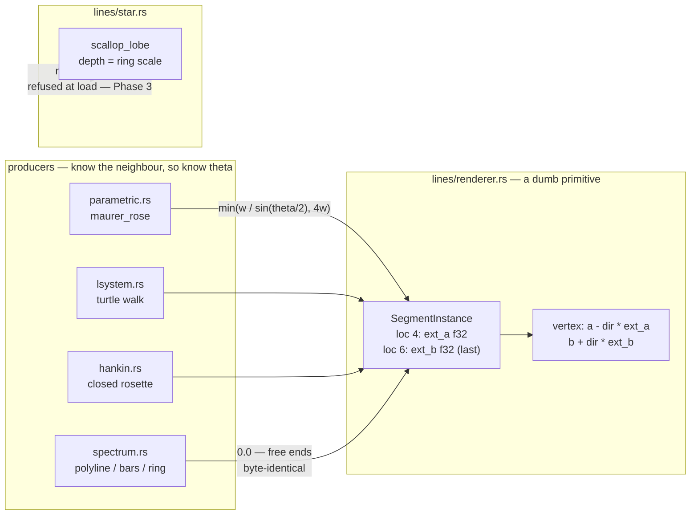

# 0149 — The line corners stop being blunt

> **Status:** in-progress
> **Created:** 2026-09-01
> **Owner skill(s):** dev
> **Related ADRs:** [0158](../adrs/0158-a-joined-end-carries-its-own-miter-length.md) (proposed — a
> joined end carries its own miter length), [0041](../adrs/0041-line-joins-are-per-endpoint-on-the-segment-instance.md)
> (whose geometry half 0158 supersedes and whose granularity it keeps),
> [0007](../adrs/0007-line-geometry-generators.md) (the fixed-capacity instance buffer),
> [0071](../adrs/0071-a-numeric-test-contract-states-a-property-or-names-its-machine.md)
> **Closes:** design-backlog 0134, 0135, 0136, 0144.

## TL;DR

A joined corner in this engine is extended by a flat half-width, which is the correct extension for
exactly one interior angle — 180 degrees. Every sharper corner truncates to a bevel: a `diamond`'s
61.9-degree vertex needs 26.3 px of a 13.5 px half-width and gets 13.5, so the point reads as a flat
cut and the inner side sums to 1.38x the stroke. It arrived as a user complaint on the running app,
and it is now *concentrated* rather than diffuse, because Plan 0087 converted the curved motifs to
arcs and left the straight figures behind. This plan makes the producer compute the miter it already
has the angle for, and takes the three other entries that live in the same two files while they are
open. The first visible behavior is the plumbing landing **golden-identical** — the instance carries
a length instead of a flag, and nothing moves until Phase 2 puts the real number in it.

## Context & problem

[ADR-0041](../adrs/0041-line-joins-are-per-endpoint-on-the-segment-instance.md) gave
`SegmentInstance` a per-endpoint `joined` bitfield and had the vertex shader do

```wgsl
let ext_a = select(0.0, width, (joined & JOINED_A) != 0u);
```

A corner of interior angle `theta` needs `width / sin(theta / 2)`. The shipped constant is that
expression's `theta -> 180` limit, so the shortfall grows without bound as the corner sharpens.
Measured 2026-08-27, a single `diamond` filling a 1000x1000 frame at `thickness = 9`: **26 px of
flat 185 and then zero, with no taper at all**, and the corner patch reads **1.38x the stroke's own
value**. Both halves are the same missing factor, `1 / sin(30.95 deg) = 1.945`.

**ADR-0041 saw this and accepted it, on a premise Plan 0114 removed.** Its rejection of a true miter
reads *"a mitred corner and a rounded one differ by less than the blur that is already there"*, and
its disc-join alternative closes with *"worth revisiting only if the blunt corners above turn out to
matter"*. [Plan 0114](done/0114-the-line-stroke-reads-as-a-drawn-line.md) took `DEFAULT_SOFTNESS` to
`0.25`; there is no blur left. And they turned out to matter — at
[Plan 0087](done/0087-the-line-renderer-draws-a-curve.md) Phase 7, in the running app: *"how straight
lines are connected, its clearly visible and doesn't look solid"*.

Three smaller entries sit in the same two files, and each is cheaper to take now than to schedule
later.

**`parametric_curve` commits ~6.5 MB at Rich for buffers nothing fills.** Plan 0087 Phase 5 gave
`ParametricCurveScene` five `Vec::with_capacity(max_segments)` buffers — `arcs` and `single_arcs`
(36 B each), `points` (8 B), `pieces` (~24 B), `walk` (4 B). At Rich's `max_segments = 60_000` that
is 108 B x 60,000 = **6,480,000 B of Rust heap**, on top of the ~4.8 MB `segments` and `single_buf`
already cost — it more than doubles the scene's allocation. **Four of the five stay permanently
empty for every preset in the library**, because every shipped `d` is a chord web and
`maurer_rose_pieces` declines the fit before it ever fills them. The same plan already found the
answer one file over: `star.rs` sizes its arc buffers at load from the roster the preset actually
declared and reserves nothing when there are none. A second, smaller defect rides along — `points`
is **one short**: its capacity is `max_segments` and `maurer_rose_pieces` pushes `drawn + 1`, so a
preset binding `samples` at the cap reallocates once inside a path whose own doc says *"Allocation-
free into preallocated buffers, because this runs every frame"*.

**A negative ring `scale` inverts a `scallop` lobe.** `star.rs`'s `scallop_lobe` takes the ring
`scale` as the lobe's **depth**. Past `depth ~ -R * (cos(s) + sin(s) - 1)` the arc's two ends move to
the far side of its centre and the counter-clockwise sweep runs the long way round: the lobe bulges
*outward* to roughly twice the ring radius instead of dimpling inward. No panic, no cap violation,
nothing warns. Its own comment names the wrong lever — it says the guard covers only the exactly-flat
case *"(`ring_scale` clamps at zero)"*, but `ring_scale` is the **bindable multiplier**, which is
clamped, while the **structural per-ring `scale`** is validated for finiteness alone in `schema.rs`,
and the two sibling arc branches carry explicit `.abs()` handling precisely because a negative one is
reachable. A second over-claim sits four lines below: *"the sweep between them is under half a turn
for any depth"* is false past the same threshold. **No shipped preset can reach it** —
`star_mandala_bordered` binds a `ring_scale` positive everywhere and its ring `scale` is `0.055`.

**And a contract in `marks.rs` is stated unconditionally that holds only for equal spikes.** Plan
0098 Phase 1 restored the `star` arm's interior contract, but under `star_jitter` the divisor is the
**unjittered** figure's while the measured distance is the fragment's own spike's, so the coordinate
at the centre is `0.076`-`0.085` rather than `0`, with a `max(0.0, ·)` guard in the shader for when
the asymmetry runs the other way. That is a large improvement on the `-0.23`..`-0.94` it replaced and
it is **not what the module header says**. Three one-line repairs travel with it, collected at Plan
0098's review so none of them lives only in a transcript.

## Decision

**The producer computes the miter length and the instance carries it as an `f32`**, per
[ADR-0158](../adrs/0158-a-joined-end-carries-its-own-miter-length.md) — a segment cannot see its
neighbour's direction, which is exactly why ADR-0041 put connectivity on the producer side, and the
angle is one step further along the same argument. `SegmentInstance.joined: u32` becomes `ext_a: f32`
in place at location 4, `ext_b: f32` is appended **last** at location 6, and `0.0` is exactly "free
end" so a producer that passes nothing stays byte-identical.

**The plumbing and the geometry land as separate commits.** Phase 1 changes what the instance carries
while every producer still passes `width` for a joined end, so it is provably golden-neutral — if a
baseline moves in Phase 1, the vertex-attribute wiring is wrong and nothing else is being debugged at
the same time. Phase 2 puts the real miter in and the line goldens re-bless. That split exists
because this exact struct carries a comment recording that a field added anywhere but the end
*"compiles, renders, and quietly reinterprets every stroke's join bits as alpha's mantissa — which is
what it did, moving five composite golden baselines"*.

For backlog 0136 we take the **load-time refusal** over drawing an inward lobe correctly. **This is a
stated guess, not a settled question:** the entry frames it as *"a decision about whether an inward
scallop is a look anyone wants"*, no shipped preset is in range, and the refusal is the honest and
cheaper of the two. If an inward scallop is wanted, that is a `preset-author` ask that comes back as
its own entry — and the refusal is what makes it come back, rather than shipping a silent bulge.

We rejected **drawing a round join in the fragment** and **ADR-0041's disc-per-vertex** for the
reasons ADR-0158 records. We rejected **doing 0135's re-sizing before 0134**, because the miter does
not change the buffer count and doing the cheap allocation work first would put the golden-moving
phase last, where a failed bless strands it.

## Architecture diagram



## Implementation phases

### Phase 1 — The instance carries a length, and nothing moves
- **Owner skill:** dev
- **What:** replace the join bitfield with two per-endpoint extension lengths, with every producer
  passing `width` where it previously set a flag. Pure plumbing, and the phase's whole value is that
  it isolates the vertex-attribute wiring from the geometry change.
- **Files touched:** `core/src/render/scenes/lines/renderer.rs` (the struct, the attribute array, the
  WGSL), `parametric.rs`, `lsystem.rs`, `hankin.rs`, `spectrum.rs`.
- **Done when:**
  - `SegmentInstance` is **44 bytes**: `ext_a: f32` replaces `joined: u32` **in place at shader
    location 4** (the offset is unchanged), `ext_b: f32` is appended **last** at location 6, and
    `alpha` keeps location 5 and its byte offset. A test asserts `size_of::<SegmentInstance>()` and
    the offset of `alpha`, so a field inserted in the wrong place fails rather than renders.
  - **Every golden in the suite is unmoved, unblessed.** This is the acceptance oracle for the phase
    and there is no exception: passing `width` at a joined end reproduces ADR-0041's geometry
    exactly. A moved baseline here means the wiring is wrong.
  - The generated `const JOINED_A` / `JOINED_B` WGSL and the swap-detection assertion that guarded
    them are **deleted**, not left orphaned — a float extension has no bits to renumber. The
    first/last-point assertion (that the stroke does not reach past the figure's own endpoints)
    survives, now pinned by `ext == 0.0` rather than by a single bit.

### Phase 2 — The corner reaches its point

> **Amended 2026-09-01, after Phase 1 landed.** Phase 1's implementation established three things
> this block was written without: the real producer roster, that `warp_mesh` is a producer using the
> extension as a **cap**, and that the cached scenes restyle per frame. A fourth is new and is a
> **stop gate** — see the aspect question below. [ADR-0158] carries the scope decision.

- **Owner skill:** dev
- **What:** each producer **in the four line families** computes
  `min(width / sin(theta / 2), MITER_LIMIT * width)` for a joined end. Closes backlog 0134.
- **Files touched:** `core/src/render/scenes/lines/` — `renderer.rs` (the `MITER_LIMIT` constant and
  its doc), `curves.rs`, `parametric.rs`, `turtle.rs`, `hankin.rs`, `spectrum.rs`, `star.rs` — their
  test modules, and the line goldens.

  **Not `lsystem.rs`**, which sets no extension: the L-system's producer is `turtle.rs`. **Not
  `warp_mesh/draw.rs`**, per the scope rule below.

#### The scope rule: `warp_mesh` keeps the flat half-width

`warp_mesh/draw.rs` is a seventh `SegmentInstance` producer and it is **out of scope**, at both call
sites — `polyline` and `dots`. [ADR-0158]'s Scope paragraph carries the three reasons; the one that
decides it is that `warp_mesh` pins `MILKDROP_SOFTNESS = 1.0` rather than `DEFAULT_SOFTNESS = 0.25`,
so the "there is no blur left" premise that supersedes ADR-0041 is absent on that surface and
ADR-0041 still holds there on its own terms.

`draw::dots` additionally has **no interior angle at all**: it emits a zero-length segment whose two
extensions are a **cap**, the thing that makes a bead a bead rather than a sub-pixel dash. A miter
expression evaluated there has no `theta` to take a sine of.

**Done when:** `core/src/render/scenes/warp_mesh/**` is untouched by this phase's diff, and the
composite and MilkDrop goldens are **unmoved and unblessed**. That is the phase's second oracle and
it is as load-bearing as the first: a moved composite baseline means the scope rule was not held.

#### The cached producers need no special case, and here is why

`turtle`, `hankin` and `star` build their figures at `configure` against `PLACEHOLDER_WIDTH` and are
restyled every frame by `LineInstance::styled`, which carries the extensions across by the width
ratio. A miter computed at build time survives that unchanged, and the reason is worth stating
because it is not obvious:

- **The whole expression is homogeneous of degree 1 in `width`.** Both `width / sin(theta / 2)` and
  the clamp `MITER_LIMIT * width` scale linearly, so `ext(c * w) == c * ext(w)` — the clamp commutes
  with the rescale and cannot be engaged on one side and not the other. Computing the miter in
  placeholder units and multiplying by `frame_width / PLACEHOLDER_WIDTH` is exactly computing it at
  `frame_width`.
- **`theta` is invariant under every transform between the producer and the shader** — uniform
  scale, rotation, reflection and the mirror replication are all similarities, and a similarity
  preserves angles. `normalize_fit` is a uniform scale too.

So the cached producers compute `theta` from their build-time geometry like everyone else. **The one
thing that must not happen is a producer writing a miter into `ext_*` while leaving `width` at some
other value** — the ratio rescale is only correct while the two are in the same units.

#### Stop gate — which space is `theta` measured in?

**This gate can halt the phase, and it is not rhetorical.** The shader applies the extension along
`dir` computed **after** the aspect divide; the producer computes `theta` in **world** coordinates.
A flat `width` never had to care — a constant is orientation-independent. A miter does.

Swept numerically at 16:9 for the diamond's 61.9-degree vertex, a world-space miter factor lands
between **0.705x and 1.609x** of the aspect-corrected one depending on the corner's orientation. At
aspect 1.0 the ratio is **identically 1.000x** — and the fixture this plan specifies for its own
measurement is **1000x1000**. The plan's instrument is blind to the question by construction, which
is the failure mode this project has shipped twice under ADR-0037.

**Do this before writing any miter arithmetic**, because the answer changes what the producer can
compute:

1. Render one `diamond` at `thickness = 9` at **1280x800** as well as 1000x1000 — a size this repo
   already uses precisely because 16:9 and its own 2048x1152 display agree where others do not.
2. With the **Phase 1 tree** (flat `width`, no miter), measure the stroke's half-thickness at a
   near-horizontal and a near-vertical segment of the same figure. If they differ by more than
   golden's own `0.02` drift floor, world space and the extension's space are **not** similar.
3. **Then one of two things is true, and the commit message says which:**
   - **They are similar.** The producer's world-space `theta` is the right angle, the arithmetic in
     this phase is correct as written, and the phase proceeds. Record the two measurements.
   - **They are not similar.** The producer **cannot** compute the length from world coordinates
     alone, and every option that fixes it — passing the neighbour direction, passing the bisector,
     handing the producer the aspect — changes what the instance carries and therefore changes
     [ADR-0158]. **Stop and route to `architect`.** Do not proceed on an approximation, and do not
     bless a golden taken at 1:1 to cover it.

  **A note on step 2, so it is not mis-run:** it measures the *existing* Phase 1 geometry, not the
  miter. It is asking whether the space the extension lives in is the space the angle would be
  measured in — a property of the renderer that predates this plan and that this plan is the first
  to depend on.

#### Done when

- `MITER_LIMIT = 4.0` is a named constant whose doc states **what it is derived from** — it serves
  every corner down to `2 * asin(1/4) = 28.96 degrees` exactly, it is SVG's `stroke-miterlimit`
  default, and it was adopted rather than measured. Per ADR-0071 that is a stated property, not a
  frozen measurement.
- **The measured defect is gone on its own fixture.** A `diamond` at `thickness = 9` in a 1000x1000
  frame no longer reads 26 px of flat and then zero through the 61.9-degree vertex; the profile
  tapers. The diamond's factor is **1.945**, well inside the limit, so this corner is served
  *exactly* and the limit is not engaged — assert the computed extension against `width * 1.945`
  within a tolerance derived from `f32` angle precision, on the CPU, where `theta` is available
  directly rather than through a rendered frame.
- **Each of the five in-scope producers has its own test** that a joined end's extension corresponds
  to the angle it actually forms, and that a free end is `0.0`. ADR-0158's stated negative is that a
  producer computing the angle wrongly now renders a *wrong-length* stroke rather than merely
  keeping the notch — a test per producer is the answer to that, not a comment. `curves.rs` and
  `parametric.rs` are two producers and get two tests; `turtle.rs`, `hankin.rs` and `star.rs` are
  the cached three.
- `spectrum`'s `Bars` and `RadialRing` baselines are **still unmoved**, which is ADR-0041's original
  property and the one thing Phase 2 must not cost.
- **`warp_mesh` is untouched and the composite and MilkDrop goldens are unmoved** — the scope rule's
  own oracle, above.
- The stop gate above has been run and its outcome recorded in the commit message.
- The line goldens are re-blessed. **`LMV_BLESS` rewrites every baseline, not the failing scene's**
  — restore the unrelated ones before committing, and compare adapters before trusting a bless.

### Phase 3 — A `scallop` refuses a depth it cannot draw
- **Owner skill:** dev
- **What:** close backlog 0136. A negative structural ring `scale` on a `scallop` is refused at load
  with a message naming the ring, rather than silently bulging outward.
- **Files touched:** `core/src/preset/schema.rs`, `core/src/render/scenes/lines/star.rs`.
- **Done when:** a preset declaring a `scallop` ring with negative `scale` fails to load with a
  message naming the ring and the constraint; **both over-claiming comments are corrected** — the one
  citing `ring_scale` (the bindable multiplier, which is clamped) where the structural `scale` is
  meant, and the *"the sweep between them is under half a turn for any depth"* line four below it,
  which is false past the same threshold. Every shipped preset still loads: `star_mandala_bordered`'s
  ring `scale` is `0.055` and its bound `ring_scale` is positive everywhere.

### Phase 4 — `parametric_curve` reserves what a preset declared
- **Owner skill:** dev
- **What:** close backlog 0135. Size the five arc/piece buffers at load from what the preset actually
  declares, the way `star.rs` already does, and fix the `points` off-by-one.
- **Files touched:** `core/src/render/scenes/lines/parametric.rs`, `docs/nfr.md` (§12).
- **Done when:**
  - A shipped preset — every one of which is a chord web that `maurer_rose_pieces` declines — reserves
    **nothing** for the four buffers it never fills, against today's 108 B x `max_segments` for all
    five. At Rich's 60,000 that is 6,480,000 B not committed.
  - `points` is capacious enough for `drawn + 1` at `samples == max_segments`, so the path that
    documents itself as *"allocation-free into preallocated buffers"* is not falsified by its own
    cap.
  - **No golden moves and no preset changes what it draws** — this is an allocation change only.
  - **`docs/nfr.md` §12 is re-read against the real numbers and corrected if it is the thing that is
    wrong.** It claims *"our own Rust state stays <~1 MB"*, and the pre-Plan-0087 4.8 MB already
    exceeded that. Either the line gets a figure it can defend or it says what it actually bounds;
    it does not stay as it is.

### Phase 5 — Four contracts that say more than they hold
- **Owner skill:** dev
- **What:** close backlog 0144's four collected repairs, plus the doc-block nit backlog 0134 carries.
  Prose and one-line fixes; nothing renders differently.
- **Files touched:** `core/src/render/scenes/marks.rs`, `core/src/render/scenes/marks/tests.rs`,
  `core/src/preset/schema.rs`, `core/src/render/scenes/lines/renderer/tests.rs`.
- **Done when:**
  - **The exactness claim is qualified.** `marks.rs`'s header and `mark_distance`'s doc block say the
    interior contract is exact for **equal spikes**, and state what `star_jitter` actually yields
    (`0.076`-`0.085` at the centre) and why the `max(0.0, ·)` guard is there. **The prose is
    corrected, not the divisor** — making the jittered arm's divisor the fragment's own spike's would
    make it depend on which spike a fragment folded onto, which is the very thing Plan 0098 Phase 1
    walked the unjittered edge to avoid, and backlog 0144 says so.
  - `schema.rs` reads `shape_field`'s `COORD_MODES` instead of hardcoding `m.clamp(0.0, 1.0)`.
  - The CPU mirror of `mark_boundary_radius` either **is** literally identical to the WGSL or its
    comment stops promising identity and names the one divergence (`abs(p.x) + 1e-20` against
    `max(len, 1e-20)`, which differ only at `p == (0,0)` where the coordinate is `0` either way).
  - `the_radius_mode_bands_scaled_copies_where_the_distance_bands_offsets`'s failure message names
    the figure it actually renders — a triangle, not a pentagon.
  - In `lines/renderer/tests.rs`, the doc block deriving the arc comparison's tolerances gets a blank
    line before `SOFT_PROFILE`'s, so `ARC_MEAN_TOL` and `ARC_OUTLIER_TOL` are documented by their own
    derivation rather than attaching to the wrong constant. The values are right — `0.02` and `48`
    match `golden.rs` exactly — and this is the ADR-0071 failure one level down.

## Data shapes

```rust
// illustrative — not the final interface
#[repr(C)]
pub struct SegmentInstance {
    pub a: [f32; 2],       // loc 0, offset 0
    pub b: [f32; 2],       // loc 1, offset 8
    pub color: [f32; 3],   // loc 2, offset 16
    pub width: f32,        // loc 3, offset 28
    /// Miter extension at `a`, in world units. `0.0` == free end, which is
    /// byte-identical to a producer that flagged nothing under ADR-0041.
    /// Replaces `joined: u32` IN PLACE — same location, same offset.
    pub ext_a: f32,        // loc 4, offset 32
    pub alpha: f32,        // loc 5, offset 36 — unchanged, see its own doc
    /// Miter extension at `b`. **Declared last**, for the reason `alpha`'s
    /// doc block records: `vertex_attr_array!` derives offsets from location
    /// order, so a field inserted earlier silently re-points every attribute
    /// after it.
    pub ext_b: f32,        // loc 6, offset 40 — total 44
}
```

## Risks & open questions

- **`theta` may not be measured in the space the extension is applied in, and this plan's own
  fixture cannot tell.** The shader extends along `dir` computed after the aspect divide; the
  producer computes the angle in world coordinates. A flat `width` was orientation-independent
  and never had to care. Swept at 16:9, a world-space miter factor lands between **0.705x and
  1.609x** of the aspect-corrected one for the diamond's 61.9-degree vertex; at aspect 1.0 it is
  identically 1.000x, and the specified fixture is 1000x1000. **Phase 2 opens with a stop gate**
  that measures this at 1280x800 before any miter arithmetic is written. Found while amending
  the plan after Phase 1, not by the plan as first written.
- **The golden re-bless is the largest cost here and it is bookkeeping.** `LMV_BLESS` is not scoped
  to the failing scene, so unrelated baselines must be restored before committing, and a bless taken
  on the wrong adapter can freeze garbage — this repo has blessed a WARP bind-layout aliasing bug
  before. Compare adapters before trusting Phase 2's output.
- **Phase 1 could move a golden.** That is the phase failing, not a finding to bless around: passing
  `width` at a joined end is arithmetically identical to today, so a moved pixel means the attribute
  wiring is wrong.
- **A closed chain's ends are genuinely free and stay bevelled.** The rosette is closed and every
  vertex is a joint, but a polyline's first and last points have no neighbour. That is correct, and
  it is what the surviving first/last-point assertion pins.
- **The miter limit at very sharp corners is untested by any shipped figure.** `diamond` at 61.9
  degrees needs 1.945 and never engages the limit. Whether any roster member goes below 28.96 degrees
  is not established; if none does, the clamp arm ships unexercised and wants a synthetic fixture
  rather than a comment.
- **Backlog 0136's refusal is a stated guess.** If an inward scallop is wanted, the refusal is what
  surfaces the ask.
- **The extension is in world units and does not track a per-frame `width` change on its own.** Every
  producer rebuilds its instance buffer per frame so this is inert today; a future producer that
  caches instances while animating `thickness` would desynchronize them. Record it on the field.

## What this plan does NOT do

- **It does not add a round or disc join.** ADR-0158 rejects both, and re-rejects the disc for the
  same instance-count reason ADR-0041 gave.
- **It does not touch the arc primitive.** An arc has no interior joints, which is the whole point of
  it, and `ArcInstance` gains no field.
- **It does not change the `Scene` trait or any preset-facing parameter.** A preset's `thickness`
  means what it meant; corners simply reach their points.
- **It does not make the jittered `star` interior exact.** Backlog 0144 argues the divisor change has
  a stated reason not to be taken, and Phase 5 corrects the prose instead.
- **It does not re-size `segments` or `single_buf`.** Phase 4 takes the five buffers Plan 0087 added;
  the ~4.8 MB that predates it is untouched and stays a separate question.
- **It does not change `warp_mesh`.** That surface is a `SegmentInstance` producer and is
  deliberately out of scope at both its call sites, per [ADR-0158]'s Scope paragraph: it draws
  at `MILKDROP_SOFTNESS = 1.0`, where ADR-0041's premise still holds, and its `dots` use the
  extension as a cap on a zero-length segment rather than as a join.
- **It does not draw an inward scallop.** Phase 3 refuses one.

## Implementation log

> Written by `dev` — one row per phase as that phase's commit lands, and the close block after the
> last one. **The phases above are the contract; everything here is what happened.**

**Lane:** `plan-0149-the-line-corners-stop-being-blunt`, worktree `WORK/lmv-plan-0149`.

| phase | owner | state | commit |
|---|---|---|---|
| 1 — The instance carries a length, and nothing moves | dev | done | 7128ba6 |
| 2 — The corner reaches its point | dev | not started (block amended 2026-09-01) | |
| 3 — A `scallop` refuses a depth it cannot draw | dev | not started | |
| 4 — `parametric_curve` reserves what a preset declared | dev | not started | |
| 5 — Four contracts that say more than they hold | dev | not started | |

### Notes

**Phase 1 — the file list in the phase block does not match the tree.** The
producers that set the join flag are `curves.rs`, `parametric.rs`, `turtle.rs`,
`hankin.rs`, `spectrum.rs`, `star.rs` and `warp_mesh/draw.rs`. The phase names
`lsystem.rs`, which sets none — its producer is `turtle.rs` — and omits the other
three. `star.rs` appears in the plan only for Phase 3. Two further files carry
assertions on the flag and were not listed: `core/tests/line_joints.rs` and
`milkconv/tests/draw_layer.rs`. Phase 1 was implemented against the corrected
list, on the user's answer at the pre-implementation gate.

**`warp_mesh/draw.rs` is a producer no phase mentions, and it does not use the
flag as a join.** `draw::dots` emits a **zero-length** segment with both ends
flagged, and the extension is what turns the degenerate quad into a round bead
(its own doc block and the module header both say so; `milkconv`'s
`wave_usedots_puts_separated_marks_where_a_line_puts_a_stroke` asserts it).
Phase 1 passes `width` there and the geometry is unchanged. **Phase 2's rule has
no meaning at that site** — a zero-length segment has no interior angle, so
`sin(theta / 2)` is undefined — and applying it would move composite goldens.
Work stopped before Phase 2 for an architect amendment; this is the user's call
at the gate, not a judgement made here.

**A risk the plan lists as hypothetical is already live.** The Risks section says
*"a future producer that caches instances while animating `thickness` would
desynchronize them"*. `lsystem` and `star` are that producer today: both build
their figure once at `configure` and restyle it every frame through
`LineInstance::styled`, which stamps the frame's real half-width onto instances
walked at a `0.01` placeholder. A join **flag** was width-independent and passed
through untouched; a **length** is not. Left alone, both scenes' joints would be
extended by the placeholder while the stroke was drawn at the bound `thickness`.

- `styled` now carries `ext_a`/`ext_b` across by the width ratio; `rotate_scale`
  still passes them through, and its comment says why (`scale` moves endpoints
  and leaves width alone).
- The placeholder is named once as `lines::PLACEHOLDER_WIDTH` and read by
  `turtle.rs`, `star.rs` and `hankin.rs`, because the rescale is only correct
  while a producer's `width` and its extensions are in the same units.
- `the_cached_transform_carries_the_join_flags_through` is now
  `the_cached_transform_rescales_the_end_extensions_to_this_frames_width` and
  asserts the ratio at `4 * W`. Its sibling `the_mirror_carries_the_end_extensions_through`
  still asserts verbatim carry-through, and its doc block says why the two differ.

**`core/tests/line_joints.rs`.** The outer-ends-are-free assertion survives and is
re-pinned on the producer passing `0.0`. Its swap-detection framing — the doc
block, the module header paragraph, and the failure message naming the two
constants — is gone, per the phase's done-when.

**Phase 1's oracle.** `cargo nextest run --workspace` (default profile, not
`-P fast`), 1500 tests run, 1500 passed, 5 skipped, exit 0 — every golden suite
included, `LMV_BLESS` unset, and `git status` shows no baseline file modified.
`cargo fmt --all --check`, `cargo clippy --workspace --all-targets -- -D warnings`,
`node scripts/check-comment-hygiene.mjs` and `node scripts/check-doc-links.mjs`
all clean.

### Close triggers

- **`presets/` touched:**
- **Plan header `Closes:`** design-backlog 0134, 0135, 0136, 0144
- **What shipped:**
- **Operator docs touched:**
- **Backlog probes (`node scripts/check-backlog-claims.mjs`):**
- **Full suite:**
- **Outstanding `human` phases:**

## Followups (after this lands)

- A look pass on `diamond` and `chevron` at shipped thickness, in the `preset-author` lane — the
  complaint that raised backlog 0134 was visual and its discharge should be judged the same way.
- Whether any roster figure reaches below the 28.96-degree miter limit; if none does, the clamp arm
  needs a synthetic fixture.
- The ~4.8 MB `segments` / `single_buf` allocation that predates Plan 0087, still unexamined.

[ADR-0158]: ../adrs/0158-a-joined-end-carries-its-own-miter-length.md
