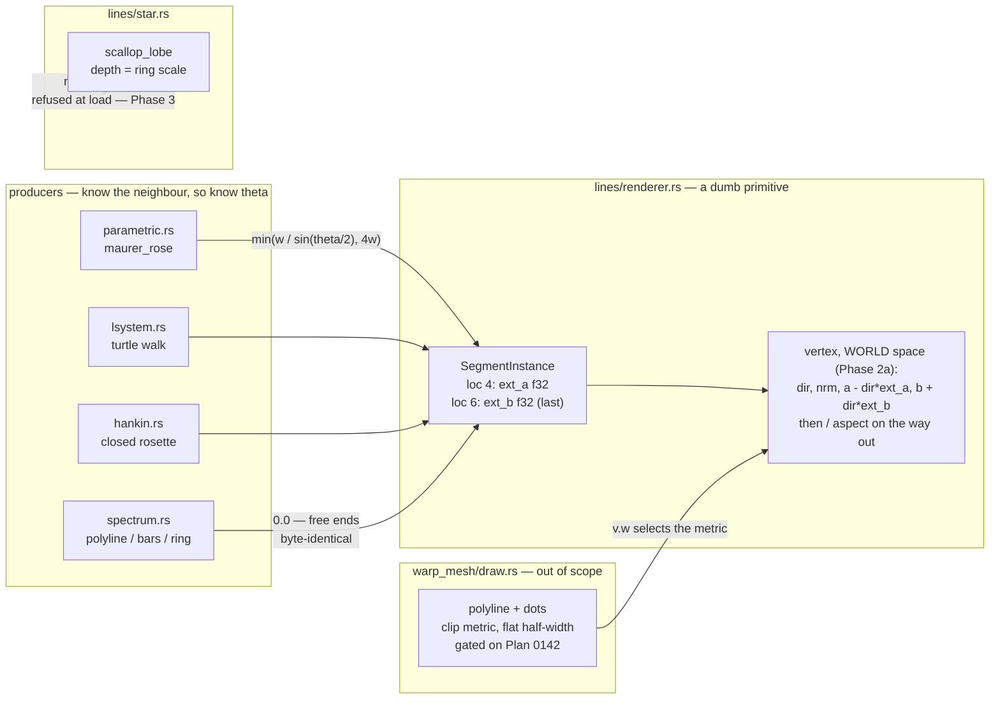

# 0149 — The line corners stop being blunt

> **Status:** in-progress
> **Created:** 2026-09-01
> **Owner skill(s):** dev
> **Related ADRs:** [0158](../adrs/0158-a-joined-end-carries-its-own-miter-length.md) (proposed — a
> joined end carries its own miter length), [0160](../adrs/0160-the-stroke-is-measured-where-the-screen-is-isotropic.md)
> (proposed — the stroke is measured where the screen is isotropic; added 2026-09-01 after Phase 2's
> stop gate failed),
> [0161](../adrs/0161-the-blot-anchor-becomes-a-defect-record-because-term-two-reads-the-fringe.md)
> (proposed — the blot anchor becomes a defect record; added 2026-09-02, the decision that unblocked
> Phase 2), [0041](../adrs/0041-line-joins-are-per-endpoint-on-the-segment-instance.md)
> (whose geometry half 0158 supersedes and whose metric half 0160 does),
> [0007](../adrs/0007-line-geometry-generators.md) (the fixed-capacity instance buffer),
> [0124](../adrs/0124-the-line-stroke-carries-a-solid-core-and-a-pixel-wide-edge.md) (whose pixel
> calibration assumed the property 0160 delivers),
> [0037](../adrs/0037-internal-grid-is-a-resolution-not-a-shape.md),
> [0071](../adrs/0071-a-numeric-test-contract-states-a-property-or-names-its-machine.md)
> **Closes:** design-backlog 0134, 0135, 0136, 0144.

## TL;DR

A joined corner in this engine is extended by a flat half-width, which is the correct extension for
exactly one interior angle — 180 degrees. Every sharper corner truncates to a bevel: a `diamond`'s
61.9-degree vertex needs 26.3 px of a 13.5 px half-width and gets 13.5, so the point reads as a flat
cut and the inner side sums to 1.38x the stroke. It arrived as a user complaint on the running app,
and it is now *concentrated* rather than diffuse, because Plan 0087 converted the curved motifs to
arcs and left the straight figures behind. This plan makes the producer compute the miter it already
has the angle for, and takes the three other entries that live in the same two files while they are
open. The first visible behavior is the plumbing landing **golden-identical** — the instance carries
a length instead of a flag, and nothing moves until Phase 2 puts the real number in it.

**Amended 2026-09-01, after four phases landed.** Phase 2's stop gate ran and failed: the stroke is
offset in clip space, not in the isotropic space, so a vertical stroke is `aspect` times thicker on
screen than a horizontal one — measured `1.7843` at 1920x1080 — and the producer's world-space angle
is not the angle the shader extends along. That is a defect older than this plan, it blocks the
miter, and the whole square golden corpus is blind to it. **Phase 2a moves the stroke into world
space** per [ADR-0160](../adrs/0160-the-stroke-is-measured-where-the-screen-is-isotropic.md), which
makes [ADR-0158]'s Decision correct as written and costs the instance nothing. Phase 2 then lands on
a corrected tree, unamended.

## Context & problem

[ADR-0041](../adrs/0041-line-joins-are-per-endpoint-on-the-segment-instance.md) gave
`SegmentInstance` a per-endpoint `joined` bitfield and had the vertex shader do

```wgsl
let ext_a = select(0.0, width, (joined & JOINED_A) != 0u);
```

A corner of interior angle `theta` needs `width / sin(theta / 2)`. The shipped constant is that
expression's `theta -> 180` limit, so the shortfall grows without bound as the corner sharpens.
Measured 2026-08-27, a single `diamond` filling a 1000x1000 frame at `thickness = 9`: **26 px of
flat 185 and then zero, with no taper at all**, and the corner patch reads **1.38x the stroke's own
value**. Both halves are the same missing factor, `1 / sin(30.95 deg) = 1.945`.

**ADR-0041 saw this and accepted it, on a premise Plan 0114 removed.** Its rejection of a true miter
reads *"a mitred corner and a rounded one differ by less than the blur that is already there"*, and
its disc-join alternative closes with *"worth revisiting only if the blunt corners above turn out to
matter"*. [Plan 0114](done/0114-the-line-stroke-reads-as-a-drawn-line.md) took `DEFAULT_SOFTNESS` to
`0.25`; there is no blur left. And they turned out to matter — at
[Plan 0087](done/0087-the-line-renderer-draws-a-curve.md) Phase 7, in the running app: *"how straight
lines are connected, its clearly visible and doesn't look solid"*.

**And the miter cannot be computed until the stroke is measured in the right space** (added
2026-09-01). The vertex shader converts both endpoints into clip space and computes `dir`, `nrm` and
the half-width offset **there** — but clip space is the anisotropic one here, since a clip
displacement `(dx, dy)` lands on `(dx·W/2, dy·H/2)` pixels and `W/H` is the aspect. **World space is
the isotropic space**: dividing x by the aspect is exactly what makes it square on screen, and the
stroke is applied after that divide. So on-screen half-thickness is

```
width · (H/2) · sqrt(sin²phi · aspect² + cos²phi / aspect²) / sqrt(cos²phi / aspect² + sin²phi)
```

for a segment at world angle `phi` — `width·H/2` horizontal, `width·H/2·aspect` vertical. Measured on
the Phase 1 tree, the vertical/horizontal ratio is `1.0000` at 1000x1000, `1.5789` at 1280x800,
`1.7843` at 1920x1080 and `0.6333` at 800x1280. The vertex comment three lines above the offending
line claims the opposite (*"a uniform on-screen thickness whatever the segment's orientation"*), so
does `SegmentInstance::width`'s doc, and `ARC_SHADER` replicates the clip metric on purpose so the
two primitives agree. **Nothing chose this**: ADR-0124's `1.35 px at 1080p` is `0.0025 · 1080 / 2`,
the horizontal case quoted as the general one. It survived because every line golden renders square
— 128x128, 512x512, 96x96 — where the two spaces are identical in `f32`. That is
[ADR-0037](../adrs/0037-internal-grid-is-a-resolution-not-a-shape.md)'s failure one level down, on a
space rather than a size, and this family has now shipped it four times.

Three smaller entries sit in the same two files, and each is cheaper to take now than to schedule
later.

**`parametric_curve` commits ~6.5 MB at Rich for buffers nothing fills.** Plan 0087 Phase 5 gave
`ParametricCurveScene` five `Vec::with_capacity(max_segments)` buffers — `arcs` and `single_arcs`
(36 B each), `points` (8 B), `pieces` (~24 B), `walk` (4 B). At Rich's `max_segments = 60_000` that
is 108 B x 60,000 = **6,480,000 B of Rust heap**, on top of the ~4.8 MB `segments` and `single_buf`
already cost — it more than doubles the scene's allocation. **Four of the five stay permanently
empty for every preset in the library**, because every shipped `d` is a chord web and
`maurer_rose_pieces` declines the fit before it ever fills them. The same plan already found the
answer one file over: `star.rs` sizes its arc buffers at load from the roster the preset actually
declared and reserves nothing when there are none. A second, smaller defect rides along — `points`
is **one short**: its capacity is `max_segments` and `maurer_rose_pieces` pushes `drawn + 1`, so a
preset binding `samples` at the cap reallocates once inside a path whose own doc says *"Allocation-
free into preallocated buffers, because this runs every frame"*.

**A negative ring `scale` inverts a `scallop` lobe.** `star.rs`'s `scallop_lobe` takes the ring
`scale` as the lobe's **depth**. Past `depth ~ -R * (cos(s) + sin(s) - 1)` the arc's two ends move to
the far side of its centre and the counter-clockwise sweep runs the long way round: the lobe bulges
*outward* to roughly twice the ring radius instead of dimpling inward. No panic, no cap violation,
nothing warns. Its own comment names the wrong lever — it says the guard covers only the exactly-flat
case *"(`ring_scale` clamps at zero)"*, but `ring_scale` is the **bindable multiplier**, which is
clamped, while the **structural per-ring `scale`** is validated for finiteness alone in `schema.rs`,
and the two sibling arc branches carry explicit `.abs()` handling precisely because a negative one is
reachable. A second over-claim sits four lines below: *"the sweep between them is under half a turn
for any depth"* is false past the same threshold. **No shipped preset can reach it** —
`star_mandala_bordered` binds a `ring_scale` positive everywhere and its ring `scale` is `0.055`.

**And a contract in `marks.rs` is stated unconditionally that holds only for equal spikes.** Plan
0098 Phase 1 restored the `star` arm's interior contract, but under `star_jitter` the divisor is the
**unjittered** figure's while the measured distance is the fragment's own spike's, so the coordinate
at the centre is `0.076`-`0.085` rather than `0`, with a `max(0.0, ·)` guard in the shader for when
the asymmetry runs the other way. That is a large improvement on the `-0.23`..`-0.94` it replaced and
it is **not what the module header says**. Three one-line repairs travel with it, collected at Plan
0098's review so none of them lives only in a transcript.

## Decision

**The producer computes the miter length and the instance carries it as an `f32`**, per
[ADR-0158](../adrs/0158-a-joined-end-carries-its-own-miter-length.md) — a segment cannot see its
neighbour's direction, which is exactly why ADR-0041 put connectivity on the producer side, and the
angle is one step further along the same argument. `SegmentInstance.joined: u32` becomes `ext_a: f32`
in place at location 4, `ext_b: f32` is appended **last** at location 6, and `0.0` is exactly "free
end" so a producer that passes nothing stays byte-identical.

**The stroke moves into world space first** (added 2026-09-01), per
[ADR-0160](../adrs/0160-the-stroke-is-measured-where-the-screen-is-isotropic.md). `dir`, `nrm`, the
endpoint extensions and the perpendicular offset all move ahead of the aspect divide; only `out.pos`
carries the `/ aspect`. `width` and `ext_*` become world half-widths — a change of unit, not of
layout, so the instance stays 44 bytes. The producer's world-space `theta` is then the angle the
shader extends along and [ADR-0158] needs no amendment. `warp_mesh` keeps the clip metric, selected
per draw call through the segment uniform's documented-unused `v.w` lane, because
[Plan 0142](0142-the-milkdrop-import-earns-its-verdict.md) is about to take `foo_vis_milk2` readings
on it and its stroke weight must not move between the question and the answer.

We rejected **handing the miter the aspect instead** (a bisector or neighbour direction on the
instance, +16 B, or the aspect at `configure`, which breaks the cached producers) and **declaring
the anisotropy intended and correcting the three comments** — the cheapest option, and lost because
no ADR ever argued for it and two of the three comments assert its opposite. Both are recorded in
ADR-0160.

**The plumbing and the geometry land as separate commits.** Phase 1 changes what the instance carries
while every producer still passes `width` for a joined end, so it is provably golden-neutral — if a
baseline moves in Phase 1, the vertex-attribute wiring is wrong and nothing else is being debugged at
the same time. Phase 2 puts the real miter in and the line goldens re-bless. That split exists
because this exact struct carries a comment recording that a field added anywhere but the end
*"compiles, renders, and quietly reinterprets every stroke's join bits as alpha's mantissa — which is
what it did, moving five composite golden baselines"*.

For backlog 0136 we take the **load-time refusal** over drawing an inward lobe correctly. **This is a
stated guess, not a settled question:** the entry frames it as *"a decision about whether an inward
scallop is a look anyone wants"*, no shipped preset is in range, and the refusal is the honest and
cheaper of the two. If an inward scallop is wanted, that is a `preset-author` ask that comes back as
its own entry — and the refusal is what makes it come back, rather than shipping a silent bulge.

We rejected **drawing a round join in the fragment** and **ADR-0041's disc-per-vertex** for the
reasons ADR-0158 records. We rejected **doing 0135's re-sizing before 0134**, because the miter does
not change the buffer count and doing the cheap allocation work first would put the golden-moving
phase last, where a failed bless strands it.

## Architecture diagram



## Implementation phases

### Phase 1 — The instance carries a length, and nothing moves
- **Owner skill:** dev
- **What:** replace the join bitfield with two per-endpoint extension lengths, with every producer
  passing `width` where it previously set a flag. Pure plumbing, and the phase's whole value is that
  it isolates the vertex-attribute wiring from the geometry change.
- **Files touched:** `core/src/render/scenes/lines/renderer.rs` (the struct, the attribute array, the
  WGSL), `parametric.rs`, `lsystem.rs`, `hankin.rs`, `spectrum.rs`.
- **Done when:**
  - `SegmentInstance` is **44 bytes**: `ext_a: f32` replaces `joined: u32` **in place at shader
    location 4** (the offset is unchanged), `ext_b: f32` is appended **last** at location 6, and
    `alpha` keeps location 5 and its byte offset. A test asserts `size_of::<SegmentInstance>()` and
    the offset of `alpha`, so a field inserted in the wrong place fails rather than renders.
  - **Every golden in the suite is unmoved, unblessed.** This is the acceptance oracle for the phase
    and there is no exception: passing `width` at a joined end reproduces ADR-0041's geometry
    exactly. A moved baseline here means the wiring is wrong.
  - The generated `const JOINED_A` / `JOINED_B` WGSL and the swap-detection assertion that guarded
    them are **deleted**, not left orphaned — a float extension has no bits to renumber. The
    first/last-point assertion (that the stroke does not reach past the figure's own endpoints)
    survives, now pinned by `ext == 0.0` rather than by a single bit.

### Phase 2a — The stroke is measured where the screen is isotropic

> **Added 2026-09-01**, after Phase 2's stop gate ran and failed. This phase is what unblocks
> Phase 2, and it is a defect older than this plan.
> [ADR-0160](../adrs/0160-the-stroke-is-measured-where-the-screen-is-isotropic.md) carries the
> decision and its rejected alternatives.

- **Owner skill:** dev
- **What:** move the stroke — `dir`, `nrm`, the endpoint extensions and the perpendicular offset —
  ahead of the aspect divide, so only `out.pos` carries the `/ aspect`. `width` and `ext_*` become
  world half-widths: a change of unit, not of layout. `warp_mesh` keeps the clip metric, selected
  per draw call.
- **Files touched:** `core/src/render/scenes/lines/renderer.rs` (both WGSL modules, the three
  segment draw entry points, the two false doc blocks), `core/src/render/scenes/warp_mesh/draw.rs`
  (pass the clip metric, with the dated deferral comment), the line goldens' non-square baselines,
  and a new non-square test.

#### Done when

- **The offset is applied before the divide.** `dir`, `nrm`, `a_j`, `b_j` and `nrm * c.y * width`
  are all computed on `a_v`/`b_v`; `out.pos` is the only place `inv_aspect` appears. `ARC_SHADER`'s
  `grad` conversion is **deleted**, not left dormant — its signed distance becomes `len - radius`
  directly, and the off-span endpoint distance loses its own aspect divide. The paragraph in
  `ARC_SHADER`'s doc block explaining why the arc reproduces the segment's clip metric goes with it.
- **The two false doc blocks are corrected**: `renderer.rs`'s vertex comment (*"so the perpendicular
  offset is a uniform on-screen thickness whatever the segment's orientation"*) and
  `SegmentInstance::width`'s *"(uniform on screen after the aspect divide)"*. Both now describe a
  property the code holds. `ext_a`'s doc says **world half-width units** in one voice — today it
  says both *"the same NDC-y units as `width`"* and *"A world-space length"*, which cannot both be
  true.
- **A non-square test pins the property, because no existing capture can.** Render one figure at a
  target with `aspect != 1` and assert the ratio of a near-vertical stroke's on-screen thickness to
  a near-horizontal one's is **1.0**. Per ADR-0074 this is a legitimate ratio: both terms are stroke
  thicknesses in pixels, measured the same way, in one frame on one adapter — and the asserted value
  is dimensionless and target-independent, which is what makes it a property rather than a
  measurement. **The tolerance is derived from pixel quantization on the extents actually counted
  and the derivation is stated**; it is not a frozen number, and it is not `golden.rs`'s `0.02`,
  which bounds a different quantity. The test's own doc block says why a square target cannot pin
  this. Sanity check available for free: the same assertion on the pre-phase tree yields the
  aspect, so run it once before the fix and record what it read.
- **Every square baseline is unmoved and unblessed.** At aspect 1.0 `inv_aspect` is exactly `1.0`
  and multiplying by it is exact in `f32`, so the transformation is the identity there. That covers
  `golden.rs` (128x128), `line_joints.rs` (512x512), `spectrum.rs` (96x96) and `warp_mesh.rs`
  (96x96) — **including `spectrum`'s `Bars` and `RadialRing`**, whose stillness ADR-0158 promised.
  A moved square baseline means the arithmetic was rearranged rather than reordered, and it is the
  phase failing, not something to bless.
- **`composite` at 160x100 is the one place the corpus can see this, and its split is the oracle.**
  Eight of the ten composite fixtures are `parametric_curve` and **must** move;
  `composite_symmetry` and `composite_kaleido_squash` are `fragment_field` and **must not**. Both
  halves are checked: an unmoved `parametric_curve` composite baseline means the change did not
  reach the draw, and a moved `fragment_field` one means it reached something it should not have.
  Re-bless the eight, restore the other two before committing — `LMV_BLESS` rewrites all of them.
- **`warp_mesh` renders exactly what it renders today.** Its four baselines are unmoved and
  unblessed, and `milkconv/tests/draw_layer.rs` still passes unchanged. Its two call sites pass the
  clip metric with a comment naming
  [Plan 0142](0142-the-milkdrop-import-earns-its-verdict.md) as the revisit trigger and ADR-0160 as
  the reason — and stating the open possibility that the clip metric is *correct* there rather than
  merely deferred, which nobody has measured.
- **`WIDTH_SCALE` does not move in this phase.** Every stroke gets thinner — the factor is `1.00`
  horizontal, `1.45` at 30 degrees, `1.63` at 45, `1.78` vertical, mean **1.52** over a uniform
  distribution of orientations at 16:9 — and whether the constant compensates is a look question
  judged in Phase 6, on a tree whose corners are already mitred. Judging stroke weight against blunt
  corners would be judging the wrong picture.

### Phase 2 — The corner reaches its point

> **Amended 2026-09-01, after Phase 1 landed.** Phase 1's implementation established three things
> this block was written without: the real producer roster, that `warp_mesh` is a producer using the
> extension as a **cap**, and that the cached scenes restyle per frame. A fourth was a **stop gate**,
> which ran and failed. [ADR-0158] carries the scope decision.
>
> **Amended again 2026-09-01, after the gate's verdict.** The gate is discharged and replaced by its
> outcome below; **Phase 2a is now a prerequisite** and the arithmetic in this phase is correct as
> written once it lands. Two done-whens were also wrong on their own terms and are corrected — the
> composite oracle and the `spectrum` one — for reasons that have nothing to do with the gate.
>
> **Amended a third time 2026-09-02, on the `core/tests/sanity.rs` decision.** The phase is
> **unblocked and lands as written** — no arithmetic in it changes and `MITER_LIMIT` is untouched.
> What is added is the sixth done-when below, which disposes of the `Blown Out` anchor.
> [ADR-0161](../adrs/0161-the-blot-anchor-becomes-a-defect-record-because-term-two-reads-the-fringe.md)
> carries the decision, the measurement and the four rejected alternatives.

- **Owner skill:** dev
- **What:** each producer **in the four line families** computes
  `min(width / sin(theta / 2), MITER_LIMIT * width)` for a joined end. Closes backlog 0134.
- **Files touched:** `core/src/render/scenes/lines/` — `renderer.rs` (the `MITER_LIMIT` constant and
  its doc), `curves.rs`, `parametric.rs`, `turtle.rs`, `hankin.rs`, `spectrum.rs`, `star.rs` — their
  test modules, and the line goldens.

  **Not `lsystem.rs`**, which sets no extension: the L-system's producer is `turtle.rs`. **Not
  `warp_mesh/draw.rs`**, per the scope rule below.

#### The scope rule: `warp_mesh` keeps the flat half-width

`warp_mesh/draw.rs` is a seventh `SegmentInstance` producer and it is **out of scope**, at both call
sites — `polyline` and `dots`. [ADR-0158]'s Scope paragraph carries the three reasons; the one that
decides it is that `warp_mesh` pins `MILKDROP_SOFTNESS = 1.0` rather than `DEFAULT_SOFTNESS = 0.25`,
so the "there is no blur left" premise that supersedes ADR-0041 is absent on that surface and
ADR-0041 still holds there on its own terms.

`draw::dots` additionally has **no interior angle at all**: it emits a zero-length segment whose two
extensions are a **cap**, the thing that makes a bead a bead rather than a sub-pixel dash. A miter
expression evaluated there has no `theta` to take a sine of.

**Done when:** `core/src/render/scenes/warp_mesh/**` is untouched by this phase's diff, and the four
`warp_mesh_*` baselines plus `milkconv/tests/draw_layer.rs` are **unmoved and unblessed**. That is
the phase's second oracle and it is as load-bearing as the first.

**Corrected 2026-09-01: the oracle is not "composite".** Eight of the ten composite fixtures are
`parametric_curve`, which is *in* this phase's scope and whose Maurer walk is a polyline with an
interior joint at every sample — so those baselines move under this phase, for the right reason. The
oracle had to be narrowed to the baselines `warp_mesh` actually owns. `composite_symmetry` and
`composite_kaleido_squash` are `fragment_field` and stay still under both phases.

#### The cached producers need no special case, and here is why

`turtle`, `hankin` and `star` build their figures at `configure` against `PLACEHOLDER_WIDTH` and are
restyled every frame by `LineInstance::styled`, which carries the extensions across by the width
ratio. A miter computed at build time survives that unchanged, and the reason is worth stating
because it is not obvious:

- **The whole expression is homogeneous of degree 1 in `width`.** Both `width / sin(theta / 2)` and
  the clamp `MITER_LIMIT * width` scale linearly, so `ext(c * w) == c * ext(w)` — the clamp commutes
  with the rescale and cannot be engaged on one side and not the other. Computing the miter in
  placeholder units and multiplying by `frame_width / PLACEHOLDER_WIDTH` is exactly computing it at
  `frame_width`.
- **`theta` is invariant under every transform between the producer and the shader** — uniform
  scale, rotation, reflection and the mirror replication are all similarities, and a similarity
  preserves angles. `normalize_fit` is a uniform scale too.

So the cached producers compute `theta` from their build-time geometry like everyone else. **The one
thing that must not happen is a producer writing a miter into `ext_*` while leaving `width` at some
other value** — the ratio rescale is only correct while the two are in the same units.

#### The stop gate ran, it failed, and Phase 2a is the answer

**Discharged 2026-09-01.** The gate asked whether the space the extension is applied in is the space
the producer measures its angle in. It is not. Measured on the Phase 1 tree with a flat `width` and
no miter, at `half_width = 0.10` and a lit threshold of `0.05` on the hardware adapter, the ratio of
a vertical stroke's on-screen thickness to a horizontal one's:

| target | aspect | vertical / horizontal |
|---|---|---|
| 1000x1000 | 1.0000 | **1.0000** |
| 1280x800 | 1.6000 | **1.5789** |
| 1920x1080 | 1.7778 | **1.7843** |
| 800x1280 | 0.6250 | **0.6333** |

**The ratio tracks the aspect**, and the residuals are pixel quantization on counts of 76-182. So
the gate's second branch was taken and the phase stopped, correctly. The gate itself is discharged
and is recorded here rather than deleted, because it is the only place the measurement that decided
Phase 2a lives.

**The repair is Phase 2a, not an amendment here.** Every option that keeps the clip-space metric —
the neighbour direction, the bisector, the aspect handed to the cached producers — changes what
`SegmentInstance` carries and pays for a correction rather than removing the disagreement.
[ADR-0160](../adrs/0160-the-stroke-is-measured-where-the-screen-is-isotropic.md) moves the stroke
into world space instead, at which point `dir` is a world direction, the producer's world-space
`theta` is the angle the shader extends along, and **the arithmetic in this phase is correct exactly
as it was written**. [ADR-0158]'s Decision stands unchanged and the instance grows by nothing.

**Phase 2a is a prerequisite for this phase.** Written in this order because the miter is what the
plan exists for; implemented in the other, because a miter computed against a mismeasured space is
wrong by a factor that varies with every corner's orientation.

#### Done when

- `MITER_LIMIT = 4.0` is a named constant whose doc states **what it is derived from** — it serves
  every corner down to `2 * asin(1/4) = 28.96 degrees` exactly, it is SVG's `stroke-miterlimit`
  default, and it was adopted rather than measured. Per ADR-0071 that is a stated property, not a
  frozen measurement.
- **The measured defect is gone on its own fixture.** A `diamond` at `thickness = 9` in a 1000x1000
  frame no longer reads 26 px of flat and then zero through the 61.9-degree vertex; the profile
  tapers. The diamond's factor is **1.945**, well inside the limit, so this corner is served
  *exactly* and the limit is not engaged — assert the computed extension against `width * 1.945`
  within a tolerance derived from `f32` angle precision, on the CPU, where `theta` is available
  directly rather than through a rendered frame.
- **Each of the five in-scope producers has its own test** that a joined end's extension corresponds
  to the angle it actually forms, and that a free end is `0.0`. ADR-0158's stated negative is that a
  producer computing the angle wrongly now renders a *wrong-length* stroke rather than merely
  keeping the notch — a test per producer is the answer to that, not a comment. `curves.rs` and
  `parametric.rs` are two producers and get two tests; `turtle.rs`, `hankin.rs` and `star.rs` are
  the cached three.
- `spectrum`'s `Bars` and `RadialRing` baselines are **still unmoved**, which is ADR-0041's original
  property and the one thing Phase 2 must not cost. **Measured against the post-Phase-2a tree**, not
  against `main`: those are isolated producers passing `0.0`, so this phase moves nothing in them,
  but the metric change is arithmetically upstream of the comparison.
- **`warp_mesh` is untouched, and the four `warp_mesh_*` baselines plus `milkconv`'s draw-layer
  tests are unmoved** — the scope rule's own oracle, above. Not "composite": eight of those ten
  fixtures are `parametric_curve` and move under this phase for the right reason.
- **`parametric.rs`'s `configure` is documented as itself again.** Phase 4 left
  `reserve_fit_buffers`'s entire doc block duplicated onto `configure`, which reserves nothing and
  now advertises in rustdoc that it *"give[s] the four fit buffers their steady-state capacity"*.
  A rider, taken because this phase opens the file; it is the same class Phase 5 exists for.
- **`core/tests/sanity.rs`'s `Blown Out` anchor becomes a defect record, and no threshold moves.**
  The miter closes the blot's stepped rim, which is what a miter is for; because a blot is its own
  modal band, `boundary_density`'s lit set is the mass's **fringe**, and a thinner fringe is
  proportionally more rim, so the reading rises from `0.2700` to `0.5697` and ADR-0128's conjunction
  acquits a frame that is still visibly a blot. ADR-0161 carries the mechanism and the arithmetic.
  Six parts, all in `sanity.rs` and its doc blocks — **`metrics.rs` is untouched and nothing
  renders differently**:
  - `MAX_TONAL_FLATNESS`, **both** `boundary_floor` arms and `blown_out`'s parameters are
    **unchanged**. A diff touching any of those four is this done-when failing.
  - In both `a_frame_with_no_tonal_structure_is_reported_flat` and
    `each_term_of_the_flatness_conjunction_is_load_bearing`, the assertion that the blot reads
    **under** its boundary floor becomes an assertion that it reads **over** it, in the shape
    `KNOWN_FLAT` already uses in this file: the message cites ADR-0161 and says that a failure here
    means term two was repaired, so the conviction is to be restored and the record deleted — never
    left as a stale exemption.
  - **Each of the two tests gains `boundary_density(&img, BLACK, EPS)` as a positive control**,
    asserted **under** the same floor. It reads `0.0382` — the `2/r` that `boundary_density`'s own
    doc predicts for a solid disc — so the statistic convicts this blot when it is pointed at the
    figure. This is what separates "the statistic is broken" from "its conditioning is", and it is
    the new true positive the inverted assertion costs.
  - Everything else in both tests **keeps asserting**: the areal lens's coverage / quadrants /
    shells / flatness, term one against the derived ground (`0.9628` against `0.90`), the
    self-modal check, and parts (1) and (2) of the conjunction test — the held composition and
    `Sumi` are both undisturbed.
  - **`each_term_..._load_bearing`'s doc block is rewritten, not just its assertion.** Its stated
    premise is that the conjunction is non-vacuous; that is now false, and the block says so and
    says what replaced it.
  - **`boundary_floor`'s doc block stops claiming `0.2631` as a derivation.** The default arm's
    value does not move, but the prose names what that number actually measured — the thickness of
    one figure's rasterized notch band, not a figure perimeter — and therefore that it is not the
    same kind of quantity as the `0.3602` it was averaged with. Same class as Phase 5's work.
- The line goldens are re-blessed. **`LMV_BLESS` rewrites every baseline, not the failing scene's**
  — restore the unrelated ones before committing, and compare adapters before trusting a bless.
  **Two phases in a row re-bless the same non-square set**, so bless from a known-good Phase 2a
  tree rather than carrying one bless across both.
- **Phase 6's comparison sheet exists**, rendered as this phase's last step on the finished tree:
  the line roster at **1920x1080 and 1280x800**, before Phase 2a and after Phase 2. Both non-square,
  because a square render shows nothing. It lands under `target/` uncommitted, like the other
  judging sheets `scripts/` renders, and the log records where. **The "before" arm is a rebuild from
  the pre-2a commit, not a stashed render** — restoring a file with `Copy-Item` leaves cargo stale
  and re-renders the code you reverted.

### Phase 3 — A `scallop` refuses a depth it cannot draw
- **Owner skill:** dev
- **What:** close backlog 0136. A negative structural ring `scale` on a `scallop` is refused at load
  with a message naming the ring, rather than silently bulging outward.
- **Files touched:** `core/src/preset/schema.rs`, `core/src/render/scenes/lines/star.rs`.
- **Done when:** a preset declaring a `scallop` ring with negative `scale` fails to load with a
  message naming the ring and the constraint; **both over-claiming comments are corrected** — the one
  citing `ring_scale` (the bindable multiplier, which is clamped) where the structural `scale` is
  meant, and the *"the sweep between them is under half a turn for any depth"* line four below it,
  which is false past the same threshold. Every shipped preset still loads: `star_mandala_bordered`'s
  ring `scale` is `0.055` and its bound `ring_scale` is positive everywhere.

### Phase 4 — `parametric_curve` reserves what a preset declared
- **Owner skill:** dev
- **What:** close backlog 0135. Size the five arc/piece buffers at load from what the preset actually
  declares, the way `star.rs` already does, and fix the `points` off-by-one.
- **Files touched:** `core/src/render/scenes/lines/parametric.rs`, `docs/nfr.md` (§12).
- **Done when:**
  - A shipped preset — every one of which is a chord web that `maurer_rose_pieces` declines — reserves
    **nothing** for the four buffers it never fills, against today's 108 B x `max_segments` for all
    five. At Rich's 60,000 that is 6,480,000 B not committed.
  - `points` is capacious enough for `drawn + 1` at `samples == max_segments`, so the path that
    documents itself as *"allocation-free into preallocated buffers"* is not falsified by its own
    cap.
  - **No golden moves and no preset changes what it draws** — this is an allocation change only.
  - **`docs/nfr.md` §12 is re-read against the real numbers and corrected if it is the thing that is
    wrong.** It claims *"our own Rust state stays <~1 MB"*, and the pre-Plan-0087 4.8 MB already
    exceeded that. Either the line gets a figure it can defend or it says what it actually bounds;
    it does not stay as it is.

### Phase 5 — Four contracts that say more than they hold
- **Owner skill:** dev
- **What:** close backlog 0144's four collected repairs, plus the doc-block nit backlog 0134 carries.
  Prose and one-line fixes; nothing renders differently.
- **Files touched:** `core/src/render/scenes/marks.rs`, `core/src/render/scenes/marks/tests.rs`,
  `core/src/preset/schema.rs`, `core/src/render/scenes/lines/renderer/tests.rs`.
- **Done when:**
  - **The exactness claim is qualified.** `marks.rs`'s header and `mark_distance`'s doc block say the
    interior contract is exact for **equal spikes**, and state what `star_jitter` actually yields
    (`0.076`-`0.085` at the centre) and why the `max(0.0, ·)` guard is there. **The prose is
    corrected, not the divisor** — making the jittered arm's divisor the fragment's own spike's would
    make it depend on which spike a fragment folded onto, which is the very thing Plan 0098 Phase 1
    walked the unjittered edge to avoid, and backlog 0144 says so.
  - `schema.rs` reads `shape_field`'s `COORD_MODES` instead of hardcoding `m.clamp(0.0, 1.0)`.
  - The CPU mirror of `mark_boundary_radius` either **is** literally identical to the WGSL or its
    comment stops promising identity and names the one divergence (`abs(p.x) + 1e-20` against
    `max(len, 1e-20)`, which differ only at `p == (0,0)` where the coordinate is `0` either way).
  - `the_radius_mode_bands_scaled_copies_where_the_distance_bands_offsets`'s failure message names
    the figure it actually renders — a triangle, not a pentagon.
  - In `lines/renderer/tests.rs`, the doc block deriving the arc comparison's tolerances gets a blank
    line before `SOFT_PROFILE`'s, so `ARC_MEAN_TOL` and `ARC_OUTLIER_TOL` are documented by their own
    derivation rather than attaching to the wrong constant. The values are right — `0.02` and `48`
    match `golden.rs` exactly — and this is the ADR-0071 failure one level down.

### Phase 6 — Judge what the corrected stroke weighs

> **Added 2026-09-01** with Phase 2a. Deliberately last: stroke weight is judged on a finished
> picture, and until Phase 2 lands the corners are still blunt.

- **Owner skill:** human
- **What:** decide whether `WIDTH_SCALE` compensates for the weight Phase 2a removed, from rendered
  comparisons rather than from the arithmetic.
- **Why it is a human phase.** Phase 2a makes every stroke converge on today's *horizontal*
  thickness, which is the thinnest one: the factor lost is `1.00` horizontal, `1.45` at 30 degrees,
  `1.63` at 45, `1.78` vertical, **mean 1.52** over a uniform distribution of orientations at 16:9.
  So the whole line library reads about a third lighter, and no test in this repo can say whether
  that is better. This project picks look questions from side-by-side artifacts.
- **Done when:** the user has seen the line roster rendered before and after Phase 2a at **1920x1080
  and 1280x800** — both non-square, because a square render shows nothing — and has answered one
  question: does `WIDTH_SCALE` move, and to what. **The answer may be "it does not move"**, and that
  is a decision, recorded in the implementation log, not a skipped phase.

  The sheet is `dev`'s to produce, and it is Phase 2's last done-when — so this phase consumes an
  artifact that already exists rather than commissioning one.

### Phase 7 — Apply the calibration verdict
- **Owner skill:** dev
- **What:** carry out Phase 6's answer.
- **Done when:** if `WIDTH_SCALE` moves, the one constant in `core/src/render/scenes/lines/mod.rs`
  moves and its doc names Phase 6 as where the number came from; the non-square line baselines
  re-bless a third time; and **`MIN_HALF_WIDTH` and the `0.167` floor are re-derived against the new
  scale**, because [ADR-0124](../adrs/0124-the-line-stroke-carries-a-solid-core-and-a-pixel-wide-edge.md)
  computed them from it and the dead zone the closed backlog 0098 warns about moves with it.
  If the verdict is "no change", this phase lands no commit and the log records that as its outcome.

## Data shapes

```rust
// illustrative — not the final interface
#[repr(C)]
pub struct SegmentInstance {
    pub a: [f32; 2],       // loc 0, offset 0
    pub b: [f32; 2],       // loc 1, offset 8
    pub color: [f32; 3],   // loc 2, offset 16
    pub width: f32,        // loc 3, offset 28
    /// Miter extension at `a`, in world units. `0.0` == free end, which is
    /// byte-identical to a producer that flagged nothing under ADR-0041.
    /// Replaces `joined: u32` IN PLACE — same location, same offset.
    pub ext_a: f32,        // loc 4, offset 32
    pub alpha: f32,        // loc 5, offset 36 — unchanged, see its own doc
    /// Miter extension at `b`. **Declared last**, for the reason `alpha`'s
    /// doc block records: `vertex_attr_array!` derives offsets from location
    /// order, so a field inserted earlier silently re-points every attribute
    /// after it.
    pub ext_b: f32,        // loc 6, offset 40 — total 44
}
```

## Risks & open questions

- **RESOLVED 2026-09-01: `theta` was not measured in the space the extension is applied in.** The
  stop gate ran and failed — the vertical/horizontal stroke ratio tracks the aspect, `1.7843` at
  1920x1080. Phase 2a moves the stroke into world space
  ([ADR-0160](../adrs/0160-the-stroke-is-measured-where-the-screen-is-isotropic.md)), which makes
  the producer's world-space angle correct and leaves [ADR-0158]'s Decision untouched. Found while
  amending the plan after Phase 1, not by the plan as first written.
- **Phase 2a's own correctness is invisible to the golden corpus, and that is the risk.** Every line
  fixture renders square — 128x128, 512x512, 96x96 — where the change is exactly the identity in
  `f32`. A fully green suite is **no evidence** the phase landed right. The only baselines that can
  see it are the eight `parametric_curve` composites at 160x100, and the phase's real oracle is the
  new non-square test it brings with it. This is the same shape as the defect it repairs.
- **The library gets about a third lighter, and no gate will notice.** Phase 2a removes a mean
  `1.52x` of stroke weight at 16:9. Nothing in this repo measures apparent stroke weight, so if the
  compensation question is skipped it is skipped silently. Phase 6 exists to stop that, and it is a
  `human` phase precisely because no instrument here can answer it.
- **The engine carries two stroke metrics between Phase 2a and Plan 0142's close.** `warp_mesh`
  keeps the clip metric on purpose. A producer added in that window inherits whichever metric its
  call site passes, and a wrong choice renders a plausible picture at the wrong weight on any
  non-square target — which is to say, invisibly to CI.
- **The golden re-bless is the largest cost here and it is bookkeeping.** `LMV_BLESS` is not scoped
  to the failing scene, so unrelated baselines must be restored before committing, and a bless taken
  on the wrong adapter can freeze garbage — this repo has blessed a WARP bind-layout aliasing bug
  before. Compare adapters before trusting Phase 2's output.
- **Phase 1 could move a golden.** That is the phase failing, not a finding to bless around: passing
  `width` at a joined end is arithmetically identical to today, so a moved pixel means the attribute
  wiring is wrong.
- **A closed chain's ends are genuinely free and stay bevelled.** The rosette is closed and every
  vertex is a joint, but a polyline's first and last points have no neighbour. That is correct, and
  it is what the surviving first/last-point assertion pins.
- **The miter limit at very sharp corners is untested by any shipped figure.** `diamond` at 61.9
  degrees needs 1.945 and never engages the limit. Whether any roster member goes below 28.96 degrees
  is not established; if none does, the clamp arm ships unexercised and wants a synthetic fixture
  rather than a comment.
- **Backlog 0136's refusal is a stated guess.** If an inward scallop is wanted, the refusal is what
  surfaces the ask.
- **The extension is in world units and does not track a per-frame `width` change on its own.** Every
  producer rebuilds its instance buffer per frame so this is inert today; a future producer that
  caches instances while animating `thickness` would desynchronize them. Record it on the field.

## What this plan does NOT do

- **It does not add a round or disc join.** ADR-0158 rejects both, and re-rejects the disc for the
  same instance-count reason ADR-0041 gave.
- **It does not touch the arc primitive.** An arc has no interior joints, which is the whole point of
  it, and `ArcInstance` gains no field.
- **It does not change the `Scene` trait or any preset-facing parameter.** A preset's `thickness`
  means what it meant; corners simply reach their points.
- **It does not make the jittered `star` interior exact.** Backlog 0144 argues the divisor change has
  a stated reason not to be taken, and Phase 5 corrects the prose instead.
- **It does not re-size `segments` or `single_buf`.** Phase 4 takes the five buffers Plan 0087 added;
  the ~4.8 MB that predates it is untouched and stays a separate question.
- **It does not change `warp_mesh`.** That surface is a `SegmentInstance` producer and is
  deliberately out of scope at both its call sites, per [ADR-0158]'s Scope paragraph: it draws
  at `MILKDROP_SOFTNESS = 1.0`, where ADR-0041's premise still holds, and its `dots` use the
  extension as a cap on a zero-length segment rather than as a join.
- **It does not draw an inward scallop.** Phase 3 refuses one.
- **It does not change `warp_mesh`'s stroke metric.** Phase 2a scopes it out and gates the question
  on [Plan 0142](0142-the-milkdrop-import-earns-its-verdict.md), which is about to take
  `foo_vis_milk2` readings on that surface. Whether the clip metric is *correct* there — MilkDrop
  authors in a square space and may be anisotropic on screen itself — is unverified and is that
  plan's to answer, not this one's.
- **It does not re-derive `MIN_HALF_WIDTH` or the `0.167` dead zone unless `WIDTH_SCALE` moves.**
  ADR-0124's pixel figures were always the horizontal case, which Phase 2a makes the universal one,
  so they stay arithmetically valid at an unchanged scale. Phase 7 revisits them only if Phase 6
  moves the constant.

## Implementation log

> Written by `dev` — one row per phase as that phase's commit lands, and the close block after the
> last one. **The phases above are the contract; everything here is what happened.**

**Lane:** `plan-0149-the-line-corners-stop-being-blunt`, worktree `WORK/lmv-plan-0149`.

**This plan is NOT ready to close.** Every `dev` phase has landed. **Phase 6 is a `human` phase**
that has not run, and Phase 7 sits behind it. What follows is a phase record, not a close brief.

| phase | owner | state | commit |
|---|---|---|---|
| 1 — The instance carries a length, and nothing moves | dev | done | 7128ba6 |
| 2a — The stroke is measured where the screen is isotropic | dev | done | c801f43 |
| 2 — The corner reaches its point | dev | done | d0d596e |
| 3 — A `scallop` refuses a depth it cannot draw | dev | done | 324d34c |
| 4 — `parametric_curve` reserves what a preset declared | dev | done | 8ed7f1d |
| 5 — Four contracts that say more than they hold | dev | done | c0fd6bf |
| 6 — Judge what the corrected stroke weighs | human | not started | |
| 7 — Apply the calibration verdict | dev | not started | |

### Notes

**Phase 1 — the file list in the phase block does not match the tree.** The
producers that set the join flag are `curves.rs`, `parametric.rs`, `turtle.rs`,
`hankin.rs`, `spectrum.rs`, `star.rs` and `warp_mesh/draw.rs`. The phase names
`lsystem.rs`, which sets none — its producer is `turtle.rs` — and omits the other
three. `star.rs` appears in the plan only for Phase 3. Two further files carry
assertions on the flag and were not listed: `core/tests/line_joints.rs` and
`milkconv/tests/draw_layer.rs`. Phase 1 was implemented against the corrected
list, on the user's answer at the pre-implementation gate.

**`warp_mesh/draw.rs` is a producer no phase mentions, and it does not use the
flag as a join.** `draw::dots` emits a **zero-length** segment with both ends
flagged, and the extension is what turns the degenerate quad into a round bead
(its own doc block and the module header both say so; `milkconv`'s
`wave_usedots_puts_separated_marks_where_a_line_puts_a_stroke` asserts it).
Phase 1 passes `width` there and the geometry is unchanged. **Phase 2's rule has
no meaning at that site** — a zero-length segment has no interior angle, so
`sin(theta / 2)` is undefined — and applying it would move composite goldens.
Work stopped before Phase 2 for an architect amendment; this is the user's call
at the gate, not a judgement made here.

**A risk the plan lists as hypothetical is already live.** The Risks section says
*"a future producer that caches instances while animating `thickness` would
desynchronize them"*. `lsystem` and `star` are that producer today: both build
their figure once at `configure` and restyle it every frame through
`LineInstance::styled`, which stamps the frame's real half-width onto instances
walked at a `0.01` placeholder. A join **flag** was width-independent and passed
through untouched; a **length** is not. Left alone, both scenes' joints would be
extended by the placeholder while the stroke was drawn at the bound `thickness`.

- `styled` now carries `ext_a`/`ext_b` across by the width ratio; `rotate_scale`
  still passes them through, and its comment says why (`scale` moves endpoints
  and leaves width alone).
- The placeholder is named once as `lines::PLACEHOLDER_WIDTH` and read by
  `turtle.rs`, `star.rs` and `hankin.rs`, because the rescale is only correct
  while a producer's `width` and its extensions are in the same units.
- `the_cached_transform_carries_the_join_flags_through` is now
  `the_cached_transform_rescales_the_end_extensions_to_this_frames_width` and
  asserts the ratio at `4 * W`. Its sibling `the_mirror_carries_the_end_extensions_through`
  still asserts verbatim carry-through, and its doc block says why the two differ.

**`core/tests/line_joints.rs`.** The outer-ends-are-free assertion survives and is
re-pinned on the producer passing `0.0`. Its swap-detection framing — the doc
block, the module header paragraph, and the failure message naming the two
constants — is gone, per the phase's done-when.

**Phase 1's oracle.** `cargo nextest run --workspace` (default profile, not
`-P fast`), 1500 tests run, 1500 passed, 5 skipped, exit 0 — every golden suite
included, `LMV_BLESS` unset, and `git status` shows no baseline file modified.
`cargo fmt --all --check`, `cargo clippy --workspace --all-targets -- -D warnings`,
`node scripts/check-comment-hygiene.mjs` and `node scripts/check-doc-links.mjs`
all clean.

**Phase 2's stop gate ran, and it failed. The phase is blocked.**

The gate asks whether the space the extension is applied in is the space the
producer measures its angle in. Measured on the Phase 1 tree with a flat `width`
and no miter, a stroke's on-screen thickness against its orientation:

| target | aspect | vertical / horizontal thickness |
|---|---|---|
| 1000x1000 | 1.0000 | **1.0000** |
| 1280x800 | 1.6000 | **1.5789** |
| 1920x1080 | 1.7778 | **1.7843** |
| 800x1280 | 0.6250 | **0.6333** |

`half_width = 0.10`, lit threshold `0.05`, hardware adapter; residuals are pixel
quantization on counts of 76-182. **The ratio tracks the aspect, not 1.0.** The
width offset is applied along a normal computed in NDC, where x is compressed by
the aspect, so it is not perpendicular on screen and its length varies with
orientation.

**So the producer cannot compute the miter from world coordinates.** Phase 2's
own rule sends this to `architect` rather than to an approximation, and it is not
a small amendment: every fix — passing the neighbour direction, passing the
bisector, handing the producer the aspect — changes what `SegmentInstance`
carries, which is [ADR-0158]'s Decision.

**A second finding, larger than this plan and outside it.** The measurement above
is of the *existing* stroke, with no miter anywhere in the tree. A vertical
stroke is **1.78x thicker on screen than a horizontal one at 1920x1080**, in
every line scene, today. Two shipped doc comments state the opposite —
`renderer.rs`'s *"so the perpendicular offset is a uniform on-screen thickness
whatever the segment's orientation"* and `SegmentInstance::width`'s *"uniform on
screen after the aspect divide"*. Every line golden was blessed against the
behaviour rather than the claim. **This is not Plan 0149's to fix** — it predates
it, it is not what backlog 0134 reported, and correcting it would move every line
golden for a second unrelated reason. Filed for `architect` as its own entry.

The scratch probe that produced the table was removed rather than committed; it
is reproducible from the two orientations and four targets above.

**Phase 4 deviates from the phase's stated method, and delivers its done-when.**

The phase says to size the buffers *"at load from what the preset actually
declares, the way `star.rs` already does"*. That is not available here, and the
plan contains the sentence that says why: `curves::maurer_rose_pieces`'s own doc
block reads *"the decision cannot be made at load - only from the walk in hand"*.
A star's arc roster is **structural** — the preset declares its circular motifs,
so `configure` can count them. Whether a Maurer walk fits is **read off the walk
per frame**, and `d` is an expression that can cross `SMOOTH_CORNER_SHARE`
mid-show, so no load-time inspection can decide it.

Implemented lazily instead: the four fit buffers start at capacity zero and are
`reserve_exact`-ed on the first frame that actually fits a curve
(`reserve_fit_buffers`). A chord-web preset — every one in the shipped library —
never reaches that path and commits nothing. A preset that does fit pays one
growth on its first fitted frame and is allocation-free from the second.

**The done-when is met as written**: a shipped preset reserves nothing for the
four buffers it never fills. What changed is the mechanism, not the outcome.

**The measured numbers, and one correction to the plan's arithmetic.** Element
sizes measured rather than assumed: `SegmentInstance` 44 B, `ArcInstance` 36 B,
`Piece` 24 B, walk point 8 B, walk offset 4 B. At Rich's `max_segments = 60_000`
the scene held **11,760,008 B** and now holds **5,760,008 B** — **5,999,992 B**
not committed. The phase says 6,480,000 B, which is the 108 B x 60,000 for all
**five** buffers; `points` is the fifth and stays preallocated, because the walk
is written into it on every frame whether the fit is taken or not. It also grew
by one element for the off-by-one.

`docs/nfr.md` §12's *"our own Rust state stays <~1 MB"* was **false by roughly an
order of magnitude** and is corrected rather than softened: it now bounds DSP and
audio state, which is what it was measured against, and scene geometry is named
as a separate quantity with the figures above.

**Phase 2a's oracle, and what it read.** The metric is a per-draw parameter,
`StrokeMetric`, on the segment uniform's `v.w`. The new fixture is
`the_stroke_is_as_thick_across_as_it_is_along_whatever_the_orientation` in
`lines/renderer/tests.rs`: a world-vertical and a world-horizontal stroke in one
frame, their on-screen thicknesses counted off cross-sections that miss the
crossing, at two non-square targets and under **both** metrics.

| target | aspect | metric | vertical px | horizontal px | ratio |
|---|---|---|---|---|---|
| 1920x1080 | 1.7778 | World | 204 | 204 | **1.0000** |
| 1920x1080 | 1.7778 | Clip | 362 | 204 | **1.7745** |
| 800x1280 | 0.6250 | World | 242 | 242 | **1.0000** |
| 800x1280 | 0.6250 | Clip | 152 | 242 | **0.6281** |

Byte-identical on the software adapter and on this box's hardware one — the same
four rows from both, which is the adapter comparison the bless below was taken
under.

**The plan asked for the pre-fix sanity reading as a one-off; it is a permanent
control instead.** `StrokeMetric::Clip` renders exactly the arithmetic the phase
moves away from, so asserting that arm reads the *aspect* is the same
measurement the plan wanted taken once, and it also makes the fixture
non-vacuous by construction — a probe that could not see the defect would read
`1.0` under both metrics. The tolerance is `2 / (n - 1)` on the smaller of the
two counts actually taken, from one pixel of lattice quantization on each; it
comes out near 1 % and is computed per case rather than frozen.

**The baseline split, both halves.** `LMV_BLESS=1` on `--test composite` alone,
then `git status`: **exactly eight files modified**, every one of the
`parametric_curve` fixtures. `composite_symmetry.png` and
`composite_kaleido_squash.png` — the two `fragment_field` ones — are byte-
identical and untouched, so no restore was needed. `golden` (128x128),
`line_joints` (512x512), `spectrum` and `warp_mesh` (96x96) are unmoved and
unblessed, as is `milkconv/tests/draw_layer.rs`.

**Deviation: the metric parameter is on four entry points, not three.**
[ADR-0160] names `draw`, `draw_split` and `draw_opaque`. `draw_arcs` is a fourth
public entry point that also draws segments — it is what `parametric` and `star`
call — so leaving it out would have hidden the metric at two of the six line
call sites, against that ADR's own reason for making it explicit. The user's
call at the pre-implementation gate.

**Deviation: the call site is in `warp_mesh/mod.rs`, not `warp_mesh/draw.rs`.**
The phase's file list names `draw.rs` and its done-when says *"its two call
sites"*. `draw.rs` builds geometry and calls no draw entry point; `warp_mesh` has
exactly **one** `LineRenderer` call, `res.lines.draw_split` in `mod.rs`. The
`StrokeMetric::Clip` argument and the dated deferral comment are there. Same
class as Phase 1's file-list mismatch.

**Deviation: `an_arc_draws_the_same_curve_as_a_dense_polyline` needed a fixture
change, and here is the measurement behind it.** The phase made it fail at
outlier **114** against its bound of 48, with mean 0.0000. Diagnosed rather than
blessed around: exactly **4 pixels of 76,800** disagreed, at sample indices
64/192/320/448 — the four polyline vertices that land on the render lattice's
diagonals — and at each of them the polyline read **exactly 2x** the arc. That is
the control's own additive joint bead, doubled where a pixel centre falls in the
overlap wedge two adjacent chords share; the arc has no joints. The fifth-worst
pixel differed by **1 byte**.

Readings taken, all on this fixture at three softness values:

| tree | sampling phase | worst byte | lit pixels (poly / arc) |
|---|---|---|---|
| pre-2a (`ba887cc`, rebuilt) | 0 | **1** | 628 / 632 |
| post-2a | 0 | **114** (4 px) | 540 / 540 |
| post-2a | 0.25 | 38 | 536 / 540 |
| post-2a | 0.37 | 2 | 540 / 540 |
| post-2a | 0.5 | **2** | 540 / 540 |

So the two primitives agree *better* after the phase, not worse — the lit counts
become identical and 76,796 pixels sit within 1 byte — and the 48-byte bound was
never slack absorbed by beads. The walk now starts at `ARC_SAMPLE_PHASE = 0.5`,
which is the furthest every vertex can be from the lattice's symmetry axes; the
constant's doc carries the mechanism and the sweep above. **No tolerance was
moved.** The pre-2a row was measured by checking `ba887cc` out over
`core/src/render/scenes/` and rebuilding, not by restoring files with preserved
mtimes.

**`WIDTH_SCALE` did not move**, per the phase.

**Phase 2 landed.** `MITER_LIMIT` plus `miter_extension` (three points) and
`miter_extension_between` (two unit tangents) in `renderer.rs`; the miter in all
six producers — `curves`, `parametric`, `turtle`, `hankin`, `spectrum` and
`star`'s two paths; the two fitted-chain producers sharing one extracted rule,
`Piece::chain_extensions` in `biarc.rs`; six per-producer tests plus the diamond
fixture; `parametric.rs`'s doc riders; and the `sanity.rs` disposition below.

**The `Blown Out` anchor, and the numbers ADR-0161 was written from.** Both
assertions reproduce exactly at that ADR's figures, on this box's hardware
adapter at the suite's own 96x96 capture:

| lens | coverage | tonal_flatness | boundary_density | shells |
|---|---|---|---|---|
| `BLACK` (areal) | 0.9666 | 0.9983 | **0.0382** | 10/10 |
| derived ground `[159, 254, 202]` | 0.0350 | 0.9628 | **0.5697** | 0/10 |

The six parts of that done-when are in `sanity.rs` and its doc blocks only;
`metrics.rs` is untouched. `MAX_TONAL_FLATNESS`, both `boundary_floor` arms and
`blown_out`'s parameters are byte-unchanged — `git diff` on those four lines is
empty. The areal positive control reads `0.0382` in both tests. `Sumi`'s areal
boundary is `0.0412`, also under the floor, so the control is asserted **only**
on the blot and the other two rows print theirs; a claim that the areal lens
convicts the blot alone would have been false.

**A premise in this plan's Risks section is falsified.** It reads *"the miter
limit at very sharp corners is untested by any shipped figure … if none does, the
clamp arm ships unexercised"*. Measured on the shipped walks, share of joints at
or past the `28.96`-degree limit:

| walk | past the limit | median factor |
|---|---|---|
| `curve_nightbloom` `d = 29` | **86.2 %** | 4.000 |
| `curve_nightbloom` `d = 37` | 48.5 % | 3.602 |
| `parametric_curve` default `d = 71` | 26.4 % | 2.608 |
| `curve_nightbloom` `d = 43` | 0 % | 1.561 |
| `curve_ionwake` `d = 2` (fitted) | 0 % | 1.001 |

A Maurer chord web is made of near-reversals, so the limit's far side is the
**dominant** population for most of the shipped library, not an untested edge.

**Deviation: the far side of the limit is a bevel, not a truncated miter.**
[ADR-0158] and this phase write `min(width / sin(theta / 2), MITER_LIMIT *
width)`. That clamp leaves the stroke reaching four half-widths past the vertex
along its own direction, and at the shares above it is visible: on
`curve_nightbloom` at 1920x1080 the star arms' outer edges grow a burr. Past the
limit the joint now takes `width` — the bevel `stroke-miterlimit` selects in SVG.
**The user chose it from the renders.** The two arms are **byte-identical** on the
figures the miter exists for and differ only on the chord webs (1920x1080,
share of pixels differing by more than 8/255):

| preset | clamp vs no miter | bevel vs no miter | clamp vs bevel |
|---|---|---|---|
| `star_zellij` | 0.08 % | 0.08 % | **0.00 %** |
| `lsystem_vellum` | 0.15 % | 0.15 % | **0.00 %** |
| `curve_nightbloom` | 0.65 % | 0.26 % | 0.39 % |
| `curve_broadside` | 0.25 % | 0.16 % | 0.09 % |

**The miter does discharge backlog 0134's complaint**, and `star_zellij` is where
it shows: its eight-point star's outer vertices go from visibly cut flat to
reaching their points, and the scalloped border closes up.

**Deviation: the fitted-chain rule is shared, not written twice.**
`parametric::split_pieces` and `star::build_rings` both stroke a `Piece` chain
and had the same rule; it is one function, `Piece::chain_extensions`, which also
makes it testable without a GPU. The `closed` wrap is `star`'s; `parametric`'s
walk is open.

**Beyond the stated done-when: `split_pieces` also got its doc block back.** The
phase names only `configure`'s duplicated block. The same edit had left
`split_pieces` with **no** doc at all — its block was stacked above
`reserve_fit_buffers`'s — and both are repaired.

**The bless, both halves.** Eleven baselines moved and every one of them is a
line render: `line_joint_zigzag`, `parametric_curve`, `star_pattern`, and the
eight `parametric_curve` composite fixtures. `composite_symmetry` and
`composite_kaleido_squash` — the two `fragment_field` ones — are untouched, as
are `spectrum`, the four `warp_mesh_*` and `milkconv/tests/draw_layer.rs`
(8 tests, all pass unblessed). `core/src/render/scenes/warp_mesh/**` is absent
from the diff, which is the scope rule's own oracle.

Two things the bless turned up that are worth naming.

- **`shape_collage.png` is rewritten on every bless and was restored twice.**
  `LMV_BLESS` writes each fixture unconditionally, and this one is not stable to
  the byte: unblessed it reads `mean 0.0000 max_outlier 1` against its committed
  baseline. One byte on one channel, unrelated to this phase — `shape_collage`
  reaches no line producer. The committed baseline is the one in the commit.
- **`lsystem.png` did not move, and that is arithmetic rather than a wiring
  failure.** The fixture's `angle_deg = 25` makes a `1/sin(77.5 deg) = 1.0243`
  miter, its `thickness = 2.5` is a half-width of `0.0075` world units, and
  128x128 at a unit half-extent is 64 px per world unit — so the joint tips move
  `0.012 px` and no pixel changes by a byte. `turtle.rs`'s own test asserts the
  extensions it writes.

**The adapter comparison, which is what a bless is trusted on.** The baselines
are WARP-blessed by construction (`golden.rs`'s module doc requires it). A
scratch probe rendered `parametric_curve`, `star_pattern`, `lsystem` and
`spectrum` on this box's **hardware** adapter against the freshly blessed
baselines: `mean 0.0001 / max_outlier 1` on `parametric_curve` and
`mean 0.0000 / max_outlier 1` on the other three. The probe was removed rather
than committed; it is `common::headless_hardware_for` plus `golden.rs`'s own
fixture table and `frame_diff`.

**Phase 6's sheet, and what it is.** Four files, uncommitted under
`target/plan0149/`:

| file | arm | size |
|---|---|---|
| `sheet_pre2a_1080.png` | before Phase 2a (`ba887cc`, rebuilt) | 1920x1080 |
| `sheet_post2_1080.png` | after Phase 2 (`d0d596e`) | 1920x1080 |
| `sheet_pre2a_1280.png` | before Phase 2a (`ba887cc`, rebuilt) | 1280x800 |
| `sheet_post2_1280.png` | after Phase 2 (`d0d596e`) | 1280x800 |

Each is the twenty-preset line roster in a 5x4 labelled grid, from
`target/plan0149/roster/`. One command per file:

```
cargo run --release -p standalone --example shot -- \
  --presets target/plan0149/roster --all --size <WxH> --out <file>
```

No `--set`, so both arms are captured under the same resting stimulus and the
only difference between them is the tree. The **before** arm is a rebuild:
`git checkout ba887cc -- core/src standalone/src`, render, then
`git checkout HEAD -- core/src standalone/src` — not a restored file, because
`Copy-Item` preserves mtime and cargo would serve the reverted code as fresh.
`ba887cc` carries Phases 1, 3, 4 and 5 and neither 2a nor 2, which is exactly
the arm Phase 6 asks for.

The pre-existing `target/plan0149/sheet_{nomiter,clamp,bevel}_*` and `panel_*`
renders answer the **miter-limit** question and are a different comparison.

### Close triggers

- **`presets/` touched:** none. `git diff --name-only main...HEAD -- presets/` is empty.
- **Plan header `Closes:`** design-backlog 0134, 0135, 0136, 0144. **0135, 0136 and 0144 are
  discharged** (Phases 4, 3 and 5) and were moved to the archive at `5ba4f72`; 0135 by a different
  mechanism than the phase named — see the Notes. **0134 is discharged by Phase 2** and is still
  live in `docs/design-backlog.md`: archiving it is the close ceremony's judgement, not `dev`'s.
- **What shipped:** a **fix**. Phase 3 is a load-time refusal, Phase 4 an allocation reduction with
  no rendered change, Phase 5 prose. Phase 1 is a representation change that moves no pixel.
  **Phase 2a moves every non-square line render**: every stroke converges on today's horizontal
  thickness, a mean `1.52x` lighter at 16:9, and eight `parametric_curve` composite baselines
  re-blessed with it. **Phase 2 moves every joined corner in the four line families**: eleven
  baselines re-blessed, `star_zellij`'s outer vertices reach their points, and joints past
  `28.96` degrees take a bevel. No new capability reached a preset author — a preset's `thickness`
  means what it meant.
- **Operator docs touched:** `docs/nfr.md` §12 (the Rust-state bound, corrected — Phase 4). No
  scene param was added, renamed or re-defaulted, so `presets/README.md`, `docs/presets.md` and
  `docs/preset-palettes.md` are untouched by construction. `docs/capturing.md` and
  `docs/on-device-validation.md` unaffected: no CLI flag or checklist assertion moved.
- **Backlog probes (`node scripts/check-backlog-claims.mjs`):** exits **1**, **one** entry broken,
  and it is red-on-delivery rather than decayed — 0134's probe is
  `absent: MITER_LIMIT in: core/src/render/scenes/lines/renderer.rs` and the constant is now at
  `renderer.rs:32`, which is that phase's own evidence. The 0135 and 0144 breaks are gone with
  those entries' move to the archive at `5ba4f72`. Left untouched: archiving is the close
  ceremony's judgement, not `dev`'s.
- **Full suite:** at **Phase 2's tip**, `cargo nextest run --workspace` — **1505 run, 1505 passed,
  5 skipped, exit 0**, 411.967 s, `LMV_BLESS` unset, every golden suite included and no baseline
  file modified by the run. `cargo fmt --all --check`,
  `cargo clippy --workspace --all-targets -- -D warnings`,
  `node scripts/check-comment-hygiene.mjs`, `node scripts/check-doc-links.mjs` and
  `node scripts/check-index-rows.mjs` all clean.
- **Outstanding `human` phases:** **Phase 6**, which judges `WIDTH_SCALE` from renders, and
  Phase 7 behind it. Phase 6 is now reachable — its sheet is rendered against Phase 2's commit,
  and the inventory lands in the Notes with that render.

## Followups (after this lands)

- A look pass on `diamond` and `chevron` at shipped thickness, in the `preset-author` lane — the
  complaint that raised backlog 0134 was visual and its discharge should be judged the same way.
- Whether any roster figure reaches below the 28.96-degree miter limit; if none does, the clamp arm
  needs a synthetic fixture.
- The ~4.8 MB `segments` / `single_buf` allocation that predates Plan 0087, still unexamined.
- **`warp_mesh`'s stroke metric, at [Plan 0142](0142-the-milkdrop-import-earns-its-verdict.md)'s
  close.** Phase 2a leaves it on the clip metric so its `foo_vis_milk2` readings are taken on an
  unmoved instrument. Once they exist, the question is whether the clip metric is what matches the
  reference — MilkDrop authors in a square space and may be anisotropic on screen itself — or
  whether it is debt. Answering it needs no new measurement beyond the ones that plan already takes.
- **Whether anything else in the engine strokes or sizes in clip space.** ADR-0160 fixes the line
  families' two primitives. Nobody has swept `marks`, `swarm`, `emitter` or the post stages for the
  same substitution, and the same square-corpus blindness would hide it there too.

[ADR-0158]: ../adrs/0158-a-joined-end-carries-its-own-miter-length.md
