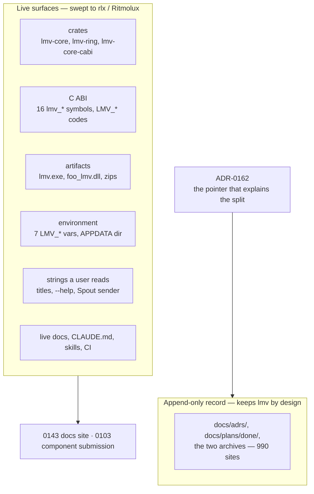

# 0150 — The application becomes Ritmolux

> **Status:** in-progress
> **Created:** 2026-09-02
> **Approved:** 2026-09-02 (user) - runs next, once the lanes now live have closed
> **Owner skill(s):** dev, human
> **Related ADRs:** [0162](../adrs/0162-the-application-is-renamed-to-ritmolux.md)
> **Blocks:** [0143](0143-the-documentation-gets-a-front-end.md) (parked in writing on this
> decision) and [0103](0103-the-project-gets-an-audience.md) Phases 4-6 (repository metadata,
> component submission, three posts). Neither may ship before this lands.
> **Lane guidance:** `main` directly, with **no other lane live** — see Phase 1. A worktree buys
> nothing here (the sweep touches every crate, so the lane pays a cold `target/` for no isolation)
> and ADR-0053's default does not apply to a change that conflicts with every parallel branch by
> construction.

## TL;DR

The application is renamed from `light-music-visualizer` to **Ritmolux**. Every live identifier
carrying the old name moves — the three `lmv-*` crates, the C ABI's sixteen `extern "C"` symbols
and its result codes, seven `LMV_*` environment variables, the shipped binary, the foobar component
filename, the release zips and the per-user data directory — using `rlx` where `lmv` stood and the
full name on anything a user reads. **The append-only record is not swept**: `docs/adrs/`,
`docs/plans/done/` and the two archives keep the old name, and ADR-0162 is the pointer that makes
them legible. When this lands, Plans 0143 and 0103 unpark.

## Context & problem

The name is a description that was never chosen as a product name, and two approved plans are now
waiting on it. [Plan 0143](0143-the-documentation-gets-a-front-end.md) is parked in its own header —
*"the rename is itself parked … that decision is the named trigger for this one"* — because a
GitHub Pages project site lives at a path derived from the repository name and **a renamed
repository does not redirect its Pages URLs**. [Plan 0103](0103-the-project-gets-an-audience.md)
Phase 5 submits the component to the foobar2000 component repository, and
`VALIDATE_COMPONENT_FILENAME("foo_lmv.dll")` makes that filename a contract with every installed
copy — foobar2000 refuses to load the component if the file is renamed. Publish either, and the
rename stops being a repository-internal edit and starts costing other people's bookmarks and
installs.

The surface is large but it is not uniform, and the split is the whole design of this plan:

| | occurrences | disposition |
|---|---|---|
| `core/`, `core-cabi/`, `standalone/`, `plugin-foobar/`, `milkconv/`, `lmv-ring/` | 1,042 | swept |
| live `docs/` (excludes `adrs/`, `plans/done/`, both archives) | 174 | swept |
| `.claude/`, `.github/`, `packaging/`, `scripts/`, `presets/`, `README.md`, `CLAUDE.md` | 102 | swept |
| `docs/adrs/`, `docs/plans/done/`, `README-archive.md`, `design-backlog-archive.md` | 990 | **kept** |

Counts are `git grep -InE '\blmv[-_ ]\|light-music-visualizer\|LMV_'` per path, taken 2026-09-02.
They are a scale estimate for sequencing, not a done-when — the done-whens below are exit codes.

## Decision

Rename to **Ritmolux** with the internal prefix **`rlx`**, sweeping every live surface in one plan
and leaving the append-only record untouched. Three characters replace three, so the substitution
is mechanical and no formatted line re-wraps. ADR-0162 records the decision and the rejected
alternatives: a public-surface-only rename (converts a one-time cost into a permanent seam),
keeping the C ABI symbols (buys stability for a consumer that does not exist), rewriting the record
(would edit accepted ADRs and falsify the history), and the two runner-up names — Clavilux, which
lost on an unobtainable GitHub handle, a dead `.com`, the Wilfred non-profit's `.org` and a
same-niche stub repository, and Lumefall, which sits one vowel from a live LED-lighting business.

**The central safety property is that this plan moves no golden.** Nothing here changes what is
rendered. Every phase runs the suite against the committed baselines untouched, and a moved golden
is a finding — evidence that something non-mechanical happened — never a re-bless.

## Architecture diagram

## Implementation phases

### Phase 1 — the name is cleared and the tree is frozen
- **Owner skill:** human
- **What:** The two gates that must hold before a workspace-wide sweep starts — the trademark
  check, and the absence of any parallel lane. **The first is discharged; the second is not.**
- **What the user does:**
  1. **Clear Ritmolux on a trademark register — DISCHARGED 2026-09-02, and the risk accepted.**

     **What was found:** a knockout search returned **no `Ritmolux` anywhere** — no exact mark and
     no near-exact one. `Ritmo` and `Lux` each return many marks *separately*, which is the
     expected result for two dictionary-adjacent elements and not a partial hit: confusion is
     judged on the mark as a whole, and a crowded field around a shared element narrows what any
     one owner of that element can claim. `-lux` is exactly such a crowd.

     **What was not verified**, and is recorded here rather than implied away: the per-register
     rows this phase's done-when originally asked for (register, date, exact query, classes, hit
     count) were not captured; the class-filtered `ritmo` pass in 9 / 42 / 41 was not reported
     back; and the storefront sweep below was not reported back. **This is a knockout search, not a
     clearance opinion.**

     **Why that is sufficient here — the user's call, 2026-09-02:** this is not intended as a
     commercial product and no registration is planned, so the exposure a fuller search buys down
     is not exposure this project carries. **The plan proceeds on the name.** If commercial
     distribution is ever contemplated, this is the decision to revisit first, and the method below
     is retained for that — and for screening Lumefall, which stays the recorded fallback.

     **Registers, in descending order of value.** The first covers most of the ground; stop early
     only if it convicts.

     | register | scope |
     |---|---|
     | `branddb.wipo.int` | 90+ national registers plus Madrid international marks, in one query |
     | `tmsearch.uspto.gov` | the US register — the one most likely to matter for distribution |
     | `euipo.europa.eu/eSearch` | the EU trade mark register |
     | `fips.ru` (Rospatent) | Russia, where `-люкс` is a crowded suffix; search Cyrillic too |

     **Terms.** Examiners weigh sound and meaning, not spelling, so the phonetic neighbours matter
     as much as the exact string: `ritmolux`, `ritmolux*`, `*ritmolux*`, `ritmo lux` (spaced),
     `rhythmolux`, `ritmoluxe`, `ritmoluks`, `rithmolux`, and — **within the four classes below
     only**, since it is a common word unfiltered — `ritmo*`. On Rospatent add `Ритмолюкс`,
     `Ритмо люкс`, `Ритмо*`.

     **Classes (Nice).** **9** downloadable software (primary) · **42** software as a service and
     software development · **11** lighting apparatus, which matters *specifically* because
     ADR-0145 puts this application next to lighting hardware · **41** entertainment and live
     performance.

     **Reading the result** — the test is likelihood of confusion, so relatedness of goods governs.
     An identical mark in an unrelated class does not block; a *similar* mark in class 9, 42, 11 or
     41 does. Live applications count as much as registrations, since a pending one ahead of us can
     mature. Dead marks do not block, but a recently-dead one names a party who may refile.
     `RITMIX` is the known near neighbour — different mark, but check which classes it holds.
  2. **Confirm the freeze.** Plans 0148 and 0149 closed and merged; no other lane opens until
     Phase 9 lands.
- **Files touched:** none.
- **Done when:** the trademark half is already discharged above, so what remains is the freeze —
  `git worktree list` prints exactly one line and `git status --porcelain` is empty. **If either
  fails, `dev` does not start Phase 2.** That is what is left of this phase's purpose, and it is
  the half that cannot be discharged in advance: a lane opened between this gate and Phase 9 would
  conflict with the sweep on nearly every file it touched.
- **Not covered by any register, and not swept:** US common-law rights arise from *use* rather than
  registration, so a product already shipping under this name creates risk no register shows. A
  storefront sweep — Steam, the Microsoft Store, the Mac App Store, Google Play, itch.io — would
  cover it in ten minutes and has not been run. Left open deliberately under the risk decision
  above; it is cheap to run later and would change nothing structural if it found something, since
  the fallback is a different name and not a different plan.

### Phase 2 — the crates take the prefix
- **Owner skill:** dev
- **What:** Rename the three `lmv-*` crates and their library targets. This is the walking
  skeleton: the crates are the deepest edge in the dependency graph, so renaming them forces every
  consumer — `standalone`, `core-cabi`, `milkconv`, and the C++ shim's build — to move at once. If
  the rename is structurally hard anywhere, it is hard here, before any user-visible surface has
  changed.
- **Mapping:** `lmv-core` → `rlx-core` (lib `lmv_core` → `rlx_core`); `lmv-ring` → `rlx-ring`
  (directory renamed with `git mv`); `lmv-core-cabi` → `rlx-core-cabi` (cdylib/staticlib
  `lmv_core_c` → `rlx_core_c`). The `standalone` and `milkconv` packages keep their names — neither
  was named after the product.
- **Files touched:** root `Cargo.toml` (`members`, `default-members`), `core/Cargo.toml`,
  `core-cabi/Cargo.toml`, `lmv-ring/` → `rlx-ring/`, `standalone/Cargo.toml`, `milkconv/Cargo.toml`,
  every `use lmv_core::` / `use lmv_ring::` and `lmv_core::` path across the workspace, `Cargo.lock`,
  `.github/workflows/*.yml` wherever a `-p lmv-*` scope is named.
- **Done when:** `cargo build --workspace` and `cargo nextest run --workspace` are green;
  `git grep -nE 'lmv[-_](core|ring)' -- . ':!docs'` returns nothing; **no golden was re-blessed** —
  the suite passed against the committed baselines.

### Phase 3 — the C ABI takes the prefix
- **Owner skill:** dev
- **What:** The sixteen `extern "C"` symbols, the result codes, the header's filename and include
  guard, and every C++ call site.
- **Mapping:** `lmv_*` → `rlx_*` for all sixteen functions and the opaque handle type;
  `LMV_OK` / `LMV_ERR_*` / `LMV_ABI_VERSION` / `LMV_VERSION` → `RLX_*`. **`RLX_ABI_VERSION` keeps
  its current value** — per ADR-0162, the counter guards a runtime shape check that a renamed
  symbol can never reach, so bumping it would assert a change that did not happen.
- **Files touched:** `core-cabi/src/**`, `core-cabi/include/lmv_core.h` → `rlx_core.h` (`git mv`),
  `plugin-foobar/foo_lmv.cpp` and its `#include`, `plugin-foobar/build.ps1`,
  `packaging/foobar/build-component.ps1`, and **`docs/specs/0001-c-abi.md`** — the spec is the
  authority on the ABI's shape and is a living contract, not part of the record.
- **Done when:** the component links with no unresolved externals;
  `git grep -nE '\blmv_|\bLMV_' -- core-cabi plugin-foobar docs/specs` returns nothing; the symbol
  roster in `docs/specs/0001-c-abi.md` names the same sixteen symbols the header declares; the
  suite is green with no golden re-blessed.

### Phase 4 — the shipped artifacts take the name
- **Owner skill:** dev
- **What:** Everything a release produces is spelled with the full name, not the prefix.
- **Mapping:** binary `lmv` → `ritmolux`; `foo_lmv.dll` → `foo_ritmolux.dll` (including
  `VALIDATE_COMPONENT_FILENAME`); `foo_lmv.cpp` → `foo_ritmolux.cpp` and
  `foo_lmv_version.h` → `foo_ritmolux_version.h`; the component's
  `DECLARE_COMPONENT_VERSION("Light Music Visualizer", …)` name and description → Ritmolux; the
  install directory `%APPDATA%\foobar2000-v2\user-components-x64\foo_lmv\` → `…\foo_ritmolux\`;
  the zips `light-music-visualizer-v<version>-*.zip` → `ritmolux-v<version>-*.zip`.
- **The component GUIDs are not touched.** They are the identity foobar2000 stores a Default UI
  layout against, so keeping them means an existing layout survives the filename change.
- **Files touched:** `standalone/Cargo.toml` (`[[bin]] name`), `plugin-foobar/foo_lmv.cpp` (`git mv`),
  `plugin-foobar/build.ps1`, `packaging/foobar/build-component.ps1` (`$DllName`),
  `packaging/macos/bundle.sh`, both `packaging/**/READ-ME-FIRST.md`,
  `.github/workflows/release.yml` (the `$name` and the three asserted top-level filenames),
  `docs/releasing.md`, `docs/on-device-validation.md`.
- **Done when:** `packaging/foobar/build-component.ps1` produces `foo_ritmolux.fb2k-component`;
  `release.yml`'s asserted top-level names match what the packaging step writes; `docs/releasing.md`
  names `foo_ritmolux.dll` where it states the component's size cap; and
  `docs/on-device-validation.md` carries a new item for the one thing no gate can check — that
  foobar2000 loads the renamed component and lists it as Ritmolux (verified in Phase 9).

### Phase 5 — the environment takes the prefix
- **Owner skill:** dev
- **What:** All seven environment variables move: `LMV_PRESET_DIR`, `LMV_BLESS`, `LMV_TIER`,
  `LMV_DEBUG_OVERLAY`, `LMV_SAMPLE_DIR`, `LMV_TRANSITION_STRIP`, `LMV_SPOUT_LOG` → `RLX_*`.
- **Files touched:** `standalone/src/lib.rs` (the `PRESET_DIR_ENV` / `TIER_ENV` constants),
  `core/tests/**`, `standalone/src/spout/shim.cpp`, `plugin-foobar/foo_ritmolux.cpp`,
  `.github/workflows/**`, `docs/capturing.md`, `docs/presets.md`, `presets/README.md`,
  `docs/on-device-validation.md`, `CLAUDE.md`, `.claude/skills/**`.
- **Done when:** `git grep -n 'LMV_' -- . ':!docs/adrs' ':!docs/plans/done'
  ':!docs/plans/README-archive.md' ':!docs/design-backlog-archive.md' ':!docs/plans/0150-*'`
  returns nothing; the golden suite still blesses under `RLX_BLESS`; the suite is green with no
  golden re-blessed.

### Phase 6 — the user's machine is migrated
- **Owner skill:** dev
- **What:** `APP_DIR_NAME` moves from `"light-music-visualizer"` to `"Ritmolux"`, and an existing
  directory is carried across rather than orphaned. That directory holds the user's edited presets,
  `config.toml` and the diagnostics log; leaving it behind would look exactly like data loss.
- **Behavior:** on resolution, if the new directory is absent and the old one exists, move it and
  log once. If both exist, use the new one and leave the old alone. If neither exists, seed fresh
  exactly as today. The `RLX_PRESET_DIR` override continues to win over all three.
- **Files touched:** `standalone/src/lib.rs` (`APP_DIR_NAME`, `resolve_preset_dir_from`),
  `standalone/src/main.rs`, `plugin-foobar/foo_ritmolux.cpp` (the literals its own comment requires
  be kept in step with `APP_DIR_NAME`), and the tests beside them.
- **Done when:** three tests state the behavior — an old directory with no new one ends up at the
  new path with nothing left at the old one; both present leaves the old one untouched and reads
  the new one; neither present produces a fresh seed identical to today's. A fourth asserts the
  environment override still takes precedence over a pending migration.
- **Note for `dev`:** the migration necessarily names the string `"light-music-visualizer"` in
  code, and a comment explaining *what* the move does is mechanism, which ADR-0127 permits. A
  comment narrating that the directory *used to be* called that is plan-relative history, which it
  does not.

### Phase 7 — the strings a user reads
- **Owner skill:** dev
- **What:** The window title, the console title, the `--help` banner, the component description,
  and the Spout sender name.
- **Mapping:** `APP_TITLE` → Ritmolux; `CONSOLE_TITLE` `"lmv console <version>"` →
  `"Ritmolux console <version>"`; the help banner `"lmv — a real-time music visualizer … usage: lmv
  [flags]"` → `ritmolux`; **`DEFAULT_SENDER: &str = "lmv"` → `"Ritmolux"`**.
- **`DEFAULT_SENDER` is the one identifier in this plan that lives outside the repository.** A
  Spout receiver — OBS, Resolume, a saved show file — binds to that string, so changing it
  re-points every saved source by hand, once. Phase 9 carries the checklist item.
- **Files touched:** `standalone/src/main.rs`, `standalone/src/stream.rs` (and the test asserting
  `request.sender`), `plugin-foobar/foo_ritmolux.cpp`, `README.md`.
- **Done when:** `ritmolux --help` names `ritmolux` in both the banner and the usage line; the
  window title leads with Ritmolux; `--stream` announces the `Ritmolux` sender; the suite is green
  with no golden re-blessed.

### Phase 8 — the live documentation, and the gates that name paths
- **Owner skill:** dev
- **What:** The remaining prose, and repair of the two gates this plan is structurally able to
  break.
- **Two gates are at specific risk, and both must be repaired here, not merely observed:**
  - **`check-backlog-claims.mjs`.** ADR-0108 anticipates this failure in writing — *"a rename turns
    the gate red for a reason that is not the entry's fault"*. Every live backlog probe naming
    `lmv-ring/`, `core-cabi/include/lmv_core.h`, an `LMV_` symbol or a renamed path must be
    re-pointed at the new path. A probe that goes red here is a stale probe, not a falsified claim.
  - **`check-doc-links.mjs`.** Phases 2, 3 and 4 each `git mv` a file that documents link to.
- **Also in this phase:** `Cargo.toml`'s `repository` key, which today reads
  `https://github.com/eastsphere/light-music-visualizer` while the actual remote is
  `IgorKonovalov/…` — **pre-existing drift, unrelated to the rename, fixed here** because this is
  the commit that touches the line. `CLAUDE.md`'s repository tree and its worktree convention
  (`WORK/lmv-plan-NNNN` → `WORK/rlx-plan-NNNN`), `.claude/skills/**`, `README.md`, and the live
  `docs/` pages.
- **Done when:** all five gates exit 0 (`check-doc-links`, `check-index-rows`,
  `check-backlog-claims`, `check-filter-figures`, `check-comment-hygiene`);
  `cargo nextest run --workspace` is green with no golden re-blessed; and
  `git grep -inE '\blmv[-_]|LMV_|light.music.visualizer' -- . ':!docs/adrs' ':!docs/plans/done'
  ':!docs/plans/README-archive.md' ':!docs/design-backlog-archive.md' ':!docs/plans/0150-*'`
  returns nothing.
- **The exclusion of this plan's own file is required, not cosmetic.** Plan 0150 names the old
  identifiers on nearly every line; a grep that does not exclude it can never pass, and adjusting
  the grep to make it pass is how a done-when gets tuned into meaninglessness.

### Phase 9 — the repository takes the name
- **Owner skill:** human
- **What:** The rename outside the working tree, and the on-device checks no gate can run.
- **What the user does:**
  1. Rename the repository on GitHub: `light-music-visualizer` → `ritmolux`. Web traffic, git
     `clone`/`fetch`/`push`, issues, wikis, stars and followers all redirect permanently.
     **GitHub Pages URLs do not redirect** — which is why Plan 0143 waited — and a workflow that
     `uses:` an action hosted in a renamed repository breaks with `repository not found`. This
     repository hosts no such action (`.github/` contains no `uses: ./`), so nothing here is
     affected.
  2. **Never recreate a repository named `light-music-visualizer`** — it silently kills every
     redirect the rename just created.
  3. `git remote set-url origin https://github.com/IgorKonovalov/ritmolux.git`, then rename the
     local checkout `WORK/light-music-visualizer` → `WORK/ritmolux`. The MSVC linker override in
     `WORK/.cargo/config.toml` sits *above* the checkout and keeps working untouched.
  4. Install `foo_ritmolux.fb2k-component` in foobar2000; confirm the component list reads
     Ritmolux; **remove the old `foo_lmv` component through Preferences**, since the filename
     validation means both would otherwise load.
  5. Re-point every Spout receiver to the `Ritmolux` sender.
  6. Optional: claim the free `ritmolux` GitHub organization and the free `ritmolux.com`,
     `rhythmolux.com` (the English-speaker typo) and `ritmolux.app`.
- **Done when:** `git remote -v` shows the new URL and `git fetch` succeeds; the foobar2000
  component list reads Ritmolux and nothing named `foo_lmv` remains under
  `%APPDATA%\foobar2000-v2\user-components-x64\`; a Spout receiver binds the `Ritmolux` sender.

## Risks & open questions

- **The trademark position is a knockout search plus an accepted risk, not a clearance.** The
  search found no `Ritmolux` on any register (Phase 1, 2026-09-02), and the user's decision is that
  a non-commercial project with no registration planned does not need more. What that leaves open:
  a class-filtered `ritmo` pass, a storefront sweep for unregistered common-law use, and the
  per-register record itself. **The trigger to revisit is commercial distribution**, and the
  remedy at that point is a different name — Lumefall — not a different plan, since every phase
  here is name-agnostic.
- **A blind textual substitution can corrupt what it does not understand.** `lmv` appears 879 times
  as a bare word and 1,020 times as an identifier prefix, and the repository contains binary golden
  baselines. Any scripted sweep must be word-boundary aware and must exclude binary files; the
  per-phase `cargo nextest run --workspace` with **no golden re-blessed** is what proves it stayed
  mechanical. A moved golden in any phase of this plan is a finding to investigate, never a bless.
- **The freeze is load-bearing and has no enforcement.** Nothing prevents a new worktree being
  opened mid-plan, and a lane that starts after Phase 2 would conflict on nearly every file it
  touches. Phase 1 states the agreement; keeping it is the user's.
- **The live rig loses its Spout binding.** Phase 7 renames the sender, and the memory of the
  2026-08-29 set is that the rig ran eight hours on that path. The re-point is one field per source,
  but it must happen before the next performance, not during it.
- **`.claude/skills/**` edits are classifier-dependent.** If a write under that path is refused,
  the sweep is incomplete in a place no gate inspects — `check-doc-links.mjs` covers the skills'
  links but nothing checks their prose. Report it rather than working around it.
- **The name of the abbreviation is now a second thing to know.** Users meet `Ritmolux`; the code
  says `rlx`. This is deliberate (ADR-0162) and cheap, but it is not free.

## What this plan does NOT do

- **It does not rewrite the record.** `docs/adrs/`, `docs/plans/done/` and the two archives keep
  `lmv` in 990 places, by design. ADR-0162 exists to make them legible.
- **It does not clear a trademark.** Phase 1 records a knockout search and an accepted risk; a
  clearance opinion is a different exercise, and the trigger for it is commercial distribution.
- **It does not publish anything.** The docs site is [0143](0143-the-documentation-gets-a-front-end.md);
  the component submission, the repository metadata and the posts are
  [0103](0103-the-project-gets-an-audience.md) Phases 4-6. This plan only removes the reason both
  are waiting.
- **It does not move to 1.0.** The version bump at close is an ordinary one, decided by the
  architect against what shipped. Whether the rename and 1.0 coincide is a separate call.
- **It does not rename the `standalone` or `milkconv` packages**, nor the component's GUIDs.

## Implementation log

> Written by `dev` — one row per phase as that phase's commit lands, and the close block after the
> last one. **The phases above are the contract; everything here is what happened.**

**Lane:** `main` directly, no worktree, per the lane guidance in the header.

| phase | owner | state | commit |
|---|---|---|---|
| 1 — the name is cleared and the tree is frozen | human | done | no files touched |
| 2 — the crates take the prefix | dev | done | c093dc7 |
| 3 — the C ABI takes the prefix | dev | done | 55fa009 |
| 4 — the shipped artifacts take the name | dev | done | 3d0b223 |
| 5 — the environment takes the prefix | dev | done | 1198b53 |
| 6 — the user's machine is migrated | dev | done | committed with this row |
| 7 — the strings a user reads | dev | not started | |
| 8 — the live documentation, and the gates that name paths | dev | not started | |
| 9 — the repository takes the name | human | not started | |

### Notes

**Phase 1's freeze half was verified, not assumed.** `git worktree list` printed one line,
`git status --porcelain` was empty, and Plan 0148 was closed and released at 0.102.0. A baseline
`cargo nextest run --workspace` was taken on 47432ca **before any edit** — 1513 passed, 5 skipped,
0 failed, 407.3 s — so that "no golden moved" is measured against a known-green tree rather than
asserted. Every phase below reports against that baseline.

**Phase 2's done-when grep does not return empty as written, and the 11 remaining hits are all one
string.** They are `lmv_core.h`, the ABI header's filename, which Phase 3's file list owns and
`git mv`s. The sweep protects that literal deliberately: without the guard, the `lmv_core` ->
`rlx_core` rule repoints every `#include` and every doc reference at a file that still exists under
its old name. Phase 3 closes it.

**`plugin-foobar/build.ps1` moved in Phase 2 although the plan lists it under Phase 3.** The crate
rename changes both its `cargo build -p` scope and the emitted `.lib` stem, so it could not stay
behind: it now reads `-p rlx-core-cabi` and `rlx_core_c.lib`. Its `foo_lmv.*` artifact names are
untouched and remain Phase 4's.

**`cargo fmt --all` was required, and the reason is not cosmetic.** `lmv_core` -> `rlx_core` moves
those `use` statements in alphabetical order — `rlx_core` sorts after `milkconv`, `objc2` and
`overlay` where `lmv_core` sorted before them — so a rename that is textually mechanical is not
import-order mechanical. `cargo fmt --all --check` was red until the reorder; no semantic change.

**A trap worth knowing before repeating any sweep in this plan:**
`core/tests/golden/composite_symmetry.png` contains the literal bytes `lmv` by coincidence, and
`Cargo.lock` is invisible to `git grep -I` because `.gitattributes` marks `*.lock -diff`. The sweep
selects files with `git grep -lI`, which excludes the PNG; `Cargo.lock` is regenerated by
`cargo build` rather than edited. A sweep that skips either precaution corrupts a golden or leaves
the lock stale.

**The C ABI has fifteen `extern "C"` functions, not sixteen.** Phase 3's own text, the plan's
TL;DR and ADR-0162's Context and Decision all say sixteen.
[`docs/specs/0001-c-abi.md`](../specs/0001-c-abi.md) — which `CLAUDE.md` names as the authority on
the ABI's shape — says **fifteen** normatively (*"MUST be exactly these fifteen functions and no
others"*) and calls a sixteenth *"widening the surface … an ADR-worthy event"*. The header agrees
at fifteen. The sixteen appears to be a count of distinct `lmv_*` tokens in the header, which
includes `lmv_core` from the header's own filename. **No code consequence** — the sweep renames
every symbol regardless of how many there are, and after it the header's roster and the spec's are
identical at fifteen. Recorded because the number is wrong in an ADR, and because `CLAUDE.md`
already warns that a roster count written in prose is falsified by every ABI change and that
nothing gates one.

**`LmvHandle` and `LmvMetrics` escape every grep in this plan.** Phase 3's done-when matches
`\blmv_|\bLMV_` and Phase 8's matches `\blmv[-_]`; `Lmv` followed by a capital is none of those, so
both types would have survived a plan that passed every check. Phase 3 names "the opaque handle
type", so `LmvHandle` -> `RlxHandle` is intended; `LmvMetrics` -> `RlxMetrics` is taken with it,
because a `LmvMetrics` beside a `RlxHandle` is incoherent. Disclosed as an extension — the plan
names only the handle.

**The component link was run, not assumed.** `plugin-foobar/build.ps1` compiled the shim against
the renamed header and linked it against `rlx_core_c.lib`, producing `build/foo_lmv.dll`
(9,804,288 bytes) with no unresolved externals. That is the failure mode ADR-0162 relies on for
this phase to be safe, so it was exercised rather than reasoned about. The artifact keeps its
`foo_lmv` name here; the filename is Phase 4's.

**`RLX_ABI_VERSION` keeps the value 6**, per ADR-0162: the counter guards a runtime shape check a
renamed symbol can never reach.

**Left alone deliberately:** the `$LmvSdkVersion`, `$LmvSpout*` and `$LmvWorkspaceVersion`
PowerShell variables under `packaging/foobar/`. They are packaging, not the ABI, and they are out
of Phase 3's grep scope; they move with the packaging phases.

**The sweep falsified four dated observations before they were caught, and the plan's rule for
what is "the record" does not cover them.** `docs/on-device-validation.md` is a live doc, so it is
swept — but it contains checked `- [x] RUN <date>` entries that are *observations*, not
instructions. The sweep rewrote *"Components list reads `Light Music Visualizer 0.70.0 / foo_lmv`"*
into `foo_ritmolux`, which asserts that someone saw, on 2026-08-16, a component name that did not
exist until today. Four such records were restored to the old name (the 2026-08-16 and 2026-08-24
runs); every forward-looking instruction in the same file keeps the new one. **This is ADR-0162's
own argument — that rewriting history to agree with a name chosen afterwards is a falsification —
applied to a file that is not on its "kept" list.** The ADR draws that list by directory
(`docs/adrs/`, `docs/plans/done/`, the two archives); the operative property is not where a
sentence lives but whether it is a dated claim about what was observed. Worth a second look at the
close: `docs/design-backlog.md` carries dated entries too, and Phase 8 sweeps it.

**`standalone/tests/help_cli.rs` had to move, and it is in no phase's file list.** It spawns the
binary through `env!("CARGO_BIN_EXE_lmv")`, a compile-time macro named after the `[[bin]]`. The
moment Phase 4 renames the bin the macro stops existing, so leaving the file alone is a build
break, not an untidiness.

**`packaging/foobar/build-component.ps1` asserts the component's declared name against the built
image**, at `$pe.Text.Contains("Light Music Visualizer")`. Phase 4's file list names only
`$DllName` in that file, but changing `DECLARE_COMPONENT_VERSION` without this literal makes the
recipe `Die` on every subsequent build. Moved to `"Ritmolux"` in the same commit.

**Two more names no phase's file list reaches:** `packaging/foobar/lmv-version.ps1` is a file whose
*name* carries the prefix (now `rlx-version.ps1`), and there are **three** `READ-ME-FIRST.md` under
`packaging/`, not the two Phase 4 names — `foobar/`, `macos/` and `windows/`.

**The recipe was run end to end rather than reasoned about.** `packaging/foobar/build-component.ps1`
produced `target/dist/ritmolux-v0.102.0-foobar2000-component.zip`, holding
`foo_ritmolux.fb2k-component` -> `x64/foo_ritmolux.dll` and nothing else, with all seven of its
verification checks green including the renamed name-string and the version read back out of the
image. The DLL is 9,804,288 B, 77.9 % of NFR section 4's 12,582,912 B cap.

**Deliberately still spelled with the old product name after this phase:** the `Light Music
Visualizer` prose in the three `READ-ME-FIRST.md`, the window and `ui_element` titles in
`foo_ritmolux.cpp` (Phase 7), and the `%APPDATA%\light-music-visualizer` paths in the same file
(Phase 6). Phase 8's grep matches `light.music.visualizer` and is what closes the remainder.

**Three scene seeds are the old name in ASCII, and Phase 5's done-when as written would have
moved their goldens.** `reaction_diffusion.rs`, `swarm.rs` and `emitter.rs` each hold a `SEED: u64`
whose bytes spell a prefixed name — `0x4C4D_565F_5244_5F31`, `0x4C4D_565F_5357_524D`,
`0x4C4D_565F_454D_4954` — each with a comment quoting that spelling. The done-when says no `LMV_`
may survive anywhere, and the obvious way to satisfy it is to re-spell the comment *and* the
constant. **The constant is the RNG seed**, so re-spelling it changes the scatter, every particle's
start state and every spawn, and moves the goldens of three scenes — which is the one thing this
plan forbids. **The values are unchanged and only the comments moved**, rewritten to carry the trap
(the bytes are a number, not a label) instead of the old spelling. Anyone reading the done-when
without running the suite lands on the wrong side of this.

**A fourth seed escapes every grep in the plan.** `reaction_diffusion.rs`'s
`INJECT_SEED = 0x4C4D_5244_494E_4A31` is ASCII `"LMRDINJ1"` — no `LMV_`, no `lmv[-_]`, so neither
Phase 5's grep nor Phase 8's sees it. Left as it is, for the same reason: changing it would move a
golden.

**Phase 5's grep reaches well past "all seven environment variables move".** Satisfying it also
required the five WGSL warp constants in `core/src/render/feedback.rs`, the `LMV_ABI_VERSION`
references in `Cargo.toml`, `release.toml`, `core/src/diag/mod.rs`, `docs/releasing.md` and the
architect skill, a comment naming a hypothetical `LMV_INPUT` in `standalone/src/main.rs`, and two
**live plans** (0126 and 0133) that the grep's exclusion list does not exempt. The done-when is the
contract, so all of them moved; none is an environment variable.

**`RLX_BLESS` was verified by observation, and the verification itself moved a golden.** Running
the golden target under `RLX_BLESS=1` rewrote `shape_collage.png` — which is the proof the variable
is wired, since an unread variable and a satisfied one are indistinguishable from a passing test.
The rewrite produced **different bytes for an image whose comparison had just passed**, the local
re-encode drift already on record for this repo. It was restored from `HEAD` and verified
byte-identical. **No golden has moved in this plan**; this one moved under a deliberate bless and
was put back.

**The rule applied to dated documents, after Phase 4's finding:** a *quoted observation* keeps the
old name, a *named tool that still exists* takes the new one. So `"Components list reads
Light Music Visualizer 0.70.0 / foo_lmv"` stayed in Phase 4, while `LMV_BLESS` and
`LMV_PRESET_DIR` inside methodological guidance in `docs/plans/README.md`,
`docs/design-backlog.md` and `docs/on-device-validation.md` became `RLX_*` — a reader told *"that
is the form to reuse"* needs the name that works today.

**Pre-existing drift, noticed and deliberately not fixed:** `core/src/diag/mod.rs` states that the
ABI version *"is still 4"* when it is 6, and points at `core/tests/ffi.rs` when the file is
`core-cabi/tests/ffi.rs`. Both predate this plan and neither is a rename defect; fixing them here
would be scope this plan did not ask for.

**The migration is not called from the resolver, and that is a deliberate departure from the
phase's wording.** Phase 6 says *"on resolution"*, and the natural reading is to move the directory
inside `resolve_preset_dir()`. That function is called by an existing unit test, by `shot`, and
twice by the app — so putting a `fs::rename` behind it means **`cargo test` moves the real
`%APPDATA%` directory of whatever machine runs the suite**, including CI. Instead
`migrate_app_dir_in(root)` takes its root as an argument and is exercised against a scratch
directory, `migrate_app_dir()` wraps it for the real root behind a `Once`, and `main()` calls it
once at startup ahead of the `--list-*` aids. `resolve_preset_dir()` stays free of side effects and
says so. **`shot` therefore does not migrate** — it only reads, and it has `--presets` and
`RLX_PRESET_DIR` for explicit control; the app is what carries the directory across.

**The four tests were mutation-checked rather than trusted.** Inverting the legacy-directory guard
in `migrate_app_dir_in` failed exactly those four and nothing else; restoring it returned 107/107.
A test that passes against both the code and its inverse is not evidence, and these are not that.

**`AppDirMigration` carries two outcomes the phase does not enumerate**, because both are reachable
and neither should be silent: `BothPresent`, where the new directory already exists and the legacy
one is left untouched (merging two libraries would be a guess, discarding either would be the loss
this migration exists to prevent), and `Failed`, where the rename errors and the app continues on a
fresh directory rather than refusing to start (NFR section 10). Each prints one line.

**The plugin does not migrate, only its literals move.** `foo_ritmolux.cpp` resolves
`%APPDATA%\Ritmolux` on its own, as the phase's file list asks. **A foobar user who has never run
the standalone therefore sees an empty library**: their presets sit under the old name and nothing
on the plugin path carries them across. Not a defect against this phase as written, but it is a
real user-visible consequence and the on-device item added in Phase 4 will not catch it — flagging
it for the close rather than widening the phase.

### Close triggers

- **`presets/` touched:**
- **Plan header `Closes:`** none
- **What shipped:**
- **Operator docs touched:**
- **Backlog probes (`node scripts/check-backlog-claims.mjs`):**
- **Full suite:**
- **Outstanding `human` phases:**

## Followups (after this lands)

- Unpark [0143](0143-the-documentation-gets-a-front-end.md): remove the `Parked until` block and
  choose the Pages subpath under the new repository name.
- Unblock [0103](0103-the-project-gets-an-audience.md) Phases 4-6.
- Decide whether the rename and 1.0 coincide, and whether `RLX_ABI_VERSION` moves at 1.0 for
  reasons of its own.
