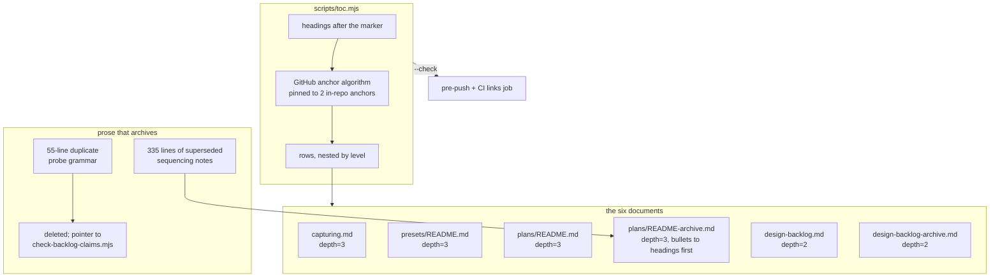

# 0151 — The long documents become navigable

> **Status:** in-progress
> **Created:** 2026-09-02
> **Owner skill(s):** dev
> **Related ADRs:** [0163](../adrs/0163-a-long-document-carries-a-generated-contents-block.md) (proposed)

## TL;DR

Six markdown documents totalling 26,500 lines carry no table of contents, and one of them —
`docs/plans/README-archive.md`, 133 close write-ups — has four headings in the entire file, so
nothing in it can be linked to at all. This plan adds `scripts/toc.mjs`, which regenerates a
contents block between markers from the headings beneath it, and puts a block in each of the six.
Along the way it removes the two accumulations that are genuinely spent: 335 lines of
self-declared-superseded sequencing prose in `docs/plans/README.md`, which move to the section that
already exists to receive them, and a 55-line second copy of the backlog probe grammar, which is
deleted in favour of a pointer at the parser that is its authority. The first visible result is
that `docs/capturing.md` opens with 36 clickable rows instead of 2,415 lines.

## Context & problem

The user's report was that `docs/design-backlog.md` is *"huge and almost impossible to navigate"*,
and asked what could be archived and what else is oversized. Measured 2026-09-02:

| File | Lines | Bytes | Headings | Growth, 2026-08-29 → 09-02 |
|---|---:|---:|---|---:|
| `docs/plans/README-archive.md` | 6,682 | 591 KB | **4 in the whole file**; 133 write-ups are bullets | +1,063 (+19 %) |
| `docs/design-backlog-archive.md` | 8,447 | 579 KB | 160 `##`, 186 `###` | +1,602 (+23 %) |
| `presets/README.md` | 4,192 | 264 KB | 13 `##`, 40 `###` | — |
| `docs/design-backlog.md` | 3,528 | 262 KB | 55 `##`, 110 `###` | −343 |
| `docs/capturing.md` | 2,415 | 155 KB | 7 `##`, 29 `###` | +263 (+12 %) |
| `docs/plans/README.md` | 1,267 | 118 KB | 6 `##`, 5 `###` | +198 (+19 %) |

**The answer to "what can we archive" is: much less than expected, and it is not in the backlog.**
The lifecycle is working there. `design-backlog.md` *shrank* 4,268 → 3,528 lines over the same
window in which both archives grew; all 44 live entries carry current dated probes; no entry with a
`CLOSED` marker is sitting in the open section. Forty-four live entries at a 72-line mean are 90 %
of the file, and they are 90 % of it because 44 design gaps are open.

Two accumulations are real, and neither is in the file that was reported:

- **`docs/plans/README.md`'s `## Recommended execution sequence` is 685 lines and names 97 plan
  numbers, 87 of them closed.** Its `### What this sequence assumes` subsection alone is 345 lines,
  and inside its own text it says *"Superseded 2026-08-18, kept as the record"*, then *"Prior
  sequence notes follow, and they are the record of how the previous roster ordered itself"*, then
  *"Prior sequence notes are kept below as the record of how the roster emptied, not as live
  guidance"*. `docs/plans/README-archive.md` already has a `## Prior sequencing notes (superseded)`
  section for exactly this and it holds three items. Nothing has ever moved into it at a close.
- **`docs/design-backlog.md` lines 12–66 are a second copy of a normative reference.**
  `scripts/check-backlog-claims.mjs` lines 42–68 carry the same three probe forms, the tracked-path
  rule, the regex-escaping caveat and the rationale — and the script is the authority because it is
  the parser.

The navigation problem itself is uniform and unaddressed: **none of the six has a table of
contents**, `presets/README.md` has a single 1,660-line section, and `README-archive.md` cannot even
be linked into because its 133 entries are bullets rather than headings.

## Decision

Per [ADR-0163](../adrs/0163-a-long-document-carries-a-generated-contents-block.md): **no document is
split.** A new `scripts/toc.mjs` regenerates a contents block between `<!-- toc:begin depth=N -->`
and `<!-- toc:end -->` from the headings that follow it, and each of the six gets one at the depth
its shape wants. The two real accumulations are removed into the archive section and the parser that
already own them. We rejected one file per entry (~240 files) because it rewrites two gates, the
close ceremony, and inbound references in 32 files to buy addressability in two write-only archives,
and we rejected number-range shards because the seams are arbitrary and each shard regrows.

**Sequencing:** this plan runs **before** [Plan 0143](0143-the-documentation-gets-a-front-end.md),
so that 0143's remark plugin and its 926-link rewrite are written against the final layout of
`capturing.md` and `presets/README.md` rather than against a layout this plan then changes.

**The honest limit, stated once.** For the file the user named, this delivers navigation and not
length: `design-backlog.md` nets about −110 lines of 3,528. The 44 live entries are the rest, they
are all current, and the lever that shortens them is closing them.

## Architecture diagram



## Implementation phases

### Phase 1 — The generator, proved on one real document
- **Owner skill:** dev
- **What:** `scripts/toc.mjs`, and `docs/capturing.md` carries the first generated block.
  `capturing.md` is the skeleton subject because it is the largest document no other phase touches,
  so a mistake here is visible and isolated.
- **Files touched:** `scripts/toc.mjs` (new), `scripts/fixtures/` (new fixture), `docs/capturing.md`.
- **Interface:** `node scripts/toc.mjs [root]` rewrites every `<!-- toc:begin depth=N -->` …
  `<!-- toc:end -->` block in the tree; `--check` rewrites nothing and exits 1 naming each stale
  block as `file:line`; `--self-test` runs the fixture. This is the same argument shape
  `check-doc-links.mjs` and `check-backlog-claims.mjs` already take, deliberately.
- **Done when:**
  - **The anchor algorithm reproduces the two anchors this repo already links.**
    `docs/capturing.md` links `#--render-a-music-video-from-a-track` (heading:
    ``### `--render`: a music video from a track``) and
    `#seeded-randomness--hash-noise-and-generator-seed` in `presets/README.md`. Between them they
    pin backtick stripping, colon removal, and the **doubled hyphen** an em-dash leaves when it is
    removed from between two spaces. The generator emits both byte-for-byte, or it is wrong — this
    is the phase's central claim, because `check-doc-links.mjs` validates paths and never fragments,
    so nothing downstream will catch an anchor that is merely plausible.
  - The fixture under `scripts/fixtures/` covers the heading shapes actually present in this corpus:
    backticks, an em-dash, a `%`, a `/`, an inline markdown link inside a heading, and **two
    headings with identical text**, which must dedupe as `-1` on the second. The backlog files carry
    six repeated heading texts and the archive eight, so the dedupe path is load-bearing rather than
    theoretical.
  - A block with no marker pair is left untouched, and a marker pair with no headings after it emits
    an empty block rather than failing.
  - `docs/capturing.md` carries a `depth=3` block whose row count equals its heading count at levels
    2–3 — 36 today, 7 `##` and 29 `###`.
  - `node scripts/toc.mjs --check` exits 0 on the tree, and `node scripts/check-doc-links.mjs` still
    exits 0.

### Phase 2 — `plans/README.md` gives up the superseded sequencing prose
- **Owner skill:** dev
- **What:** The self-declared-superseded sequencing notes move verbatim from `docs/plans/README.md`
  into `docs/plans/README-archive.md`'s existing `## Prior sequencing notes (superseded)` section.
- **Files touched:** `docs/plans/README.md`, `docs/plans/README-archive.md`.
- **Scope, precisely:** `docs/plans/README.md` lines **455–789** as of commit `0964385` — 335 lines.
  The block opens at the line `**Superseded 2026-08-18, kept as the record.** The 2026-08-16
  sequence follows.` and ends at the line before
  `### The baseline-drift control any pixel-touching plan inherits`.
  **`### What this sequence assumes` is not deleted — it is truncated.** Its first two bullets
  (`[0087] failing at its stop condition…` and `Two lanes is the ceiling here…`, lines 440–447) are
  live and stay. The other three subsections — `### The two lanes, now`, `### Then, in this order`,
  and `### The six plans added 2026-08-04, and why they exist` — are untouched.
- **One live sentence points at what leaves, and must be rewritten:** line 208's *"Rewritten
  2026-08-18, and this is the live sequence — everything from 'Prior sequence notes' down is
  history"* is the index describing the block being moved. After the move it points at nothing;
  it becomes a pointer to `README-archive.md`.
- **Done when:**
  - `docs/plans/README.md` is 335 ± 15 lines shorter — 1,274 → about 939.
  - **The structural check, and it is deliberately not a grep.**
    `sed -n '/^### What this sequence assumes/,/^### The baseline-drift control/p' docs/plans/README.md`
    returns the two headings with exactly the two live bullets between them and nothing else.
    **A grep for `Superseded 2026-08-1` or `Prior sequence notes` is the wrong check and must not be
    used:** three *live* lines quote those strings — the roster note at line 452, the live-sequence
    pointer at line 208, and this plan — so such a grep is unsatisfiable precisely when the edit is
    correct. This is the Plan 0150 trap in its other direction, and it is why the criterion above
    names a structure instead of a string.
  - **`node scripts/check-doc-links.mjs` exits 0**, which is what proves the move was completed
    rather than merely performed. The moved block uses **37 shortcut reference labels** (`[0046]`,
    `[0064]`, …) and **27 of them have no `[label]: target` definition in `README-archive.md`
    today**; markdown scopes definitions per document, and the checker reports exactly this class as
    `[label] (no definition in this file)`. Copy the 27 definitions across. This is the trap Plan
    0105 hit and the reason step 1b exists.
  - Nothing is summarized, reworded or dropped in the move — the archive's value is the record of
    how the roster ordered itself, in the words the close wrote.

### Phase 3 — `design-backlog.md` loses its duplicate and its spent history
- **Owner skill:** dev
- **What:** Delete the duplicated probe grammar in favour of a pointer, and move the three-sweep
  narrative to the archive.
- **Files touched:** `docs/design-backlog.md`, `docs/design-backlog-archive.md`.
- **Scope, precisely:**
  - `## Every live entry carries a probe, and something re-runs it` (lines 12–66, 55 lines) is
    replaced by a pointer of about six lines naming `scripts/check-backlog-claims.mjs` and
    [ADR-0108](../adrs/0108-a-backlog-claim-about-the-repo-carries-an-executable-probe.md) as the
    authority on the grammar. **Three sentences do not survive in the script and must be carried
    into the pointer or into the ADR reference, not dropped:** that green means the stated reduction
    holds and never that the entry is true; that the narrowest path is the better probe; and that
    `absent:` on a common word is a probe that cannot fail.
  - `## Where the closed entries went` (lines 67–129, 63 lines) moves to the archive, leaving about
    six lines that say where the archive is and that its bodies are kept for the corrections they
    carry. The three sweep narratives are a record of a rule failing before it had a carrier; the
    carrier now exists as close-ceremony step 3c, so the narrative is history.
- **Done when:**
  - `docs/design-backlog.md` is about 110 lines shorter and no longer restates the three probe forms.
  - The **ledger stays** in `design-backlog.md`. It answers "is 0072 live or closed" without opening
    a 579 KB file, and its rows are already inside the `roster:begin cap=320` region that
    `check-index-rows.mjs` measures — moving it would take `design-backlog.md` out of that gate's
    `ROSTERS` list for no gain.
  - `node scripts/check-backlog-claims.mjs` exits 0 and reports the same 44 live entries as before
    the edit. The parser finds entries by `## NNNN` headings under `## Open entries`; nothing in this
    phase touches that region, and this done-when is what proves it.
  - `node scripts/check-index-rows.mjs` and `node scripts/check-doc-links.mjs` both exit 0.

### Phase 4 — `README-archive.md`'s 133 write-ups become addressable
- **Owner skill:** dev
- **What:** Convert the flat bullet list under `## Recently closed (full entries)` into `###`
  headings, so that each close write-up has an anchor for the first time.
- **Files touched:** `docs/plans/README-archive.md`.
- **The transform:** each `- [NNNN — Title](done/…)` lead becomes `### [NNNN — Title](done/…)`, and
  its continuation lines lose their two-space bullet indent. Measured: 133 leads, 5,684 lines at
  exactly two spaces, 39 at four or more (nested bullets, which become two-space nested bullets and
  stay correct), and **zero code fences in the file**, which is why the de-indent is safe to do
  mechanically.
- **Done when:**
  - `grep -c '^### \[' docs/plans/README-archive.md` reports 133, and no line under that section
    still begins `- [0`.
  - `git diff --stat` shows the file's line count unchanged within ±5. This is the phase's real
    safety property: the transform moves indentation and heading markers and must not add, drop or
    merge a line of content.
  - `node scripts/check-doc-links.mjs` exits 0 — the 133 leads each carry a `done/…` link, and
    de-indenting must not damage one.
  - The file carries a `depth=3` block; its row count is 133 plus the 4 existing headings.

### Phase 5 — The remaining four documents carry blocks
- **Owner skill:** dev
- **What:** Generated blocks land in `presets/README.md`, `docs/plans/README.md`,
  `docs/design-backlog.md` and `docs/design-backlog-archive.md`. This runs after Phases 2–4 so each
  block is generated once, against final headings.
- **Files touched:** the four above.
- **Depths, and why:** `presets/README.md` and `docs/plans/README.md` take `depth=3`.
  **The two backlog files take `depth=2`** — every entry repeats `### Priority`, `### The finding`
  and `### What a fix would be`, so `depth=3` would produce a contents block of roughly 165 and 346
  rows in which the same six titles appear over and over. At `depth=2` the block is one row per
  entry, which is the index a reader of that file actually wants.
- **Done when:**
  - Row counts: `presets/README.md` 53, `docs/plans/README.md` 11 minus whatever Phase 2 removed,
    `docs/design-backlog.md` about 51 (55 `##` today, less the two sections Phase 3 removes and
    plus none added), `docs/design-backlog-archive.md` 160 plus the one Phase 3 adds.
  - `node scripts/toc.mjs --check` exits 0 across the tree.
  - **`presets/README.md`'s block makes its 1,660-line `## Systems and their named parameters`
    section reachable by system**, which is the case ADR-0154 called the sharpest: it is a lookup
    table read non-linearly and the only instrument for finding a parameter in it today is
    find-in-page.

### Phase 6 — The carrier
- **Owner skill:** dev
- **What:** Wire `--check` into the two places the other doc gates already run, and add the
  close-ceremony steps that keep both halves of this plan from decaying.
- **Files touched:** `.githooks/pre-push`, `.github/workflows/ci.yml`,
  `.claude/skills/architect/SKILL.md`.
- **Why this phase exists at all:** a generated block that nothing verifies is precisely the failure
  this repository has recorded three times — the backlog's own head documents a rule that lived in
  one file while the ceremony that would execute it lived in another, and it failed at two closes
  after being written down. `--check` is one line in each of two files; the ceremony step is the
  half that has historically been skipped.
- **Done when:**
  - `node scripts/toc.mjs --check` runs in `.githooks/pre-push` beside `check-doc-links.mjs` and in
    CI's `links` job, and a deliberately stale block makes both red.
  - The architect close ceremony gains two steps: regenerate the contents blocks, and **archive any
    sequencing note the close supersedes** into `README-archive.md`'s `## Prior sequencing notes
    (superseded)`. The second is stated with its trigger — the close rewrote the execution sequence
    — because ADR-0108's lesson is that a rule with no stated trigger and no stated output is the
    kind that gets skipped.
  - `CLAUDE.md`'s `scripts/` map gains `toc.mjs` in the gate list, not in the renderers list.

## Data shapes

```markdown
<!-- toc:begin depth=3 -->
- [The `shot` CLI](#the-shot-cli)
  - [`--render`: a music video from a track](#--render-a-music-video-from-a-track)
  - [The three calibration traps](#the-three-calibration-traps)
- [The `core/tests/` harness](#the-coretests-harness)
<!-- toc:end -->
```

```js
// illustrative — the anchor rule, pinned by the two in-repo anchors named in Phase 1
const anchor = (heading) =>
  heading
    .replace(/\[([^\]]*)\]\([^)]*\)/g, "$1") // a link keeps its text, loses its target
    .replace(/[`*_~]/g, "")                  // inline formatting is stripped, not encoded
    .toLowerCase()
    .replace(/[^\p{L}\p{N} \-]/gu, "")       // an em-dash goes, leaving the two spaces it sat between
    .replace(/ /g, "-");                     // ...which is why `moved — the` yields `moved--the`
```

## Risks & open questions

- **The anchor algorithm is the whole plan's correctness, and nothing downstream checks it.**
  `check-doc-links.mjs` validates paths and deliberately never fragments, so a subtly wrong anchor
  ships silently and every row in every block is wrong together. Mitigation: Phase 1 pins it to two
  anchors already committed and already linked in this repo, and the fixture covers the six shapes
  the corpus actually contains. A heading shape nobody has written yet remains uncovered — accepted.
- **Phase 4 rewrites 6,682 lines of an append-only record.** If the de-indent is wrong, content is
  damaged in a file whose whole value is that it was never rewritten. Mitigation: the ±5-line
  `git diff --stat` done-when, the absence of code fences, and the fact that the transform is
  mechanical. If a line count moves, revert the phase rather than repairing forward.
- **Phase 2 can strand reference-link definitions.** 27 of the 37 labels used in the moved block are
  undefined in the destination. The gate catches this class by name, so the risk is only that `dev`
  reads a green `check-doc-links` from before the move; the done-when is written to be run after.
- **Both archives are past 512 KB**, where GitHub's markdown rendering may not reach the targets a
  contents block points at. The block still works in an editor and locally. Not mitigated, and
  recorded in ADR-0163's Negative section as the price of not splitting.
- **[0126](0126-the-large-files-split-along-their-seams.md) is live in `WORK/rlx-plan-0126`, and
  this plan runs beside it in its own lane per ADR-0053.** The file sets are disjoint: 0126 takes
  `core/`, `core-cabi/`, `standalone/`, `plugin-foobar/` and its own plan file; this plan takes
  `docs/`, `presets/README.md`, `scripts/`, `.githooks/pre-push`, `.github/workflows/ci.yml` and
  `CLAUDE.md`. Checked: `CLAUDE.md` names none of the six files 0126 splits, so 0126's close has no
  edit to make there, and 0126 appears nowhere in the 335 lines Phase 2 removes. Working trees are
  separate, so ADR-0053's `cargo release` dirty-tree abort — which bit Plan 0060 from a parallel
  session in **one** checkout — does not reach across lanes.
- **The one shared file is `docs/plans/README.md`, at the two closes.** Both remove a roster row and
  add a recently-closed bullet, at opposite ends of the file and far from Phase 2's region, so a
  3-way merge handles it; whoever closes second re-merges `main` first. Phase 2 pins its deletion by
  content rather than by line number precisely so the other close moving lines is harmless.
- **Disk is the live constraint, not correctness.** Measured 2026-09-02: 42 GB free of 954 GB (96 %
  used), with `main/target` at 24 GB and `rlx-plan-0126/target` at 7.4 GB. Under ADR-0147 this lane
  gets its own store, and it costs **nothing** as long as no `cargo` runs in it — this plan compiles
  nothing. The one step that would build is verifying Phase 6's `pre-push` change; run
  `node scripts/toc.mjs --check` directly instead, and let the full hook fire once from `main` after
  the fast-forward. If a lane `target/` does appear, ADR-0053's recorded failure is ~8 GB of
  `target/debug/incremental` filling the disk mid-session.
- **Phase 6 arms `toc.mjs --check` in `pre-push` while 0126's lane is live.** Once 0126 merges
  `main` its pushes run the new check. It edits no markdown carrying markers, so it passes; the case
  that would bite is a close that adds or removes a heading in a file with a block without
  regenerating, which is what the ceremony step in the same phase exists to prevent.
- **A contents block relieves the pressure that would force a split.** These files keep growing at
  +19 % and +23 % per five days and nothing measures that. The user declined a size gate; if the
  next reader finds a 12,000-line archive, the answer is ADR-0163's Alternative A, which is written
  up and ready to be taken.

## What this plan does NOT do

- **It does not split any file, and it does not shorten `design-backlog.md` meaningfully** — about
  −110 lines of 3,528. The 44 live entries stay, because all 44 are current.
- **It does not archive any backlog entry.** None is discharged; the lifecycle is working and there
  is no accumulation to sweep.
- **It does not touch the ledger, the `roster:begin` regions, or ADR-0116's 320-byte cap.**
- **It does not add a size cap or a size gate.** Explicitly declined.
- **It does not rename any heading.** Renaming would move anchors, and inbound fragment links are
  unchecked by construction, so a rename breaks silently. `capturing.md`'s six plan-numbered heading
  suffixes (`(Plan 0045)`, `(Plan 0082)`, …) read as the plan-relative narration `CLAUDE.md` bars
  from comments, and they stay for now — that is a followup, not this plan.
- **It does not build the documentation site.** That is [Plan 0143](0143-the-documentation-gets-a-front-end.md),
  which this plan sequences before so 0143's route map is written against the final layout.

## Implementation log

> Written by `dev` — one row per phase as that phase's commit lands, and the close block after the
> last one. **The phases above are the contract; everything here is what happened.**

**Lane:** `WORK/rlx-plan-0151` on `plan-0151-the-long-documents-become-navigable`

| phase | owner | state | commit |
|---|---|---|---|
| 1 — The generator, proved on one real document | dev | done | `e450092` |
| 2 — `plans/README.md` gives up the superseded sequencing prose | dev | done | committed with this row |
| 3 — `design-backlog.md` loses its duplicate and its spent history | dev | not started | |
| 4 — `README-archive.md`'s 133 write-ups become addressable | dev | not started | |
| 5 — The remaining four documents carry blocks | dev | not started | |
| 6 — The carrier | dev | not started | |

### Notes

**Phase 1.** The fixture is **two** trees, not one: `scripts/fixtures/toc/` is green (3 blocks,
13 rows, exit 0) and `scripts/fixtures/toc-red/` holds the unpaired-marker case (exit 1, exactly
two problems). The plan's `Files touched` says "(new fixture)" singular. Split on the
`index-rows/` + `index-rows-red/` precedent, because the red case sits inside the green root and
would otherwise make that root exit 1 — `toc-red` therefore names itself on `toc.mjs`'s own
`SEEDED_TREES` list, which is a second entry the plan did not anticipate.

`--check` and the rewrite are one code path, not two: `regenerate()` never writes and the caller
decides. That was not asked for and is the reason the two modes cannot disagree.

The anchor rule needed no separate formatting-strip step — backticks, `*` and `~~` are punctuation
and the character filter already removes them. It does need `_` **kept**, which the plan's
illustrative snippet strips: the snippet's `[^\p{L}\p{N} \-]` would turn `reaction_diffusion`
into `reactiondiffusion`. GitHub keeps underscores, this corpus has bare snake_case in headings
(`design-backlog-archive.md:36`, `:860`), and the shipped filter is `[^\p{L}\p{N}_ -]`.

Each of five mutations was run against `--self-test` and each takes it red; the table is in
`scripts/fixtures/README.md`. Two assertions initially read the committed fixture rather than the
generated output and survived the matches-nothing mutation — they now read generated rows.

`docs/capturing.md`: 36 rows, against 7 `##` + 29 `###`.

**Phase 2.** `docs/plans/README.md` 1,277 -> **945** lines, so **-332** against the plan's
"335 +/- 15". The two-line difference is the live-sequence pointer, which the plan requires be
rewritten and which grew from two lines to four. The moved block is **byte-identical** to what left
(md5 `75ddcfc...` on both sides), so nothing was summarized, reworded or dropped.

**The undefined-label count was 17, not the 27 the plan predicted.** `README-archive.md` already
defined 49 labels of its own, more than the plan's estimate assumed; the seventeen missing ones were
appended to the end of that block rather than sorted in, which is how the block has grown at every
previous move. `check-doc-links.mjs` reported all of them by name before the copy and exits 0 after.

**One live paragraph the plan did not name had to be handled the same way as line 208's pointer.**
The `**Added 2026-09-02 — [0151] is docs-only and precedes [0143].**` note was added to
`### What this sequence assumes` by commit `0964385` — the same commit that wrote this plan — so the
plan's structural done-when ("the two headings with exactly the two live bullets between them and
nothing else") could not hold with it in place. Its live half is the 0143 sequencing decision, which
is not spent. It was **moved up** to sit with the other dated `Added ...` notes directly under
`## Recommended execution sequence`, where every other note of its kind already lives, and its
closing sentence — which pointed at the block being removed — was rewritten to point at the archive.
It was neither deleted nor left in place.

### Close triggers

- **`presets/` touched:**
- **Plan header `Closes:`** none
- **What shipped:**
- **Operator docs touched:**
- **Backlog probes (`node scripts/check-backlog-claims.mjs`):**
- **Full suite:**
- **Outstanding `human` phases:**

## Followups (after this lands)

- `docs/capturing.md`'s six plan-numbered heading suffixes are plan-relative narration in a
  reader-facing document. Dropping them moves anchors, so it wants doing as one deliberate change
  with an inbound-fragment sweep first.
- If either archive passes 12,000 lines, re-take ADR-0163 Alternative A (one file per entry). The
  write-up exists; the trigger is a number.
