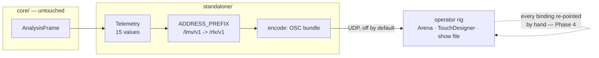

# 0152 — The OSC root becomes `/rlx`

> **Status:** in-progress
> **Created:** 2026-09-03
> **Owner skill(s):** dev, human
> **Related ADRs:** [0164](../adrs/0164-the-osc-address-root-becomes-rlx-in-one-break.md) (proposed),
> [0144](../adrs/0144-the-lighting-feed-is-a-resolved-ndi-sender-and-a-fixed-osc-telemetry-set.md) (gains an Outcome),
> [0162](../adrs/0162-the-application-is-renamed-to-ritmolux.md) (this discharges its deferral)

## TL;DR

`standalone/src/osc.rs:52` still reads `pub const ADDRESS_PREFIX: &str = "/lmv/v1"` — the last
operator-visible surface in the product carrying the old name, left behind deliberately because
Plan 0150's `\blmv[-_]` grep could not match a token followed by `/`. Per
[ADR-0164](../adrs/0164-the-osc-address-root-becomes-rlx-in-one-break.md) the root moves to `/rlx`
in one clean break with no transition period, and `/v1` stays because no protocol changed. Fifteen
addresses move; every binding in the rig must be re-pointed by hand, which is the `human` phase at
the end.

## Context & problem

The rename to Ritmolux ([ADR-0162](../adrs/0162-the-application-is-renamed-to-ritmolux.md),
[Plan 0150](done/0150-the-application-becomes-ritmolux.md)) swept 1,318 sites and left this one
standing on purpose. Both records say why, and both say what is owed:

> *"It was left alone deliberately — Plan 0150's greps do not match it, because the character after
> `lmv` is `/` — and moving it is the natural thing to do at 1.0 behind the `/v1` the address already
> carries. **It needs a decision, not a sweep.**"*

ADR-0164 is that decision. What makes this a plan rather than a commit is that the surface is
**published**: fifteen addresses, documented in `README.md`, bound in a console and a TouchDesigner
patch, and load-bearing in a live set that ran eight hours on 2026-08-29. The break is silent by
construction — OSC has no negotiation and no error channel, so a stale binding stops firing and
nothing anywhere reports it.

The blast radius is wider than `osc.rs` and the README, and two of the sites are executable:

| Where | Sites | Kind |
|---|---:|---|
| `standalone/src/osc.rs` | 16 | `ADDRESS_PREFIX` + 15 literals, plus a module doc comment |
| `standalone/src/osc/tests.rs` | 24 | assertions, including a byte-length test that counts the address |
| `README.md` | 15 | the operator's address table + one prose line |
| `docs/design-backlog.md` | 5 | 3 prose, **2 `check-backlog-claims` probes that go red on the rename** |
| `docs/adrs/0144-…` | 5 | **accepted** — takes a dated `Outcome`, never an edit |
| `docs/plans/0133-…`, `0147-…` | 3 | active plans, live text |

`docs/adrs/0145-…` and `0162-…` also name `/lmv/v1`; both are accepted and both are describing
history — 0145 in a rejected-alternative narrative, 0162 in the deferral note this plan discharges.
Neither is touched.

## Decision

Move the root, keep `/v1`, take the break in one commit-per-surface sequence that leaves the gates
green at **every** commit. We rejected dual-emitting both roots (doubles the packet count on a
per-frame path for one console's benefit, and leaves a retirement step of exactly the shape this
repository has recorded not happening), deferring again to 1.0 (the deferral already outlived the
plan that was meant to collect it, and the bound-consumer population only grows), and a configurable
root (a second thing to set wrong in a live rig, where a wrong root and a dead console look
identical from front of house). ADR-0164 carries the full argument.

## Architecture diagram



## Implementation phases

### Phase 1 — The wire moves, and the probes it falsifies move with it
- **Owner skill:** dev
- **What:** `ADDRESS_PREFIX` becomes `"/rlx/v1"`, the fifteen literals beside it follow, the tests
  follow, and the two backlog probes this commit falsifies are re-pointed and re-dated in the **same
  commit** — so the tree is gate-green at every commit rather than only at the end.
- **Files touched:** `standalone/src/osc.rs`, `standalone/src/osc/tests.rs`,
  `docs/design-backlog.md` (the two probe bullets only).
- **The two probes, named** — both currently `**Verified 2026-08-30**`:
  - `present: "/lmv/v1/raw/bass" in: standalone/src/osc.rs`
  - `present: /lmv/v1/raw/bass in: README.md` — this one is satisfied by Phase 2, so it is re-dated
    here and **must be re-checked after Phase 2 lands**, not before.
- **Done when:**
  - `standalone/src/osc.rs` contains no `lmv`, and `ADDRESS_PREFIX` is `"/rlx/v1"`.
  - **The byte-length assertions are recomputed, not merely re-spelled.** `osc/tests.rs:62` reads
    *"`/lmv/v1/preset` is 14 bytes, so 2 of padding"*. `/rlx/v1/preset` is also 14 bytes, so the
    padding arithmetic is unchanged and the comment stays true — but this must be *verified* rather
    than assumed, because OSC pads addresses to a 4-byte boundary and a root of a different length
    would silently change every packet's layout while the equality assertions still passed on the
    slice they check. Confirm each asserted length against the new string.
  - `cargo nextest run -p standalone` passes, and the address-prefix test at `osc/tests.rs:143`
    (`address.starts_with(ADDRESS_PREFIX)`) still covers all fifteen.
  - `node scripts/check-backlog-claims.mjs` exits 0.

### Phase 2 — The operator's table
- **Owner skill:** dev
- **What:** `README.md`'s address table and the prose line above it move to `/rlx/v1`.
- **Files touched:** `README.md`.
- **Done when:**
  - All fifteen rows read `/rlx/v1/…` and `README.md` contains no `lmv`.
  - **The prose at `README.md:363` is rewritten, not just substituted.** It currently reads
    *"…`/lmv/v1` prefix and a mapping you have already bound keeps working"* — a stability promise
    that this plan breaks. It becomes a statement that the root changed in this release, that `/v1`
    did not because the payload did not, and that a binding against the old root must be re-pointed.
    A silent substitution here would leave the README promising the opposite of what shipped.
  - `node scripts/check-backlog-claims.mjs` exits 0 — this is the phase that re-satisfies the second
    probe from Phase 1.

### Phase 3 — The record
- **Owner skill:** dev
- **What:** The accepted ADR gains an Outcome; the two active plans and the three remaining backlog
  prose sites are updated.
- **Files touched:** `docs/adrs/0144-…md`, `docs/plans/0133-…md`, `docs/plans/0147-…md`,
  `docs/design-backlog.md`.
- **Done when:**
  - **ADR-0144 gains a dated `Outcome` entry and its body is not edited.** It is accepted, it names
    `/lmv/v1` in five places including its own *"what is not superseded"* clause, and the house rule
    is that an accepted ADR is amended by a dated Outcome rather than in place. The Outcome says the
    root moved at ADR-0164 and that 0144's versioning-in-the-address decision is unaffected.
  - `docs/plans/0133-…` and `0147-…` name `/rlx/v1`; both are active, so they are edited directly.
    0147's mermaid node label `osc.rs — /lmv/v1/*` is one of the three.
  - The three backlog prose sites read `/rlx/v1`.
  - `docs/adrs/0145-…` and `0162-…` are **not** touched — both are accepted and both are describing
    history, which stays true as written.
  - `node scripts/check-doc-links.mjs`, `check-index-rows.mjs` and `check-backlog-claims.mjs` all
    exit 0.

### Phase 4 — Two seed comments come back
- **Owner skill:** dev
- **What:** Restore the decoder comment on the two RNG seeds that lost theirs during Plan 0150's
  sweep, and state the trap.
- **Files touched:** `core/src/render/scenes/swarm.rs`, `core/src/render/scenes/reaction_diffusion.rs`.
- **Why it rides along:** same origin — Plan 0150's close reports *"Only the comments moved"* on the
  seven ASCII seeds, and for these two the comments were **removed**. At the pre-rename baseline
  `47432ca`, `swarm.rs:27` carried `// "LMV_SWRM"` and `reaction_diffusion.rs:66` carried
  `// "LMV_RD_1"`; both now sit as bare hex. No other plan touches these files —
  [0126](done/0126-the-large-files-split-along-their-seams.md)'s eight phases do not name either.
- **Done when:**
  - Each constant carries a comment giving the ASCII the bytes spell **and** the trap:
    the value is a golden-fixing RNG seed, so it must not be re-spelled to match the new product
    name — doing so moves that scene's baseline. This is the mechanism-plus-trap a comment owes per
    ADR-0127, and it is what the deleted comments did not say.
  - **No golden moves.** `cargo nextest run --workspace` is unchanged; only comments were edited.

### Phase 5 — Re-point the rig
- **Owner skill:** human
- **What:** Re-point every OSC binding in Arena, the TouchDesigner patch and any show file from
  `/lmv/v1/…` to `/rlx/v1/…`.
- **Done when:** each of the fifteen addresses drives what it drove before, confirmed against a
  playing track. **This is the only place the break is observable** — nothing in the app, the
  console or the protocol reports a stale binding, so a mapping that was missed looks exactly like a
  fixture that happens not to be moving.
- **Note for the operator:** keep a copy of the old show file until this is confirmed. A build from
  before this plan and a build after it cannot drive the same bindings, and `/v1` deliberately does
  not distinguish them on the wire.

## Data shapes

```rust
// illustrative — the whole behavioural change, at standalone/src/osc.rs:52
pub const ADDRESS_PREFIX: &str = "/rlx/v1";   // was "/lmv/v1"
```

```text
before                      after
/lmv/v1/level/bass    ->    /rlx/v1/level/bass
/lmv/v1/raw/onset     ->    /rlx/v1/raw/onset
/lmv/v1/beat/trigger  ->    /rlx/v1/beat/trigger
/lmv/v1/tempo         ->    /rlx/v1/tempo
/lmv/v1/preset        ->    /rlx/v1/preset
                            ...fifteen in total; suffixes, types and cadence unchanged.
```

## Risks & open questions

- **The break is silent, and Phase 5 is the only detector.** A missed binding produces no error
  anywhere — the fixture holds its last value. Mitigation is that Phase 5 is a `human` phase with a
  per-address done-when rather than a "looks fine" check, and that the operator keeps the old show
  file until confirmed.
- **OSC pads addresses to a 4-byte boundary.** `/rlx/v1` and `/lmv/v1` are both 7 bytes so every
  packet's layout is unchanged, which is why Phase 1's arithmetic done-when is a verification rather
  than a rewrite. If it ever came out different, the equality assertions in `osc/tests.rs` would
  still pass on the slices they check while the packets on the wire changed shape — so the check is
  written to be run, not assumed.
- **Two active plans name the old root in text `dev` may be reading.** 0133 and 0147 are both
  approved and unstarted; if either is taken before this plan lands, its author reads `/lmv/v1`. The
  window is small and Phase 3 closes it, but the ordering is worth knowing.
- **No collision with [0126](done/0126-the-large-files-split-along-their-seams.md) or
  [0151](done/0151-the-long-documents-become-navigable.md).** 0126's eight phases name none of these
  files; 0151 touches `docs/` and `scripts/` but none of the four documents Phase 3 edits except
  `docs/design-backlog.md` — and there 0151 edits only the preamble and the sweep narrative, while
  this plan edits five entry bodies. Different regions of one file; a 3-way merge handles it.
- **Version level is operator-visible.** This changes a published surface, which is worth flagging
  for the close even though the level is the architect's call at that point per ADR-0005.

## What this plan does NOT do

- **It does not add a transition period, a dual-emit mode, or a configurable root.** ADR-0164
  rejects all three with reasons.
- **It does not move `/v1`.** No payload, type tag, suffix, vocabulary or cadence changes, so the
  protocol version has not changed.
- **It does not touch the seven ASCII RNG seeds' values** — only two comments, in Phase 4. The bytes
  stay, because re-spelling them moves goldens.
- **It does not touch `kGuidLmvMenu` / `kGuidLmvElement`.** The GUID values are foobar2000's stored
  identity for a Default UI layout; Plan 0150 left them deliberately and that stands.
- **It does not edit `docs/adrs/0145-…` or `0162-…`.** Both are accepted and both describe history
  that stays true.
- **It does not change ADR-0144's telemetry set** — same fifteen addresses, same rules, same
  default-off `--osc` opt-in.

## Implementation log

> Written by `dev` — one row per phase as that phase's commit lands, and the close block after the
> last one. **The phases above are the contract; everything here is what happened.**

**Lane:** `plan-0152-the-osc-root-becomes-rlx`, worktree `WORK/rlx-0152-osc-root`

| phase | owner | state | commit |
|---|---|---|---|
| 1 — The wire moves, and the probes it falsifies move with it | dev | done | `aec2381` |
| 2 — The operator's table | dev | done | `7644cc3` |
| 3 — The record | dev | done | `56f8a69` |
| 4 — Two seed comments come back | dev | done | `c594fa5` |
| 5 — Re-point the rig | human | not started | |

### Notes

- **Phase 2 leaves one `lmv` in `README.md`, deliberately, and that is a deviation.** The phase's
  done-when asks both that the prose *"becomes a statement that the root changed in this release …
  and that a binding against the old root must be re-pointed"* and that `README.md` contains no
  `lmv`. The two cannot both hold: naming the old root is what makes the first one useful to an
  operator holding a bound show file, and it is the string they have to search for. The single
  remaining occurrence is at `README.md:362`, inside `**The root moved in this release:
  `/lmv/v1` became `/rlx/v1`.**` — a historical mention, not a live address. Every one of the
  fourteen table rows reads `/rlx/v1`. No gate enforces the absolute form; `scripts/` contains no
  `lmv` grep.
- **The plan says "fifteen addresses" in five places; there are fourteen.** `standalone/src/osc.rs`
  declares `ADDRESS_COUNT: usize = 14`, `Telemetry::messages` returns fourteen entries, and
  `README.md`'s table has fourteen rows. Phase 1's done-when *"still covers all fifteen"* was
  implemented as fourteen; the assertion it names (`messages.len() == ADDRESS_COUNT` plus a
  `starts_with(ADDRESS_PREFIX)` loop) is unchanged and covers the whole set either way.
- **The two backlog probes were split across Phases 1 and 2 rather than both moving in Phase 1.**
  Phase 1's bullet asks for both, but the `README.md` probe cannot be green between the two commits
  — README does not move until Phase 2 — which would have failed Phase 1's own
  `check-backlog-claims exits 0` done-when and its stated *"gate-green at every commit"* rationale.
  The `osc.rs` probe moved in Phase 1, the `README.md` probe in Phase 2 beside the edit that
  satisfies it. Cost: `docs/design-backlog.md` appears in Phase 2, whose `Files touched` names only
  `README.md`. The user chose this over the literal reading.

- **Phase 4 found a different defect than the one it describes, and fixed that.** The phase says
  both seed comments were removed by Plan 0150 and that the constants `now sit as bare hex`. They
  do not: each already carried the *trap* half — that re-spelling the bytes to match a renamed
  prefix moves that scene's goldens. What was missing is the *decoder*, which is the half a reader
  cannot re-derive, so the ASCII was added to the existing comment rather than a deleted comment
  restored. Both bytes were decoded from the literals rather than copied from the plan:
  `0x4C4D_565F_5357_524D` is `LMV_SWRM` and `0x4C4D_565F_5244_5F31` is `LMV_RD_1`, matching the
  values the plan cites at baseline `47432ca`. Both done-when clauses hold as written.

### Close triggers

- **`presets/` touched:** none. `git diff --name-only 15dfe7f..HEAD -- presets/` is empty.
- **Plan header `Closes:`** none
- **What shipped:** a **feature**, in one commit — `aec2381`, which changes what the sink puts on
  the wire. The other three move no behaviour: `7644cc3` and `56f8a69` are documentation, and
  `c594fa5` is two comments.
- **Operator docs touched:** `README.md` — the OSC telemetry block. Fourteen address rows moved to
  `/rlx/v1`, and the paragraph above them was rewritten from a stability promise into a break notice
  naming the old root, saying why `/v1` did not move, and saying that a missed binding reports
  nothing.
- **Backlog probes (`node scripts/check-backlog-claims.mjs`):** exit **0** — 106 stated reductions
  across all 46 live entries. Green at **every** commit in the lane, which is what splitting the two
  probes across Phases 1 and 2 bought. `check-doc-links.mjs`, `check-index-rows.mjs`,
  `check-comment-hygiene.mjs` and `toc.mjs --check` also exit 0.
- **Full suite:** `cargo nextest run --workspace`, exit **0** — 1523 tests run, 1523 passed, 5
  skipped, 9 slow, 407.955 s. Run at `c594fa5`'s tree. `cargo fmt --all --check` and
  `cargo clippy --workspace --all-targets -- -D warnings` clean at the same tree. **No golden
  baseline moved** — `core/tests/golden/` is clean in the working tree after the run, which is
  Phase 4's own done-when.
- **Outstanding `human` phases:** **5** — re-point every OSC binding in Arena, the TouchDesigner
  patch and any show file. Not run. It is the only detector this break has.
- **The lane is behind `main`, and a merge is owed before it lands.** Base is `15dfe7f`; `main`
  advanced to `89c8c99` during the session, when Plan 0128 closed and merged. The two trees overlap
  on `docs/design-backlog.md` — 0128's close archived backlog 0110 and filed 0186, while this lane
  edits five entry bodies — and `main` also moved `docs/plans/README.md`, which this lane does not
  touch. Different regions, so a 3-way merge handles it, which is what the plan's Risks section
  predicted. **The suite figures above predate that merge**, and 0128 shipped a render-behaviour
  change, so they are a reading on this lane's base rather than on the merged result.

## Followups (after this lands)

- ADR-0162's Outcome says the OSC prefix *"needs a decision, not a sweep"*. Once this closes that
  sentence is discharged; it is an accepted ADR, so it stays as written and this plan is the record
  of what the decision was.
