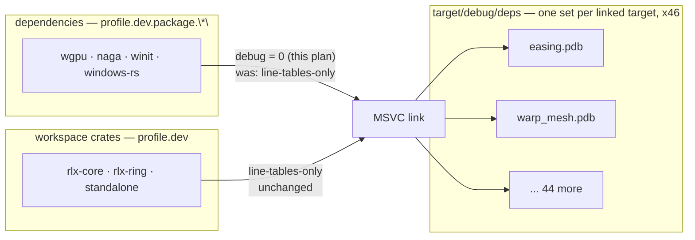

# 0153 — The debug tree stops carrying dependency line tables

> **Status:** draft
> **Created:** 2026-09-04
> **Owner skill(s):** dev
> **Related ADRs:** [ADR-0165](../adrs/0165-dependencies-compile-without-debug-info-and-one-line-buys-it-back.md)

## TL;DR

Every one of this workspace's 46 integration test binaries carries its own copy of the dependency
graph's debug info — 25.5 MB per binary, measured — because MSVC emits a separate `.pdb` per linked
target and nothing shares it. One line, `debug = 0` under the existing `[profile.dev.package."*"]`
block, cuts each test binary's `.pdb` from 40.5 MB to 15.0 MB with `rlx-core`'s own debug info
verified unchanged. Dependency frames stop carrying line numbers; deleting the line and rebuilding
buys them back in 87 s.

## Context & problem

On 2026-09-04 the user asked why building the app produces so many temporary files. The main
checkout's `target/` held **24 GB** with no worktree live:

```
target/debug/deps/          13 G    262 .pdb (8.3 G) + 247 .exe (2.9 G) + rlib/rmeta/lib/dll
target/debug/incremental/  8.2 G    509 crate-hash dirs, every one dated within a single day
target/release/            1.4 G
target/shot-cli-tests/     212 M    1006 scratch dirs, pre-fix residue (see below)
target/{tmp,doc,dist}/     104 M
```

Three findings came out of the breakdown, and only one of them is this plan's business.

**First, the framing gap.** [ADR-0147](../adrs/0147-the-shared-artifact-store-is-revoked-and-the-linker-stays.md)
priced the revoked artifact store at *"roughly 7-15 GB per live lane"* and named the defence as
*"remove a finished lane's worktree - which is discipline and not a gate."* That defence does not
reach the main checkout, which is where the 24 GB was.

**Second, the reclaimable garbage — already swept, before this plan.** 9 GB came off in that session
and none of it needs a plan: the whole `incremental/` tree, ~1.4 GB of `lmv_*` artifacts orphaned by
the crate rename to `rlx_*` (no crate is named `lmv` in any `Cargo.toml`), and the
`target/shot-cli-tests/` residue. That last one is **dead by construction, not merely stale** —
backlog 0160's path half landed at Plan 0136 Phase 8, so `scratch()` now roots at
`CARGO_TARGET_TMPDIR` and can never write to `target/shot-cli-tests/` again. The checkout stood at
**15 GB** after the sweep, and that is the baseline this plan's effect should be read against.

**Third, the separable structural cost — this plan.** `easing.rs` is a pure-math test with no GPU
work and its `.pdb` is 40.5 MB, the same order as `warp_mesh` at 45 MB. The debug info is the
dependency graph's, replicated into every one of 46 linked test targets because MSVC has no
split-debuginfo packing. ADR-0165 carries the controlled measurement and the reasoning.

## Decision

Set `debug = 0` under `[profile.dev.package."*"]` in the root `Cargo.toml`, committed rather than
machine-local, and document the escape hatch where a developer hits the need for it. We rejected a
machine-local `[profile]` block in `WORK/.cargo/config.toml` (it would make two clones build
different artifacts with nothing surfacing the difference — the exact hazard ADR-0147 exists to
end), and rejected exempting wgpu and naga (they are plausibly most of the 25.5 MB, so the exemption
forfeits the win to protect a layer whose failures arrive as validation messages, not backtraces).
Periodic sweeping and the test-target merge are not alternatives to this and are filed separately.

## Architecture diagram



The `x46` is the whole problem: the dependency arrow's payload is duplicated into every target
rather than shared, so trimming it once is multiplied by the number of linked binaries.

## Implementation phases

### Phase 1 — The profile setting

- **Owner skill:** dev
- **What:** Add `debug = 0` to the existing `[profile.dev.package."*"]` block, with a comment
  carrying the mechanism and citing ADR-0165 by bare number.
- **Files touched:** `Cargo.toml`
- **Done when:**
  - `[profile.dev.package."*"]` carries both `opt-level = 2` and `debug = 0`, and the comment states
    that the block's two settings were argued from different evidence — the existing warning against
    widening `opt-level` to workspace members is about `opt-level` and does not transfer to `debug`.
  - After `cargo test -p rlx-core --test easing --no-run`, the freshly emitted
    `target/debug/deps/easing-*.pdb` is **at least 50 % smaller** than the 40.5 MB ADR-0165 records
    for the same artifact. `dev` records the observed byte count in the implementation log rather
    than asserting a band: this is a measurement on one machine, not a property of the toolchain
    (ADR-0071).
  - `librlx_core-*.rlib` from that same build is **within 5 % of 52.9 MB**, confirming cargo's `"*"`
    glob did not reach a workspace member and the ADR-0033 coverage ratchet's line mapping is intact.
    A number outside that band means the glob's scope is not what ADR-0165's Context claims and the
    phase stops rather than proceeding.
  - `cargo nextest run --workspace` is green. Record the `Summary` line's pass/skip counts.

### Phase 2 — The escape hatch, written down where it is needed

- **Owner skill:** dev
- **What:** Document how to get dependency line numbers back for a session that needs them, in
  `CLAUDE.md` beside the existing machine-setup material.
- **Files touched:** `CLAUDE.md`
- **Done when:**
  - `CLAUDE.md` states, in the build/machine-setup region, that dependencies compile with no debug
    info; that a backtrace frame inside wgpu, naga, winit or windows-rs therefore carries no line
    number; and that deleting the one `debug = 0` line and rebuilding restores it at the cost of a
    full dependency rebuild (87 s on the reference machine).
  - The text cites ADR-0165 by bare number and carries no relative link into `docs/adrs/`, matching
    how the neighbouring linker-override section cites its own ADRs.
  - `node scripts/check-doc-links.mjs` exits 0.

## Data shapes

None — this plan introduces no types, no interfaces and no runtime behavior. Its entire surface is
one key in one TOML table.

## Risks & open questions

- **The 50 % done-when could fail on a different toolchain.** The 40.5 MB baseline is rustc 1.97.1
  on `x86_64-pc-windows-msvc`. `rust-toolchain.toml` pins 1.97.1, so `dev` will measure against the
  same compiler; if the observed reduction is materially smaller, that is a finding for the log and
  a reason to stop, not a number to tune the phase around.
- **A future contributor deletes the line to debug something and commits the deletion.** Nothing
  gates this, and nothing here proposes a gate — an artifact-size gate would freeze a number that
  varies by toolchain and machine, which is what ADR-0071 warns against. The ADR and the `CLAUDE.md`
  paragraph are the whole defence, and that is a deliberate acceptance.
- **`opt-level = 2` on dependencies may interact with `debug = 0` in the profiler.** If anyone
  profiles a dependency-heavy path, optimized frames with no debug info are close to unreadable.
  No one in this repo currently does; if that changes, the escape hatch is the same line.
- **Unmeasured: the effect on link time.** Fewer bytes written per link should help the cold path,
  but the 87 s figure in ADR-0165 is a full dependency rebuild and is not a link-time measurement.
  This plan claims a disk win and deliberately claims nothing about build speed.

## What this plan does NOT do

- **It does not sweep or gate the incremental tree** (8.2 GB in one day, the largest single pile).
  Filed as [backlog 0183](../design-backlog.md).
- **It does not merge test targets.** Folding the 37 non-`binary()`-gated suites into one would
  remove 36 links and 36 `.pdb` files and composes with this change, but it is structural and
  touches ADR-0156's design. Filed as [backlog 0182](../design-backlog.md).
- **It does not prune stale hash generations in `deps/`**, and cannot: `cargo clean --gc` is
  `-Zgc`-gated and `rust-toolchain.toml` pins stable 1.97.1. Filed as [backlog 0184](../design-backlog.md).
- **It does not clean up `scratch()`'s accumulating per-run directories.** That is the surviving
  half of the nuisance, now bounded to `target/tmp/` and 52 MB.
- **It does not touch `release`, `renders/` or `spike/`.** `renders/` held 1.1 GB of Plan 0106
  phase 6/7 output at the time of measurement; it is gitignored and the user's to keep.

## Implementation log

> Written by `dev` — one row per phase as that phase's commit lands, and the close block after the
> last one. **The phases above are the contract; everything here is what happened.**

**Lane:** _(to be filled by `dev`)_

| phase | owner | state | commit |
|---|---|---|---|
| 1 — The profile setting | dev | not started | |
| 2 — The escape hatch, written down where it is needed | dev | not started | |

### Notes

### Close triggers

- **`presets/` touched:**
- **Plan header `Closes:`** none
- **What shipped:**
- **Operator docs touched:**
- **Backlog probes (`node scripts/check-backlog-claims.mjs`):**
- **Full suite:**
- **Outstanding `human` phases:**

## Followups (after this lands)

- Re-measure the checkout's `target/` after a full cold build and compare against the 15 GB
  post-sweep baseline, to learn what the change is worth in aggregate rather than per binary.
