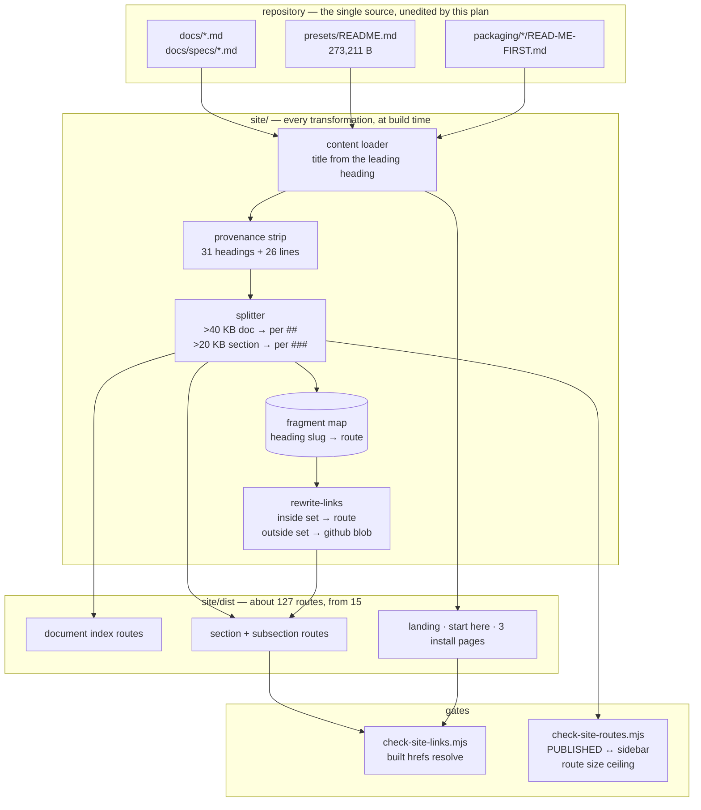

# 0154 — The site becomes navigable

> **Status:** in-progress
> **Created:** 2026-09-05
> **Owner skill(s):** dev, human
> **Related ADRs:** [0166](../adrs/0166-a-published-document-splits-into-routes-by-size.md),
> [0167](../adrs/0167-the-site-owns-its-entrance-and-the-install-page-is-the-testers-own-file.md),
> [0168](../adrs/0168-the-reader-documents-address-a-reader-and-the-record-stays-a-link.md)
> **Coordinates with:** [0103](0103-the-project-gets-an-audience.md) — that plan owns `README.md`;
> **this plan does not touch it**, and ADR-0167 records the narrowing of its exclusion.
> **Sequenced before:** [0155](0155-the-reader-documents-stop-explaining-themselves.md) — that plan's
> prose rewrite renames headings, and Phase 3 here is what turns a broken inbound anchor into a
> build failure instead of silent rot.
> **Lane guidance:** build on `main` directly, **not** in a worktree, for Plan 0143's reason: every
> phase is JavaScript, markdown and config, and a fresh worktree buys a cold `target/` (ADR-0147 puts
> a lane at 8-18 GB) for a plan that compiles no Rust. **Be aware that every phase deploys.**
> `.github/workflows/pages.yml` publishes on every push to `main`, so each phase commit is live once
> pushed — which is why the URL-moving work is ordered to happen once rather than twice.

## TL;DR

The documentation site went live on 2026-09-05 and did not solve the problem it was built for: the
parameter roster is still one route, 273,211 bytes of source rendering to 484 KB of HTML, and
Pagefind indexes it as a single page — so a search for a parameter drops the reader at the top of a
quarter-megabyte document. This plan splits large documents into routes by size at build time, makes
fragment links resolve to the right route or fail the build, strips plan and ADR numbers out of
headings before they become URLs, gives the site an entrance that tells a stranger what Ritmolux is
and where to download it, and gates the drift classes the site has accumulated. The first visible
result, after one phase, is that no page title or URL on the site names a plan number.

## Context & problem

The user asked to improve the site: *"make navigation better, make really good introduction, menu,
make everything neat and stable"*, and separately that a reader *"should understand how the
application works, but not why this or that decision were made."*

Four problems, measured 2026-09-05 against the tree at `9dc2183`.

**One page is the navigation problem.** `presets/README.md` is 273,211 bytes on one route. A flat
split at `##` does not fix it — three sections hold 219,863 bytes, 80.5 % of the document. The
distribution and the thresholds it justifies are in
[ADR-0166](../adrs/0166-a-published-document-splits-into-routes-by-size.md).

**Fragments are unguarded.** `scripts/check-doc-links.mjs` validates link paths and deliberately
never validates fragments. 15 fragment links point into the roster and 21 into `docs/capturing.md`;
today they all land somewhere on the right enormous page, so being wrong is invisible. A split makes
them wrong loudly, and makes them checkable for the first time.

**There is no introduction.** Of 15 published routes, none says what Ritmolux is, how to get it, or
how to run it. ADR-0154 made the home page a router on purpose; that was correct while the site had
no audience and is wrong now that it has a public URL. The reasoning is in
[ADR-0167](../adrs/0167-the-site-owns-its-entrance-and-the-install-page-is-the-testers-own-file.md).

**The site addresses the wrong reader.** 792 references to a plan or an ADR appear in the published
set. 31 of them end a heading, which under ADR-0166 would make a plan number part of a URL —
`.../guide/parameter-roster/engine-wide-controls-plan-0018/`. That class plus 26 trailing body-line
citations is the mechanical 7 %; the other 93 % is prose and is
[Plan 0155](0155-the-reader-documents-stop-explaining-themselves.md).

Two smaller defects belong here because they are the same kind of thing. Adding a page requires
editing `PUBLISHED` in `site/src/plugins/rewrite-links.mjs` **and** the sidebar in
`site/astro.config.mjs`, with nothing checking they agree — a file added to one and not the other
becomes an orphan route reachable only by search. And the site is a current-`main` site with no
statement of what it was built from, so a tester reading it beside a release zip cannot tell whether
the two match.

## Decision

Split at build time by size per ADR-0166, strip mechanical provenance per ADR-0168, add an authored
entrance whose installation pages are the packaging files themselves per ADR-0167, and gate the
drift. We rejected an in-page table of contents (Pagefind still indexes one 484 KB page), a fixed
split depth (80.5 % of the roster stays in three routes), and shortening the documents to fit the
renderer (completeness is the property ADR-0154 named as worth keeping).

The plan is ordered so that **URLs move once**. The heading strip lands before the splitter, because
slugs are computed from headings; the fragment gate lands before the rule generalises, because it is
what makes the remaining moves safe.

## Architecture diagram

## Implementation phases

### Phase 1 — no plan number reaches a reader's eye

- **Owner skill:** dev
- **What:** A remark plugin strips the trailing provenance parenthetical from headings and from body
  lines whose remaining content is only the citation. Runs before slugs are computed. `docs/` is not
  edited; this is a build-time transformation, so `scripts/toc.mjs --check` is unaffected because
  the source headings are unchanged.
- **Files touched:** `site/src/plugins/strip-provenance.mjs` (new), `site/astro.config.mjs`.
- **Done when:** No heading in `site/dist/` ends in a `(Plan NNNN)` / `(ADR-NNNN…)` parenthetical.
  31 headings and 26 body lines change. A citation woven into a sentence is left exactly as it is —
  the plugin matches only a trailing parenthetical, and a passage like *"ADR-0047's treatment"* must
  survive untouched. `node scripts/toc.mjs --check` exits 0 without the source being touched.

### Phase 2 — the roster becomes 46 pages

- **Owner skill:** dev
- **What:** The splitter, applied to `presets/README.md` alone. One route per `##`; any section over
  20 KB splits again at `###`. The document's leading prose becomes its index route, which lists the
  sections. The sidebar gains one collapsed group. This is the walking skeleton for the mechanism —
  thresholds are read from one place and applied to one document.
- **Files touched:** `site/src/plugins/split-document.mjs` (new), `site/src/content.config.ts`,
  `site/astro.config.mjs`.
- **Done when:** `presets/README.md` builds as 46 routes — 1 index, 13 section routes, 32 subsection
  routes. **No route's source exceeds 30,000 bytes**; the largest measures 23,102 (`tuple` picks a
  whole figure). If any route exceeds 30,000, report it — the repair is new arithmetic in ADR-0166,
  never a raised constant. A Pagefind search for a parameter name returns the section route that
  defines it, not the document.

### Phase 3 — a wrong anchor fails the build

- **Owner skill:** dev
- **What:** The splitter emits a fragment map — every heading slug in a split document, keyed to the
  route carrying it — and `rewrite-links.mjs` resolves `doc.md#slug` through it. A fragment matching
  no heading throws at build time with the source file, the link, and the unmatched slug.
- **Files touched:** `site/src/plugins/split-document.mjs`, `site/src/plugins/rewrite-links.mjs`.
- **Done when:** All 15 fragment links into `presets/README.md` resolve to the specific route that
  carries their heading, verified by opening three of them in the built output. Renaming one target
  heading in a scratch edit fails the build naming that link, and the tree is restored afterwards.
  A link with no fragment still resolves to the document index.

### Phase 4 — the rule generalises

- **Owner skill:** dev
- **What:** The size rule applies to the whole published set rather than to one document, so
  `docs/capturing.md`, `docs/presets.md` and `docs/preset-palettes.md` split as well. Every split
  document gets an index route and one collapsed sidebar group. Decide and record whether the
  source's generated contents block (ADR-0163) is suppressed on the index route, where it duplicates
  the generated section list.
- **Files touched:** `site/src/plugins/split-document.mjs`, `site/astro.config.mjs`,
  `site/src/content.config.ts`.
- **Done when:** Four documents split and nine do not; the unsplit set is exactly those under 40 KB,
  the largest of which is `docs/on-device-validation.md` at 37,241 bytes. The site builds about 127
  routes. **Report the build time and the Pagefind index size before and after** — ADR-0166 records
  that neither was measured and that this plan owes the number.

### Phase 5 — a stranger can find out what this is and get it

- **Owner skill:** dev
- **What:** The entrance, per ADR-0167. The landing page says what Ritmolux is, shows it, and routes;
  a **Start here** page orients a newcomer and hands off to the install pages. The three
  `packaging/*/READ-ME-FIRST.md` files join `PUBLISHED` and become those install pages. Download
  links point at `https://github.com/IgorKonovalov/Ritmolux/releases/latest`.
- **Files touched:** `site/src/content/docs/index.mdx`, `site/src/content/docs/start-here.mdx` (new),
  `site/src/content.config.ts`, `site/src/plugins/rewrite-links.mjs`, `site/astro.config.mjs`.
- **Done when:** The three packaging files render with correct titles despite using setext headings
  (`Ritmolux - Windows` over a rule of `=`), which the current title-deriver's `^# ` regex does not
  match. No page displays the raw `@VERSION@` token — the workspace version is substituted at build
  time. The landing page answers "what is this", "what does it look like" and "how do I get it"
  above the fold, and contains no installation instructions of its own. `CLAUDE.md` says
  *"the two READ-ME-FIRST.md a tester finds in the zip"* and there are three; correct it.

### Phase 6 — the drift classes get gates, and the site says what it is

- **Owner skill:** dev
- **What:** A new Node gate in the existing style asserts that `PUBLISHED` and the sidebar name the
  same set (no orphan route reachable only by search), that every route is reachable from the menu,
  and that no route's source exceeds 30,000 bytes. Every page carries a footer stamp naming the
  commit and workspace version it was built from.
- **Files touched:** `scripts/check-site-routes.mjs` (new), `.github/workflows/pages.yml`,
  `site/astro.config.mjs`, `CLAUDE.md`.
- **Done when:** Removing a sidebar entry for a published document fails the gate naming it, and the
  tree is restored afterwards. The gate runs in the Pages workflow beside `check-site-links.mjs`.
  Every built page shows the short commit hash and version. `CLAUDE.md`'s `scripts/` block names the
  gate count correctly after the addition — it currently reads "Seven Node gates", and this makes
  eight.

### Phase 7 — it looks like one thing

- **Owner skill:** dev
- **What:** The visual pass: a real hero, consistent type scale and spacing, the gallery strip
  holding its layout without shifting as images load, mobile widths that do not overflow, and both
  colour schemes chosen rather than inherited.
- **Files touched:** `site/src/styles/gallery.css` (likely renamed to a site-wide stylesheet),
  `site/src/content/docs/index.mdx`, `site/astro.config.mjs`.
- **Done when:** No horizontal overflow at 360 px width on the landing page, the gallery, the roster
  index and one wide-table route — the roster's tables are the hard case and must scroll inside their
  own container rather than the page. The gallery strip reserves space before images load. Light and
  dark are both deliberate.

### Phase 8 — it is verified where it is served, not where it was built

- **Owner skill:** human
- **What:** Check the deployed site rather than a local build: navigation, search, the entrance, the
  install pages, and the four split documents on a phone and on a desktop browser.
- **Done when:** A search for a parameter name lands on the section that defines it. The Start-here
  page leads to a download in two clicks. No page on a phone scrolls sideways. Any defect is reported
  back rather than fixed here.
- **Note:** Playwright MCP is the convenient way to drive this locally against `npm run dev`
  (`claude mcp add playwright -- npx @playwright/mcp@latest`). It is **machine-local and optional**,
  in the same sense as the linker override and `core.hooksPath` — it never becomes a repository
  dependency and never becomes a CI gate, because the site is never shipped and a broken site build
  is not a release blocker.

## Risks & open questions

- **Every phase deploys.** Pushing a phase publishes it. The ordering puts the URL-moving work early
  and once, but a half-finished intermediate state is briefly the live site. Acceptable for a
  documentation site; worth knowing before the first push.
- **URL churn has no redirect.** A static host cannot rewrite a fragment, so old deep links resolve
  to a document index. The site is days old, so the exposure is small and it is taken deliberately.
- **The splitter and Starlight's routing may disagree about slugs.** Starlight generates heading
  anchors itself; the fragment map must be built with the *same* slugger, or links will be subtly
  wrong in a way that only shows on specific headings — the ones with backticks, em dashes and
  underscores, which is most of this corpus. Verify against a heading like
  `### `fragment_field` animation rates — `field_speed` and `fold_speed``.
- **127 routes may make the build or the Pagefind index unpleasant.** Unmeasured. Phase 4 owes the
  number; if it is bad, the 40 KB threshold is the lever and the repair is new arithmetic in
  ADR-0166.
- **The heading strip could eat a heading that is not provenance.** A heading legitimately ending in
  parentheses that happen to contain a four-digit number would be truncated. None exists today; the
  plugin should match `ADR-` or `Plan` explicitly rather than any parenthetical.
- **`packaging/` prose was written for someone holding a zip.** Read on the web by someone who has
  not downloaded anything, a step is missing. The Start-here page carries it; the packaging files are
  not rewritten.

## What this plan does NOT do

- **It does not rewrite the prose.** The 735 citations woven into sentences are
  [Plan 0155](0155-the-reader-documents-stop-explaining-themselves.md), which this plan's Phase 3
  gate exists to protect.
- **It does not touch `README.md`.** Plan 0103 owns it. ADR-0167 records the narrowing of that
  plan's exclusion; the file itself is untouched here except that `CLAUDE.md`'s packaging line is
  corrected in Phase 5.
- **It does not publish the ADRs or the plans.** Decided at interview: the working record stays a
  set of files, and 154 more routes would swamp a menu this plan is simplifying.
- **It adds no browser test to CI.** Playwright is a local convenience only.
- **It does not version the documentation per release.** ADR-0154 chose a current-`main` site; the
  Phase 6 build stamp is the honest statement of that, not a step toward versioning.

## Implementation log

> Written by `dev` — one row per phase as that phase's commit lands, and the close block after the
> last one. **The phases above are the contract; everything here is what happened.**
> **Observations, never conclusions:** this says where to look, architect decides how it went.

**Lane:** `main` directly, no worktree. Plan 0152's lane fast-forwarded into `main` (`a573ada`)
between Phase 1 being written and committed, adding one provenance heading to
`docs/on-device-validation.md`; every count below is against the merged tree.

| phase | owner | state | commit |
|---|---|---|---|
| 1 — no plan number reaches a reader's eye | dev | done | `3e5f6d6` |
| 2 — the roster becomes 46 pages | dev | done | `2a77539` |
| 3 — a wrong anchor fails the build | dev | done | `f7b5676` |
| 4 — the rule generalises | dev | done | `f3c8bb2` |
| 5 — a stranger can find out what this is and get it | dev | done | `22a0371` |
| 6 — the drift classes get gates | dev | done | `96e5806` |
| 7 — it looks like one thing | dev | done | `3924b60` |
| 8 — verified where it is served | human | not started | |

### Notes

**P1 — a done-when not met as stated.** *"No heading in `site/dist/` ends in a `(Plan NNNN)` /
`(ADR-NNNN…)` parenthetical"* fails for three headings in
`docs/generative-techniques-catalogue.md` of the form
`## Idiom A — line / point strips (have it: lines/, Plan 0010 closed)`. The plugin skips a trailing
parenthetical holding a code span; the same document's `## Idiom D — full-screen fragment (have it:
fragment_field.rs)` is that shape with no citation in it. Excluding those three is what made the
count exactly the **31** the phase predicts, at `23e7c89`. Their heading ids still carry a plan
number; the catalogue does not split, so those are anchors, never route names.

**P1 — counts, one of them low.** 32 headings (31 pre-merge), 21 contents-block rows, **15** body
blocks against the phase's 26. Shipped rule: a parenthetical holding citations and nothing else, at
a block's very end. Allowing one sentence-punctuation mark after the closing parenthesis matches
**64**. Not shipped, because ADR-0168 keeps Entrance B's citations and gives the woven 735 to Plan
0155, and 64 reaches into both. Tallies for whichever is wanted: 15 / 64.

**P1 — beyond the phase's "What".** The plugin also strips the trailing parenthetical from generated
contents-block rows (21), which are links whose text copies the heading verbatim; otherwise a row
kept showing a citation the heading above it no longer showed.

**P2 — counts.** 46 routes (1 index, 13 sections, 32 subsections); 16 built pages to 61. No route's
source over 30,000 bytes; largest **23,218** on
`…/structural-config-line-systems-and-the-attractor/tuple-picks-a-whole-figure-framing-included`,
the route the phase names at 23,102.

**P2 — a new direct dependency.** `github-slugger@2.0.0`: the slugger Astro and
`@astrojs/markdown-remark` already use and already in the lockfile as their transitive dependency,
so `npm ci` installs nothing new. It computes route segments from headings.

**P2 — titles lost their markdown, and no route moved.** A section heading becomes the entry's
`title`, printed verbatim by Starlight, so code spans showed their backticks on the page and in the
sidebar. `plainHeading()` strips markers from the title string only; slugs verified identical
either way.

**P2 — the search done-when, measured through the Pagefind API against `npm run preview`.** Top hit
for `bloom_radius`, `depth_fade`, `fold_speed` and `occupancy` is in each case the subsection route
that defines it, not the document.

**P3 — 102 fragment links into `presets/README.md`, not 15**: 14 from another document, 88
same-page. All resolve; a link with no fragment still resolves to `/guide/parameter-roster/`.

**P3 — the map had to learn a target that is not a heading.** The first run failed the build on four
links, all four **correct** links to author-placed HTML anchors (`#morph-is-a-travel-knob`,
`#what-made-this-point-and-how-far-into-the-figure-it-is` — the only two in the published set). The
map records them; **no source document was edited.**

**P3 — gate exercised, tree restored.** `### Attractor detail sharpness (Plan 0027)` renamed to
`crispness` in a scratch edit; the build exited 1 naming the source file, the link and the unmatched
slug. Restored with `git checkout`.

**P3 — a local-only trap.** Astro's content-layer cache also lives at `site/node_modules/.astro`, and
a remark-plugin change does not invalidate it; two verification passes read a stale `site/dist`.

**P4 — the phase's arithmetic was wrong about one file.** `docs/on-device-validation.md` is **48,219**
bytes, not the 37,241 the done-when and ADR-0166 both name — 45,417 at `9dc2183`, the commit the ADR
says it measured, so the figure was wrong when written. 40 KB therefore selects **five** documents,
and **`docs/nfr.md` at 33,295 is the real largest under the threshold**. Raised before P1, answered
at P4: apply the rule. **Phase 4's done-when and ADR-0166's "Why these two numbers" are left
uncorrected for the review.** Routes: roster 46, `capturing.md` 25, `presets.md` 22,
`preset-palettes.md` 19, `on-device-validation.md` 10, eight others one each — four of the five are
ADR-0166's own predictions. 133 built pages against "about 127"; largest split route **26,893**,
`engine/capturing/the-shot-cli/what-the-reports-columns-mean`, the worst case ADR-0166 names at
26,788.

**P4 — the contents-block decision, recorded.** Suppressed on a split document's index route, kept
everywhere else: there it duplicates the generated section list, every row pointing at another
route, beside Starlight's own contents column. Source untouched; `toc.mjs --check` still passes.

**P4 — a source document edited outside the phase's Files touched.** `docs/presets.md` linked
`[Systems](#systems)` where the heading is `## The built-in systems` and no `systems` anchor exists,
so the link had always been dead. Corrected to `#the-built-in-systems`.

**P4 — what the split costs.** Cold builds, every cache cleared, same machine and method:

| | before (16 routes) | after (133 routes) | change |
|---|---:|---:|---:|
| build wall time | 8,551 ms | 9,593 ms | +12 % |
| Pagefind index | 1,290 KB | 1,706 KB | +32 % |
| `site/dist` total | 41,913 KB | 50,005 KB | +19 % |

**P5 — measured.** The three packaging files render as `install/windows`, `install/macos`,
`install/foobar` with their setext titles. `@VERSION@` appears **0** times in `site/dist`; the foobar
page reads `Ritmolux 0.107.0`. At 1440x900 the landing page carries name, tagline, Download button,
the standalone/foobar sentence and the top of the gallery above the fold, and no installation prose
of its own.

**P5 — a file edited that the phase does not list.** The phase's own done-when requires correcting
`CLAUDE.md`'s "two READ-ME-FIRST.md", but `CLAUDE.md` is listed under Phase 6. Corrected here.

**P6 — the ceiling applies to split routes only, which the phase's wording does not say.** Read as
*"no route's source exceeds 30,000 bytes"* the gate fails on `docs/nfr.md` — 33,295 bytes and **one**
route, because it is under the 40,000-byte split threshold. Applied to every route the two constants
contradict each other. Scoped to the splitter's output, where ADR-0166 argues it.

**P6 — gate exercised, tree restored.** A sidebar entry for `docs/diffusion-filter.md` was removed;
the gate exited 1 under both menu properties, naming `engine/diffusion-filter`. Restoring it with
`git checkout -- site/astro.config.mjs` reverted the whole file, so this phase's other edits to it
were reapplied by hand before committing.

**P6 — a file added that the phase does not list.** `site/src/components/Footer.astro`: Starlight has
no configuration-only way to put text on every page. **All 137 built pages carry the stamp**, the
splash landing page and `404.html` included.

**P7 — measured at 360 px in a browser** on the landing page, the gallery, the roster index and
`…/attractor-depth-perspective-depth_fade-depth_hue-spin/`: none scrolls sideways, and no element
extends past the viewport without a scrolling ancestor. All **82** gallery images carry
`width`/`height` and a CSS `aspect-ratio`.

**P7 — the roster's tables needed the opposite of what they were doing.** They did not overflow, they
squeezed — four columns into 313 px at about a word per line. A rehype plugin wraps each table in a
focusable `div.table-scroll` with a 34 rem minimum, so on that route tables are 544 px and scroll
inside their own box while the page does not. `gallery.css` is `site.css` (`git mv`), and each colour
scheme gets its own three accent stops.

### Close triggers

- **`presets/` touched:** no. No `.toml` changed; `presets/README.md` is clean, the P3 scratch rename
  having been reverted.
- **Plan header `Closes:`** none
- **What shipped:** nothing that ships. No Rust, no C++. The diff is `site/` (never shipped), one new
  gate in `scripts/`, `.github/workflows/pages.yml`, `CLAUDE.md`, and a one-anchor correction in
  `docs/presets.md`.
- **Operator docs touched:** `CLAUDE.md` only — the `packaging/` line and the `scripts/` block.
- **Backlog probes (`node scripts/check-backlog-claims.mjs`):** exit **0**.
- **Full suite:** `cargo nextest run --workspace` — exit **0**, **1536 passed, 5 skipped**, 9 slow,
  407.7 s, run at `3924b60`.
- **All eight Node gates at the tip:** every one exit 0.
- **Outstanding `human` phases:** **Phase 8**. Nothing here has been pushed, so the live site is
  still the pre-plan one.

## Followups (after this lands)

- Per-release documentation versioning, if testers start reading pages that do not match their zip.
  The Phase 6 build stamp makes the mismatch visible, which is the cheaper half.
- Publishing the ADRs as an "Architecture" section — it would absorb 451 of the boundary links.
  Declined at interview 2026-09-05; recorded because the reason could change.
- A custom domain, if the site outgrows a `github.io` subpath.
