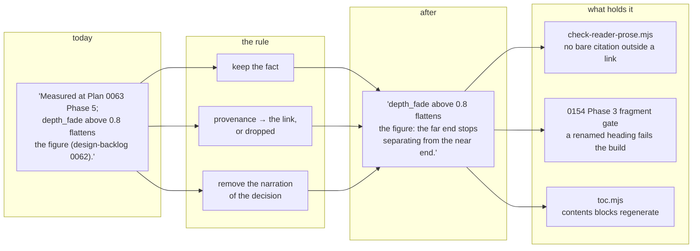

# 0155 — The reader documents stop explaining themselves

> **Status:** in-progress
> **Created:** 2026-09-05
> **Owner skill(s):** dev
> **Related ADRs:** [0168](../adrs/0168-the-reader-documents-address-a-reader-and-the-record-stays-a-link.md)
> **Hard dependency:** [0154](done/0154-the-site-becomes-navigable.md) **Phase 3.** This plan renames
> headings, and under [ADR-0166](../adrs/0166-a-published-document-splits-into-routes-by-size.md) a
> heading is a URL. `scripts/check-doc-links.mjs` deliberately never validates fragments, so today a
> renamed heading breaks every inbound anchor silently. 0154 Phase 3 turns that into a build
> failure. **Do not start this plan before that phase has landed.**
> **Lane guidance:** build on `main` directly. Every phase is markdown; no Rust compiles.

## TL;DR

Three documents a preset author lives in carry 235 bare references to plans and ADRs — *"Measured at
Plan 0063 Phase 5"*, *"ADR-0047's treatment"* — written for a skill session reconstructing why a
threshold exists, and read by someone who wants to know what a parameter does. This plan rewrites
that prose under one rule: keep the fact, demote the provenance to the link. The 109 citations that
are already links stay links; what goes is the clause built around them. A gate then holds the
result, so the five reader documents cannot silently drift back.

## Context & problem

The user's instruction was direct: a reader *"should understand how the application works, but not
why this or that decision were made."*

The citation convention that produced this prose is deliberate and good.
[ADR-0127](../adrs/0127-a-comment-carries-the-mechanism-and-the-decision-record-stays-in-docs.md)
requires code comments to cite by bare number so a claim can be traced to the measurement that
earned it, and `CLAUDE.md` extends the habit to documentation. It has worked — this corpus is
unusually free of assertions nobody can check. It also addresses the wrong audience in the documents
a user reads.

Measured 2026-09-05 against the tree at `9dc2183`:

| Document | Bytes | Citations | Already links | **Bare, in scope** |
|---|---:|---:|---:|---:|
| `presets/README.md` | 273,211 | 220 | 63 | **157** |
| `docs/presets.md` | 75,803 | 68 | 20 | **48** |
| `docs/preset-palettes.md` | 65,009 | 54 | 24 | **30** |
| `docs/preset-guide.md` | 18,215 | 2 | 2 | 0 |
| `docs/preset-tuning-walkthrough.md` | 18,079 | 0 | 0 | 0 |

Two of the five are already clean. That is the most useful fact here: the register being asked for
is not hypothetical, it is what the illustrated guide and the tuning walkthrough already do, and the
other three can be brought to it rather than invented.

The work is bounded by what these documents are *for*. They are what the `preset-author` lane is
pointed at instead of keeping a private catalogue
([ADR-0017](../adrs/0017-preset-author-skill-lane.md)) — the private copies rotted while these
stayed current. They cannot be thinned. And much of the provenance is what makes a number checkable:
*"measured at Plan 0063 Phase 5"* is the difference between a threshold a reader can trust and one
they take on faith.

## Decision

Rewrite the prose of the three documents that carry bare citations, under the rule recorded in
[ADR-0168](../adrs/0168-the-reader-documents-address-a-reader-and-the-record-stays-a-link.md):

> **Keep the fact. Demote the provenance to the link.**

A sentence states what the software does and what the number is. The plan or ADR that earned it
becomes a link on that sentence, or is dropped where the sentence stands on its own. What is removed
is the narration of the decision — which plan measured it, in which phase, what it superseded — not
the measurement.

```
before:  Measured at Plan 0063 Phase 5; `depth_fade` above 0.8 flattens the figure
         because the far end of the attractor stops separating (design-backlog 0062).

after:   `depth_fade` above 0.8 flattens the figure: the far end of the attractor stops
         separating from the near end.
```

We rejected a mechanical strip alone (it reaches 7 % of the corpus and leaves plan numbers
mid-sentence on every long page), marked rationale regions (they edit `docs/` to serve the site and
depend on authors remembering a convention forever), and a reader-facing copy per document (the
split-source hazard ADR-0154 exists to prevent).

**A note on the owner tag.** Every phase below is tagged `dev` because the plan vocabulary is `dev`
or `human` and nothing else. This is editorial work on documentation, which is closer to
`architect`'s territory than to `dev`'s, and closer still to `preset-author`'s for the roster. The
vocabulary has no way to say that. It is flagged here rather than worked around; if this recurs, the
tag vocabulary is what needs an ADR.

## Architecture diagram



## Implementation phases

### Phase 1 — the rule, on the smallest real case

- **Owner skill:** dev
- **What:** Rewrite `docs/preset-palettes.md` — 30 bare citations, 65,009 bytes. This is the phase
  where the rule is established in practice, so its result is the reference for the four that
  follow. Where a passage cannot be rewritten without losing a fact, keep the citation as a link and
  note the passage.
- **Files touched:** `docs/preset-palettes.md`.
- **Done when:** No `Plan NNNN` or `ADR-NNNN` appears in the file outside a markdown link. Every
  measurement, threshold and named parameter that was in the document before is still in it — this
  is a rewrite of framing, not a cut, and the file does not get materially shorter. `node
  scripts/toc.mjs` regenerates the contents block and `node scripts/check-doc-links.mjs` exits 0.

### Phase 2 — the expression language

- **Owner skill:** dev
- **What:** Rewrite `docs/presets.md` — 48 bare citations, 75,803 bytes. This is the grammar
  reference; the `preset-author` skill points at it as **the** expression-language authority, so
  every function, variable, constant, operator and error message it documents must survive intact.
- **Files touched:** `docs/presets.md`.
- **Done when:** No bare citation outside a link. The grammar surface is unchanged — the set of
  documented functions, variables and constants before and after is identical, checked by listing
  them from both versions rather than by reading.

### Phase 3 — the roster's own sections

- **Owner skill:** dev
- **What:** Rewrite the ten smaller `##` sections of `presets/README.md` — the skeleton, the
  representative flag, the expression language summary, the palette surface, and the `[smoothing]`,
  `[latch]`, `[occupancy]`, world-space, `[layer]` and starting-point sections. Together they are
  about 40 KB and they are where a reader arrives.
- **Files touched:** `presets/README.md`.
- **Done when:** No bare citation outside a link in those sections. Every parameter name, default and
  range is unchanged. The three large sections are deliberately untouched and are Phase 4.

### Phase 4 — the three sections that are most of the document

- **Owner skill:** dev
- **What:** Rewrite `## Systems and their named parameters` (109,093 B), `## Engine-wide controls`
  (63,013 B) and `## Structural config` (47,757 B). This is the bulk of the 157 and the bulk of the
  risk: these sections are reference tables wrapped in prose, and the tables are what the
  `preset-author` lane reads.
- **Files touched:** `presets/README.md`.
- **Done when:** No bare citation outside a link anywhere in the file. The parameter roster is
  complete — the set of named parameters documented before and after is identical, listed from both
  versions and compared, not eyeballed. Under 0154's split these sections are 32 routes; each still
  opens with something that tells a reader what the section is for.

### Phase 5 — the gate, and the sweep

- **Owner skill:** dev
- **What:** `scripts/check-reader-prose.mjs` asserts that no bare `Plan NNNN` / `ADR-NNNN` appears
  outside a markdown link in the five Entrance A documents. Wire it into `.githooks/pre-push` and
  CI's `links` job beside the other gates, add its seeded bite check under `scripts/fixtures/`, and
  update `CLAUDE.md`'s `scripts/` block, which states the gate count.
- **Files touched:** `scripts/check-reader-prose.mjs` (new), `scripts/fixtures/`,
  `.githooks/pre-push`, `.github/workflows/ci.yml`, `CLAUDE.md`.
- **Done when:** The gate exits 0 on the rewritten tree, and exits 1 naming file and line when a bare
  citation is introduced into any of the five — provoked in all three directions (a bare citation
  added, a linked citation left alone, a citation in an Entrance B document ignored) and the tree
  restored. `CLAUDE.md`'s gate count is correct. The `preset-author` skill's pointers into these
  three documents still describe what is there.

## Risks & open questions

- **A fact can leave with its provenance, and nothing catches it.** The gate checks that citations
  are gone; no gate can check that a rewrite is good. The per-phase done-whens are written to make
  the loss checkable where it is mechanical — parameter sets, grammar surfaces, thresholds compared
  before and after by listing rather than reading. Prose judgement is not covered and cannot be.
- **This is 414 KB of judgement in one `dev` session.** If it does not fit, stopping cleanly at a
  phase boundary is correct and expected; the phases are ordered so each is independently valuable
  and leaves the tree consistent.
- **Heading renames move URLs.** 0154 Phase 3 makes inbound breakage a build failure, which is the
  hard dependency in the header. External links and bookmarks are not covered by anything.
- **The `preset-author` lane reads these files while they change.** A session running against a
  half-rewritten roster sees a consistent document at every phase boundary but not mid-phase.
- **Two conventions will now coexist.** Entrance B and all code comments keep bare-number citation
  per ADR-0127; these five documents forbid it. The boundary is a filename list in a gate script,
  and someone will eventually be surprised by it.

## What this plan does NOT do

- **It does not touch Entrance B.** `docs/capturing.md`, `docs/nfr.md`,
  `docs/on-device-validation.md`, `docs/releasing.md`, the two specs and the technique catalogue keep
  their citations, because their readers are contributors for whom the working record is the point.
- **It does not shorten the documents.** Completeness is the property ADR-0154 named as worth
  keeping, and the `preset-author` lane depends on it. A materially shorter file is a defect here,
  not a success.
- **It does not remove the 109 citations that are already links.** A link is inert until clicked.
- **It does not change any code, default, parameter name or behaviour.** Nothing under `core/`,
  `standalone/`, `plugin-foobar/` or `presets/*.toml` is touched.
- **It does not touch the site.** All of that is [Plan 0154](done/0154-the-site-becomes-navigable.md).

## Implementation log

> Written by `dev` — one row per phase as that phase's commit lands, and the close block after the
> last one. **The phases above are the contract; everything here is what happened.**
> **Observations, never conclusions:** this says where to look, architect decides how it went.

**Lane:** `main` directly, no worktree.

| phase | owner | state | commit |
|---|---|---|---|
| 1 — the rule, on the smallest real case | dev | done | `3fdd391` |
| 2 — the expression language | dev | done | `2bce9be` |
| 3 — the roster's own sections | dev | done | committed with this row |
| 4 — the three sections that are most of the document | dev | | |
| 5 — the gate, and the sweep | dev | | |

### Notes

**P1 — two files outside the phase's `Files touched`.** Removing the trailing citation from
`## Dark on light — the two-tone route (ADR-0106, measured again at Plan 0091)` and
`## Flat colour on `shape_collage` — stay under the knee (ADR-0123, Plan 0113)` moves the source
slug those headings are addressed by, and two documents link to the old ones:
`docs/preset-guide.md:257` and `presets/README.md:4198`. The 0154 Phase 3 gate failed the site
build on both, naming file, link and unmatched slug. Both anchors were updated in this phase's
commit; no other content in either file was touched.

**P1 — counts.** 30 bare citations to 0. Links into `adrs/`/`plans/` went 24 -> 27: the
parentheticals on ADR-0138, ADR-0090 and ADR-0106 were carrying the only reference to those
records in their sections, so each was demoted to a link on the sentence rather than dropped.
65,009 -> 64,473 bytes (-0.8 %).

**P1 — what was compared, not read.** Every backtick-quoted identifier in the file before and
after: no loss and no gain. Every numeric literal with citations masked: three lost, all three
phase numbers inside removed provenance clauses (`Phase 4` once, `Phase 1` twice).

**P1 — one edit that is not a citation.** `LUT'''s` -> `LUT's`, a pre-existing typo at what is now
line 1058, in a passage this phase rewrites around.

**P1 — the phase's `toc.mjs` done-when is vacuous for this file.** `docs/preset-palettes.md`
carries no `toc:begin` block; the six that do are listed by the gate. It was run and reports the
repository's six blocks current.

**P1 — the commit also carried two link repairs that were not mine.** Another session committed
plan 0154's close (`9b48c22`) into this same working tree mid-phase, moving it to `plans/done/`.
Its repair of the two `0154` links in this plan's own header was in the working tree when Phase 1
committed and rode along in `3fdd391`. Nothing was lost; the phase commit is not file-clean of
that close. Every phase commit in this plan uses `git commit -- <paths>` rather than `git add`,
because that session's staged rename was sitting in the index.

**P2 — counts.** 48 bare citations to 0. 75,816 -> 73,881 bytes (-2.6 %).

**P2 — the grammar surface, listed from both versions rather than read.** Leading code cell of
every table row: 66 before, 66 after, no loss and no gain. Every `name(` call form: 20 before, 20
after, identical. Every backtick-quoted identifier in the file: no loss and no gain. The error
message blocks are unchanged.

**P2 — a deliberate fact loss, larger than the other phases'.** The downbeat-lock table published
both a superseded fold's numbers and the current ones as `old -> new` (`0.00 -> 2.36 %`,
`0.79 -> 3.67 %`, `4.16 -> 0.42 %`). The three current figures are kept; the three superseded ones
are gone, and the paragraph explaining techno's decline was rewritten to argue from
four-on-the-floor having no bar-scale accent rather than from the old fold's 4.16 %. Same class:
the `1280x720` fixed post grid and its 28 % stretch, and the per-system preset-count drift figures
(`11 against 6`, `5 against 3`, `5 against 6`). All describe behaviour that no longer exists.

**P3 — the front matter went with the ten sections.** Lines 1-129, above `## Skeleton`, are
inside no `##` section, so neither this phase's done-when nor its `What` reaches them; Phase 4's
"anywhere in the file" does. They carried 16 of the file's bare citations and they are the first
thing a reader sees, so they were rewritten here instead. The ten named sections are at 0, the
front matter is at 0, and the three Phase 4 sections still hold 100 (55 / 25 / 20).

**P3 — counts.** 41 bare citations to 0 across the ten sections plus the front matter.
273,174 -> 271,801 bytes (-0.5 %).

**P3 — two headings renamed, and one inbound anchor with them.**
`## Colour — the palette surface (Plan 0020)` and
`## The second layer — the `[layer]` table (ADR-0090 / Plan 0076)`. The only inbound link is
`presets/README.md:401`, same file, updated with them; `node scripts/toc.mjs` rewrote the
contents block for both rows.

**P3 — identifier diff, whole file.** Two lost, both deliberate: `00d99d0`, the commit SHA of a
retuning, and `17.37`, the `Rich` mean display luminance of the un-normalized attractor deposit.
The live pair it was measured against (`10.86` at `Rich`, `10.34` at `Floor`) is kept. Nothing
else in the file's backtick vocabulary moved. The same superseded-fold table Phase 2 trimmed in
`docs/presets.md` appears here too and was trimmed the same way.

### Close triggers

- **`presets/` touched:**
- **Plan header `Closes:`** none
- **What shipped:**
- **Operator docs touched:**
- **Backlog probes (`node scripts/check-backlog-claims.mjs`):**
- **Full suite:**
- **Outstanding `human` phases:**

## Followups (after this lands)

- The same treatment for `docs/capturing.md` if it turns out non-contributors read it — it is the
  largest Entrance B document at 165,028 bytes and its `shot` CLI section is genuinely user-facing.
- An ADR on the phase owner-tag vocabulary, if editorial work recurs often enough that tagging it
  `dev` keeps being wrong.
