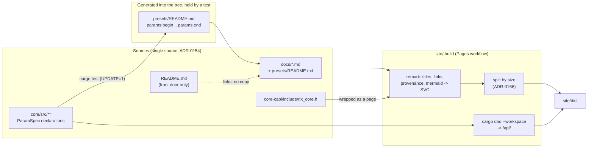

# 0156 — The site becomes the reference

> **Status:** in-progress
> **Created:** 2026-09-06
> **Owner skill(s):** dev, human
> **Related ADRs:** [0169](../adrs/0169-the-site-is-organised-by-reader-task-and-the-readme-stops-being-a-reference.md)
> (the menu, the README, rustdoc), [0170](../adrs/0170-a-parameters-reference-row-is-generated-from-the-declaration-the-engine-reads.md)
> (the generated parameter reference), [0171](../adrs/0171-a-diagram-is-mermaid-in-the-source-and-the-site-renders-it-at-build.md)
> (diagrams)
> **Closes:** design-backlog 0180 (Phase 6 makes that comment public-facing)
> **Coordinates with:** [0103](0103-the-project-gets-an-audience.md) — Phase 2 here moves the
> operator and developer sections out of `README.md`; 0103 Phase 2 keeps the README's opening and
> reorders a shorter file. [0140](0140-every-rate-integrates-for-real.md) and
> [0092](0092-the-engine-draws-an-authored-path.md) edit scene files that Phase 7 here also edits.
> **Lane guidance:** a worktree — `WORK/rlx-plan-0156` on `plan-0156-the-site-becomes-the-reference`
> — because Phases 2, 6 and 7 compile Rust and Phase 7 touches every scene file. The cost is a cold
> `target/` (ADR-0147 puts a lane at 8–18 GB) and the fact that **nothing deploys until the close
> fast-forwards `main`**: `.github/workflows/pages.yml` publishes on every push to `main`, so the
> README shortening, the menu regrouping and the new pages land on the live site together, which
> is what you want. Each phase still runs `npm run build` and both site gates locally.
> **A parallel lane is live** (`lmv-plan-0147`), so the close's `cargo release` may refuse on dirty
> files; the by-hand bump in the architect skill is the fallback, never `--allow-dirty`.

## TL;DR

The site is live, navigable and its preset documents address a reader. It still does not let a
reader understand the application's public API: three of the four public surfaces — the C ABI
header, the operator surface (hotkeys, flags, `config.toml`, OSC) and the Rust crate — have no page,
and the fourth, the preset format, has essays but no per-system reference of every parameter with
its default. There are no diagrams, page titles disagree with the menu, and the *Understand and
build it* group mixes a curious user's reading with the maintainer's process. This plan regroups the
menu by reader task, moves the operator reference out of the README into `docs/`, adds four
diagrams, a *How it works* page, an embedding guide, the published C ABI header and rustdoc,
rewrites the engine-side documents to a reader's register, and generates the parameter reference
from the engine's own declarations. The first visible result, after one phase, is a menu with a
group per task and a title on every page that matches its menu entry.

## Context & problem

The user's brief: *"easy to read, professional, clean, easy to navigate, comprehensive, contain
diagrams but not too much, have solid examples and be overall great piece of documentation for this
software, enabling users to understand ins and outs of public api."* At interview the user decided
that all four surfaces are in scope, that the site serves users, embedders **and** contributors,
that the parameter reference is generated from the core, that sources may be restructured, that the
work is one plan, and that the operator reference moves out of the README.

Measured on the live site at `567380d`, 2026-09-05:

| Criterion | Finding |
|---|---|
| Comprehensive | The operator surface (README lines 172–420) and the developer setup (545–614) are not on the site. The C ABI header is not published. rustdoc is built by CI and published nowhere. |
| Public API | No per-parameter reference: 24 `PARAMS` declarations, 33 hand-written parameter tables, 21 with a default column. No per-function C ABI page. No `config.toml` reference anywhere, on or off the site — its 21 mentions are scattered through the README. |
| Diagrams | Zero on the site. One in the corpus, in `README.md`. |
| Examples | Strong for presets (`minimal.toml`, the five walkthrough files, idioms in the grammar reference). None for a host across the C ABI. No complete `config.toml`. |
| Navigation | Titles come from each file's opening heading and disagree with the menu (*Preset authoring* under *Parameter roster*; *Spec — C ABI (foobar plugin seam)* under *C ABI contract*). Link text is a path (`../docs/presets.md`). Split-route labels are essay titles. The landing page's three cards sit in a two-column grid and stagger. |
| Register | Plan 0155 fixed the five preset documents. The other eight still address the repo's lanes: the roster's front matter cites *"architect's judgement at the next plan close"*, `nfr.md` opens on the 2026-07-21 interview, `on-device-validation.md` is a checkbox list that *"does not block plan closes"*, `releasing.md` describes the close ceremony, and the C ABI spec opens with a paragraph of reconciliation history. |

What is already right, and stays: the Starlight shell, search, the size-based split (ADR-0166),
the entrance and the install pages (ADR-0167), the gallery, and the five preset documents.

## Decision

Six menu groups by reader task; the operator reference and developer setup move from `README.md`
to `docs/`; four mermaid diagrams rendered at build; the C ABI header published verbatim and rustdoc
under `/api/`; the engine-side documents rewritten to a reader's register with `capturing.md` split
into its user half and its contributor half; and the parameter reference generated from `ParamSpec`
declarations in `core`. The rejected shapes are in the three ADRs: publishing the README instead of
moving its sections, a hand-restructured roster, client-side or committed diagrams.

## Architecture diagram



## Implementation phases

Each phase ships as its own commit. `dev` runs all phases in one session. Every phase that touches
`site/` ends with `npm run build`, `node scripts/check-site-links.mjs site/dist` and
`node scripts/check-site-routes.mjs site/dist` green; every phase that touches `docs/` ends with
`node scripts/check-doc-links.mjs`, `node scripts/toc.mjs --check` and
`node scripts/check-reader-prose.mjs` green. Those are the phase gates; the once-per-plan full suite
(ADR-0156) is owed at Phase 7.

### Phase 1 — The menu is organised by reader task

- **Owner skill:** dev
- **What:** The six groups of ADR-0169, page titles declared beside routes, link text rewritten from
  paths to titles, and the landing page's cards laid out for the number of cards there are.
- **Files touched:** `site/astro.config.mjs` (sidebar), `site/src/plugins/rewrite-links.mjs`
  (`PUBLISHED` entries become `{ route, title }`; a link whose text is the target's path gets the
  target's title when the target is published), `site/src/content.config.ts` (title from the map,
  falling back to the heading for a source that declares none), `site/src/plugins/split-document.mjs`
  (the group label is the declared title), `site/src/content/docs/index.mdx` and `site.css` (the
  cards), `scripts/check-site-links.mjs` (a fourth property: no site-relative link's text ends in
  `.md`), `site/README.md`.
- **Notes for the implementer:** pages the later phases add are not in the sidebar yet; the groups
  exist with the pages that exist today, regrouped. Existing routes keep their paths (ADR-0169). The
  off-site links keep path text on purpose — a GitHub blob URL's honest name is its path. The
  fourth site-links property has a seeded bite check under `scripts/fixtures/` like the other three.
- **Done when:** every page's `<title>` equals its sidebar label; no site-relative link in
  `site/dist` has text ending in `.md`, and the gate that says so goes red on the seeded fixture;
  the landing page's cards do not stagger at any width; `check-site-routes.mjs` is green (every
  route reachable from the menu).

### Phase 2 — The operator surface has a reference, and the README stops being one

- **Owner skill:** dev
- **What:** Two new reader documents built from the README's operator sections, one from its
  developer section, the README shortened to a front door, and a test that holds the configuration
  reference to the flag roster and the config schema.
- **Files touched:** new `docs/running.md` (controls, the browser and settings menus, the operator
  console, now playing, quality tiers, displays — README §Controls through §Now playing, moved),
  new `docs/configuration.md` (every flag with what it is for and its precedence; `RLX_PRESET_DIR`
  and `RLX_TIER`; every `config.toml` section and key with its default, and one complete example
  file; the OSC address table — README §Flags & environment, moved and reshaped into reference
  tables), new `docs/developing.md` (README §Developer setup, moved; §Visual QA becomes a pointer
  at `docs/testing.md`, which Phase 4 creates), `README.md` (keeps the pitch, the gallery row, the
  download, a short controls table, design principles, platform notes, license; every moved section
  becomes one sentence and a link to the site), `standalone/tests/` (a new test, GPU-free, that
  every `FLAGS` name and every `config.toml` section and key named by `Config`'s serde shape
  appears in `docs/configuration.md` in backticks — the third-copy pattern of
  `every_declared_param_is_documented_in_the_presets_readme`), `site/src/plugins/rewrite-links.mjs`
  and `site/astro.config.mjs` (three pages join *Use it* and *Contribute*),
  `scripts/check-reader-prose.mjs` (the two reader documents join its list),
  `docs/on-device-validation.md` (its OSC re-point section links the address table rather than
  repeating it, if it does).
- **Notes for the implementer:** move wording, do not rewrite it — Plan 0103 Phase 2's note that
  *"everything below Architecture is already strong"* is honoured by the move. The reshaping is
  from bullet prose into tables where a reference wants a table (flag / value / default / what it
  is for; section / key / default / meaning), with the prose kept under the table for the flags
  whose behaviour needs a paragraph (`--gpu`, `--device`, `--osc`). The architecture diagram and
  §Architecture stay in the README for now; Phase 3 moves them. `README.md`'s Controls table is the
  one operator fact the README keeps, because a stranger on GitHub should learn `Space` without
  leaving. Plan 0103 Phase 2 is not run here; note in its `Coordinates with` line that the file it
  reorders is now shorter.
- **Done when:** `docs/configuration.md` names every flag `ritmolux --help` prints and every
  `config.toml` key `Config` serialises, and the new test fails when one is removed from the
  document; a complete `config.toml` with every key at its default is in the document and parses
  (the test round-trips it through `Config`); `README.md` carries no flag description, no OSC
  address and no `config.toml` key beyond the controls table; both pages are in the menu;
  `check-reader-prose.mjs` covers them and is green.

### Phase 3 — The site renders diagrams, and *How it works* exists

- **Owner skill:** dev
- **What:** `rehype-mermaid` in the site build with a headless Chromium in the Pages workflow, a new
  *How it works* document carrying the architecture diagram (moved from the README) and the frame
  diagram, and the preset-lifecycle diagram in the grammar reference.
- **Files touched:** `site/package.json` / `package-lock.json` (`rehype-mermaid` and `playwright`,
  pinned exactly), `site/astro.config.mjs` (the plugin, `img-svg` strategy with light and dark
  renderings, the theme colours set from the site's accent), `.github/workflows/pages.yml`
  (`npx playwright install --with-deps chromium`, cached), `site/README.md` (the one-time local
  install), new `docs/how-it-works.md` (the two frontends and the core; the architecture
  flowchart; what happens each frame — capture, the ring, the analysis chain and what each variable
  physically is, normalization, the beat and bar clock, expression evaluation, the scene, the
  composite chain `background → scene → trails → kaleidoscope → transition → ink → present`;
  quality tiers; determinism — written for a reader, sourced from `nfr.md`, `presets.md`,
  the roster's engine-wide essays, `specs/0002` and the technique catalogue, and linking to each
  rather than repeating their tables), `README.md` (§Architecture becomes a paragraph and a link),
  `docs/presets.md` (a `stateDiagram-v2` of a preset's life under *Where preset files live*:
  seeded → edited → parsed → compiled → installed; rejected with the last good set kept;
  hot-reload; dissolve on switch), `site/src/plugins/rewrite-links.mjs` and `site/astro.config.mjs`
  (*How it works* joins its group).
- **Notes for the implementer:** four diagrams total across the plan — the two here, the one in
  `presets.md`, the sequence in Phase 5. A diagram over about twelve nodes is two diagrams
  (ADR-0171). Keep `how-it-works.md` under the split threshold if you can, so it reads as one page;
  it is an explanation, not a reference. The frame diagram's boundary subgraphs are the shells,
  the ring, the analyzer, the preset engine and the renderer — that is the seam every other page
  refers to. Register: `check-reader-prose.mjs` covers the new file.
- **Done when:** a mermaid fence in any published document renders on the site as an inline SVG
  inside a `<picture>` with a dark and a light rendering, with no script tag added to the page; the
  same fence renders on GitHub; a fence with a syntax error fails `npm run build`; the Pages
  workflow's `build` job passes with the browser install cached on the second run;
  `README.md` has no mermaid fence and links *How it works*; the three diagrams named here exist.

### Phase 4 — The engine-side documents address a reader, and `capturing.md` splits

- **Owner skill:** dev
- **What:** Plan 0155's rule — keep the fact, demote the provenance to the link — applied to the
  documents that plan left out, the roster's front matter included; `capturing.md` split into the
  half a preset author uses and the half a contributor uses; the reader-prose gate extended to the
  whole published set.
- **Files touched:** `docs/nfr.md` (opens on what the application is held to, not on the
  interview; the section names stay so its 12 inbound anchors resolve), `docs/specs/0001-c-abi.md`
  and `docs/specs/0002-ring-determinism.md` (the header block becomes *what this is, where it
  lives, which ADRs govern it* in three lines; the invariants and scenarios keep their wording;
  the reconciliation history moves to a closing *Provenance* section), `docs/specs/README.md`
  (unpublished; its stale `core/include/rlx_core.h` and `core/src/ffi.rs` paths corrected while
  here), `presets/README.md` (the front matter: hot-reload, the floor tier and the attractor
  deposit stay as reader facts; the gate roster and the *"architect's judgement at the next plan
  close"* sentence go to `docs/testing.md`), `docs/capturing.md` (keeps *Captures pin the floor
  tier*, *The `shot` CLI*, `--render`, `--stream`, and the *Examples*), new `docs/testing.md`
  (*The `core/tests/` harness* and its subsections, *The habit for a new scene*, `--downbeat-log`),
  new `docs/milkdrop-conversion.md` (the `milkconv` section), `docs/releasing.md` and
  `docs/on-device-validation.md` (a two-sentence reader opening each — what this is and who runs it
  — and no other change; they are contributor pages and say so), `docs/generative-techniques-catalogue.md`
  and `docs/diffusion-filter.md` (opening paragraphs only), every file linking a moved heading
  (`check-doc-links.mjs` and the Phase 3 fragment gate of Plan 0154 name them),
  `scripts/check-reader-prose.mjs` (its list becomes the whole `PUBLISHED` set minus the three
  install pages and the contributor group, and a comment says why those are out),
  `scripts/toc.mjs` (a new document over ADR-0163's length carries a block), `site/` (the two new
  pages join *Contribute*).
- **Notes for the implementer:** this is the phase with the most inbound anchors to re-point;
  ADR-0166's fragment map turns each miss into a build failure, so run `npm run build` early and
  often. Move whole sections verbatim when splitting `capturing.md`; the rewrite is the openings
  and the woven citations, not the bodies. The contributor pages are *not* rewritten to hide that
  they are process — a reader in *Contribute* wants the process. What changes is that each opens by
  saying what it is.
- **Done when:** `check-reader-prose.mjs` covers every published reader document and is green; no
  page outside *Contribute* opens with a plan, an ADR, an interview or a reconciliation date;
  `capturing.md` is under half its 2026-09-05 size and every fragment link into it or into the two
  new documents resolves (the build proves it); `toc.mjs --check` is green; the specs README's paths
  name files that exist.

### Phase 5 — The embedding surface

- **Owner skill:** dev
- **What:** An embedding guide with a host example and the lifecycle sequence diagram, and the C ABI
  header published verbatim as a page.
- **Files touched:** new `docs/embedding.md` (what the ABI is and what links it; the two threads and
  the contract between them; the lifecycle — version handshake, `rlx_create`, `rlx_attach_window`,
  `rlx_load_presets`, `rlx_push_samples` on the audio thread, `rlx_render_dt` on the UI thread,
  `rlx_resize`, `rlx_free` — as a `sequenceDiagram`; a minimal C host of about forty lines, labelled
  illustrative, that follows that order and checks the version the way the shim does; the roster
  and selection calls; metrics; error codes and what each means to a host; *what the real host
  does* — `plugin-foobar/viz_session.cpp` cited as the working example; the size series and the
  size cap linked, not repeated), `site/src/content.config.ts` and `site/src/plugins/rewrite-links.mjs`
  (`core-cabi/include/rlx_core.h` joins `PUBLISHED` with a loader that wraps a non-markdown source
  in a fenced code block under the declared title, so the page is the header at the build's
  commit), `site/astro.config.mjs` (*Embed it*: the guide, the header, the two contracts),
  `docs/specs/0001-c-abi.md` (links the guide and the header page; the function roster sentence
  in its invariants is the authority and stays), `scripts/check-site-routes.mjs` (the header route
  is a route like any other).
- **Notes for the implementer:** the C example is illustrative and is not compiled by CI — say so
  above it, and keep it to the calls the header documents. The one property it must have is that
  every call it makes is in the header and in the order the spec's scenarios require (attach before
  render, load before select). The header page is *the* per-function reference; do not write a
  second one. `CLAUDE.md`'s rule that the function roster is never restated outside the spec holds
  here: the guide names the calls it walks through and never says how many there are.
- **Done when:** the header page shows `core-cabi/include/rlx_core.h` byte-for-byte inside a code
  block, titled from `PUBLISHED`; the sequence diagram renders; every function the example calls
  exists in the header (a test in `core-cabi/tests/` greps the example's calls against the header,
  the same way `every_declared_param_is_documented` greps the roster); the guide is in
  `check-reader-prose.mjs`'s list and green.

### Phase 6 — rustdoc joins the Pages artifact

- **Owner skill:** dev
- **What:** A `rustdoc` job in the Pages workflow whose output lands at `/api/` in the deployed
  site, linked from *Embed it*; backlog 0180's stale doc comment corrected because it is about to be
  public.
- **Files touched:** `.github/workflows/pages.yml` (a job running `cargo doc --workspace --no-deps`
  under `RUSTDOCFLAGS=-D warnings` with `Swatinem/rust-cache`, uploading `target/doc` as an
  artifact; the `build` job downloads it into `site/dist/api/` before `upload-pages-artifact`),
  `site/astro.config.mjs` (*Embed it* gains *Rust API* as a link to `/api/rlx_core/`, base-aware),
  `scripts/check-site-links.mjs` (an href under `/api/` is checked for existence like any other
  site-relative href, so a renamed crate breaks the gate rather than the reader),
  `core/src/diag/mod.rs` (backlog 0180: the path corrected, the version stated by reference to the
  constant rather than as a number), `docs/design-backlog.md` (the entry's `CLOSED` marker; the
  archive move is the close's), `site/README.md`.
- **Notes for the implementer:** **try `ubuntu-latest` first and measure**; if `cargo doc
  --workspace` fails there, the fallback is the same job on `windows-latest` handing the artifact
  across, and the plan's log says which and why. Do not add the site build to `ci.yml`; the Pages
  workflow is the site's CI. `cargo doc` is already the one CI gate no local step mirrors
  (backlog 0179) — this phase does not change that and does not claim to.
- **Done when:** the deployed site serves `/api/rlx_core/index.html` and `/api/rlx_core_cabi/index.html`
  built from the same commit the footer stamp names; `check-site-links.mjs` fails on a `/api/` href
  that resolves to nothing (seeded fixture); backlog 0180's probe reads the corrected comment.

### Phase 7 — The parameter reference is generated from the engine

- **Owner skill:** dev
- **What:** ADR-0170. `ParamSpec` declarations replace the bare `PARAMS` name lists in every scene
  and engine stage, scenes read their defaults from the spec, a test generates and holds the
  per-system tables in `presets/README.md`, and the site publishes them.
- **Files touched:** `core/src/render/scenes/mod.rs` or `common.rs` (`ParamSpec { name, default,
  range: Option<[f32; 2]>, doc: &'static str }` and the helpers that compose a system's roster from
  its own specs plus the shared blocks — the composition `set_param` already performs), every file
  declaring `PARAMS` today (the 24 on the tree at `567380d`: the scenes, `background`, `bloom`,
  `feedback`, `ink`, `kaleidoscope`, `post`, `tonemap`, `trails`, `marks`, `warp_mesh`'s three
  lists), each scene's `reset_params` / `Default` (the default comes *from* the spec, so there is
  one copy), `core/src/preset/schema/system.rs` (`GLOBAL_PARAMS` composed from the specs rather than
  listed), `core/tests/preset.rs` (`declared_params_match_set_param` keeps guarding names;
  `every_declared_param_is_documented_in_the_presets_readme` is replaced by
  `every_param_spec_has_a_doc_line` and by `the_parameter_reference_block_is_current`, which
  rewrites the block under `RLX_UPDATE_PARAM_REFERENCE=1` and otherwise asserts equality — the
  `toc.mjs --check` shape), `presets/README.md` (the one-row-per-system table under *Systems and
  their named parameters* becomes the generated block: one table per system — name, default, the
  range that reads, what it does — plus one table for the engine-wide stages; the paragraphs and
  essays around it stay), `scripts/check-reader-prose.mjs` (the generated block is prose too),
  `docs/preset-guide.md` and `docs/presets.md` (their pointers at the roster say *reference* where
  they said *tables*).
- **Notes for the implementer:** about two hundred doc lines, each one sentence, each the
  *definition* — the essays below stay the discussion (ADR-0170). Write them from the essays and
  the code, in the register `check-reader-prose.mjs` gates. A range is the range that *reads*, as
  the existing tables put it, and `None` where the parameter is unbounded or world-space; do not
  invent a bound. A parameter whose meaning depends on the family (the attractor's `a b c d`) says
  so in its line and points at the essay. This phase touches every scene file; merge `main` into
  the lane before starting it, and again before the close, because Plans 0140 and 0092 may have
  moved. The full suite (`cargo nextest run --workspace`, not `-P fast`) runs at the end of this
  phase — it is the plan's last code phase and ADR-0156's once-per-plan run.
- **Done when:** every `ParamSpec` has a non-empty doc line (test); every scene's applied default
  equals its spec's default (a test constructs each scene, calls `reset_params`, and compares the
  values `set_param` would read — or, where a scene cannot be constructed without a device, the
  test reads the constant the scene's `Default` names); the generated block matches the
  declarations (test), and a hand edit inside the markers fails it; the site shows one table per
  system with those four columns; no essay in the roster states a default that differs from its
  table (a grep over `default \`` in the essays against the block, reported by the test as a list
  rather than asserted, since the essays are prose); the full suite is green.

### Phase 8 — The live walk

- **Owner skill:** human
- **What:** After the close fast-forwards `main` and Pages deploys: open the live site and walk
  each of the six groups on a desktop and on a phone, in both themes, and read the four diagrams on
  the dark theme.
- **Done when:** every group's first page reads as a page a stranger could start from; the
  diagrams are legible on dark; `/api/rlx_core/` serves; the header page matches the header at the
  stamped commit; anything that does not is a design-backlog entry with a probe, not a fix in this
  plan.

## Data shapes

```rust
// illustrative — not the final interface (Phase 7)
pub struct ParamSpec {
    pub name: &'static str,
    /// The value `reset_params` applies, and the one the reference table prints.
    pub default: f32,
    /// The range that reads, for the table. `None` when the parameter is
    /// unbounded or world-space (the frame is the bound).
    pub range: Option<[f32; 2]>,
    /// One sentence: what the parameter does. The definition; the roster's
    /// essay is the discussion.
    pub doc: &'static str,
}

pub const PARAMS: &[ParamSpec] = &[
    ParamSpec { name: "warp", default: 0.55, range: Some([0.0, 1.5]),
                doc: "Amplitude of the domain fold; 0 flattens the field." },
    // ...
];
```

```js
// illustrative — PUBLISHED after Phase 1
'docs/presets.md': { route: 'guide/expression-language', title: 'Expression language' },
'core-cabi/include/rlx_core.h': { route: 'embed/c-abi-header', title: 'The C ABI header', wrap: 'c' },
```

## Risks & open questions

- **`cargo doc --workspace` on `ubuntu-latest` is unverified.** Phase 6 tries it and falls back to
  `windows-latest`. Either way the job is on the Pages critical path; if the cold time is
  unacceptable, the fallback is a separate workflow that publishes rustdoc less often, and that is
  a plan amendment rather than a silent narrowing.
- **The headless Chromium in the Pages workflow.** A Playwright version bump can change the browser
  it wants; the install step is pinned with the package. If the install flakes, the diagrams are
  the only thing lost, and the build should fail loudly rather than render a blank — ADR-0171's
  choice is that a broken diagram is a broken build.
- **Two hundred doc lines are a lot of small judgements**, and the register gate reads them. The
  risk is a line that restates a name (*"the warp"*) rather than defining it. The Mode 4 review
  reads a sample per system.
- **Defaults read from the spec changes a scene's `Default` impl in every scene.** No visual moves
  if the numbers are the same, and the golden suite is what proves it — which is why the full
  suite runs at Phase 7 and not earlier.
- **The README move and Plan 0103.** If 0103 Phase 2 runs first, its reorder and this plan's move
  conflict in `README.md`. Whichever runs second merges; the sections moved here are whole, so the
  conflict is mechanical.
- **`check-reader-prose.mjs`'s list grows from five files to most of the published set.** A
  contributor page is deliberately outside it. If a reader page needs a bare citation the gate
  refuses, the answer is a link, not an exemption.
- **Route stability.** Existing routes keep their paths; new pages get `use/`, `embed/`,
  `contribute/`. The prefix inconsistency is accepted (ADR-0169).

## What this plan does NOT do

- **It does not version the documentation per release.** The site tracks `main` (ADR-0154), and
  rustdoc under `/api/` tracks it the same way.
- **It does not compile the embedding guide's C example in CI.** The foobar shim is the compiled
  host; the example is illustrative and a test holds its calls to the header.
- **It does not restructure the roster's essays**, and it does not touch the structural tables
  (`[curve]`, `[generator]`, `[particles]`, `[spectrum]`); they stay hand-written.
- **It does not run Plan 0103 Phase 2.** The README gets shorter here; what it leads with stays
  that plan's.
- **It does not add a fifth diagram**, a search-engine sitemap, analytics, or a domain.
- **It does not publish the ADRs, the plans or the backlog.** Decided at Plan 0154's interview and
  unchanged.

## Implementation log

> Written by `dev` — one row per phase as that phase's commit lands, and the close block after the
> last one. **The phases above are the contract; everything here is what happened.**
> **Observations, never conclusions:** this says where to look, architect decides how it went.
> No per-criterion pass list, no self-assessment, no narrative — but a deviation from the plan or
> an unmet done-when is always disclosed. Stays shorter than `## Implementation phases` above.

**Lane:** `WORK/rlx-plan-0156` on `plan-0156-the-site-becomes-the-reference`.

| phase | owner | state | commit |
|---|---|---|---|
| 1 — The menu is organised by reader task | dev | done | 7f2b0b9 |
| 2 — The operator surface has a reference | dev | done | 786d687 |
| 3 — The site renders diagrams, and How it works exists | dev | done | d2f2d24 |
| 4 — The engine-side documents address a reader | dev | done | 5227878 |
| 5 — The embedding surface | dev | done | 24ce616 |
| 6 — rustdoc joins the Pages artifact | dev | done | 070c549 |
| 7 — The parameter reference is generated from the engine | dev | done | 9db1f67 |
| 8 — The live walk | human | not started | |

### Notes

- **Phase 1 edited one file outside its `Files touched` list:** `docs/preset-palettes.md`, one
  link's text, `the full section in `presets/README.md`` → `the full section in the parameter
  roster`. The new gate reads rendered link text, and that link's text ends in `.md` while not
  being a path the rewriter may rename — the plan's rule is "a link whose text *is* the target's
  path", and this one is a sentence containing a path.
- The rewriter also unwraps `strong`/`emphasis` around a path, for
  `[**`docs/preset-tuning-walkthrough.md`**](…)` in `docs/preset-guide.md`.
- **Phase 2 moved `standalone/src/config.rs` from the binary crate into the lib** (`lib.rs` declares
  it, eight modules now say `standalone::config`). The phase's own done-when requires the test to
  round-trip the documented `config.toml` **through `Config`**, and a `mod` in a `[[bin]]` is not
  reachable from `standalone/tests/`. No behaviour changes; the move is the one `lib.rs` already
  makes for `osc` and `shot`.
- **Phase 2 edited four files outside its list**, each one a break it caused:
  `standalone/src/cli.rs` (the `--help` footer said `README.md says what each one is for`, which
  stopped being true), `docs/design-backlog.md` (entry 0163's probe searched `README.md` for an OSC
  address that had moved — `check-backlog-claims.mjs` went red), `docs/plans/0103-…` (its
  `Coordinates with` line, as this plan's Phase 2 note asks), and two new fixture files under
  `scripts/fixtures/reader-prose/` (the gate reports a listed document that does not exist, so
  growing its list means growing the fixture).
- The flag half of the new test reads `ritmolux --help` rather than `FLAGS`, which is `pub(crate)`
  in the binary. That is the roster's own stated authority, so the test reads it as a guard would.
- **Phase 3's done-when "a fence with a syntax error fails `npm run build`" did not hold, and does
  not hold by itself.** Astro's content layer renders each entry inside a try and stores an entry
  whose chain threw WITHOUT its html: the page builds with a title, a menu entry and an empty body,
  and the build exits 0. `site/astro.config.mjs` gains an `astro:build:done` hook that fails on any
  empty page, and both failure classes were then confirmed red — a broken fence and a link to a
  file that does not exist.
- **That hook found a page Phase 2 had already shipped empty:** `docs/configuration.md` carried
  `capturing.md#the-live-video-out-rlx---stream`, moved verbatim out of `README.md`, and the real
  slug is `…-ritmolux---stream`. `check-doc-links.mjs` does not validate fragments, and the README
  is unpublished, so that link had been stale in the README with nothing able to see it.
- **The diagrams follow `prefers-color-scheme`, not the site's theme toggle.** ADR-0171's
  `<picture>` is a media query, and Starlight's toggle sets `data-theme` on the root, which a
  `<source>` cannot read. A reader on a light OS who toggles the site to dark gets the light
  rendering. Phase 8 walks both themes.
- The forward link from `docs/how-it-works.md` to `docs/embedding.md` is not written: Phase 5
  creates that file, and a link to a file that does not exist is now a red build.
- **Phase 4's `capturing.md` size done-when is NOT met.** Moving exactly what the phase names —
  the harness, the habit, `--downbeat-log` and `milkconv` — takes it from 165,028 B to 91,080 B, a
  45 % cut against the "under half" the phase asks for. The gap is one section: *What the report's
  columns mean* is 26,928 B and is preset-author reference the tuning walkthrough links into three
  times, so it stays. The section list was implemented as written; the byte figure was not reached.
- Phase 4's register pass converted **168 bare citations** across five documents to links, by
  script, resolving each number against the actual ADR or plan filename. The four plural forms
  (`Plans 0105, 0099 and 0102`) were done by hand so every number is linked, not just the first.
- **Phase 4 edited eight files outside its list**, all naming content that moved:
  `CLAUDE.md` and `README.md` (their `docs/` maps), `.claude/skills/architect/SKILL.md` and
  `.claude/skills/preset-author/SKILL.md` (both routed a lane to `docs/capturing.md` for the gate
  table), `core/tests/reactivity.rs` (same), `docs/design-backlog.md` (entry 0109's probe searched
  `docs/capturing.md` for the corpus ranking), and two new fixture files.
- **A stray figure from Phase 3 tripped `check-filter-figures.mjs`** and was removed here: the
  Chromium download size, written into `site/README.md` and the Pages workflow. That gate is not in
  this plan's per-phase list and was not run at Phase 3.
- **`docs/capturing.md` was the reader-prose fixture's out-of-scope case and is now in scope.**
  `docs/releasing.md` takes that role; the fixture's expected shape moves from six breaks across
  three files to ten across four.
- Phase 5's `wrap` entry needed a **third loader** beside the glob loader and the splitter: the glob
  loader hands a file to the markdown parser, and a `.h` is not markdown. `splitSources` and
  `check-site-routes.mjs` both exclude a wrapped source explicitly — it is one fenced block with no
  `##` to cut at, and the route ceiling asserts a property of the splitter's output.
- The header page was verified byte-for-byte by decoding the built code block's own line structure
  back to text and comparing it to `core-cabi/include/rlx_core.h`: 213 lines, equal.
- **The plan's Phase 6 done-when names `/api/rlx_core_cabi/`; the crate emits `/api/rlx_core_c/`.**
  `core-cabi/Cargo.toml` sets `[lib] name = "rlx_core_c"` deliberately — `rlx_core` collides with the
  crate under test in `tests/ffi.rs` — and rustdoc uses the lib name. The menu links
  `/api/rlx_core/`, which the plan also names, and the C ABI's own reference is the published
  header rather than its rustdoc.
- **`cargo doc --workspace --no-deps` under `-D warnings` is verified on Windows only.** It is green
  here in 7.6 s warm and emits `rlx_core`, `rlx_core_c`, `rlx_ring`, `standalone`, `ritmolux` and
  `milkconv` (26 MB, no root `index.html` — rustdoc emits one only for a single crate, which is why
  the menu points at a crate rather than at `/api/`). **The `ubuntu-latest` arm the workflow uses is
  unverified until the first push**, as the plan's Risks anticipate.
- **The gate had to learn two things the plan did not name.** `dist/api/` is absent on any machine
  that has not run `cargo doc`, so an unconditional check would leave the local gate permanently
  red: an absent tree now skips `/api/` hrefs and says so, and the workflow passes `--require-api`,
  which makes the absence a failure there. And the rustdoc's **own** pages are excluded from the
  scan — they are another tool's generated output, and including them produced about a thousand
  findings against a perfectly good rustdoc, mostly its script templates (`href="./static.files/${f}"`).
- Starlight prefixes the configured base onto a sidebar `link` itself, so the menu entry is
  `/api/rlx_core/` and not `${BASE}api/rlx_core/`; spelling the base produced `/ritmolux/ritmolux/api/`.
- Backlog 0180's `present:` probe was inverted to `absent:`, since the fix is the disappearance of
  the claim. The entry carries its `CLOSED` line in the body rather than in its heading, which is
  where this file's other closed entries carry it, and which keeps the heading's slug stable.
- **`ParamSpec` counts.** 26 rosters converted, **341 rows** across **19 tables** (12 systems, 7
  engine stages), **180 distinct parameters**. 31 rows carry no range: `pan_x`/`pan_y`, the
  attractor's `a b c d` and `tuple`, `baseline`, `source_y`, `seed`, `angle_bias` — unbounded or
  world-space, where the frame is the bound.
- **`default_of` is a `const fn`, so a default resolves at compile time.** 150 `DEFAULT_*` constants
  are now `default_of(PARAMS, "name")` reads of a literal that lives on the spec; the other 50 name
  a parameter the roster provides through a **shared** spec parameterised on that constant
  (`common::hue(DEFAULT_HUE)`), where the constant is already the only copy. Either way the number
  exists once. A constant naming a parameter no spec declares is a **compile error**, because a
  const-eval panic is one.
- The shared blocks declare their specs once and scenes splice them **by value**: `scenes::common`
  for the colour and framing names, `scenes::lines` for the stroke ones, `scenes::marks` for the
  five shaped-mark names. `ParamSpec` gained `Copy` for that and `PartialEq` for `post.rs`'s
  `STAGE_PARAMS` assertion — which had to move from pointer identity to value equality, because a
  `const` is inlined at every use site and two references to one roster are two allocations.
- **`every_param_spec_has_a_doc_line` caught two of my own lines** on its first run (`attractor.c`
  and `.d` at three words); both were rewritten rather than exempted.
- **The generated block split itself into one route per system.** ADR-0166's size rule saw the new
  `###` headings and cut them, so the site now serves `system-fragment_field`,
  `engine-stage-ink` and seventeen more, each with its own table — which is this plan's own
  Followups list, arriving without being asked for.
- `essays_that_state_a_default_are_reported` is a **report, not an assertion**: it prints the 92
  essay lines below the block that mention a default, and never fails. Whether an essay contradicts
  its table is prose against prose, which a test cannot judge and a review can.
- The plan's Phase 7 file list does not name `milkconv/src/convert.rs`, `CLAUDE.md` or
  `.claude/skills/preset-author/SKILL.md`; all three were edited, the first because it does a
  membership test against `warp_mesh::PARAMS`, the other two because they describe the roster as a
  set of hand-written tables.
- **The site's content-collection cache hides a plugin edit.** A split document's chunks are stored
  under a digest of the chunk body, so a change to the *rewriter* re-renders nothing. `rm -rf
  site/.astro` before believing a build that a plugin edit should have changed.

- **Repair after the Mode 4 review, on the merged tip.** `spectrum`'s `curve` spec stated
  `default: 0.0`, `range: [-1.0, 1.0]` and a doc line describing a bipolar bend, over an engine
  that applies `DEFAULT_CURVE = 1.0` and runs `level.powf(curve.clamp(0.05, 4.0))` - ADR-0040's
  exponent, where `1.0` is the identity. The spec now states `1.0` and `[CURVE_MIN, CURVE_MAX]`,
  its doc line names the exponent, and `DEFAULT_CURVE` reads `default_of(PARAMS, "curve")`. It was
  the **only** constant in the tree that never adopted that read, so the const-eval single-copy
  property did not reach it and no render, golden or behavioural gate could: the engine was right
  and only the published row was wrong. `DEFAULT_ROTATION` in the same file was the same
  two-literal shape - agreeing, so latent - and was converted with it. The block was regenerated;
  one row changed.
- **`a_parameter_default_is_declared_once` is Phase 7's unimplemented done-when**, the one asking
  that every scene's applied default equal its spec's. A source scan over `core/src/render/`: 128
  spec/constant pairs, and a pair passes only when one side derives from the other - the constant
  reads the roster, or the roster reads the constant. Two literals side by side is the finding
  whether or not they agree today, which a value comparison could not have said. Confirmed red on
  the original `curve` declaration before the fix went back in. It skips the shared blocks' `default`
  field shorthand, where the spec states no literal and the one copy lives at the call site.

### Close triggers

- **`presets/` touched:** yes — `presets/README.md` only (Phase 4's front matter, Phase 7's
  generated block and the contents block above it). **No `.toml` changed**; the shipped set is the
  same 82 files.
- **Plan header `Closes:`** design-backlog 0180, marked `CLOSED 2026-09-06` in the entry body at
  Phase 6. Its `present:` probe was inverted to `absent:`, since the fix is the disappearance of
  the claim. The archive move is the close's.
- **What shipped:** feature. Two engine-visible changes — `ParamSpec` replaces every bare `PARAMS`
  roster and `standalone/src/config.rs` moves from the binary crate into the lib — plus a new C ABI
  test binary, a new `standalone` test binary, and the site's own build gaining `rehype-mermaid`,
  a rustdoc job, an empty-page guard and a wrapped-source loader. No preset content moved and no
  golden moved.
- **Operator docs touched:** `README.md`, `presets/README.md`, `docs/presets.md`,
  `docs/preset-guide.md`, `docs/preset-palettes.md`, `docs/preset-tuning-walkthrough.md`,
  `docs/capturing.md`, `docs/nfr.md`, `docs/on-device-validation.md`, `docs/releasing.md`,
  `docs/diffusion-filter.md`, `docs/generative-techniques-catalogue.md`, and six new files —
  `docs/running.md`, `docs/configuration.md`, `docs/developing.md`, `docs/how-it-works.md`,
  `docs/testing.md`, `docs/milkdrop-conversion.md`, `docs/embedding.md`. Both specs and
  `docs/specs/README.md` also moved.
- **Backlog probes (`node scripts/check-backlog-claims.mjs`):** exit 0 — 109 stated reductions hold
  across all 46 live entries, 8 unprobeable. Two probes were re-pointed by this plan's own moves:
  entry 0163's (the OSC table left `README.md`) and entry 0109's (the corpus ranking left
  `docs/capturing.md`).
- **Full suite:** `cargo nextest run --workspace`, exit 0 — **1546 tests run: 1546 passed
  (21 slow), 5 skipped**, 542.6 s. Run at the end of Phase 7, before this block. No suite was run
  under an upward override at an earlier phase; every earlier phase ran `-P fast` (1323 → 1326
  tests, 223 skipped) and the site and doc gates. **Re-run after the `main` merge and the two
  review repairs above: exit 0 - 1556 tests run: 1556 passed (10 slow), 5 skipped**, 475.2 s,
  alongside `fmt`, `clippy --workspace --all-targets`, a clean `npm run build` and the nine Node
  gates.
- **Outstanding `human` phases:** Phase 8, the live walk. It needs the close to fast-forward `main`
  and Pages to deploy; nothing in phases 1–7 is verifiable on a laptop that is not already verified
  by a gate here, except the two things that phase exists for — the diagrams on a dark theme and
  `/api/` serving.
- **Unverified until the first push:** the Pages workflow's `rustdoc` job has never run.
  `cargo doc --workspace --no-deps` under `-D warnings` is green on Windows here; the
  `ubuntu-latest` arm the workflow uses is the one CI has never exercised, which the plan's Risks
  anticipate and name a fallback for.

## Followups (after this lands)

- Plan 0103 Phase 2 reorders a shorter README.
- The Mode 4 operator-doc sweep table gains `docs/running.md` and `docs/configuration.md` rows, and
  loses the README rows those replace.
- If the roster's generated block splits into per-system routes under ADR-0166, the site's
  *Author presets* group may want the roster's sub-entries relabelled from headings to system names;
  decide on the live site, not in advance.
