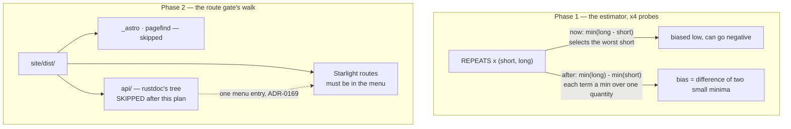

# 0157 — The cost probes estimate a duration, and the route gate stops counting rustdoc

> **Status:** in-progress
> **Created:** 2026-09-07
> **Owner skill(s):** dev
> **Related ADRs:** [ADR-0173](../adrs/0173-a-cost-probe-takes-the-best-of-each-duration-not-the-best-difference.md)
> (proposed — the estimator), [ADR-0169](../adrs/0169-the-site-is-organised-by-reader-task-and-the-readme-stops-being-a-reference.md)
> (accepted — rustdoc is one menu entry), [ADR-0166](../adrs/0166-a-published-document-splits-into-routes-by-size.md),
> [ADR-0071](../adrs/0071-a-numeric-test-contract-states-a-property-or-names-its-machine.md),
> [ADR-0016](../adrs/0016-gpu-tests-opt-in-ci-scope.md)

## TL;DR

Two independent defects are keeping `main` red, both pre-existing and both exposed rather than
caused by the rustdoc repair at `a8e3dc1`. The four GPU cost probes estimate per-frame cost as the
**minimum of a difference**, which selects the noisiest sample instead of rejecting it and produced
a negative duration on `check (macos-latest)`; they will minimize each duration separately and
subtract once (ADR-0173). And `scripts/check-site-routes.mjs` walks `site/dist/api/`, counting
rustdoc's 96 generated module pages as Starlight routes that ought to be in the menu; it will skip
that tree exactly as it already skips `_astro` and `pagefind`.

## Context & problem

`main` at `eefba02` fails two workflows. Neither failure is a regression from Plan 0153's close —
both were masked, and the masking is the through-line of this plan.

**The cost-probe estimator.** `arc_cost.rs`, `collage_cost.rs`, `field_cost.rs` and `mark_cost.rs`
each price a feature by rendering `FRAMES_SHORT` and `FRAMES_LONG` frames and dividing the
difference by the frame delta — a slope that correctly cancels fixed setup cost. Each then repeats
that pair `REPEATS = 3` times and keeps `min((long - short) / delta)`. Keeping the minimum of a
*difference* is not noise rejection: a hiccup in `short` subtracts from `long - short`, so the
minimum selects the repeat whose short leg was most inflated. `mark_cost` reported **-5.319
ms/frame** on the macOS arm and its own guard failed the run. ADR-0173 carries the reasoning and the
three rejected alternatives.

Two facts about why this was invisible. The probes skip on a **software rasterizer** (ADR-0016), and
macOS runners have a real Metal adapter — so the skip asks whether the adapter is real while the
estimator needs the machine to be quiet, and those questions coincide on the reference machine.
And the probes sit outside the nine suites ADR-0156 defers, so they run in `-P fast` on every arm
of every push. Separately, `arc_cost.rs` is the one of the four that never asserts its reading is a
time, so it would have printed a negative figure and passed.

**The route gate.** `scripts/check-site-routes.mjs` asserts that every route the built site serves
is reachable from the Starlight menu. Plan 0156 landed two things that have never run together:
`070c549` added a `rustdoc` job unpacking `cargo doc` output into `site/dist/api/`, and the same
workflow runs this gate afterward. Because `rustdoc` has failed since the day it was added, the
`build` job that `needs:` it was skipped every time — so the gate has never once seen `dist/api/`.
It now does, and reports 96 orphans, all of them rustdoc module pages.

That is the gate applying a Starlight-route property to a tree that is not Starlight routes.
ADR-0169's decision point 3 already settled the intent — *"the Pages artifact carries rustdoc under
`/api/` ... and the *Embed it* group links to it"*, singular — and `site/astro.config.mjs` already
carries `{ label: 'Rust API', link: '/api/rlx_core/' }`. `check-site-links.mjs` already models the
same tree correctly: it treats `dist/api/` as rustdoc's and checks only that the site's own `/api/`
hrefs land inside it. `check-site-routes.mjs` simply never received the same treatment.

## Decision

Phase 1 takes ADR-0173's estimator across all four probes and brings `arc_cost` into line with the
other three on the positivity guard. Phase 2 adds `api` to the two directory names
`check-site-routes.mjs` already excludes from its walk, on ADR-0169's authority rather than a new
decision — the menu entry the gate wants already exists, one level above the tree it was counting.

## Architecture diagram



## Implementation phases

### Phase 1 — The cost probes estimate a duration

- **Owner skill:** dev
- **What:** In each of `core/tests/arc_cost.rs`, `collage_cost.rs`, `field_cost.rs` and
  `mark_cost.rs`, minimize `short` and `long` independently across `REPEATS` and perform the
  subtraction once, after the loop. Add the positivity guard to `arc_cost.rs`.
- **Files touched:** `core/tests/arc_cost.rs`, `core/tests/collage_cost.rs`,
  `core/tests/field_cost.rs`, `core/tests/mark_cost.rs`
- **Illustrative** (each file has its own local shape — follow it rather than this literally):

  ```rust
  let mut best_short = vec![f64::INFINITY; names.len()];
  let mut best_long = vec![f64::INFINITY; names.len()];
  for _ in 0..REPEATS {
      for (index, name) in names.iter().enumerate() {
          let (short, _) = run(renderer, name, FRAMES_SHORT);
          let (long, _) = run(renderer, name, FRAMES_LONG);
          best_short[index] = best_short[index].min(short);
          best_long[index] = best_long[index].min(long);
      }
  }
  let best: Vec<f64> = best_long
      .iter()
      .zip(best_short.iter())
      .map(|(long, short)| (long - short) / f64::from(FRAMES_LONG - FRAMES_SHORT))
      .collect();
  ```

- **Done when:**
  - All four probes compute the per-frame figure from two independently-minimized durations, with
    **exactly one subtraction, performed after the repeat loop**. The cases stay **interleaved
    within each repeat** — the inner loop runs over cases, the outer over repeats — so drift lands
    on every case alike and the reports keep saying `interleaved` truthfully.
  - The comment at each `REPEATS` declaration states the mechanism: a minimum rejects upward noise
    in a *duration*, and the two durations are minimized separately because a minimum over their
    *difference* selects the sample whose short leg was most inflated. It cites **ADR-0173 by bare
    number** and carries no relative link (ADR-0127).
  - `arc_cost.rs` asserts each reading `is_finite() && > 0.0` with a message naming the case,
    matching the other three, and its module header no longer says timing is only printed.
  - **No numeric band, ratio or threshold is added to any of the four.** The readings stay printed
    and unasserted apart from positivity; this plan changes an estimator and adds no contract
    (ADR-0071).
  - `cargo nextest run --workspace` is green. Record the `Summary` line's pass/skip counts.
  - `cargo clippy --workspace --all-targets -- -D warnings` and `cargo fmt --all --check` clean.

### Phase 2 — The route gate stops walking rustdoc's tree

- **Owner skill:** dev
- **What:** Exclude `api` from `builtRoutes()`'s walk in `scripts/check-site-routes.mjs`, alongside
  the existing `_astro` and `pagefind` exclusions.
- **Files touched:** `scripts/check-site-routes.mjs`
- **Done when:**
  - `builtRoutes()` skips `api` at the top level. The comment says what the tree is — rustdoc's
    output, unpacked by the Pages workflow — and that its interior navigation is rustdoc's own,
    reached through the single menu entry **ADR-0169** decision 3 specifies, cited by bare number.
  - The script's header block, which enumerates the three properties it asserts, is updated so
    property 2 states the exclusion. A gate whose stated contract and behaviour disagree is the
    defect this phase is fixing, one level up.
  - Against a locally built site with `dist/api/` populated
    (`cd site && npm install && npm run build`, then `cargo doc --workspace --no-deps` and copy
    `target/doc` to `site/dist/api`), `node scripts/check-site-routes.mjs` exits 0.
  - **The gate still bites.** With that same build, create one throwaway directory containing an
    `index.html` under `site/dist/` — outside `api/` — and confirm the gate exits 1 and names it;
    then remove it. A narrowed gate that no longer catches what it exists for is the failure mode
    of this phase, and nothing else in the run would reveal it.
  - `node scripts/check-site-links.mjs --require-api` still exits 0 against the same tree, so the
    two gates' division of the `api/` tree stays consistent.

## Data shapes

None. Phase 1 changes the arithmetic inside one function per test file; Phase 2 adds a directory
name to an exclusion list. No types, no interfaces, no runtime behaviour.

## Risks & open questions

- **The macOS arm may still go red.** ADR-0173's Negative says this plainly: the repair removes a
  systematic bias, not the noise. If `min(long)` falls below `min(short)` on a contended runner the
  positivity guard fires again, correctly. **Do not tune a threshold in response** — that would be
  the frozen-number error ADR-0071 exists to prevent. The next move if it recurs is ADR-0173's
  Alternative A, which is recorded and still available.
- **Phase 2's done-when needs a local site build**, which is the one heavyweight step in this plan
  (`npm install` plus a Playwright-less build). `check-site-routes.mjs` runs in neither pre-push nor
  the CI `links` job precisely because it needs built output, so there is no cheaper way to exercise
  it before the push.
- **`check-site-routes.mjs` has no committed fixture**, unlike `site-links` and `site-links-api`.
  The manual bite check above stands in for one. See what this plan does NOT do.
- **Four files carry the same estimator independently.** This plan repeats the fix four times rather
  than extracting a helper, matching how the probes are already written. If a fifth cost probe is
  ever added, the shape is copied again and nothing gates that.

## What this plan does NOT do

- **It does not add a fixture for `check-site-routes.mjs`.** The script imports `PUBLISHED` from
  `site/src/plugins/rewrite-links.mjs` and parses the real `site/astro.config.mjs` sidebar, so a
  fixture root would report every published route as missing from the fixture's menu. Making it
  fixturable means giving it an override for both, which is a change to the gate's interface and
  wants its own decision. The manual bite check in Phase 2 covers this plan's own change.
- **It does not extract a shared cost-probe helper.** Four copies of one estimator is a real cost
  and this plan pays it again; consolidating touches how each probe constructs its cases and is not
  what a red `main` needs.
- **It does not revisit whether the cost probes belong in `-P fast`.** They run on every arm of
  every push, which is what put a timing measurement on a shared macOS runner in the first place.
  That is ADR-0156's scope and a legitimate question, deliberately left standing.
- **It does not change the slope method, `REPEATS`, `FRAMES_SHORT` or `FRAMES_LONG`.** ADR-0173
  Alternative D records why raising `REPEATS` would make the old estimator worse; none of these
  constants move.
- **It does not add an `api/` landing page.** `cargo doc --workspace` emits no root `index.html`, so
  `dist/api/` is not itself a route — which is why the menu points at `/api/rlx_core/`. Whether the
  other five crates' docs deserve their own menu entries is an ADR-0169 question, not this plan's.

## Implementation log

> Written by `dev` — one row per phase as that phase's commit lands, and the close block after the
> last one. **The phases above are the contract; everything here is what happened.**

**Lane:** `main` directly, no worktree.

| phase | owner | state | commit |
|---|---|---|---|
| 1 — The cost probes estimate a duration | dev | done | `084686a` |
| 2 — The route gate stops walking rustdoc's tree | dev | done | `70ed4cc` |

### Notes

- The local orphan count under Phase 2's bite check was **171**, not the 96 this plan's Context
  quotes from CI. This checkout's `target/doc` also holds pre-rename crate directories (`lmv`,
  `lmv_core`, `lmv_core_c`, `lmv_ring`, `ritmolux`) left by earlier builds; CI's is a clean tree.
  The extra 75 are that residue, not routes the site builds.

### Close triggers

- **`presets/` touched:** none.
- **Plan header `Closes:` entries:** none — the header carries only `Related ADRs`.
- **What shipped:** fix-only, and in code no artifact ships: `core/tests/` (four cost probes) and
  `scripts/check-site-routes.mjs`. No change under `core/src/`, `standalone/`, `plugin-foobar/`,
  `core-cabi/`, `milkconv/`, `presets/` or `site/`.
- **Operator docs moved:** none.
- **`node scripts/check-backlog-claims.mjs`:** exit 0 — *"106 stated reductions still hold across
  all 45 live entries (8 unprobeable)"*. No entry named as broken; its advisory section reports 65
  probed paths moved since last read, none of them touched by this plan.
- **Full suite:** `cargo nextest run --workspace`, exit 0 —
  `Summary [415.690s] 1556 tests run: 1556 passed (9 slow), 5 skipped`, run at `70ed4cc`. The same
  command at `084686a` read `[423.967s] 1556 passed (9 slow), 5 skipped`. No ADR-0156 upward
  override was invoked at either phase: the four probes sit outside the nine deferred suites and
  ran under both.
- **Also run at the tip:** `cargo clippy --workspace --all-targets -- -D warnings` and
  `cargo fmt --all --check` clean; the seven pre-push Node gates each exit 0; and, against a local
  site build with `target/doc` copied to `site/dist/api/`, `node scripts/check-site-routes.mjs` and
  `node scripts/check-site-links.mjs --require-api` both exit 0.
- **`human` phases remaining:** none — both phases are `dev`-owned and both are done.
- **ADR-0173 is still `proposed`.**

## Followups (after this lands)

- Watch the macOS arm across the next few pushes. The estimator repair is expected to end the
  negative readings; if a probe goes red again the finding belongs in ADR-0173 as a dated `Outcome`,
  not in a tuned constant.
