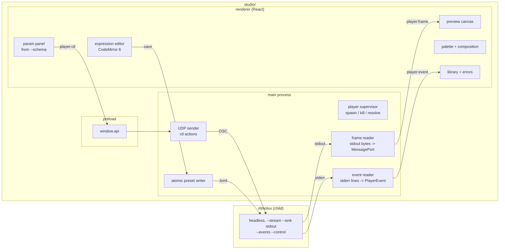

# 0159 — The studio opens

> **Status:** approved
> **Created:** 2026-09-09
> **Owner skill(s):** studio-builder, dev, human
> **Related ADRs:** [0175](../adrs/0175-the-studio-is-a-separate-application-that-never-draws-a-frame.md) (proposed),
> [0176](../adrs/0176-the-player-is-driven-over-osc-control-in-and-reports-on-its-standard-streams.md) (proposed),
> [0177](../adrs/0177-a-fourth-skill-lane-builds-the-studio.md) (proposed),
> [0178](../adrs/0178-the-studio-shell-conventions.md) (proposed),
> [0038](../adrs/0038-tag-driven-release-unsigned-universal-mac-app.md)
> **Depends on:** [0158](0158-the-player-grows-a-studio-facing-surface.md) Phases 1 to 5 landed
> (the override, the listener, the events, the schema, the pipe sink). Phase 6 of 0158 is not
> required by anything here.

## TL;DR

A separate Electron application, `studio/`, opens beside the lean player and edits a preset
while the music plays. It spawns the player headless, paints the player's frames in its own
window, renders a parameter panel from the schema the engine exports, sends slider drags over
the control channel, and saves the file the player watches. The first user-visible behavior is
the player's picture moving with the music inside the studio window. The last is a zip on both
platforms with the player inside it, handed to a tester.

## Context & problem

ADR-0175 decides the studio never renders and the player does; ADR-0176 decides the channels;
ADR-0177 gives the studio its own lane; ADR-0178 fixes how the shell is built. Plan 0158 gives
the player everything the studio needs to drive it. What is missing is the application.

The editing loop the studio must close is the one `preset-author` runs by hand today: edit a
`.toml`, wait for the watcher, look at the window, read an error off `stderr`, repeat. Every
piece of that loop now has a structured form: a schema document says what a preset can
contain, an event says what went wrong and on which line, a datagram moves a parameter on the
next frame, and a pipe carries the picture. The studio is those four things in one window.

## Decision

We build the studio in `studio/` as ADR-0178 lays it out, lane `studio-builder` throughout,
with `dev` owning the two things outside `studio/` (the release workflow and the pre-push hook)
and `human` owning the two things only the user can do (the tester handoff and the on-device
check). The first phase is a walking skeleton that already shows the player's picture; nothing
in the plan is plumbing that shows nothing.

## Architecture diagram



## Implementation phases

### Phase 1 — The skeleton shows the picture
- **Owner skill:** studio-builder
- **What:** `studio/` exists per ADR-0178: three bundles, four tsconfigs, npm with exact pins,
  ESLint, Prettier, Vitest, the security defaults and the double CSP. Main resolves and spawns
  the player headless with `--stream --sink stdout --events --control`, reads the `stream` event,
  splits standard output into frames, and posts them over a `MessagePort`; the renderer paints
  them on a canvas. A footer shows the player's version from `hello` and the dropped-frame
  count.
- **Files touched:** `studio/package.json`, `studio/package-lock.json`, the four `tsconfig`s,
  `studio/scripts/build-main.mjs`, `studio/scripts/build-preload.mjs`, `studio/vite.config.ts`,
  `studio/electron/main.ts`, `studio/electron/window.ts`, `studio/electron/player/`
  (`supervisor.ts`, `events.ts`, `frames.ts`, `resolve.ts`), `studio/electron/preload/`,
  `studio/shared/ipc-channels.ts`, `studio/shared/protocol.ts`, `studio/renderer/`
  (`main.tsx`, `App.tsx`, `components/Preview.tsx`), `studio/README.md`, root `.gitignore`.
- **Done when:**
  - `npm run dev` in `studio/` opens a window that shows the player's picture moving with the
    system's audio at the stream's declared size and rate, on Windows.
  - The frame reader never blocks main: a test feeds a scripted stdout of three frames with the
    renderer's port stalled and asserts the reader drops and counts rather than queues, and the
    count reaches the footer.
  - The player is found in ADR-0178's order, bundled, settings, `PATH`, and a `hello` version the
    studio does not know produces a visible refusal rather than a blank preview.
  - `contextIsolation`, `nodeIntegration`, `sandbox` and both CSP sites are asserted by a test in
    the shape market-analyzer's `window.csp.test.ts` uses.
  - `npm run typecheck`, `npm run lint` and `npm test` are green; the `dev` and `architect` skill
    vocabulary already names `studio-builder` (ADR-0177), so the plan is reviewable.

### Phase 2 — The protocol is typed once
- **Owner skill:** studio-builder
- **What:** `studio/shared/protocol.ts` holds `CtlAction` and `PlayerEvent` as discriminated
  unions with Zod schemas; main validates every parsed event and every forwarded action; a test
  holds the file to `docs/specs/0003-studio-control-protocol.md`.
- **Files touched:** `studio/shared/protocol.ts`, `studio/shared/protocol.spec.test.ts`,
  `studio/electron/player/osc.ts` (the encoder for the `ctl` addresses, mirroring the player's
  own), `studio/electron/ipc/playerHandlers.ts`, `studio/electron/preload/api/player.ts`.
- **Done when:**
  - Every address and every event name in the spec's tables appears in the unions, and every
    union member appears in the spec: the test parses the spec's markdown tables and diffs both
    ways, so a widening on either side fails until both move.
  - The OSC encoder produces byte-identical packets to the player's encoder for every `ctl`
    message: a fixture of packets captured from the player's own test suite is checked in and
    compared.
  - An event line that fails validation is counted and shown, never thrown; a test feeds a
    malformed line between two good ones and asserts both good ones arrive.

### Phase 3 — Parameters move
- **Owner skill:** studio-builder
- **What:** The renderer asks main for the schema (main runs `ritmolux --schema` once at start
  and caches it), renders a panel for the active preset's system from the `ParamSpec` rows,
  with a slider or a field per parameter at its range and default, and sends `ctl/param` on
  every drag step. On release it writes the preset file atomically into the directory the player
  watches, with the dragged value as the new constant, and clears the override.
- **Files touched:** `studio/electron/player/schema.ts`, `studio/electron/preset/writer.ts`
  (tmp file plus rename, never a partial file), `studio/electron/preset/toml.ts` (a
  round-tripping TOML edit that preserves comments and table order), `studio/renderer/`
  (`views/Editor.tsx`, `components/ParamPanel.tsx`, `components/ParamRow.tsx`,
  `hooks/useSchema.ts`, `hooks/usePlayer.ts`), `studio/shared/schema.ts`.
- **Done when:**
  - Dragging a slider moves the picture on the next painted frame with no file written; a test
    asserts one `ctl/param` per drag step and zero writes until release.
  - Releasing writes the file once, atomically, and the player's `roster` event follows; the
    written file differs from the original **only** on the edited line: a test round-trips every
    shipped preset through the editor with no edit and asserts byte equality, then with one edit
    and asserts a one-line diff.
  - A parameter the preset binds to an expression rather than a constant shows the expression
    and is not draggable; the slider is offered only for a constant binding.
  - A `preset_error` after a save is shown against the file and line it names.

### Phase 4 — Expressions and palettes
- **Owner skill:** studio-builder
- **What:** A CodeMirror 6 editor for the preset file with a small language mode for the
  expression grammar, error markers placed from `preset_error` events, and a palette editor with
  draggable stops and the built-in palette names from the schema.
- **Files touched:** `studio/renderer/components/PresetEditor.tsx`,
  `studio/renderer/editor/expr-language.ts`, `studio/renderer/editor/diagnostics.ts`,
  `studio/renderer/components/PaletteEditor.tsx`, `studio/renderer/components/StopHandle.tsx`.
- **Done when:**
  - A syntax error typed into an expression shows a marker on the line the player reports within
    one save cycle, and clears when fixed; a test drives the diagnostics from a recorded event.
  - The language mode's token list is generated from the schema's function and variable
    roster, not hand-typed: a test asserts every name in the schema is highlighted and no other.
  - Moving a palette stop writes the `[palette]` table in the same round-tripping form Phase 3
    established, and the picture follows on the next reload.

### Phase 5 — Composition and the library
- **Owner skill:** studio-builder
- **What:** The system picker, the structural tables (`[particles]`, `[generator]`, `[curve]`,
  `[mesh]`, `[spectrum]`, `[per_vertex]`, `[feedback]`, `[layer]`, `[latch]`, `[smoothing]`)
  rendered from the schema's structural half, "new preset from this system's defaults",
  "save as", and a library view of the player's roster from the `roster` event with a click
  sending `ctl/preset`.
- **Files touched:** `studio/renderer/views/Library.tsx`, `studio/renderer/components/`
  (`SystemPicker.tsx`, `TableEditor.tsx`, `LayerEditor.tsx`), `studio/renderer/hooks/useRoster.ts`,
  `studio/electron/preset/templates.ts`.
- **Done when:**
  - Every structural table the schema declares has an editor, and none is hand-listed: a test
    walks the schema and asserts a component resolves for each table kind.
  - A preset built from a template loads in the player with no `preset_error` and no
    `preset_warning`: a test builds one per system and drives it through the player's loader
    (via `ritmolux --check`, or through a spawned player's events if no check flag exists, which
    is then a feedback note for `architect`).
  - Clicking a library entry dissolves the player to it, and the panel re-renders for the new
    system.

### Phase 6 — The release job and the gate
- **Owner skill:** dev
- **What:** The `v*` tag builds the studio zip for Windows and macOS with the player inside,
  beside the two existing zips; `.githooks/pre-push` runs the studio's typecheck, lint and tests
  when `studio/node_modules` exists; `docs/releasing.md` and `packaging/` say so.
- **Files touched:** `.github/workflows/` (the release workflow and a `studio` CI job),
  `.githooks/pre-push`, `packaging/macos/bundle.sh` or a sibling for the studio,
  `packaging/studio/READ-ME-FIRST.md`, `docs/releasing.md`, `docs/nfr.md` (the studio's size row,
  in bytes, from the first measured zip), `CLAUDE.md` (the `studio/` row in "Where things live").
- **Done when:**
  - A tag push produces three zips; the studio zip on each platform contains the player at
    `resources/player/`, and the studio starts against it with no path configured.
  - The macOS studio bundle is ad-hoc signed and passes the same verification `bundle.sh` runs
    on the player.
  - The size row exists and names the bytes; the pre-push hook's studio step is skipped, with
    a printed notice in ADR-0016's shape, on a clone with no `studio/node_modules`.

### Phase 7 — The tester handoff
- **Owner skill:** human
- **What:** Hand the studio zip to one VJ who has never seen the repository.
- **Done when:** They open it, see the picture, move a slider, save, and the player picks up the
  saved file, without any instruction beyond `packaging/studio/READ-ME-FIRST.md`. What they
  could not do is written into `docs/design-backlog.md` as entries with probes.

### Phase 8 — The on-device check
- **Owner skill:** human
- **What:** The studio beside a fullscreen player on the projector, driven over `--control`, for
  one full track, on the development machine and on the macOS arm.
- **Done when:** `docs/on-device-validation.md` carries the checklist with both machines'
  readings: the preview's dropped-frame count over the track, and the player's `health` line
  with the studio attached against a run without it.

## Data shapes

```ts
// illustrative — studio/shared/protocol.ts
export type CtlAction =
  | { kind: 'param'; name: string; value: number }
  | { kind: 'param_clear'; name: string }
  | { kind: 'params_clear' }
  | { kind: 'preset'; name: string }
  | { kind: 'transport'; verb: 'next' | 'prev' | 'auto' | 'hold' }
  | { kind: 'ping'; nonce: number };

export type PlayerEvent =
  | { v: 1; ev: 'hello'; version: string; schema_hash: string; control_port: number }
  | { v: 1; ev: 'preset_error'; file: string; message: string; line?: number; col?: number }
  | { v: 1; ev: 'stream'; width: number; height: number; fps: number; format: 'rgba8' }
  // ... one member per row of the spec's event table
```

## Risks & open questions

- **Frame transfer cost in Electron.** The `MessagePort` path is the design; if the renderer
  cannot paint 640x360 at 30 fps with `putImageData`, the phase upgrades to a WebGL texture
  upload before it lowers the default. The dropped-frame counter is what makes either reading
  honest.
- **Round-tripping TOML with comments.** Shipped presets carry long header comments that are
  the project's own record; a writer that loses them is a regression the byte-equality test in
  Phase 3 exists to catch. If no library round-trips faithfully, the writer edits the file as
  text by line, which is enough for a constant on its own line and is what the test measures.
- **Two audio captures on one machine.** The headless player and a windowed show player both
  loopback-capture; Windows allows it, macOS has no loopback without a virtual device either
  way. Nothing new, but the on-device check confirms it.
- **The schema's structural half may not be enough to render an editor.** Phase 5's walk over
  the schema is where a missing enumeration or a missing default surfaces; each is a feedback
  note to `architect` for Plan 0158's Phase 4, not a hand-typed fallback in the studio.
- **The `render` subcommand and projects are not here.** A tester will ask for both; the plan
  says no on purpose so that the editing loop lands whole.

## What this plan does NOT do

- **No clip rendering and no diffusion pass.** Each is a plan of its own once the player has a
  `render` subcommand (ADR-0175 decides it; nothing has built it).
- **No project or show file.** Its format is an interview and an ADR first, because a cue list
  and a timeline are different products.
- **No embedded preview from a windowed player.** That is Plan 0158's Phase 6; the studio reads
  the same pipe format either way, so nothing here changes when it lands.
- **No remote control, no phone page.** ADR-0175 Alternative E.
- **No installer, no signing beyond ad-hoc, no auto-update.**

## Implementation log

> Written by the implementing lane — one row per phase as that phase's commit lands, and the
> close block after the last one. **The phases above are the contract; everything here is what
> happened.** **Observations, never conclusions:** this says where to look, architect decides
> how it went. No per-criterion pass list, no self-assessment, no narrative — but a deviation
> from the plan or an unmet done-when is always disclosed. Stays shorter than
> `## Implementation phases` above.

**Lane:** _(`main` directly, or the worktree path plus its branch — `WORK/rlx-plan-0159` on
`plan-0159-<slug>`)_

| phase | owner | state | commit |
|---|---|---|---|
| 1 — The skeleton shows the picture | studio-builder | not started | |
| 2 — The protocol is typed once | studio-builder | not started | |
| 3 — Parameters move | studio-builder | not started | |
| 4 — Expressions and palettes | studio-builder | not started | |
| 5 — Composition and the library | studio-builder | not started | |
| 6 — The release job and the gate | dev | not started | |
| 7 — The tester handoff | human | not started | |
| 8 — The on-device check | human | not started | |

### Notes

### Close triggers

- **`presets/` touched:**
- **Plan header `Closes:`** none
- **What shipped:**
- **Operator docs touched:**
- **Backlog probes (`node scripts/check-backlog-claims.mjs`):**
- **Full suite:**
- **Outstanding `human` phases:**

## Followups (after this lands)

- Clip rendering from the studio (needs the `render` subcommand).
- Show projects (needs an interview and an ADR on the file's shape).
- The diffusion pass from the studio (spawns `tools/sd-filter/`, ships nothing).
