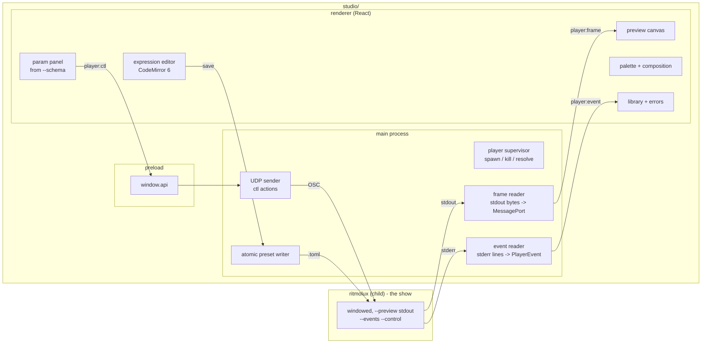

# 0159 — The studio opens

> **Status:** in-progress
> **Created:** 2026-09-09
> **Owner skill(s):** studio-builder, dev, human
> **Related ADRs:** [0175](../adrs/0175-the-studio-is-a-separate-application-that-never-draws-a-frame.md)
> (accepted, with a 2026-09-10 `Outcome` this plan wrote),
> [0176](../adrs/0176-the-player-is-driven-over-osc-control-in-and-reports-on-its-standard-streams.md) (accepted),
> [0177](../adrs/0177-a-fourth-skill-lane-builds-the-studio.md) (proposed),
> [0178](../adrs/0178-the-studio-shell-conventions.md) (proposed),
> [0181](../adrs/0181-the-studio-drives-one-player-and-the-show-loop-is-extracted.md) (proposed),
> [0038](../adrs/0038-tag-driven-release-unsigned-universal-mac-app.md)
> **Depends on:** [0158](done/0158-the-player-grows-a-studio-facing-surface.md) Phases 1 to 5 landed
> (the override, the listener, the events, the schema, the pipe sink). **Phase 6 of 0158 — the
> windowed preview copy — is now required**: ADR-0181 makes it the mechanism the studio's preview
> uses, and it shipped.

## TL;DR

A separate Electron application, `studio/`, opens beside the lean player and edits a preset
while the music plays. It spawns **one** player — the show itself — paints a copy of its frames
in its own window, renders a parameter panel from the schema the engine exports, sends slider
drags over the control channel, and saves the file the player watches. The first user-visible
behavior is the player's picture moving with the music inside the studio window. The last is a
zip on both platforms with the player inside it, handed to a tester.

## Context & problem

ADR-0175 decides the studio never renders and the player does; ADR-0176 decides the channels;
ADR-0177 gives the studio its own lane; ADR-0178 fixes how the shell is built. Plan 0158 gives
the player everything the studio needs to drive it. What is missing is the application.

**Revised 2026-09-10, after Phases 1 and 2 landed.** The plan spawned the player headless, as
ADR-0175's Decision said. That path binds no control listener, emits two of the eight events,
and — decisively — never resolves, seeds, watches or reloads the preset directory, because
`standalone/src/preset_dir.rs` is imported by `app_state.rs` alone. The editing loop this plan
exists to close does not run there.
[ADR-0181](../adrs/0181-the-studio-drives-one-player-and-the-show-loop-is-extracted.md) settles
it: the studio drives **one windowed player** that is both the show and the preview source, and
the show loop is extracted so the headless path stops being a silent subset of it. Two phases
below are new because of it, and the phases after them are renumbered.

The editing loop the studio must close is the one `preset-author` runs by hand today: edit a
`.toml`, wait for the watcher, look at the window, read an error off `stderr`, repeat. Every
piece of that loop now has a structured form: a schema document says what a preset can
contain, an event says what went wrong and on which line, a datagram moves a parameter on the
next frame, and a pipe carries the picture. The studio is those four things in one window.

## Decision

We build the studio in `studio/` as ADR-0178 lays it out, lane `studio-builder` for the studio
itself, with `dev` owning what lies outside it — the show-loop extraction ADR-0181 calls for,
the release workflow and the pre-push hook — and `human` owning the two things only the user can
do (the tester handoff and the on-device check). The first phase is a walking skeleton that
already shows the player's picture; nothing in the plan is plumbing that shows nothing.

## Architecture diagram



## Implementation phases

### Phase 1 — The skeleton shows the picture
- **Owner skill:** studio-builder
- **What:** `studio/` exists per ADR-0178: three bundles, four tsconfigs, npm with exact pins,
  ESLint, Prettier, Vitest, the security defaults and the double CSP. Main resolves and spawns
  the player headless with `--stream --sink stdout --events --control`, reads the `stream` event,
  splits standard output into frames, and posts them over a `MessagePort`; the renderer paints
  them on a canvas. A footer shows the player's version from `hello` and the dropped-frame
  count.
- **Files touched:** `studio/package.json`, `studio/package-lock.json`, the four `tsconfig`s,
  `studio/scripts/build-main.mjs`, `studio/scripts/build-preload.mjs`, `studio/vite.config.ts`,
  `studio/electron/main.ts`, `studio/electron/window.ts`, `studio/electron/player/`
  (`supervisor.ts`, `events.ts`, `frames.ts`, `resolve.ts`), `studio/electron/preload/`,
  `studio/shared/ipc-channels.ts`, `studio/shared/protocol.ts`, `studio/renderer/`
  (`main.tsx`, `App.tsx`, `components/Preview.tsx`), `studio/README.md`, root `.gitignore`.
- **Done when:**
  - `npm run dev` in `studio/` opens a window that shows the player's picture moving with the
    system's audio at the stream's declared size and rate, on Windows.
  - The frame reader never blocks main: a test feeds a scripted stdout of three frames with the
    renderer's port stalled and asserts the reader drops and counts rather than queues, and the
    count reaches the footer.
  - The player is found in ADR-0178's order, bundled, settings, `PATH`, and a `hello` version the
    studio does not know produces a visible refusal rather than a blank preview.
  - `contextIsolation`, `nodeIntegration`, `sandbox` and both CSP sites are asserted by a test in
    the shape market-analyzer's `window.csp.test.ts` uses.
  - `npm run typecheck`, `npm run lint` and `npm test` are green; the `dev` and `architect` skill
    vocabulary already names `studio-builder` (ADR-0177), so the plan is reviewable.

### Phase 2 — The protocol is typed once
- **Owner skill:** studio-builder
- **What:** `studio/shared/protocol.ts` holds `CtlAction` and `PlayerEvent` as discriminated
  unions with Zod schemas; main validates every parsed event and every forwarded action; a test
  holds the file to `docs/specs/0003-studio-control-protocol.md`.
- **Files touched:** `studio/shared/protocol.ts`, `studio/shared/protocol.spec.test.ts`,
  `studio/electron/player/osc.ts` (the encoder for the `ctl` addresses, mirroring the player's
  own), `studio/electron/ipc/playerHandlers.ts`, `studio/electron/preload/api/player.ts`.
- **Done when:**
  - Every address and every event name in the spec's tables appears in the unions, and every
    union member appears in the spec: the test parses the spec's markdown tables and diffs both
    ways, so a widening on either side fails until both move.
  - The OSC encoder produces byte-identical packets to the player's encoder for every `ctl`
    message: a fixture of packets captured from the player's own test suite is checked in and
    compared.
  - An event line that fails validation is counted and shown, never thrown; a test feeds a
    malformed line between two good ones and asserts both good ones arrive.

### Phase 3 — The show loop is extracted, and every mode runs it
- **Owner skill:** dev
- **What:** ADR-0181's second half. Preset-directory resolution and seeding, the watcher and its
  reload, the `Director`, the event emissions and the control drain move out of
  `standalone/src/app_state.rs` into one place both the windowed and the headless paths call.
  What stays different between the two is the window and which sink the frames go to. The
  headless path gains the listener, the watcher and the full event roster because it runs the
  same code, not because a second copy was written.
- **Files touched:** `standalone/src/run.rs` (the headless branch stops returning before the
  config, the preset directory and `resolve_control`), `standalone/src/app_state.rs`,
  `standalone/src/stream.rs`, a new module for the extracted loop, `standalone/src/preset_dir.rs`
  (no longer `app_state.rs`'s alone), `docs/specs/0003-studio-control-protocol.md` (the roster is
  no longer conditional on a run mode), `docs/configuration.md` and `docs/capturing.md` if a flag
  or its reach changed.
- **Done when:**
  - A headless run with `--events` emits the same event roster a windowed run does, for the same
    causes: a test spawns `--stream --sink stdout --events --frames N` against a preset directory
    it controls, edits a file mid-run, and asserts `roster`, `preset` and a `preset_error` all
    arrive on standard error.
  - A headless run with `--control` **binds a socket**, reports the bound address in
    `hello.control`, and applies a `ctl/param` on the next frame; the existing control tests run
    against the headless path as well as the windowed one.
  - The show management exists **once**: a test asserts `preset_dir`'s reload entry point has a
    single caller, in the extracted module, so the duplication this phase exists to prevent
    cannot be reintroduced silently.
  - A `--stream` run on a machine with no per-user preset directory still runs, on the embedded
    set, with a printed notice in ADR-0016's shape — `PresetDir::Unresolved` is honoured rather
    than treated as a failure.
  - The windowed show is unchanged: the console's byte-identity assertion and the residency test
    both still pass, and the `diagnostics.log` frame-time line is reported before and after the
    extraction so the refactor's cost is a number rather than an assumption.

### Phase 4 — The studio drives the one player
- **Owner skill:** studio-builder
- **What:** ADR-0181's first half, which is a small change to the supervisor: spawn
  `--preview stdout --events --control 127.0.0.1:0` rather than the headless set, and take the
  geometry from the `stream` event exactly as now. The picture in the studio becomes a copy of
  the show's own output.
- **Files touched:** `studio/electron/player/supervisor.ts` (`DEFAULT_PLAYER_ARGS` and its test),
  `studio/README.md`.
- **Done when:**
  - The studio's window shows the picture and the footer reports a **bound** control address
    rather than `control none`.
  - A `ctl/param` sent from the studio moves the picture in both windows on the next frame.
  - The frame reader is untouched: the geometry still comes from the `stream` event and no size
    or rate is hard-coded anywhere in `studio/`.

### Phase 5 — Parameters move
- **Owner skill:** studio-builder
- **What:** The renderer asks main for the schema (main runs `ritmolux --schema` once at start
  and caches it), renders a panel for the active preset's system from the `ParamSpec` rows,
  with a slider or a field per parameter at its range and default, and sends `ctl/param` on
  every drag step. On release it writes the preset file atomically into the directory the player
  watches, with the dragged value as the new constant, and clears the override.
- **Files touched:** `studio/electron/player/schema.ts`, `studio/electron/preset/writer.ts`
  (tmp file plus rename, never a partial file), `studio/electron/preset/toml.ts` (a
  round-tripping TOML edit that preserves comments and table order), `studio/renderer/`
  (`views/Editor.tsx`, `components/ParamPanel.tsx`, `components/ParamRow.tsx`,
  `hooks/useSchema.ts`, `hooks/usePlayer.ts`), `studio/shared/schema.ts`.
- **Done when:**
  - Dragging a slider moves the picture on the next painted frame with no file written; a test
    asserts one `ctl/param` per drag step and zero writes until release.
  - Releasing writes the file once, atomically, and the player's `roster` event follows; the
    written file differs from the original **only** on the edited line: a test round-trips every
    shipped preset through the editor with no edit and asserts byte equality, then with one edit
    and asserts a one-line diff.
  - A parameter the preset binds to an expression rather than a constant shows the expression
    and is not draggable; the slider is offered only for a constant binding.
  - A `preset_error` after a save is shown against the file and line it names.

### Phase 6 — Expressions and palettes
- **Owner skill:** studio-builder
- **What:** A CodeMirror 6 editor for the preset file with a small language mode for the
  expression grammar, error markers placed from `preset_error` events, and a palette editor with
  draggable stops and the built-in palette names from the schema.
- **Files touched:** `studio/renderer/components/PresetEditor.tsx`,
  `studio/renderer/editor/expr-language.ts`, `studio/renderer/editor/diagnostics.ts`,
  `studio/renderer/components/PaletteEditor.tsx`, `studio/renderer/components/StopHandle.tsx`.
- **Done when:**
  - A syntax error typed into an expression shows a marker on the line the player reports within
    one save cycle, and clears when fixed; a test drives the diagnostics from a recorded event.
  - The language mode's token list is generated from the schema's function and variable
    roster, not hand-typed: a test asserts every name in the schema is highlighted and no other.
  - Moving a palette stop writes the `[palette]` table in the same round-tripping form Phase 5
    established, and the picture follows on the next reload.

### Phase 7 — Composition and the library
- **Owner skill:** studio-builder
- **What:** The system picker, the structural tables (`[particles]`, `[generator]`, `[curve]`,
  `[mesh]`, `[spectrum]`, `[per_vertex]`, `[feedback]`, `[layer]`, `[latch]`, `[smoothing]`)
  rendered from the schema's structural half, "new preset from this system's defaults",
  "save as", and a library view of the player's roster from the `roster` event with a click
  sending `ctl/preset`.
- **Files touched:** `studio/renderer/views/Library.tsx`, `studio/renderer/components/`
  (`SystemPicker.tsx`, `TableEditor.tsx`, `LayerEditor.tsx`), `studio/renderer/hooks/useRoster.ts`,
  `studio/electron/preset/templates.ts`.
- **Done when:**
  - Every structural table the schema declares has an editor, and none is hand-listed: a test
    walks the schema and asserts a component resolves for each table kind.
  - A preset built from a template loads in the player with no `preset_error` and no
    `preset_warning`: a test builds one per system and drives it through the player's loader
    (via `ritmolux --check`, or through a spawned player's events if no check flag exists, which
    is then a feedback note for `architect`).
  - Clicking a library entry dissolves the player to it, and the panel re-renders for the new
    system.

### Phase 8 — The release job and the gate
- **Owner skill:** dev
- **What:** The `v*` tag builds the studio zip for Windows and macOS with the player inside,
  beside the two existing zips; `.githooks/pre-push` runs the studio's typecheck, lint and tests
  when `studio/node_modules` exists; `docs/releasing.md` and `packaging/` say so.
- **Files touched:** `.github/workflows/` (the release workflow and a `studio` CI job),
  `.githooks/pre-push`, `packaging/macos/bundle.sh` or a sibling for the studio,
  `packaging/studio/READ-ME-FIRST.md`, `docs/releasing.md`, `docs/nfr.md` (the studio's size row,
  in bytes, from the first measured zip), `CLAUDE.md` (the `studio/` row in "Where things live").
- **Done when:**
  - A tag push produces three zips; the studio zip on each platform contains the player at
    `resources/player/`, and the studio starts against it with no path configured.
  - The macOS studio bundle is ad-hoc signed and passes the same verification `bundle.sh` runs
    on the player.
  - The size row exists and names the bytes; the pre-push hook's studio step is skipped, with
    a printed notice in ADR-0016's shape, on a clone with no `studio/node_modules`.

### Phase 9 — The tester handoff
- **Owner skill:** human
- **What:** Hand the studio zip to one VJ who has never seen the repository.
- **Done when:** They open it, see the picture, move a slider, save, and the player picks up the
  saved file, without any instruction beyond `packaging/studio/READ-ME-FIRST.md`. What they
  could not do is written into `docs/design-backlog.md` as entries with probes.

### Phase 10 — The on-device check
- **Owner skill:** human
- **What:** The studio beside a fullscreen player on the projector, driven over `--control`, for
  one full track, on the development machine and on the macOS arm.
- **Done when:** `docs/on-device-validation.md` carries the checklist with both machines'
  readings: the preview's dropped-frame count over the track, and the player's `health` line
  with the studio attached against a run without it.

## Data shapes

```ts
// illustrative — studio/shared/protocol.ts
export type CtlAction =
  | { kind: 'param'; name: string; value: number }
  | { kind: 'param_clear'; name: string }
  | { kind: 'params_clear' }
  | { kind: 'preset'; name: string }
  | { kind: 'transport'; verb: 'next' | 'prev' | 'auto' | 'hold' }
  | { kind: 'ping'; nonce: number };

export type PlayerEvent =
  | { v: 1; ev: 'hello'; version: string; schema_hash: string; control_port: number }
  | { v: 1; ev: 'preset_error'; file: string; message: string; line?: number; col?: number }
  | { v: 1; ev: 'stream'; width: number; height: number; fps: number; format: 'rgba8' }
  // ... one member per row of the spec's event table
```

## Risks & open questions

- **Frame transfer cost in Electron.** The `MessagePort` path is the design; if the renderer
  cannot paint the stream's declared geometry at its declared rate with `putImageData`, the phase
  upgrades to a WebGL texture upload before it lowers anything. **The rate is now the show's**,
  since ADR-0181 makes the preview a copy of the windowed player's output rather than a headless
  run pinned at 640x360 and 30 fps — so this risk grew, and the dropped-frame counter is what
  makes either reading honest.
- **The extraction is the phase with the most to break and least to show.** Phase 3 touches
  `run.rs` and `app_state.rs` and ships no visible feature; its done-whens are therefore written
  as *the windowed show is unchanged* — the console's byte-identity assertion, the residency
  test, and a frame-time line reported before and after rather than assumed.
- **Round-tripping TOML with comments.** Shipped presets carry long header comments that are
  the project's own record; a writer that loses them is a regression the byte-equality test in
  Phase 5 exists to catch. If no library round-trips faithfully, the writer edits the file as
  text by line, which is enough for a constant on its own line and is what the test measures.
- **One capture, and one window that is now part of the editing workflow.** The two-capture risk
  is gone with the second player (ADR-0181). What replaces it: a user editing on a single screen
  with no projector attached has the player's window in the way, and macOS still has no loopback
  without a virtual device. The on-device check reads both.
- **The schema's structural half may not be enough to render an editor.** Phase 7's walk over
  the schema is where a missing enumeration or a missing default surfaces; each is a feedback
  note to `architect` for Plan 0158's Phase 4, not a hand-typed fallback in the studio.
- **The `render` subcommand and projects are not here.** A tester will ask for both; the plan
  says no on purpose so that the editing loop lands whole.

## What this plan does NOT do

- **No clip rendering and no diffusion pass.** Each is a plan of its own once the player has a
  `render` subcommand (ADR-0175 decides it; nothing has built it).
- **No project or show file.** Its format is an interview and an ADR first, because a cue list
  and a timeline are different products.
- **No second player.** Revised 2026-09-10: the studio drives **one** windowed player that is
  both the show and the preview source (ADR-0181), through Plan 0158 Phase 6's `--preview
  stdout`. There is no headless editing child, and the two-capture risk below is discharged
  rather than carried.
- **No remote control, no phone page.** ADR-0175 Alternative E.
- **No installer, no signing beyond ad-hoc, no auto-update.**

## Implementation log

> Written by the implementing lane — one row per phase as that phase's commit lands, and the
> close block after the last one. **The phases above are the contract; everything here is what
> happened.** **Observations, never conclusions:** this says where to look, architect decides
> how it went. No per-criterion pass list, no self-assessment, no narrative — but a deviation
> from the plan or an unmet done-when is always disclosed. Stays shorter than
> `## Implementation phases` above.

**Lane:** `WORK/rlx-plan-0159` on `plan-0159-the-studio-opens`.

| phase | owner | state | commit |
|---|---|---|---|
| 1 — The skeleton shows the picture | studio-builder | done | `f2be445` |
| 2 — The protocol is typed once | studio-builder | done | `d80b7a4` |
| 3 — The show loop is extracted | dev | done | `163b330` |
| 4 — The studio drives the one player | studio-builder | not started | |
| 5 — Parameters move | studio-builder | not started | |
| 6 — Expressions and palettes | studio-builder | not started | |
| 7 — Composition and the library | studio-builder | not started | |
| 8 — The release job and the gate | dev | not started | |
| 9 — The tester handoff | human | not started | |
| 10 — The on-device check | human | not started | |

### Notes

**ADR number 0181 is claimed twice.** This lane's studio/show-loop decision and
main's `0181-the-gate-compiles-every-feature-a-release-ships.md` (Plan 0165) were
both written on 2026-09-10 and both files now exist in this branch. The merge
that brought them together kept both roster rows and moved the next free number
to 0183; which of the two renames is an architect call, as it was for 0120 and
0160. Every citation of either is by its own filename, so nothing resolves to the
wrong document in the meantime.

**Phase 3 — two things outside what the phase names.**

- `standalone/src/control.rs` is touched, and the phase's file list does not name
  it. `Control::last_drained` was added: the fixed order a drained frame is
  applied in puts the transport verbs before the rest, the transport step needs
  the caller's own state, and calling `drain` a second time to come back for the
  rest would swap in an empty buffer and discard the frame.
- **The verb-to-action mapping is shared; the applier is not.** Spec 0003
  requires a `ctl/transport` verb to resolve the same action the console strip
  resolves, and both paths go through `console::action_for_transport`. What the
  windowed path does with the result needs a window — a title, a soak note, a
  redraw — so the headless path carries the three reachable actions out itself,
  in `stream::apply_transport`, against a `SettingsView` built from the values a
  run with no window actually has. `every_transport_action_is_applied` walks the
  mapping and fails if it ever resolves to an action that applier ignores.

The halves the Phase 2 note below records as unreachable are reachable;
`standalone/tests/stream_show.rs` drives them from a spawned process.

**Phase 3 — the frame-time reading the phase asks for.**

Windowed, release, `--preset Pulse`, 1920x1080, AMD Radeon integrated on DX12,
rich tier, ~70 s per run, read from `diagnostics.log`'s one-second rows:

| | before | after |
|---|---|---|
| rows | 67 | 66 |
| fps, median | 165.000 | 165.000 |
| `frame_ms_avg`, median | 6.062 | 6.061 |
| `frame_ms_p99`, median | 6.736 | 6.607 |

The two runs' standard error is byte-identical. A first attempt used
`--preset Lorenz`, which is GPU-bound at 7.6 fps on this adapter; `Pulse` was
chosen because its baseline spread is +/-0.5%, which is what makes a per-frame
CPU cost visible at all.

**The headless path the plan spawns emits two events and binds no listener.**
Phase 1 spawns `--stream --sink stdout --events --control` as the plan's phase
says. On that invocation `standalone/src/run.rs` returns at the headless branch
before `resolve_control` is reached, so `--control` is accepted as a token and
no socket is bound; `hello` reports `"control":null`, which the studio's footer
shows as `control none`. The only two events the path emits are `hello`
(`run.rs`, the headless branch) and `stream` (`stream.rs`). `preset`, `roster`,
`preset_error`, `preset_warning` and `health` are emitted from `app_state.rs`
only, and the path publishes no OSC telemetry either.

What that leaves unmet, by phase, is the half of each that needs the player to
say or do anything:

What that leaves unmet is the half of each phase that needs the player to say or
do anything. Phase numbers below are the ones this plan carried when the note was
written; the renumber that followed makes them 5, 6 and 7:

| Phase (then) | Done-when it cannot reach today |
|---|---|
| 3 → 5 | A drag moving the picture (no listener); a `preset_error` shown after a save (not emitted) |
| 3 → 5 | Which system to render a panel for (the `preset` event is not emitted) |
| 4 → 6 | Error markers placed from `preset_error` events (not emitted) |
| 5 → 7 | The library view of the roster (the `roster` event is not emitted) |
| 5 → 7 | A click dissolving the player to a preset (no listener) |

The halves that do not depend on it are untouched and buildable: `--schema`
works and exports 59 KB covering every system's params with defaults, ranges and
prose, and the atomic round-tripping preset writer is a filesystem question.

The lane stopped at that boundary rather than build panels against a player that
reports nothing.

> **Architect, 2026-09-10.** The interim decision recorded here — keep the studio
> headless and bind the listener on that path — was superseded the same day, once
> the missing watcher was found alongside the missing listener. See
> [ADR-0181](../adrs/0181-the-studio-drives-one-player-and-the-show-loop-is-extracted.md)
> and Phases 3 and 4 above.

**Two places the implementation differs from what a phase or an ADR says.**

- ADR-0178's preview path says frames cross "as transferable buffers, so the
  copy across processes is one move rather than a structured clone".
  `MessagePortMain.postMessage(message, transfer)` accepts **only
  `MessagePortMain` objects** in `transfer` (`electron.d.ts:8841`), and main and
  the renderer are separate OS processes, so a frame is serialized whatever is
  asked for. The frame is cut once out of the pipe's chunks and viewed in place
  by `ImageData`; there is no second copy on either side, but the mechanism the
  ADR names is not available in that direction.
- Phase 2 asks the OSC fixture to be "captured from the player's own test
  suite". The player *encodes* telemetry and only *decodes* `ctl`, and the
  headless path publishes no telemetry, so `shared/fixtures/osc-packets.json` is
  fourteen packets captured off a short **windowed** run's encoder over UDP. All
  three argument types on the `ctl` roster appear in it.

### Close triggers

- **`presets/` touched:**
- **Plan header `Closes:`** none
- **What shipped:**
- **Operator docs touched:**
- **Backlog probes (`node scripts/check-backlog-claims.mjs`):**
- **Full suite:**
- **Outstanding `human` phases:**

## Followups (after this lands)

- Clip rendering from the studio (needs the `render` subcommand).
- Show projects (needs an interview and an ADR on the file's shape).
- The diffusion pass from the studio (spawns `tools/sd-filter/`, ships nothing).
