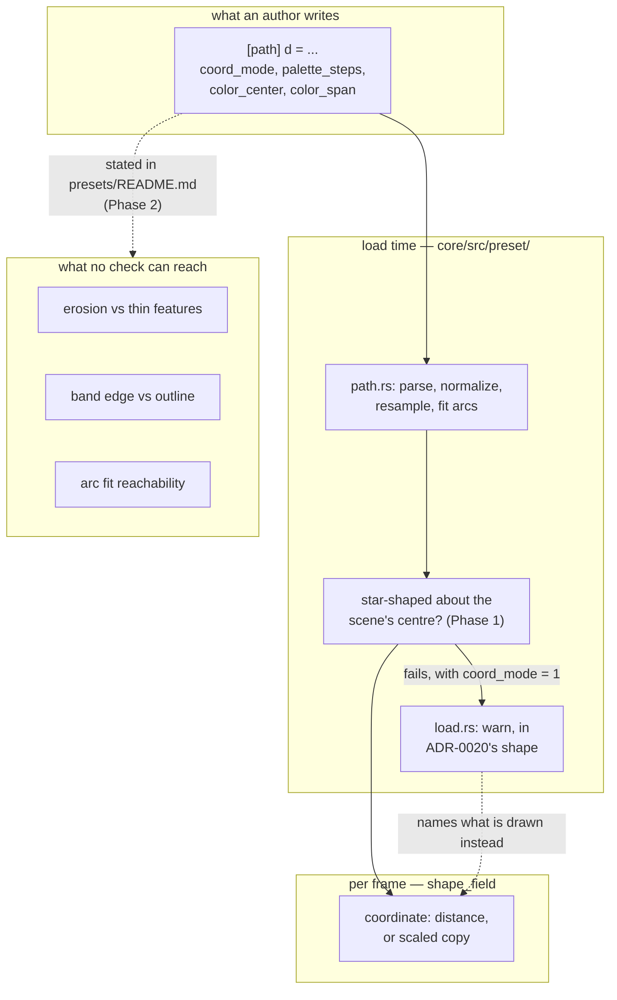

# 0160 — The silhouette's preconditions stop being silent

> **Status:** draft
> **Created:** 2026-09-09
> **Owner skill(s):** dev, human
> **Related ADRs:** [0179](../adrs/0179-a-precondition-is-checked-at-load-or-it-is-written-down.md) (a precondition is checked at load, or it is written down)
> **Depends on:** [Plan 0092](done/0092-the-engine-draws-an-authored-path.md) (hard — `[path]` is the surface this is about, and 0092's own Phase 7 fixes the axis these figures are authored in)

## TL;DR

Four preconditions on the `shape_field` silhouette surface are neither checked nor documented, and
all four were found in one session by the first author to draw their own outline. One is
mechanically decidable and becomes a load-time warning against the **geometry** rather than against
the roster name; three cannot be checked and become prose in `presets/README.md`, next to the
parameters they constrain. ADR-0179 is the rule; this plan is the four instances of it.

## Context & problem

Plan 0092's `[path]` table replaced a closed roster of five names with arbitrary authored geometry.
Every one of the five — `disc`, `ring`, `polygon`, `star`, `heart` — is convex or near enough, broad
in every direction, and known to the engine by name. Preconditions that were universally true of
that set, or checkable against it by name, are now easy to violate, and unlike the parser's `A` and
multi-subpath refusals **they fail silently with a plausible wrong picture**.

The four, as the content lane met them:

1. **`coord_mode = 1` degenerates on a figure that is not star-shaped about its centre.** The
   scaled-copy coordinate needs a boundary radius along a ray; a koi's ray crosses its fins more than
   once, the shader takes the outermost, and the figure collapses to a dot inside four huge rays.
   `load.rs` already warns for exactly this geometry — but it tests `shape == RING_SHAPE`, and
   `presets/README.md` carries a block quote teaching that the `ring` is the special case, which
   actively reassures an author that their own contour is fine.
2. **Inward offsets erode, so thin features die.** At three interior bands a koi's fins and tail were
   eaten and it read as a lumpy blob; a lion's mane tufts likewise. Both ship at two. A maple
   survives three only because its lobes are broad. This decided the interior band count on every
   figure built against the surface, and nothing says so.
3. **The band-alignment rule is load-bearing and undocumented.** A band edge sits at every multiple
   of `1 / palette_steps`; the outline sits at `color_center + color_span`. Put the second on the
   first and the silhouette reads crisp; miss it and the figure dissolves — measured over four spans,
   with the leaf simply gone at 5 and 8 interior bands. It silently **forbids binding `color_span` at
   all** and restricts `color_center` to whole-band increments. `gamma` is the one safe interior
   binding, because at the outline `d = 1` and `1^g = 1`, so it provably cannot move the edge.
4. **The arc chain is unreachable for any real silhouette.** `presets/README.md` says *"Nothing in
   the table selects this — a smooth figure gets it"*. The actual gate in `path.rs` discards the fit
   when `pieces > MAX_ARC_PIECES` **or** `pieces * 2 > points.len()`, against an `ARC_FIT_BUDGET`
   fixed at the tightest figure size an author would reach for. A 39-vertex contour authored with
   **every** vertex smooth was discarded and rendered faceted, identically to a spiky maple. The axis
   is total curve detail at a fixed tolerance, not smoothness, and the document says otherwise.

## Decision

ADR-0179: a precondition an author can violate is **checked at load and named, or written down**;
which one applies is decided by whether the engine can see the violation. Item 1 is decidable from
data the engine already holds, so it becomes a check against the geometry, and the `ring` branch
becomes one instance of it. Items 2, 3 and 4 cannot be checked — 3 in particular is a property of a
binding that may sweep through the frame — so they become prose.

Item 4 is a **documentation correction, not a capability change.** Whether `ARC_FIT_BUDGET` or
`MAX_ARC_PIECES` should move is a measurement question with its own cost curve, and this plan does
not open it; it makes the document true about the engine as built.

## Implementation phases

### Phase 1 — The precondition is tested on the contour, not on the name

- **Owner skill:** dev
- **Files:** `core/src/preset/path.rs`, `core/src/preset/schema/load.rs`,
  `core/src/render/scenes/shape_field.rs`, and the tests beside each
- **Done when:**
  - **`PathShape` carries whether the contour is star-shaped about the centre the scene measures
    from**, computed once at parse over at most `MAX_SAMPLES` points, and recorded on the shape the
    way the normalization's centre and factor already are. It is a property of the geometry, so it is
    computed where the geometry is, not at the scene.
  - **The centre it tests about is the one `coord_mode = 1` actually divides by.** Read it out of the
    shader's own coordinate rather than assuming the origin: a test about the wrong point is a test
    that convicts good figures and clears bad ones, and the normalization means the two are close
    enough to look right in every figure that is broad in every direction — which is every figure
    already in the suite.
  - **The tolerance is chosen against real contours and recorded in the code with what it was
    measured on.** A contour that is star-shaped by a hair is the case that decides it. State the
    property the tolerance holds; do not freeze a number the plan has not earned.
  - **`load.rs` warns on the geometry, and the `ring` branch is one instance of it rather than a
    branch beside it.** One condition, one message shape, in ADR-0020's warn-but-load form. The
    message names what was found and what is drawn instead — the distance coordinate — the way the
    existing `ring` message does.
  - **The scene draws the distance coordinate for a contour that fails the test**, so the warning and
    the picture agree. A warning beside a degenerate figure is worse than either alone.
  - **A star-shaped authored contour is unaffected** — `coord_mode = 1` is exactly the capability a
    figure like that wants, and a test that convicts it has failed. Pinned by a test with one
    star-shaped and one non-star-shaped literal, asserting opposite verdicts.
  - The full suite is green and no golden moves: every path literal in the suite today is broad in
    every direction and passes the test.

### Phase 2 — The three unhookable constraints are written down

- **Owner skill:** dev
- **Files:** `presets/README.md`
- **Done when:**
  - **Erosion is stated where the interior bands are documented**, in terms of what an author does
    about it: the band count is set by the figure's **thinnest** feature, not by its overall size,
    and a figure with fins or tufts takes fewer bands than a figure with broad lobes. Cite the
    measured cases — two bands for a koi and a lion, three for a maple — as the observations they
    are, not as a rule with a number.
  - **The band-alignment rule is stated with its arithmetic**: a band edge at every multiple of
    `1 / palette_steps`, the outline at `color_center + color_span`, and what it costs to miss —
    a dissolving silhouette rather than a subtly different one.
  - **Its two consequences are stated as consequences, because they are what an author acts on:**
    binding `color_span` is forbidden on a figure whose edge must stay crisp, and `color_center`
    moves in whole-band increments. **`gamma` is named as the safe interior binding**, with the
    reason — at the outline `d = 1` and `1^g = 1`, so it cannot move the edge — because the reason is
    what tells an author whether a fifth binding they think of is safe.
  - **The arc-chain paragraph is corrected.** *"A smooth figure gets it"* is false. State the real
    gate: the fit is kept only if it collapses the piece count against a tolerance fixed at the
    tightest figure size, so **detail** is the axis and a detailed contour is discarded however
    smooth it is. Name the measured cases that do fit — 6 to 24 pieces from 2 to 4 cubics — so the
    reachable band is visible, and say plainly that a real silhouette is usually outside it.
  - **No count and no threshold is stated that the plan has not measured.** Where the honest answer
    is "usually not", write that.
  - `node scripts/toc.mjs` is clean, and `node scripts/check-doc-links.mjs` passes.

### Phase 3 — The document is checked against the engine, once

- **Owner skill:** human
- **Done when:**
  - **An author reads Phase 2's three sections and builds one figure against them** — not a review of
    the prose, a use of it. The question is whether the constraints as written are enough to choose a
    band count and a palette configuration without rendering to find out.
  - **A verdict on whether Phase 1's warning arrives at the right moment.** It fires at load, which is
    before the author has seen anything; the alternative reading is that it needs to be visible where
    the figure is, and that would be a different plan.
  - Gates nothing. May carry forward to `docs/design-backlog.md` as new entries.

## Architecture diagram

## Risks & open questions

- **The centre the test uses may not be the centre the shader divides by**, and the two agree on
  every figure in the suite today. That is the ADR-0037 shape one level over: two sources that
  coincide on the configuration we test at. Phase 1's second done-when exists for it, and a
  non-star-shaped literal in the suite is what makes the disagreement observable at all.
- **Star-shapedness is a binary verdict on a continuous property.** A figure just inside the
  tolerance renders correctly and warns; a figure just outside renders the distance and warns. The
  warning is honest in both cases, but an author near the boundary will see it flicker between
  authoring sessions on unrelated edits to `d`. If that turns out to be common the answer is a
  quieter test, not a tighter one.
- **Phase 2 is prose against a surface with no gate.** The arc-chain sentence being wrong is the
  proof; nothing stops the replacement going stale the same way. ADR-0179 records this as a cost
  rather than solving it.
- **The band-alignment rule may be a symptom.** An outline that has to be manually aligned to a band
  edge is an engine deciding a palette boundary and a geometry boundary independently. Stating the
  rule is the right move now; whether the scene should place the outline on an edge by construction
  is a question this plan deliberately leaves open, and a real answer to it would retire Phase 2's
  second and third bullets.

## What this plan does NOT do

- **It does not move `ARC_FIT_BUDGET` or `MAX_ARC_PIECES`.** Making the arc chain reachable for a
  real silhouette is a measurement question with a per-pixel cost curve behind it, and Plan 0092
  Phase 2 already found that this surface's construction-based estimates were an order of magnitude
  out. It needs its own plan and its own measurement.
- **It does not fix the Y axis.** That is Plan 0092 Phase 7, and this plan's figures are authored in
  whatever frame that phase settles.
- **It does not touch `--report`.** A `beat_index`-driven preset measuring as inert is
  design-backlog 0192, and its fix perturbs an instrument the close ceremony curates on.
- **It does not add a gate for documented constraints.** Nothing here tests that Phase 2's prose
  stays true.
- **It does not refuse anything.** Every combination that loads today still loads.
