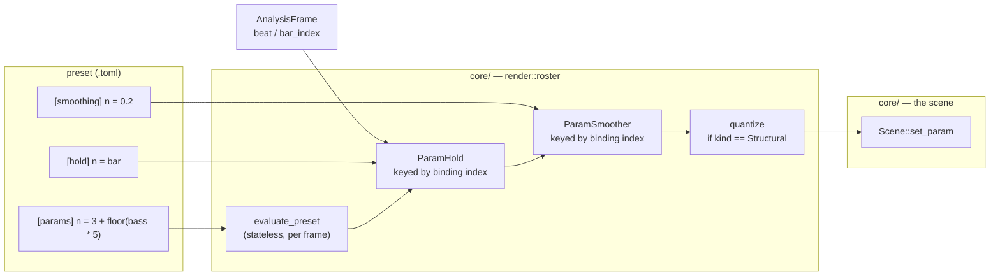

# 0161 — The structural parameter is held

> **Status:** draft
> **Created:** 2026-09-09
> **Owner skill(s):** dev
> **Related ADRs:** [0180](../adrs/0180-a-mathematical-world-joins-a-system-as-a-family-and-a-structural-parameter-is-held.md)
> (rules 2 and 4)

## TL;DR

A preset gains a `[hold]` table that re-samples a binding only on a named musical edge — `beat`,
`bar`, or a period in seconds — and holds the value between edges. `ParamSpec` gains a `kind` that
says whether a parameter is **Structural** (integer meaning, rounded before the scene sees it) or
**Modal** (continuous, as every parameter is today), and the generated reference prints the two
groups apart. The first user-visible behaviour: `n = "3 + floor(bass * 5)"` with `[hold] n = "bar"`
makes a rose change its petal count once a bar instead of flickering at frame rate.

## Context & problem

The engine's structural integers are bindable and effectively unbindable. `parametric.rs:341`
declares `n` as an `f32` documented as "the rose's petal number"; `d`, `samples`, `points`,
`elements`, `palette_steps` and `kaleido_order` are the same shape. Bound the natural way they
re-pick the figure every frame, which reads as flicker rather than as music.

Across the 84 shipped presets, every structural integer is a constant string except two, and both
built sample-and-hold by hand out of nested `select` over a hardcoded three-value menu —
`curve_nightbloom.toml:49` and `fragment_supernova.toml:44`. Eighty-two others gave up.

`docs/presets.md` already states the gap in its own words, at the head of the `[latch]` section:
*"`[smoothing]` shapes a value over time but never holds one."* `[latch]` answered the **event**
half of that sentence — arm on one thing, fire on another. Nothing answers the **value** half.

This plan is the shared prerequisite of the mathematics wave: Plans 0162, 0163 and 0164 each add
worlds whose defining parameters are integers on a musical edge (petal counts, Chladni mode numbers,
automaton rule indices), and all three are worth much less without it.

## Decision

We build `[hold]` as a per-binding table in `[smoothing]`'s shape, and `ParamKind` as a field on
`ParamSpec`, per ADR-0180 rules 2 and 4. The two are orthogonal: `[hold]` reaches any binding,
`kind` governs quantization and documentation.

The per-frame order is **evaluate → hold → smooth → quantize**. Evaluation is unchanged and stays
stateless; the hold gates which frame's value is kept; `[smoothing]` then eases toward the held
value exactly as it eases toward any other; quantization is last, so a `Structural` parameter that
is *also* smoothed steps through the intervening integers rather than landing fractionally. That is
a documented behaviour, not a defect — an author who wants a clean jump leaves the parameter out of
`[smoothing]`.

We rejected a `sample_hold(x, trigger)` grammar function (ADR-0180 Alternative C): the grammar is
stateless by rule, and a binding may be evaluated per element or per vertex, so a stateful function
inside it would depend on an evaluation cadence this engine does not fix.

## Architecture diagram



## Implementation phases

### Phase 1 — the `[hold]` table
- **Owner skill:** dev
- **What:** The schema, the parse, and the per-binding sample-and-hold. `ParamHold` lives beside
  `ParamSmoother` in `core/src/render/roster.rs`, keyed by the same binding index, because that is
  already the home of "the per-binding smoother" and a hold that drifted out of step with the
  binding it holds is the failure mode both are placed there to avoid.
- **Edge vocabulary:** `beat` (a frame where the analysis frame's beat gate fired), `bar` (a change
  in `bar_index`), or a bare number read as a period in seconds. Any other string is a load error.
- **First frame:** a held binding takes its value on the frame the preset becomes active, before any
  edge — a preset must never open on a default it never asked for.
- **Files touched:** `core/src/preset/schema/` (the table), `core/src/preset/mod.rs`,
  `core/src/render/roster.rs`, `core/src/render/evaluate.rs`.
- **Done when:** a preset binding `n = "3 + floor(bass * 5)"` under `[hold] n = "bar"` produces a
  value that is constant across every frame within one `bar_index` and differs across at least two
  bars on a stimulus whose bass varies; and a preset with no `[hold]` table produces the identical
  per-frame value it produces today.

### Phase 2 — `ParamKind` and quantization
- **Owner skill:** dev
- **What:** `ParamSpec` gains `kind: ParamKind` (`Modal` | `Structural`). Every existing spec is
  written `Modal` in this phase — no behaviour changes here, deliberately. `Structural` rounds the
  post-smoothing value once, CPU-side, before `set_param`, which is what `palette_steps` already
  does by hand at its own call site.
- **The guard has to grow with the field:** `declared_params_match_set_param` in
  `core/tests/preset.rs` compares names only, so it would accept a wrong `kind` silently. Extend it,
  or the field is unenforced from the day it lands.
- **Files touched:** `core/src/render/scenes/mod.rs`, every scene's `PARAMS` block,
  `core/tests/preset.rs`.
- **Done when:** the field exists on all twelve systems' specs, every one reads `Modal`, and the
  full suite is byte-identical to the pre-phase tree — a phase that adds a field and moves a pixel
  has done two things.

### Phase 3 — the audit: which parameters are actually structural
- **Owner skill:** dev
- **What:** Go parameter by parameter through the candidates — `n`, `d`, `samples`, `points`,
  `elements`, `palette_steps`, `kaleido_order`, `mirror_order`, and any other integer-documented
  spec the sweep finds — and mark `Structural` **only** where the scene already treats the value as
  an integer. Where a scene currently consumes the fractional part meaningfully, the parameter stays
  `Modal` despite an integer-sounding name, and the reason goes in its `doc`.
- **This is the phase that can move a golden**, which is why it is its own phase and not part of
  Phase 2: a parameter that begins rounding where it used to interpolate changes its scene's output.
  Any golden that moves is a **finding to report, not a baseline to re-bless** — report it and stop.
- **Files touched:** the scene `PARAMS` blocks marked in Phase 2.
- **Done when:** every candidate parameter carries a deliberate `kind`, the implementation log names
  each one that stayed `Modal` and why, and no golden moved. If one moved, the log says which and
  the phase stops there.

### Phase 4 — the reference prints the two surfaces
- **Owner skill:** dev
- **What:** The generated parameter reference (ADR-0170) groups each system's rows under
  **Structural** and **Modal** headings instead of one flat table, per ADR-0180 rule 4.
- **Files touched:** the reference generator, `presets/README.md` (regenerated, not hand-edited).
- **Done when:** `presets/README.md`'s per-system tables carry both groups, the generator is the
  only thing that wrote them, and the ADR-0170 drift check still passes.

### Phase 5 — `--report` learns that a binding can be held
- **Owner skill:** dev
- **What:** `--report`'s reactivity reading credits a binding for naming an audio variable. A held
  binding names one and may take its value once a bar, so the reading would over-credit it — the
  same class as [backlog 0192](../design-backlog.md), where `--report` cannot see a
  `beat_index`-driven response and scores a deliberately musical preset as inert. This phase does
  **not** fix 0192; it stops this plan from widening it. The reading reports a held binding as held,
  with its edge, rather than scoring it as if it were per-frame.
- **Files touched:** the `--report` path under `standalone/`.
- **Done when:** `shot --presets presets --report` names the hold edge for every held binding in a
  preset that declares one, and the reactivity figure for an unheld preset is unchanged.

### Phase 6 — the documentation sweep
- **Owner skill:** dev
- **What:** `docs/presets.md` gains a `[hold]` section next to `[latch]`, opening from the same
  sentence that already frames the gap. It must state, at the table, that `bar` rides the
  confidence-gated downbeat estimator, which locks ~3 % of audible time
  ([backlog 0042](../design-backlog.md)) and is otherwise counter-derived — an author reading "hold
  on the bar" will not guess that. `presets/README.md`'s hand-written structural tables gain the
  Structural/Modal vocabulary. `docs/configuration.md` is untouched: this adds no flag.
- **Files touched:** `docs/presets.md`, `presets/README.md`.
- **Done when:** `node scripts/toc.mjs --check`, `node scripts/check-doc-links.mjs` and
  `node scripts/check-reader-prose.mjs` all pass, and the `[hold]` section states the `bar` caveat.

## Data shapes

```rust
// illustrative — not the final interface

/// What a parameter is *for*, which decides whether it quantizes and which
/// group the generated reference prints it under (ADR-0180 rule 2).
pub enum ParamKind {
    /// Continuous. Every parameter that exists before this plan.
    Modal,
    /// Integer meaning — rounded once, after smoothing, before `set_param`.
    Structural,
}

pub struct ParamSpec {
    pub name: &'static str,
    pub default: f32,
    pub range: Option<[f32; 2]>,
    pub doc: &'static str,
    pub kind: ParamKind,   // new
}

/// A `[hold]` entry. Parsed from a per-binding string or bare number, in the
/// shape `[smoothing]` already uses.
pub enum HoldEdge {
    Beat,
    Bar,
    /// A bare number in the TOML: seconds between re-samples.
    Period(f32),
}

/// Keyed by binding index, exactly like `ParamSmoother`, and living beside it
/// in `render::roster` for the same reason.
struct ParamHold {
    edge: Option<HoldEdge>,
    held: f32,
    /// `bar_index` / beat count / elapsed seconds at the last re-sample,
    /// depending on `edge`. `None` until the first frame the preset is active.
    last: Option<f32>,
}
```

## Risks & open questions

- **`bar` is unreliable on most material.** The downbeat estimator locks ~3 % of audible time
  ([backlog 0042](../design-backlog.md)); the rest of the time `bar_index` is counter-derived. The
  capability is still correct — it steps on *something* musical — but "hold on the bar" promises
  more than the tracker delivers. Mitigation is documentation (Phase 6), not code; fixing the
  tracker is not this plan.
- **A held binding weakens static reachability.** `docs/presets.md` already records that the
  reachability walk cannot see through `[latch]`. A hold is worse in one specific way: the analyzer
  sees a live expression whose value the engine may not have taken this frame, so a preset can
  appear more reactive than it is. Phase 5 is the containment; it is not a proof.
- **Phase 3 is the one that can go wrong quietly.** A parameter marked `Structural` that the scene
  was reading fractionally changes output on a preset nobody is looking at. The phase's done-when
  makes a moved golden a stop, not a re-bless, for exactly this reason.
- **Order-of-operations is a decision, not an obvious fact.** Hold-then-smooth-then-quantize means a
  smoothed structural parameter walks through intermediate integers. If that reads badly in practice
  on a real preset, the alternative is hold-then-quantize-then-smooth, which lands fractionally and
  needs a second rounding — surface it rather than switching silently.
- **`[hold]` on a per-element or per-vertex binding is undefined.** `[smoothing]` already cannot ease
  those (`docs/presets.md` states both restrictions). Take the same posture: a `[hold]` entry naming
  a per-element or per-vertex binding is a **load error**, not a silent no-op.

## What this plan does NOT do

- **It does not add a phrase counter.** The vocabulary is `beat`, `bar`, and a period in seconds.
  `phrase` would need a counter this engine does not have, and inventing one here would bundle a
  DSP decision into a preset-surface plan.
- **It does not fix [backlog 0192](../design-backlog.md)** — `--report`'s blindness to
  `beat_index`-driven response. Phase 5 keeps this plan from widening it.
- **It does not fix the downbeat tracker** ([backlog 0042](../design-backlog.md)).
- **It does not retune any shipped preset.** The two hand-rolled staircases in
  `curve_nightbloom.toml:49` and `fragment_supernova.toml:44` become one line each *once someone
  rewrites them*, and that is content work in the `preset-author` lane — see Followups.
- **It adds no scene and no family.** Those are Plans 0162, 0163 and 0164.

## Implementation log

> Written by `dev` — one row per phase as that phase's commit lands, and the close block after the
> last one. **The phases above are the contract; everything here is what happened.**

**Lane:** _(to be filled by `dev`)_

| phase | owner | state | commit |
|---|---|---|---|
| 1 — the `[hold]` table | dev | not started | |
| 2 — `ParamKind` and quantization | dev | not started | |
| 3 — the audit | dev | not started | |
| 4 — the reference prints the two surfaces | dev | not started | |
| 5 — `--report` learns about holds | dev | not started | |
| 6 — the documentation sweep | dev | not started | |

### Notes

### Close triggers

- **`presets/` touched:**
- **Plan header `Closes:`** none
- **What shipped:**
- **Operator docs touched:**
- **Backlog probes (`node scripts/check-backlog-claims.mjs`):**
- **Full suite:**
- **Outstanding `human` phases:**

## Followups (after this lands)

- Route the two hand-rolled staircases to `preset-author`: `curve_nightbloom.toml:49`'s
  three-value `select` nest and `fragment_supernova.toml:44`'s three-step ladder are both a `[hold]`
  line now. This is exactly the close-ceremony step-3b class — a preset written around a defect the
  plan just fixed — so it belongs in the close notes as well as here.
- Decide whether `[hold]` should be reachable from `[layer.params]` on both layers independently.
  The plan assumes yes by construction (bindings are indexed per layer); confirm it is tested.
