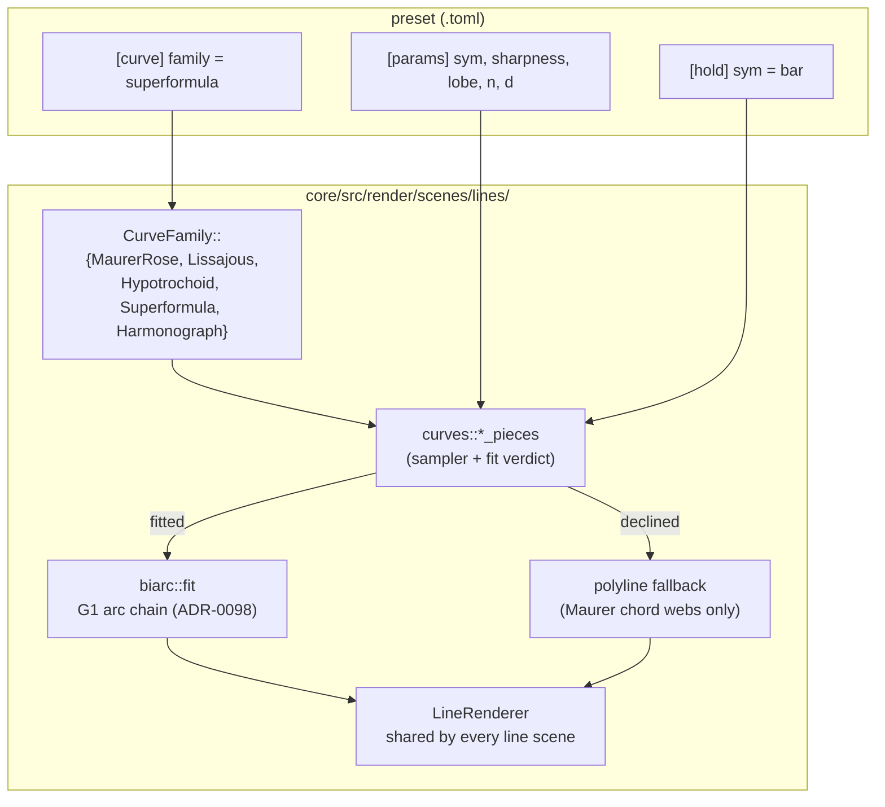

# 0162 — The curve families

> **Status:** in-progress
> **Created:** 2026-09-09
> **Owner skill(s):** dev
> **Related ADRs:** [0180](../adrs/0180-a-mathematical-world-joins-a-system-as-a-family-and-a-structural-parameter-is-held.md)
> (rule 1 — a new world joins a system as a family),
> [0007](../adrs/0007-line-geometry-generators.md) (the `CurveFamily` seam this widens),
> [0029](../adrs/0029-parametric-curve-shape-params.md) (which rejected the superformula on a
> premise this plan spends),
> [0098](../adrs/0098-the-line-renderer-draws-arcs-as-per-pixel-distance-fields.md) (the arc fit every new family
> inherits for free)
> **Depends on:** [0161](done/0161-the-structural-parameter-is-held.md) — the integer levers below are
> worth binding only once `[hold]` exists.

## TL;DR

`CurveFamily` goes from one variant to five: the existing `maurer_rose` plus **Lissajous**,
**hypotrochoid/epicycloid**, **superformula** and **harmonograph**. All four are new arms on the
existing `parametric_curve` scene, drawn through the same `LineRenderer`, coloured through the same
palette, and — unlike the Maurer chord web — fitted to G1 arc chains by the biarc fitter that
already exists, so they arrive smooth rather than faceted. This is
[`generative-techniques-catalogue.md`](../generative-techniques-catalogue.md)'s number-one
payoff-per-effort item, unbuilt since 2026-07-25.

## Context & problem

`core/src/render/scenes/lines/mod.rs:246` carries the whole of the engine's parametric-curve
vocabulary:

```rust
pub enum CurveFamily {
    /// The Maurer rose — `sin(n * theta)` walked at a fixed angular step.
    MaurerRose,
}
```

Its own doc comment says *"Extend as Plan 0010's follow-ups add curve families (epicycloids,
Lissajous, ...)"*. Those follow-ups never came. Five shipped presets name `parametric_curve` and all
five draw the same figure with different numbers, which is a concrete instance of the roadmap's
*"~55 % of the library is one template per family with different numbers"* finding.

The seam to widen is already the right shape. `parametric.rs:525` and `:537` are two `match
self.family` arms — one choosing the arc-fitted path, one the polyline fallback — so a family is a
sampler plus a fit decision, not a new scene. And the arc fitter is generic over a sampled outline
([ADR-0098](../adrs/0098-the-line-renderer-draws-arcs-as-per-pixel-distance-fields.md)); `biarc.rs:13` already
breaks the chain at genuine corners, so a superformula's cusps survive it.

The one thing that made this unattractive before is gone. ADR-0029 rejected the superformula as
"more than the routed need" — [`roadmap-visual-richness.md`](../roadmap-visual-richness.md) replaced
that premise, and [ADR-0180](../adrs/0180-a-mathematical-world-joins-a-system-as-a-family-and-a-structural-parameter-is-held.md)
records the replacement as a decision.

## Decision

We add four `CurveFamily` arms to `parametric_curve`. Each supplies a sampler over `theta` and a fit
verdict; the four new ones all verdict **true** — they are curves, not chord webs, so they take
ADR-0098's arc path unconditionally and the `corner_fraction` heuristic that guards the Maurer case
is not consulted for them.

Parameter surface: `n`, `d` and `phase` are **reused** with family-specific meaning, following the
`attractor` precedent where `a`..`d` mean different things per family
(`particles/family.rs:84`), and four genuinely new levers join for the shapes that need them —
`sym`, `sharpness`, `lobe`, `pen`, `decay`. Per
[ADR-0180](../adrs/0180-a-mathematical-world-joins-a-system-as-a-family-and-a-structural-parameter-is-held.md)
rule 4 the generated reference names the family each one reads on, so an inert parameter is visibly
inert.

We rejected giving each family its own `SystemKind` (ADR-0180 Alternative A) and giving each its own
private parameter namespace (it would fork the `[curve]` table five ways for four numbers).

## Architecture diagram



## Implementation phases

### Phase 1 — the family seam takes a second arm
- **Owner skill:** dev
- **What:** Generalize the two `match self.family` sites in `parametric.rs` into a dispatch a family
  can be added to without touching the scene, and land **Lissajous** through it as proof. Lissajous
  is the right first arm because it needs no new parameters at all: `n` is the x frequency, `d` the
  y frequency, `phase` the offset between them.
- **`maurer_rose` must not move.** It keeps its `corner_fraction` verdict, its polyline fallback and
  its exact sampling. The five shipped curve presets are goldens.
- **Files touched:** `core/src/render/scenes/lines/mod.rs`,
  `core/src/render/scenes/lines/curves.rs`, `core/src/render/scenes/lines/parametric.rs`.
- **Done when:** `family = "lissajous"` with `n = 3`, `d = 2` draws the 3:2 Lissajous figure as a
  closed G1 arc chain with no tangent break; every `maurer_rose` golden is byte-identical; and an
  unknown family name is still rejected at load rather than falling back to a default.

### Phase 2 — hypotrochoid and epicycloid
- **Owner skill:** dev
- **What:** One sampler covering both, because they are the same construction with the rolling
  circle inside or outside: `n` is the radius ratio, `d` the number of cusps, and a new **`pen`**
  parameter is the tracing point's distance from the rolling circle's centre — `pen = 1` is the
  cycloid proper, `pen < 1` the curtate form, `pen > 1` the prolate. Sign of `n` selects epi vs hypo,
  so no second family name is spent.
- **Files touched:** `curves.rs`, `parametric.rs` (`PARAMS` + `set_param`), `mod.rs`.
- **Done when:** `family = "hypotrochoid"` reproduces the classic spirograph figure; `pen` sweeps
  continuously from curtate through prolate without the sampler folding or the fitter breaking; and
  a negative `n` draws the epicycloid form.

### Phase 3 — the superformula
- **Owner skill:** dev
- **What:** Gielis' superformula, `r(theta) = (|cos(m·theta/4)/a|^n2 + |sin(m·theta/4)/a|^n3)^(-1/n1)`,
  as a family with **`sym`** (the integer `m`, Structural), **`sharpness`** (`n1`) and **`lobe`**
  (`n2`/`n3`, bound together on one lever with `d` skewing them apart). This is the family that
  produces starfish, flowers, polygons and rounded shells from four numbers, and it is the one that
  most rewards a `[hold]` on `sym`.
- **Guard the exponents.** `n1` near zero sends `r` to infinity; the sampler clamps rather than
  emitting `inf`, because a `NaN` vertex is a hot-path defect and the plan's own grammar docs say a
  `NaN` parameter produces undefined-looking visuals.
- **Files touched:** `curves.rs`, `parametric.rs`, `mod.rs`.
- **Done when:** `sym = 5` with a low `sharpness` draws a five-lobed star and a high `sharpness`
  rounds it toward a circle; no parameter combination inside the declared ranges emits a
  non-finite vertex; and `sym` bound under `[hold] sym = "bar"` changes the figure's symmetry once
  a bar and holds between.

### Phase 4 — the harmonograph
- **Owner skill:** dev
- **What:** The damped two-pendulum harmonograph — `x = A·sin(n·t + phase)·e^(-decay·t)`, `y` the
  same on `d` — with a new **`decay`** parameter. It is the only family whose figure *evolves along
  its own arc length* rather than closing, which makes it the family that best rewards
  `draw_progress`, already a parameter on this scene.
- **The fit verdict is conditional here, unlike Phases 1-3.** At `decay = 0` the trace closes and is
  a curve; at high `decay` the inward spiral's later turns collapse under the sampler's resolution.
  Take the verdict from the sampled outline, not from the family.
- **Files touched:** `curves.rs`, `parametric.rs`, `mod.rs`.
- **Done when:** `decay = 0` draws the closed Lissajous-like figure and a positive `decay` spirals it
  inward over the trace; the fitter is not handed a run of coincident points at high `decay`; and
  `draw_progress` sweeps the trace from start to end.

### Phase 5 — the reference tells the truth about a family-dependent range
- **Owner skill:** dev
- **What:** `ParamSpec.range` is one pair per parameter, and after Phases 1-4 `n` reads `1..24` on a
  rose, `1..12` on a Lissajous and `-8..8` on a hypotrochoid. A single printed range would be a
  claim nothing holds — which is the exact posture `ParamSpec`'s own doc comment takes about
  unbounded parameters. The generated reference (ADR-0170) prints a per-family range for a parameter
  whose meaning is family-specific, alongside the Structural/Modal grouping
  [0161](done/0161-the-structural-parameter-is-held.md) Phase 4 adds.
- **Files touched:** the reference generator, `core/src/render/scenes/mod.rs` (whatever carries the
  per-family range), `presets/README.md` (regenerated).
- **Done when:** `presets/README.md`'s `parametric_curve` table states `n`'s range per family, no
  hand edit produced any of it, and the ADR-0170 drift check passes.

### Phase 6 — the documentation sweep
- **Owner skill:** dev
- **What:** `docs/presets.md`'s `[curve]` table lists five families with one line each on what `n`,
  `d` and `phase` mean under each. `docs/preset-guide.md` gets one picture per new family, through
  `scripts/docs-shots.mjs`. `presets/README.md` is regenerated by Phase 5, not hand-edited.
- **Files touched:** `docs/presets.md`, `docs/preset-guide.md`, `docs/images/`.
- **Done when:** the family table is complete, the guide's pictures are regenerated rather than
  drawn, and `node scripts/toc.mjs --check` plus `node scripts/check-doc-links.mjs` pass.

## Data shapes

```rust
// illustrative — not the final interface

pub enum CurveFamily {
    MaurerRose,
    Lissajous,
    /// Epicycloid and hypotrochoid in one sampler; the sign of `n` picks which.
    Hypotrochoid,
    Superformula,
    Harmonograph,
}

/// What a family arm supplies. The scene owns the buffers, the mirror stage and
/// the colour ramp; a family owns only the walk and whether it is a curve.
struct FamilySample {
    /// Fills `points` in the frame `maurer_rose` already draws in.
    sample: fn(&CurveParams, &mut Vec<[f32; 2]>),
    /// `true` -> take ADR-0098's arc path. Constant `true` for Lissajous,
    /// Hypotrochoid and Superformula; computed from the outline for
    /// Harmonograph (a hard `decay` collapses the later turns) and from
    /// `corner_fraction` for MaurerRose, which is the existing behaviour.
    fits: fn(&CurveParams, &[[f32; 2]]) -> bool,
}
```

## Risks & open questions

- **`n` and `d` mean five different things.** This is the `attractor` precedent working as designed,
  and it is still the plan's biggest legibility cost. Phase 5 is the containment; if the per-family
  range turns out not to be expressible in the generated reference, the fallback is a hand-written
  family table in `docs/presets.md` and a `None` range in the spec — never one invented number.
- **Five inert parameters land on a scene whose presets do not use them.** `pen`, `sym`,
  `sharpness`, `lobe` and `decay` are each meaningful for one or two families. ADR-0180 accepts this
  cost explicitly; the check is that no existing preset's behaviour changes because a new parameter
  defaults to something the rose reads.
- **The superformula can produce a degenerate figure inside its own declared range.** Small `n1`
  with large `n2`/`n3` sends the radius past any sane frame. Clamping in the sampler is the answer,
  and the clamp must be a *property* the tests can state (every vertex finite and inside a stated
  radius), not a measured number.
- **`max_segments` is a `TierConfig` cap** and a superformula at high `sym` with high `samples` will
  reach it. The existing overflow path (`mirror_overflow`) already reports truncation; confirm the
  new families route through it rather than silently drawing a partial figure.
- **`family` is not bindable, by construction.** A preset picks it in `[curve]`. Changing family on
  a beat would mean rebuilding the sampler mid-frame; it is out of scope and the load error for an
  unknown name stays.

## What this plan does NOT do

- **It does not add a curve family that needs 3D.** Torus knots and spherical harmonics stay with
  the attractor idiom, which already has a projection.
- **It does not touch `lsystem` or `star_pattern`**, the other two generator scenes.
- **It does not author presets.** Four new families deserve worlds built on them; that is
  `preset-author`'s lane and it is the natural follow-on once this lands.
- **It does not add `[hold]`** — that is [0161](done/0161-the-structural-parameter-is-held.md), which
  this plan depends on.

## Implementation log

> Written by `dev` — one row per phase as that phase's commit lands, and the close block after the
> last one. **The phases above are the contract; everything here is what happened.**

**Lane:** `batch/2026-09-11`, worktree `C:\Users\Igor Konovalov\WORK\rlx-batch` (unattended batch run)

| phase | owner | state | commit |
|---|---|---|---|
| 1 — the family seam takes a second arm | dev | done | 997f7c5 |
| 2 — hypotrochoid and epicycloid | dev | done | 1e23aef |
| 3 — the superformula | dev | done | 792525a |
| 4 — the harmonograph | dev | done | 6376e88 |
| 5 — per-family ranges in the reference | dev | done | caeb435 |
| 6 — the documentation sweep | dev | done | committed with this row |

### Notes

- Phase 1: `RoseParams` is renamed `CurveParams`, since every family now reads it. `maurer_rose_pieces`
  is `#[cfg(test)]` - the scene reaches the rose through `curves::fit_walk`, as it reaches every family.
- Phase 1: a fitted Lissajous is G1 exactly at arc-to-arc joints. Where `biarc` emits a straight
  `Line` through an inflection (the MAX_RADIUS fallback), the joint departs from the requested tangent
  by up to `asin(L / 2R)` - measured at 0.06 degrees on the 3:2 figure. The test asserts that bound,
  and restates `biarc`'s private `MAX_RADIUS` as `FLAT_RADIUS = 64` in `curves/tests.rs`.
- Phase 1: byte identity of the rose goldens was checked by re-blessing `golden` on this machine.
  `parametric_curve`, `line_joint_zigzag` and every `composite_*` baseline came back byte-identical
  to the committed files. Nine unrelated baselines (`backdrop_*`, `shape_*`, `warp_mesh*`) differed,
  already did before this plan, and were restored untouched.
- Phase 1: a new family reads `phase` as a fraction of a turn (`phase * TAU`), which is what the
  `ParamSpec` doc and its `0..1` range state. The rose adds `phase` inside its sine in radians, which
  that doc does not say. Left as it was - an observation, not acted on.
- Phase 2 reads `n` as the signed radius ratio `R / r` (positive rolls inside) and `d` as the number
  of cusps walked, so the trace runs `d / |n|` turns of the fixed circle and closes when that is
  whole. The phase text gives both meanings without saying how they combine; this is the reading
  under which both hold at once. `|n|` is floored at `0.25`, `d` clamped to `1..1024` and `pen` to
  `0..16` - sampler safety bounds, not the printed ranges. `phase` turns the pen's starting angle.
- Phases 2-4 each regenerate `presets/README.md` (with `RLX_UPDATE_PARAM_REFERENCE=1`) when they
  add a parameter, because `the_parameter_reference_block_is_current` fails otherwise. Phase 5 is
  still the phase that changes what the generator prints.
- Phase 2 also fixes a Phase 1 doc comment on `CurveFamily`, which linked the crate-private
  `curves::arm` from public docs and failed `cargo doc` under `-D warnings`.
- Phase 3 reads `d` on the superformula as the skew ratio `n3 / n2` (`n3 = lobe * d`), clamped to
  `0..16`. `n`, `phase` and `radial_offset` are inert on this family. The scene default `d = 71` is the
  rose's, so an unbound `d` here clamps to the maximum skew. A superformula preset binds `d`, which
  every example in this plan does.
- Phase 3 computes the superformula's radius as `ln r` and divides by the walk's peak radius by
  subtracting logarithms, so every vertex is `exp(<= 0)` times `scale` - finite and inside `scale` by
  construction. The peak is taken over the whole trace, not the revealed prefix.
- Phase 3 touched `core/tests/preset.rs`, outside its file list: `("parametric_curve", "sym")` joins the
  hand-kept `STRUCTURAL` roster, which the kinds guard in `declared_params_match_set_param` fails
  without. `Gielis::of` rounds and clamps `sym` itself, per the audit rule that roster states.
- Phase 3's `[hold]` done-when is tested without a GPU. The test loads a real preset, then runs its
  binding through the render layer's `ParamHold`, the binding's `kind.quantize`, and the sampler, and
  reads the lobe count off the walk. It does not go through `Renderer::evaluate`.
- Phase 4 follows the plan's formula literally: `decay` damps per radian of `t`, `exp(-decay t)`. The
  trace runs a fixed `HARMONOGRAPH_TURNS = 4` turns of `t` (a constant, not a parameter), so an
  undamped closed figure is retraced four times. `decay` reads `0..0.5`; its default is `0.1`.
- Phase 4's verdict declines the fit when the walk holds a chord shorter than `MIN_CHORD` (1/64 px at
  1080p), or when more than `SMOOTH_CORNER_SHARE` of its vertices are corners. The declined walk draws
  as chained chords. At 720 samples the verdict flips inside `decay`'s printed range, and the test
  sweeps across that flip.
- Phase 4 fixed a Phase 1 defect in `periodic_walk`: closure was tested on position alone, so any
  trace that starts and ends at the origin was joined into a loop - which is every damped
  harmonograph at `phase = 0`. Closure now also requires the point one step past the end to land on
  sample 1, i.e. the trace is periodic.
- Phase 5: `scenes/mod.rs` carries the types (`FamilyRange`, `FamilyParam`) and a `family_params(label)`
  lookup. The `parametric_curve` table itself, `FAMILY_PARAMS`, sits beside `PARAMS` in
  `parametric.rs`, which is outside the phase's file list. Nine rows: `n`, `d`, `phase`,
  `radial_offset` and the five levers. Each row lists every family, and `None` means inert on that
  family.
- Phase 5 keeps `ParamSpec.range` for those nine parameters as declared: each is one of its families'
  ranges (the rose's for `n`, `d`, `phase`), and a test holds that. So the exported schema still
  carries one pair per parameter, and the studio sees no change. Only the generated reference prints
  the per-family cell. `the_published_reference_and_the_exported_schema_agree` now accepts a
  per-family cell when the schema's pair is one of its ranges.
- Phase 5 rewrote the `n`, `d` and `phase` doc lines in `parametric.rs` to name each family's reading.
  They had described the rose alone.
- Phase 6's pictures render teaching presets, because no shipped preset draws the four new families
  and the plan authors none. Four new files, `docs/examples/curves/*.toml`, sit outside the phase's
  file list. So does the manifest block added to `scripts/docs-shots.mjs`, which writes to
  `docs/images/curves/` - outside `gallery/`, whose flat stems `hygiene.rs` reads as system names.
- Phase 6 ran `node scripts/docs-shots.mjs` end to end. Only the four new images are committed; every
  previously committed image it rewrote was restored to its committed bytes. The run rewrote 18 of
  them: 13 of the 1280x720 renders across the families, `parametric_curve.png` included, plus five
  non-curve cards. All five `curve_*` preset cards re-rendered byte-identical. The same machine drift
  shows in the golden re-bless noted under Phase 1, and freshness of the existing set is ADR-0100's
  human duty, not this phase's.
- Phase 6: `docs/presets.md` gains a `### The [curve] table` section - a five-row table with `n`,
  `d`, `phase` and each family's own levers - and its systems row for `parametric_curve` now names
  the five families.

### Close triggers

- **`presets/` touched:**
- **Plan header `Closes:`** none
- **What shipped:**
- **Operator docs touched:**
- **Backlog probes (`node scripts/check-backlog-claims.mjs`):**
- **Full suite:**
- **Outstanding `human` phases:**

## Followups (after this lands)

- Route to `preset-author`: four new families with no worlds built on them. The superformula and the
  harmonograph in particular are the two most likely to produce something the library does not
  already have.
- The catalogue's pick-order item 1 is discharged by this plan; item 3 (fractal flames on the
  compute path) is still open and is now the cheapest unbuilt entry on that list.
