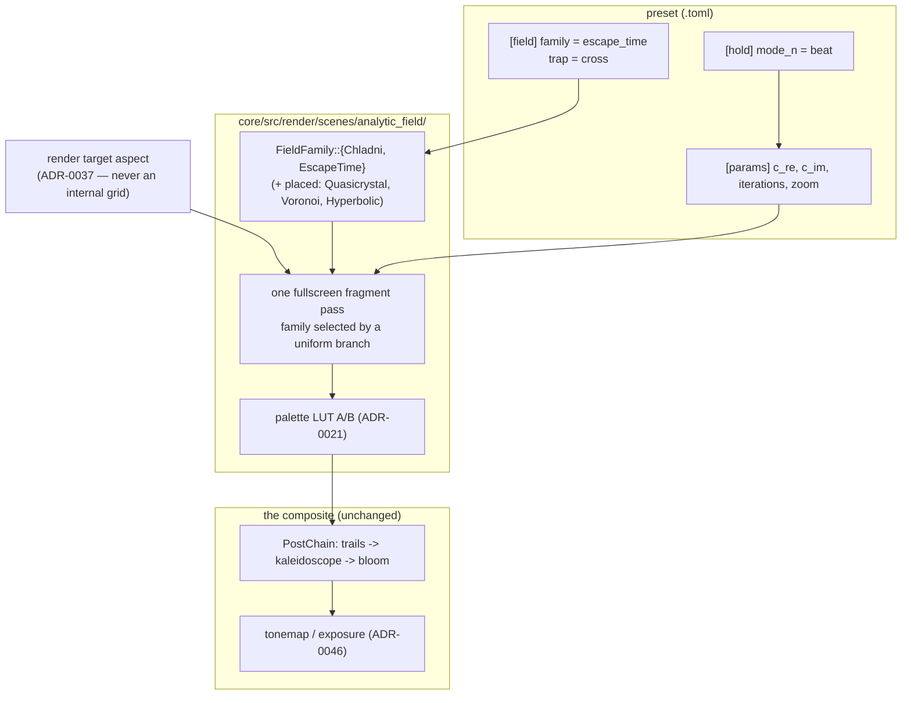

# 0163 — The analytic field

> **Status:** approved
> **Created:** 2026-09-09
> **Owner skill(s):** dev
> **Related ADRs:** [0180](../adrs/0180-a-mathematical-world-joins-a-system-as-a-family-and-a-structural-parameter-is-held.md)
> (rules 1, 3 and 4),
> [0021](../adrs/0021-shared-palette-system.md) (the palette LUT the field colours through),
> [0045](../adrs/0045-quality-tiers-floor-and-rich.md) (where the iteration cap lives),
> [0046](../adrs/0046-linear-light-hdr-composite-bloom-tonemap.md) (the HDR pipeline an escape-time
> glow finally uses),
> [0037](../adrs/0037-internal-grid-is-a-resolution-not-a-shape.md) (aspect comes from the target),
> [0085](../adrs/0085-how-much-a-scene-occludes-the-backdrop-is-one-number.md) (`occlude`)
> **Depends on:** [0161](0161-the-structural-parameter-is-held.md) — Chladni's mode numbers are
> integers on a musical edge and are worth little without `[hold]`.

## TL;DR

A thirteenth system, `analytic_field`: one fullscreen fragment pass whose output is a closed-form or
bounded-iteration function of position, coloured through the shared palette LUT. It ships with two
families — **`chladni`**, the cymatics plate whose two integer mode numbers come from the music, and
**`escape_time`**, Julia and Mandelbrot with a smooth iteration count and orbit traps. The system is
built to hold the rest of the stateless mathematics later (quasicrystal, Voronoi, hyperbolic tiling)
without another `SystemKind`.

## Context & problem

The engine has no escape-time fractal. [`roadmap-visual-richness.md`](../roadmap-visual-richness.md)'s
reference table names the gap — *"Fractal glowing spiral | needs escape-time/IFS or feedback spiral,
HDR glow | have today: neither"* — and the pipeline that row was waiting on has existed since
ADR-0046. Nothing was ever built to use it.

It has no cymatics either, and that absence is the odder one:
[`generative-techniques-catalogue.md`](../generative-techniques-catalogue.md) rates Chladni
*"cheapest of all — no state, pure per-pixel eval"* and *"thematically perfect for a music viz"*, and
ranks it second on its pick order. A Chladni plate's figure is decided by two integers; a music
visualizer has a dominant frequency to hand them.

The obvious home would be `fragment_field`, and it is the wrong one.
[ADR-0180](../adrs/0180-a-mathematical-world-joins-a-system-as-a-family-and-a-structural-parameter-is-held.md)
Alternative B records why: that scene's parameter surface **is** the sine fold's own — `warp`,
`fold_speed`, and an integrated fold phase in its uniform (ADR-0132) — and its shader is a fixed
five-iteration fold with no family switch anywhere in it. Making it polymorphic risks the table and
the generated reference of a shipped system with thirteen presets, for a capability none of them
use.

## Decision

We add one system, `analytic_field`, and place every stateless per-pixel world inside it as a named
family, per ADR-0180 rule 1. Two families ship here; the rest are placed and unbuilt.

Its shape: one fullscreen fragment pass, no state between frames, no offscreen of its own, alpha
emitted across every pixel so `occlude` works as it does for `fragment_field`, and the field level
indexed into the palette LUT exactly as ADR-0021 specifies. It takes its aspect from the render
target handed to `Scene::render`, never from any internal grid — ADR-0037's rule, restated here
because a fullscreen field that computes a radius is precisely the shape that gets it wrong.

**The iteration budget is a preset parameter with a tier-set cap.** A tier that simply *chose* the
iteration count would make one preset two different pictures — an escape-time boundary at 48
iterations and at 512 is not the same image, unlike a particle count at two densities. So a preset
asks for `iterations`, `TierConfig` bounds what it may ask for, and a preset authored inside the
`Floor` bound renders identically on both tiers.

We rejected one `SystemKind` per formula (ADR-0180 Alternative A) and polymorphising
`fragment_field` (Alternative B).

## Architecture diagram



## Implementation phases

### Phase 1 — the system, and the Chladni plate through it
- **Owner skill:** dev
- **What:** `SystemKind::AnalyticField`, its `TABLE` row, the `[field]` config table with a `family`
  key, the fullscreen pass, the palette wiring, and the **`chladni`** family as the first arm.
  Chladni is the right walking skeleton: it is a closed form with no iteration, so the whole system
  seam is proved without any of Phase 2's numerics, and it is a shippable world on its own.
- **The figure** is the zero set of `cos(n·pi·x/L)·cos(m·pi·y/L) − cos(m·pi·x/L)·cos(n·pi·y/L)`.
  Parameters: **`mode_n`** and **`mode_m`** (Structural — the two integers), **`line_width`** (how
  wide a band around the zero set lights), and **`plate_mix`** (blends from the pure nodal lines
  toward the raw signed field, which reads as a standing wave rather than as sand).
- **Files touched:** `core/src/preset/schema/system.rs`, `core/src/render/scenes/analytic_field/`
  (new), `core/src/render/scenes/mod.rs`, `core/src/preset/schema/` (the `[field]` table),
  `core/src/render/mod.rs` (scene construction).
- **Done when:** a preset with `system = "analytic_field"` and `[field] family = "chladni"` renders
  the nodal figure for `mode_n = 3`, `mode_m = 5`; the figure is **square on a non-square target**
  (the aspect comes from the target, per ADR-0037 — check at 1280x800, not only at 16:9); `occlude`
  behaves as it does on `fragment_field`; and an unknown family name is a load error.

### Phase 2 — the escape-time family
- **Owner skill:** dev
- **What:** The **`escape_time`** family: `z -> z^power + c` iterated to an escape radius, with
  `[field] map = "julia" | "mandelbrot"` choosing whether `c` is a parameter or the pixel.
  Parameters: **`c_re`**/**`c_im`** (Modal — the continuous pair that is *the* audio lever for a
  Julia set), **`iterations`** (Structural, capped by tier), **`escape_radius`**, **`power`** (Modal,
  because fractional powers are a look), and **`interior`** (how the non-escaping set is coloured).
- **The palette coordinate is the smooth iteration count**, `nu = n + 1 − log2(log|z|)/log(power)`,
  not the integer `n`. The integer count bands the palette into visible contour steps; the smooth
  count is what makes the boundary read as a continuous glow. This is not an optimization — it is
  the difference between the textbook picture and the one worth shipping.
- **Files touched:** `core/src/render/scenes/analytic_field/`.
- **Done when:** a Julia preset renders a connected filled set for `c` inside the Mandelbrot set and
  a dust for `c` outside it; the palette across the escape boundary is free of integer banding at
  `palette_steps = 0`; a bass-driven `c_re` visibly morphs the set's topology; and no pixel emits a
  non-finite value at any parameter inside the declared ranges.

### Phase 3 — orbit traps
- **Owner skill:** dev
- **What:** `[field] trap = "none" | "point" | "line" | "cross" | "circle"`, colouring a pixel by the
  **minimum distance its orbit came to the trap shape** rather than by escape time alone, with
  **`trap_radius`** and **`trap_rotate`** as parameters. This is the difference between a fractal
  that looks like a mathematics textbook and one that looks like the reference imagery — the trap is
  what produces the filaments, rings and stained-glass structure the roadmap's "fractal glowing
  spiral" row is actually describing.
- **Files touched:** `core/src/render/scenes/analytic_field/`.
- **Done when:** each of the four trap shapes produces a visibly distinct structure from the same
  `c`; `trap_radius` sweeps continuously without a discontinuity in the image; and `trap = "none"`
  is byte-identical to Phase 2's output.

### Phase 4 — the tier cap and the golden regime
- **Owner skill:** dev
- **What:** `iterations` gains a `TierConfig` cap (ADR-0045) — `Floor` bounds it low enough to hold
  the frame budget on the iGPU baseline, `Rich` allows the deep look. A preset that asks for more
  than its tier allows is **clamped and says so** through the same channel a tier demotion announces
  itself, rather than silently rendering a different picture.
- **The golden preset is authored inside the stable regime** per ADR-0180 rule 3: bounded
  iterations, shallow zoom, and `c` away from the set boundary where one float of divergence flips a
  pixel from interior to exterior. Anything that cannot hold at the `0.02` mean-channel-difference
  floor `golden.rs` already declares is asserted as a structural statistic instead
  ([ADR-0071](../adrs/0071-a-numeric-test-contract-states-a-property-or-names-its-machine.md)).
- **Files touched:** `core/src/render/tier.rs`, `core/tests/` (the golden + its preset).
- **Done when:** the same preset renders identically on `Floor` and `Rich` when it asks within the
  `Floor` bound; a preset over the bound is clamped with a notice, not silently; and the golden holds
  across a re-run on the software adapter.

### Phase 5 — documentation and the reference
- **Owner skill:** dev
- **What:** `docs/presets.md` gains the `[field]` table and an `analytic_field` row in the system
  table; `presets/README.md` is regenerated with the Structural/Modal grouping and the per-family
  annotation ADR-0180 rule 4 requires, so `mode_n` is visibly Chladni-only and `c_re` visibly
  escape-time-only; `docs/preset-guide.md` gets one picture per family via
  `scripts/docs-shots.mjs`; `docs/on-device-validation.md` gains the new system to its sweep.
- **Files touched:** `docs/presets.md`, `presets/README.md`, `docs/preset-guide.md`,
  `docs/images/`, `docs/on-device-validation.md`.
- **Done when:** every parameter in the system is documented with the family it reads on, no
  reference row was hand-written, and `node scripts/toc.mjs --check`,
  `node scripts/check-doc-links.mjs` and `node scripts/check-reader-prose.mjs` pass.

## Data shapes

```rust
// illustrative — not the final interface

/// Which closed-form world the field draws. Two arms ship in this plan; the
/// other three are placed by ADR-0180 rule 1 and built later.
pub enum FieldFamily {
    Chladni,
    EscapeTime,
    // Quasicrystal, Voronoi, Hyperbolic — placed, not built.
}

/// `[field]` — structural configuration, not bindable, in the shape `[curve]`
/// and `[particles]` already use.
pub struct FieldConfig {
    pub family: FieldFamily,
    /// EscapeTime only: whether `c` is a parameter (Julia) or the pixel
    /// (Mandelbrot).
    pub map: EscapeMap,
    /// EscapeTime only.
    pub trap: TrapShape,
}
```

Uniform layout note: the pass takes one `Params` block in `fragment_field`'s shape, with the
family selected by an integer the CPU writes — not by a shader permutation. Two byte-identical
pipeline layouts mis-render on the DX12 WARP software adapter (the quirk `fragment_field.rs:74`
documents), so this scene keeps its LUTs in their own bind group exactly as that scene does.

## Risks & open questions

- **Chaotic per-pixel iteration diverges across adapters.** This is the catalogue's own caveat and
  the reason ADR-0180 rule 3 exists. Phase 4 contains it by authoring the golden inside a stable
  regime; the residual risk is that a *preset* someone ships later sits outside that regime and has
  no baseline. That is accepted, and it is the same posture the project already takes toward
  rich-tier regressions.
- **`iterations` is the one parameter where the tier can change the picture.** Phase 4's clamp-and-
  announce is the containment. If the clamp turns out to bite common presets, the decision to
  revisit is the `Floor` bound, not the announce.
- **A fullscreen iterated pass is the most expensive scene in the engine at high `iterations`.**
  The frame-time governor demotes on a sustained miss, which is correct, but demotion changes
  `iterations` and therefore the image — the one place in this engine where a governor action is
  visible as content rather than as density. Worth watching on the on-device pass.
- **Five families' parameters on one system is a legibility cost**, accepted by ADR-0180 and
  contained by rule 4. It gets worse with each placed family that later lands; if the table becomes
  unreadable, the answer is per-family sub-tables in the generator, not a second system.
- **`power` as a Modal parameter means non-integer exponents**, which need a complex `pow` in the
  shader and can produce a branch cut. [backlog 0119](../design-backlog.md) records exactly this
  class of defect for `ang`'s branch cut on the +x axis in the per-vertex program. Check the seam
  before shipping a fractional default.

## What this plan does NOT do

- **It does not build quasicrystal, Voronoi or hyperbolic tiling.** ADR-0180 rule 1 places them in
  this system; each is a later family arm, and the Voronoi one is
  [`roadmap-visual-richness.md`](../roadmap-visual-richness.md)'s R4 item 2.
- **It does not add a raymarched SDF or anything 3D.** The catalogue lists SDF raymarching under the
  same idiom; it is a different cost class and deserves its own interview.
- **It does not touch `fragment_field`.** Its thirteen presets are unaffected — see Decision.
- **It does not author presets.** Two new families with no worlds built on them go to
  `preset-author`.
- **It does not add `[hold]`** — that is [0161](0161-the-structural-parameter-is-held.md).

## Implementation log

> Written by `dev` — one row per phase as that phase's commit lands, and the close block after the
> last one. **The phases above are the contract; everything here is what happened.**

**Lane:** _(to be filled by `dev`)_

| phase | owner | state | commit |
|---|---|---|---|
| 1 — the system, and Chladni through it | dev | not started | |
| 2 — the escape-time family | dev | not started | |
| 3 — orbit traps | dev | not started | |
| 4 — the tier cap and the golden regime | dev | not started | |
| 5 — documentation and the reference | dev | not started | |

### Notes

### Close triggers

- **`presets/` touched:**
- **Plan header `Closes:`** none
- **What shipped:**
- **Operator docs touched:**
- **Backlog probes (`node scripts/check-backlog-claims.mjs`):**
- **Full suite:**
- **Outstanding `human` phases:**

## Followups (after this lands)

- Route to `preset-author`: `chladni` and `escape_time` with orbit traps, and specifically the
  question of whether a Julia `c` driven by two different bands reads as musical or as noise.
- The three placed-but-unbuilt families. Voronoi with edge emphasis discharges
  [`roadmap-visual-richness.md`](../roadmap-visual-richness.md) R4 item 2 and is the cheapest of the
  three.
- Fractal flames (catalogue pick-order item 3) are the compute-path sibling of this plan and now the
  cheapest unbuilt entry on that list — they reuse the attractor's IFS and this plan's HDR posture.
