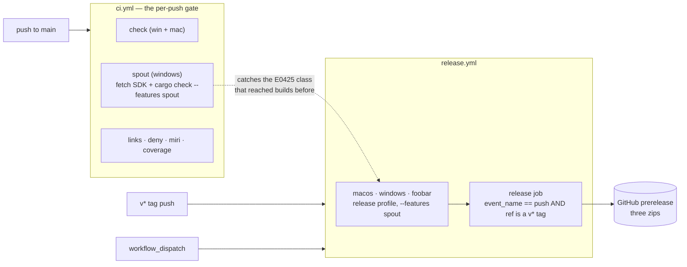

# 0165 — The release path stops being the first compile

> **Status:** approved
> **Created:** 2026-09-10
> **Owner skill(s):** dev, human
> **Related ADRs:** [0181-the-gate-compiles-every-feature-a-release-ships](../adrs/0181-the-gate-compiles-every-feature-a-release-ships.md)
> **Closes:** design-backlog 0193, design-backlog 0194

## TL;DR

The `spout` feature the shipped Windows binary enables is compiled for the first time by the job
that publishes it, and that has already eaten one release — `v0.112.0` died at `E0425` in a
`#[cfg(feature = "spout")]` call site and no GitHub Release was ever created. This plan adds a
`spout` compile job to the per-push gate, makes `release.yml`'s dry-run promise true instead of
merely written, and then publishes the `v0.113.0` that is tagged on `origin` but was never built.

## Context & problem

Three findings from unbreaking CI on 2026-09-10, all in the release path, none in the engine.

**1. Nothing compiles `--features spout` before a tag is pushed.** `ci.yml` contains no occurrence
of the string `spout`; `.githooks/pre-push` neither. Code behind `#[cfg(feature = "spout")]` is not
type-checked when the feature is off, so the whole gate is blind to it by construction. `v0.112.0`
is the worked example: `foobar` and `macos` green, `windows` red with `cannot find function
start_capture in the crate root`, the `release` job skipped by its `needs:`, and therefore **no
release at all** — a failure that announces itself only as an absent artifact. `e9b27a2` repaired
it seven commits later, incidentally, inside the Plan 0158 merge. ADR-0181 records the decision and
the rejected alternatives.

**2. `release.yml` promises a dry run it does not provide.** The `release` job's condition is
`if: startsWith(github.ref, 'refs/tags/v')` and the file contains no reference to
`github.event_name`. A `workflow_dispatch` launched against a **tag** ref satisfies that condition,
so it publishes — while the workflow's own header comment says `workflow_dispatch` "builds the same
artifacts without publishing anything, for dry runs", and `docs/releasing.md` said the Actions-tab
rehearsal "creates no release". Two documents describe a safety property the code does not have.
The doc half is corrected in the same commit as this plan; the code half is Phase 2.

**3. `v0.113.0` is tagged on `origin` and was never built or published.** GitHub does not trigger
workflows for tags pushed in bulk — more than three at once — and today's trailer-stripping history
rewrite force-pushed 131 of them. So the tag exists at `c5a08f1`, has zero Release runs, and the
newest published release remains `v0.103.0`. The trap is now written into `docs/releasing.md`;
publishing the missed version is Phase 3.

## Decision

Add a dedicated `spout` job to `ci.yml` rather than a step on the existing `check (windows-latest)`
job, and harden the `release` job's condition rather than merely correcting its comment. We rejected
the step-on-`check` shape because it serializes a network fetch into the gate's longest job (19m41s
on run `34448163324`) and names the wrong subject when it fails; we rejected comment-only because
the comment documents an intent — dispatch is a rehearsal — that the condition should simply
enforce. ADR-0181 carries the full argument, including why a dev-profile `cargo check` rather than
the real release build.

## Architecture diagram



## Implementation phases

### Phase 1 — The gate compiles the `spout` feature
- **Owner skill:** `dev`
- **What:** A new `spout` job in `ci.yml` on `windows-latest`: `actions/checkout`,
  `dtolnay/rust-toolchain@stable`, `Swatinem/rust-cache@v2`, then
  `./packaging/spout/fetch-sdk.ps1` (`shell: pwsh`, mirroring the `windows` job in `release.yml`),
  then `cargo check -p standalone --features spout`. Carry a comment naming ADR-0181 by bare
  number and stating what the job guards — that a `#[cfg(feature = "spout")]` call site is not
  type-checked by any other job.
- **Files touched:** `.github/workflows/ci.yml`
- **Done when:** the job appears in a CI run on `main` alongside `check`, `links`, `deny`,
  `coverage` and `miri`, and is green. Locally verifiable first: with the SDK staged,
  `cargo check -p standalone --features spout` succeeds on the current tree, and re-introducing
  `crate::start_capture` in place of `crate::capture_start::start_capture` reproduces the `E0425`
  this job exists to catch. **Do not commit that experiment** — it is a check that the guard has
  teeth, not a change.
- **Note on caching:** ADR-0181 leaves an SDK cache to first evidence rather than building it
  speculatively. Do not add `actions/cache` in this phase; if the fetch turns out to be slow or
  flaky, that is a followup with a measurement behind it.

### Phase 2 — A dispatch cannot publish, and the comment is true
- **Owner skill:** `dev`
- **What:** Narrow the `release` job's condition to the push event as well as the ref —
  `if: github.event_name == 'push' && startsWith(github.ref, 'refs/tags/v')` — so a
  `workflow_dispatch` on any ref, a tag included, builds the three zips as run artifacts and
  publishes nothing. Then make the header comment state the property as enforced rather than as
  hoped, naming ADR-0181's sibling finding by bare number.
- **Files touched:** `.github/workflows/release.yml`
- **Done when:** the condition names both the event and the ref, and the header comment's claim
  about `workflow_dispatch` is true as written for **every** ref it can be launched against. A
  dispatch on a tag ref is the case to reason about explicitly; it is what made the old comment
  false.
- **Trap:** pushing any change under `.github/workflows/` needs the `workflow` OAuth scope on the
  git credential — `gh auth refresh -s workflow`. `release.yml` says so at its own head; the push
  is rejected with a scope error naming neither the file nor the fix.

### Phase 3 — The missed version gets published
- **Owner skill:** `human`
- **What:** Re-push the `v0.113.0` tag so the Release workflow fires for it. The tag already
  exists on `origin` at `c5a08f1`, so the ref must be deleted and re-pushed — a no-op push of an
  unchanged ref emits no event:

  ```sh
  git push origin :refs/tags/v0.113.0
  git push origin v0.113.0
  ```

- **Done when:** a Release run exists for `v0.113.0`, its `macos`, `windows` and `foobar` jobs are
  green, and `gh release view v0.113.0` shows the prerelease carrying all three zips. Phases 1 and
  2 land first, so the build is guarded by the gate before the tag is pushed again.
- **Why `human`:** it publishes a public artifact, and pushing is the user's, never the agent's.

## Risks & open questions

- **The SDK fetch is now in the gate, so a third-party outage reds a push.** ADR-0181 accepts this
  as the price and names the cache as the mitigation if evidence arrives. The risk is real and
  deliberately untreated at draft time; treating it speculatively would add a cache key to maintain
  for a failure nobody has observed here.
- **`cargo check` does not link.** A link-only or LTO-only break in the `spout` path still reaches
  the tag push first. The plan narrows the window; it does not close it, and the ADR says so.
- **Phase 3 depends on a GitHub behavior we inferred, not read.** The claim that pushing more than
  three tags at once suppresses the workflow explains the observation — 131 tags pushed, zero
  Release runs for `v0.113.0` — but it was not verified against a documented limit in this session.
  If the re-push also produces no run, that inference is wrong and the cause is elsewhere; say so
  rather than re-pushing a third time.
- **`v0.112.0` can never be built from its own tree.** Its run is pinned to `f207c46`, a
  pre-rewrite SHA that no longer exists on `origin`, so `actions/checkout` cannot fetch it. The
  version is skipped, permanently. That is a consequence of the history rewrite and is recorded
  here so nobody later reads the gap as a lost artifact.

## What this plan does NOT do

- **It does not add a `spout` step to `.githooks/pre-push`.** That gate's budget is ~28 s
  (ADR-0033) and an SDK fetch plus a shim compile does not fit. CI is the enforcement point, as it
  already is for `cargo doc`, Miri and coverage.
- **It does not touch the `--stream` feature's behavior**, its shader path, or the Spout shim. This
  is a gate plan; the code under the gate is untouched.
- **It does not publish `v0.112.0`** — see the risk above. Nor does it re-tag or re-number it.
- **It does not audit the other unpublished versions.** `v0.111.1` also shows no Release run and
  no release, and the published set stops at `v0.103.0`; whether that whole gap shares Phase 3's
  cause is a separate question this plan deliberately does not open.

## Implementation log

> Written by `dev` — one row per phase as that phase's commit lands, and the close block after the
> last one. **The phases above are the contract; everything here is what happened.**

**Lane:** _(to be filled by `dev`)_

| phase | owner | state | commit |
|---|---|---|---|
| 1 — The gate compiles the `spout` feature | dev | not started | |
| 2 — A dispatch cannot publish | dev | not started | |
| 3 — The missed version gets published | human | not started | |

### Notes

### Close triggers

- **`presets/` touched:**
- **Plan header `Closes:`**
- **What shipped:**
- **Operator docs touched:**
- **Backlog probes (`node scripts/check-backlog-claims.mjs`):**
- **Full suite:**
- **Outstanding `human` phases:**

## Followups (after this lands)

- `docs/developing.md` names which gates are deliberately outside the pre-push hook — "`cargo
  deny`, doctests, Miri, and the coverage job" — and the new `spout` job joins that list. Sweep it
  at the close.
- If the SDK fetch proves slow or flaky in practice, cache it on the pinned hash, with the
  measurement in the commit message.
