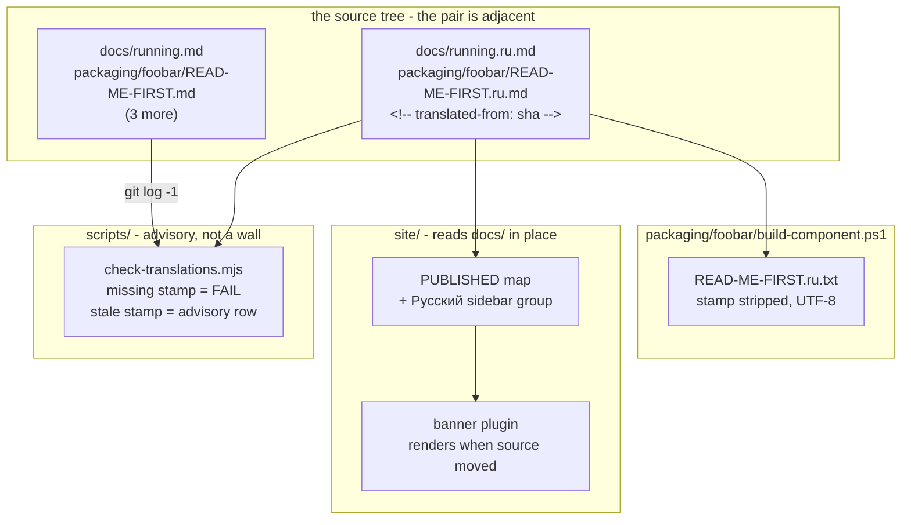

# 0166 — The basics read in Russian

> **Status:** in-progress
> **Created:** 2026-09-10
> **Owner skill(s):** `dev`, `human`
> **Related ADRs:** [0185](../adrs/0185-the-docs-translate-a-slice-and-a-stamp-makes-staleness-visible.md)

> **Amended 2026-09-14, before any phase landed (architect validity sweep).** Four changes, each made
> in place below.
> (1) Two figures were re-measured on the tree: 5,618 words across the five sources, and 11,626
> bytes for `docs/running.md`. Only `running.md` moved in the sources since approval (`b301507`,
> +7/-4), so the slice is still the one ADR-0185 argued.
> (2) A fourth `READ-ME-FIRST.md` now exists, `packaging/studio/` (`9a4410a`). It is outside the
> slice, and *What this plan does NOT do* now names the two studio zips.
> (3) Phase 1's new gate falsifies the Node-gate counts written in `CLAUDE.md`, `README.md` and
> `ci.yml`'s comments, so those files join Phase 1.
> (4) The shallow-clone trap was handled for the gate but not for the banner. The banner reads git
> history in the site build, and `pages.yml` checks out at depth 1. Phase 1 now covers that too.

## TL;DR

Five documents — the three `packaging/*/READ-ME-FIRST.md`, `docs/running.md` and
`docs/how-it-works.md`, about 5,600 words — gain a Russian sibling `.ru.md`, published as one
`Русский` group in the site menu, with the foobar component zip shipping its Russian install file
beside the English one. Each translation carries a `translated-from: <sha>` stamp; a new gate hard-
fails a missing stamp and prints an advisory row for a stale one, and the site renders a dated
notice on a page whose source has moved. The first Russian-reading user can install the foobar2000
component without touching an English page.

## Context & problem

The site publishes 149,178 words and none of them are in Russian, while the foobar2000 component —
the frontend with the largest Russian-speaking audience — is also the one whose install path fails
for language reasons rather than technical ones. Translating the corpus is not available: 1,339
commits touched the published sources in 60 days, 36 % of the words are generated from `ParamSpec`
declarations in the engine, and a full translation puts roughly ten of the site's 164 routes over
`ROUTE_SOURCE_CEILING` because Cyrillic costs two UTF-8 bytes per character. The problem is
therefore not "how do we translate the docs" but **which slice earns a second copy, and what makes
that copy's staleness visible given that no gate can read prose.**

## Decision

We translate the five most stable, most language-blocking documents and nothing else, as sibling
`.ru.md` files stamped with the source sha they were translated from. Staleness is **advisory**: the
build renders a notice and the close ceremony prints a row, but nothing goes red, because a hard
gate would make the Russian slice a hostage of every hotkey change on a one-translator project. A
*missing or malformed* stamp is a hard failure, because that is mechanical rather than a judgement.
We rejected translating the whole set (arithmetic — a standing obligation the size of the docs work
itself), build-time machine translation (no reviewer, and a fluent wrong translation is invisible
here), Starlight i18n locale routing (five pages of 164 means `/ru/` is 97 % English behind Russian
chrome), and convention with no stamp (Plan 0061's *"One line per plan."* regrew 7.1x in eight
days). Full reasoning in [ADR-0185](../adrs/0185-the-docs-translate-a-slice-and-a-stamp-makes-staleness-visible.md).

## Architecture diagram



## Implementation phases

**Phase 1 is machinery rather than a walking skeleton, and that is deliberate.** The authorship
decision is that no Russian prose publishes before the owner has read it (Phase 3), so an
end-to-end first slice would have to publish unreviewed prose to be end-to-end. The machinery is
instead made provable on its own with a seeded fixture, in the shape `scripts/fixtures/` already
uses.

### Phase 1 — The stamp, the gate, and the banner
- **Owner skill:** `dev`
- **What:** `scripts/check-translations.mjs`, plus the remark plugin that renders the staleness
  notice on a translated page.
- **Files touched:** `scripts/check-translations.mjs`, `scripts/fixtures/translations/`,
  `site/src/plugins/translation-banner.mjs`, `site/astro.config.mjs`, `.githooks/pre-push`,
  `.github/workflows/ci.yml` (the `links` job, and its own "the seventh" comment),
  `.github/workflows/pages.yml` (the `build` job's checkout depth), and the prose that counts the
  Node gates. Today that is `CLAUDE.md`'s `scripts/` entry ("Nine Node gates. SEVEN run by
  pre-push…", and "Of the seven…") and `README.md`'s `scripts/` row ("the seven Node gates… an
  eighth and ninth"). Grep for the counts rather than trusting this list, and prefer count-free
  wording where the sentence allows it (backlog 0208's rule).
- **Done when:**
  - A `.ru.md` with no stamp, or a stamp that is not a 40-hex or short sha, exits non-zero and names
    the file and line.
  - A `.ru.md` whose stamp names a commit older than `git log -1 --format=%H -- <source>` prints an
    advisory row naming the source, the stamped sha and the current one, and **exits 0**.
  - On a **shallow clone** the staleness half prints a notice and withholds its rows rather than
    reporting every translation as stale — `git log -1` returns the tip commit for every path there,
    which is the trap ADR-0108's advisory block already handles.
  - **The banner has the same trap, and it would publish it.** The banner reads git history during
    the site build, and `.github/workflows/pages.yml`'s `build` job uses `actions/checkout@v4` at
    its default depth of 1. Unguarded, the live site would show every Russian page as stale. Two
    guards are required, not one. The `build` job checks out with `fetch-depth: 0`, so the
    published notice is true. The plugin also detects a shallow repository and renders **no**
    notice there, so a shallow local or CI build cannot publish a false one.
  - The Node-gate counts in `CLAUDE.md`, `README.md` and `ci.yml`'s comments describe the tree after
    this phase: a grep for the old number words beside "gate" finds nothing stale.
  - Seeded fixtures cover all three states (missing, stale, current), and the gate is wired into
    pre-push and the CI `links` job.
  - The banner plugin renders a dated notice for a stale page and nothing for a current one, and a
    throw inside it fails the build rather than serving a title over an empty body — the site's
    existing render-to-nothing guard is what this must not slip past.

### Phase 2 — The five translations, drafted and unpublished
- **Owner skill:** `dev`
- **What:** The Russian prose, stamped, sitting beside its source and routed nowhere yet.
- **Files touched:** `packaging/windows/READ-ME-FIRST.ru.md`, `packaging/macos/READ-ME-FIRST.ru.md`,
  `packaging/foobar/READ-ME-FIRST.ru.md`, `docs/running.ru.md`, `docs/how-it-works.ru.md`.
- **Done when:**
  - Each file opens with its stamp comment, then a Russian `# ` heading, and
    `node scripts/check-translations.mjs` reports all five current.
  - `node scripts/check-doc-links.mjs` exits 0 — every relative link inside a translation resolves,
    from the new file's own directory.
  - Every Plan/ADR citation in `running.ru.md` and `how-it-works.ru.md` sits inside a markdown link,
    matching what `check-reader-prose.mjs` already demands of their English sources
    ([ADR-0168](../adrs/0168-the-reader-documents-address-a-reader-and-the-record-stays-a-link.md)).
  - Identifiers, flags, config keys, hotkey names, file paths and `@VERSION@` stay verbatim: the
    prose is translated, the interface is not.
  - Nothing is in `PUBLISHED`, so the site build is byte-identical to before this phase.

### Phase 3 — Owner review of the Russian prose
- **Owner skill:** `human`
- **What:** The owner reads all five translations and corrects register, terminology and anything
  the draft got wrong. **This phase blocks Phase 4 — no Russian page publishes before it passes.**
- **Files touched:** the five `.ru.md` from Phase 2.
- **Done when:** The owner states the five read correctly, and any file corrected in this phase has
  its stamp left as-is (the English source has not moved; only the Russian prose changed).

### Phase 4 — Publish: the map, the menu, the banner in place
- **Owner skill:** `dev`
- **What:** The five translations join the site as one menu group.
- **Files touched:** `site/src/plugins/rewrite-links.mjs` (the `PUBLISHED` map),
  `site/astro.config.mjs` (the sidebar), `scripts/check-reader-prose.mjs` (`READER_DOCS`).
- **Done when:**
  - Five routes build and are reachable from a single `Русский` sidebar group.
  - `node scripts/check-site-links.mjs` and `node scripts/check-site-routes.mjs` pass against
    `site/dist/` — every route menu-reachable, no site-relative href ending in `.md`, and **no route
    over `ROUTE_SOURCE_CEILING`**, which the slice clears with room: the largest source is
    `docs/running.md` at 11,626 bytes (measured 2026-09-14). It inflates to roughly 20,000, against a
    30,000 ceiling.
  - Each Russian page cross-links to its English twin and each English twin to its Russian one.
  - A page whose source has moved shows the notice; the others show nothing.

### Phase 5 — The foobar component zip ships the Russian install file
- **Owner skill:** `dev`
- **What:** `READ-ME-FIRST.ru.txt` beside `READ-ME-FIRST.txt` at the component zip's top level.
- **Files touched:** `packaging/foobar/build-component.ps1`.
- **Done when:**
  - The zip's top level holds both files, and the script's existing top-level assertion checks for
    both.
  - The stamp comment is **stripped** on the `.md` → `.txt` copy, in the same pass that substitutes
    `@VERSION@`; the existing unsubstituted-placeholder check covers the Russian file too.
  - The `.ru.txt` is written **UTF-8 explicitly** — Windows PowerShell 5.1's `Set-Content` defaults
    to the system ANSI codepage, which mangles Cyrillic silently.
  - A packaged zip opened on a clean Windows box shows readable Russian in Notepad and no HTML
    comment on line 1.

## Data shapes

```markdown
<!-- translated-from: 3614c87 -->
<!-- illustrative: line 1 of every .ru.md; the sha is the source's last-touching commit -->

# Установка компонента для foobar2000
```

The gate's comparison, illustrative:

```js
// illustrative - not the final script
const stamped = /^<!--\s*translated-from:\s*([0-9a-f]{7,40})\s*-->/m.exec(text)?.[1];
const current = git(`log -1 --format=%H -- ${source}`);       // withheld on a shallow clone
const state = !stamped ? 'FAIL' : current.startsWith(stamped) ? 'current' : 'stale';
```

## Risks & open questions

- **The owner-skill vocabulary has no lane for prose.** `dev` means all code; a translation is
  neither code, preset content, nor studio. Phases 1, 4 and 5 are unambiguously `dev`; **Phase 2 is
  tagged `dev` as the nearest fit and the stretch is deliberate.** If translation recurs — a second
  language, or the slice growing — that wants its own ADR rather than a quietly widened `dev`.
- **`git log -1` on a shallow clone reports the tip for every path.** Phase 1's done-when names this
  because CI checkouts are shallow and the failure is silent: every translation would read as stale
  and the advisory would be ignored within a week.
- **PowerShell 5.1's default encoding is ANSI.** The single most likely way Phase 5 ships broken
  output, and it is invisible to anyone testing on a machine whose codepage happens to cope.
- **A remark plugin that throws is swallowed.** The site's content layer stores an entry without its
  rendered HTML rather than aborting, so a broken banner serves a titled empty page. Phase 1's
  done-when requires the guard, not just the feature.
- **Plan 0178 adds a gate too, and both plans edit the same count prose.** Plan 0178 (operator text
  and counts, drafted 2026-09-14) adds the prose system-count gate from backlog 0208, and it moves
  the same `CLAUDE.md` / `README.md` / `ci.yml` sentences to count-free wording. Whichever plan
  lands second rebases onto the other's wording rather than restoring a number. If 0178 lands
  first, Phase 1's count edit may be a no-op, which is the desired outcome.
- **The advisory can be ignored indefinitely.** That is the accepted cost of ADR-0185's decision, not
  an oversight — but if the close notes show the same translation stale three closes running, the
  honest response is to retire that page rather than let it lie.
- **Open:** whether the English pages should link to their Russian twins prominently or quietly.
  Phase 4 requires the cross-link and leaves the placement to the owner's review.

## What this plan does NOT do

- **No translation of the preset surface.** `presets/README.md`, `docs/presets.md`,
  `docs/preset-palettes.md`, `docs/preset-guide.md` and the tuning walkthrough stay English.
- **No Starlight i18n, no `/ru/` locale, no language picker.**
- **No Russian in the Windows or macOS zips, nor in the two studio zips.** The foobar component
  only. `packaging/studio/READ-ME-FIRST.md` is outside the slice, like the other two.
- **No second language.** Nothing here is built as a general i18n framework, and a request for one
  should reopen ADR-0185 rather than extend this.
- **No translation of `docs/adrs/`, `docs/plans/`, or the design backlog.** Those address
  contributors and the record stays in one language.
- **No gate on translation quality.** Phase 3's human review is the only thing standing behind the
  prose, and that is by design.

## Implementation log

> Written by `dev` — one row per phase as that phase's commit lands, and the close block after the
> last one. **The phases above are the contract; everything here is what happened.**

**Lane:** `plan-0166-the-basics-read-in-russian`, worktree `C:\Users\Igor Konovalov\WORK\rlx-plan-0166`
(conductor, ADR-0205).

| phase | owner | state | commit |
|---|---|---|---|
| 1 — The stamp, the gate, and the banner | `dev` | done | `645e84ec` |
| 2 — The five translations, drafted and unpublished | `dev` | done | committed with this row |
| 3 — Owner review of the Russian prose | `human` | done | `40c1ed39` + `79976978` |
| 4 — Publish: the map, the menu, the banner in place | `dev` | done | `163cd41d` |
| 5 — The foobar component zip ships the Russian install file | `dev` | done | committed with this row |

### Notes

- **Phase 4's cross-link is a remark plugin in `astro.config.mjs`, not an edit to ten documents.**
  The phase's done-when asks each page to link its twin, and its Files-touched names only the three
  config files — so the link is derived from the sibling pair on disk (`<name>.md` /
  `<name>.ru.md`) by `translationCrossLink`, which sits beside `stripLeadingHeading` in that same
  file. A translation added to `PUBLISHED` later gets its link with no edit. Its position in the
  remark chain is load-bearing on both sides: after `translationBanner`, which has already removed
  the stamp that would otherwise be the first node, and before `stripLeadingHeading`, which removes
  the `# ` heading it inserts after.
- **`REPO_ROOT` was used rather than exporting `sourceOf`.** `rewrite-links.mjs` has a private
  `sourceOf`; the cross-link needs the same repo-relative path, and `REPO_ROOT` is already exported,
  so the derivation is four lines in the config instead of a widened module API.
- **Only the two reader documents joined `READER_DOCS`**, not all five. ADR-0168's rule is about
  prose a reader meets, and the three installer notes carry no Plan/ADR citations — the same reason
  their English twins are not in that list either.
- **Astro's content cache had to be cleared to see a plugin fix.** A wrong `BASE` in the cross-link
  survived a rebuild because `site/.astro` held the rendered entry; `rm -rf site/.astro
  site/node_modules/.astro` is what made the rebuild honest. Worth knowing before trusting a green
  build after a remark-plugin edit.


- **Phase 3 ran 2026-09-16 and passed, with corrections.** The owner read the five and named the
  defect class in two examples of its own — *«Визуальная случайность есть — брызги частиц… явно
  засеяна… один в один»* and *«между звуком, вышедшим из колонок, и фигурой, сдвинувшейся на
  экране»*. Both are English syntax wearing Russian words, and the class ran through all five.
  **44 corrections** landed in `40c1ed39` (how-it-works, 13) and `79976978` (the other four, 31),
  the register confirmed by the owner on the first file before the rest were touched.
- **Two of the 44 were mistranslations, not awkwardness**, which is the reason this phase blocks
  Phase 4 rather than being a polish pass: *"The cost is honest and unpaid-for"* had become «Цена
  честная и не оплачена», which in Russian says the bill is outstanding; and *"Neither of those
  **facts** reaches the engine"* had lost the word *facts*, so it read as though the samples never
  arrive. A third, in the macOS note, told the reader a missed permission prompt lives in System
  Settings, where the *permission* lives and the prompt does not.
- **Every stamp is unchanged, which is the phase's own done-when.** No English source moved, so only
  the Russian prose changed and `node scripts/check-translations.mjs` stays green at five stamped
  translations. Word counts held at ~88 % of English across all five before and after, so the pass
  neither padded nor compressed.
- **One convention was left alone deliberately and is still open**: a link whose target is an
  untranslated document keeps its English title (`[Configuration]`, `[Ring determinism]`) while links
  to translated concepts are in Russian. It reads as deliberate signposting — the reader is told they
  are about to land in English — and Phase 4 is where it becomes visible, so it is worth one decision
  there rather than a silent edit here.


- **Phase 1 touched three files beyond its `Files touched` list**, each because the phase falsified
  something already written in it — the phase's own instruction was to grep for the counts rather
  than trust the list. `scripts/fixtures/README.md` (a section for the new seeded trees, and its
  opening *"Eight checkers"*); `docs/developing.md` (the table of *every step the pre-push gate
  runs*, which the new gate's two invocations would otherwise have left incomplete);
  `docs/nfr.md` (*"the seven Node doc gates"* / *"Seven gates but nine invocations"*, already stale
  by one before this phase and stale by two after it). All three are now count-free.
- **ADR-0185 says the close ceremony prints the drifted translations, and this plan does not wire
  that.** The close ceremony lives under `.claude/skills/architect/`, which no phase of this plan
  lists and which a conductor-run session cannot write to (ADR-0210). The gate prints the advisory
  at pre-push and in CI; the close reading is unimplemented.
- **The three packaging translations open with a setext heading, not the `# ` Phase 2's done-when
  names.** Their English twins write the title over a rule of `=`, because those files ship as
  `.txt` inside a release zip where a `#` is literal noise, and Phase 5 puts the Russian one in the
  same zip beside the English one. The two `docs/` translations do use `# `, which is what their
  sources use. `titleFromLeadingHeading` in `site/src/content.config.ts` already accepts both forms,
  and `PUBLISHED` declares the title regardless.
- **The mermaid labels in `how-it-works.ru.md` are translated; every node id, arrow and quote is
  byte-identical to the source.** No build has rendered them — nothing in this lane can, and until
  Phase 4 adds the file to `PUBLISHED` nothing reads it at all — so a fence that does not parse
  would surface as a red Pages build in Phase 4 rather than here. A reviewer wanting that risk gone
  before then can diff the two fences: only text inside `[...]` and `|"..."|` differs.
- **The site build was not run in the lane** — this worktree has no `site/node_modules`, and
  installing one is a network install rather than a phase check. The banner plugin is covered
  instead by `check-translations.mjs --self-test`, which imports it and exercises all four of its
  behaviours against a throwaway repository; a real Astro build of it first happens in the Pages
  workflow. Until Phase 4 the plugin is a no-op on every page, because nothing it triggers on is in
  `PUBLISHED`.

- **Phase 5's done-when named the wrong half of the encoding trap, and the right half was live.**
  It warns that `Set-Content` defaults to the system ANSI codepage on write. `Get-Content -Raw`
  does the same on **read**, for any file without a BOM, and that is the one that bites: measured on
  PowerShell 5.1.19041, `packaging/foobar/READ-ME-FIRST.ru.md` holds `D0 BA` for «к» on disk and
  comes back out of `Get-Content -Raw` as `C3 90` — double-encoded, silently. The first
  implementation of this phase used `Get-Content -Raw` as the English path does and produced exactly
  that. Both sides are now `[System.IO.File]::ReadAllText(..., UTF8)` / `WriteAllText(..., UTF8)`.
- **The English read was changed too, and it is not a present bug.** All three
  `READ-ME-FIRST.md` are pure ASCII today, where cp1252 and UTF-8 agree, so the existing path was
  correct; it would have broken silently on the first em dash. The SDK readme read at line 245 is
  left alone — third-party, and its regex extracts an ASCII version string.
- **Phase 5 was verified in isolation, not through a packaged zip.** Running `build-component.ps1`
  needs the foobar2000 SDK and a built component, neither of which is on this machine. What was
  measured is the transformation the phase owns: stamp stripped, both placeholders substituted, no
  BOM, and the shipped bytes byte-identical to the source's Cyrillic. The phase's last done-when — a
  zip opened on a clean Windows box — is **unverified here** and belongs to on-device validation.

### Close triggers

- **`presets/` touched:**
- **Plan header `Closes:`** none
- **What shipped:**
- **Operator docs touched:**
- **Backlog probes (`node scripts/check-backlog-claims.mjs`):**
- **Full suite:**
- **Outstanding `human` phases:**

## Followups (after this lands)

- Decide, at the close after next, whether the advisory rows are actually being acted on — if a
  translation is stale for three consecutive closes, retiring the page beats publishing a lie.
