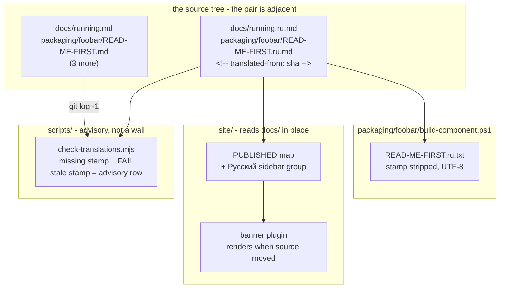

# 0166 — The basics read in Russian

> **Status:** approved
> **Created:** 2026-09-10
> **Owner skill(s):** `dev`, `human`
> **Related ADRs:** [0183](../adrs/0183-the-docs-translate-a-slice-and-a-stamp-makes-staleness-visible.md)

## TL;DR

Five documents — the three `packaging/*/READ-ME-FIRST.md`, `docs/running.md` and
`docs/how-it-works.md`, about 5,578 words — gain a Russian sibling `.ru.md`, published as one
`Русский` group in the site menu, with the foobar component zip shipping its Russian install file
beside the English one. Each translation carries a `translated-from: <sha>` stamp; a new gate hard-
fails a missing stamp and prints an advisory row for a stale one, and the site renders a dated
notice on a page whose source has moved. The first Russian-reading user can install the foobar2000
component without touching an English page.

## Context & problem

The site publishes 149,178 words and none of them are in Russian, while the foobar2000 component —
the frontend with the largest Russian-speaking audience — is also the one whose install path fails
for language reasons rather than technical ones. Translating the corpus is not available: 1,339
commits touched the published sources in 60 days, 36 % of the words are generated from `ParamSpec`
declarations in the engine, and a full translation puts roughly ten of the site's 164 routes over
`ROUTE_SOURCE_CEILING` because Cyrillic costs two UTF-8 bytes per character. The problem is
therefore not "how do we translate the docs" but **which slice earns a second copy, and what makes
that copy's staleness visible given that no gate can read prose.**

## Decision

We translate the five most stable, most language-blocking documents and nothing else, as sibling
`.ru.md` files stamped with the source sha they were translated from. Staleness is **advisory**: the
build renders a notice and the close ceremony prints a row, but nothing goes red, because a hard
gate would make the Russian slice a hostage of every hotkey change on a one-translator project. A
*missing or malformed* stamp is a hard failure, because that is mechanical rather than a judgement.
We rejected translating the whole set (arithmetic — a standing obligation the size of the docs work
itself), build-time machine translation (no reviewer, and a fluent wrong translation is invisible
here), Starlight i18n locale routing (five pages of 164 means `/ru/` is 97 % English behind Russian
chrome), and convention with no stamp (Plan 0061's *"One line per plan."* regrew 7.1x in eight
days). Full reasoning in [ADR-0183](../adrs/0183-the-docs-translate-a-slice-and-a-stamp-makes-staleness-visible.md).

## Architecture diagram



## Implementation phases

**Phase 1 is machinery rather than a walking skeleton, and that is deliberate.** The authorship
decision is that no Russian prose publishes before the owner has read it (Phase 3), so an
end-to-end first slice would have to publish unreviewed prose to be end-to-end. The machinery is
instead made provable on its own with a seeded fixture, in the shape `scripts/fixtures/` already
uses.

### Phase 1 — The stamp, the gate, and the banner
- **Owner skill:** `dev`
- **What:** `scripts/check-translations.mjs`, plus the remark plugin that renders the staleness
  notice on a translated page.
- **Files touched:** `scripts/check-translations.mjs`, `scripts/fixtures/translations/`,
  `site/src/plugins/translation-banner.mjs`, `site/astro.config.mjs`, `.githooks/pre-push`,
  `.github/workflows/*` (the `links` job).
- **Done when:**
  - A `.ru.md` with no stamp, or a stamp that is not a 40-hex or short sha, exits non-zero and names
    the file and line.
  - A `.ru.md` whose stamp names a commit older than `git log -1 --format=%H -- <source>` prints an
    advisory row naming the source, the stamped sha and the current one, and **exits 0**.
  - On a **shallow clone** the staleness half prints a notice and withholds its rows rather than
    reporting every translation as stale — `git log -1` returns the tip commit for every path there,
    which is the trap ADR-0108's advisory block already handles.
  - Seeded fixtures cover all three states (missing, stale, current), and the gate is wired into
    pre-push and the CI `links` job.
  - The banner plugin renders a dated notice for a stale page and nothing for a current one, and a
    throw inside it fails the build rather than serving a title over an empty body — the site's
    existing render-to-nothing guard is what this must not slip past.

### Phase 2 — The five translations, drafted and unpublished
- **Owner skill:** `dev`
- **What:** The Russian prose, stamped, sitting beside its source and routed nowhere yet.
- **Files touched:** `packaging/windows/READ-ME-FIRST.ru.md`, `packaging/macos/READ-ME-FIRST.ru.md`,
  `packaging/foobar/READ-ME-FIRST.ru.md`, `docs/running.ru.md`, `docs/how-it-works.ru.md`.
- **Done when:**
  - Each file opens with its stamp comment, then a Russian `# ` heading, and
    `node scripts/check-translations.mjs` reports all five current.
  - `node scripts/check-doc-links.mjs` exits 0 — every relative link inside a translation resolves,
    from the new file's own directory.
  - Every Plan/ADR citation in `running.ru.md` and `how-it-works.ru.md` sits inside a markdown link,
    matching what `check-reader-prose.mjs` already demands of their English sources
    ([ADR-0168](../adrs/0168-the-reader-documents-address-a-reader-and-the-record-stays-a-link.md)).
  - Identifiers, flags, config keys, hotkey names, file paths and `@VERSION@` stay verbatim: the
    prose is translated, the interface is not.
  - Nothing is in `PUBLISHED`, so the site build is byte-identical to before this phase.

### Phase 3 — Owner review of the Russian prose
- **Owner skill:** `human`
- **What:** The owner reads all five translations and corrects register, terminology and anything
  the draft got wrong. **This phase blocks Phase 4 — no Russian page publishes before it passes.**
- **Files touched:** the five `.ru.md` from Phase 2.
- **Done when:** The owner states the five read correctly, and any file corrected in this phase has
  its stamp left as-is (the English source has not moved; only the Russian prose changed).

### Phase 4 — Publish: the map, the menu, the banner in place
- **Owner skill:** `dev`
- **What:** The five translations join the site as one menu group.
- **Files touched:** `site/src/plugins/rewrite-links.mjs` (the `PUBLISHED` map),
  `site/astro.config.mjs` (the sidebar), `scripts/check-reader-prose.mjs` (`READER_DOCS`).
- **Done when:**
  - Five routes build and are reachable from a single `Русский` sidebar group.
  - `node scripts/check-site-links.mjs` and `node scripts/check-site-routes.mjs` pass against
    `site/dist/` — every route menu-reachable, no site-relative href ending in `.md`, and **no route
    over `ROUTE_SOURCE_CEILING`**, which the slice clears with room: the largest source is
    `docs/running.md` at 11,331 bytes and inflates to roughly 20,000.
  - Each Russian page cross-links to its English twin and each English twin to its Russian one.
  - A page whose source has moved shows the notice; the others show nothing.

### Phase 5 — The foobar component zip ships the Russian install file
- **Owner skill:** `dev`
- **What:** `READ-ME-FIRST.ru.txt` beside `READ-ME-FIRST.txt` at the component zip's top level.
- **Files touched:** `packaging/foobar/build-component.ps1`.
- **Done when:**
  - The zip's top level holds both files, and the script's existing top-level assertion checks for
    both.
  - The stamp comment is **stripped** on the `.md` → `.txt` copy, in the same pass that substitutes
    `@VERSION@`; the existing unsubstituted-placeholder check covers the Russian file too.
  - The `.ru.txt` is written **UTF-8 explicitly** — Windows PowerShell 5.1's `Set-Content` defaults
    to the system ANSI codepage, which mangles Cyrillic silently.
  - A packaged zip opened on a clean Windows box shows readable Russian in Notepad and no HTML
    comment on line 1.

## Data shapes

```markdown
<!-- translated-from: 3614c87 -->
<!-- illustrative: line 1 of every .ru.md; the sha is the source's last-touching commit -->

# Установка компонента для foobar2000
```

The gate's comparison, illustrative:

```js
// illustrative - not the final script
const stamped = /^<!--\s*translated-from:\s*([0-9a-f]{7,40})\s*-->/m.exec(text)?.[1];
const current = git(`log -1 --format=%H -- ${source}`);       // withheld on a shallow clone
const state = !stamped ? 'FAIL' : current.startsWith(stamped) ? 'current' : 'stale';
```

## Risks & open questions

- **The owner-skill vocabulary has no lane for prose.** `dev` means all code; a translation is
  neither code, preset content, nor studio. Phases 1, 4 and 5 are unambiguously `dev`; **Phase 2 is
  tagged `dev` as the nearest fit and the stretch is deliberate.** If translation recurs — a second
  language, or the slice growing — that wants its own ADR rather than a quietly widened `dev`.
- **`git log -1` on a shallow clone reports the tip for every path.** Phase 1's done-when names this
  because CI checkouts are shallow and the failure is silent: every translation would read as stale
  and the advisory would be ignored within a week.
- **PowerShell 5.1's default encoding is ANSI.** The single most likely way Phase 5 ships broken
  output, and it is invisible to anyone testing on a machine whose codepage happens to cope.
- **A remark plugin that throws is swallowed.** The site's content layer stores an entry without its
  rendered HTML rather than aborting, so a broken banner serves a titled empty page. Phase 1's
  done-when requires the guard, not just the feature.
- **The advisory can be ignored indefinitely.** That is the accepted cost of ADR-0183's decision, not
  an oversight — but if the close notes show the same translation stale three closes running, the
  honest response is to retire that page rather than let it lie.
- **Open:** whether the English pages should link to their Russian twins prominently or quietly.
  Phase 4 requires the cross-link and leaves the placement to the owner's review.

## What this plan does NOT do

- **No translation of the preset surface.** `presets/README.md`, `docs/presets.md`,
  `docs/preset-palettes.md`, `docs/preset-guide.md` and the tuning walkthrough stay English.
- **No Starlight i18n, no `/ru/` locale, no language picker.**
- **No Russian in the Windows or macOS zips.** The foobar component only.
- **No second language.** Nothing here is built as a general i18n framework, and a request for one
  should reopen ADR-0183 rather than extend this.
- **No translation of `docs/adrs/`, `docs/plans/`, or the design backlog.** Those address
  contributors and the record stays in one language.
- **No gate on translation quality.** Phase 3's human review is the only thing standing behind the
  prose, and that is by design.

## Implementation log

> Written by `dev` — one row per phase as that phase's commit lands, and the close block after the
> last one. **The phases above are the contract; everything here is what happened.**

**Lane:** _(to be filled by `dev`)_

| phase | owner | state | commit |
|---|---|---|---|
| 1 — The stamp, the gate, and the banner | `dev` | not started | |
| 2 — The five translations, drafted and unpublished | `dev` | not started | |
| 3 — Owner review of the Russian prose | `human` | not started | |
| 4 — Publish: the map, the menu, the banner in place | `dev` | not started | |
| 5 — The foobar component zip ships the Russian install file | `dev` | not started | |

### Notes

### Close triggers

- **`presets/` touched:**
- **Plan header `Closes:`** none
- **What shipped:**
- **Operator docs touched:**
- **Backlog probes (`node scripts/check-backlog-claims.mjs`):**
- **Full suite:**
- **Outstanding `human` phases:**

## Followups (after this lands)

- Decide, at the close after next, whether the advisory rows are actually being acted on — if a
  translation is stale for three consecutive closes, retiring the page beats publishing a lie.
