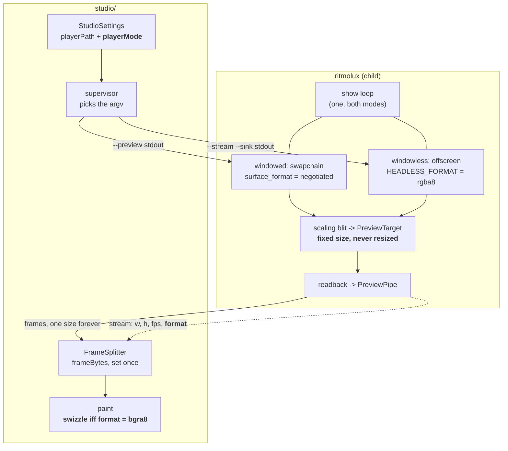

# 0167 — The studio becomes handable

> **Status:** in-progress
> **Created:** 2026-09-10
> **Owner skill(s):** dev, studio-builder, human
> **Related ADRs:** [0186](../adrs/0186-the-studios-player-mode-is-a-per-machine-setting.md) (proposed),
> [0187](../adrs/0187-the-preview-pipe-has-a-fixed-shape-and-names-its-true-format.md) (proposed),
> [0178](../adrs/0178-the-studio-shell-conventions.md) (accepted, with an Outcome this plan retires
> half of), [0183](../adrs/0183-the-studio-drives-one-player-and-the-show-loop-is-extracted.md)
> (accepted, with an Outcome this plan discharges),
> [0184](../adrs/0184-the-player-reports-what-it-loaded-and-the-studio-re-derives-nothing.md),
> [0170](../adrs/0170-a-parameters-reference-row-is-generated-from-the-declaration-the-engine-reads.md)
> **Closes:** design-backlog 0199, design-backlog 0200, design-backlog 0201
> **Depends on:** [0159](done/0159-the-studio-opens.md) closed 2026-09-10 owing its two `human`
> phases; **this plan runs them as Phases 7 and 8.**

## TL;DR

The studio shipped and cannot be handed to anyone. Three High backlog entries stand against it: the
preview paints red and blue swapped, the preview dies the first time the show window is resized, and
a one-screen machine gets a show window permanently in the way. This plan repairs all three at the
source, discharges the two studio debts earlier closes left, and then runs Plan 0159's unrun tester
handoff and on-device check. The last thing it produces is a VJ who has used the studio.

## Context & problem

Plan 0159 closed on 2026-09-10 with nine of eleven phases landed. The two that did not run are
`human` — the tester handoff and the on-device check — and they were deferred deliberately, because
running the packaged artifact on the development machine produced three defects in one session:

- **[backlog 0199]** the studio always spawns a windowed player, so a single-screen machine gets two
  overlapping windows and no way to ask for one.
- **[backlog 0200]** the `stream` event declares `rgba8` while the windowed preview intermediate is
  built at the negotiated swapchain format, so on a BGRA backend every studio frame is drawn with red
  and blue swapped.
- **[backlog 0201]** the preview stops updating mid-session while the show keeps drawing. Diagnosed
  at Plan 0159's close: a show-window resize changes the readback's size, the sink refuses the
  mismatched frame, and the writer thread breaks on that error and discards its message.

None of the three is a thing to hand a VJ, and 0201 in particular is undiagnosable from the studio's
own instruments — its footer reads `0 dropped` throughout.

Underneath 0200 and 0201 sits one fact: **the `stream` event describes a pipe that is not the pipe.**
It names a format the windowed path does not use and a geometry that moves out from under it. Repair
that and both defects go with it, which is why they are one ADR rather than two.

Two debts also fall due here, both studio-facing and both cheap while the studio is open:

- Plan 0161 landed `kind` on every `ParamSpec` and two `[hold]` table descriptors in the exported
  schema. The studio has neither re-exported nor grown an editor for them.
- Plan 0159 Phase 7's second done-when is unmet: `--schema` carries no function or variable roster,
  so `presetLanguage` is handed nothing and an expression's identifiers are uncoloured.

## Decision

We fix the two defects **at the source in `standalone/` and `core/`**, and add the windowless mode as
a real mode rather than as a way of avoiding them. That distinction is the whole shape of this plan:
windowless makes all three symptoms vanish — the headless path is `rgba8` by construction, there is
no window to resize, and there is no window in the way — and if it shipped alone the windowed path
would stay broken while looking fixed. **The windowed path is the VJ case, and the VJ is who the
player is for.**

[ADR-0187](../adrs/0187-the-preview-pipe-has-a-fixed-shape-and-names-its-true-format.md) gives the
preview a fixed shape (a scaling blit into a sized target, so the geometry never moves) and makes
`format` report what the pipe actually carries.
[ADR-0186](../adrs/0186-the-studios-player-mode-is-a-per-machine-setting.md) makes the mode a
per-machine setting.

The phases are ordered **`dev` first, then `studio-builder`, then `human`** — one lane handoff rather
than the five Plan 0159 paid for.

## Architecture diagram

## Implementation phases

### Phase 1 — The preview pipe stops moving under the reader
- **Owner skill:** dev
- **What:** [ADR-0187](../adrs/0187-the-preview-pipe-has-a-fixed-shape-and-names-its-true-format.md)'s
  first half. `PreviewTarget` gains a target size; the preview readback is opened against that size
  and filled by a sampling blit from the intermediate rather than an exact copy; `--preview` takes a
  size (`--preview stdout` keeps a default). `Renderer::resize` rebuilds the intermediate as it does
  today and **leaves the preview target's size alone**. Closes [backlog 0201].
- **Files touched:** `core/src/render/preview.rs` (the target's size), `core/src/render/mod.rs`
  (`open_preview`, `resize`, and `preview_readback_size`'s doc comment, whose *"an exact copy has one
  size"* is exactly what stops being true), `core/src/render/preview_readback.rs`,
  `standalone/src/cli.rs` (`--preview` takes a value of the form `stdout` or `stdout@WxH`),
  `standalone/src/app_state.rs`, `docs/capturing.md`, `docs/configuration.md`.
- **Done when:**
  - **A show-window resize does not stop the preview.** A test drives a windowed run through a
    resize and asserts frames continue: the pipe's byte count after the resize is non-zero and the
    frame size is the one `stream` announced. This is the assertion backlog 0201 exists for, and it
    is the one nothing in the tree makes today.
  - Fullscreen toggle and maximize are covered by the same test, because they arrive at the same
    `WindowEvent::Resized`.
  - **The preview target's size is independent of the surface's**: a test opens a preview at a size
    that is neither the window's nor a divisor of it, resizes twice, and asserts
    `preview_readback_size` returns the requested size all three times.
  - `--sink stdout` is byte-identical to before this phase for the same `--size`: the existing
    `stream_pipe.rs` assertions still pass unchanged, which is what says the `ffmpeg` contract did
    not move.
  - **The frame-time cost of the blit is reported, not assumed.** `diagnostics.log`'s one-second rows
    before and after, windowed, release, one preset, one machine, named — in the shape Plan 0159
    Phase 3 used. No threshold: the reading is the deliverable.

### Phase 2 — The `stream` event names the format it actually carries
- **Owner skill:** dev
- **What:** [ADR-0187](../adrs/0187-the-preview-pipe-has-a-fixed-shape-and-names-its-true-format.md)'s
  second half. `STREAM_FORMAT` stops being a constant; the emission reads the texture format the
  preview frames are produced at and reports `rgba8` or `bgra8`. Spec 0003's `stream` row moves from
  one value to a closed set. Closes the player half of [backlog 0200].
- **Files touched:** `standalone/src/stream.rs` (the constant goes, a mapping arrives),
  `standalone/src/show.rs` (`emit_stream` takes the format), `standalone/src/app_state.rs`,
  `core/src/render/mod.rs` (an accessor for the preview target's format, beside the size one),
  `docs/specs/0003-studio-control-protocol.md`, `docs/capturing.md`.
- **Done when:**
  - **The declared format equals the actual one, on both run modes.** A test asserts the string in
    the `stream` event against the `wgpu::TextureFormat` the preview target was built with, for the
    windowed and the windowless path. A property, not a fixture: it holds on an adapter that
    negotiates either order, and it is the assertion that would have caught 0200 the day it shipped.
  - The mapping is total over the formats a preview target can be built at, and a format outside
    that set is a named error rather than a silent `rgba8` — the failure mode this phase exists to
    end must not be reachable by a different road.
  - Spec 0003's `stream` row names both values and says which run mode produces which; the studio's
    spec-diff test, which already walks that table, covers the `Fields` column for it.

### Phase 3 — `--schema` declares the grammar
- **Owner skill:** dev
- **What:** The exported schema document gains a `grammar` section: the variable roster from
  `VAR_NAMES` and the function roster from `Func`. Generated by walking the engine's own
  declarations, never restated — the discipline
  [ADR-0170](../adrs/0170-a-parameters-reference-row-is-generated-from-the-declaration-the-engine-reads.md) already holds the
  parameter half to. Discharges Plan 0159 Phase 7's unmet done-when.
- **Files touched:** `core/src/preset/expr.rs` (whatever export the roster needs; `VAR_NAMES` is
  already `pub`, `Func::from_name` is not), `core/src/preset/schema/export.rs`,
  `core/src/preset/schema/tests.rs`, `core/tests/preset.rs`, `docs/presets.md`.
- **Done when:**
  - **Every name the engine knows appears, and no other.** A test diffs the exported grammar against
    `VAR_NAMES` and against the roster `Func::from_name` accepts, **in both directions** — the shape
    the studio's spec-diff test uses, so a name added to the engine and not the export fails, and so
    does the reverse.
  - The document's `hash` moves and `SCHEMA_VERSION` does not: this is additive, and the body hash is
    the staleness signal the studio already compares.
  - `docs/presets.md` stays the human reference and says the roster is exported, without restating
    it — a second copy here is the drift ADR-0170 exists to end.

### Phase 4 — The studio paints what it was told
- **Owner skill:** studio-builder
- **What:** The renderer reads `format` off the `stream` event and paints correctly for either order.
  Closes the studio half of [backlog 0200]. Where the swizzle goes is the studio's call: a fragment
  shader on a texture upload is free and also lifts the `putImageData` ceiling Plan 0159's own risk
  section anticipated; a CPU swizzle is simpler and is enough at 640x360. **Take the reading before
  choosing** — the paint path is a measurement, not a preference.
- **Files touched:** `studio/shared/protocol.ts` (the `format` union), `studio/shared/frames.ts`,
  `studio/renderer/components/Preview.tsx`, `studio/renderer/framePort.ts`,
  `studio/shared/protocol.spec.test.ts`.
- **Done when:**
  - **A `bgra8` frame and an `rgba8` frame of the same picture paint to the same colours.** A test
    feeds both, reads the canvas back, and asserts equality — the assertion that says the swizzle is
    applied to exactly one of them.
  - An unknown `format` value is a visible refusal, not a guess and not a blank canvas: the same
    treatment Phase 1 of Plan 0159 gave an unknown `hello` version.
  - The frame reader still takes its geometry from `stream` and no size, rate or format is
    hard-coded anywhere under `studio/`; the existing test that asserts this is extended to `format`.

### Phase 5 — The player mode is a per-machine setting
- **Owner skill:** studio-builder
- **What:** [ADR-0186](../adrs/0186-the-studios-player-mode-is-a-per-machine-setting.md).
  `StudioSettings` gains `playerMode`; the supervisor picks the argv; the UI offers the choice
  somewhere a setting belongs rather than in the editing surface. Closes [backlog 0199].
- **Files touched:** `studio/electron/settings.ts`, `studio/electron/player/supervisor.ts`
  (`DEFAULT_PLAYER_ARGS` becomes a function of the mode), `studio/electron/ipc/appHandlers.ts`,
  `studio/renderer/` (the settings surface), `studio/README.md`, `packaging/studio/READ-ME-FIRST.md`
  (a tester on one screen needs to know this exists).
- **Done when:**
  - **`windowless` opens no window**, and the studio shows a picture anyway: a test spawns the real
    player in that mode and asserts frames arrive and no window is created. It skips with a printed
    notice in ADR-0016's shape where there is no adapter or capture endpoint, as the studio's
    existing spawned-player test does.
  - **Both modes carry `--events` and `--control`.** A test walks both argument vectors and asserts
    it, because a flag added to one and not the other is the mode-dependent bug Plan 0159 Phase 3
    existed to end.
  - The mode survives a restart, and an unset or unrecognised value reads as `windowed` — the
    default is the VJ case.
  - The studio does not describe the windowless preview as a show feed. ADR-0186's Negative is that
    the by-construction guarantee is given up in that mode; the surface says so in one line.

### Phase 6 — The two debts, discharged
- **Owner skill:** studio-builder
- **What:** The studio re-exports the schema and grows the surfaces the last two closes left owed: an
  editor for the `[hold]` table and for `ParamSpec`'s `kind` (Plan 0161), and expression colouring
  driven from Phase 3's grammar roster (Plan 0159 Phase 7).
- **Files touched:** `studio/shared/schema.ts`, `studio/renderer/components/TableEditor.tsx`,
  `studio/renderer/components/ParamRow.tsx` (an integer parameter is not a continuous slider),
  `studio/renderer/editor/expr-language.ts`, `studio/renderer/hooks/useSchema.ts`, and the tests
  beside each.
- **Done when:**
  - **`[hold]` has an editor and none is hand-listed.** Plan 0159 Phase 8's test walks the schema and
    asserts a component resolves for every table kind; it now covers `[hold]` **because the schema
    declares it**, with no edit to the test's own roster. If that test needed editing, the walk was
    not a walk.
  - **A parameter the engine rounds is not offered a continuous control.** `kind` drives the widget:
    an integer parameter gets integer steps, and a test asserts it for every parameter the schema
    marks.
  - **Every name in the grammar roster is highlighted, and no other.** This is Plan 0159 Phase 7's
    done-when, verbatim, now reachable — `expr-language.test.ts` already pins both arms and needs a
    roster passed to it.

### Phase 7 — The tester handoff
- **Owner skill:** human
- **What:** Plan 0159's Phase 10, run at last. Hand the studio zip to one VJ who has never seen the
  repository.
- **Done when:** They open it, see the picture **in the right colours**, move a slider, save, and the
  player picks up the saved file, without any instruction beyond
  `packaging/studio/READ-ME-FIRST.md`. What they could not do is written into
  [`docs/design-backlog.md`](../design-backlog.md) as entries with probes.

### Phase 8 — The on-device check
- **Owner skill:** human
- **What:** Plan 0159's Phase 11. The studio beside a fullscreen player on the projector, driven over
  `--control`, for one full track, on the development machine and on the macOS arm.
- **Done when:** [`docs/on-device-validation.md`](../on-device-validation.md) carries the checklist
  with both machines' readings: the preview's dropped-frame count over the track, and the player's
  `health` line with the studio attached against a run without it. **The comparison against Plan 0159
  Phase 4's 42 -> 35.4 fps is the point** — Phase 1 is supposed to have narrowed that gap, and this
  is where the claim is either earned or not. Fullscreen is toggled at least once during the track,
  because that is the gesture that used to end the preview.

## Risks & open questions

- **The blit's cost is not yet measured.** ADR-0187 argues it is cheaper than the readback it feeds,
  which is an argument rather than a reading. Phase 1's last done-when is where it becomes a number,
  and if it is not cheap the honest answer is a smaller default rather than reverting the shape.
- **A scaled preview may be judged as if it were exact.** The mode exists so an author can watch the
  music move the picture; someone will eventually use it to judge a one-texel seam and be misled.
  Phase 5's last done-when puts one line on the surface; whether that is enough is a question for the
  tester in Phase 7.
- **`bgra8` may not reproduce on this machine.** If the development adapter negotiates RGBA, Phase 2's
  cross-mode assertion still holds but the *visible* half of 0200 cannot be seen locally, and the
  swizzle in Phase 4 is exercised only by its synthetic test. Say so in the log rather than claiming a
  visual confirmation that was not taken.
- **Two `human` phases can be deferred twice.** They were deferred once already. If they are deferred
  again, this plan does not close — that is the point of putting them here rather than in a followup.

## What this plan does NOT do

- **It does not make the writer thread loud.** `PreviewPipe`'s writer still exits on a sink error
  without printing it. After Phase 1 no size disagreement can arise, so the silence is unreachable
  rather than repaired — chosen deliberately at this plan's interview. If a later change reintroduces
  a way for that error to fire, the `eprintln!` comes with it.
- **It does not fix the drop accounting.** `FramePump` still counts a drop only when a frame arrives
  while one is unacknowledged, so loss upstream of it stays invisible. A cheaper pipe makes that loss
  rarer without making it visible; ADR-0178's `Outcome` and [backlog 0201] both record what a real
  fix would have to distinguish.
- **It does not add a mid-session mode toggle.** ADR-0186 Alternative A.
- **It does not touch clip rendering, show projects, or the diffusion pass.** Each is its own plan,
  and the first of them needs a `render` subcommand nobody has built.
- **It does not publish `packaging/studio/READ-ME-FIRST.md` as a site install page.** That needs a
  route and a menu entry together (`check-site-routes.mjs` requires both) and is its own small plan.

## Implementation log

> Written by the implementing lane — one row per phase as that phase's commit lands, and the
> close block after the last one. **The phases above are the contract; everything here is what
> happened.** **Observations, never conclusions:** this says where to look, architect decides
> how it went. No per-criterion pass list, no self-assessment, no narrative — but a deviation
> from the plan or an unmet done-when is always disclosed. Stays shorter than
> `## Implementation phases` above.

**Lane:** `main` directly.

| phase | owner | state | commit |
|---|---|---|---|
| 1 — The preview pipe stops moving under the reader | dev | done | 80fc61c |
| 2 — The `stream` event names the format it actually carries | dev | done | fbae516 |
| 3 — `--schema` declares the grammar | dev | done | 2cd608a |
| 4 — The studio paints what it was told | studio-builder | not started | |
| 5 — The player mode is a per-machine setting | studio-builder | not started | |
| 6 — The two debts, discharged | studio-builder | not started | |
| 7 — The tester handoff | human | not started | |
| 8 — The on-device check | human | not started | |

### Notes

**Phase 1 — the frame-time reading.** Windowed, release, `--preset Pulse`, 1920x1080, AMD Radeon
integrated on DX12, rich tier, ~70 s per run, read from `diagnostics.log`'s one-second rows. "after"
is `--preview stdout` at the new 640x360 default with the blit in the path:

| | before (no `--preview`) | after (`--preview stdout`) |
|---|---|---|
| rows | 68 | 68 |
| fps, median | 165.000 | 165.000 |
| `frame_ms_avg`, median | 6.061 | 6.061 |
| `frame_ms_p99`, median | 6.338 | 6.412 |
| `frames_dropped`, max | 0 | 0 |

A separate 12 s run with `--events` and standard output to a file: `stream` announced
`640x360 @ 165`, the file took 1 374 105 600 B — 1 491 whole frames at 921 600 B — and `health`
reported `preview_sent` climbing at ~165/s with `preview_dropped` 0 throughout. The display is
vsync-capped at 165 Hz, so the fps column has headroom in it and `frame_ms_avg` is the column that
carries the reading.

**Phase 1 — deviations.**

- **Two files outside the phase's list**: `standalone/src/run.rs` (its `App::preview_pipe` is what
  carries the parsed size from `cli.rs` to `app_state.rs`, so it changes type with them) and
  `standalone/tests/console_preview_memory.rs` (one `open_preview_readback` call site).
- **`the_readback_yields_the_frame_before_and_nothing_on_the_first` no longer asserts byte
  identity.** The readback reads a sampled tap rather than an exact copy, so the claim is now
  nearest-of-two — the readback is closer to the previous frame than to the current one. The
  byte-identity assertion on the **show's own** pixels
  (`the_shows_pixels_are_unchanged_with_the_readback_open`) is untouched and still exact.
- **`cargo test` on `core/tests/console_preview.rs` crashes with `STATUS_ACCESS_VIOLATION` when the
  harness runs its tests in parallel.** Verified against the unmodified tree at this phase's parent
  commit: it crashes there too, so it predates this work. `cargo nextest` gives each test its own
  process and is green.

**Phase 1 — noticed, not acted on.** The tap blit is a sampling pass with a format on both sides, so
converting `bgra8` to `rgba8` there would cost the same as the format-preserving blit that shipped —
which is not the per-frame CPU pass over 8 MB that ADR-0187 rejects under Alternative C. If that is
right, `format` could stay a single value and Phases 2 and 4 would have nothing to do. Implemented as
the ADR specifies; recording the observation rather than acting on it.

**Phase 2 — where the mapping and the refusal live.** The plan puts the mapping in
`standalone/src/stream.rs`; it is in `core/src/render/mod.rs` instead, as `PixelOrder` with
`Renderer::pixel_order()`, because `standalone` has no `wgpu` dependency and so cannot name a
`TextureFormat`. The refusal is `RenderError::UnnameablePixelOrder` and fires at
`open_preview_readback` and at `pixel_order()`, so no pipe opens at a format its announcement could
not describe. `standalone/src/show.rs`, `app_state.rs` and `stream.rs` pass what the renderer says.

One source serves both run modes: the frame tap, the capture target and the preview intermediate are
all built at `ctx.surface_format()`, so there is one question and not two.

**Phase 2 — how the BGRA half is reached.** A software adapter negotiates nothing, so
`the_declared_pixel_order_is_the_one_the_frames_carry` moves `ctx.config.format` and asserts the
textures the frames come out of follow it, on both orders. Nothing is drawn after the move — the
scene pipelines were built at the original format — and the claim is about what the textures are.
The **visible** half of backlog 0200 was not reproduced on this machine: the reading in Phase 1 was
taken on an adapter that negotiates RGBA, so no locally-rendered frame has had its channels swapped
and the swizzle Phase 4 adds will be exercised by its own test rather than by a picture.

**Phase 2 — files outside the list**: `standalone/tests/stream_pipe.rs` (a comment on why `rgba8` is
this sink's answer), `core/src/render/context.rs` (the new `RenderError` variant),
`core/src/render/preview_readback.rs` and `core/src/render/tests.rs` (the refusal and the tests).

**Phase 3 — a third roster, and why.** The plan names two, `VAR_NAMES` and `Func`. The exported
`grammar` carries three: `variables`, `functions` and **`constants`**. `is_reserved_ident` — the
engine's own answer to "is this name taken" — has three arms, and exporting two of them would leave
`pi` and `tau` uncoloured in the editor Phase 6 builds, which is the gap this phase closes. Two
strings, and the test diffs each roster against its own source.

**Phase 3 — `variables` is not `VAR_NAMES`.** The four reserved `[latch]` placeholders are in
`VAR_NAMES` as storage and are filtered out of the parser's identifier lookup, so a roster published
straight from `VAR_NAMES` would offer an editor four spellings that do not compile. The filter is now
one predicate (`is_bindable_slot`) that the parser and the export both read, and
`the_published_variable_roster_is_what_the_parser_accepts` asks `compile` rather than a second list.

**Phase 3 — `Func::from_name`'s match became a table.** `FUNCS` is `[(&str, Func); 17]`;
`from_name`, `name` and `function_names` all resolve through it, which is what makes "in both
directions" true by construction rather than by a test comparing two hand-written lists. `constant`
got the same treatment (`CONSTANTS`). A variant added to `Func` without a `FUNCS` entry is
constructed by nothing, so `dead_code` fails the build — which is why no test hand-lists the
variants.

**Phase 3 — files outside the list**: `docs/configuration.md` (the `--schema` paragraph names the
new object).

### Close triggers

- **`presets/` touched:**
- **Plan header `Closes:`** design-backlog 0199, 0200, 0201
- **What shipped:**
- **Operator docs touched:**
- **Backlog probes (`node scripts/check-backlog-claims.mjs`):**
- **Full suite:**
- **Outstanding `human` phases:**

## Followups (after this lands)

- The preview's drop accounting, so a stalled preview is distinguishable from a slow one.
- `packaging/studio/READ-ME-FIRST.md` as a published install page.
- Clip rendering from the studio (needs the `render` subcommand).
- Show projects (needs an interview and an ADR on the file's shape).

[backlog 0199]: ../design-backlog.md
[backlog 0200]: ../design-backlog.md
[backlog 0201]: ../design-backlog.md
