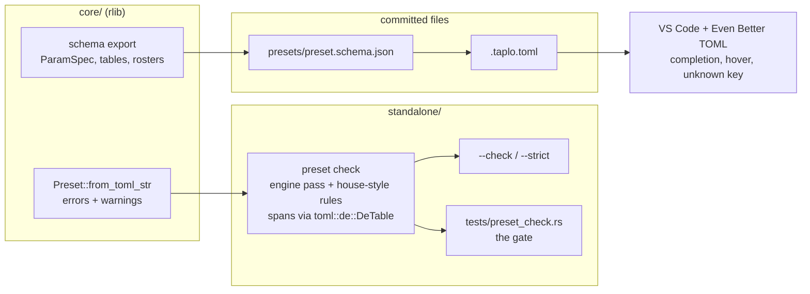

# 0169 — A preset is checked before it is rendered

> **Status:** draft
> **Created:** 2026-09-11
> **Owner skill(s):** `dev`, `human`
> **Related ADRs:** [0190](../adrs/0190-preset-toml-is-checked-by-the-loader-and-never-reformatted.md),
> [0170](../adrs/0170-a-parameters-reference-row-is-generated-from-the-declaration-the-engine-reads.md)

## TL;DR

`ritmolux --check <path>` loads a preset file, or every `*.toml` in a directory, through the
engine's own loader without opening a GPU adapter, and prints each error and warning as
`path:line:col: severity[rule]: message`. It exits non-zero on an error, and on a warning too under
`--strict`. A handful of house-style rules the loader does not own ride on the same pass. A GPU-free
integration test runs it over `presets/`, `presets/proposed/`, `presets/pending/` and
`docs/examples/`, so the existing `nextest` run becomes the gate. For the editor, a JSON Schema
rendered from the `--schema` export is committed beside the presets and associated through
`.taplo.toml`, so Even Better TOML completes parameter names, shows their documentation on hover and
underlines an unknown key. **Nothing formats a preset** — ADR-0190 records why, with the dry run.

## Context & problem

The owner asked whether preset TOML can be linted and pretty-printed. The answers split:

- **Pretty-printing is rejected**, on measurement (ADR-0190's table): `taplo fmt` rewrites 99-121 of
  124 files under every configuration tried, panics on eight shipped presets under its defaults,
  flattens alignment the authors chose, and a `--check` gate fails after the studio's first saved
  slider because `studio/shared/toml.ts` edits by line.
- **Linting has a real gap.** The only check is `core/tests/preset.rs`, which loads the *embedded*
  set and asserts zero warnings. It is a test-suite-length loop, and it never sees `proposed/`,
  `pending/` or `docs/examples/`. An unknown parameter name is a warning with the binding kept
  (ADR-0020), so a typo loads, renders and does nothing.

Four facts the design stands on, each checked against the tree on 2026-09-11:

- `PresetError::span()` returns a byte range **only** for the TOML arm; `PresetError::param()` names
  the parameter of an expression error; `Config` errors and every entry of `Preset::warnings`
  (`Vec<String>`) carry no position.
- `toml` `=1.1.3`, already pinned in `core/` and `standalone/`, exports `toml::de::DeTable::parse`,
  which returns every key and value wrapped in `Spanned` under the default features.
- `ritmolux --schema` already prints a versioned document with `systems`, `stages`, `tables` and
  `grammar` sections, rendered in `core/src/preset/schema/export.rs` from the `ParamSpec`
  declarations; it is handled before a renderer exists (`standalone/src/run.rs`).
- `standalone/tests/configuration_doc.rs` fails if a flag `--help` prints is not named in
  `docs/configuration.md`.

## Decision

Build the checker in Rust behind `--check`, reusing the loader; generate the editor schema from the
export; adopt no formatter (ADR-0190). The interview settled three things: the checker serves the
`preset-author` loop, the owner in VS Code with Even Better TOML, and a gate alike; errors block and
warnings report unless `--strict`; and the house-style rules live in Rust inside `--check` rather than
in a separate tool. We rejected an ESLint plugin (a third npm project and a second checker that can
never see an expression error) and a dependency-free Node gate (the useful rules need structure a
line matcher does not have).

## Architecture diagram



## Implementation phases

### Phase 1 — `--check` reports the loader's verdict at a position
- **Owner skill:** dev
- **What:** A `preset_check` module in `standalone/`'s library and the `--check <path>` / `--strict`
  flags, reporting the engine's errors and warnings as positioned diagnostics.
- **Files touched:** `standalone/src/` (new module, `cli.rs` flag roster, `run.rs` early exit beside
  `--schema`), `standalone/tests/` (new test file), `docs/configuration.md`.
- **Behaviour:**
  - `<path>` is a file, or a directory whose `*.toml` files are checked **non-recursively** (the
    ADR-0022 convention `build.rs` already follows). `--strict` requires `--check`.
  - One line per diagnostic on stdout, `path:line:col: error|warning[rule]: message`, the path as
    given. Line and column are 1-based; the column counts Unicode scalar values, not bytes. The rule
    for everything the loader reports is `engine`. A summary line — files checked, errors,
    warnings — goes to stderr.
  - Positions: a TOML error uses `PresetError::span()`. An expression error is placed on the key
    `PresetError::param()` names, found in the `DeTable::parse` of the same source; if no key matches,
    the diagnostic goes to the file level. A `Config` error and every warning go to the file level,
    `path:1:1`.
  - Exit `0` when there is no error (and, under `--strict`, no warning); `1` otherwise; `2` for a
    usage or I/O failure such as a missing path.
  - No GPU adapter, audio device or window is opened; the flag exits before any of them exist.
- **Done when:**
  - `ritmolux --check presets` exits 0 with no diagnostic lines on the tree as it stands (the core
    suite already holds the embedded set to zero warnings, so any line printed here is the checker
    misreporting).
  - A test fixture with a non-compiling binding in `[params]` reports `error[engine]` at the line of
    that binding's key; a fixture with a bare number (`glow = 1.0`) reports `error[engine]` at the line
    of that value, from the TOML span; a fixture with a misspelled parameter reports `warning[engine]`,
    exits 0, and exits 1 under `--strict`.
  - The tests run the binary as `help_cli.rs` does, and pass on a runner with no GPU adapter.
  - `docs/configuration.md` names both flags, so `configuration_doc.rs` stays green.

### Phase 2 — the house-style rules and the gate
- **Owner skill:** dev
- **What:** The rules the loader does not own, each with a rule id and its own seeded failing
  fixture, plus the integration test that runs the checker over the four directories.
- **Files touched:** `standalone/src/` (the check module), `standalone/tests/preset_check.rs`,
  `.editorconfig` (new), `docs/presets.md`.
- **Rules** — all warnings. Each one holds on every tracked TOML under `presets/` and
  `docs/examples/` at `b301507`, measured 2026-09-11:
  - `file-name` (**library files only**): the filename's prefix, up to the first `_`, is one of the
    `_`-separated segments of the `system` value (`collage_mono.toml` / `shape_collage` passes).
  - `header-comment` (**library files only**): the file opens with a `#` comment before its first
    key.
  - `hex-case`: every `#rrggbb` colour string is lowercase.
  - `trailing-whitespace`, `final-newline`, `tab`: no trailing spaces or tabs on any line, the file
    ends in exactly one `\n`, and no tab character anywhere.

  A **library file** is one whose parent directory is `presets/`, `presets/proposed/` or
  `presets/pending/`. `docs/examples/` is exempt from the two library rules: its files are named for
  what they teach (`step-1-constants.toml`) and `minimal.toml` is bare on purpose.
- **The gate** (`standalone/tests/preset_check.rs`): errors fail in all four directories. Warnings
  fail in `presets/`, `presets/proposed/` and `docs/examples/`, and are **printed but tolerated** in
  `presets/pending/`, which holds approved content waiting on an engine gap and may legitimately trip
  the loader's warnings.
- **`.editorconfig`**: a `[*.toml]` section with `insert_final_newline`, `trim_trailing_whitespace`
  and space indentation. Nothing about alignment.
- **Done when:**
  - The gate passes on the tree as it stands. If a `proposed/` or `docs/examples/` file warns on the
    first run, stop and report it in the log rather than loosening the policy or editing the
    content: the content is `preset-author`'s, and the policy is architect's.
  - Each rule has a fixture that trips it and a near-miss that does not (for `file-name`, a
    `shape_x.toml` declaring `shape_collage` passes, and `swarm_x.toml` declaring `attractor` fails).
  - The gate is **not** excluded by the `fast` nextest profile, so `.githooks/pre-push` and CI both
    run it; check this against `.config/nextest.toml` rather than assuming it.
  - `docs/presets.md` names `ritmolux --check` in its authoring loop, beside `shot`.

### Phase 3 — the editor schema
- **Owner skill:** dev
- **What:** A JSON Schema rendered from the same export `--schema` prints, committed as
  `presets/preset.schema.json`, held to the engine by a drift test, and associated with preset files
  through a committed `.taplo.toml`.
- **Files touched:** `core/src/preset/schema/export.rs`, `core/tests/` (drift and validation tests),
  `presets/preset.schema.json` (generated), `.taplo.toml` (new), `docs/developing.md`.
- **Shape:**
  - Top-level keys, and every structural table with its keys: a key whose export `KeyKind` has a
    roster becomes an `enum`; an expression key becomes a string.
  - `[params]` properties are the system's `ParamSpec`s plus the stage parameters every system
    accepts, each `type: string` (a binding is always an expression string) with the declaration's
    doc line as its `description` and its default and range in `markdownDescription`. Keyed per
    `system` through `allOf` + `if`/`then`. The same holds for each `[[layer]]` against that layer's
    own `system`.
  - `additionalProperties: false` only on the objects whose key set the export is authoritative for.
  - No range is enforced anywhere: `ParamSpec::range` is not a validation bound, and every value is
    an expression string.
- **One model, two renderings.** The JSON text and the corpus test both come from one in-memory
  description of the schema, so the test validates the parsed TOML against that description without
  a JSON parser. No JSON dependency enters the workspace.
- **`.taplo.toml`** associates the schema with `presets/**/*.toml` and `docs/examples/**/*.toml`, and
  carries a comment that the project does not format TOML (ADR-0190) — its `[formatting]` table stays
  absent.
- **Done when:**
  - Every tracked TOML under `presets/` and `docs/examples/` validates against the schema with
    **zero** violations: an editor squiggle on a correct shipped preset is the failure this phase
    most has to avoid.
  - A fixture with a misspelled `[params]` key, and one with an off-roster `layout`, each produce a
    violation naming the key.
  - `presets/preset.schema.json` matches what the engine renders, and
    `RLX_UPDATE_PRESET_SCHEMA=1` rewrites it — the shape `the_parameter_reference_block_is_current`
    uses for `presets/README.md`.
  - `core/build.rs` still embeds exactly the `*.toml` files it did before; the new `.json` is not
    picked up.
  - `docs/developing.md` has a short editor section: install Even Better TOML; the schema comes from
    `.taplo.toml` with no per-user setup; set `"[toml]": { "editor.formatOnSave": false }` if your
    VS Code formats on save, because the extension ships a formatter; and an optional VS Code task
    running `ritmolux --check ${file}` with a problem matcher. `.vscode/` stays gitignored.

### Phase 4 — the editor, verified on the owner's machine
- **Owner skill:** human
- **What:** Open a preset in VS Code with Even Better TOML installed and confirm the schema works as
  specified.
- **Done when:**
  - In a `fragment_field` preset's `[params]`, completion offers that system's parameters and not a
    `swarm` parameter; hovering a key shows its doc line.
  - Misspelling a key underlines it, and fixing it clears the underline.
  - Saving an unedited preset leaves `git diff` empty.

## Data shapes

```rust
// illustrative — not the final interface
pub struct Diagnostic {
    pub severity: Severity,        // Error | Warning
    pub rule: &'static str,        // "engine", "file-name", "hex-case", ...
    pub span: Option<Range<usize>>, // byte range into the source; None = file level
    pub message: String,
}
pub fn check(path: &Path, src: &str) -> Vec<Diagnostic>;
```

## Risks & open questions

- **A `proposed/` or `docs/examples/` file may already warn.** The core suite checks only the
  embedded set, so nothing has measured the other three directories under the loader. Phase 2 stops
  on this rather than choosing between loosening the gate and editing content.
- **The owner's working tree has uncommitted presets** (`presets/curve_blueprint.toml` and two
  siblings, untracked, on 2026-09-11). The local gate reads the directory, so an in-flight file is
  checked on the owner's machine before it is committed. That is intended, and it is also a way for
  the gate to go red on work that is not this plan's.
- **Warnings are placed at line 1.** Only the unknown-key warning gets a real position, from the
  schema in the editor. Giving `Preset::warnings` structure is a core change with the studio as a
  consumer, so it is out of scope here — see Followups.
- **Taplo's JSON Schema support** (draft-07 `if`/`then`) is trusted, not tested by any gate. Phase 4
  is the only evidence, and it is why that phase exists.
- **Even Better TOML's formatter** is outside anything this repository can switch off. The docs say
  so and Phase 4 checks one save; a user who enables format-on-save anyway will produce a reformat
  diff, which review will catch because it will touch every line.

## What this plan does NOT do

- Format, align, sort or rewrap any TOML, or add a `--fix` mode. ADR-0190.
- Enforce `ParamSpec::range`, restate a rule the loader already enforces, or add an ESLint or npm
  toolchain.
- Change the loader's behaviour: an unknown parameter stays a warning with the binding kept.
- Check TOML outside presets and examples (`Cargo.toml`, `deny.toml`, `config.toml`).
- Touch `studio/`. The studio already reports the player's errors, and whether it shows `--check`'s
  house-style warnings is a later `studio-builder` question.

At close, architect adds `ritmolux --check <file>` to the `preset-author` skill's self-verification
step, ahead of `shot` — the skill is the lane's, not `dev`'s.

## Implementation log

> Written by `dev` — one row per phase as that phase's commit lands, and the close block after the
> last one. **The phases above are the contract; everything here is what happened.**

**Lane:** _(not started)_

| phase | owner | state | commit |
|---|---|---|---|
| 1 — `--check` reports the loader's verdict at a position | dev | not started | |
| 2 — the house-style rules and the gate | dev | not started | |
| 3 — the editor schema | dev | not started | |
| 4 — the editor, verified on the owner's machine | human | not started | |

### Notes

### Close triggers

- **`presets/` touched:**
- **Plan header `Closes:`**
- **What shipped:**
- **Operator docs touched:**
- **Backlog probes (`node scripts/check-backlog-claims.mjs`):**
- **Full suite:**
- **Outstanding `human` phases:**

## Followups (after this lands)

- Give `Preset::warnings` structure (a kind plus the key it concerns) so `--check` and the studio can
  place every warning, not just the unknown key the schema already covers.
