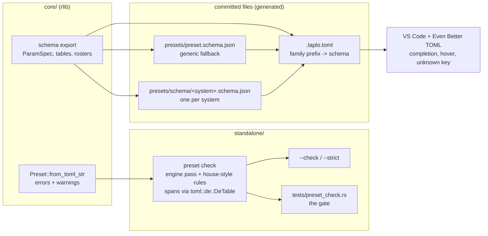

# 0169 — A preset is checked before it is rendered

> **Status:** in-progress
> **Created:** 2026-09-11
> **Owner skill(s):** `dev`, `human`
> **Related ADRs:** [0190](../adrs/0190-preset-toml-is-checked-by-the-loader-and-never-reformatted.md),
> [0170](../adrs/0170-a-parameters-reference-row-is-generated-from-the-declaration-the-engine-reads.md)

## TL;DR

`ritmolux --check <path>` loads a preset file, or every `*.toml` in a directory, through the
engine's own loader without opening a GPU adapter, and prints each error and warning as
`path:line:col: severity[rule]: message`. It exits non-zero on an error, and on a warning too under
`--strict`. A handful of house-style rules the loader does not own ride on the same pass. A GPU-free
integration test runs it over `presets/`, `presets/proposed/`, `presets/pending/` and
`docs/examples/`, so the existing `nextest` run becomes the gate. For the editor, JSON Schemas
rendered from the engine's declarations are committed beside the presets — **one self-contained file
per system**, chosen by the filename's family prefix in a generated `.taplo.toml`, plus a generic
file for everything else — so Even Better TOML completes parameter names, shows their documentation
on hover and flags an unknown key. **Nothing formats a preset** — ADR-0190 records why, with the dry
run.

**Amended 2026-09-13.** Phase 4 failed on the owner's machine: Taplo validates a single schema's
`if`/`then` but ignores it for hover and completion, so Phase 3's one-file shape gave no completion
and no hover on any parameter. Phases 5 and 6 replace it with the per-system shape; the evidence is
under Phase 4.

## Context & problem

The owner asked whether preset TOML can be linted and pretty-printed. The answers split:

- **Pretty-printing is rejected**, on measurement (ADR-0190's table): `taplo fmt` rewrites 99-121 of
  124 files under every configuration tried, panics on eight shipped presets under its defaults,
  flattens alignment the authors chose, and a `--check` gate fails after the studio's first saved
  slider because `studio/shared/toml.ts` edits by line.
- **Linting has a real gap.** The only check is `core/tests/preset.rs`, which loads the *embedded*
  set and asserts zero warnings. It is a test-suite-length loop, and it never sees `proposed/`,
  `pending/` or `docs/examples/`. An unknown parameter name is a warning with the binding kept
  (ADR-0020), so a typo loads, renders and does nothing.

Four facts the design stands on, each checked against the tree on 2026-09-11:

- `PresetError::span()` returns a byte range **only** for the TOML arm; `PresetError::param()` names
  the parameter of an expression error; `Config` errors and every entry of `Preset::warnings`
  (`Vec<String>`) carry no position.
- `toml` `=1.1.3`, already pinned in `core/` and `standalone/`, exports `toml::de::DeTable::parse`,
  which returns every key and value wrapped in `Spanned` under the default features.
- `ritmolux --schema` already prints a versioned document with `systems`, `stages`, `tables` and
  `grammar` sections, rendered in `core/src/preset/schema/export.rs` from the `ParamSpec`
  declarations; it is handled before a renderer exists (`standalone/src/run.rs`).
- `standalone/tests/configuration_doc.rs` fails if a flag `--help` prints is not named in
  `docs/configuration.md`.

## Decision

Build the checker in Rust behind `--check`, reusing the loader; generate the editor schema from the
export; adopt no formatter (ADR-0190). The interview settled three things: the checker serves the
`preset-author` loop, the owner in VS Code with Even Better TOML, and a gate alike; errors block and
warnings report unless `--strict`; and the house-style rules live in Rust inside `--check` rather than
in a separate tool. We rejected an ESLint plugin (a third npm project and a second checker that can
never see an expression error) and a dependency-free Node gate (the useful rules need structure a
line matcher does not have).

## Architecture diagram



## Implementation phases

### Phase 1 — `--check` reports the loader's verdict at a position
- **Owner skill:** dev
- **What:** A `preset_check` module in `standalone/`'s library and the `--check <path>` / `--strict`
  flags, reporting the engine's errors and warnings as positioned diagnostics.
- **Files touched:** `standalone/src/` (new module, `cli.rs` flag roster, `run.rs` early exit beside
  `--schema`), `standalone/tests/` (new test file), `docs/configuration.md`.
- **Behaviour:**
  - `<path>` is a file, or a directory whose `*.toml` files are checked **non-recursively** (the
    ADR-0022 convention `build.rs` already follows). `--strict` requires `--check`.
  - One line per diagnostic on stdout, `path:line:col: error|warning[rule]: message`, the path as
    given. Line and column are 1-based; the column counts Unicode scalar values, not bytes. The rule
    for everything the loader reports is `engine`. A summary line — files checked, errors,
    warnings — goes to stderr.
  - Positions: a TOML error uses `PresetError::span()`. An expression error is placed on the key
    `PresetError::param()` names, found in the `DeTable::parse` of the same source; if no key matches,
    the diagnostic goes to the file level. A `Config` error and every warning go to the file level,
    `path:1:1`.
  - Exit `0` when there is no error (and, under `--strict`, no warning); `1` otherwise; `2` for a
    usage or I/O failure such as a missing path.
  - No GPU adapter, audio device or window is opened; the flag exits before any of them exist.
- **Done when:**
  - `ritmolux --check presets` exits 0 with no diagnostic lines on the tree as it stands (the core
    suite already holds the embedded set to zero warnings, so any line printed here is the checker
    misreporting).
  - A test fixture with a non-compiling binding in `[params]` reports `error[engine]` at the line of
    that binding's key; a fixture with a bare number (`glow = 1.0`) reports `error[engine]` at the line
    of that value, from the TOML span; a fixture with a misspelled parameter reports `warning[engine]`,
    exits 0, and exits 1 under `--strict`.
  - The tests run the binary as `help_cli.rs` does, and pass on a runner with no GPU adapter.
  - `docs/configuration.md` names both flags, so `configuration_doc.rs` stays green.

### Phase 2 — the house-style rules and the gate
- **Owner skill:** dev
- **What:** The rules the loader does not own, each with a rule id and its own seeded failing
  fixture, plus the integration test that runs the checker over the four directories.
- **Files touched:** `standalone/src/` (the check module), `standalone/tests/preset_check.rs`,
  `.editorconfig` (new), `docs/presets.md`.
- **Rules** — all warnings. Each one holds on every tracked TOML under `presets/` and
  `docs/examples/` at `b301507`, measured 2026-09-11:
  - `file-name` (**library files only**): the filename's prefix, up to the first `_`, is one of the
    `_`-separated segments of the `system` value (`collage_mono.toml` / `shape_collage` passes).
  - `header-comment` (**library files only**): the file opens with a `#` comment before its first
    key.
  - `hex-case`: every `#rrggbb` colour string is lowercase.
  - `trailing-whitespace`, `final-newline`, `tab`: no trailing spaces or tabs on any line, the file
    ends in exactly one `\n`, and no tab character anywhere.

  A **library file** is one whose parent directory is `presets/`, `presets/proposed/` or
  `presets/pending/`. `docs/examples/` is exempt from the two library rules: its files are named for
  what they teach (`step-1-constants.toml`) and `minimal.toml` is bare on purpose.
- **The gate** (`standalone/tests/preset_check.rs`): errors fail in all four directories. Warnings
  fail in `presets/`, `presets/proposed/` and `docs/examples/`, and are **printed but tolerated** in
  `presets/pending/`, which holds approved content waiting on an engine gap and may legitimately trip
  the loader's warnings.
- **`.editorconfig`**: a `[*.toml]` section with `insert_final_newline`, `trim_trailing_whitespace`
  and space indentation. Nothing about alignment.
- **Done when:**
  - The gate passes on the tree as it stands. If a `proposed/` or `docs/examples/` file warns on the
    first run, stop and report it in the log rather than loosening the policy or editing the
    content: the content is `preset-author`'s, and the policy is architect's.
  - Each rule has a fixture that trips it and a near-miss that does not (for `file-name`, a
    `shape_x.toml` declaring `shape_collage` passes, and `swarm_x.toml` declaring `attractor` fails).
  - The gate is **not** excluded by the `fast` nextest profile, so `.githooks/pre-push` and CI both
    run it; check this against `.config/nextest.toml` rather than assuming it.
  - `docs/presets.md` names `ritmolux --check` in its authoring loop, beside `shot`.

### Phase 3 — the editor schema
- **Owner skill:** dev
- **What:** A JSON Schema rendered from the same export `--schema` prints, committed as
  `presets/preset.schema.json`, held to the engine by a drift test, and associated with preset files
  through a committed `.taplo.toml`.
- **Files touched:** `core/src/preset/schema/export.rs`, `core/tests/` (drift and validation tests),
  `presets/preset.schema.json` (generated), `.taplo.toml` (new), `docs/developing.md`.
- **Shape:**
  - Top-level keys, and every structural table with its keys: a key whose export `KeyKind` has a
    roster becomes an `enum`; an expression key becomes a string.
  - `[params]` properties are the system's `ParamSpec`s plus the stage parameters every system
    accepts, each `type: string` (a binding is always an expression string) with the declaration's
    doc line as its `description` and its default and range in `markdownDescription`. Keyed per
    `system` through `allOf` + `if`/`then`. The same holds for each `[[layer]]` against that layer's
    own `system`.
  - `additionalProperties: false` only on the objects whose key set the export is authoritative for.
  - No range is enforced anywhere: `ParamSpec::range` is not a validation bound, and every value is
    an expression string.
- **One model, two renderings.** The JSON text and the corpus test both come from one in-memory
  description of the schema, so the test validates the parsed TOML against that description without
  a JSON parser. No JSON dependency enters the workspace.
- **`.taplo.toml`** associates the schema with `presets/**/*.toml` and `docs/examples/**/*.toml`, and
  carries a comment that the project does not format TOML (ADR-0190) — its `[formatting]` table stays
  absent.
- **Done when:**
  - Every tracked TOML under `presets/` and `docs/examples/` validates against the schema with
    **zero** violations: an editor squiggle on a correct shipped preset is the failure this phase
    most has to avoid.
  - A fixture with a misspelled `[params]` key, and one with an off-roster `layout`, each produce a
    violation naming the key.
  - `presets/preset.schema.json` matches what the engine renders, and
    `RLX_UPDATE_PRESET_SCHEMA=1` rewrites it — the shape `the_parameter_reference_block_is_current`
    uses for `presets/README.md`.
  - `core/build.rs` still embeds exactly the `*.toml` files it did before; the new `.json` is not
    picked up.
  - `docs/developing.md` has a short editor section: install Even Better TOML; the schema comes from
    `.taplo.toml` with no per-user setup; set `"[toml]": { "editor.formatOnSave": false }` if your
    VS Code formats on save, because the extension ships a formatter; and an optional VS Code task
    running `ritmolux --check ${file}` with a problem matcher. `.vscode/` stays gitignored.

### Phase 4 — the editor, verified on the owner's machine
- **Owner skill:** human
- **What:** Open a preset in VS Code with Even Better TOML installed and confirm the schema works as
  specified.
- **Done when:**
  - In a `fragment_field` preset's `[params]`, completion offers that system's parameters and not a
    `swarm` parameter; hovering a key shows its doc line.
  - Misspelling a key underlines it, and fixing it clears the underline.
  - Saving an unedited preset leaves `git diff` empty.
- **Outcome (2026-09-12): failed.** In VS Code, completion in `[params]` offered only the editor's
  word list, hover on a parameter showed nothing, and the status bar read "no schema selected". The
  cause was isolated by driving Even Better TOML 0.21.2's own bundled Taplo server over node IPC
  exactly as the extension launches it (`dist/server.js`), from a session scratchpad, not committed:
  - **Association** failed first, then worked: Taplo joins a relative include glob onto the
    workspace root (`c:\Users\...`) and matches it against the document URL with the scheme stripped
    (`/c:/Users/...`), so on Windows only a glob beginning `/` matches. With that fix (uncommitted in
    `.taplo.toml` on 2026-09-12) `taplo/associatedSchema` returned `preset.schema.json`, source
    `config`. The status bar item is not evidence either way.
  - **Validation honours `allOf` + `if`/`then`:** a misspelled key produced *"Additional properties
    are not allowed ('wrapp' was unexpected)"*, placed on the `[params]` header line, not on the key.
  - **Hover and completion ignore `if`/`then`.** Hover worked on `system`, `name` and `[params]`
    (unconditional) and returned null on every parameter; completion in `[params]` returned 0 items.
    With `fragment_field`'s `params` hoisted out of the conditional, hover returned the doc line and
    completion returned that system's 46 names.
  - **Rejected shapes, each measured:** `oneOf`/`anyOf` over the systems merges hover text across
    systems, offers all 230 names, and reports a violation as the whole document at line 1. A rule
    pointing at `preset.schema.json#/definitions/...` fails (the fragment is read as part of the
    filename, `ENOENT`). A small per-system file that only `$ref`s the shared schema fails (*"could
    not determine schema URL"*). `additionalProperties: {not: {}}` moves the underline onto the key
    but the message quotes the value and never names the key.
  - **What worked end to end:** a self-contained per-system file on a rule
    `/**/presets/fragment_*.toml`, beside a generic rule on `/**/presets/*.toml` that **excludes**
    the family glob. The fragment file got its own schema and the swarm file the generic one — and
    since Taplo breaks a tie between equal-priority rules by taking the later one, which was the
    generic rule, the `exclude` is what selected it, not rule order.

### Phase 5 — one editor schema per system
- **Owner skill:** dev
- **What:** Render a self-contained JSON Schema per system, a generic fallback, and the `.taplo.toml`
  that selects between them by filename family; tighten the `file-name` rule to that same family.
- **Files touched:** `core/src/preset/schema/system.rs` (the family column),
  `core/src/preset/schema/export.rs`, `core/tests/preset_schema.rs`, `presets/schema/` (new, 14
  generated files), `presets/preset.schema.json` (regenerated), `.taplo.toml` (now generated),
  `standalone/src/preset_check.rs`, `standalone/tests/preset_check.rs`, `docs/developing.md`,
  `docs/presets.md` if it states the `file-name` rule.
- **Shape:**
  - **The family is declared on the system**, as a third column of `system.rs`'s `TABLE` read
    through `SystemKind::family()`: `fragment`, `swarm`, `curve`, `lsystem`, `star`, `reaction`,
    `attractor`, `spectrum`, `emitter`, `shape`, `warp`, `collage`, `analytic`, `cellular`. It
    cannot be derived — `shape_field` shares every segment with another system — so it is written
    down once, and both the editor rules and the `file-name` rule read it. Each family is one
    `_`-separated segment of its system's name, and no two systems share one; hold both at compile
    time or in a test.
  - **`presets/schema/<system>.schema.json`**, one per `SystemKind`: the generic schema's top-level
    object with `system` pinned to that system (`const`), `params` as that system's properties with
    `additionalProperties: false` and **no `if`/`then` anywhere on the top-level path**, and
    `definitions` pruned to what the file references. `[layer]` names its own system, so inside a
    per-system file its `params` are any string: no layer branches, which would pull every system's
    definitions back in (about 200 KB per file against about 66 KB, measured on a prototype). The
    `--schema` document is unchanged.
  - **`presets/preset.schema.json` stays** as the fallback for any TOML under `presets/` or
    `docs/examples/` that no family rule claims — the teaching examples, and a library file named off
    its family, which `--check` warns about. Its `if`/`then` shape is unchanged: it validates and does
    not complete.
  - **`.taplo.toml` is generated**, header comment included. One `[[rule]]` per system, including
    `/**/presets/<family>_*.toml`, `/**/presets/proposed/<family>_*.toml` and
    `/**/presets/pending/<family>_*.toml`, then one generic rule including `/**/presets/*.toml`,
    `/**/presets/proposed/*.toml`, `/**/presets/pending/*.toml` and `/**/docs/examples/**/*.toml`
    and **excluding every family glob**. The selection must rest on `exclude`, never on rule order.
    Every glob begins with `/`, and the header says why (Phase 4's outcome).
  - **The `file-name` rule** becomes: a library file's prefix, up to the first `_`, equals its
    system's family. On an unknown `system` the rule stays silent (the loader already errors). The
    diagnostic names the expected family, so it reads as the reason the editor gave the file no
    per-system schema.
  - **One command regenerates all of it:** `RLX_UPDATE_PRESET_SCHEMA=1` rewrites the generic file,
    every per-system file and `.taplo.toml`, and removes a `presets/schema/*.schema.json` no system
    renders.
- **Done when:**
  - The drift test fails on any stale generated file — each of the 16 — and on an extra file in
    `presets/schema/`; the env var repairs every case.
  - Every tracked library TOML validates against **its family's** file with zero violations, and
    every tracked TOML under `presets/` and `docs/examples/` still validates against the generic file.
  - Against `fragment_field.schema.json`, a `[params]` key belonging only to `swarm` (`force`) is a
    violation naming the key, and `system = "swarm"` is a violation.
  - The `file-name` gate passes on the tree. Its fixtures move with the rule: `collage_x.toml`
    declaring `shape_collage` passes, and `shape_x.toml` declaring `shape_collage` now fails.
  - `core/build.rs` embeds exactly the `*.toml` set it did before; nothing in `presets/schema/` is
    picked up.
  - `docs/developing.md`'s editor section says which files get completion (library files named for
    their family) and which get validation only (`docs/examples/`, `[layer]`), and names the one
    regenerate command.
  - **Before handing Phase 6 to the owner**, re-run Phase 4's probe shape against the regenerated
    tree: drive `dist/server.js` of the installed extension over node IPC, open a `fragment_*` and a
    `swarm_*` preset, and record in the log the associated schema, a hover on a parameter, and the
    completion count for each. The probe is not committed.

### Phase 6 — the editor, verified again
- **Owner skill:** human
- **What:** Phase 4's check, on the per-system schemas.
- **Done when:**
  - In a `fragment_*` preset's `[params]`, completion offers that system's parameters and not a
    `swarm` parameter; hovering a parameter shows its doc line.
  - Misspelling a key raises a Problems entry naming it (on the `[params]` header — the chosen
    placement, see Risks), and fixing it clears the entry.
  - Saving an unedited preset leaves `git diff` empty.

## Data shapes

```rust
// illustrative — not the final interface
pub struct Diagnostic {
    pub severity: Severity,        // Error | Warning
    pub rule: &'static str,        // "engine", "file-name", "hex-case", ...
    pub span: Option<Range<usize>>, // byte range into the source; None = file level
    pub message: String,
}
pub fn check(path: &Path, src: &str) -> Vec<Diagnostic>;
```

## Risks & open questions

- **A `proposed/` or `docs/examples/` file may already warn.** The core suite checks only the
  embedded set, so nothing has measured the other three directories under the loader. Phase 2 stops
  on this rather than choosing between loosening the gate and editing content.
- **The owner's working tree has uncommitted presets** (`presets/curve_blueprint.toml` and two
  siblings, untracked, on 2026-09-11). The local gate reads the directory, so an in-flight file is
  checked on the owner's machine before it is committed. That is intended, and it is also a way for
  the gate to go red on work that is not this plan's.
- **Warnings are placed at line 1.** Only the unknown-key warning gets a real position, from the
  schema in the editor. Giving `Preset::warnings` structure is a core change with the studio as a
  consumer, so it is out of scope here — see Followups.
- **Taplo's JSON Schema support** (draft-07 `if`/`then`) is trusted, not tested by any gate. Phase 4
  is the only evidence, and it is why that phase exists. **It was wrong for hover and completion**
  (Phase 4's outcome), which is what Phase 5 answers. Nothing in CI can run the extension, so the
  per-system shape is still held only by Phase 5's recorded probe and Phase 6; a Taplo upgrade that
  changes glob or schema handling will not be noticed by any gate.
- **The underline sits on the `[params]` header, not the misspelled key.** Chosen by the owner on
  2026-09-13 over `additionalProperties: {not: {}}`, which places it on the key at the price of a
  message that never names the key. In a long `[params]` block the header can be a hundred lines
  above the typo; the Problems panel entry names the key, and `--check` places it too.
- **About 925 KB of generated JSON is committed** across the 14 per-system files (a prototype
  measured about 66 KB each, pretty-printed). None of it ships; `build.rs` reads only `*.toml`.
- **The editor now depends on the filename.** A library file named off its family gets validation
  but no completion. The tightened `file-name` rule warns on exactly that file, and the gate fails
  it in `presets/`, so the two cannot disagree on the tracked tree.
- **Even Better TOML's formatter** is outside anything this repository can switch off. The docs say
  so and Phase 4 checks one save; a user who enables format-on-save anyway will produce a reformat
  diff, which review will catch because it will touch every line.

## What this plan does NOT do

- Format, align, sort or rewrap any TOML, or add a `--fix` mode. ADR-0190.
- Enforce `ParamSpec::range`, restate a rule the loader already enforces, or add an ESLint or npm
  toolchain.
- Change the loader's behaviour: an unknown parameter stays a warning with the binding kept.
- Give `[layer]`, or the teaching files under `docs/examples/`, per-system completion. Both keep
  validation from the generic schema; `[layer]` params are any string inside a per-system file.
- Change the `--schema` document, which Plan 0172 snapshots.
- Check TOML outside presets and examples (`Cargo.toml`, `deny.toml`, `config.toml`).
- Touch `studio/`. The studio already reports the player's errors, and whether it shows `--check`'s
  house-style warnings is a later `studio-builder` question.

At close, architect adds `ritmolux --check <file>` to the `preset-author` skill's self-verification
step, ahead of `shot` — the skill is the lane's, not `dev`'s.

## Implementation log

> Written by `dev` — one row per phase as that phase's commit lands, and the close block after the
> last one. **The phases above are the contract; everything here is what happened.**

**Lane:** `main`, directly in the primary worktree.

| phase | owner | state | commit |
|---|---|---|---|
| 1 — `--check` reports the loader's verdict at a position | dev | done | `0449b7f` |
| 2 — the house-style rules and the gate | dev | done | `73a9a10` |
| 3 — the editor schema | dev | done | `43aabb3` |
| 4 — the editor, verified on the owner's machine | human | failed 2026-09-12 — see its Outcome; replaced by 5 + 6 | |
| 5 — one editor schema per system | dev | done | `9e6faf1` |
| 6 — the editor, verified again | human | not started — the user's | |

### Notes

**Files touched beyond a phase's list.** `standalone/tests/stream_split.rs`, in `0449b7f`. The new
`println!` of diagnostics and the `eprintln!("{failure}")` refusal each tripped an existing gate in
that file — `nothing_writes_prose_to_standard_output_while_a_sink_could_be_open` and
`no_human_diagnostic_line_can_begin_with_a_brace` — whose allowlists are that gate's designed
accommodation. `preset_check.rs` was added to `STDOUT_WRITERS` with its reason, and `{failure}` to
`MESSAGE_PLACEHOLDERS`; `CheckFailure`'s only variant opens with the literal `--check `.

**An exit code the plan does not name, added then removed.** Phase 1 first refused a directory
holding no `*.toml` as a usage failure. That is outside the plan's exit-code table and it would have
made Phase 2's gate red on `presets/proposed/` and `presets/pending/`, which hold only a README
today. Removed before `0449b7f`: an empty directory exits 0 and the summary reports `checked 0
files`.

**Phase 2's gate walks `docs/examples/` recursively.** Fourteen of its fifteen files are in
subdirectories, so a flat read would have covered one. The `--check` CLI stays non-recursive as
Phase 1 specifies. Raised before Phase 1 and approved by the user at the Step 2 gate.

**Phase 3 renders `layer` as one object, not an array.** The phase says "each `[[layer]]`";
`RawPreset.layer` is `Option<RawLayer>`, a single optional table, so the schema and its `if`/`then`
case address `layer` as an object.

**`hold` admits any string rather than an `enum` of the two words.** The loader accepts a period
bare or quoted (`"2.0"`), so an `enum` of `beat`/`bar` would underline a legal value. The words are
carried as `examples`.

**Beyond the plan: the schema was validated with a real draft-07 validator.** ADR-0190 trusts
Taplo's `if`/`then` support without a gate, and Phase 3's own test is a second rendering of the same
declarations rather than a JSON reading. So the committed file was additionally run through `ajv` 6
against all 127 tracked presets parsed by `smol-toml` — both already present in
`studio/node_modules` and `site/node_modules`, nothing installed: **0 violations**. Six negative
cases were caught, each naming the key: a misspelled `[params]` key, an off-roster `layout`, an
off-roster `system`, an unknown top-level table, a bare-number binding, and a layer binding a
compositing parameter. Run from the session scratchpad and not committed, the shape ADR-0190's own
dry run took. This is evidence about the JSON, not a substitute for Phase 4: it says a draft-07
validator agrees, not that the extension does.

**Phase 5 touched `core/tests/hygiene.rs`, outside its file list.** `every_system_has_a_gallery_image`
reads system names by taking every string literal inside `system.rs`'s `TABLE`, so the family column
read as eight systems with no gallery image and the fast profile went red. Its `system_names` now
takes only the first literal after each `SystemKind::`. No assertion changed.

**The drift test was renamed**, `the_committed_schema_is_current` to
`the_generated_editor_files_are_current`, since it now holds sixteen files; the regenerate command in
`docs/developing.md` and in `.taplo.toml`'s header names the new test. **`presets/preset.schema.json`
did not change by a byte** in Phase 5 — the plan lists it as regenerated; only `json_schema`'s doc
comment moved.

**What the env var repairs.** An extra `presets/schema/*.schema.json` is reported and removed. An
extra file of any other kind in that directory is reported and **not** removed — the plan names only
`*.schema.json` for removal — so the done-when's "the env var repairs every case" holds for the
sixteen files and extra schemas, not for a stray README.

**The family checks are compile-time** (`const` asserts beside the row-order one): each family is a
segment of its system's name, and no two systems share one. Both were seeded to fail and did.

**The `--check` fixtures moved from `shape_*` to `collage_*`** throughout `preset_check.rs`, since
every house-rule fixture declares `shape_collage` and would now also trip `file-name`.

**Phase 5's probe** of the installed Even Better TOML 0.21.2, driving `dist/server.js` over node IPC
with the extension's `initializationOptions`, its `package.json` defaults, and VS Code's URI spelling
(`file:///c%3A/...`). `schema.catalogs` was emptied so nothing was fetched. A blank line was inserted
under `[params]` for completion, and a `wrapp = "1"` line for the diagnostic. Run from the session
scratchpad, not committed:

| file | `taplo/associatedSchema` | hover on first `[params]` key | completion under `[params]` | `wrapp` |
|---|---|---|---|---|
| `presets/fragment_driftmono.toml` | `presets/schema/fragment_field.schema.json`, source `config` | `palette_steps`: its doc line | 45 items | line 86 (`[params]`): *Additional properties are not allowed ('wrapp' was unexpected)* |
| `presets/swarm_braid.toml` | `presets/schema/swarm.schema.json`, source `config` | `field_freq`: its doc line | 46 items | line 61 (`[params]`), same message |
| `docs/examples/cellular/cyclic.toml` | `presets/preset.schema.json`, source `config` | `states`: null | 0 items | line 19 (`[params]`), same message |

Taplo omits keys a table already binds. So 45 is fragment_field's 61 accepted names less the 16 the
file binds, and 46 is swarm's 70 less 24. Neither list held a name exclusive to the other system (0 of
16 swarm-only names, 0 of 7 fragment-only), nor any name outside its own schema.

**Beyond the plan, as in Phase 3:** `ajv` 6 (from `studio/node_modules`) over the 112 library files
parsed by `smol-toml` (from `site/node_modules`), each against its family's schema: **0 violations**.
Against `fragment_field.schema.json`, `force` was refused as an additional property, `system =
"swarm"` as not the constant, and a swarm `[layer]` binding `force` passed. Scratchpad, not committed.

**Noticed, not acted on:** neither `docs/README.md`'s "Repository layout", `CLAUDE.md`'s tree, nor
`presets/README.md` mentions `presets/preset.schema.json`, `presets/schema/`, `.taplo.toml` or
`.editorconfig`. All three are outside the phases' file lists.

### Close triggers

- **`presets/` touched:** yes, fifteen added files, all generated — `presets/preset.schema.json`
  (Phase 3) and the fourteen `presets/schema/<system>.schema.json` (Phase 5). **No `.toml` was
  added, removed or edited**, so the embedded set, the seeded set and the five preset gates cover
  exactly what they covered before.
- **Plan header `Closes:`** none — the header carries no `Closes:` line.
- **What shipped:** a feature. Two new flags on the shipped binary (`--check <path>`, `--strict`),
  fifteen committed generated schemas (`presets/preset.schema.json`, `presets/schema/*.schema.json`),
  a generated root `.taplo.toml`, a root `.editorconfig`, and a new public
  `SystemKind::family()` in `core/`. The `file-name` rule is stricter after Phase 5: the prefix must
  equal the family, not just be a segment of the system name. No engine or render behaviour changed;
  the loader is unchanged and still forgives an unknown parameter with a warning.
- **Operator docs touched:** `docs/configuration.md` (both flags, with the exit codes and the
  diagnostic shape), `docs/presets.md` (a "Check it before you render it" step in the authoring loop;
  Phase 5 restated `file-name` as the family rule), `docs/developing.md` (an "Editing presets in VS
  Code" section; Phase 5 rewrote it to say which files complete and which only validate, and to name
  the renamed regenerate command).
- **Backlog probes (`node scripts/check-backlog-claims.mjs`):** exit 0.
- **Full suite (after Phase 5):** `cargo nextest run --workspace --no-fail-fast`, exit 0 — **1915
  passed, 0 failed, 6 skipped** in 556 s. `-P fast`, clippy with `-D warnings`, `fmt --check`, the
  six other Node gates and `toc.mjs --check` were green at `9e6faf1`.
- **Outstanding `human` phases:** Phase 6, in full — completion and hover in a `fragment_*` preset,
  the Problems entry for a misspelled key, and a byte-identical save, in VS Code with Even Better
  TOML installed. Phase 4 failed and is replaced by 5 + 6.

## Followups (after this lands)

- Give `Preset::warnings` structure (a kind plus the key it concerns) so `--check` and the studio can
  place every warning, not just the unknown key the schema already covers.
