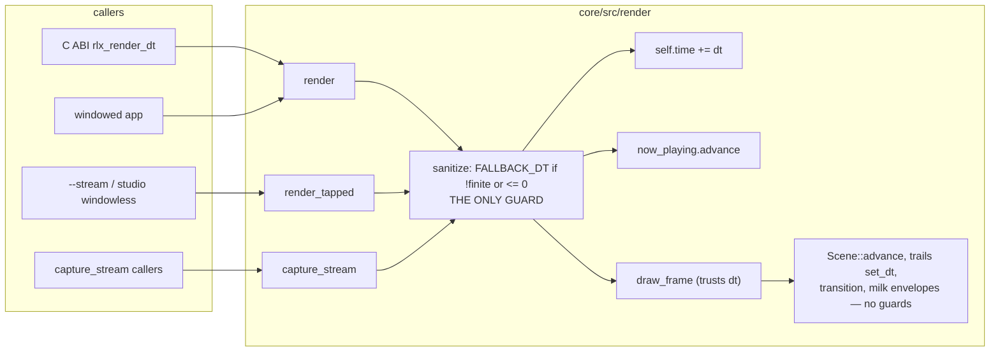

# 0171 — One stall policy, and a guarded clock

> **Status:** draft
> **Created:** 2026-09-11
> **Owner skill(s):** `dev`
> **Related ADRs:** [0191](../adrs/0191-a-frame-delta-is-replaced-at-every-entry-and-nothing-below-keeps-a-policy.md)
> (proposed), amending [0152](../adrs/0152-the-frame-delta-is-sanitized-at-the-scene-seam.md)
> **Closes:** design-backlog 0188, 0189, 0190.

## TL;DR

One function replaces a bad frame delta with `FALLBACK_DT`, and every `Renderer` entry that takes a
caller's delta calls it before anything moves: `render`, `render_tapped`, `capture_stream`. The scene
clock `self.time` stops being exposed to a host's `NaN`, including on the windowless path. Below the
entries the nominal step becomes the only answer: the three downstream guards — composite decay,
transition, MilkDrop envelopes — are deleted, and a hygiene test fails the suite if a second one
appears. Nothing visible changes; no shell has ever produced a bad delta.

## Context & problem

Three backlog entries, one population question at three levels:

- **0189 (Medium):** `self.time += dt` runs above ADR-0152's check in all three entries, so one `NaN`
  poisons the shared clock for the life of the process. The C ABI passes the plugin's delta straight
  through.
- **0190 (Medium):** the check's comment says nothing below re-checks. Three sites do, on three
  policies — keep the previous value (`trails.rs` `set_dt`), hold (`transition.rs` `advance`), freeze
  the envelope (`milk/mod.rs`) — beside the check's own nominal step.
- **0188 (Low):** the transition's hold is pinned by a test and documented as deliberate, and since
  ADR-0152 no frame can reach it.

## Decision

The interview chose the guard at every frame entry and one policy, the nominal step. ADR-0191
records it. We rejected validating at the C ABI only (the standalone app never crosses it), both the
ABI and the entries (two copies of one policy), keeping the transition's hold (it needs a marker
threaded through `draw_frame` to be reachable), and a comment-only repair (four answers survive).

## Architecture diagram

## Implementation phases

### Phase 1 — The clock is guarded at every entry
- **Owner skill:** dev
- **What:** One function holding the finiteness-and-positivity check and the `FALLBACK_DT`
  substitution; `render`, `render_tapped` and `capture_stream` call it as their first statement, and
  pass its result to everything below. `draw_frame` drops its own check and its doc states the
  precondition.
- **Files touched:** `core/src/render/mod.rs`, `core/src/render/capture_api.rs`, a test beside
  `core/tests/frame_tap.rs` or in `core/src/render/tests.rs`.
- **Notes for the implementer:**
  - The capture entries that step the clock by `FALLBACK_DT` themselves take no caller delta and need
    no call. Only an entry with a `dt: f32` parameter does.
  - `now_playing.advance(dt)` sits below the call in `render`, so it receives the sanitized value. If
    it keeps a guard of its own, that guard is Phase 2's population.
  - The C ABI is not touched (ADR-0191, Alternative A).
- **Done when:** a test drives `NaN`, `+inf`, `0.0` and `-1.0` through `render_tapped` and
  `capture_stream`, and after each frame the renderer's clock is finite and has advanced by exactly
  `FALLBACK_DT` — exact, because it is the same `f32` addition. `render` needs a presentable surface
  no test builds; it calls the same function, which the review confirms by reading.

### Phase 2 — One policy below the entries
- **Owner skill:** dev
- **What:** Delete the guards in the composite's `set_dt` (`core/src/render/trails.rs`), the
  transition's `advance` (`core/src/render/transition.rs`) and the MilkDrop runtime's envelope step
  (`core/src/milk/mod.rs`), and any in `now_playing`. Retire `a_degenerate_dt_holds_progress`. Rewrite
  the comment at the old check so it states what is true. Add the hygiene test.
- **Files touched:** the three files above, `core/src/render/mod.rs`, `core/tests/hygiene.rs`.
- **Notes for the implementer:**
  - **List every caller of the MilkDrop envelope step before deleting its guard.** If one passes
    `dt <= 0` by design outside the frame path — a conversion test, a warm-up — the guard is policy,
    not redundancy. Stop and report it; ADR-0191 then needs an Outcome rather than a deletion.
  - The transition test is replaced, not only removed: a dissolve fed a degenerate delta at the entry
    advances by `FALLBACK_DT`'s share, like any frame.
  - The hygiene test matches a finiteness check on a variable named `dt`, in either operand order,
    across `core/src/`, and expects exactly one hit: the Phase 1 function. An unrelated `dt` it
    catches gets an explicit allowlist entry with its reason, not a looser pattern.
  - Backlog 0188, 0189 and 0190's probes go red on this phase by design; the close archives them.
- **Done when:** the hygiene test passes on the tree, and goes red on a seeded second guard (shown once
  in the log, then removed). No golden moves — no rendered frame receives a degenerate delta, so a
  moved baseline is a finding, not a bless.

## Risks & open questions

- **A stalled dissolve now jumps rather than stretches.** Accepted in ADR-0191; unobserved either way.
- **The hygiene pattern may catch a `dt` that is not a frame delta** (the MilkDrop VM, a DSP window).
  The allowlist-with-reason keeps the pattern tight rather than weakening it.
- **A future entry can forget the call.** The hygiene test cannot see a missing call; the function's
  doc and the `Renderer` doc carry it.

## What this plan does NOT do

- **It does not touch the C ABI** or its spec.
- **It does not take backlog 0191** (`evaluate_preset` advances before it binds). Different ordering,
  golden-moving, unrelated to degenerate deltas.
- **It does not change what a valid delta does** anywhere. Only the degenerate case moves.

## Implementation log

> Written by `dev` — one row per phase as that phase's commit lands, and the close block after the
> last one. **The phases above are the contract; everything here is what happened.**

**Lane:** _(to be filled on the first phase commit)_

| phase | owner | state | commit |
|---|---|---|---|
| 1 — The clock is guarded at every entry | dev | not started | |
| 2 — One policy below the entries | dev | not started | |

### Notes

### Close triggers

- **`presets/` touched:**
- **Plan header `Closes:`** design-backlog 0188, 0189, 0190
- **What shipped:**
- **Operator docs touched:**
- **Backlog probes (`node scripts/check-backlog-claims.mjs`):**
- **Full suite:**
- **Outstanding `human` phases:**

## Followups (after this lands)
