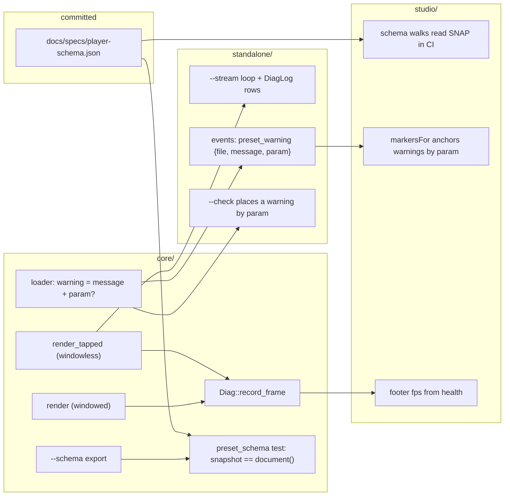

# 0172 — The studio's readings become true

> **Status:** in-progress
> **Created:** 2026-09-11
> **Owner skill(s):** `dev`, `studio-builder`
> **Related ADRs:** [0192](../adrs/0192-a-preset-warning-names-its-parameter.md) (proposed),
> [0170](../adrs/0170-a-parameters-reference-row-is-generated-from-the-declaration-the-engine-reads.md)
> (the snapshot pairing this plan reuses)
> **Closes:** design-backlog 0202, 0205, 0209.

## TL;DR

Three things the studio shows or checks are not true. A windowless player reports **0.0 fps** and
writes no diagnostics rows while rendering normally (0205). CI's schema walks pass by walking nothing,
because the CI job builds no player (0209). A preset warning carries no position, so the editor cannot
mark its line (0202). This plan makes each one true: the frame clock runs on both live draw paths and
the stream loop writes the log; a committed snapshot of the player's `--schema` document, held to the
engine by a Rust test, feeds the walks in CI; and `preset_warning` gains a `param` field (ADR-0192)
the editor anchors by the route it already uses for errors.

## Context & problem

- **0205 (Medium):** `Diag::record_frame` has one call site, after `queue.present` in
  `Renderer::render`. A windowless run draws through `render_tapped`, which never presents, so
  `metrics().fps` stays zero and `show.rs` publishes that zero in every `health` event. `DiagLog` is
  owned by `app_state.rs`, the windowed app, and the `--stream` loop has no reference to it — while
  the studio's handoff note sends a tester to `diagnostics.log`.
- **0209 (Medium):** `studio/shared/fields.test.ts` and `grammar.test.ts` walk the live `--schema`
  document of a built player, and skip with a console line when there is none. The CI `studio` job
  runs no cargo step, so every walk returns before its first assertion and counts as a pass.
- **0202 (Medium):** spec 0003's `preset_warning` has `file` and `message` only. `Preset::warnings`
  is a `Vec<String>`, so the name the push site had is dropped in the core, before the wire.

## Decision

The interview chose all three recommended shapes. **The frame clock:** `record_frame` is called by
both live entries, `render` and `render_tapped`, and the `--stream` loop owns a `DiagLog` writing the
same rows the windowed app writes. We rejected a separate headless counter (two clocks for one
question) and dropping the number (an operator in windowless mode gets none). **The schema:** a
committed snapshot the walks read, with a Rust test failing when it and `--schema` disagree — the
ADR-0170 pairing. We rejected building the player in the CI studio job (a release Rust build in a
Node-only job). **The warning:** ADR-0192.

The capture paths also go through `draw_frame`, which is why the clock call sits in the two live
entries rather than in `draw_frame`: a capture's frames are offline and would corrupt a rate.

## Architecture diagram

## Implementation phases

### Phase 1 — The frame clock covers both live paths
- **Owner skill:** dev
- **What:** `render_tapped` calls `record_frame` as `render` does. The `--stream` loop holds a
  `DiagLog` and writes its rows at the same cadence and in the same format as the windowed app.
- **Files touched:** `core/src/render/capture_api.rs`, `standalone/src/stream.rs`,
  `standalone/src/diaglog.rs` or `standalone/src/app_state.rs` (sharing the log path resolution).
- **Notes for the implementer:**
  - The capture paths must not call it; they are offline and would report a meaningless rate.
  - The log path resolves the way the windowed app's does. A test that writes a log injects its own
    path; it never touches the real `%APPDATA%` (backlog 0181 is that trap).
- **Done when:** a test drives `render_tapped` for several frames and `metrics().fps` is non-zero;
  a `--stream` session writes diagnostics rows to an injected path.

### Phase 2 — The player's schema is snapshotted and held to the engine
- **Owner skill:** dev
- **What:** Commit the `--schema` document (`rlx_core::preset::export::document()`) at
  `docs/specs/player-schema.json`, and add a test beside the editor-schema test in
  `core/tests/preset_schema.rs` that fails when `document()` differs from the file, printing the
  command that regenerates it. It regenerates under the **same** `RLX_UPDATE_PRESET_SCHEMA=1` switch,
  so one command rewrites every file derived from the export.
- **Files touched:** `docs/specs/player-schema.json`, `core/tests/preset_schema.rs`,
  `docs/developing.md` (the regenerate paragraph names the new file).
- **Notes for the implementer:**
  - Compare with line endings normalized; a Windows checkout must not fail on CRLF alone.
  - **Amended at approval, 2026-09-14:** Plan 0169 has landed. Its `presets/schema/*.schema.json`
    are JSON Schemas rendered for taplo, selected by filename family; this snapshot is the studio's
    panel feed. They are two artifacts for two readers and stay two files. The snapshot does **not**
    go under `presets/schema/`, whose test fails on a file no system renders.
- **Done when:** the test passes on the tree, and fails naming the regenerate command when one
  parameter's default in the snapshot is edited by hand (shown once in the log, then reverted).

### Phase 3 — A preset warning names its parameter
- **Owner skill:** dev
- **What:** The core carries each warning as a message plus an optional parameter name; every push
  site in `core/src/preset/schema/load.rs` that concerns a named binding sets it. `LoadReport`
  carries the structure, `standalone/src/events.rs`'s `PresetWarning` emits `param` (`null` when
  absent), and spec 0003's `preset_warning` row gains the field.
- **Files touched:** `core/src/preset/schema/mod.rs`, `core/src/preset/schema/load.rs`,
  `core/src/preset/mod.rs`, `standalone/src/preset_dir.rs`, `standalone/src/events.rs`,
  `standalone/src/preset_check.rs`, `standalone/tests/preset_check.rs`,
  `docs/specs/0003-studio-control-protocol.md`, `core/tests/preset.rs`.
- **Notes for the implementer:**
  - **Amended at approval, 2026-09-14:** Plan 0169's `--check` is the second consumer.
    `engine_diagnostics` in `preset_check.rs` emits every warning at file level, and its comment names
    this exact change as the reason. When a warning carries `param`, it places it through
    `locate_param`, the same way it places an error, and the comment goes.
  - If a warning reaches the C ABI anywhere, stop: that is spec 0001's shape, not this plan's.
  - The `--schema` export may change if it documents the event shape; regenerate the Phase 2 snapshot
    in this commit if so.
  - Spec 0003 says an added field is additive under the same `v`; no version moves.
- **Done when:** loading a preset that binds a parameter its system does not declare emits a
  `preset_warning` whose `param` is that binding's name; a warning about no binding emits
  `param: null`; each class of push site that sets `param` has one such test; `ritmolux --check` on
  the first preset reports the warning on that binding's line rather than at file level.

### Phase 4 — The studio reads the snapshot, anchors warnings and shows the rate
- **Owner skill:** studio-builder
- **What:** The schema walks in `studio/shared/fields.test.ts` and `grammar.test.ts` read
  `docs/specs/player-schema.json` when no player is built, and **fail** if that file is missing.
  `studio/shared/protocol.ts` accepts the optional `param` on `preset_warning`, and `markersFor`
  anchors a warning through it by the route an expression error uses. `windowless.test.ts` asserts the
  `health` event's `fps` is above zero.
- **Files touched:** `studio/shared/fields.test.ts`, `studio/shared/grammar.test.ts`,
  `studio/shared/protocol.ts`, `studio/renderer/editor/diagnostics.ts` and its test,
  `studio/electron/player/windowless.test.ts`.
- **Notes for the implementer:**
  - Tests that need a live player (`templates`, `windowless`) keep skipping when none is built. Only
    the walks move to the snapshot.
  - Arrives by the automatic `dev → studio-builder` handoff (ADR-0188); the receiver still waits for
    "go".
- **Done when:** with no player built, the walks run their assertions against the snapshot (the count
  is in the log, and it is above zero); an editor test places a warning marker on the named binding's
  line; with a player built, the windowless test sees a non-zero `fps`.

## Risks & open questions

- **Diag's rate is wall-clock.** On the windowless path it reports the tap's throughput, which is what
  the operator is running at; it is not a display refresh. The footer should not be read as one.
- **A missed push site is silent.** ADR-0192's Negative; the per-class tests are the only net.
- **Plan 0169 overlapped twice, and landed first** (closed 2026-09-13). This plan reconciles both at
  approval: the snapshot is a separate file held by 0169's own test and switch (Phase 2), and
  `--check` becomes a consumer of `param` (Phase 3).

## What this plan does NOT do

- **It does not add a line/col span to warnings** (ADR-0192, Alternative A).
- **It does not build the player in CI.**
- **It does not change what `health` reports on the windowed path.**

## Implementation log

> Written by `dev` and `studio-builder` — one row per phase as that phase's commit lands, and the close
> block after the last one. **The phases above are the contract; everything here is what happened.**

**Lane:** `main` directly

| phase | owner | state | commit |
|---|---|---|---|
| 1 — The frame clock covers both live paths | dev | done | committed with this row |
| 2 — The player's schema is snapshotted | dev | not started | |
| 3 — A preset warning names its parameter | dev | not started | |
| 4 — The studio reads the snapshot, anchors warnings and shows the rate | studio-builder | not started | |

### Notes

- Phase 1: `render_tapped` also sets `draw_calls`, as `render` does beside `record_frame`. The
  `--stream` loop calls `enable_diagnostics(true)` (the clock is gated on it) and resolves its log path
  through `cli::resolve_log_path` inside `stream.rs`, so `run.rs` is untouched. Tests landed in two
  files the phase does not list: `core/tests/frame_tap.rs` (tap feeds the clock, captures do not) and
  `standalone/tests/stream_show.rs` (a spawned `--stream` run with its data root pointed at a scratch
  directory writes rows with a non-zero `fps`; fails with `enable_diagnostics` removed, checked once).

### Close triggers

- **`presets/` touched:**
- **Plan header `Closes:`** design-backlog 0202, 0205, 0209
- **What shipped:**
- **Operator docs touched:**
- **Backlog probes (`node scripts/check-backlog-claims.mjs`):**
- **Full suite:**
- **Outstanding `human` phases:**

## Followups (after this lands)
