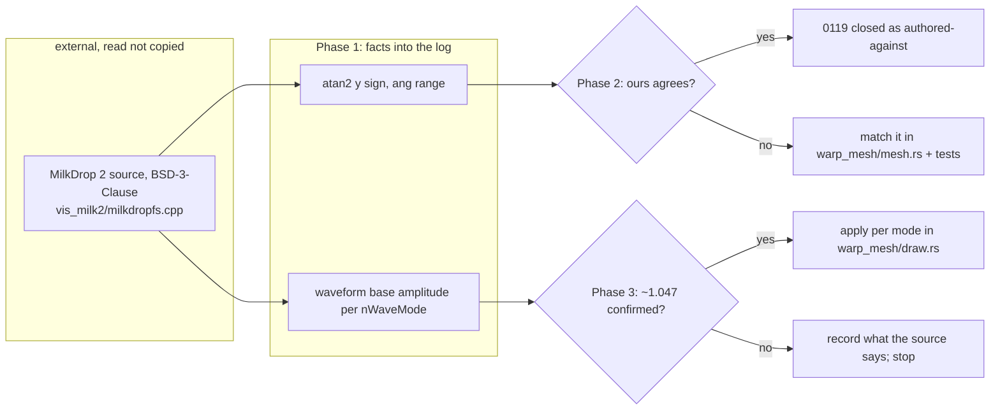

# 0173 — The MilkDrop geometry reads the source

> **Status:** in-progress
> **Created:** 2026-09-11
> **Owner skill(s):** `dev`
> **Related ADRs:** [0113](../adrs/0113-milkdrop-presets-are-translated-ahead-of-time-onto-a-warp-mesh-idiom.md)
> **Closes:** design-backlog 0119, 0120.

## TL;DR

Backlog 0119 (the `+x` seam) and 0120 (the unit-scale waveform, 4.7 % small) both stopped on the same
wall: *"no MilkDrop source and no authoring documentation in this environment"*. That wall is gone.
MilkDrop 2's source was released under BSD-3-Clause on 2013-05-13 and is public, with the mesh and
waveform code in `vis_milk2/milkdropfs.cpp`. This plan reads the two facts the entries need from it —
the sign of `y` handed to `atan2` in the per-vertex setup, and the waveform's base amplitude per wave
mode — and then either matches them or records that we already do. No reference rig is needed.

## Context & problem

- **0119 (Medium):** `vertex_position` computes `ang = atan2(py, px)` and lifts the negative half by
  `TAU`, so `ang` cuts along `+x`. Plan 0111 Phase 4 pinned **our** half by test
  (`ang_cuts_on_plus_x_and_turns_counter_clockwise_on_screen`, and `milkconv/tests/warp_geometry.rs`
  for the emitted epilogue). The missing half is the reference's handedness, and the entry names the
  one line that settles it: the sign of `y` passed to `atan2f` in MilkDrop 2's mesh setup.
- **0120 (Low since Plan 0127):** measured against `foo_vis_milk2`, the reference draws **0.316** frame
  heights peak-to-peak at `fWaveScale = 1` where we draw **0.3019**, so our mode-6/7 factor `0.15`
  implies ~`0.157` (x `1.047`). Plan 0127 Phase 4 declined to apply it because `p90` of the corpus
  would then touch the frame edge. The source says what the reference's constant is, and whether the
  reference clips there too.

**Provenance:** nothing is copied into the repository. The plan records facts — file, function,
line, commit — and the code that uses them is ours. That keeps Plan 0100 Phase 8's rule, *nothing
third-party in the repository or a release*.

## Decision

The interview chose "let the source decide" for both. Each phase has a branch for agreement and a
branch for divergence, and neither is decided by matching a picture. We rejected parking 0119 (the
seam shows on real content and the settling fact is now one line away), closing 0120 as won't-fix
(the constant is cheap once derived), and applying `1.047` unread (it was measured on one wave mode,
and five sites in `draw.rs` carry the factor).

## Architecture diagram

## Implementation phases

### Phase 1 — Read the two facts from the source
- **Owner skill:** dev
- **What:** Fetch MilkDrop 2's released source at a named commit and record, in this plan's log and on
  backlog 0119 and 0120 as dated updates: the per-vertex `ang` construction (the `atan2f` argument
  order and signs, the range, where the cut lands, and which way it turns on screen) and the waveform
  vertex construction for each `nWaveMode` this engine draws (the amplitude constant per mode, and
  whether anything clamps at the frame edge).
- **Files touched:** `docs/design-backlog.md`, this plan's log. No code.
- **Notes for the implementer:**
  - The original release is mirrored on GitHub (for example `xeiraex/milkdrop2`, `vis_milk2/`). Name
    the repository and commit you read; a later fork may have changed either line.
  - Record facts with file, function and line. **Do not paste source into the repository.**
  - The reference's screen y may be flipped relative to ours before `atan2`; that is exactly the
    handedness question. Our convention is already pinned by the two tests named above.
  - Plan 0142 reads the same file for the feedback loop. If it has already run, reuse its commit.
- **Done when:** both updates are in the backlog, each citing file, function, line and commit, and
  each ending in one sentence: "ours agrees" or "ours differs by …".

### Phase 2 — The seam matches the reference, or is recorded as authored-against
- **Owner skill:** dev
- **What:** If Phase 1 found a different cut or handedness, change `vertex_position`
  (`core/src/render/scenes/warp_mesh/mesh.rs`) to match, and update the pinning test and
  `milkconv/tests/warp_geometry.rs` to the new convention. If it agrees, change nothing and record
  that MilkDrop presets are authored against this cut.
- **Files touched:** `core/src/render/scenes/warp_mesh/mesh.rs`, its tests,
  `milkconv/tests/warp_geometry.rs`; or none.
- **Notes for the implementer:**
  - **Never smooth the wrap.** Presets use the cut deliberately (backlog 0119's own warning).
  - On the divergence branch, converted goldens covering `warp_mesh` move. Bless them and name each
    one in the log.
- **Done when:** the pinning test asserts the reference's convention as Phase 1 recorded it (or is
  unchanged, with the agreement recorded on 0119).

### Phase 3 — The waveform takes the reference's base amplitude
- **Owner skill:** dev
- **What:** For each wave mode whose constant Phase 1 settled, set `draw.rs`'s factor to it; leave any
  mode the source does not settle alone and list it.
- **Files touched:** `core/src/render/scenes/warp_mesh/draw.rs` (the `0.15` factors), 
  `milkconv/tests/draw_layer.rs`.
- **Notes for the implementer:**
  - **Runs only if Phase 1 confirmed a constant near `0.15 x 1.047`.** If the source gives something
    else — a per-mode table, a dependence on the window, a normalization Plan 0127 did not see — stop,
    record it on 0120 and skip to the close.
  - Plan 0127's objection was the corpus's top decile touching the frame edge. If the source shows the
    reference draws it there too, that is fidelity, not a defect; say so on 0120.
  - Converted goldens move by design. Bless and name them.
- **Done when:** `draw_layer.rs` asserts the unit-scale peak-to-peak for mode 6 equals the
  source-derived constant times the trace's normalized span, exactly as the geometry builds it — which
  on Plan 0127's measurement is `0.3019 x 1.047 = 0.316` frame heights, the reference's own reading.

## Risks & open questions

- **The released source may not be what `foo_vis_milk2` 0.2.0.0 runs.** Plan 0127's reference
  capture is the check: Phase 3's result must land on its 0.316, and a source constant that does not
  is a finding to record, not to force.
- **The handedness may depend on a y flip elsewhere** (the draw layer, the render target). Phase 1
  follows the value to the screen, not only to `atan2f`.
- **License:** BSD-3-Clause permits reading and citing; the plan copies nothing, so no notice is owed.

## What this plan does NOT do

- **It does not take backlog 0113** (the wash). Plan 0142 owns it and reads the same source for it.
- **It does not revisit the waveform's x-extent** (archived 0122, fixed by Plan 0127 Phase 2).
- **It does not touch `milkconv/`'s converter**, only its tests.

## Implementation log

> Written by `dev` — one row per phase as that phase's commit lands, and the close block after the
> last one. **The phases above are the contract; everything here is what happened.**

**Lane:** `main` directly, no worktree.

**Source read:** `github.com/xeiraex/milkdrop2` at `d4c843a4fb4f53aef755957fc9478780325748cd`, the
original v2.25c release commit. Facts, with file, function and line, are on backlog 0119 and 0120.

| phase | owner | state | commit |
|---|---|---|---|
| 1 — Read the two facts from the source | dev | done | `83a419d` |
| 2 — The seam matches the reference | dev | done, no code change | `6b8c45e` |
| 3 — The waveform takes the reference's base amplitude | dev | skipped on the phase's own stop branch, committed with this row | |

### Notes

- **Phase 2 took the agreement branch on a different function than the phase names.** The phase
  keys on `vertex_position`, but a converted preset's per-vertex `ang` comes from
  `MilkRuntime::run_vertex` (`core/src/milk/mod.rs`, called from `warp_mesh/encode.rs`), and that one
  matches the source. `vertex_position` differs from the source in range and cut and is read only by
  the native `[per_vertex]` path (`core/src/render/evaluate.rs`); it was left alone. The user chose
  this at an escalation after Phase 1. The pinning test
  `ang_cuts_on_plus_x_and_turns_counter_clockwise_on_screen` is unchanged and pins the native
  function, not the converted one.
- **Phase 3 did not run, and its done-when is unmet.** The source's mode-6/7 constant is `0.125`
  frame heights per unit sample, not near `0.15 x 1.047`, so the phase's stop branch applied: the
  finding is recorded on 0120 and `draw.rs` and `milkconv/tests/draw_layer.rs` are unchanged. The
  user confirmed the skip at the same escalation.
- **Followups noticed, not acted on:**
  - The emitted comp-stage epilogue (`milkconv/src/shader/emit.rs` `fs_main`) uses the warp stage's
    `rad`/`ang` for both stages; the source's comp stage is clockwise, `0..2pi`, cut on +x, with
    `rad` 1 at the corners (0119's update, fact 3). Outside this plan's scope by its own
    "does NOT do".
  - The doc comment on `ang_cuts_on_plus_x_and_turns_counter_clockwise_on_screen`
    (`warp_mesh/tests.rs`) says MilkDrop's `atan2` "has the same cut" on +x; the source puts the
    per-vertex cut on −x.
  - What produces 0119's observed seam on *Songflower* and *chasers 19 Portal* is not settled by the
    source: the per-vertex `ang` a converted preset reads cuts on −x, not +x.
  - Waveform differences the source shows beyond the amplitude, all on 0120's update: the source's
    modes 1-5 are different figures from `draw.rs`'s 1-5; the mode-6/7 line angle is
    `1.57 * wave_mystery` where `draw.rs` uses `wave_mystery * PI`; mode 7's separation is
    `(wave_y*0.5+0.5)^2` clip units where `draw.rs` uses a fixed `0.03`; mode 0's circle is radius
    `0.25 + 0.2 * sample` frame heights turning with time, where `draw.rs` uses `0.2 + 0.1 * mystery`
    and `0.1 * sample`, and does not turn.

### Close triggers

- **`presets/` touched:**
- **Plan header `Closes:`** design-backlog 0119, 0120
- **What shipped:**
- **Operator docs touched:**
- **Backlog probes (`node scripts/check-backlog-claims.mjs`):**
- **Full suite:**
- **Outstanding `human` phases:**

## Followups (after this lands)
