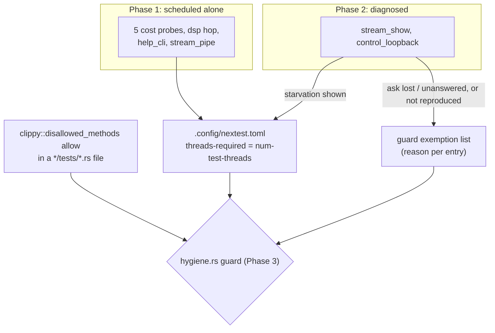

# 0174 — The clock-reading tests run alone, and the two that fail on the control path are diagnosed first

> **Status:** in-progress
> **Created:** 2026-09-14
> **Owner skill(s):** `dev`
> **Related ADRs:** [0193](../adrs/0193-a-test-that-reads-the-clock-runs-alone.md) (proposed),
> [0173](../adrs/0173-a-cost-probe-takes-the-best-of-each-duration-not-the-best-difference.md)

> **Amended 2026-09-14** (architect backlog sweep, outside the log): a Risks bullet records that
> Phase 1's measured drain-wait cost already lands on the pre-push `-P fast` tier, not only on
> `--workspace`; and "does NOT do" records that backlog 0182's partial test-binary merge (Plan 0177,
> sequenced after this plan) must keep this override's selected binaries as their own targets.

## TL;DR

Tests that assert on wall-clock time have failed the gate at least five times, and every one passed
alone. Until ADR-0193 this lived only in close notes. The latest failure was `path_cost` on
2026-09-14, in the pre-push `-P fast` run. This plan does three things:

- It schedules the timing-only tests alone under nextest.
- It diagnoses the two tests that keep failing, because both fail at the same step: a control
  datagram that is not acted on under load.
- It adds a guard, so every test carrying a `clippy::disallowed_methods` exemption must be scheduled
  alone or carry a stated reason.

## Context & problem

ADR-0193's Context has the failure table and the file inventory. Two facts shape the phases:

- **The timing-only tests fail by measuring the load.** These are the five cost probes, `dsp.rs`'s
  per-hop budget, `help_cli`'s 1 s exit bound and `stream_pipe`'s 20 s bound. The mechanism is
  understood, and running alone is the remedy.
- **The two repeat offenders do not look like load.** `stream_show every_system_is_reported_...`
  took 303.1 s in its red run. That is the child's whole `--frames 9000 --fps 30` run plus startup,
  because `wait_for`'s 60 s timeout restarts on every stderr line. The child kept pacing and never
  answered the second `ctl/preset`. `control_loopback a_preset_datagram_selects_by_name` has one
  load-sensitive step, the 5 s wait for the datagram to reach the listener; its dissolve runs on a
  fixed `DT`. Both failed twice. Neither record kept the evidence that would say whether the ask was
  late, lost, or received and ignored. The studio drives the player through that same path.

## Decision

Per ADR-0193: one `[[profile.default.overrides]]` block with `threads-required = "num-test-threads"`,
a filter naming each binary (or single test), and a guard in `core/tests/hygiene.rs` holding that
filter to the clippy exemption. The control-path pair joins the override only on evidence of
starvation. The user chose diagnose-first for `stream_show`. `control_loopback` is added to it here
because it fails at the same step.

```toml
# illustrative - the filter's final form and the comment above it are dev's
[[profile.default.overrides]]
filter = 'binary(/_cost$/) + binary(help_cli) + binary(stream_pipe) + (binary(dsp) & test(=one_hop_analyzes_well_under_the_hop_interval))'
threads-required = "num-test-threads"
```

## Architecture diagram



## Implementation phases

### Phase 1 — The timing-only tests run alone

- **Owner skill:** dev
- **What:** Add the override for the five `*_cost` binaries, `help_cli`, `stream_pipe`, and the single
  `dsp` test `one_hop_analyzes_well_under_the_hop_interval`. Write it as a new job in the file's
  header convention. Its comment carries the mechanism: a timed assertion reads everything else
  scheduled on the machine. It cites ADR-0193 by bare number. Verify it, and record what it costs.
- **Files touched:** `.config/nextest.toml`; this plan's log.
- **Notes for the implementer:**
  - That file already records that `-P fast` inherits `profile.default`'s overrides, checked on
    0.9.140 rather than assumed. Hold this override to the same standard.
  - **Show exclusivity from nextest's own record, not from a green run.** A green run is what the
    flake produces most of the time. One way is a JUnit report from an uncommitted
    `[profile.fast.junit]` stanza, whose per-testcase timestamps show whether any interval overlaps.
    Name the record used.
  - Measure `-P fast` wall time before and after on the reference machine, one run each. One run is
    a reading, not a benchmark; say so. Run one at a time, this set takes about 85 s on the reference
    machine (cost probes 77 s, `stream_pipe` 6.1 s, the hop test 2.0 s, `help_cli` 0.3 s).
- **Done when:** in one `-P fast` run, no other test's interval overlaps any selected test's, shown
  from the named record. `cargo nextest list -P fast` under the override's filter names exactly the
  selected tests: all tests in the seven binaries, plus the one `dsp` test. The log records both
  `Summary` lines.

### Phase 2 — The control-path pair says why it failed, then the evidence decides where it goes

- **Owner skill:** dev
- **What:** Make both tests' failures carry the evidence that separates *late* from *lost* from
  *received and not acted on*. Then try to reproduce under load within a bounded budget, and route
  each test by what the evidence shows.
- **Files touched:** `standalone/tests/stream_show.rs`, `standalone/tests/control_loopback.rs`;
  possibly `docs/design-backlog.md` and `.config/nextest.toml`; this plan's log.
- **Notes for the implementer:**
  - **`stream_show`'s wait bounds the wrong thing.** `wait_for` gives each *line* 60 s, so a
    chatty child that never answers holds the test for as long as `--frames` lasts. Bound the
    *wanted* line from the moment the ask was sent. Tell `RecvTimeoutError::Timeout` apart from
    `Disconnected`. Do not change `LINE_DEADLINE`'s value.
  - On a failed wait, the message should say: which ask went unanswered and how long after sending;
    whether the child was still alive (`try_wait`); the last stderr lines, including any `preset`,
    `preset_error` or control-rejection line for a *different* name; and whether stdout was still
    flowing. The drain thread can count bytes. The assertion already dumps stderr; make sure the
    tail is readable, because the pre-push hook output is where it will be read.
  - `control_loopback`'s delivery failure should say what the listener saw: `rejected()` and any
    received or pending count `Control` already exposes, and whether its thread is still running.
    Do not widen `Control`'s public surface for the test. If the evidence needs a new accessor, that
    is a finding for the log, not an edit.
  - **Reproduction budget: about one hour of machine time on the reference machine.** Suggested
    order: repeated runs of both binaries while a heavy suite runs beside them (for example a
    concurrent `cargo nextest run -p rlx-core --test golden`), then `-P fast` runs, then at most two
    `--workspace` runs. Record every attempt and its outcome in the log, including the ones that
    passed.
- **Done when:** both tests' failure paths carry the evidence above; the log records the attempts;
  and each test is routed by exactly one of these outcomes:
  - **Reproduced, and the ask arrived and was answered late:** the test joins Phase 1's override,
    with the reading that showed it in the log.
  - **Reproduced, and the ask never arrived or was never answered while the process kept running:**
    a new backlog entry holds the evidence (owner `dev`, a probe per ADR-0108). The test stays
    off the override.
  - **Not reproduced within the budget:** the test stays off the override, with the new failure
    message in place, so the next natural failure says which of the above it was. That is recorded
    as the outcome, and it is not a failed phase.

### Phase 3 — The guard holds the override to the exemption

- **Owner skill:** dev
- **What:** Add check (g) to `core/tests/hygiene.rs`. It runs in both directions over every
  workspace `*/tests/*.rs` file: a file carrying a `clippy::disallowed_methods` allow must be named by
  the `.config/nextest.toml` override's filter, and every binary that filter names must still carry
  one. A file on neither side fails unless the guard's own exemption list names it with a reason.
- **Files touched:** `core/tests/hygiene.rs`; the module's `//!` list.
- **Notes for the implementer:**
  - Std-only, like the rest of that file: no TOML dependency. Locating the override block and reading
    its `binary(...)` names from the filter string is enough. Document the syntax the parser accepts,
    and make an unparseable filter fail loudly rather than match nothing.
  - The exemption list starts with whatever Phase 2 left off the override, each entry naming its
    reason: a backlog number, or "not reproduced; failure path instrumented". Cite ADR-0193 by bare
    number. No plan-relative narration (ADR-0127).
  - Show the guard biting. Remove one binary from the filter locally and watch it fail; add an allow
    to a scratch test file and watch it fail. Neither edit is committed. Record both in the log.
  - `src/` test modules are out of scope (ADR-0193's Negative). Do not widen the scan to them.
- **Done when:** the guard passes on the tree; each of the two seeded breaks fails it with a message
  naming the file and the override; and the exemption list matches Phase 2's routing exactly.

## Risks & open questions

- **The drain wait.** An isolated test waits for every running slot to finish before it starts. In
  the full `--workspace` run some tests take tens of seconds, so the wall-time cost there can exceed
  the serial figure. Phase 1 records `-P fast`. Whoever runs the close records `--workspace`.
- **The drain wait already reaches the pre-push tier (added 2026-09-14).** Phase 1's one reading
  took `-P fast` from 244.5 s to 398.2 s, **+153.7 s against the ~85 s serial figure** this plan
  gave for the selected set. The bullet above placed the drain-wait cost on `--workspace`; the
  reading says `-P fast` pays it too, and `-P fast` is what `.githooks/pre-push`, CI's `check` job
  and `dev`'s per-phase gate all run. One run is a reading, not a benchmark — but **the close
  decides, on a re-measurement, whether the hook can afford the override as written**, or whether
  the selection needs a cheaper shape (for example a separate nextest test group sized to the
  machine rather than whole-machine exclusivity). This plan does not touch the hook, so that
  decision is a finding for the close, not a phase.
- **Phase 2 may not reproduce.** Two failures in many runs is a low rate. The plan accepts that
  outcome: it leaves both tests with failure messages that settle the question the next time.
- **Phase 2 may find a real control-path defect.** That is a backlog entry and possibly its own
  plan. It does not get fixed inside this plan.
- **The guard's filter parsing is deliberately naive.** A future filter rewritten into a form it
  cannot read must fail the guard, not satisfy it. Phase 3's seeded breaks exist to show that.

## What this plan does NOT do

- Change any deadline constant, cost-probe estimator, `REPEATS` or frame count.
- Fix a control-path defect Phase 2 finds. That is a backlog entry.
- Fix `path_cost.rs`'s arity probe pricing the arc chain. That is backlog 0217.
- Add `retries` or `slow-timeout`. ADR-0193 rejects retries.
- Touch `.githooks/pre-push`, `ci.yml`, or `src/` test modules.
- Explain `animation_rep_shape_facet`'s one failure under three worktrees' load. It reads no clock.
- Merge any test binaries. Backlog 0182's partial merge is Plan 0177, sequenced **after** this plan,
  and it must **keep every binary this override selects as its own target** — the five `*_cost`
  probes, `help_cli`, `stream_pipe`, and any test file Phase 2 or Phase 3 adds to the filter — plus
  the nine `-P fast` exclusions, because a `binary()` predicate cannot name a module inside a merged
  binary. A merge that folds one of them in silently drops it from this override. Plan 0177
  re-derives the mergeable set from this plan's final filter, not from 0182's count.

## Implementation log

> Written by `dev` — one row per phase as that phase's commit lands, and the close block after the
> last one. **The phases above are the contract; everything here is what happened.**
> **Observations, never conclusions:** this says where to look, architect decides how it went.
> No per-criterion pass list, no self-assessment, no narrative — but a deviation from the plan or
> an unmet done-when is always disclosed. Stays shorter than `## Implementation phases` above.

**Lane:** `main` directly

| phase | owner | state | commit |
|---|---|---|---|
| 1 — The timing-only tests run alone | dev | done | 6c33ddb |
| 2 — The control-path pair says why it failed | dev | done | b39abc3 |
| 3 — The guard holds the override to the exemption | dev | done | 68e15fe |

### Notes

- **Phase 1, record used:** nextest's JUnit report from an uncommitted `[profile.fast.junit]`
  stanza; intervals are `[timestamp, timestamp + time]` per testcase. After: 18 selected testcases,
  13 with no overlap, 5 overlapping one or more others by exactly 1 ms each (the report's
  resolution). Before, same record: 18 of 18 overlapping, 15 to 173 others each.
- **Phase 1, `cargo nextest list -P fast -E '<the override filter>'`:** 18 tests - every test of
  `arc_cost` (1), `collage_cost` (1), `field_cost` (1), `mark_cost` (1), `path_cost` (2),
  `help_cli` (8), `stream_pipe` (3), plus `dsp one_hop_analyzes_well_under_the_hop_interval`. None
  of the seven binaries has an `#[ignore]`d test.
- **Phase 1, `-P fast` wall time, one run each (a reading, not a benchmark), user's uncommitted
  `presets/lsystem_*.toml` edits in the tree for both:**
  - before: `Summary [ 244.495s] 1633 tests run: 1633 passed (5 slow), 304 skipped`
  - after: `Summary [ 398.197s] 1633 tests run: 1633 passed (2 slow), 304 skipped`
  - +153.7 s; the plan's serial figure for the selected set is ~85 s.
- **Phase 2, deviations:**
  - `stream_show`'s walk sends a `ctl/ping` after every `ctl/preset` and the report says whether its
    `pong` came back. The plan did not name it. Nothing asserts on it.
  - The new `wait_for` bound applies to every wait in `stream_show.rs`, not only the walk's. The
    startup waits (`hello`, first `roster`, first `preset`) are bounded from the spawn.
  - Both failure paths keep reading for one more deadline after a miss, to tell late from absent.
    Only the failure path pays this.
- **Phase 2, finding:** whether `Control`'s listener thread is running is not observable from its
  public surface. No accessor was added; the message says so. Backlog 0219 carries it.
- **Phase 2, failure messages checked by seeded breaks (uncommitted):** `stream_show` with
  `LINE_DEADLINE` at 4 s and ask 3 renamed to a missing preset; `control_loopback` with `DELIVERY`
  at 1 s and the delivery drained before the wait.
- **Phase 2, reproduction attempts** (reference machine, `stream_show` + `control_loopback` binaries
  run by `cargo nextest run -p standalone`):
  - A: round-based, with `golden` + `attractor` + `reaction_diffusion` started 8 s before each
    round. Round 1 passed. Round 2 was killed mid-run: each round idled ~2 min on the heavy suite.
  - B: 25 min, the same heavy suite kept running continuously beside back-to-back runs. 79 runs,
    5 failed:
    - runs 29, 61, 63: `control_loopback a_preset_datagram_selects_by_name`, first delivery,
      still nothing 10 s after the send, `rejected 0, dropped 0`
    - runs 69, 70: `stream_show every_system_...`, ask 9 of 14 (`emitter`), still absent 120 s
      after the ask, child running at 30 fps, the ask's ping answered
  - `-P fast` and `--workspace` attempts were not run; B routed both tests.
- **Phase 2, routing:** both reproduced, and neither ask was answered while the process kept
  running. `control_loopback` goes to backlog 0219, `stream_show` to backlog 0220. Neither joins the
  override.
- **Phase 3, exemption list:** `control_loopback` (backlog 0219), `stream_show` (backlog 0220).
- **Phase 3, deviations:** a second test, `the_run_alone_filter_parser_refuses_what_it_cannot_read`,
  pins the parser's accepted and refused forms. The scan counts the lint only inside an `allow` or
  `expect` attribute's argument list; a first cut that matched the bare string failed on
  `hygiene.rs`'s own constant.
- **Phase 3, seeded breaks (uncommitted, each restored):**
  - `binary(help_cli)` removed from the filter: fails naming `standalone/tests/help_cli.rs` and
    the `threads-required = "num-test-threads"` override in `.config/nextest.toml`.
  - `core/tests/zz_seeded_clock.rs` with a file-level allow: fails naming that file and the same
    override.
  - Not asked for: the filter's first `+` rewritten as `|` fails as unreadable, quoting the term
    it could not parse.

### Close triggers

- **`presets/` touched:** none
- **Plan header `Closes:`** none
- **What shipped:** test and test-schedule changes only (`.config/nextest.toml`, three test files),
  plus backlog entries 0219 and 0220
- **Operator docs touched:** none
- **Backlog probes (`node scripts/check-backlog-claims.mjs`):** exit 0
- **Full suite:** `cargo nextest run --workspace --no-fail-fast` at 68e15fe, exit 0,
  `Summary [ 679.386s] 1933 tests run: 1933 passed (5 slow), 6 skipped`; 682 s wall
- **Outstanding `human` phases:** none

## Followups (after this lands)
