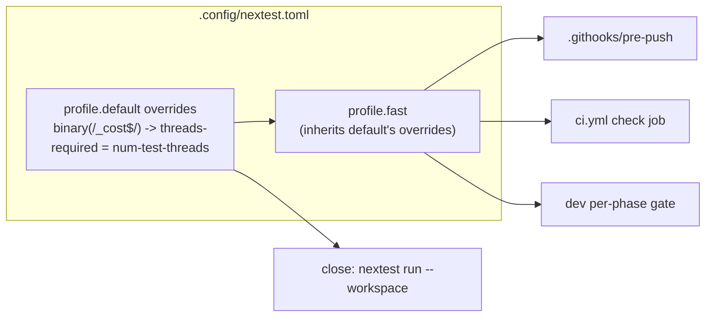

# 0174 — The cost probes run alone

> **Status:** approved
> **Created:** 2026-09-14
> **Owner skill(s):** `dev`
> **Related ADRs:** [0193](../adrs/0193-a-cost-probe-runs-alone.md) (proposed),
> [0173](../adrs/0173-a-cost-probe-takes-the-best-of-each-duration-not-the-best-difference.md)

## TL;DR

`path_cost the_contour_arity_is_priced_against_the_floor_tier` failed the pre-push gate on
2026-09-14 on the reference machine. It took 34 s there, passes in 16 s alone, and passed on an
immediate full re-run. The cause is the `-P fast` run scheduling every other slot beside a test that
times wall-clock. This plan adds one nextest override that makes every `*_cost` binary run with no
other test alongside it. It records what that costs the gate. No test code changes.

## Context & problem

See ADR-0193's Context. In short, ADR-0173 fixed the estimator's bias but assumed the reference
machine is quiet. During the gate it is not, because the suite is the load. The user chose exclusive
scheduling over retries, a test group, deferral, and a machine-scoped split. ADR-0193 records why
each of those lost.

## Decision

Add one `[[profile.default.overrides]]` block to `.config/nextest.toml`, which `profile.fast` inherits:

```toml
# illustrative - the comment block above it is dev's to write
[[profile.default.overrides]]
filter = 'binary(/_cost$/)'
threads-required = "num-test-threads"
```

## Architecture diagram



## Implementation phases

### Phase 1 — The override lands, and its exclusivity and cost are recorded

- **Owner skill:** dev
- **What:** Add the override to `.config/nextest.toml` as a fourth job in that file's header
  convention. Its comment carries the mechanism: why a timed test cannot share slots, and why the
  predicate is a filename suffix. It cites ADR-0193 by bare number. Then verify it does what it says
  and record what it costs.
- **Files touched:** `.config/nextest.toml`; this plan's log.
- **Notes for the implementer:**
  - The file already notes that a custom profile inherits `profile.default`'s overrides, and that
    this was checked on 0.9.140 rather than assumed. Hold this override to the same standard. Confirm
    that `-P fast` applies it; do not infer that from the existing note.
  - **Exclusivity must be shown from nextest's own record, not inferred from a green run.** A green
    run is what the flake produces most of the time anyway. One way is a JUnit report written from an
    uncommitted `[profile.fast.junit]` stanza. Its per-testcase timestamps and durations show whether
    any other test's interval overlaps a probe's. Any equivalent record will do; name the one used.
  - Check that `binary(/_cost$/)` selects exactly the five binaries (`cargo nextest list -P fast`
    with the filter). Under `-P fast` the default-filter still applies, and none of the five is in
    the excluded nine.
  - Measure the `-P fast` wall time before and after on the reference machine, one run each,
    recording both `Summary` lines. One run is a reading, not a benchmark; say so. ADR-0193's
    Negative bounds the cost at the 77 s serial figure and leaves the real number to this log.
- **Done when:** in one `-P fast` run, no other test's execution interval overlaps any of the six
  probe tests' intervals, shown from the named record. `cargo nextest list` under the override's
  filter names exactly `arc_cost`, `collage_cost`, `field_cost`, `mark_cost` and `path_cost`. The
  log records the before and after `Summary` lines.

## Risks & open questions

- **The penalty is larger than it looks.** A probe waits for every slot to drain, so a long test
  already running delays it, and the idle slots are lost for that time. If the after-run is worse
  than before by more than the 77 s serial bound, something other than this override moved. Record it
  and stop rather than tune.
- **nextest's semantics for `threads-required` above the thread count.** `num-test-threads` should
  equal the run's thread count by definition, which is why it was picked. If 0.9.140 behaves
  differently under an explicit `-j`, record it. The Done-when is taken at the default `-j`.
- **This does not prevent a red probe.** Another process on the machine, or a CI runner's neighbours,
  still contend. A red probe after this lands is ADR-0173's residual exposure, not a failure of
  this plan.

## What this plan does NOT do

- Change any probe's estimator, `REPEATS`, frame counts or assertions.
- Fix `path_cost.rs`'s arity probe pricing an arc chain at 32 samples and above. That is backlog
  0217.
- Serialize any other clock-reading test (`core/tests/dsp.rs`, the `standalone` timeouts). Those are
  not priced slopes.
- Touch `.githooks/pre-push` or `ci.yml`. Both cite `-P fast` and inherit the change.

## Implementation log

> Written by `dev` — one row per phase as that phase's commit lands, and the close block after the
> last one. **The phases above are the contract; everything here is what happened.**
> **Observations, never conclusions:** this says where to look, architect decides how it went.
> No per-criterion pass list, no self-assessment, no narrative — but a deviation from the plan or
> an unmet done-when is always disclosed. Stays shorter than `## Implementation phases` above.

**Lane:** _(`main` directly, or the worktree path plus its branch)_

| phase | owner | state | commit |
|---|---|---|---|
| 1 — The override lands, and its exclusivity and cost are recorded | dev | not started | |

### Notes

### Close triggers

- **`presets/` touched:**
- **Plan header `Closes:`** none
- **What shipped:**
- **Operator docs touched:**
- **Backlog probes (`node scripts/check-backlog-claims.mjs`):**
- **Full suite:**
- **Outstanding `human` phases:**

## Followups (after this lands)
