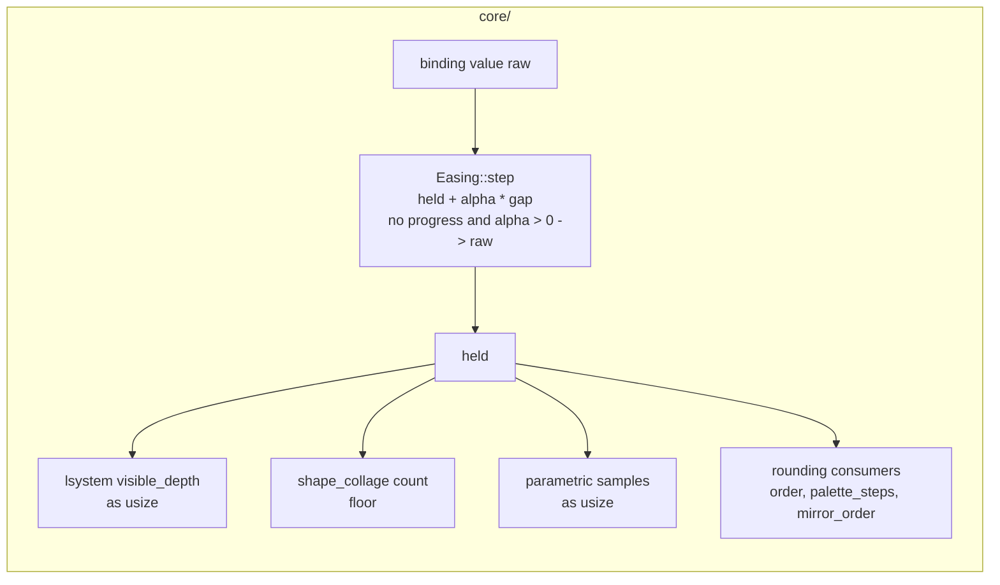

# 0175 — An eased value arrives at its target

> **Status:** in-progress
> **Created:** 2026-09-14
> **Owner skill(s):** `dev`
> **Related ADRs:** [0019](../adrs/0019-eased-parameters.md), [0035](../adrs/0035-asymmetric-attack-release-easing.md)
> **Closes:** design-backlog 0218, design-backlog 0212

> **Amended 2026-09-14** after a validity sweep. The changes:
> - the TL;DR's settling value is corrected;
> - `ParamKind::Structural` rounding is named as a rejected alternative;
> - Phase 1 gains an overshoot case at `alpha` near 1 and a settled test file;
> - Phase 2's grep is narrowed so it can pass;
> - backlog 0212 is folded in as Phase 3, with a ruling on each of its three guards.
>
> Only the rulings are new design. The rest are corrections.

> **Amended 2026-09-15** after Phase 3 parked `plan_wrong`. The `shader.rs` ruling covered `dt = 0`
> and missed that the `1e-6` floor also turned a **NaN** `dt` into a finite decay, which
> `the_pure_half_is_total_on_degenerate_input` sweeps. The ruling stands: the floor is deleted. What
> changes is the test, which stops sweeping a frame delta at all, for the reason it already gives for
> not sweeping `decay`. Phase 3 gains `shader_tests.rs` and `roster.rs` in its files, and one
> done-when for each.

## TL;DR

`Easing::step` is a one-pole ease with no end state. In f32 it stops moving short of its target and
never gets there. A parameter the scene **truncates** therefore never takes its top step. An ease
toward `2.0` settles a few float spacings short: `1.9999996` at tau 0.1 s and 60 Hz, three spacings
short. `as usize` then draws `1`. This plan makes the ease return `raw`
on the first frame where a step makes no progress, so every ease reaches its target exactly, in
finite time, at every time constant. The five L-system presets keep their `N.5` offsets, because
the offset is still what makes a **transient** step draw. The comment that justifies the offset is
reworded, because after this fix the reason it gives is false.

## Context & problem

Backlog 0218 has the measurement: a throwaway `lsystem` preset steps from 1 to 2 at `t = 1` with
`[smoothing] visible_depth = 0.1`. It still draws generation 1 at `t = 10`, ninety time constants
later. Five shipped presets hit the bug and now dodge it by targeting `N.5`.

This interview corrected two things in the entry.

**1. The stall distance depends on the time constant, so a fixed "few ulps" snap is wrong.** A step
changes `held` only while `alpha * gap` is at least half the float spacing `u` at `held`. The ease
therefore stalls at a gap of about `u / (2 * alpha)`:

| tau, frame rate | `alpha` | stall gap toward `2.0` (`u = 2^-23`) | in spacings | frames to stall from a gap of 1 |
|---|---|---|---|---|
| 0.1 s, 60 Hz | 0.15352 | 3.9e-7 | ~3 | ~89 |
| 2 s, 144 Hz | 0.0034662 | 1.72e-5 | ~144 | ~3130 |

The entry proposed snapping once the gap is within "a few ulps". That works on the first row and
fails on the second. The rule that holds on both rows is the **fixed point itself**: return `raw`
when the computed step equals `held`. It terminates. `alpha < 1` puts the exact sum strictly between
`held` and `raw`, round-to-nearest keeps it inside `[held, raw]`, so the value moves monotonically
and must reach either `raw` or a stall in finitely many frames.

**2. The snap does not make the obvious binding work on a transient.** A truncated parameter draws
its step only once the ease has fully arrived. Per the table, that takes about ten to fifteen time
constants. `lsystem_bower` steps on `onset` with a 0.04 s attack, so arrival would take about half a
second, and the onset is gone long before that. `rime`, `coral`, `vellum` and `icecrystal` step on a
band under constants of 0.15-0.45 s, which is the same shape. **The `N.5` offset stays.** What
changes is the reason. The presets currently say the ease "never reaches a whole number", and after
this plan that is false. The real reason is that a floored step draws only on arrival, and arrival
outlasts the transient that asked for it.

**The audit the entry left open.** Three consumers truncate a bindable parameter. Most other whole
number parameters **round** (kaleidoscope `order`, `palette_steps`, `mirror_order`), so they are
unaffected:

| Consumer | Site | Effect of the stall today |
|---|---|---|
| `lsystem` `visible_depth` | `core/src/render/scenes/lines/lsystem.rs`, `update` | draws one generation low, forever |
| `shape_collage` `count` | `applied_count` in `core/src/render/scenes/shape_collage.rs` | one element short, forever. Its comment chooses `floor` so an element is "admitted when it has actually arrived", which it never does |
| `parametric` `samples` | `core/src/render/scenes/lines/parametric.rs`, `update` | one sample short. Visually negligible |

The snap fixes all three for a sustained target. No consumer changes.

## Decision

`Easing::step` computes the step as it does today. If `alpha > 0` and the step leaves `held`
unchanged, it returns `raw`. The `alpha > 0` guard matters. For `dt / tau` below roughly `3e-8`
(tau above ~2e5 s at 144 Hz), `1 - exp(-dt/tau)` rounds to exactly zero, every step makes no
progress, and an unguarded snap would turn the slowest possible ease into an instant one. The snap
jumps the value by at most the stall gap, `u / (2 * alpha)`. Relative to the value that is about
`2^-24 / alpha`, or 1.5e-4 at tau 10 s and 240 Hz. Nothing visible moves except a truncating
consumer arriving.

We rejected three alternatives:

- **A snap threshold of a few ulps** (the entry's proposal). The stall gap scales with `1 / alpha`,
  so a slow ease stalls outside the threshold and never snaps. The second table row is the
  counterexample.
- **Rounding `visible_depth` in the scene.** That would make the natural `N + floor(...)` binding
  cross mid-glide, but it changes what a documented parameter means. It would also revert five
  presets and move `lsystem` goldens. It still would not help `count`, which floors deliberately.
- **Marking the three truncated parameters `ParamKind::Structural`.** This is the nearer version of
  the previous alternative. The engine already rounds a Structural value once, after smoothing and
  before `set_param` (`ParamKind::quantize` in `core/src/render/scenes/mod.rs`; all three are `Modal` today), so no scene code
  would change. It would fix the stall: `1.9999996` rounds to `2`. But it changes what all three
  parameters mean, in two ways that cost shipped content:
  1. The five L-system presets target `N.5` precisely because the scene floors. `f32::round` rounds
     half away from zero, so `3.5` becomes `4`, and every one of them would draw one generation above
     what it was tuned to at rest.
  2. `shape_collage`'s `count` floors on purpose, so an element is admitted only once it has
     arrived. Rounding admits it halfway.

  Plan 0161's audit marked a parameter Structural only where the scene already rounds, and none of
  these three does. The snap fixes all three without changing a meaning.
- **A `--check` warning.** It needs expression analysis to recognise an integer-valued `floor` step
  on a truncated parameter. That is a lot of machinery for a warning, and it makes no binding work.

No ADR. The change completes ADR-0019's easing rather than revisiting any of its trade-offs, and
this section records the rejected alternatives.

### The three sign guards (backlog 0212)

ADR-0191 makes `sanitize_frame_dt` the engine's only answer to a degenerate frame delta. That
function never returns a value that is non-finite or `<= 0`. Three guards below it check the delta's
sign instead of its finiteness, so the hygiene test that counts guards cannot see them, and each
answers differently. One ruling each:

| Site | Guard today | Ruling | Why |
|---|---|---|---|
| `Easing::step`, `core/src/preset/schema/easing.rs` | `dt <= 0.0` in the pass-through condition, returning `raw` | **Delete the `dt` term.** The `tau` terms stay. State the precondition in the doc: `dt` is finite and positive, as `Scene::advance` states it | It is a policy, and a snap is the odd answer. Without it the arithmetic answers, and consistently with Phase 1's snap: `dt = 0` gives `alpha = 0`, and the snap's `alpha > 0` guard makes that **hold**, not snap. A non-finite `dt` outside the precondition poisons one frame, and the existing non-finite-`held` guard returns `raw` on the next. `Easing` is public, and no caller passes a degenerate `dt` today |
| the latch countdown, `core/src/render/evaluate.rs` | `state.hold_left - dt.max(0.0)` | **Delete the `.max(0.0)` on `dt`.** The outer `.max(0.0)` on `hold_left` stays | Inert. With `dt > 0`, `dt.max(0.0)` is `dt` |
| the MilkDrop decay, `core/src/render/scenes/warp_mesh/shader.rs` | `decay_per_second.max(0.0).powf(dt.max(1e-6))` | **Delete the `.max(1e-6)` on `dt`.** The `.max(0.0)` on the rate stays | The floor only matters at `dt = 0`, where `0^0 = 1` would stop a zero-rate field from decaying, and at a NaN `dt`, which it turns into a finite factor. The seam makes both unreachable, and for every positive `dt`, `0^dt` is already `0` |

None of the three is kept, so the widened hygiene pattern below needs **no** new allowlist entry.
The test names a guard only if a future reader adds one back.

**The totality test stops sweeping the frame delta (amended 2026-09-15).**
`the_pure_half_is_total_on_degenerate_input` in `core/src/render/scenes/warp_mesh/shader_tests.rs`
sweeps `"a zero dt"` and `"a NaN dt"` through `fill_uniform`. The only caller is `encode.rs`, which
passes the scene's `self.dt`, and `advance` sets that from the sanitized delta. So both cases are
outside `fill_uniform`'s precondition, just as a non-finite `decay` is. The test already skips `decay`
for that reason: *"what is swept is what the scene hands over"*. Both `dt` cases are removed, and a
sentence beside the `decay` one says that `dt` arrives through `sanitize_frame_dt`, finite and
positive (ADR-0191). The totality claim still covers everything a preset or a target size can hand
the function: size, aspect and decay.

Rejected: **keeping the floor, with a `DT_GUARD_ALLOWED` entry.** That allowlist exists for a `dt`
that is not a frame delta (the tier governor's samples). This one is a frame delta, so an entry would
bring back the second policy that ADR-0191 retired, for the sake of a test case no caller can reach.
Also rejected: **keeping `"a zero dt"` because it still passes.** A sweep case that is outside the
precondition teaches the next reader that the function promises something about that input. It does
not.

## Architecture diagram

## Implementation phases

### Phase 1 — The ease snaps at its fixed point

- **Owner skill:** dev
- **What:** `Easing::step` returns `raw` when `alpha > 0` and the computed step equals `held`. Its
  doc comment says how the ease ends: the stall gap `u / (2 * alpha)`, and why the test is "no
  progress" rather than a distance. A test module pins the behaviour, and a render-layer test shows
  the backlog's symptom is gone.
- **Files touched:** `core/src/preset/schema/easing.rs`. The `Easing::step` unit tests go in
  `core/src/preset/schema/tests.rs`, the schema module's GPU-free in-crate test file beside the
  function. They do not go in `core/tests/easing.rs`, which is the capture-based transient probe
  and measures frames, not the function. They do not go in `core/src/render/tests.rs` either, which
  holds the render layer's `ParamSmoother` tests. The `lsystem` test goes through whatever seam
  `core/src/render/scenes/lines/` tests already use to observe the drawn depth.
- **Done when:**
  - Easing `symmetric(0.1)` from `1.0` toward `2.0` at `dt = 1/60` returns **bit-exactly `2.0`**
    within 120 frames. The stall is at ~89 frames.
  - Easing `symmetric(2.0)` from `1.0` toward `2.0` at `dt = 1/144` returns bit-exactly `2.0` within
    4000 frames. The stall is at ~3130 frames, and the gap there is ~144 spacings. **This case is
    what a fixed-ulp threshold fails**, and it is why this test exists.
  - In both eases every frame's value lies in `[held, raw]` and does not decrease. The snap never
    overshoots.
  - **The overshoot property also holds where `alpha` is near 1**, which is where the monotonic
    argument's hidden assumption bites. That assumption is that `raw - held` is exact. Sterbenz
    guarantees exactness only when the two values are within a factor of two. Test `symmetric(0.001)`
    at `dt = 1/60` (`alpha` rounds to within one spacing of `1`) over operand pairs far apart in
    magnitude and of both signs: `1e-3` toward `1e6`, `1e6` toward `1e-3`, and `-5.0` toward `3.0`.
    Assert each result lies in `[min(held, raw), max(held, raw)]`. If a pair fails, clamp the
    computed step to that interval, and name the pair in the log.
  - Easing `symmetric(1.0e9)` at `dt = 1/144` from `1.0` toward `2.0` returns `1.0` for every frame.
    `alpha` rounds to zero there, and the value holds instead of snapping.
  - Easing toward a lower target (`2.0` to `1.0`) arrives bit-exactly as well. The release side uses
    the same rule.
  - An `lsystem` scene fed a `visible_depth` that steps from `1` to `2` and is eased at `tau = 0.1`
    draws generation **2** once the ease has settled. This test fails on the tree before the phase
    lands.
  - The existing `Easing` / `ParamSmoother` tests pass unchanged, including the non-finite
    pass-throughs. The `dt <= 0` pass-through stays in this phase, and Phase 3 rules on it. `cargo nextest run --workspace` moves no golden. If one moves, stop and
    name it in the log. It can only be a truncating consumer arriving, and whether to re-bless it is
    the architect's call.

### Phase 2 — The reader and the five presets say what is true

- **Owner skill:** dev
- **What:** The `[smoothing]` section of `presets/README.md` gets one short paragraph: an eased value
  reaches its target exactly, but only after about ten to fifteen time constants. A parameter the
  engine floors (`visible_depth`, `count`, `samples`) takes its step on arrival, so a step that must
  land inside a transient targets the midpoint (`N.5`). The five L-system presets' comments are
  reworded to give that reason. **Comment text only. No value, binding or smoothing constant
  changes.**
- **Files touched:** `presets/README.md` (hand-written section, outside the generated params block);
  `presets/lsystem_bower.toml`, `lsystem_coral.toml`, `lsystem_rime.toml`, `lsystem_vellum.toml`
  (the two-line ".5 is load-bearing" comment); `presets/lsystem_icecrystal.toml` (the header
  sentences that say a one-pole ease "in f32 never reaches" its target).
- **Done when:**
  - `grep -n "never reaches\|never reach a whole" presets/lsystem_*.toml` returns nothing. The
    grep is scoped to the five files on purpose. The phrase also appears, meaning something else, in
    `presets/curve_rosemono.toml` (a band), `presets/spectrum_metermono.toml` (the layout) and
    `presets/README.md` (the tonemap curve). None of those is about easing, and none is touched.
  - The five presets load and render **byte-identically** to before the phase. Their golden and
    sanity gates pass without a re-bless, which is the evidence that only comments changed.
  - `node scripts/check-reader-prose.mjs` and `node scripts/check-doc-links.mjs` exit 0, and
    `node scripts/toc.mjs --check` reports no drift. The new paragraph adds no heading, so the
    contents block should not move.

### Phase 3 — Nothing below the seam keeps a frame-delta policy

- **Owner skill:** dev
- **What:** Apply the three rulings in `### The three sign guards (backlog 0212)` above. Then widen
  `a_frame_delta_is_checked_for_finiteness_in_exactly_one_place` in `core/tests/hygiene.rs` so its
  line predicate also matches a **sign or size check on a variable named exactly `dt`**:
  - `dt` compared against `0` with `<`, `<=`, `>` or `>=`;
  - `dt.max(`, `dt.min(` or `dt.clamp(`.

  `DT_GUARD`'s own line (`if dt.is_finite() && dt > 0.0 {` in `render/mod.rs`) and the
  `DT_GUARD_ALLOWED` entry in `render/tier.rs` (`dt > threshold`, not a zero comparison) keep
  matching as they do today. Keep the test's name, because backlog 0212 cites it. Reword its doc
  and its failure message so both cover sign checks as well as finiteness. Update `Easing::step`'s doc to state the precondition. Replace the
  `dt <= 0` sentence in any comment that described the removed pass-through.
- **Files touched:** `core/src/preset/schema/easing.rs`, `core/src/render/evaluate.rs`,
  `core/src/render/scenes/warp_mesh/shader.rs`, `core/src/render/scenes/warp_mesh/shader_tests.rs`
  (the two `dt` sweep cases, per the amended ruling above), `core/src/render/roster.rs`
  (`ParamSmoother::smooth`'s doc, which repeats the "non-positive `dt` passes `raw` through" sentence),
  `core/tests/hygiene.rs`, and the easing unit tests in `core/src/preset/schema/tests.rs`.
- **Done when:**
  - **The widened predicate bites.** Before the three deletions, with the new predicate in place,
    the test fails and names exactly the three sites in the ruling table. Record that output in the
    log. After the deletions it passes, with `DT_GUARD_ALLOWED` unchanged.
  - **`Easing::step` holds on a zero step.** `symmetric(0.1).step(1.0, 2.0, 0.0)` returns `1.0`.
    Assert it next to Phase 1's tests. This is the arithmetic answer the ruling chose. It replaces
    the old snap to `2.0`.
  - `grep -rnE "\bdt\.(max|min|clamp)\(|\bdt\s*(<|<=|>|>=)\s*0" core/src` matches exactly one line,
    `sanitize_frame_dt`'s `if dt.is_finite() && dt > 0.0 {` in `core/src/render/mod.rs`. On
    2026-09-14 it matches that line and the three being deleted.
  - `the_pure_half_is_total_on_degenerate_input` sweeps six cases and no `dt` case. Every assertion in
    its loop is unchanged, and its comment names `sanitize_frame_dt` as the reason `dt` is not swept.
  - ``grep -rn "non-positive `dt`" core/src`` returns nothing. On 2026-09-15 it matches
    `easing.rs` (`Easing::step`'s doc) and `roster.rs` (`ParamSmoother::smooth`'s doc). Each is
    reworded to state the precondition.
  - `cargo nextest run --workspace` moves no golden. All three sites are unreachable with a
    delta at or below zero, so every captured frame computes the same numbers. A moved baseline is a
    stop.

## Risks & open questions

- **A golden moves in Phase 1.** Nothing shipped should truncate a smoothed parameter toward a whole
  number any more: the five presets target `N.5`. `shape_collage` presets with a smoothed `count`
  have not been audited against the goldens, and one could legitimately gain its last element. The
  done-when makes that a stop rather than a silent re-bless.
- **The backlog probe does not go red on delivery.** Entry 0218's first probe matches
  `held + alpha * (raw - held)`, and that expression will very likely survive the fix unchanged. The
  probe will stay green while the claim becomes false. `dev` reports the probe exit and leaves the
  entry alone. Archiving it is step 3c at the close.
- **Backlog 0212's probes go red on delivery, by design.** Phase 3 deletes the three lines they
  match: `dt <= 0\.0` in `easing.rs`, `dt\.max\(0\.0\)` in `evaluate.rs`, `dt\.max\(1e-6\)` in
  `shader.rs`. A fourth probe matches `let method = "dt\.is_finite\(\)";` in `hygiene.rs`, and it
  goes red too if the widened predicate is restructured. Phases 1 and 2 must leave them green. A red before Phase 3 means an edit went beyond
  its phase. `dev` reports the exit and leaves the entry for the close.
- **Plan 0181 moves `advance` in the same file.** It reorders `evaluate_preset` and
  `evaluate_layer` in `core/src/render/evaluate.rs` and leaves `LatchBank::advance` alone. Phase 3
  here edits one expression inside `LatchBank::advance`. The two plans touch disjoint functions, so
  either order merges cleanly.
- **`sanitize_frame_dt` keeps a tiny positive delta.** A caller's `dt = 1e-9` reaches the warp
  decay, where the deleted floor used to raise it to `1e-6`. No shell produces such a delta, since a
  frame interval is milliseconds. The floor invented time rather than guarding anything.
- **The spectrum scene's per-element smoother calls the same function.** Its elements now arrive
  exactly too, which moves nothing visible. It is listed so the close does not treat it as a
  surprise.

## What this plan does NOT do

- **It does not change any consumer.** `visible_depth` still floors and `count` still floors on
  purpose. No `ParamSpec` doc changes, so neither the generated params reference nor the schemas
  regenerate.
- **It does not remove the `N.5` offsets.** They remain necessary for transient steps. This plan
  only corrects why the presets say they are there.
- **It does not touch the non-finite `held`/`raw` guard** in `Easing::step` or `tau`'s pass-through
  terms. Those are about the smoother's own state, not the frame delta. Phase 3 deletes only the
  `dt` term.
- **It does not add a `--check` lint** for a floored step on a smoothed parameter.
- **It does not change `alpha`'s arithmetic** (for example `exp_m1` for precision at tiny
  `dt / tau`). The guard above makes the zero-`alpha` case hold, which is today's behaviour.

## Implementation log

> Written by `dev` — one row per phase as that phase's commit lands, and the close block after the
> last one. **The phases above are the contract; everything here is what happened.**
> **Observations, never conclusions:** this says where to look, architect decides how it went.
> No per-criterion pass list, no self-assessment, no narrative — but a deviation from the plan or
> an unmet done-when is always disclosed. Stays shorter than `## Implementation phases` above.

**Lane:** `plan-0175-an-eased-value-arrives`, worktree `C:\Users\Igor Konovalov\WORK\rlx-plan-0175`
(conductor run)

| phase | owner | state | commit |
|---|---|---|---|
| 1 — The ease snaps at its fixed point | dev | done | 26ce31f |
| 2 — The reader and the five presets say what is true | dev | done | bfd2d55 |
| 3 — Nothing below the seam keeps a frame-delta policy | dev | parked, nothing committed | |

### Notes

- Phase 1: no `lines/` test observed the drawn depth, so the `lsystem` test is a headless capture in
  `core/src/render/scenes/lines/tests.rs` (`an_eased_visible_depth_draws_the_generation_it_settles_on`),
  comparing the eased run's last frame against an unsmoothed twin's. With the snap disabled it failed
  on "still draws generation 1".
- Phase 1: the three near-unit-`alpha` pairs stayed inside their interval; no clamp was added.
- Phase 1: `cargo nextest run --workspace` under the suite lock exited 0, 1939 passed, 6 skipped; no
  golden moved.
- Phase 2: `golden`, `sanity`, `preset` and `preset_schema` passed (236 passed, 2 skipped) with no
  re-bless.
- **Phase 3 parked (plan_wrong).** The ruling on `shader.rs` covers `dt = 0` only. The `.max(1e-6)`
  floor also turns a NaN `dt` into a finite decay, and
  `render::scenes::warp_mesh::shader::tests::the_pure_half_is_total_on_degenerate_input` sweeps
  `("a NaN dt", ...)` and asserts every uniform lane is finite. With the three deletions applied it
  failed: `a NaN dt: lane 28 came back NaN`. The fix needs an edit to
  `core/src/render/scenes/warp_mesh/shader_tests.rs`, which is outside the phase's files, and it
  drops a totality claim that test makes. That is architect's call. The Phase 3 edits were reverted
  and nothing from Phase 3 is committed.
- Phase 3, for the resume: with the widened predicate in place and before the deletions, the hygiene
  test failed listing exactly `preset/schema/easing.rs: if tau <= 0.0 || !tau.is_finite() || dt <= 0.0 {`,
  `render/evaluate.rs: state.hold_left = (state.hold_left - dt.max(0.0)).max(0.0);`,
  `render/scenes/warp_mesh/shader.rs: decay_per_second.max(0.0).powf(dt.max(1e-6)),` beside the
  allowed `render/mod.rs` guard. After the deletions it passed. The existing `Easing`, `ParamSmoother`
  and latch tests stayed green. `core/src/render/roster.rs` (`ParamSmoother::smooth`'s doc) also
  carries the "non-positive `dt` passes `raw` through" sentence the phase asks to replace.

### Close triggers

- **`presets/` touched:**
- **Plan header `Closes:`**
- **What shipped:**
- **Operator docs touched:**
- **Backlog probes (`node scripts/check-backlog-claims.mjs`):**
- **Full suite:**
- **Outstanding `human` phases:**

## Followups (after this lands)
