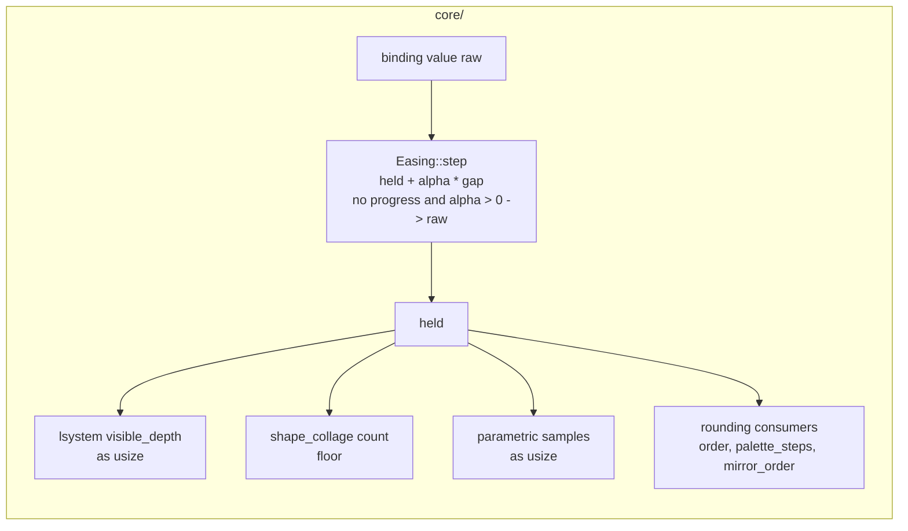

# 0175 — An eased value arrives at its target

> **Status:** draft
> **Created:** 2026-09-14
> **Owner skill(s):** `dev`
> **Related ADRs:** [0019](../adrs/0019-eased-parameters.md), [0035](../adrs/0035-asymmetric-attack-release-easing.md)
> **Closes:** design-backlog 0218

## TL;DR

`Easing::step` is a one-pole ease with no end state. In f32 it stops moving short of its target and
never gets there. A parameter the scene **truncates** therefore never takes its top step: an ease
toward `2.0` settles at `1.9999998` and `as usize` draws `1`. This plan makes the ease return `raw`
on the first frame where a step makes no progress, so every ease reaches its target exactly, in
finite time, at every time constant. The five L-system presets keep their `N.5` offsets, because
the offset is still what makes a **transient** step draw. The comment that justifies the offset is
reworded, because after this fix the reason it gives is false.

## Context & problem

Backlog 0218 has the measurement: a throwaway `lsystem` preset steps from 1 to 2 at `t = 1` with
`[smoothing] visible_depth = 0.1`. It still draws generation 1 at `t = 10`, ninety time constants
later. Five shipped presets hit the bug and now dodge it by targeting `N.5`.

This interview corrected two things in the entry.

**1. The stall distance depends on the time constant, so a fixed "few ulps" snap is wrong.** A step
changes `held` only while `alpha * gap` is at least half the float spacing `u` at `held`. The ease
therefore stalls at a gap of about `u / (2 * alpha)`:

| tau, frame rate | `alpha` | stall gap toward `2.0` (`u = 2^-23`) | in spacings | frames to stall from a gap of 1 |
|---|---|---|---|---|
| 0.1 s, 60 Hz | 0.15352 | 3.9e-7 | ~3 | ~89 |
| 2 s, 144 Hz | 0.0034662 | 1.72e-5 | ~144 | ~3160 |

The entry proposed snapping once the gap is within "a few ulps". That works on the first row and
fails on the second. The rule that holds on both rows is the **fixed point itself**: return `raw`
when the computed step equals `held`. It terminates. `alpha < 1` puts the exact sum strictly between
`held` and `raw`, round-to-nearest keeps it inside `[held, raw]`, so the value moves monotonically
and must reach either `raw` or a stall in finitely many frames.

**2. The snap does not make the obvious binding work on a transient.** A truncated parameter draws
its step only once the ease has fully arrived. Per the table, that takes about ten to fifteen time
constants. `lsystem_bower` steps on `onset` with a 0.04 s attack, so arrival would take about half a
second, and the onset is gone long before that. `rime`, `coral`, `vellum` and `icecrystal` step on a
band under constants of 0.15-0.45 s, which is the same shape. **The `N.5` offset stays.** What
changes is the reason. The presets currently say the ease "never reaches a whole number", and after
this plan that is false. The real reason is that a floored step draws only on arrival, and arrival
outlasts the transient that asked for it.

**The audit the entry left open.** Three consumers truncate a bindable parameter. Most other whole
number parameters **round** (kaleidoscope `order`, `palette_steps`, `mirror_order`), so they are
unaffected:

| Consumer | Site | Effect of the stall today |
|---|---|---|
| `lsystem` `visible_depth` | `core/src/render/scenes/lines/lsystem.rs`, `update` | draws one generation low, forever |
| `shape_collage` `count` | `applied_count` in `core/src/render/scenes/shape_collage.rs` | one element short, forever. Its comment chooses `floor` so an element is "admitted when it has actually arrived", which it never does |
| `parametric` `samples` | `core/src/render/scenes/lines/parametric.rs`, `update` | one sample short. Visually negligible |

The snap fixes all three for a sustained target. No consumer changes.

## Decision

`Easing::step` computes the step as it does today. If `alpha > 0` and the step leaves `held`
unchanged, it returns `raw`. The `alpha > 0` guard matters. For `dt / tau` below roughly `3e-8`
(tau above ~2e5 s at 144 Hz), `1 - exp(-dt/tau)` rounds to exactly zero, every step makes no
progress, and an unguarded snap would turn the slowest possible ease into an instant one. The snap
jumps the value by at most the stall gap, `u / (2 * alpha)`. Relative to the value that is about
`2^-24 / alpha`, or 1.5e-4 at tau 10 s and 240 Hz. Nothing visible moves except a truncating
consumer arriving.

We rejected three alternatives:

- **A snap threshold of a few ulps** (the entry's proposal). The stall gap scales with `1 / alpha`,
  so a slow ease stalls outside the threshold and never snaps. The second table row is the
  counterexample.
- **Rounding `visible_depth` in the scene.** That would make the natural `N + floor(...)` binding
  cross mid-glide, but it changes what a documented parameter means. It would also revert five
  presets and move `lsystem` goldens. It still would not help `count`, which floors deliberately.
- **A `--check` warning.** It needs expression analysis to recognise an integer-valued `floor` step
  on a truncated parameter. That is a lot of machinery for a warning, and it makes no binding work.

No ADR. The change completes ADR-0019's easing rather than revisiting any of its trade-offs, and
this section records the rejected alternatives.

## Architecture diagram

## Implementation phases

### Phase 1 — The ease snaps at its fixed point

- **Owner skill:** dev
- **What:** `Easing::step` returns `raw` when `alpha > 0` and the computed step equals `held`. Its
  doc comment says how the ease ends: the stall gap `u / (2 * alpha)`, and why the test is "no
  progress" rather than a distance. A test module pins the behaviour, and a render-layer test shows
  the backlog's symptom is gone.
- **Files touched:** `core/src/preset/schema/easing.rs`; the easing tests beside the existing
  smoother tests in `core/src/render/tests.rs` (or a `#[cfg(test)]` module in `easing.rs`, whichever
  the crate's layout prefers); an `lsystem` test through whatever seam `core/src/render/scenes/lines/`
  tests already use to observe the drawn depth.
- **Done when:**
  - Easing `symmetric(0.1)` from `1.0` toward `2.0` at `dt = 1/60` returns **bit-exactly `2.0`**
    within 120 frames. The stall is at ~89 frames.
  - Easing `symmetric(2.0)` from `1.0` toward `2.0` at `dt = 1/144` returns bit-exactly `2.0` within
    4000 frames. The stall is at ~3160 frames, and the gap there is ~144 spacings. **This case is
    what a fixed-ulp threshold fails**, and it is why this test exists.
  - In both eases every frame's value lies in `[held, raw]` and does not decrease. The snap never
    overshoots.
  - Easing `symmetric(1.0e9)` at `dt = 1/144` from `1.0` toward `2.0` returns `1.0` for every frame.
    `alpha` rounds to zero there, and the value holds instead of snapping.
  - Easing toward a lower target (`2.0` to `1.0`) arrives bit-exactly as well. The release side uses
    the same rule.
  - An `lsystem` scene fed a `visible_depth` that steps from `1` to `2` and is eased at `tau = 0.1`
    draws generation **2** once the ease has settled. This test fails on the tree before the phase
    lands.
  - The existing `Easing` / `ParamSmoother` tests pass unchanged, including the `dt <= 0` and
    non-finite pass-throughs. `cargo nextest run --workspace` moves no golden. If one moves, stop and
    name it in the log. It can only be a truncating consumer arriving, and whether to re-bless it is
    the architect's call.

### Phase 2 — The reader and the five presets say what is true

- **Owner skill:** dev
- **What:** The `[smoothing]` section of `presets/README.md` gets one short paragraph: an eased value
  reaches its target exactly, but only after about ten to fifteen time constants. A parameter the
  engine floors (`visible_depth`, `count`, `samples`) takes its step on arrival, so a step that must
  land inside a transient targets the midpoint (`N.5`). The five L-system presets' comments are
  reworded to give that reason. **Comment text only. No value, binding or smoothing constant
  changes.**
- **Files touched:** `presets/README.md` (hand-written section, outside the generated params block);
  `presets/lsystem_bower.toml`, `lsystem_coral.toml`, `lsystem_rime.toml`, `lsystem_vellum.toml`
  (the two-line ".5 is load-bearing" comment); `presets/lsystem_icecrystal.toml` (the header
  sentences that say a one-pole ease "in f32 never reaches" its target).
- **Done when:**
  - `grep -rn "never reaches\|never reach a whole" presets/` returns nothing.
  - The five presets load and render **byte-identically** to before the phase. Their golden and
    sanity gates pass without a re-bless, which is the evidence that only comments changed.
  - `node scripts/check-reader-prose.mjs` and `node scripts/check-doc-links.mjs` exit 0, and
    `node scripts/toc.mjs --check` reports no drift. The new paragraph adds no heading, so the
    contents block should not move.

## Risks & open questions

- **A golden moves in Phase 1.** Nothing shipped should truncate a smoothed parameter toward a whole
  number any more: the five presets target `N.5`. `shape_collage` presets with a smoothed `count`
  have not been audited against the goldens, and one could legitimately gain its last element. The
  done-when makes that a stop rather than a silent re-bless.
- **The backlog probe does not go red on delivery.** Entry 0218's first probe matches
  `held + alpha * (raw - held)`, and that expression will very likely survive the fix unchanged. The
  probe will stay green while the claim becomes false. `dev` reports the probe exit and leaves the
  entry alone. Archiving it is step 3c at the close.
- **Backlog 0212's probe reads the same file.** It matches `dt <= 0.0` in `easing.rs`. This plan
  keeps that guard, so the probe must stay green. If it goes red, the edit went beyond this plan.
- **The spectrum scene's per-element smoother calls the same function.** Its elements now arrive
  exactly too, which moves nothing visible. It is listed so the close does not treat it as a
  surprise.

## What this plan does NOT do

- **It does not change any consumer.** `visible_depth` still floors and `count` still floors on
  purpose. No `ParamSpec` doc changes, so neither the generated params reference nor the schemas
  regenerate.
- **It does not remove the `N.5` offsets.** They remain necessary for transient steps. This plan
  only corrects why the presets say they are there.
- **It does not touch the `dt <= 0` or non-finite guards.** Backlog 0212 owns which of those is
  policy.
- **It does not add a `--check` lint** for a floored step on a smoothed parameter.
- **It does not change `alpha`'s arithmetic** (for example `exp_m1` for precision at tiny
  `dt / tau`). The guard above makes the zero-`alpha` case hold, which is today's behaviour.

## Implementation log

> Written by `dev` — one row per phase as that phase's commit lands, and the close block after the
> last one. **The phases above are the contract; everything here is what happened.**
> **Observations, never conclusions:** this says where to look, architect decides how it went.
> No per-criterion pass list, no self-assessment, no narrative — but a deviation from the plan or
> an unmet done-when is always disclosed. Stays shorter than `## Implementation phases` above.

**Lane:** _(`main` directly, or the worktree path plus its branch)_

| phase | owner | state | commit |
|---|---|---|---|
| 1 — The ease snaps at its fixed point | dev | not started | |
| 2 — The reader and the five presets say what is true | dev | not started | |

### Notes

### Close triggers

- **`presets/` touched:**
- **Plan header `Closes:`**
- **What shipped:**
- **Operator docs touched:**
- **Backlog probes (`node scripts/check-backlog-claims.mjs`):**
- **Full suite:**
- **Outstanding `human` phases:**

## Followups (after this lands)
