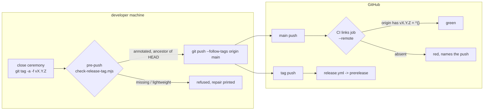

# 0176 — A release tag reaches origin

> **Status:** approved (2026-09-14)
> **Created:** 2026-09-14
> **Owner skill(s):** `dev`, `human`
> **Related ADRs:** [0203](../adrs/0203-a-release-tag-is-annotated-and-origin-is-what-is-checked.md) (proposed), [0038](../adrs/0038-tag-driven-release-unsigned-universal-mac-app.md), [0005](../adrs/0005-versioning-and-release-cadence.md)
> **Closes:** design-backlog 0196
> **Blocks:** [Plan 0103](0103-the-project-gets-an-audience.md) Phase 5 — nobody outside is asked to download a build until a tag reliably becomes a release

## TL;DR

Most version tags never became releases because **they never reached `origin`**. GitHub did not
suppress them. The CI run history shows that no push event carried them. The close ceremony makes
the problem worse: it moves the tag with `git tag -d && git tag`, which writes a **lightweight** tag,
and `git push --follow-tags` never sends one of those. On 2026-09-14 ten tags were stranded locally,
eight of them lightweight. This plan does three things. The ceremony writes annotated tags. A gate
checks the property that actually failed, that the version `main` declares is tagged on `origin`,
both at pre-push and, where it cannot be bypassed, in CI. The owner then pushes the ten stranded tags
as tags only, with no releases, and publishes `v0.123.0` alone.

## Context & problem

Backlog 0196 counted 19 silent tags in the `v0.93.0`-`v0.113.0` window. The only cause proposed so
far, bulk-push suppression, covered one of them. This sweep settled the rest from two instruments
anyone can re-run. ADR-0203's Context carries the full reading:

- **`ci.yml` runs on every tag push GitHub accepts.** Its run list matches the Release run list
  exactly, tag for tag and second for second, and **none of the 19 silent tags has a CI run.** A
  suppressed or failed release would still leave a CI run behind. These tags simply were not pushed
  when they were made. They reached `origin` only inside the rewrite's 131-tag force-push, which
  fires no workflows.
- **The recent gap has a mechanical cause in our own procedure.**

| tag | object | on `origin` | commit on `origin/main` |
|---|---|---|---|
| `v0.113.0`, `v0.114.0`, `v0.121.0`, `v0.121.1` | annotated | yes | yes |
| `v0.115.0`, `v0.116.0`, `v0.117.0`, `v0.120.0`, `v0.122.0` | **lightweight** | no | yes |
| `v0.118.0`, `v0.119.0` | annotated | **no** | yes |
| `v0.122.1`, `v0.122.2`, `v0.123.0` | **lightweight** | no | no (`main` unpushed since `dc07927`) |

`docs/releasing.md` ("The studio's two copies follow, then the tag moves") and the architect skill's
close step 4 both prescribe `git tag -d vX.Y.Z && git tag vX.Y.Z`. The skill's manual-bump fallback
ends in `git tag vX.Y.Z`. Both produce the lightweight rows. **The two annotated-but-missing rows
show the push command is also unreliable.** Annotating is necessary but not sufficient, so the gate
has to read `origin` and not only the local object type.

The eight local `batch/*` tags are unrelated scratch refs. They must not ride along in any bulk
push, which is why Phase 3 names every tag it pushes.

## Decision

ADR-0203:

- **Annotated tags everywhere the ceremony writes one**, with `cargo release`'s own message.
- **`scripts/check-release-tag.mjs`** with three modes:
  - offline, in `pre-push`: the tag for `HEAD`'s version exists locally, is annotated, and is an
    ancestor of `HEAD`;
  - `--remote`, in CI's `links` job on a push to `main`: `origin` advertises that tag with a peeled
    `^{}` line;
  - `--self-test`: a throwaway repository proves the gate bites.
- **A `--stranded` listing** gives Phase 3 its exact tag set rather than a hand count.

We rejected:
- **`push.followTags` plus documentation alone.** It is per clone, it still skips lightweight tags,
  and `v0.118.0`/`v0.119.0` were missed while annotated.
- **A scheduled tags-vs-releases reconciler.** It cannot see a tag that never left the machine, which
  was the case for every failure recorded.
- **CI creating the tag.** That would move tag authority off ADR-0005's close and tag the wrong
  commit.

## Architecture diagram



## Implementation phases

### Phase 1 — The gate reads the property that failed

- **Owner skill:** dev
- **What:** `scripts/check-release-tag.mjs`, in the shape of its siblings: a header comment
  carrying the mechanism and citing ADR-0203 by bare number, exit 0/1, and `file`-style reporting.
  - **No flag (offline).** Parse `[workspace.package].version` from the root `Cargo.toml`. Resolve
    `refs/tags/v<version>`. Fail if it is missing, if `git cat-file -t` is not `tag`, or if its
    peeled commit is not an ancestor of `HEAD` (`git merge-base --is-ancestor`). Each failure prints
    the one command that repairs it.
  - **`--remote`.** `git ls-remote origin refs/tags/v<version> refs/tags/v<version>^{}`. Pass only
    when both lines come back. Retry every 10 s for up to 60 s before failing, and print what
    `origin` advertised.
  - **`--stranded`.** Every local `refs/tags/v*` absent from `git ls-remote --tags origin`, one per
    line with its object type. Exit 0 always. It is a listing, not a gate.
  - **`--self-test`.** `git init` a repository under the OS temp directory, write a `Cargo.toml`
    carrying a version, and assert: no tag gives exit 1, a lightweight tag gives exit 1, an annotated
    tag on `HEAD` gives exit 0, and an annotated tag on a commit that is not an ancestor of `HEAD`
    gives exit 1. Remove the temp repository afterwards.

  Wire the offline check and `--self-test` into `.githooks/pre-push` beside the other Node steps.
  Add to `.github/workflows/ci.yml`'s `links` job: `--self-test` unconditionally, and `--remote` under
  `if: github.event_name == 'push' && github.ref == 'refs/heads/main'`. The job's shallow checkout
  has no tags, so CI never runs the offline mode.
- **Files touched:** `scripts/check-release-tag.mjs` (new); `.githooks/pre-push`;
  `.github/workflows/ci.yml` (`links` job).
- **Done when:**
  - `node scripts/check-release-tag.mjs --self-test` exits 0, and it exits 1 if the annotated-type
    check is deleted from the script. Confirm by hand once and record it in the log.
  - On this checkout **before Phase 3 runs**, the offline mode exits **1** and names `v0.123.0` as
    lightweight. The gate convicts the live defect it exists for. (If `main` has moved past
    `0.123.0` by then, it names whichever tag `HEAD`'s version carries, and still exits 1 while that
    tag is lightweight.)
  - `node scripts/check-release-tag.mjs --stranded` lists exactly the stranded `v*` tags that
    `git ls-remote --tags origin` lacks: the ten tags in the table above, plus any tag made since.
    It lists no `batch/*` ref.
  - Every other pre-push step and `node scripts/check-doc-links.mjs` still exit 0.

### Phase 2 — The ceremony writes annotated tags, and the documents say why

- **Owner skill:** dev
- **What:** Change every tag-writing command in the release procedure to the annotated form, and give
  the reader the rule. In `docs/releasing.md`:
  - the studio-sync block becomes `git tag -a -f vX.Y.Z -m "chore: Release vX.Y.Z"`;
  - the push block becomes `git push --follow-tags origin main`, with one paragraph saying that
    `--follow-tags` sends only annotated tags and that the gate reads `origin`;
  - a short "a tag that did not reach origin" subsection gives the `--stranded` listing and the
    re-create-and-push repair;
  - the "if a close should not publish, do not push the tag" paragraph gains the consequence ADR-0203
    names: `main`'s CI goes red until the tag is pushed.

  In `.claude/skills/architect/SKILL.md` close step 4, apply the same two edits: the studio-sync
  `git tag -a -f …` and the manual-bump fallback's `git tag -a vX.Y.Z -m …`, plus one line telling
  the architect to run `node scripts/check-release-tag.mjs` after tagging. Update the gate inventory
  wherever it is written: the `scripts/` paragraph in `CLAUDE.md`, `README.md`'s `scripts/` line, and
  the pre-push step list in `docs/developing.md`. **Plan 0178 later makes those counts count-free.
  Here, change the numbers so they are true, and add no new counted phrase.**
- **Files touched:** `docs/releasing.md`; `.claude/skills/architect/SKILL.md`; `CLAUDE.md`;
  `README.md`; `docs/developing.md`.
- **Done when:**
  - `grep -n "git tag vX\|&& git tag v" docs/releasing.md .claude/skills/architect/SKILL.md` matches
    nothing. No command in the procedure writes a lightweight tag. Plans and ADRs quote the old form
    as a record, so the grep is scoped to the two files that prescribe it.
  - The `scripts/` inventory in `CLAUDE.md` and `README.md` names `check-release-tag.mjs` and says
    where it runs: pre-push offline, CI `--remote` on `main`, and the close.
  - `node scripts/check-doc-links.mjs`, `node scripts/toc.mjs --check` and
    `node scripts/check-reader-prose.mjs` exit 0. `docs/releasing.md` is in the Contribute group and
    keeps bare citations; `docs/developing.md` too.

### Phase 3 — The stranded tags reach origin, and one release is published

- **Owner skill:** human
- **What:** The owner's call (2026-09-14): **push every stranded tag as a tag, with no release, and
  publish `v0.123.0` alone.** Disable both workflows first, rather than rely on GitHub's bulk-push
  suppression, so that no run can fire regardless of how many tags go in one push. Run from the main
  checkout with every lane's close finished:

  ```sh
  node scripts/check-release-tag.mjs --stranded            # the set to push; no batch/* refs
  # re-create each LIGHTWEIGHT stranded tag as annotated, on the commit it already names
  # (v0.118.0 and v0.119.0 are already annotated - leave them)
  git tag -a -f v0.115.0 'v0.115.0^{commit}' -m "chore: Release v0.115.0"
  #   ... the same line for v0.116.0 v0.117.0 v0.120.0 v0.122.0 v0.122.1 v0.122.2 v0.123.0
  #   ... and for any tag --stranded printed that this list does not name
  node scripts/check-release-tag.mjs                       # offline gate now exits 0

  gh workflow disable release.yml
  gh workflow disable ci.yml
  git push origin main v0.115.0 v0.116.0 v0.117.0 v0.118.0 v0.119.0 v0.120.0 \
                       v0.122.0 v0.122.1 v0.122.2 v0.123.0      # named, never --tags
  gh run list --limit 10                                   # confirm: nothing started by that push
  gh workflow enable ci.yml
  gh workflow enable release.yml

  # publish v0.123.0 alone - the documented delete-and-re-push recovery
  git push origin :refs/tags/v0.123.0
  git push origin v0.123.0
  ```

  After that, one ordinary commit pushed to `main` starts CI with `--remote` live, which proves the
  gate is green against the repaired `origin`.
- **Files touched:** none in the repository. `origin`'s tags, and GitHub's workflow enable state,
  which is restored within the phase.
- **Done when:**
  - `node scripts/check-release-tag.mjs --stranded` prints no `v*` tag.
  - `gh run list --workflow=release.yml` shows **exactly one** run created after the bulk push, for
    `v0.123.0`, and it is green. `gh release view v0.123.0` lists five assets (the count
    `release.yml` asserts).
  - No release exists for any of the other nine tags (`gh release list`).
  - Both workflows read `active` again (`gh workflow list`).
  - The next push to `main` shows the `links` job's `--remote` step green.

## Risks & open questions

- **`v0.123.0` may not be the newest version by the time Phase 3 runs.** The owner's call names it
  because it was the current version. If a later close has already tagged and published a newer
  version the normal way, the delete-and-re-push step is skipped. That reads the call as "the
  current version has a release", which is what it meant on 2026-09-14. If a later close has tagged
  a newer version without publishing it, it joins the bulk push and it, not `v0.123.0`, gets the
  re-push. Confirm with the owner at the "go" if either case arises.
- **The offline gate refuses every push from the moment Phase 1 lands until Phase 3 repairs the
  tag.** That ordering is deliberate: the refusal is the live defect. It means Phase 3 should follow
  Phase 2 closely. Do not let a `dev` session push in between. It never pushes anyway.
- **A disabled workflow drops events, it does not queue them.** Any push another session makes while
  `ci.yml` is disabled gets no CI run. Phase 3 runs with no other lane pushing, and its enable steps
  sit right after the one push.
- **`--remote` is a race by construction.** 60 s covers a second `git push` of the tag. It does not
  cover a deliberate hold-back, and ADR-0203 accepts that as a red run with a documented cause.
- **Only the version at the tip is checked** (ADR-0203 Negative). Two bumps in one unpushed stretch
  can still strand the older tag. `--stranded` at each close is the manual backstop, and Phase 2's
  skill line is where it gets run.
- **The older window's tag types went through the 2026-09-10 rewrite.** Whether the rewrite kept
  each type is unverified, so this plan infers nothing from them. Its argument rests on the CI-run
  evidence, which the rewrite did not touch.
- **Three plans edit the same gate inventory.** 0176 adds `check-release-tag.mjs`, Plan 0166 adds a
  translation gate, and Plan 0178 adds a count gate and removes the counts. Whichever lands second
  merges the paragraph by hand. 0178 should land last among the three, so the counts it removes are
  final.
- **The memory note `release-bump-misses-studio-version`** (outside the repository) still
  prescribes the lightweight form. The architect updates it at this plan's close. It is not a
  `dev` file.

## What this plan does NOT do

- **It publishes no release for `v0.115.0`-`v0.122.2`.** They become tags on `origin` and nothing
  more.
- **It does not change `release.yml`**, its trigger, or ADR-0038's tag-driven shape.
- **It adds no scheduled reconciliation** of tags against releases (ADR-0203 Alternative B).
- **It does not check that a published release exists** for the tag, only that the tag reached
  `origin`.
- **It does not delete or push the `batch/*` tags.**
- **It does not re-examine the older window's 19 tags** beyond ADR-0203's CI-run reading. They are on
  `origin` already, and publishing them was never asked for.

## Implementation log

> Written by `dev` — one row per phase as that phase's commit lands, and the close block after the
> last one. **The phases above are the contract; everything here is what happened.**
> **Observations, never conclusions:** this says where to look, architect decides how it went.
> No per-criterion pass list, no self-assessment, no narrative — but a deviation from the plan or
> an unmet done-when is always disclosed. Stays shorter than `## Implementation phases` above.

**Lane:** _(`main` directly, or the worktree path plus its branch)_

| phase | owner | state | commit |
|---|---|---|---|
| 1 — The gate reads the property that failed | dev | not started | |
| 2 — The ceremony writes annotated tags, and the documents say why | dev | not started | |
| 3 — The stranded tags reach origin, and one release is published | human | not started | |

### Notes

### Close triggers

- **`presets/` touched:**
- **Plan header `Closes:`**
- **What shipped:**
- **Operator docs touched:**
- **Backlog probes (`node scripts/check-backlog-claims.mjs`):**
- **Full suite:**
- **Outstanding `human` phases:**

## Followups (after this lands)
