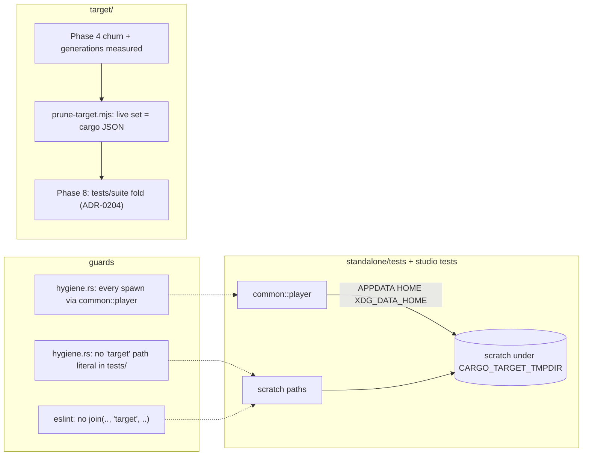

# 0177 — The test tree stops touching the machine and stops costing its disk

> **Status:** in-progress
> **Created:** 2026-09-14
> **Owner skill(s):** `dev`, `studio-builder`
> **Related ADRs:** [0204](../adrs/0204-a-cheap-integration-test-shares-one-binary-and-a-test-that-needs-its-own-stays-its-own.md) (proposed, this plan),
> [0193](../adrs/0193-a-test-that-reads-the-clock-runs-alone.md), [0156](../adrs/0156-the-per-phase-gate-is-scoped-and-the-suite-is-owed-once-per-plan.md),
> [0147](../adrs/0147-the-shared-artifact-store-is-revoked-and-the-linker-stays.md), [0033](../adrs/0033-testing-strategy-coverage-ratchet-and-pre-push-gate.md)
> **Closes:** design-backlog 0181, 0161, 0213, 0179, 0183, 0184, 0182
> **Sequenced after:** [Plan 0174](done/0174-the-clock-reading-tests-run-alone.md) closes. That plan owns
> `.config/nextest.toml`, is editing `standalone/tests/stream_show.rs` and `control_loopback.rs` in the
> main checkout right now, and its Phase 3 adds the `hygiene.rs` guard this plan extends.

## TL;DR

The test suite reaches outside the repository and fills the disk it runs on. This plan fixes both
halves, and each fix carries a guard so the rule stops depending on someone sweeping for it.

- **The machine half.** Four subprocess test files hand the spawned player the developer's real
  per-user data root: `help_cli`, `stream_pipe`, `stream_split` and `shot_cli`. Between them they
  migrate the operator's app directory and append to its `diagnostics.log`. They also read its
  `config.toml` and preset directory as test input, and bind whatever `[control]` port that config
  names. One source file still builds a cargo
  output path from the source tree, and four studio tests do the same.
- **The disk half.** The incremental cache and `deps/` both grow without bound (backlog 0183, 0184),
  and cargo links 59 test binaries where 23 would do (backlog 0182).

Also in scope: one test that compares rows without checking the ruler they were measured against
(backlog 0213), and the one CI gate with no local counterpart, `cargo doc` (backlog 0179).

## Context & problem

Seven backlog entries, all filed by close reviews, one family: **a test or a build step that is
correct on the machine that wrote it and says nothing about any other.**

**The data root, re-derived for this plan, is wider than backlog 0181 says.** `run()` in
`standalone/src/run.rs` answers `--help`, `--schema` and `--check` before `migrate_app_dir()`, so
those spawns are clean. Every other spawn gets past that point, and the data root comes from
`standalone::preset_data_root()` (`standalone/src/lib.rs`): `%APPDATA%` on Windows,
`$HOME/Library/Application Support` on macOS, `$XDG_DATA_HOME` or `~/.local/share` elsewhere.

| file | spawn | reaches |
|---|---|---|
| `help_cli.rs` | `--preset <unknown>` (two cases) | migration, `config.toml` and its `[control]` bind, the preset directory's names |
| `stream_split.rs` | `--preset __no_such_preset_0158__` (every case) | the same as `help_cli` |
| `stream_pipe.rs` | `--stream --sink stdout ...` (three cases) | migration, `config.toml` and its `[control]` bind, `diagnostics.log` |
| `shot_cli.rs` | the `shot` example, in every case without `--presets`/`--preset-file` | the operator's preset directory as test input |
| `stream_show.rs` | already isolated: sets `APPDATA`, `HOME`, `XDG_DATA_HOME` | nothing |

`stream_split` and `shot_cli` are new here. The migration is what backlog 0181 filed, but reading
the operator's `config.toml` is the sharper problem. `run()` binds `config.control` before it refuses
an unknown `--preset` (`standalone/src/run.rs`, `bind_control` ahead of `startup_preset_names`), so
the developer's `config.toml` changes what these tests do, and nobody reading the tests can see it.

**The target directory.** `standalone/tests/stream_show.rs` `scratch()` builds
`CARGO_MANIFEST_DIR/../target/tests/stream-show`, the exact defect backlog 0160 repaired in
`shot_cli.rs` (Plan 0136 Phase 8). Backlog 0161's own text claims no committed violator remains, and
that claim is false. On the studio side, `windowless.test.ts`, `templates.test.ts`, `fields.test.ts`
and `grammar.test.ts` each carry a copy of `join(ROOT, 'target', profile, name)`, and
`templates.test.ts` also writes scratch files under `ROOT/target/tests/`. Since ADR-0147 all of
these resolve correctly **by coincidence**. The rule, *"Never hardcode `<repo>/target` in a script
or a test"* (`.claude/skills/dev/references/project-context.md`), has no carrier.

**The disk.** Backlog 0183 found 8.2 GB across 509 incremental crate-hash directories in one day and
could not say whether that is per tool or per invocation. Backlog 0184 found 13 GB of retained
`deps/` generations under a pinned stable toolchain that has no `cargo clean --gc`. Backlog 0182
priced the per-file links. ADR-0204 records why only a partial fold is available and which files
stay out.

**Two smaller entries.**
- Backlog 0213: `a_horizon_is_reproducible_and_does_not_depend_on_its_own_length` never compares the
  two runs' `ground`, which the horizon report writes as `"ground":[r,g,b]`
  (`standalone/src/shot/horizon.rs`).
- Backlog 0179: `cargo doc --workspace --no-deps` under `RUSTDOCFLAGS: -D warnings` runs in CI
  (`.github/workflows/ci.yml`) and nowhere locally. The comment there excludes it from the hook
  against a "~28 s" budget. That figure is stale: Plan 0174 Phase 1 measured the hook's `-P fast`
  step alone at 398.2 s.

## Decision

Nine phases in two runs: eight `dev` phases, then one `studio-builder` phase. Each defect is fixed
where it lives, and each rule gains a guard in a suite its own lane already runs.

- **Data-root isolation is one helper, and a guard holds every spawn to it.** `standalone/tests/common/mod.rs`
  hands out a `Command` whose `APPDATA`, `HOME` and `XDG_DATA_HOME` all point at a per-call scratch
  directory under `CARGO_TARGET_TMPDIR`. `stream_show` already sets those three. A new
  `core/tests/hygiene.rs` check fails when any file under `standalone/tests/` builds a `Command` for
  `CARGO_BIN_EXE_ritmolux` or the `shot` example outside that helper. We rejected per-file `.env()`
  calls (backlog 0181's proposal): that is the state `stream_show` already had, and it did not stop
  `stream_split` and `stream_pipe` from being written without it.
- **The target rule is carried by two guards in the two lanes' own suites.**
  - Rust: `hygiene.rs` fails on a string literal in any workspace `tests/` source that has `target` as
    a whole path segment. On 2026-09-14 the only such literal is `stream_show.rs`'s. Every other
    `target` inside a test string is prose ("the renderer's configured target").
  - Studio: an `eslint` `no-restricted-syntax` rule in `studio/eslint.config.mjs` rejects a `'target'`
    literal passed to `join`.

  We rejected a new Node gate: `hygiene.rs` already reads files outside `core/` (checks (d) and (e)),
  and a studio rule belongs in the lint the studio lane already runs. We rejected
  `check-comment-hygiene.mjs`, which reads comments and must stay blind to code.
- **Disk is measured, then pruned, then folded, in that order**, because each step's measurement is
  the baseline for the next. The prune is a script, `scripts/prune-target.mjs`. Its live set is
  **what cargo itself reports**: the everyday loop's commands run with `--message-format=json`, and
  every `compiler-artifact` `filenames` entry, fresh or not, is live. Anything in `deps/` not in that
  set goes. We rejected `cargo-sweep`: it is a tool install, and its age heuristic would not see the
  orphaned `lmv_*` class that backlog 0184 names. We rejected an mtime rule because a fresh unit is
  not rewritten, so its mtime is old. We rejected unpinning the toolchain for `-Zgc`.
- **`cargo doc` gets a close-ceremony line now, and a hook step only if it earns one.** The ceremony
  line is architect-owned skill text. The architect lands it when approving this plan, so it is not a
  phase. Phase 7 measures a scoped hook step against a rule stated as a same-kind comparison.

## Architecture diagram

## Implementation phases

### Phase 1 — The spawned player gets a scratch data root

- **Owner skill:** dev
- **What:** `standalone/tests/common/mod.rs` provides the one constructor for a spawned
  workspace binary. It sets `APPDATA`, `HOME` and `XDG_DATA_HOME` to a fresh per-call directory under
  `CARGO_TARGET_TMPDIR`, and the caller adds args, `current_dir` and pipes. `help_cli`,
  `stream_split`, `stream_pipe`, `shot_cli` and `stream_show` spawn through it; `stream_show` drops
  its own three `.env()` calls. `configuration_doc` and `preset_check` spawn only pre-migration queries
  but go through the helper too, so the guard has no exemption list. `shot_cli.rs`'s `shot_bin()` locator moves into
  the helper beside it. `hygiene.rs` gains the check that no file under `standalone/tests/` other
  than `common/mod.rs` names `CARGO_BIN_EXE_ritmolux` or `shot_bin`.
  The module allows dead code, as `core/tests/common/mod.rs` does, because not every file uses every
  helper and `-D warnings` would otherwise fail the build.
- **Files touched:** `standalone/tests/common/mod.rs` (new); `standalone/tests/{help_cli,stream_split,stream_pipe,shot_cli,stream_show,configuration_doc,preset_check}.rs`;
  `core/tests/hygiene.rs` (a new check after Plan 0174's (g)).
- **Done when:**
  - On a machine whose real data root holds a `Ritmolux/` directory, a full `cargo nextest run -p standalone`
    leaves that directory's contents and mtimes unchanged: no migration, no new seeded file, no
    `diagnostics.log` row. Checked by listing the directory with mtimes before and after the run, and
    recorded in the log as the two listings' diff (empty).
  - The guard fails on a seeded copy of today's `stream_pipe.rs` `run` helper (a bare
    `Command::new(env!("CARGO_BIN_EXE_ritmolux"))`), and names the file and line. The negative control
    runs inside the test against an in-memory string, the way (c) and (f) already test themselves.
  - Every standalone test's assertions are unchanged. No test relaxes a `contains` or deletes a case
    to pass under the scratch root. A `shot_cli` case that depended on the operator's preset directory
    is a finding for the log, and the fix is an explicit `--presets presets`, not an exemption.

### Phase 2 — No test source names the target directory

- **Owner skill:** dev
- **What:** `stream_show.rs` `scratch()` roots at `env!("CARGO_TARGET_TMPDIR")`, and its doc comment is
  re-stated to describe that directory. `hygiene.rs` gains the check that no string literal in a
  workspace `*/tests/**/*.rs` has `target` as a whole path segment. Comments are stripped first, with
  the existing `strip_line_comments`.
- **Files touched:** `standalone/tests/stream_show.rs`; `core/tests/hygiene.rs`.
- **Done when:**
  - The guard fails on the pre-phase text of `stream_show.rs` line `.join("../target/tests/stream-show")`
    (seeded as a string in the test) and passes on the tree.
  - It does not fire on any of the prose literals that contain the word, for example `frame_tap.rs`'s
    "the tap sizes itself to the renderer's configured target". The test asserts one of them as a
    negative control.
  - `node scripts/check-backlog-claims.mjs` exits 0. Backlog 0161's probes check `bundle.sh` and
    `build.ps1`, which this phase leaves alone. The entry's "no committed violator" sentence is false
    until this phase lands and true after it, which the close records by archiving the entry.

### Phase 3 — The horizon test reads the ground before the rows

- **Owner skill:** dev
- **What:** In `a_horizon_is_reproducible_and_does_not_depend_on_its_own_length`, the short and long
  runs' `"ground":[..]` values are asserted equal before the prefix comparison. The failure message
  names a ground change, not a statistics change. The doc comment restates the second property in
  `docs/capturing.md`'s conditional form: "while the two runs name the same ground".
- **Files touched:** `standalone/tests/shot_cli.rs` (a `ground_of(json)` helper beside `samples_array`).
- **Done when:** the test still passes on the tree. Swapping the long run's ground literal in a copy
  of its JSON makes the new assertion fail with the ground message before the rows are compared; this
  is checked once by hand and recorded in the log, not committed as a test.

### Phase 4 — Measure what grows in `target/`

- **Owner skill:** dev
- **What:** A measurement, recorded in the log, that decides Phase 6's shape. Start on a checkout
  whose `target/` has just been built by the three everyday commands (`cargo build --workspace`,
  `cargo clippy --workspace --all-targets -- -D warnings`, `cargo nextest run --workspace -P fast --no-run`).
  Count `target/debug/incremental/` crate-hash directories and `target/debug/deps/` files and bytes
  after each of:
  - (a) the same three commands again, with no edit;
  - (b) a one-line edit to `core/src/render/metrics.rs`, then the three commands;
  - (c) the same edit reverted, then the three commands.

  Also record which retained `deps/` stems exceed one generation, and whether an `incremental/`
  directory name can be matched to a live unit in cargo's JSON (see Phase 5).
- **Files touched:** none (the log only).
- **Done when:** the log carries the table and one verdict. **Bounded:** (a) creates no new crate-hash
  directory, and (b) and (c) create at most one per crate the edit dirtied, per tool. **Unbounded:**
  otherwise. On "bounded", Phase 6 documents a periodic delete. On "unbounded", the plan does **not**
  chase the fingerprint defect. Phase 6 still ships the delete, and the defect becomes a new backlog
  entry that cites this table.

### Phase 5 — `prune-target.mjs` deletes what cargo no longer reports

- **Owner skill:** dev
- **What:**
  - **Target directory.** `scripts/prune-target.mjs` resolves the target directory through
    `cargo metadata --format-version 1 --no-deps`'s `target_directory`. That is the rule Phase 2
    guards, and `packaging/macos/bundle.sh` and `packaging/studio/build-studio.ps1` already follow it.
  - **Live set.** It runs the everyday loop's three commands with `--message-format=json` (nextest:
    `--no-run --cargo-message-format json`). The live set is every `filenames` entry of every
    `compiler-artifact` message, fresh or not.
  - **Output.** Without `--apply` it prints what it would delete from `<target>/debug/deps/` and the
    bytes involved; with `--apply` it deletes them. `incremental/` is handled as Phase 4's verdict
    directs.
  - **Documentation.** The script's header states that it needs no other cargo process running in the
    same checkout, and that deleting a live artifact costs a rebuild, never correctness, because
    cargo's fingerprint sees a missing output as dirty.
- **Files touched:** `scripts/prune-target.mjs` (new; a maintenance tool, neither a gate nor a
  renderer); `docs/developing.md` (a short "Disk" section: what grows, the command, how often);
  `CLAUDE.md` (the `scripts/` block, which lists gates and five named renderer exceptions, gains this
  third kind).
- **Done when:**
  - Immediately after `--apply`, re-running the same three commands reports **every**
    `compiler-artifact` as `"fresh": true`. The prune removed nothing the loop needs, and this is the
    property that makes the live set correct.
  - Run on the Phase 4 checkout, it removes every retained generation Phase 4 counted, plus any
    `lmv_*` orphan. The log records bytes before and after.
  - It resolves a `CARGO_TARGET_DIR`-redirected build correctly, checked once by hand and recorded.

### Phase 6 — The incremental cache has a documented bound

- **Owner skill:** dev
- **What:** Whatever Phase 4 decided for `incremental/`. At minimum, `docs/developing.md`'s Disk
  section names the directory, the measured growth, and the delete that bounds it: removing
  `target/debug/incremental` costs one non-incremental rebuild and nothing else. If Phase 4 found a
  sound mapping from a crate-hash directory to a live unit, `prune-target.mjs` prunes unmapped
  directories as well, under the same freshness done-when as Phase 5.
- **Files touched:** `docs/developing.md`; optionally `scripts/prune-target.mjs`.
- **Done when:** the Disk section's figures are Phase 4's and name the machine and date. If the script
  gained the arm, Phase 5's freshness property holds with it enabled.

### Phase 7 — A scoped `cargo doc` earns a hook step, or is rejected with its measurement

- **Owner skill:** dev
- **What:** Measure `cargo doc -p rlx-core --no-deps` under `RUSTDOCFLAGS=-D warnings`:
  1. **Coverage.** In a scratch copy, make a private item that a public item's intra-doc link names,
     which is Plan 0137's class. Confirm the scoped command fails on it.
  2. **Cost.** Time the scoped command and the hook's own `clippy` step on the same one-line
     `core/src/render/metrics.rs` edit, in the same session, warm.

  **Adopt** the step into `.githooks/pre-push`, after `clippy`, if and only if (1) holds **and** its
  warm one-edit cost does not exceed the `clippy` step's on the same edit. Both numbers are seconds
  of a gate step on one machine in one session. Otherwise **reject**. Either way, the `ci.yml` comment
  that cites "~28 s" is re-stated with the measured figures.
- **Files touched:** `.githooks/pre-push` (if adopted); `.github/workflows/ci.yml` (the comment);
  `docs/developing.md` (the hook's step table, if adopted).
- **Done when:** the log carries both timings and the verdict. If adopted, the hook's step table in
  `docs/developing.md` lists the step. `standalone`'s public surface is named in the ci.yml comment as
  what a `-p rlx-core` step does not cover.

### Phase 8 — The cheap tests share one binary per package

- **Owner skill:** dev
- **What:** ADR-0204's fold.
  1. **Re-derive the kept set at this phase** from `.config/nextest.toml` (every `binary()` in
     `default-filter` and in every override), a grep for `clippy::disallowed_methods` in `*/tests/*.rs`,
     and the process-level rule. Do not copy it from the ADR: Plan 0174's verdict may have moved
     `stream_show` and `control_loopback` into the override by then.
  2. **Fold** every other file into `core/tests/suite/` and `standalone/tests/suite/` as modules of a
     `main.rs`, with `common` reached by `#[path]`. Use `git mv`, so history follows the file.
  3. **Widen** ADR-0193's `hygiene.rs` guard: a `clippy::disallowed_methods` exemption anywhere under a
     `tests/suite/` fails.
  4. **Rewrite** every live citation of a folded target. That means `--test <name>` in `docs/`,
     `.claude/skills/`, `.githooks/`, `.github/`, and in assertion messages and module headers inside
     both crates; closed plans stay as written.
- **Files touched:** `core/tests/**`, `standalone/tests/**` (moves); `core/tests/hygiene.rs`;
  `docs/testing.md`; `docs/developing.md`; `CLAUDE.md` (the "46 test binaries" count in the
  debug-info section, made count-free); every citing file the grep finds.
- **Done when:**
  - **The same tests run.** `cargo nextest list --workspace` names the same set of test functions
    before and after, once the module prefix and binary name are stripped. So does
    `cargo nextest list --workspace -P fast`: the fast tier selects exactly what it selected before.
    Both diffs are empty.
  - **ADR-0193's override selects the same tests**, by the same list comparison restricted to that
    override's filter.
  - **The engine-edit loop is not slower.** `cargo nextest run --workspace -P fast --no-run` after
    the one-line `metrics.rs` edit takes no longer after the fold than before, measured back to back
    in one session. The per-file-edit case (touching one folded test file) is measured and reported,
    not gated: ADR-0204 names it as the price. **If the engine-edit case is slower, revert the fold
    in this phase** and record both measurements for ADR-0204's `Outcome`.
  - The log records test-binary counts before and after, and `deps/` `.exe`/`.pdb` bytes for one
    generation before and after.
  - `grep -rn -- "--test <folded name>"` over the live docs, skills, hook, workflows and both crates
    returns nothing for any folded target.

### Phase 9 — The studio tests ask cargo where the player is

- **Owner skill:** studio-builder
- **What:** One test-only helper resolves the built player: `CARGO_TARGET_DIR` if set, else
  `cargo metadata --format-version 1 --no-deps`'s `target_directory`, cached for the run, then
  `release` before `debug`. When cargo is not on `PATH` it skips with a notice, in ADR-0016's shape,
  as these tests already do when there is no build. The four duplicated `builtPlayer`/`schemaDocument`
  lookups use it. `templates.test.ts`'s scratch directory moves to `mkdtempSync` under `os.tmpdir()`.
  `studio/eslint.config.mjs` gains a `no-restricted-syntax` rule rejecting a `'target'` literal
  argument to `join`.
- **Files touched:** a helper beside the tests (for example `studio/shared/testing/player.ts`);
  `studio/electron/player/windowless.test.ts`; `studio/shared/{templates,fields,grammar}.test.ts`;
  `studio/eslint.config.mjs`.
- **Done when:** the studio's lint fails on a seeded `join(ROOT, 'target', 'debug', name)` and passes
  on the tree. The four tests find the player on a normal checkout, and find it under
  `CARGO_TARGET_DIR` pointed at a copied build, checked once by hand and recorded. The studio's
  typecheck, lint and vitest run pass.

## Risks & open questions

- **Plan 0174 moves the ground under Phases 1, 2 and 8.** It is live in `stream_show.rs` and
  `control_loopback.rs`, owns `.config/nextest.toml`, and adds `hygiene.rs` check (g). This plan
  starts only after 0174 closes, and Phase 8 re-derives its set for exactly this reason. If 0174's
  diagnosis files a control-path backlog entry and leaves `stream_show` on the guard's exemption list,
  ADR-0204's rule 2 still keeps it separate.
- **The scratch data root could change a test's meaning, not just its side effects.** A
  `stream_split` or `stream_pipe` case that silently relied on a seeded preset directory would now see
  an empty one. The case must be made explicit rather than exempted from the helper. CI already runs
  with an empty data root, so CI is the evidence that no case needs the operator's.
- **`HOME` pointed at a scratch directory on macOS** also moves anything else the child reads from
  `HOME`. `stream_show` already does this on the macOS CI arm without incident, which is the precedent.
- **The hook is already slow.** Plan 0174 Phase 1 took `-P fast` from 244.5 s to 398.2 s. Phase 7's
  rule does not reach for the hook's total budget, because that budget is no longer the ~28 s the
  comment says. It asks only that a doc step cost no more than the lint step beside it.
- **`--message-format=json` on nextest.** The flag spelling (`--cargo-message-format`) is from
  nextest's documentation, not tried here. If nextest does not forward artifact messages, the script
  runs `cargo test --workspace --no-run --message-format=json` for that leg, which builds the same test
  units.
- **The fold's module prefix can break an anchored name filter.** None exists at HEAD, and the list
  comparison in Phase 8's done-when is what catches one.

## What this plan does NOT do

- **It does not add the Linux data-root arm to anything.** The helper sets `XDG_DATA_HOME` because
  `preset_data_root` reads it. Plan 0120 carries the Linux capture and packaging, and its own test
  isolation on `ubuntu-latest`.
- **It does not isolate the studio's spawned players' data root.** `windowless.test.ts` and
  `templates.test.ts` already clear it (backlog 0181's 2026-09-14 update). Phase 9 changes only how
  they find the binary.
- **It does not chase an incremental-fingerprint defect** if Phase 4 finds one. That becomes a new
  backlog entry.
- **It does not add `cargo doc` to `dev`'s per-phase gate**, and it does not document `standalone`.
- **It does not unpin the toolchain, adopt `cargo-sweep`, or set `CARGO_INCREMENTAL=0`** anywhere.
- **It does not touch the two archived `renders/` scripts** from backlog 0161. They are gitignored
  and exist in no checkout.
- **It does not fold the nine GPU suites, the cost probes or any clock reader** (ADR-0204 rules 1-3).

## Implementation log

> Written by `dev` — one row per phase as that phase's commit lands, and the close block after the
> last one. **The phases above are the contract; everything here is what happened.**
> **Observations, never conclusions:** this says where to look, architect decides how it went.
> No per-criterion pass list, no self-assessment, no narrative — but a deviation from the plan or
> an unmet done-when is always disclosed. Stays shorter than `## Implementation phases` above.

**Lane:** `C:\Users\Igor Konovalov\WORK\rlx-plan-0177`, branch `plan-0177-the-test-tree-stops-costing-disk-and-touching-the-machine` (conductor run)

| phase | owner | state | commit |
|---|---|---|---|
| 1 — The spawned player gets a scratch data root | dev | done | feff21c |
| 2 — No test source names the target directory | dev | done | 3510ab9 |
| 3 — The horizon test reads the ground before the rows | dev | done | 11636f2 |
| 4 — Measure what grows in `target/` | dev | done | 375f275 |
| 5 — `prune-target.mjs` deletes what cargo no longer reports | dev | done | d9aee86 |
| 6 — The incremental cache has a documented bound | dev | done | 227bb8d |
| 7 — A scoped `cargo doc` earns a hook step, or is rejected | dev | done | committed with this row |
| 8 — The cheap tests share one binary per package | dev | not started | |
| 9 — The studio tests ask cargo where the player is | studio-builder | not started | |

### Notes

- **Phase 1, data root.** `%APPDATA%\Ritmolux` (158 entries) listed with size and mtime before and
  after `cargo nextest run -p standalone --no-fail-fast` (411 passed, 0 skipped): the two listings
  are byte-identical, so the diff is empty. No `shot_cli` case needed `--presets presets` added.
- **Phase 1, helper shape.** `common` exposes `player()`, `player_with_data_root(root)`, `shot()` and
  `shot_executable()`. `stream_show` spawns through `player_with_data_root`, passing an empty path
  where it tests the unresolved data root, as it did before. `shot_executable()` exists because
  `an_encoder_that_dies_reports_the_encoders_own_failure` hands the example's path to `shot` as its
  stand-in encoder.
- **Phase 2, deviation: comments are not stripped with `strip_line_comments`.** It cuts a line at a
  `//` inside a string literal (`"//"` in `show_is_the_only_owner.rs`, `preset.rs`, milkconv's
  `conformance.rs` and `hygiene.rs` itself), which flips which side of a quote the literal scan is
  on for the rest of the file. `string_literals` in `hygiene.rs` reads `//`, `/* */`, strings, raw
  strings and char literals in one pass instead. `hygiene.rs` spells the segment `tar\x67et` in its
  own seeds and in the matcher, because the guard scans that file too.
- **Phase 2.** `check-backlog-claims.mjs` exits 0.
- **Phase 3, hand check.** With the long run's JSON rewritten to `"ground":[250,1,250]` the test
  failed at the new assertion, `left: "\"ground\":[0,0,0]"`, `right: "\"ground\":[250,1,250]"`, with
  the ground-change message; the rewrite was removed and `shot_cli` ran 28 passed, 0 skipped.
- **Phase 4, table.** This lane, 2026-09-15, Windows reference machine. `inc` = crate-hash
  directories in `target/debug/incremental/`; the edit is `STRUCT_GRID: usize = 32` -> `16 + 16`
  in `core/src/render/metrics.rs`. Row 0 is the three commands on a lane whose earlier phases had
  run only `-p standalone`, `-p rlx-core --test hygiene` and clippy.

  | step | tool | s | inc dirs (new) | inc GB | deps files | deps GB |
  |---|---|---|---|---|---|---|
  | 0 | build / clippy / nextest | 3.4 / 0.6 / 44.2 | 111 (3) / 111 (0) / 171 (60) | 1.14 / 1.14 / 1.95 | 918 / 918 / 1098 | 1.62 / 1.62 / 3.38 |
  | a | build / clippy / nextest | 0.3 / 0.5 / 1.4 | 171 (0) each | 1.95 | 1098 | 3.38 |
  | b | build / clippy / nextest | 6.0 / 13.3 / 33.0 | 171 (0) each | 2.20 / 2.68 / 3.62 | 1098 | 3.38 |
  | c | build / clippy / nextest | 4.1 / 7.6 / 67.4 | 171 (0) each | 3.61 / 3.61 / 3.59 | 1098 | 3.38 |

  The `incremental/` bytes grow inside existing directories: every crate-hash directory held at most
  two session directories after (b), and three further edit/revert cycles of clippy then build left
  171 directories, 332 sessions, at most 2 per directory and 3.593 GB, flat. An edit that keeps a
  unit's metadata hash rewrites its `deps/` files in place, so (b) and (c) left the `deps/` count
  at 1098.
- **Phase 4, retained `deps/` generations.** Grouping `deps/` names by stem with the hash removed
  gives 330 stems with two hashes, every one a check-versus-build or lib-versus-test pair, so a name
  count is not a generation count. Counted instead against the loop's reported live set (the Phase 5
  script's dry run on this checkout): 24 files, 184.0 MB, a second `rlx_core`, `wgpu`, `wgpu_core`,
  `wgpu_hal`, `windows`, `gpu_allocator` and `hygiene` generation left by the narrowed `-p` runs.
  No `lmv_*` file exists in this lane.
- **Phase 4, incremental mapping.** No sound mapping: a crate-hash directory is named
  `<crate>-<base-36 id>` (`rlx_core-05p4fmhnlotwc`), `deps/` carries the 16-hex metadata hash
  (`librlx_core-347eded4b592ce55.rlib`), and no field of a `compiler-artifact` message names the
  former.
- **Phase 4, verdict: bounded.** (a) created no crate-hash directory, and (b) and (c) created none
  per tool.
- **Phase 5.** `--apply` on the Phase 4 checkout: `deps/` 1098 files, 3226.1 MB before; 24 files,
  184.0 MB deleted (the 24 Phase 4 counted); 1074 files, 3042.1 MB after. `--verify-fresh` straight
  after: 637 of 637 artifacts fresh. nextest's `--cargo-message-format json` forwards the artifact
  messages, so the `cargo test` fallback in Risks was not needed.
- **Phase 5, redirect check (by hand).** Run with `CARGO_TARGET_DIR=C:/Users/IGORKO~1/WORK/rlx-plan-0177/target`
  (the same directory under its 8.3 spelling, so nothing rebuilt): the script read
  `C:\Users\IGORKO~1\...\target\debug\deps` from `cargo metadata`, matched all 637 reported
  artifacts, and found 0 files to delete. A redirect to a physically different directory was not
  tried, because it costs a cold build of the workspace into it.
- **Phase 5, matching rule the plan did not state.** A `deps/` file is live when its 16-hex metadata
  hash is the hash of a reported file, so a live `.exe` keeps its `.pdb` and `.d`. A reported file
  outside `deps/` is matched to its `deps/` source by hard-link identity, else by content; on MSVC a
  binary's source is the unhashed `deps/ritmolux.exe`. An unmatched report stops the script.
- **Phase 6.** No script arm: Phase 4 found no mapping. The Disk section documents the delete, with
  Phase 4's figures, the machine and the date.
- **Phase 7, deviation: the adopted step is `cargo doc -p rlx-core --no-deps --features text`.** The
  command the phase names exits 101 **on the unmodified tree**: `core/src/render/preview.rs:10` links
  `super::aux_target`, which exists only with the `text` feature, and `-p rlx-core` alone leaves it
  off while the workspace build turns it on. `text` is rlx-core's only feature.
- **Phase 7, coverage (in-tree, restored after, not a scratch copy).** A `/// See [`STRUCT_GRID`].`
  line on the public `frame_diff` made both commands fail with
  `public documentation for frame_diff links to private item STRUCT_GRID`.
- **Phase 7, cost.** Warm, same session, the `STRUCT_GRID` one-line edit applied and reverted over
  three rounds, clippy then doc each round. With `--features text`: clippy 6.35 / 6.56 / 7.82 s, doc
  4.47 / 5.95 / 5.49 s (all exit 0). Without it: clippy 6.34 / 6.38 / 6.34 s, doc 3.16 / 3.13 / 3.15 s
  (every doc run exit 101). Verdict: adopted, after `clippy` in `.githooks/pre-push`.
- **Followup noticed, not acted on:** the `preview.rs` link above is broken in every build without
  `text` (the core test suite and the plugin's), and CI's `cargo doc --workspace` cannot see it
  because feature unification turns `text` on.

### Close triggers

- **`presets/` touched:**
- **Plan header `Closes:`**
- **What shipped:**
- **Operator docs touched:**
- **Backlog probes (`node scripts/check-backlog-claims.mjs`):**
- **Full suite:**
- **Outstanding `human` phases:**

## Followups (after this lands)
