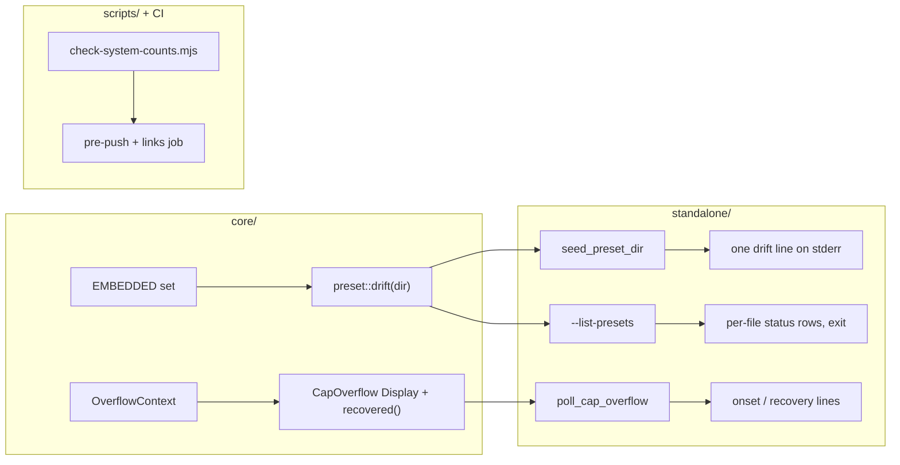

# 0178 — What the operator reads is true

> **Status:** in-progress (2026-09-14)
> **Created:** 2026-09-14
> **Owner skill(s):** `dev`, `human`
> **Related ADRs:** [0202](../adrs/0202-a-written-count-of-the-systems-is-refused-by-a-gate.md) (proposed), [0007](../adrs/0007-line-geometry-generators.md), [0162](../adrs/0162-the-application-is-renamed-to-ritmolux.md), [0022](../adrs/0022-build-time-preset-embedding.md)
> **Closes:** design-backlog 0172, 0185, 0207, 0208; carries the diagnosis of 0203

## TL;DR

This plan fixes five things an operator or contributor reads that are false, stale or silent. Each is
small, and they share one property: nothing currently catches them.

1. **Preset directory drift.** The per-user preset directory drifts from the shipped set and can hold
   two presets under one name. It now says so in one startup line, and a new `--list-presets` flag
   shows the whole set with each file's status. Nothing is ever deleted.
2. **The `--help` banner** calls the product `ritmolux`.
3. **The cap-recovery line** calls every recovery "geometry", and three of the five contexts are not
   geometry.
4. **Written counts of the systems** go stale with every new system. A gate now refuses them
   (ADR-0202), and the counts in the repository's own gate inventory are rewritten without numbers.
5. **Backlog 0203** is settled on the machine where it happened. A code reading below shows there is
   no silent fallback to explain it.

## Context & problem

**Backlog 0172: the seeded directory.** `preset::seed_dir` (`core/src/preset/mod.rs:68`) writes a
shipped file only `if !path.exists()` and never removes one. That is right: it must never overwrite
an operator's edit. But it has no counterpart. Three kinds of drift build up without anyone noticing:

- files the shipped set no longer has;
- shipped files whose copy is older than, or edited away from, the shipped one. A retune upstream
  never reaches an install that already has the file;
- two files under one display name.

`Renderer::select_preset_by_name` takes the first exact match (`core/src/render/roster.rs:736`), so
the second preset of a name cannot be reached by name. When 0172 was filed, the development box held
118 files against 81 shipped, two of them named `Coral`. `stream.rs:784` even tells the operator
*"--list-presets is not a flag"*.

**Backlog 0185: the banner.** `standalone/src/cli.rs:243` reads
`"ritmolux — a real-time music visualizer\n\nusage: ritmolux [flags]"`. The first token is the
product name, which ADR-0162 capitalises. The second is the binary name, which stays lower-case.
`standalone/src/settings/tests.rs:26` still carries `Roaming\ritmolux\presets`.

**Backlog 0207: the recovery line.** `AppState::poll_cap_overflow` (`standalone/src/app_state.rs:886`)
prints the onset through `CapOverflow`'s `Display`. That speaks for each context in its own words
(`core/src/render/scenes/mod.rs:567`). The recovery, though, is one hardcoded string:
`"geometry is back within the segment cap"` (`app_state.rs:894`). `OverflowContext` has five
variants, and `Iterations`, `Grid` and `Radius` are clamps of a structural parameter, not geometry.

**Backlog 0208: counts in prose.** ADR-0202 carries the 2026-09-14 sweep: 11 matches across 9 files
outside the dated records, from stale roster totals to one false positive. The gate inventory itself
suffers the same drift with a different noun. `CLAUDE.md:153` reads *"Nine Node gates. SEVEN run by
pre-push"*, `README.md:73` *"the seven Node gates"*, and `ci.yml:246` *"And the seventh"*. This plan
adds a gate, and Plans 0166 and 0176 each add another.

**Backlog 0203: the microphone capture.** The Sep 10 smoke run captured from `Microphone Array`, and
the owner does not remember whether `[input] mode` said `line-in`. **Reading the code on 2026-09-14
finds no fallback that could have chosen it:**

- `start_capture` (`standalone/src/capture_start.rs:320`, Windows arm) makes one `capture_win::start` with the
  resolved mode. On an error it renders without audio, with a `failed` verdict. It never tries a
  second mode.
- `dataflow` (`capture_win.rs:300`) maps loopback to `eRender` and nothing else.
- A line-in capture is reachable from exactly three places:
  - the `--input` flag;
  - `config.toml`'s `[input]` section;
  - the settings overlay's **Input mode** row, where one right-arrow press sends
    `SetInputMode(LineIn)` (`standalone/src/settings.rs:332`). `set_input_mode` restarts capture with
    `Persist::Yes` (`app_state.rs:1487-1497`), so it writes `line-in` to `config.toml` for every
    later launch, the studio's player included.
- When the source is not the default, the startup line already says which it was:
  `audio input line-in on 'default' by config.toml` (`standalone/src/run.rs:590`).

So the likely explanation is an Input mode row nudged during an earlier session and persisted. A
silent fallback is not a candidate. What is left is confirming it on the device.

## Decision

- **Preset drift: report it, never prune.** Core gains a pure `preset::drift(dir)` over the directory
  and `EMBEDDED`. The standalone prints one line after seeding, only when something drifted, and adds
  `--list-presets`: one row per preset the launch would load, with its status. Both are human
  diagnostics. No event is added, so spec 0003 does not widen.
  - **Rejected: pruning retired files.** The directory is one the operator is invited to edit, so
    deleting from it eats their work (backlog 0172's own argument).
  - **Rejected: overwriting stale shipped copies.** Same reason.
- **The recovery line renders from core, beside the onset.** A `CapOverflow::recovered()` adapter
  matches on `OverflowContext` exhaustively, so a sixth variant cannot compile without choosing its
  own sentence. All user-visible cap text stays in the one file whose comment already declares it
  user-visible.
  - **Rejected: a `match` in `app_state.rs`.** It would split the onset and recovery wording across
  two crates.
- **Counts: ADR-0202's gate**, plus rewriting the gate inventory without numbers by hand. The
  inventory is a different noun, and ADR-0202 deliberately does not extend its grammar to it.

## Architecture diagram

## Implementation phases

### Phase 1 — The preset directory reports its drift

- **Owner skill:** dev
- **What:** `rlx_core::preset::drift(dir: &Path) -> DriftReport`, pure over the directory listing and
  `EMBEDDED`. For each `*.toml` it gives one status:
  - `Shipped`: the name is in `EMBEDDED` and the bytes are equal;
  - `Differs`: the name is in `EMBEDDED` and the bytes differ, an edit or an older shipped copy.
    The two cannot be told apart, and the line says so;
  - `NotShipped`: the name is not in `EMBEDDED`.

  It also gives each display name claimed by more than one file that compiles, and names the
  winning file: the first in filename order, which is the order `load_dir` sorts and
  `select_preset_by_name` takes. `seed_preset_dir` (`standalone/src/preset_dir.rs:87`) prints one
  line after seeding, **only when any drift is present**, naming the `Differs` and `NotShipped`
  counts, each duplicate name, and `--list-presets` as where to read the rows. It runs only in the `PresetDir::Default` arm. An `RLX_PRESET_DIR` override is the
  operator's own directory, often the repository's `presets/`, and seeding never touches it either.
- **Files touched:** `core/src/preset/mod.rs` (the function, the report type, and unit tests beside
  `seed_dir_writes_all_then_nothing`); `standalone/src/preset_dir.rs`.
- **Done when:**
  - A core test seeds a temp directory, then edits one shipped file, adds one unshipped file, and adds
    a second file whose `name` duplicates a shipped preset. `drift` reports exactly one `Differs`, one
    `NotShipped` and one duplicate name, with the winning file identified.
  - A freshly seeded, untouched directory reports all `Shipped`, no duplicates, and **no line
    printed**. Pin that by testing the line's formatter on an empty report: it returns `None`.
  - The seeding path still never writes over an existing file: `seed_dir_writes_all_then_nothing`
    is unchanged and green.

### Phase 2 — `--list-presets` shows the set a launch would load

- **Owner skill:** dev
- **What:** A new valueless flag in `FLAGS` (`standalone/src/cli.rs:76`), dispatched in
  `standalone/src/run.rs` beside `--list-devices` and `--list-adapters` (`run.rs:491`). It resolves
  the directory the way `startup_preset_names` (`preset_dir.rs:70`) does, **without seeding**, and
  prints on stderr like its siblings.
  - Each preset in the set the launch would hold gets one row: display name, file name, and the
    Phase 1 status, with a duplicate marker where one applies.
  - Files that fail to compile are listed after the rows, with their errors.
  - An empty or unresolved directory lists the embedded set, all `Shipped`, and says that is what it
    is.

  The flag exits 0. `stream.rs:784`'s message now points at `--list-presets`, and the windowed
  unknown-`--preset` refusal (`run.rs:670-676`) names the flag after its roster. The prose-scanner
  test comment at `cli.rs:1353` loses the example it cites.
- **Files touched:** `standalone/src/cli.rs`; `standalone/src/run.rs`; `standalone/src/stream.rs`;
  `standalone/tests/help_cli.rs`; `docs/configuration.md` (the flag table and a short paragraph beside
  `--list-adapters`'); `docs/running.md` if it describes the preset directory's contents.
- **Done when:**
  - A `help_cli.rs` case spawns `--list-presets` with `RLX_PRESET_DIR` pointed at a temp directory
    holding one unshipped file and one duplicate name. It exits 0 and its stderr names both statuses
    and the duplicate. The subprocess must not read or write the developer's real data root, which
    is the class backlog 0181 records, so the case sets that root to scratch as well.
  - `--help` lists `--list-presets`, and the existing roster/scanner consistency tests in `cli.rs`
    pass. The flag is in `FLAGS` and in the scanner.
  - `grep -n "is not a flag" standalone/src/stream.rs` matches nothing.

### Phase 3 — The banner and the recovery line say what is true

- **Owner skill:** dev
- **What:** Two console lines.
  - **Backlog 0185:** the banner's first token becomes `Ritmolux`. `usage: ritmolux [flags]` stays
    lower-case, because it is the binary name. `settings/tests.rs:26`'s fixture path becomes
    `Roaming\Ritmolux\presets`.
  - **Backlog 0207:** `CapOverflow` gains `recovered()`, a `Display` adapter over the overflow that
    last bit. `poll_cap_overflow`'s `(Some(prev), None)` arm prints
    `preset '{}': {prev.recovered()}`. The wording per context mirrors the onset's own terms:
    - `Mirror`/`Depth`: geometry is back within the `{cap}`-segment cap;
    - `Iterations`: the iteration budget;
    - `Grid`: the grid;
    - `Radius`: the neighbourhood.

    Each is back within this tier's cap of `{cap}`. The comment at `scenes/mod.rs:536` ("user-visible
    text ... the shell prints verbatim") covers the new adapter too.
- **Files touched:** `standalone/src/cli.rs`; `standalone/src/settings/tests.rs`;
  `standalone/tests/help_cli.rs`; `core/src/render/scenes/mod.rs`; `standalone/src/app_state.rs`.
- **Done when:**
  - `help_prints_the_roster_and_exits_zero` (or a sibling) asserts the first stderr line starts with
    `Ritmolux — `, and the usage line still reads `usage: ritmolux [flags]`.
  - A core test builds one `CapOverflow` per `OverflowContext` variant and asserts that each
    `recovered()` text contains its own context's word. `Iterations`, `Grid` and `Radius` must not
    contain `segment` or `geometry`. The match has no wildcard arm, so a new variant fails to compile.
  - `grep -n "geometry is back within the segment cap" standalone/src/app_state.rs` matches nothing.

### Phase 4 — A written count of the systems cannot land

- **Owner skill:** dev
- **What:** `scripts/check-system-counts.mjs`, exactly as ADR-0202 decides it: the match, the
  threshold of five, the scope and its exclusions, fenced code skipped, the `count-allow: <reason>`
  escape, `file:line  <text>` output and the `root` argument. The header comment carries the mechanism
  and cites ADR-0202 by bare number.
  - Add `scripts/fixtures/system-counts/`, seeded, with its expected exact break count, and a section
    in `scripts/fixtures/README.md`. The repository walks in the existing checkers skip
    `scripts/fixtures` by path, so this tree is added to this script's own skip.
  - Wire it into `.githooks/pre-push` and the CI `links` job.
  - Repair every instance the first run reports. Rewrite each count-free where the sentence survives
    without it (ADR-0202's Context table lists the 2026-09-14 set). Use `count-allow:` only where the
    number is not a roster count (`core/tests/hygiene.rs:642`) or is a dated record inside a live
    document that must keep it.
  - **Rewrite the gate inventory without numbers:** the `scripts/` paragraph in `CLAUDE.md`, the
    `scripts/` line in `README.md`, `ci.yml`'s ordinal comments in the `links` job ("And the fifth",
    "And the seventh"), the opening of `scripts/fixtures/README.md` ("Eight checkers"), and the
    pre-push step list in `docs/developing.md` if it counts.
- **Files touched:** `scripts/check-system-counts.mjs` (new); `scripts/fixtures/system-counts/`
  (new); `scripts/fixtures/README.md`; `.githooks/pre-push`; `.github/workflows/ci.yml`; `CLAUDE.md`;
  `README.md`; `docs/developing.md`; `core/src/render/scenes/common.rs`; `core/src/render/evaluate.rs`;
  `core/src/render/scenes/warp_mesh/mod.rs`; `core/tests/sanity.rs`; `core/tests/hygiene.rs`;
  `docs/content-brief.md`; `presets/proposed/ROSTER.md`; `.claude/skills/preset-author/SKILL.md`;
  whatever else the first run names.
- **Done when:**
  - `node scripts/check-system-counts.mjs` exits 0 on the tree.
  - `node scripts/check-system-counts.mjs scripts/fixtures/system-counts` exits 1 with exactly the
    break count the fixture README states. The fixture includes:
    - a numeral case and a number-word case;
    - a two-word-gap case (`the other ten systems`), which must break;
    - `four systems` and `file systems`, which must not break;
    - a `count-allow:` line, which must not break;
    - a match inside a fenced block, which must not break;
    - a `.rs` string-literal match, which must break.
  - `grep -rniE "\b(nine|seven|eight|six|five) (node )?gates\b" CLAUDE.md README.md .github/workflows/ci.yml`
    matches nothing.
  - `cargo nextest run --workspace` moves no golden, because comment and message text is all this
    phase touches in Rust. `common.rs:366`'s assertion message must still read truthfully when it
    fires.
  - Every other gate at pre-push and in the `links` job still exits 0.

### Phase 5 — The microphone capture is settled on the machine it happened on

- **Owner skill:** human
- **What:** Confirm backlog 0203's remaining half against the code reading in Context. On the
  development machine:
  1. Set `[input] mode = "loopback"` in `config.toml`, launch the player, and read the startup stderr.
     No `audio input … by config.toml` line should appear. F3's verdict should name a render endpoint.
  2. Disable the default render endpoint in Windows Sound settings, which makes loopback unable to
     start, and launch again. **Expected from the code:** the `audio capture unavailable` line and a
     `failed` verdict, **never** a `live … Microphone Array` verdict.
  3. Re-enable the endpoint. Open the settings overlay, press right on **Input mode**, close the app,
     and check `config.toml`, which should now read `line-in`. Set it back.
- **Files touched:** none in the repository. The machine's `config.toml`, restored.
- **Done when:** the three observations are recorded in this plan's log.
  - If step 2 shows no fallback and step 3 persists `line-in`, backlog 0203 closes at the review as
    "a persisted overlay choice or config, not a defect".
  - **If step 2 shows a microphone verdict**, the code reading is wrong. That is a new backlog entry
    about capture start, and 0203 stays live.

## Risks & open questions

- **Three plans edit the gate inventory.** Plan 0176 adds `check-release-tag.mjs`, Plan 0166 adds a
  translation gate, and this plan adds a count gate and removes the numbers. **This plan lands last of
  the three** so the inventory it rewrites is final. If it cannot, Phase 4's count-free wording still
  holds, because it names no number for the next gate to break.
- **Phase 1's drift line may be noisy on a long-lived install.** It fires every launch until the
  operator acts, and `Differs` will be large on a machine that has tracked many retunes, by design.
  The line is one line and names `--list-presets`. If the owner finds it unbearable, the fallback is
  printing it only when the counts change since the last launch, which needs persisted state and is
  not built here.
- **`Differs` cannot tell an operator's edit from an outdated shipped copy.** Telling them apart would
  need a manifest of every past shipped version's hash, and this plan does not build one. The status
  name and `--list-presets`' legend say so.
- **The studio shows the player's stderr.** A new human line is additive, and spec 0003 requires human
  diagnostics to be byte-identical with and without `--events`. Nothing parses them, so no protocol
  changes. A studio-visible drift report would be a spec 0003 widening, and is out of scope.
- **ADR-0202's threshold is argued, not derived.** A legitimate cohort of five or more needs an allow
  marker. The Phase 4 run shows how many exist, and if the count is large the threshold is wrong and
  goes back to the architect, not to the allow list.
- **Three backlog probes go red on delivery, by design.** Backlog 0185's probe matches the lower-case
  banner string, 0207's the hardcoded recovery sentence, and 0208's `twelve systems` in `common.rs`.
  Phases 3 and 4 remove all three. `dev` reports the red exit in the log and leaves the entries
  alone; correcting and archiving them is architect's work at the close. 0172's probe
  (`if !path.exists()`) must stay **green**, because a red one means seeding changed.
- **Phase 5 changes a Windows sound setting.** Restore it. A tester's machine is not the place to run
  it.

## What this plan does NOT do

- **It never prunes, overwrites or migrates** a file in the preset directory.
- **It adds no event, OSC address or studio surface** for drift or for the list.
- **It does not change what the settings overlay's Input mode row persists.** Persisting an
  operator's choice is by design. Phase 5 only confirms that it explains 0203.
- **It does not extend ADR-0202's grammar** to other nouns (gates, presets, zips). The gate inventory
  is made count-free by hand.
- **It does not touch Plan 0120's count-free rewording** of platform counts. That plan carries it for
  its own docs.

## Implementation log

> Written by `dev` — one row per phase as that phase's commit lands, and the close block after the
> last one. **The phases above are the contract; everything here is what happened.**
> **Observations, never conclusions:** this says where to look, architect decides how it went.
> No per-criterion pass list, no self-assessment, no narrative — but a deviation from the plan or
> an unmet done-when is always disclosed. Stays shorter than `## Implementation phases` above.

**Lane:** `C:\Users\Igor Konovalov\WORK\rlx-plan-0178` on branch `plan-0178-what-the-operator-reads-is-true`

| phase | owner | state | commit |
|---|---|---|---|
| 1 — The preset directory reports its drift | dev | done | a20bc34a |
| 2 — `--list-presets` shows the set a launch would load | dev | done | 2fd42a7d |
| 3 — The banner and the recovery line say what is true | dev | done | committed with this row |
| 4 — A written count of the systems cannot land | dev | not started | |
| 5 — The microphone capture is settled on the machine it happened on | human | not started | |

### Notes

- **Phase 1, the drift fixture.** Phase 1's first `Done when` bullet describes three mutations
  (edit a shipped file, add an unshipped file, add a second file duplicating a shipped name) and
  then asserts "exactly one `Differs`, one `NotShipped` and one duplicate name". Three mutations
  give two `NotShipped`, because any added file is by definition not in `EMBEDDED`. The test
  `drift_reports_an_edit_an_extra_file_and_a_duplicate_name` makes the counts hold: one edited
  shipped file, and one added file that is both the unshipped one and the duplicate claimant.
- **Phase 1, where the line's subject lives.** `DriftReport::line()` returns the summary **without**
  a leading `preset directory:`; `seed_preset_dir` prints that prefix. A shell diagnostic beginning
  with an interpolation fails `stream_split::no_human_diagnostic_line_can_begin_with_a_brace`, and
  the alternative was an entry in that test's `MESSAGE_PLACEHOLDERS`, outside the phase's files.
- **Phase 2, `docs/running.md` untouched.** Phase 2 lists it conditionally ("if it describes the
  preset directory's contents"). It does not mention presets at all.
- **Phase 2, where the printer lives.** `list_presets_and_exit` and its two helpers are in
  `standalone/src/run.rs`, beside `list_adapters_and_exit`, which is where the phase places the
  dispatch; `standalone/src/preset_dir.rs` is unchanged by this phase.
- **Phase 3, the banner assertion is on stdout.** Phase 3's first `Done when` asks
  `help_prints_the_roster_and_exits_zero` to assert "the first **stderr** line". `print_help` writes
  the roster to **standard output** — the contract `schema_answers_on_stdout_and_exits_without_starting_the_app`
  and the `STDOUT_WRITERS` allowlist both rest on — and `--help` writes nothing to stderr. The
  assertion is on stdout's opening.

### Close triggers

- **`presets/` touched:**
- **Plan header `Closes:`**
- **What shipped:**
- **Operator docs touched:**
- **Backlog probes (`node scripts/check-backlog-claims.mjs`):**
- **Full suite:**
- **Outstanding `human` phases:**

## Followups (after this lands)
