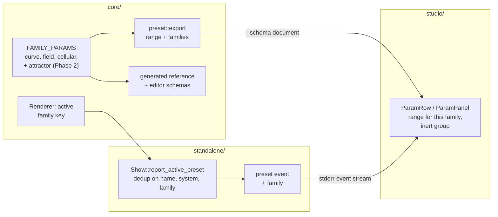

# 0179 — A parameter's range belongs to its family

> **Status:** approved (2026-09-14)
> **Created:** 2026-09-14
> **Owner skill(s):** `dev`, `studio-builder`
> **Related ADRs:** [0194](../adrs/0194-a-family-dependent-range-travels-in-the-schema-and-the-player-reports-the-family.md) (proposed),
> [0180](../adrs/0180-a-mathematical-world-joins-a-system-as-a-family-and-a-structural-parameter-is-held.md),
> [0184](../adrs/0184-the-player-reports-what-it-loaded-and-the-studio-re-derives-nothing.md)
> **Closes:** design-backlog 0204, design-backlog 0198

## TL;DR

The studio's slider for a family-dependent parameter uses the one range the schema exports, so on a
Lissajous `d` has 97 % dead travel and on a hypotrochoid `n` cannot go negative. This plan makes the
schema document carry each family's range, and marks inert families as `null`. That comes from the
same `FAMILY_PARAMS` table the generated reference already prints. The attractor's `a`..`d` join that
table. The player's `preset` event reports the active family, and the studio picks the slider's ends
from the family on screen. The engine side also fixes backlog 0198: `deposit_arms` becomes
`Structural`, so a bound arm count steps by whole arms and does not tear the mesh along `atan2`'s
branch cut. The first user-visible behaviour is a curve preset in the studio where dragging a
hypotrochoid's `n` reaches `-8`.

## Context & problem

**Backlog 0204.** `parametric_curve`, `analytic_field` and `cellular` each declare a `FAMILY_PARAMS`
table (ADR-0180 rule 4). Each row gives the range a family reads, or `None` where it does not read
the parameter. `render::scenes::family_params(label)` answers for those three. The generated
reference in `presets/README.md` prints the table. The exported schema (`preset::export`,
`push_roster`) does not: it writes one `range` per parameter. The studio's `ParamRow.tsx` builds its
slider from that pair, and the editor schemas under `presets/schema/` print that pair in their hover
text (the 2026-09-13 update to 0204). The attractor's `a`..`d` are the same class with no table:
each is `range: None`, so it gets a number field on every family. The map arithmetic in
`particles::family::step_once` shows Thomas reads `a` alone, Lorenz `a`/`b`/`c`, and the IFS figures
none.

The entry's deferral trigger has fired: eight `curve_*` presets now ship on the new families.

**The family on screen is not known to the studio.** The `preset` event carries `name`, `index`,
`system` and `file`. `Show::report_active_preset` deduplicates on the name alone. A reload that edits
the on-screen preset's `[curve] family`, or its `system`, therefore emits nothing.

**Backlog 0198.** `deposit_arms` is declared `Modal` with range `0`–`16`. The deposit shader reads it
raw (`let arms = dp.b.z;` in `warp_mesh/shaders.rs`) and multiplies it into a phase, so a fractional
value tears along the `atan2` branch cut. Plan 0161's audit left it `Modal` under a rule that marked
`Structural` only where rounding was already a no-op. No shipped preset, fixture or example binds it
to anything but an integer constant (`warp_cauldron` 10, `warp_millrace` 3, `warp_sirocco` 4,
`warp_smoke` 12, `warp_wellhead` 6; the four `core/tests/fixtures/warp_mesh*.toml` bind 6, 4, 0 and
4). `[hold] deposit_arms = "bar"` is the obvious way to step it on the music, and today that tears.

## Decision

ADR-0194. The schema document gains an additive `families` array on every parameter
`family_params` answers for. `SCHEMA_VERSION` does not move; the body hash does. The attractor joins
`family_params`. The `preset` event gains `family` and is re-emitted when name, system or family
changes. The editor schemas print the per-family cell in the hover. The studio picks the range by
family and falls back to `range` wherever anything is missing.

**For 0198, `deposit_arms` becomes `ParamKind::Structural`.** The engine then rounds it once, before
the scene sees it, the way ADR-0180 rule 2 exists to do. It is decided **now**, because a fractional
binding changes nothing in the shipped library today, and that stops being true once a preset binds
one. We rejected **rounding inside the WGSL**: it would make `deposit_arms` the one integer-meaning
parameter whose rounding is invisible to `kind`, so the studio's structural slider (whole steps), the
generated reference's Structural group and `[hold]`'s documentation would all describe it wrongly.

We rejected three alternatives to ADR-0194, each argued there: reading the family out of the preset
document (it re-derives a loaded fact, and an embedded preset has no document), a `ctl/` query for a
family's ranges (two protocol rosters widened for a static fact), and replacing `range` behind a
`SCHEMA_VERSION` bump (an older studio would then show no panel at all).

## Architecture diagram



## Implementation phases

### Phase 1 — `deposit_arms` is a whole number of arms

- **Owner skill:** dev
- **What:** `deposit_arms` is declared `ParamKind::Structural`. Its doc line says it is a whole
  number of arms, not a "real angular frequency". `core/tests/preset.rs`'s hand-kept `STRUCTURAL`
  roster gains `("warp_mesh", "deposit_arms")`. The roster's doc comment is amended so it no longer
  claims every entry is a parameter where rounding is provably a no-op: this entry is marked to
  **remove** a defect, and the comment says so and cites backlog 0198. It stops listing
  `deposit_arms` among the parameters absent despite integer-sounding names. The generated files
  that print the declaration are regenerated.
- **Files touched:** `core/src/render/scenes/warp_mesh/mod.rs`, `core/tests/preset.rs`,
  `presets/README.md` (generated params block, `RLX_UPDATE_PARAM_REFERENCE=1`),
  `presets/schema/warp_mesh.schema.json` and `docs/specs/player-schema.json`
  (`RLX_UPDATE_PRESET_SCHEMA=1`), and a capture test beside the existing `warp_mesh` fixtures.
- **Done when:**
  - Two presets identical but for `deposit_arms = "2.6"` and `deposit_arms = "3"` capture
    **byte-identical** frames in one run on one adapter. It skips with ADR-0016's notice where no
    adapter exists. The same pair against `"2.4"` / `"2"` is identical too, and `"3"` against `"2"`
    differs, which is the control that proves the capture sees the arm count at all. This test fails
    on the tree before the phase.
  - `cargo nextest run --workspace` moves no golden. Every shipped, fixture and example binding is
    an integer constant, so rounding composes to the identity on all of them. A moved golden is a
    stop, logged with its name.
  - The regenerated `presets/README.md` block lists `deposit_arms` under **Structural** for
    `warp_mesh`, and `core/tests/preset_schema.rs` passes against the regenerated files.

### Phase 2 — The attractor's coefficients join the family table

- **Owner skill:** dev
- **What:** `particles` declares a `FAMILY_PARAMS` with one row for each of `a`, `b`, `c`, `d`, over
  every `[particles] family` in `Roster::AttractorFamily`'s order (the four maps, then
  `IfsFigure::ALL`). `family_params("attractor")` answers with it.
  - **Inert cells** are what the map arithmetic reads. From `step_once` today: De Jong and Clifford
    read all four, Thomas reads `a` only, Lorenz reads `a`, `b` and `c`, and every IFS figure reads
    none. **Check this against the WGSL step, not only against the CPU mirror.** A mirror is an
    instrument (ADR-0180's 2026-09-11 addendum), and a cell that disagrees with the shader is the
    lie this table exists to remove.
  - **A reading cell's range contains every coefficient of that family's tuple roster**
    (`extra_tuples()` plus the canonical entry). The chosen bounds and that derivation are written
    in the rows' comment.
  - Each `ParamSpec` keeps `range: None`.
- **Files touched:** `core/src/render/scenes/particles/mod.rs` (or `family.rs`, beside the rosters it
  is derived from), `core/src/render/scenes/mod.rs` (`family_params`), the particles tests,
  `presets/README.md` (generated block).
- **Done when:**
  - A test in the shape of `parametric`'s `the_family_table_is_the_roster_and_its_inert_cells_are_inert`
    holds three things:
    - each row lists every attractor family by name, in roster order, exactly once;
    - every roster tuple's coefficient lies inside its family's declared range for each parameter
      that family reads;
    - moving a parameter on a family the row calls inert leaves `step_once`'s output unchanged,
      while moving it on a family that reads it changes that output. IFS figures are exempt from the
      step check, and the test says why.
  - The regenerated reference prints per-family cells for the attractor's `a`..`d`. The existing
    cells for `parametric_curve`, `analytic_field` and `cellular` are byte-unchanged.

### Phase 3 — The schema document carries each family's range

- **Owner skill:** dev
- **What:**
  - **Document:** `push_roster` writes `"families": [{"family": …, "range": [lo, hi] | null}, …]` on
    every parameter `family_params(label)` has a row for, and writes nothing extra on any other
    parameter. `SCHEMA_VERSION` stays `1`, and the comment beside `kind`'s additive note is extended
    to name `families` under the same reasoning.
  - **Editor schemas:** `markdown_for` prints the family cell (the ranges on the families that read
    the parameter, then the families it is inert on) in place of the single typical range, for those
    parameters only. It adds no `if`/`then` validation (ADR-0194 point 5).
  - **Regenerate:** `presets/schema/` and `docs/specs/player-schema.json`.
- **Files touched:** `core/src/preset/schema/export.rs`, `core/tests/preset.rs` (the one-walk parity
  test), `core/tests/preset_schema.rs`, `presets/schema/*.schema.json`, `docs/specs/player-schema.json`.
- **Done when:**
  - In the document, `parametric_curve`'s `n` carries five `families` entries in `CurveFamily::ALL`'s
    order, with `hypotrochoid` at `[-8, 8]` and `superformula` at `null`. `d` carries `lissajous` at
    `[1, 12]`. `attractor`'s `b` carries `thomas` at `null`. A parameter with no row (`samples`)
    carries no `families` key.
  - A test holds the document's `families` and the generated reference's family cells to the same
    walk. Editing one `FAMILY_PARAMS` range changes both, as the existing parity test already
    requires for `range`.
  - **Every family row's declaration is used by exactly one parameter roster.** If a
    family-dependent `ParamSpec` const is shared across systems, the hover text keyed on that
    declaration would name one system's families on another. That makes the test fail and the case
    stop, rather than print a wrong hover.
  - `core/tests/preset_schema.rs` passes against the regenerated files, and the `n` definition's
    hover names the hypotrochoid's `-8` to `8`.

### Phase 4 — The player reports the family on screen

- **Owner skill:** dev
- **What:**
  - **Core:** the renderer gains an accessor beside `active_system_key` that returns the active
    preset's family as a preset writes it, for a system `family_params` answers for. It is read from
    the loaded preset's structural config, the value `Scene::configure` receives, and `None`
    otherwise.
  - **Event:** `Event::Preset` gains `family`, rendered as a string or `null`.
  - **Dedup:** `Show::report_active_preset` keys its deduplication on name, system and family
    together.
  - **Spec 0003:** the `preset` row gains `family`. Its invariants gain two sentences: `family` is
    spelled as the schema's `families[].family` spells it, and `preset` is re-emitted when the
    on-screen preset's name, system or family changes.
- **Files touched:** `core/src/render/mod.rs`, `standalone/src/events.rs`, `standalone/src/show.rs`,
  their tests, `docs/specs/0003-studio-control-protocol.md`.
- **Done when:**
  - A rendered `preset` line for a curve preset carries `"family":"lissajous"`, and one for a
    `fragment_field` preset carries `"family":null`. Both are asserted on the line the writer
    produces.
  - Reloading the on-screen preset with its `[curve] family` changed emits a second `preset` naming
    the same preset and the new family. A reload that changes neither system nor family emits
    none. Both are asserted at the `Show` seam, not through a spawned player.
  - `stream_show`'s roster walk still sees exactly one `preset` per system it asks for.
  - `studio/shared/protocol.spec.test.ts` is **expected red** from this commit until Phase 5 lands,
    because the spec now lists a field the studio's union lacks. The log records it, as Plan 0172
    did.

### Phase 5 — The studio's slider reads the family's range

- **Owner skill:** studio-builder
- **What:**
  - **Parsers:** `studio/shared/schema.ts` accepts an optional `families` on a parameter.
    `studio/shared/protocol.ts` accepts `family` (string or `null`, optional) on `preset`.
  - **Threading:** the reported family reaches `Editor` beside `system`.
  - **Row:** `ParamRow` takes its ends from the `families` entry for that family.
  - **Panel:** `ParamPanel` gathers the rows whose entry is `null` into a trailing group labelled as
    inert on the family on screen. A row there still shows its binding if the file has one, and
    offers no slider travel.
  - **Fallback:** no `families`, no `family`, or no matching entry uses `range` as today.
  - **Refresh audit:** every handler of the `preset` event is checked for behaviour that must not
    run on a same-name refresh (ADR-0194's first Negative), and each one found is listed in the log.
- **Files touched:** `studio/shared/schema.ts`, `studio/shared/protocol.ts`,
  `studio/renderer/components/ParamRow.tsx`, `studio/renderer/components/ParamPanel.tsx` and
  `ParamPanel.test.tsx`, `studio/renderer/views/Editor.tsx`, `studio/renderer/App.tsx`,
  `studio/renderer/hooks/usePlayerEvents.ts`.
- **Notes for the implementer:** arrives by the automatic `dev → studio-builder` handoff (ADR-0188);
  the receiver still waits for "go".
- **Done when:**
  - Against the committed `docs/specs/player-schema.json`, a panel for `parametric_curve` on
    `hypotrochoid` renders `n`'s slider with `min = -8` and `max = 8`, and on `lissajous` renders
    `d`'s with `max = 12`. On `superformula`, `n` sits in the inert group. On `attractor` with
    `thomas`, `a` is a slider and `b`, `c`, `d` are in the inert group. On `de_jong`, all four are
    sliders.
  - The same panel given a `preset` with no `family`, or a document with no `families`, renders
    exactly the sliders it renders today.
  - `studio/shared/protocol.spec.test.ts` is green again.

## Data shapes

```jsonc
// illustrative - one parameter object in the --schema document's systems[].params
{ "name": "n", "default": 6, "range": [1, 24], "doc": "…", "kind": "modal",
  "families": [
    { "family": "maurer_rose",  "range": [1, 24] },
    { "family": "lissajous",    "range": [1, 12] },
    { "family": "hypotrochoid", "range": [-8, 8] },
    { "family": "superformula", "range": null },
    { "family": "harmonograph", "range": [1, 12] } ] }

// illustrative - the preset event
{"v":1,"ev":"preset","name":"Lissajous Knot","index":12,"system":"parametric_curve","file":null,"family":"lissajous"}
```

## Risks & open questions

- **A same-name `preset` is new behaviour for every parent.** Phase 5's audit covers the studio. No
  other parent reads the stream today. Spec 0003 states the re-emission rule, so a future one is
  told.
- **The system picker's refresh may already be broken, and this plan fixes it only as a side
  effect.** The studio's `SystemPicker` compares its selection with the reported `system`, and a
  reload that changes `system` was not re-reported under name-only deduplication. This was read
  from the code, not reproduced. Phase 5 confirms the picker settles after a system edit and logs
  whether it did before.
- **The attractor ranges are a hull, not a map of chaos.** An author wanting coefficients outside
  every known-good tuple types them. The slider bounds are a guide.
- **The attractor slider's starting value is wrong, and remains wrong.** An unbound `a` shows the
  declared `0.0` while the scene draws the tuple's coefficient. It is out of scope (below). A
  per-family slider makes it more noticeable.
- **Contention.** Phase 4 edits `standalone/src/show.rs` and `events.rs`. Plan 0174's Phase 2 is
  diagnosing `stream_show` and `control_loopback`, both of which read the event stream, and its
  uncommitted work is in the tree. **Take Phase 4 after 0174 closes.** Phases 1-3 contend with any
  plan that edits a `ParamSpec`, because they regenerate the reference and both schema artifacts. A
  lane that merges one must re-run both `RLX_UPDATE_*` switches rather than hand-merge generated
  files.
- **`deposit_arms` at exactly `0.5`.** It used to render a half-arm modulation, because the shader
  switches it on at `>= 0.5`. Rounded, `0.5` becomes one arm. No binding anywhere writes it.
  Recorded so the close does not read a changed pixel on an authored `0.5` as a regression.

## What this plan does NOT do

- **It does not give the attractor's `a`..`d` a tuple-dependent default**, or change what an unbound
  coefficient's slider starts at.
- **It does not add per-family validation** anywhere. A range stays a guide in the editor schemas
  and a slider's travel in the studio. The loader clamps nothing new.
- **It does not change `FamilyParam` or `FamilyRange`**, or any existing `FAMILY_PARAMS` cell.
- **It does not audit other integer-meaning `Modal` parameters** (`n`, `d`, `samples`, `count`,
  `seed`, `variant`). Only `deposit_arms` has a recorded defect.
- **It does not move `SCHEMA_VERSION` or the event stream's `v`.**

## Implementation log

> Written by `dev` — one row per phase as that phase's commit lands, and the close block after the
> last one. **The phases above are the contract; everything here is what happened.**
> **Observations, never conclusions:** this says where to look, architect decides how it went.
> No per-criterion pass list, no self-assessment, no narrative — but a deviation from the plan or
> an unmet done-when is always disclosed. Stays shorter than `## Implementation phases` above.

**Lane:** _(`main` directly, or the worktree path plus its branch)_

| phase | owner | state | commit |
|---|---|---|---|
| 1 — `deposit_arms` is a whole number of arms | dev | not started | |
| 2 — The attractor's coefficients join the family table | dev | not started | |
| 3 — The schema document carries each family's range | dev | not started | |
| 4 — The player reports the family on screen | dev | not started | |
| 5 — The studio's slider reads the family's range | studio-builder | not started | |

### Notes

### Close triggers

- **`presets/` touched:**
- **Plan header `Closes:`**
- **What shipped:**
- **Operator docs touched:**
- **Backlog probes (`node scripts/check-backlog-claims.mjs`):**
- **Full suite:**
- **Outstanding `human` phases:**

## Followups (after this lands)
