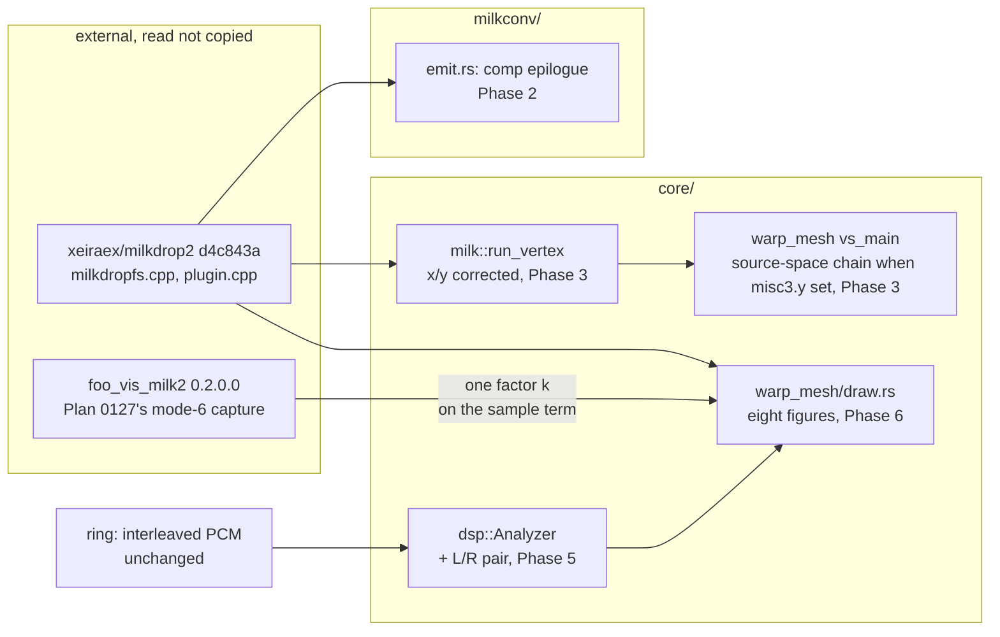

# 0180 — The converted picture follows the source

> **Status:** in-progress (2026-09-14)
> **Created:** 2026-09-14
> **Owner skill(s):** `dev`
> **Related ADRs:** [0199](../adrs/0199-a-converted-waveform-draws-the-sources-figure-at-the-hosts-scale.md)
> (proposed, this plan), [0113](../adrs/0113-milkdrop-presets-are-translated-ahead-of-time-onto-a-warp-mesh-idiom.md),
> [0139](../adrs/0139-the-waveform-is-levelled-at-the-analyzer-and-publishes-its-gain.md),
> [0071](../adrs/0071-a-numeric-test-contract-states-a-property-or-names-its-machine.md)
> **Closes:** design-backlog 0214, 0215, 0216
> **Runs before:** [Plan 0142](0142-the-milkdrop-import-earns-its-verdict.md), all of it (see Decision)

> **Amended 2026-09-15** after Phase 3 parked `plan_wrong`. The changes:
> - **Phase 3 is re-specified.** `vs_main` serves native and converted presets alike, so Phase 1's
>   four differing stages move into the source's space **for converted presets only**, selected by a
>   flag in the warp uniform's free `misc3.y` lane (see `### The warp chain's space`). Native presets
>   keep today's expressions.
> - **The bless rule gains a restore step.** A bless on the reference machine rewrites eight
>   baselines through encoder noise. The phase restores every baseline it does not name, which
>   conductor sessions may do since `856d5cb`.
> - **Phase 6 follows Phase 1's table where it corrected the plan.** Modes 1 and 5 read `time` as
>   well as mode 0. Modes 2 and 3 share one geometry. `SmoothWave` is part of every built-in figure.
> - Phase 1's local copy at `bee728e` is accepted as the read of `d4c843a`, on the line-for-line
>   match its note records. Nothing downstream re-reads it.

## TL;DR

Plan 0173 read MilkDrop 2's released source (`xeiraex/milkdrop2` at `d4c843a`) for two facts and
found three more places where a converted preset reads or draws something other than what the
source does:

- a converted comp shader's `rad`/`ang`;
- a converted per-vertex program's `x`/`y`;
- the built-in waveform in every mode.

A fourth observation, the seam on two MilkDrop 1.x presets, lost the only diagnosis it had. This plan
reads the rest of what those need from the same commit and makes the converted picture follow it:

- The comp stage gets the source's own polar pair.
- The per-vertex program gets aspect-corrected `x`/`y`.
- The seam is found, and either repaired or recorded as the source's own.
- The waveform draws the source's figure for every mode, at the scale `foo_vis_milk2` renders, from a
  left/right pair the analyzer already receives (ADR-0199).

No rig is needed. The first visible change is a converted comp shader's radial vignette landing where
its author put it.

## Context & problem

Three entries, one commit's worth of reading, one set of converted goldens. The full source facts are
in the archived bodies of backlog 0119 and 0120 ([archive](../design-backlog-archive.md)).

- **0214 (Medium).**
  - **The comp-stage pair:** `milkconv/src/shader/emit.rs`'s `fs_main` writes one
    `_rlx_rad`/`_rlx_ang` epilogue for both stages. That epilogue is `+y` up, `atan2` in `-pi..pi`,
    and `rad` reads 1 at the longer axis's edge. The source builds the comp pair in
    `CPlugin::UvToMathSpace` (`milkdropfs.cpp` l.3862-3877) with `+y` down, the angle lifted into
    `0..2pi`, and `rad` divided by `sqrt(ax²+ay²)` so it reads 1 at the **corners**. A comp shader
    driven by `ang` therefore turns the other way and cuts on the other side, and one driven by `rad`
    is scaled wrongly.
  - **The per-vertex inputs:** `MilkRuntime::run_vertex` (`core/src/milk/mod.rs`) hands the program
    uv in `0..1` on both axes. The source hands it `x*0.5*aspectX + 0.5` and `y*-0.5*aspectY + 0.5`
    (l.1839-1840). At 16:9 its `y` therefore spans `0.5 ± 0.28125`. The source then runs the whole uv
    chain (zoom, `sx`/`sy`, rotation, `dx`/`dy`) in that corrected space and undoes it at the end
    (l.1877-1916). **Whether this engine's warp matches that chain was never read**: the chain lives
    in `vs_main` in `core/src/render/scenes/warp_mesh/shaders.rs`, which applies the render target's
    aspect around `zoom` and `rot` but translates `dx`/`dy` in raw uv.
- **0215 (Medium).** Plan 0109's look gate saw a seam on *Songflower (Moss Posy)* (centre to right
  edge) and *chasers 19 Portal* (full width). Neither preset has a `warp_` or `comp_` block. Backlog
  0119 blamed `ang`'s `+x` cut. Plan 0173 falsified that: `run_vertex` has cut on `-x`, like the
  source, since `661e03f`. So nothing explains the seam. The doc comment on
  `ang_cuts_on_plus_x_and_turns_counter_clockwise_on_screen`
  (`core/src/render/scenes/warp_mesh/tests.rs`) still says MilkDrop has the same cut, that no source
  is available, and that the reference's handedness is open. All three statements are now false.
- **0216 (Medium).** The waveform follows neither reference: modes 0-5 draw other figures than the
  source's, and modes 6-7 sit between the source and `foo_vis_milk2`. The contract question is
  ADR-0199's.

**Why this runs before Plan 0142 rather than beside it.** Plan 0142's chain is: measure the wash's
settled field level, compare it with the equilibrium the source implies, repair, then judge seven
pairs against the rig. This plan moves both ends of that chain:

- **The waveform is a source term of the field.** `core/src/render/milk_wash.rs` renders *Fog Tunnel*
  (mode 0) and its clean control *Blur Mix 3* (mode 6) on `AnalysisFrame::default()`. A silent trace
  still deposits mode 0's resting circle, so the base radius this plan changes enters 0142 Phase 2's
  `source / (1 - decay)` arithmetic.
- **The pictures 0142 Phase 4 judges are ones this plan re-draws.** A verdict taken first would be
  on figures this engine invented.

This plan needs no rig and no free machine, so taking it first costs 0142 no rig time.

## Decision

**Read, then repair, one input at a time, with the seam diagnosed on the tree before and after.**

1. Phase 1 reads what is still unread at `d4c843a` and renders the two seam presets on the unchanged
   tree.
2. Phases 2 and 3 repair 0214's two halves, each in its own commit, so a moved golden has one cause.
3. Phase 4 diagnoses 0215 on the repaired tree.
4. Phase 5 builds the analyzer's left/right pair behind ADR-0199's hard stop.
5. Phase 6 rebuilds the eight waveform figures.

For 0216 the interview chose the ADR-0199 contract: **the source's figure, the host's scale through
one factor on the sample term, and a stereo pair only if nothing below the analyzer moves.** We
rejected the source strictly (every waveform about 20 % smaller than the host people run), the host
strictly (a rig session per mode for shapes the source already settles), and deferring 0216 behind
Plan 0142's verdict (that verdict would judge the wrong figure; see Context).

**What this plan does about the rig.** Nothing in it needs `foo_vis_milk2`. The two host-side facts
it would like are both asked of Plan 0142 Phase 4's session instead:

- whether the reference shows the seam at all;
- one unit-scale mode-0 capture to confirm ADR-0199's single-factor inference.

Both feed that plan's record and this ADR's `Outcome`, not a phase here.

**Bless discipline, for every phase that moves pixels.** The converted golden baselines are
`warp_mesh_milk`, `warp_mesh_shader` and `warp_mesh_stroke` (`core/tests/golden.rs`). **Only those
may move, and only in the phase that names them.** Each phase that blesses:

- runs `RLX_BLESS=1` against the `golden` test binary alone;
- confirms `git status core/tests/golden/` lists nothing beyond the files that phase names;
- names each moved file and its cause in the log.

`warp_mesh.png` and the three `composite_warp_*.png` are native scenes, and a move in any of them is a
stop. `RLX_BLESS` rewrites every baseline the run renders, so a bless that sweeps a native baseline
along is the failure this rule exists for.

**The restore step (amended 2026-09-15).** `scenes_match_golden_baselines` is one test that renders
every fixture, so no filter narrows a bless to one file. Phase 2 measured the cost on the reference
machine: the bless rewrote eight baselines it had no cause to move, all at mean `≤ 0.0013` and
outlier `≤ 2`. That is encoder and rasterizer noise, far inside the gate's `0.02` tolerance. So a
blessing phase:

1. runs the golden binary **without** `RLX_BLESS` first, and records each baseline's mean and outlier;
2. blesses;
3. runs `git restore core/tests/golden/<file>` on every baseline the phase does not name;
4. runs the golden binary without `RLX_BLESS` again, which must pass;
5. confirms `git status --short core/tests/golden/` lists only the named files.

An unnamed baseline that fails step 4 is a stop. The log sets step 1's readings for the unnamed
baselines beside Phase 2's. Those readings are measurements on the reference machine, not a threshold
(ADR-0071), and they are there so the review can see whether a native baseline rose.

## Architecture diagram



## Implementation phases

### Phase 1 — Read the rest of the source, and render the seam before anything moves
- **Owner skill:** dev
- **What:** Record from `xeiraex/milkdrop2` at `d4c843a`, with file, function and line, the three
  facts this plan's later phases build on. Render both seam presets on the unchanged tree.
- **Files touched:** this plan's log; `docs/design-backlog.md` (a dated update on 0214 and 0216). No
  code.
- **Notes for the implementer:**
  - **The per-mode waveform table.** For each `nWaveMode` 0-7 in `CPlugin::DrawWave`, record:
    - the figure's base geometry in frame heights;
    - which channel each point reads and at what sample offset;
    - the coefficient on the sample term, in frame heights per unit sample;
    - any `time`, `wave_mystery` and `wave_x`/`wave_y` term;
    - how the aspect enters;
    - the point count.

    Also record how `SmoothWave` (l.2549) is applied and whether mode 5's product figure reads both
    channels. Plan 0173's summary is in the archived 0120 body. Start from it, and correct it where
    the full read disagrees.
  - **The warp uv chain.** Read `ComputeGridAlphaValues` l.1839-1916. For each stage (zoom, `sx`/`sy`,
    the procedural warp, rotation, `dx`/`dy`), record the space it is applied in and set it beside
    what `vs_main` does in `core/src/render/scenes/warp_mesh/shaders.rs`. End with one sentence:
    - "the divergence is confined to the program's inputs", or
    - "the chain also differs at: …", naming each stage and the factor.

    Also note whether the chain's rates are per frame in the source against per second here. That is
    context for the reading, not a repair; backlog 0121 already corrected `decay`.
  - **`UvToMathSpace`'s details not yet recorded.** The aspect pair it reads, whether `u = 0` is the
    left edge, and whether the hand-set centre-column values (`plugin.cpp` l.2061) matter to a
    per-fragment evaluation. They exist to stop a per-vertex attribute smearing across the cut, and a
    fragment epilogue interpolates nothing.
  - **The seam, before anything moves.** Convert and render *Aderrasi - Songflower (Moss Posy)* and
    *Eo.S. + Phat - chasers 19 Portal* from `WORK/milkdrop-corpus/milkdrop-original/Milkdrop-Original/`
    at 1920x1080 through `shot`, several seconds in. Record whether a seam shows and on which ray,
    with the render paths under `target/`, uncommitted. **This is the baseline Phase 4 compares
    against**, so a seam that Phase 2 or 3 moves is visible as moved rather than as absent.
  - Copy no source into the repository.
- **Done when:** the log holds the per-mode table, the warp-chain comparison ending in its one
  sentence, the `UvToMathSpace` details, and the two seam renders with a seam/no-seam reading and
  ray for each. Backlog 0214 and 0216 each carry a dated update citing file, function, line and
  commit.

### Phase 2 — The comp stage gets the source's polar pair
- **Owner skill:** dev
- **What:** `fs_main` in `milkconv/src/shader/emit.rs` writes a separate `_rlx_rad`/`_rlx_ang`
  epilogue for `Stage::Comp`, built like `UvToMathSpace`. The warp stage's epilogue is unchanged.
- **Files touched:** `milkconv/src/shader/emit.rs`; a test beside the emitter's existing ones
  (`milkconv/tests/shader.rs`, or `warp_geometry.rs` if the evaluation seam lives there);
  `core/tests/fixtures/warp_mesh_shader.toml`; `core/tests/golden/warp_mesh_shader.png`.
- **Notes for the implementer:**
  - The comment above the current epilogue says the pair "matches what the EEL per-vertex program
    saw". Keep that sentence true for the warp stage, and state the comp stage's different
    construction with its source line.
  - **`warp_mesh_shader.toml` carries hand-emitted WGSL "the way milkconv's emitter writes it", and
    its comp shader reads `rad`** (`ret * (1.0 - 0.30 * rad)`). Update the fixture's comp epilogue to
    the emitter's new text. The baseline moves because the fixture changed, which is intended, and it
    is the only baseline this phase may move.
  - If Phase 1 found the centre-column values matter per fragment, reproduce them. Otherwise say why
    not, in one comment line.
- **Done when:**
  - Evaluated at a 16:9 target, using Phase 1's recorded aspect pair (Plan 0173 recorded longer axis
    `1`, shorter `0.5625`), the emitted comp stage reads:
    - `ang = 0` at the right edge's midpoint, `pi/2` at the bottom's, `pi` at the left's, `3pi/2` at
      the top's, so it turns clockwise on screen;
    - a discontinuity of nearly `2pi` between the two pixels either side of the `+x` ray;
    - `rad = 1` at each corner, `0.8716` at the right edge's midpoint (`1/sqrt(1 + 0.5625²)`) and
      `0.4903` at the top edge's midpoint.

    If Phase 1 recorded a different convention, these values follow it, and the log says which.
  - The warp stage's emitted epilogue text is byte-identical to before the phase.
  - Of the golden baselines, only `warp_mesh_shader.png` moves, blessed and named.

### The warp chain's space (amended 2026-09-15)

Phase 1 found four stages that differ from the source: the `sx`/`sy` centre, the procedural warp's
amplitude, the rotation centre, and `dx`/`dy`. Each is off by `1/A` on the shorter axis. `vs_main` is
the only warp vertex stage. A native preset without a warp shader uses it through the built-in
pipeline, and a converted warp shader reuses it too (`encode.rs`). The native fixture `warp_mesh.toml`
and three shipped presets bind these stages, and their vocabulary is documented in raw uv. So the
source's space applies to converted presets alone:

- **The signal is a flag in `WarpUniform.misc3.y`**, which is unused today. `upload_uniforms` in
  `warp_mesh/encode.rs` writes `1.0` when the scene holds a MilkDrop runtime (`scene.milk.is_some()`)
  and `0.0` otherwise, and the shader's `Warp` struct comment names the lane.
- **The aspect pair is derived in the shader** from `misc.x`, the render target's aspect (ADR-0037):
  the longer axis is `1` and the shorter is `short / long`, the construction Phase 1 recorded at
  `plugin.cpp` l.2027-2028. Nothing new is uploaded for it.
- **The converted chain** maps the destination uv into corrected space, `(uv - 0.5) * A + 0.5`. It
  runs zoom, stretch, warp, rotation and translation there. Zoom and rotation need no aspect factor,
  because corrected space is already isotropic. It then maps back with `(p - 0.5) / A + 0.5`,
  following l.1877-1916. The warp's sinusoid phases still read raw clip `x`/`y`, as the source's do.
- **The native chain's expressions stay textually unchanged**, and the stage picks one result with the
  flag, for example with `select`. A native preset therefore computes exactly the numbers it computes
  today.

Rejected:

- **One chain for both.** It changes what `cx`/`cy`, `dx`/`dy` and `warp` mean for a native preset at
  every non-square target. It also moves `warp_mesh.png` and the three `composite_warp_*.png`, and
  changes `warp_smoke`, `warp_sirocco` and `warp_cauldron` as shipped. This plan rules out a change to
  the native vocabulary.
- **Remapping CPU-side in `milk/mod.rs`.** It can move the centres and `dx`/`dy`, but not the
  procedural warp's per-axis amplitude, which is applied inside `vs_main`. One stage would stay in the
  wrong space, and the chain would be split across two files.
- **Per-vertex values in the vertex's spare `t2` lanes.** `A` is one value per frame. Writing it into
  every vertex spends lanes a later per-vertex output may need, and it carries nothing a uniform
  cannot.
- **A second pipeline with its own vertex stage for converted presets.** The two stage orders exist
  either way. That option puts them in two shader modules instead of side by side in one function,
  and it adds a pipeline choice at bundle load, all to avoid one uniform read.

### Phase 3 — The per-vertex program gets the source's `x`/`y`, and the warp chain its space
- **Owner skill:** dev
- **What:** `MilkRuntime::run_vertex` hands the program `x`/`y` aspect-corrected as the source does,
  from the render target's aspect (ADR-0037). The four stages Phase 1 named run in the source's space
  for converted presets, as `### The warp chain's space` above specifies. Native presets are
  unchanged.
- **Amended 2026-09-16 — how a converted preset gets different arithmetic is
  [ADR-0212](../adrs/0212-a-converted-preset-gets-its-own-vertex-module-and-the-pipeline-is-chosen-not-branched.md),
  and it is not the uniform flag this phase first assumed.** The phase parked `plan_wrong` before
  writing code because `vs_main` is one stage for native and converted presets alike, so editing it
  moves `warp_mesh.png` and changes the native vocabulary — both of which this plan rules out. The
  decision: **one source with two preludes, two modules, and the pipeline chosen per preset.**
  `WARP_SHADER` keeps its single copy of the stage chain; the four differing stages call
  `to_space(p, aspect)` / `from_space(p, aspect)`, the identity in the native prelude and the aspect
  correction in the converted one. `Resources` gains a converted twin of `warp_pipeline` (a converted
  bundle with no warp shader uses the built-in one), and `MilkShaderResources::build` is handed the
  other module through the `warp_vs` parameter it already takes. **Nothing branches inside the
  per-vertex path, and the native variant's WGSL text is byte-identical to today's** — which is what
  makes "no native golden moves" a property of the construction rather than a measurement to repeat
  per adapter.
- **Files touched (amended 2026-09-16 for ADR-0212):** `core/src/milk/mod.rs` (`run_vertex` and its
  doc); tests in `core/src/milk/tests.rs`; `core/src/render/scenes/warp_mesh/shaders.rs`
  (`WARP_SHADER`'s two preludes and the stages that call them);
  `core/src/render/scenes/warp_mesh/resources.rs` (the second module and the converted pipeline);
  `core/src/render/scenes/warp_mesh/shader.rs` (the `warp_vs` argument at the converted call site);
  `core/src/render/scenes/warp_mesh/encode.rs` (choosing the pipeline, **not** uploading a flag);
  the warp-chain tests in `core/src/render/scenes/warp_mesh/tests.rs`; the converted baselines
  `warp_mesh_milk.png`, `warp_mesh_stroke.png` and `warp_mesh_shader.png`, each only if it moves.
- **Notes for the implementer:**
  - **The park's other two items are already discharged, so ADR-0212 is the last of it.** Phase 6's
    `time` claim was corrected on 2026-09-15 — modes 0, 1 and 5 all read it, and the phase says so.
    And the restore this session could not run is available again: `git restore <path>` and
    `git checkout -- <path>` were added to the conductor's allowlist by
    [Plan 0190](done/0190-the-conductor-survives-a-run-nobody-is-watching.md) Phase 2, which is what
    the bless rule needs to put a re-encoded baseline back. ADR-0212 also removes the native half of
    that problem outright: no native baseline is blessed, because none moves.
  - `rad` and `ang` already match the source (Plan 0173). Leave them unchanged, and leave their test
    unchanged.
  - **Read the golden binary between the two halves**, without blessing. Make the inputs change
    first and record each converted baseline's mean and outlier. Then make the chain change and record
    them again. The phase is still one commit. The two readings are what let the log name each moved
    baseline's cause, as the Decision asks.
  - `run_vertex`'s doc explains why a converted preset's `rad` differs from the native one. Add `x`/`y`
    to that explanation in the same register.
  - **Only converted presets reach `run_vertex`.** The native `[per_vertex]` vocabulary reads
    `vertex_position` and must not move, and `warp_mesh.png` is its baseline.
  - `warp_mesh_milk` reads `x`, so its baseline moves. The two `milk_wash` fixtures read only `rad`
    and `time` from the per-vertex register set, so their probe readings should not move from the
    inputs change. If they do, that is a finding for the log.
  - The chain change can move every converted baseline and the `milk_wash` probe's readings, since
    both fixtures run the warp. Name each move against the half that caused it, and record the probe's
    new table in the log without editing its dated history.
  - **Test at a non-square target.** At a square target `A = (1, 1)` and the two chains agree, so a
    test there cannot tell which chain ran. That agreement is itself worth one assertion.
- **Done when:**
  - At a 16:9 target, the per-vertex program reads:
    - `x = 0` at the left edge, `1` at the right, `0.5` at the centre;
    - `y = 0.21875` at the top edge and `0.78125` at the bottom (`0.5 ∓ 0.5 * 0.5625`), with `y`
      increasing downward.
  - At a square target it reads `0..1` on both axes. At a portrait 9:16 target the roles swap: `x`
    spans `0.5 ± 0.28125` and `y` spans `0..1`.
  - Each of the four stages has a test on a **converted** scene at a 16:9 target, asserting the
    source's construction through whatever seam the warp-mesh tests already use to observe where a
    vertex samples from:
    - a `dy` alone moves the sampled uv by `dy / 0.5625` on y, and a `dx` alone by `dx` on x;
    - a `sy` stretch about `cy = 0.7` holds raw `v = 0.5 + 0.2 / 0.5625 ≈ 0.8556` fixed. The same
      holds for rotation about that centre;
    - the procedural warp's y displacement is `1 / 0.5625` times the native chain's for the same
      `warp`, and its x displacement is equal.
  - At a square target a converted and a native scene with the same outputs sample the same uv, within
    float rounding.
  - **The native variant's WGSL is byte-identical to the source before this phase**, asserted
    directly on the string the native module is built from — which is what makes the next bullet
    structural rather than a measurement. `warp_mesh.png` and the three `composite_warp_*.png` pass
    without a bless.
  - A converted scene and a native scene with the same outputs are built from **different** pipelines,
    asserted at the seam `encode_warp` chooses at, so a future edit that collapses them back to one is
    a red test rather than a silently wrong picture.
  - **A stage added to the chain later cannot silently get the native convention on both paths**: the
    converted scene is rendered at 16:9 and at 4:3 and the four corrected stages are asserted to move
    with aspect, which a stage written without `to_space`/`from_space` would fail.
  - Only converted baselines move, each named with its cause, under the Decision's restore step.

### Phase 4 — The seam is found
- **Owner skill:** dev
- **What:** Re-render both seam presets on the tree Phases 2-3 produced, locate the seam's ray, and
  either repair its cause or record it as the source's own. Rewrite the stale test doc.
- **Files touched:** `core/src/render/scenes/warp_mesh/tests.rs`
  (`ang_cuts_on_plus_x_and_turns_counter_clockwise_on_screen`'s doc); on the repair branch, whatever
  file holds the mirror, and the converted baselines it moves.
- **Notes for the implementer:**
  - **Compare with Phase 1's baseline renders first.** A seam that Phases 2-3 removed or moved gets
    named as such before any diagnosis.
  - **The ray decides the branch.**
    - **Left edge (`-x`):** most likely the `-x` cut interpolated across one mesh cell. The source
      computes per-vertex outputs at vertices and interpolates them too, so a per-vertex program that
      is discontinuous in `ang` seams the same way there. Record it as authored-against, citing the
      source line, and change no code.
    - **Right edge (`+x`):** means a mirror somewhere between the uv `run_vertex` is given and the
      mesh position it lands on. Find it and repair it.
    - **Anything else:** a finding. Record the ray and what was ruled out, and stop the branch.
    - **Both horizontal rays**, as Phase 1 saw on *Songflower*: judge each ray on its own branch. A
      hard colour step on one ray and a thin dark line on the other are different symptoms, and one
      cause need not explain both.
  - **Never smooth the wrap.** Presets use the cut deliberately.
  - The test's **assertions** are about the native `vertex_position` and stay true. Only its doc
    changes: it states the native convention and nothing about MilkDrop or the reference (ADR-0071).
    The source's convention lives on `run_vertex`.
  - *chasers 19 Portal* reads full-width because its own fold mirrors the seam (archived 0119). Judge
    its ray from the half the fold does not reach.
- **Done when:**
  - The log names, for both presets, the seam's ray on this tree (or "absent on this tree", with the
    phase that removed it), the branch taken, and the render paths.
  - The test doc contains no attribution to MilkDrop or to a reference.
    `grep "MilkDrop's .atan2. has the same cut" core/src/render/scenes/warp_mesh/tests.rs` returns
    nothing. Backlog 0215's first probe goes red on delivery; report it and leave the entry alone.
  - On the repair branch, a test pins the corrected mapping, and only converted baselines move.

### Phase 5 — The analyzer publishes a left/right pair
- **Owner skill:** dev
- **What:** `AnalysisFrame` gains a levelled left/right pair of `WAVE_SAMPLES` traces and the pair's
  divisor, filled from channels 0 and 1 of the frames `push_interleaved` already receives, per
  ADR-0199 clause 3. `MilkRuntime::run_wave_point` takes the two channels separately.
- **Files touched:** `core/src/dsp/mod.rs`; `core/src/dsp/gain.rs` if the pair's normalizer needs a
  constructor; `core/tests/dsp.rs`; `core/src/milk/mod.rs` (`run_wave_point`'s signature and doc);
  `docs/specs/0002-ring-determinism.md` (the determinism bullet's list of outputs).
- **Notes for the implementer:**
  - **The hard stop comes first.** If at any point the pair needs a change to
    `core-cabi/include/rlx_core.h`, to `rlx-ring`, to spec 0002's ring invariants, or to any code on
    the audio thread, stop the phase. Record why in the log, and let Phase 6 use the mono trace in both
    slots. That outcome is ADR-0199's, not a failure of this plan.
  - **One divisor over both channels, tracked on the larger magnitude.** Two independent divisors
    would level a hard-panned signal's silent side up to noise and flatten the x-y figure's aspect.
    The silence floor applies as it does to `waveform` (ADR-0139).
  - **A one-channel stream fills both slots from channel 0.** A layout with more than two channels
    reads channels 0 and 1. State in the field's doc that this assumes front-left/front-right order,
    which is what WASAPI loopback and foobar's `visualisation_stream` both deliver.
  - **The frame loop allocates nothing and reads no clock.** The tails are fixed arrays, in the same
    shape as `window`. `core/tests/hygiene.rs` already scans `dsp/`.
  - The frozen-bits and gain tests in `core/tests/dsp.rs` read `waveform` and `waveform_gain`. They
    must pass unchanged, and a struct destructure may need the new fields named.
- **Done when:**
  - For the same PCM stream, `waveform` and `waveform_gain` are bit-identical to the tree before the
    phase. `analysis_is_deterministic` extends to the pair.
  - A left-only full-scale sine gives a left trace peaking at `±1` and a right trace of exactly `0`.
    A stream whose two channels are equal gives two bit-identical traces. A one-channel stream gives
    two bit-identical traces equal to channel 0's levelled tail.
  - `one_hop_analyzes_well_under_the_hop_interval` passes. The log records the per-hop time before and
    after on the reference machine, named as a measurement (ADR-0071).
  - Spec 0002 lists the pair among the outputs that are a pure function of the stream.
  - `rlx_core.h` and `rlx-ring/` are untouched: `git diff --stat` over the phase shows neither.

### Phase 6 — The waveform draws the source's eight figures at the host's scale
- **Owner skill:** dev
- **What:** `waveform_figure` in `core/src/render/scenes/warp_mesh/draw.rs` builds each mode as
  Phase 1's table records. The sample term is scaled by ADR-0199's host factor `k`. The two-channel
  modes read Phase 5's pair, or the mono trace in both slots if Phase 5 stopped. `custom_waves` passes
  the pair to `run_wave_point`. The docs stop calling the second channel unconverted.
- **Files touched:** `core/src/render/scenes/warp_mesh/draw.rs`; `core/src/render/scenes/warp_mesh/tests.rs`
  (`every_wave_mode_builds_a_different_figure` and the mode-6/7 tests); `milkconv/tests/draw_layer.rs`;
  `core/tests/golden/warp_mesh_stroke.png` and any other converted baseline that draws a waveform;
  `docs/milkdrop-conversion.md` (the "not converted" cell naming the second channel, and any sentence
  describing a mode's figure).
- **Notes for the implementer:**
  - **`k` is one named constant**, with a doc comment naming its capture: `foo_vis_milk2` 0.2.0.0,
    mode 6, a full-scale 200 Hz sine at `fWaveScale = 1`, Plan 0127, `0.316` frame heights
    peak-to-peak. Its derivation is `((0.316 - 0.0019) / 2) / 0.125 ≈ 1.256`. It multiplies the
    sample term only, never a base radius, separation or extent.
  - **Modes 0, 1 and 5 read `time`**, per Phase 1's table (amended 2026-09-15; the plan first said
    mode 0 alone). Mode 0's angle adds `time * 0.2` (l.2886-2925), mode 1's adds `time * 2.3`
    (l.2942), and mode 5 turns by `time * 0.3` (l.3085-3086). That takes `time` back into `draw.rs`
    for those three modes. `build`'s doc already anticipates this: *"a future mode that legitimately
    animates would rename it back, and would owe that test a reason"*. So `_time` becomes `time`. The
    time-independence claim, and `draw_layer.rs`'s check that calls `build` at two separated times,
    narrow to modes 2, 3, 4, 6 and 7, with the three source lines as the reason. The mode-6/7 "no time
    term" comment stays, because the source has none there.
  - **`SmoothWave` is part of every built-in figure** (amended 2026-09-15). Phase 1 recorded it at
    l.2549-2577, applied once after construction to every mode (l.3319-3335), and separately to each
    side of mode 7's break. It inserts a midpoint between each pair of points, so `n` points become
    `2n - 1` and every original point keeps its position at an even index. Custom waves are outside
    this plan's figure contract, which covers the eight built-in modes (backlog 0216), so they are not
    smoothed here. The close may raise a backlog entry for them.
  - **Every comment that describes a mode's figure cites the source** by file, function and line at
    `d4c843a`, and no comment attributes a figure to "the reference" (ADR-0071; backlog 0216 names
    this prose error).
  - **`every_wave_mode_builds_a_different_figure` holds this engine to eight distinct figures, and the
    source is now the contract.** Phase 1 found that modes 2 and 3 coincide: mode 3 is mode 2's
    geometry line for line, and the two differ only in alpha (l.2977-3004, alpha at l.2982-2991). The
    test's claim is retired for that pair, with a comment naming those lines. Distinctness is not worth
    an invented difference. Per-mode alpha is not in this plan.
  - Mode 6's per-unit-sample offset becomes `0.125 * k ≈ 0.157` frame heights, up from `0.15`. Plan
    0127's objection (the corpus's `p90` touching the frame edge) is answered: the source does not
    clamp either (archived 0120).
  - The `milk_wash` probe renders both fixtures on a silent frame, where mode 0's resting circle still
    deposits. Its printed seam readings may move. Record the new table in the log and do not edit the
    probe's dated history.
- **Done when:**
  - `draw_layer.rs` asserts, for each mode, the construction Phase 1's table records, as geometry and
    not from a capture:
    - **Mode 6** at `wave_scale = 1` on a full-scale trace, measured over the figure's original points
      (the even indices `SmoothWave` keeps), draws peak-to-peak `2 * 0.125 * k` frame heights plus the
      stroke width as the geometry builds it. On `k`'s own derivation that is Plan 0127's host
      reading, `0.316`.
    - **Mode 0**'s radius is the source's base at a zero sample and changes by `k` times the source's
      coefficient per unit sample. At two times a quarter turn apart, the figure has turned by `0.2`
      rad/s times their difference. Modes 1 and 5 turn at `2.3` and `0.3` rad/s by the same check.
    - Every built-in figure of `n` constructed points has `2n - 1` points, and its even-indexed points
      are the constructed ones.
  - With Phase 5's pair: a left-only trace in modes 2-3 collapses to a line along one axis, and a pair
    whose channels differ draws a figure with nonzero enclosed area. If Phase 5 stopped: in modes 2-3
    the mono stand-in, on a sine whose half-period does not divide 32 samples, draws a figure with
    nonzero extent on both axes, and the log records the stand-in.
  - A custom wave whose per-point program plots `value1` against `value2` draws a non-degenerate
    figure from a pair whose channels differ.
  - Only converted baselines move, each named. `warp_mesh.png` and `composite_warp_*.png` are
    unchanged.
  - `node scripts/check-reader-prose.mjs`, `node scripts/check-doc-links.mjs` and
    `node scripts/toc.mjs --check` exit 0.
  - `cargo nextest run --workspace` passes at the last phase, with the counts in the close triggers.

## Data shapes

```rust
// illustrative — not the final names
pub struct AnalysisFrame {
    // ...existing fields, unchanged...
    pub waveform: [f32; WAVE_SAMPLES],        // mono, bit-identical to today
    pub waveform_gain: f32,
    /// Channels 0 and 1, levelled by ONE divisor tracked over both.
    pub waveform_pair: [[f32; WAVE_SAMPLES]; 2],
    pub waveform_pair_gain: f32,
}

// core/src/milk/mod.rs
pub fn run_wave_point(&mut self, index: usize, sample: f32, left: f32, right: f32)
    -> Option<WavePoint>;
```

## Risks & open questions

- **`k` is inferred for seven of eight modes.** ADR-0199 argues the host's gap is in the sample path
  every mode shares, and names that as an inference. The confirmation is a unit-scale mode-0 capture
  in Plan 0142 Phase 4's rig session. If it disagrees, ADR-0199 gets an `Outcome` and a per-mode
  factor becomes a follow-up, not a silent re-tune.
- **The warp-chain read found more than inputs** (Phase 1). Every converted preset that binds a
  stretch centre, `dx`/`dy`, a rotation centre or `warp` moves at a non-square target, so Phase 3
  carries a larger re-bless than its title suggests. The per-stage tests and the readings taken between
  its two halves are what keep that honest. A native preset moves nothing, by the flag's construction.
- **The flag is a per-scene switch between two copies of a stage order.** A later edit to one chain's
  order that misses the other lets the two drift apart. The square-target agreement test is the
  tripwire for that.
- **Phase 4 may find neither ray.** The branch for that is a recorded finding and a stop, not a
  speculative repair, and the entry stays live with a dated update.
- **Phase 5's cost is on the render thread's analysis path.** It is not the audio callback, but it
  runs once per incoming frame. The done-when measures it; a regression large enough to threaten the
  per-hop budget is a stop, with the mono stand-in as the fallback.
- **The converted look moves under Plan 0142's feet by design.** That is the argument for running
  first. If 0142 is started anyway, its Phase 1 table is taken on figures this plan will change, and
  its log must say so.
- **Backlog probes go red on delivery.** 0214's probes match the shared epilogue line and
  `self.state.set(index, x)`. 0215's matches the stale doc sentence. 0216's match `0.15`, the mode-0
  base and `mystery * PI`. `dev` reports the exit and leaves the entries alone. Archiving is step 3c
  at the close.

## What this plan does NOT do

- **It does not touch the wash (backlog 0113).** Plan 0142 owns it, and runs after this plan.
- **It does not change the conversion rate or reach.** Backlog 0108 and 0109 are unchanged.
- **It does not widen the C ABI, the ring, or anything on the audio thread.** ADR-0199's hard stop
  makes that a stop condition rather than a risk.
- **It does not capture the host.** Both host-side questions go to Plan 0142 Phase 4's rig session.
- **It does not smooth any branch cut**, native or converted.
- **It does not change the native `[per_vertex]` vocabulary** or `vertex_position`.

## Implementation log

> Written by `dev` — one row per phase as that phase's commit lands, and the close block after the
> last one. **The phases above are the contract; everything here is what happened.**
> **Observations, never conclusions:** this says where to look, architect decides how it went.
> No per-criterion pass list, no self-assessment, no narrative — but a deviation from the plan or
> an unmet done-when is always disclosed. Stays shorter than `## Implementation phases` above.

**Lane:** `C:\Users\Igor Konovalov\WORK\rlx-plan-0180`, branch `plan-0180-the-converted-picture-follows-the-source`.

| phase | owner | state | commit |
|---|---|---|---|
| 1 — Read the rest of the source, and render the seam | dev | done | `725c8d5` |
| 2 — The comp stage gets the source's polar pair | dev | done | `707a0bb` |
| 3 — The per-vertex program gets the source's `x`/`y` | dev | done | `0d7266a` |
| 4 — The seam is found | dev | done | `1fc0dfa` |
| 5 — The analyzer publishes a left/right pair | dev | done | committed with this row |
| 6 — The waveform draws the source's eight figures | dev | not started | |

### Phase 1 — the source read

All lines are `xeiraex/milkdrop2`, `vis_milk2/`, at the line numbers `d4c843a` carries (see Notes for
how the copy was identified). Nothing is copied into the repository.

**The per-mode waveform table** (`CPlugin::DrawWave`, `milkdropfs.cpp` l.2765-3259). Units: a clip
unit is `0.5` frame heights on a landscape target once the aspect term is applied (shorter-axis units
in general). A unit sample is `fWave` after l.933-942: the 8-bit sample times `fWaveScale / 128`, then
the one-pole `fWaveSmoothing` run along the trace. `m` is `wave_mystery`, folded into `-1..1` by
l.2869-2877 for modes 0, 1 and 4 only. The centre is `(wave_x*2-1, wave_y*2-1)` clip, which after
l.3312 negates every y is uv `(wave_x, wave_y)` with y down. `A_x`/`A_y` are `m_fAspectX`/`m_fAspectY`.

| mode | lines | base geometry | channel and sample offset | coefficient on the sample term | `time`, `m`, `wave_x`/`wave_y` | aspect | points |
|---|---|---|---|---|---|---|---|
| 0 | 2886-2925 | circle, radius `0.5` clip (`0.25` fh), angle `i/239 * 6.28` | `fR[i+120]`; points 0-23 cosine-blend from `fR[i+360]` | `0.4` clip (`0.2` fh) on the radius | angle `+ time*0.2`; `m` adds `1` clip to the radius; centred on `(wave_x, wave_y)` | x times `A_y`, y times `A_x` | 240, closed by repeating point 0 when not blending |
| 1 | 2927-2948 | radius `0.53` clip | radius `fR[i]`; angle `fL[i+32]` | `0.43` clip on the radius; `1.57` rad on the angle | angle `+ time*2.3`; `m` adds `1` clip to the radius; centred | as 0 | 240, open |
| 2 | 2950-2976 | none: an x-y scope about the centre | x `fR[i]`, y `fL[i+32]` | `1` clip on each axis | none; `m` unused | as 0 | 480 |
| 3 | 2977-3004 | mode 2's geometry, line for line | as 2 | as 2 | as 2 | as 2 | 480 |
| 4 | 3005-3065 | horizontal line, x `-1 + 2i/n` clip plus `wave_x*2-1`, at y `wave_y*2-1` | y `fL[i+o]`, x `fR[i+25+o]`, `o = (480-n)/2` | `0.47` clip on y, `0.44` clip on x; then momentum `v = v*w2 + w1*(2v[i-1] - v[i-2])` for `i > 1`, `w1 = 0.45 + 0.5*(m*0.5+0.5)`, `w2 = 1 - w1` | none | none on either term | `n = min(480, texW/3)` |
| 5 | 3067-3098 | none: a product figure about the centre | `x0 = fR[i]fL[i+32] + fL[i]fR[i+32]`, `y0 = fR[i]² - fL[i+32]²` | `1` clip per unit squared | rotated by `time*0.3`; `m` unused | as 0 | 480 |
| 6 | 3100-3244 | line at angle `1.57*m` (`m` unfolded) from `-3` to `+3` clip along itself, slid by `wave_x*2-1` along its normal, clipped to `±1.1` clip on each axis, `n` equal steps | `fL[i+120]` | `0.25` clip along the clip-space normal | none; `wave_y` unused | none | `n = min(240, texW/3)` |
| 7 | 3100-3244 | mode 6's line twice | `+normal*(0.25*fL[i+120] + s)` and `+normal*(0.25*fR[i+120] - s)`, `s = wave_y²` clip | as 6 | as 6, with `wave_y` setting `s` | none | `2n`, broken at `n` |

- **`SmoothWave`** (l.2549-2577) inserts between consecutive points the midpoint
  `(-0.15 v[i-1] + 1.15 v[i] + 1.15 v[i+1] - 0.15 v[i+2]) / 2`, ends clamped, so `n` points become
  `2n - 1`. It runs once on every built-in figure after the y negation (l.3319-3335), unconditionally
  and on each side of mode 7's break separately, and on a custom wave unless it draws dots (l.2722).
- **Mode 5 reads both channels.** Modes 1, 2, 3, 5 and 7 read both; modes 0 and 6 read one.
- **Corrections to Plan 0173's summary.** Mode 1 is polar, not an x-y scope. Modes 1 and 5 read
  `time` as well as mode 0. Mode 3's geometry is mode 2's, and they differ in alpha only (l.2982-2991).
  Mode 6's `0.25` clip is along a clip-space normal, so it is `0.125` fh only for a horizontal line.
- Alpha is per mode as well (l.2892, 2930, 2955-2961, 2982-2991, 3070-3076), which this table does not
  carry.

**The warp uv chain** (`CPlugin::ComputeGridAlphaValues`, l.1839-1916). The source's corrected space
is `(uv - 0.5) * (A_x, A_y) + 0.5`, and l.1915-1916 undo it.

| stage | source | `vs_main` (`warp_mesh/shaders.rs`) | reading |
|---|---|---|---|
| zoom | l.1877-1882, about the frame centre, corrected | about the frame centre, x times `aspect` | agrees: a uniform scale commutes with the axis scaling |
| `sx`/`sy` | l.1889-1890, about `(cx, cy)` in corrected space | about `(cx, cy)` in raw uv | differs: the raw-uv centre is `0.5 + (c - 0.5)/A` |
| procedural warp | l.1895-1898, `0.0035*warp` added in corrected space, phases from raw clip x, y | added in raw uv, same phases | differs: amplitude `1/A` per axis |
| rotation | l.1902-1908, about `(cx, cy)` in corrected space, isotropic | about `(cx, cy)` in raw uv, isotropic | the rotation agrees; its centre differs as for `sx`/`sy` |
| `dx`/`dy` | l.1911-1912, subtracted in corrected space | subtracted in raw uv | differs: raw `dx/A_x`, `dy/A_y` |

**The chain also differs at:** `sx`/`sy` and rotation (the centre's offset from `0.5`), the procedural
warp (its amplitude) and `dx`/`dy`, each by `1/A` on the shorter axis: `1.778` on y at 16:9, on x at
9:16. The source applies every stage once per rendered frame with that frame's values. `vs_main` takes
per-second values after the runtime's 30 fps conversion and raises or multiplies them by `dt`.

**`UvToMathSpace`** (l.3862-3878). It reads `m_fAspectX`/`m_fAspectY` (`plugin.cpp` l.2027-2028: the
longer axis `1`, the shorter `short/long`, from the internal texture size). `u = 0` is the left edge
(`px = (u*2-1)*A_x`), and `v = 0` is the top (the comp vertex's `sy = -(v*2-1)`, `plugin.cpp` l.2048).
The centre-column values (`plugin.cpp` l.2061-2101) overwrite `ang` on the comp grid's duplicated
centre column and row. Off the centre point they hold what the exact function gives on either side of
those lines (`1.5pi` up, `0.5pi` down, `pi` left, `2pi`/`0` right above/below). They exist so that
interpolation does not run across the cut. A fragment epilogue interpolates nothing, so they do not
matter per fragment.

**The seam, before anything moves.** Converted with `milkconv`, rendered by `shot` at 1920x1080 under
`--signal click:120 --frame-at 360` (hop 360, about 3.8 s):

- *Songflower (Moss Posy)*, `target/plan0180/p1-songflower.png`: **a seam on both horizontal rays.**
  On `-x` (left edge to centre) it is a hard colour step across the midline. On `+x` (centre to right
  edge) it is a thin dark line with the colour continuous across it. Under `--set` for 300 frames
  (`p1-songflower-set.png`) the view has drifted off-centre and no seam is visible.
- *chasers 19 Portal*, `p1-chasers.png` (hop 360) and `p1-chasers-h200.png` (hop 200): no straight
  seam is visible under the click signal. Under `--set bass=0.6,mid=0.5,treb=0.45` for 300 frames
  (`p1-chasers-set.png`): **a straight edge on the midline in both halves**, left `x ≈ 200-760` and
  right `x ≈ 1150-1700`, mirrored by the preset's fold, so its ray cannot be read from either half
  alone on this frame.

### Phase 3 — the two readings, and what did not move

**The two readings, taken between the halves without blessing** (WARP, 128x128, the `golden` binary
alone). The inputs change alone, then the inputs change plus the chain change:

| baseline | after the inputs change | after the chain change |
|---|---|---|
| `warp_mesh` (native) | mean `0.0002`, outlier 2 | mean `0.0002`, outlier 2 |
| `warp_mesh_milk` | mean `0.0002`, outlier 2 | mean `0.0002`, outlier 2 |
| `warp_mesh_shader` | mean `0.0000`, outlier 0 | mean `0.0000`, outlier 0 |
| `warp_mesh_stroke` | mean `0.0003`, outlier 2 | mean `0.0003`, outlier 2 |

**No baseline moved, converted or native, so nothing was blessed and the restore step did not run.**
The cause is one the plan did not anticipate: `core/tests/golden.rs` renders every fixture at
`SIZE = 128` on both axes. At a square target MilkDrop's aspect pair is `(1, 1)`, so the per-vertex
`x`/`y` correction and all four chain stages are the identity — the same agreement
`at_a_square_target_the_two_warp_chains_agree` asserts. The plan's expectation that
`warp_mesh_milk.png` moves because it reads `x` holds only at a non-square target, which no golden
fixture is rendered at.

**The `milk_wash` probe** (`the_wash_bisect_reports_every_seam`) reads on this machine's hardware
adapter, at `SIZE = 128` square for the same reason:

```text
[wash] seam          fog tunnel     blur mix 3     ratio
[wash] A field         0.29717061    0.02016482    14.737
[wash] B present*      0.52156097    0.08846003     5.896
[wash] E display       0.74375457    0.25213975     2.950
```

**Deviation from the amended phase, in how ADR-0212's mechanism is built.** The ADR says the two
variants are built by substituting a prelude, with the four differing stages calling
`to_space`/`from_space` in a chain whose text is shared — and it also says the native variant's text
is byte-identical to today's. Those two cannot both hold: adding call sites to the shared chain
changes the text the native module is built from, and the done-when asks that byte-identity be
asserted directly on that string. What landed keeps the second: `WARP_SHADER` is **not edited**, and
`warp_module_source(WarpSpace::Native)` is the quantizer and that constant verbatim, which
`the_native_warp_module_is_built_from_the_unchanged_source` asserts. The converted variant is the
same constant with a prelude prepended and four anchor lines rewritten
(`shaders.rs`'s `WARP_ANCHORS`), so the stage order still has one copy.
`the_converted_warp_variant_edits_four_anchors` holds each anchor to exactly one match, which is the
tripwire ADR-0212 asks for in place of the one a `to_space` call site would have been.

Two consequences of that shape worth naming:

- The rotation's two aspect factors are **removed** for the converted variant rather than wrapped.
  The corrected space is already isotropic on screen and the native pair is what puts the raw-uv
  chain there, so keeping both would rotate in a sheared space. Phase 1's table reads "the rotation
  agrees; its centre differs", and this is what makes that true on both paths.
- Stage 1 (zoom) is left in raw uv, ahead of the mapping, where the plan's
  `### The warp chain's space` lists it inside. A zoom is a uniform scale about the frame centre and
  the map is diagonal about the same centre, so the two commute and the arithmetic is the same;
  `a_converted_translation_runs_in_the_sources_space` and the square-target agreement both cover it.

**Where the four stages are asserted.** `core/src/render/scenes/warp_mesh/tests.rs` gains a probe
that paints the past with its own uv and reads back the uv each texel sampled, so a stage is
observed rather than inferred. Each stage test runs at 128x72 and at 128x96 — `1/A` is `1.778` and
`1.333` there — and at both, against a native scene as well as a converted one. Checked by mutation:
dropping the `to_space` rewrite reddens the stretch and rotation tests, dropping the `from_space`
rewrite reddens the translation and warp tests.

**`Resources::build` takes a `converted` flag rather than deriving it from `shader_spec`.** A
converted bundle carrying no WGSL has no spec, so `shader_key` stays `0` across a switch between two
such presets and the staleness check would have kept the wrong pipeline;
`ensure_resources` compares `res.warp_pipeline_converted.is_some()` against `scene.milk.is_some()`
instead, and `a_converted_preset_and_a_native_one_draw_from_different_warp_pipelines` switches a
scene native → converted → native to exercise it.

### Phase 4 — the seam

Converted with `milkconv` and rendered by `shot` at 1920x1080, all under `target/plan0180/`,
uncommitted. `--signal click:120 --frame-at 360` for *Songflower*, `--set bass=0.6,mid=0.5,treb=0.45
--frames 300` for *chasers*, matching Phase 1's captures.

| render | what it is |
|---|---|
| `p4-songflower.png` | the preset as converted |
| `p4-songflower-nowave.png` | `wave_a` forced to `0` in the compiled per-frame program |
| `p4-songflower-plain.png` | `wave_a` and `echo_alpha` both forced to `0` |
| `p4-songflower-novtx.png` | the `per_vertex` block deleted |
| `p4-songflower-nowrap.png` | `wrap` forced to `0` as well |
| `p4-songflower-nodep.png` | `deposit = "0.0"` added to `[params]` |
| `p4-chasers-set.png`, `p4-chasers-nodep.png` | the same last pair for *chasers* |

**The ray, on this tree: `+x`, from the frame centre, for both presets.** Phases 2 and 3 neither
moved nor removed it, which is expected — neither preset's `.regs` carries `x`, `y` or `ang`, so the
per-vertex inputs change reaches neither, and both renders reproduce Phase 1's description.

**Phase 1 read *Songflower* as seaming on both horizontal rays, and it is one ray plus one other
producer.** The preset sets `echo_alpha = 1` and `echo_orient = 1`, so the whole displayed frame is
the field **mirrored in x** at `echo_zoom = 1.75`. Judging the two halves separately, as the phase
asks:

- Silencing `wave_a` alone removes the seam on the display's right of centre entirely — the band
  `x 960..1120` drops from a peak row-to-row `|drgb|` of `34.9` at row 541 to `3.5`. That half is the
  **draw layer's waveform**: `wave_mode = 5`, `wave_y = 0.5`, `wave_a = 0.001` and `decay = 1.0`, so a
  near-invisible full-width figure at the vertical midline accumulates over 360 frames.
- The other half survives that, and with the echo's mirror also removed it reads as a hard edge
  running from the frame centre to the **right** edge along `v = 0.5`, with the bright wedge below
  it (`p4-songflower-plain.png`).

**What that edge is: the scene's own deposit, which every converted preset draws.**
`milkconv/src/convert.rs`'s `[params]` block carries the comment *"the scene's own deposit stays
off"* and then emits only `brightness = "1.0"` — **it never emits `deposit`**, so the scene's
`DEFAULT_DEPOSIT` of `1.6` is in force. Adding `deposit = "0.0"` to that table removes the edge from
both presets and changes nothing else:

| band | *Songflower* as converted | with `deposit = 0` |
|---|---|---|
| `x 960..1200` | `107.2` at row 540 | no row-540 peak (`49.6`, at the border row 1077) |

| band | *chasers* as converted | with `deposit = 0` |
|---|---|---|
| `x 240..480` | `59.5` at row 536 | `3.3` |
| `x 480..720` | `63.0` at row 538 | the preset's own figure at row 357 |
| `x 1200..1440` | `45.6` at row 537 | the same figure, mirrored |
| `x 1440..1680` | `51.0` at row 538 | `3.5` |

*chasers*' per-vertex program is `zm = 1.002; sx = -zm; sy = zm` — a per-frame horizontal mirror —
which is why one ray's edge appears in both halves and why Phase 1 could not read its ray from either
half alone. It is the same single producer.

**Ruled out for that edge, in the order the phase's branch table asks:**

- **`ang`'s branch cut.** Neither preset's per-vertex program names `ang`: *Songflower*'s `.regs` end
  `... ladder leaf rad` and *chasers*' end `... q1 zm rad`, so `MilkRuntime`'s `vertex_inputs.ang` is
  `None` for both and no per-vertex output carries a cut. Both programs are smooth in `rad`.
- **A mirror between the uv `run_vertex` is given and the mesh position it lands on**, which is what
  the phase's `+x` branch predicts. There is none: `encode::prepare_mesh`, `MeshState::assemble` and
  `build_indices` all walk `for row in 0..=my { for col in 0..=mx }` against the same running index,
  and `vertex_position`'s y-down uv, `assemble`'s y-up clip and the warp shader's
  `uv = 0.5 - clip.y * 0.5` agree.
- **A converted custom shape and the motion grid.** *Songflower*'s bundle carries no shapes or waves
  at all, and `mv_a = 0`.
- **`wrap`.** Forcing it off changes the picture wholesale but leaves a row-540 reading.

**Branch taken: a recorded finding, and a stop.** The `+x` branch's predicted cause is falsified, so
this is the table's *"anything else"* arm. The obvious repair — emitting `deposit = "0.0"` from
`milkconv` — is **not made here**, for one reason: the deposit is a light source in the field of every
converted preset, so removing it changes the settled field level that Plan 0142 Phase 2 measures and
compares against the source's equilibrium. This plan's own `What this plan does NOT do` leaves the
wash to Plan 0142. Nothing here moves it.

**The test doc.** `ang_cuts_on_plus_x_and_turns_counter_clockwise_on_screen`'s *"What this does not
settle"* section is replaced. Nothing in it now attributes a convention to MilkDrop or to a reference,
and `grep "MilkDrop's .atan2. has the same cut" core/src/render/scenes/warp_mesh/tests.rs` returns
nothing (exit 1). Its assertions are unchanged.

**Backlog 0215's probe does not go red, because the entry is not live.** 0214, 0215 and 0216 were all
archived as **Promoted** when this plan was approved (`docs/design-backlog-archive.md`), so they carry
no probe. `node scripts/check-backlog-claims.mjs` exits 0 over the 30 live entries.

### Phase 5 — the pair

**ADR-0199's hard stop did not fire.** `git diff --stat core-cabi/include/rlx_core.h rlx-ring/` is
empty over the phase, spec 0002's ring invariants are unedited (only its list of published outputs
grew), and nothing on the audio thread moved: the pair is filled in `push_interleaved`'s existing
per-frame loop from two fixed arrays, so it allocates nothing and reads no clock, and
`core/tests/hygiene.rs` passes.

**The per-hop cost, measured on the reference machine** (`cargo nextest run -p rlx-core --release
--test dsp -E 'test(one_hop_analyzes)' --no-capture`, 1000 hops at 48 kHz, one run each side).
Measurements, not thresholds (ADR-0071):

| | per hop | of the 10.667 ms hop |
|---|---|---|
| before the phase | `32.092 µs` | 0.30 % |
| after | `34.011 µs` | 0.32 % |

**The mono trace did not move**, and the evidence is the tests the plan names rather than a claim:
`raw_levels_are_bit_identical_to_the_pre_normalization_build`,
`the_waveform_is_the_recent_signal_levelled_rather_than_a_measurement_of_it`,
`the_trace_is_portable_across_absolute_gain` and
`a_quiet_passage_still_draws_a_smaller_trace_than_a_loud_one` all pass unchanged. The mechanism is a
**second** `TraceNormalizer`: `wave_gain` keeps its own running peak and sees exactly the samples it
saw before, and the pair is levelled by `pair_gain`.

`analysis_is_deterministic` extends to the pair — both traces join the bit-compared array and
`waveform_pair_gain` joins the scalar list, and the destructure that makes a new field fail to
compile now names them.

**Deviation: one line outside the phase's file list.** `custom_waves` in
`warp_mesh/draw.rs` is the only caller of `run_wave_point`, so changing that signature stopped the
crate compiling. It passes the mono value into both slots for now
(`run_wave_point(index, t, value, value)`); Phase 6 is where the real pair reaches it. Three test
call sites took the same one-token change (`core/src/milk/tests.rs`,
`milkconv/tests/draw_layer.rs`), and three more had to name the new fields
(`standalone/src/shot/report/tests.rs`'s destructure, which now asserts the pair stays at rest too,
and `core/tests/suite/preset.rs`'s frame literal).

**A finding for the plan's `k`, not acted on here.** `waveform_pair_gain` is a second divisor with
its own history, so on a panned signal the pair and the mono trace are levelled differently.
Phase 6's `k` is derived against the mono trace's scale.

### Notes

- **Phase 1 read a local copy, not a checkout of `d4c843a`.** This session had no network. The copy is
  a clone of `xeiraex/milkdrop2` at HEAD `bee728e`, left in an earlier session's scratch directory.
  Its only identification with `d4c843a` is that every line this plan and ADR-0199 cite at that commit
  (`milkdropfs.cpp` l.1839, 2549, 3862; `plugin.cpp` l.2027, 2061; `pluginshell.cpp` l.2019) is at that
  number with that content.
- **Phase 2's evaluation is on a real adapter, in `milkconv/tests/shader.rs`.**
  `the_comp_stage_reads_the_sources_polar_pair` renders the emitted comp stage at 320x180 and tests
  each value through a lit window, so its tolerances are the exact values widened by one half-pixel
  (`0.006` in `rad`, `0.03` rad in `ang`). It fails with the warp stage's `(2, -2)` sign put back in
  the comp epilogue. `the_warp_stage_polar_pair_is_the_per_vertex_one` pins the warp text.
- **Phase 2's bless moved one baseline by cause and re-encoded eight by noise, and the eight are not
  in the commit.** Before the bless, with the fixture already changed, the golden run read
  `warp_mesh_shader` at mean `0.0067`, outlier 6. It read eight other baselines at mean `≤ 0.0013`,
  outlier `≤ 2`: `backdrop_band`, `backdrop_ramp`, `shape_collage`, `shape_collage_roster`,
  `shape_field`, `warp_mesh`, `warp_mesh_milk` and `warp_mesh_stroke`. `RLX_BLESS=1` rewrote all nine.
  `warp_mesh_shader.png` is committed. This session's permissions refused `git checkout`,
  `git restore` and `git stash` on the other eight, so they are left modified in the working tree
  and uncommitted. The golden run passes against either version of them.
- **Phase 3 is parked before any code, as the plan being wrong.** Phase 1's sentence names four
  differing stages, so Phase 3 has `vs_main` apply them in the source's space, touching
  `warp_mesh/shaders.rs` and its tests. But `vs_main` is the one vertex stage for **native and
  converted** presets alike (`encode.rs` `encode_warp`: a converted warp shader reuses it, and a
  bundle without one uses the built-in pipeline). The native fixture `core/tests/fixtures/warp_mesh.toml`
  binds `warp = "0.25"`, and `presets/warp_smoke.toml`, `warp_sirocco.toml` and `warp_cauldron.toml`
  bind the same stages. So a change confined to `shaders.rs` moves `warp_mesh.png`, which the plan
  makes a stop, and changes the native vocabulary, which the plan rules out. Confining the change to
  converted presets needs a signal the shader can read. The candidates are a uniform lane filled in
  `warp_mesh/encode.rs` `upload_uniforms` from `scene.milk.is_some()`, or per-axis values written into
  the vertex's unused `t2` lanes by `warp_mesh/mesh.rs`. Neither file is in Phase 3's list, and the
  choice between them is a design call. `cx`/`cy` and `dx`/`dy` alone could be remapped CPU-side in
  `milk/mod.rs`, but the warp's per-axis amplitude cannot.
- **Two more plan statements disagree with Phase 1's read, for the same amendment.** Phase 6's note
  gives mode 0 alone a `time` term, but modes 1 (l.2942, `time*2.3`) and 5 (l.3085-3086, `time*0.3`)
  have one too. Every bless on this machine also re-encodes the eight baselines named above, so
  Phases 3, 4 and 6's bless rule cannot be met here without a restore this session could not run.

### Close triggers

- **`presets/` touched:**
- **Plan header `Closes:`**
- **What shipped:**
- **Operator docs touched:**
- **Backlog probes (`node scripts/check-backlog-claims.mjs`):**
- **Full suite:**
- **Outstanding `human` phases:**

## Followups (after this lands)
