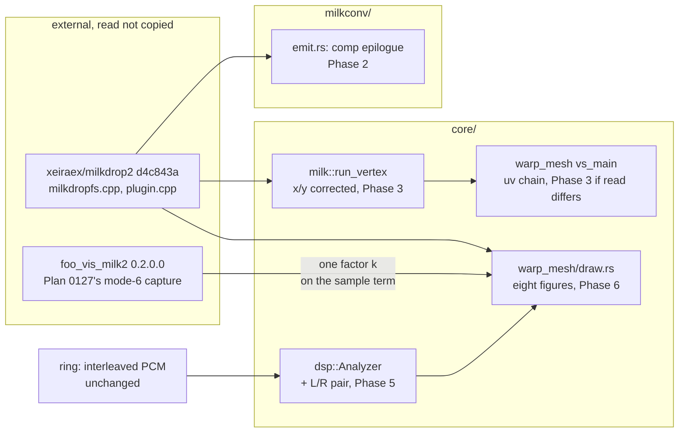

# 0180 — The converted picture follows the source

> **Status:** draft
> **Created:** 2026-09-14
> **Owner skill(s):** `dev`
> **Related ADRs:** [0199](../adrs/0199-a-converted-waveform-draws-the-sources-figure-at-the-hosts-scale.md)
> (proposed, this plan), [0113](../adrs/0113-milkdrop-presets-are-translated-ahead-of-time-onto-a-warp-mesh-idiom.md),
> [0139](../adrs/0139-the-waveform-is-levelled-at-the-analyzer-and-publishes-its-gain.md),
> [0071](../adrs/0071-a-numeric-test-contract-states-a-property-or-names-its-machine.md)
> **Closes:** design-backlog 0214, 0215, 0216
> **Runs before:** [Plan 0142](0142-the-milkdrop-import-earns-its-verdict.md), all of it (see Decision)

## TL;DR

Plan 0173 read MilkDrop 2's released source (`xeiraex/milkdrop2` at `d4c843a`) for two facts and
found three more places where a converted preset reads or draws something other than what the
source does:

- a converted comp shader's `rad`/`ang`;
- a converted per-vertex program's `x`/`y`;
- the built-in waveform in every mode.

A fourth observation, the seam on two MilkDrop 1.x presets, lost the only diagnosis it had. This plan
reads the rest of what those need from the same commit and makes the converted picture follow it:

- The comp stage gets the source's own polar pair.
- The per-vertex program gets aspect-corrected `x`/`y`.
- The seam is found, and either repaired or recorded as the source's own.
- The waveform draws the source's figure for every mode, at the scale `foo_vis_milk2` renders, from a
  left/right pair the analyzer already receives (ADR-0199).

No rig is needed. The first visible change is a converted comp shader's radial vignette landing where
its author put it.

## Context & problem

Three entries, one commit's worth of reading, one set of converted goldens. The full source facts are
in the archived bodies of backlog 0119 and 0120 ([archive](../design-backlog-archive.md)).

- **0214 (Medium).**
  - **The comp-stage pair:** `milkconv/src/shader/emit.rs`'s `fs_main` writes one
    `_rlx_rad`/`_rlx_ang` epilogue for both stages. That epilogue is `+y` up, `atan2` in `-pi..pi`,
    and `rad` reads 1 at the longer axis's edge. The source builds the comp pair in
    `CPlugin::UvToMathSpace` (`milkdropfs.cpp` l.3862-3877) with `+y` down, the angle lifted into
    `0..2pi`, and `rad` divided by `sqrt(ax²+ay²)` so it reads 1 at the **corners**. A comp shader
    driven by `ang` therefore turns the other way and cuts on the other side, and one driven by `rad`
    is scaled wrongly.
  - **The per-vertex inputs:** `MilkRuntime::run_vertex` (`core/src/milk/mod.rs`) hands the program
    uv in `0..1` on both axes. The source hands it `x*0.5*aspectX + 0.5` and `y*-0.5*aspectY + 0.5`
    (l.1839-1840). At 16:9 its `y` therefore spans `0.5 ± 0.28125`. The source then runs the whole uv
    chain (zoom, `sx`/`sy`, rotation, `dx`/`dy`) in that corrected space and undoes it at the end
    (l.1877-1916). **Whether this engine's warp matches that chain was never read**: the chain lives
    in `vs_main` in `core/src/render/scenes/warp_mesh/shaders.rs`, which applies the render target's
    aspect around `zoom` and `rot` but translates `dx`/`dy` in raw uv.
- **0215 (Medium).** Plan 0109's look gate saw a seam on *Songflower (Moss Posy)* (centre to right
  edge) and *chasers 19 Portal* (full width). Neither preset has a `warp_` or `comp_` block. Backlog
  0119 blamed `ang`'s `+x` cut. Plan 0173 falsified that: `run_vertex` has cut on `-x`, like the
  source, since `661e03f`. So nothing explains the seam. The doc comment on
  `ang_cuts_on_plus_x_and_turns_counter_clockwise_on_screen`
  (`core/src/render/scenes/warp_mesh/tests.rs`) still says MilkDrop has the same cut, that no source
  is available, and that the reference's handedness is open. All three statements are now false.
- **0216 (Medium).** The waveform follows neither reference: modes 0-5 draw other figures than the
  source's, and modes 6-7 sit between the source and `foo_vis_milk2`. The contract question is
  ADR-0199's.

**Why this runs before Plan 0142 rather than beside it.** Plan 0142's chain is: measure the wash's
settled field level, compare it with the equilibrium the source implies, repair, then judge seven
pairs against the rig. This plan moves both ends of that chain:

- **The waveform is a source term of the field.** `core/src/render/milk_wash.rs` renders *Fog Tunnel*
  (mode 0) and its clean control *Blur Mix 3* (mode 6) on `AnalysisFrame::default()`. A silent trace
  still deposits mode 0's resting circle, so the base radius this plan changes enters 0142 Phase 2's
  `source / (1 - decay)` arithmetic.
- **The pictures 0142 Phase 4 judges are ones this plan re-draws.** A verdict taken first would be
  on figures this engine invented.

This plan needs no rig and no free machine, so taking it first costs 0142 no rig time.

## Decision

**Read, then repair, one input at a time, with the seam diagnosed on the tree before and after.**

1. Phase 1 reads what is still unread at `d4c843a` and renders the two seam presets on the unchanged
   tree.
2. Phases 2 and 3 repair 0214's two halves, each in its own commit, so a moved golden has one cause.
3. Phase 4 diagnoses 0215 on the repaired tree.
4. Phase 5 builds the analyzer's left/right pair behind ADR-0199's hard stop.
5. Phase 6 rebuilds the eight waveform figures.

For 0216 the interview chose the ADR-0199 contract: **the source's figure, the host's scale through
one factor on the sample term, and a stereo pair only if nothing below the analyzer moves.** We
rejected the source strictly (every waveform about 20 % smaller than the host people run), the host
strictly (a rig session per mode for shapes the source already settles), and deferring 0216 behind
Plan 0142's verdict (that verdict would judge the wrong figure; see Context).

**What this plan does about the rig.** Nothing in it needs `foo_vis_milk2`. The two host-side facts
it would like are both asked of Plan 0142 Phase 4's session instead:

- whether the reference shows the seam at all;
- one unit-scale mode-0 capture to confirm ADR-0199's single-factor inference.

Both feed that plan's record and this ADR's `Outcome`, not a phase here.

**Bless discipline, for every phase that moves pixels.** The converted golden baselines are
`warp_mesh_milk`, `warp_mesh_shader` and `warp_mesh_stroke` (`core/tests/golden.rs`). **Only those
may move, and only in the phase that names them.** Each phase that blesses:

- runs `RLX_BLESS=1` against the `golden` test binary alone;
- confirms `git status core/tests/golden/` lists nothing beyond the files that phase names;
- names each moved file and its cause in the log.

`warp_mesh.png` and the three `composite_warp_*.png` are native scenes, and a move in any of them is a
stop. `RLX_BLESS` rewrites every baseline the run renders, so a bless that sweeps a native baseline
along is the failure this rule exists for.

## Architecture diagram



## Implementation phases

### Phase 1 — Read the rest of the source, and render the seam before anything moves
- **Owner skill:** dev
- **What:** Record from `xeiraex/milkdrop2` at `d4c843a`, with file, function and line, the three
  facts this plan's later phases build on. Render both seam presets on the unchanged tree.
- **Files touched:** this plan's log; `docs/design-backlog.md` (a dated update on 0214 and 0216). No
  code.
- **Notes for the implementer:**
  - **The per-mode waveform table.** For each `nWaveMode` 0-7 in `CPlugin::DrawWave`, record:
    - the figure's base geometry in frame heights;
    - which channel each point reads and at what sample offset;
    - the coefficient on the sample term, in frame heights per unit sample;
    - any `time`, `wave_mystery` and `wave_x`/`wave_y` term;
    - how the aspect enters;
    - the point count.

    Also record how `SmoothWave` (l.2549) is applied and whether mode 5's product figure reads both
    channels. Plan 0173's summary is in the archived 0120 body. Start from it, and correct it where
    the full read disagrees.
  - **The warp uv chain.** Read `ComputeGridAlphaValues` l.1839-1916. For each stage (zoom, `sx`/`sy`,
    the procedural warp, rotation, `dx`/`dy`), record the space it is applied in and set it beside
    what `vs_main` does in `core/src/render/scenes/warp_mesh/shaders.rs`. End with one sentence:
    - "the divergence is confined to the program's inputs", or
    - "the chain also differs at: …", naming each stage and the factor.

    Also note whether the chain's rates are per frame in the source against per second here. That is
    context for the reading, not a repair; backlog 0121 already corrected `decay`.
  - **`UvToMathSpace`'s details not yet recorded.** The aspect pair it reads, whether `u = 0` is the
    left edge, and whether the hand-set centre-column values (`plugin.cpp` l.2061) matter to a
    per-fragment evaluation. They exist to stop a per-vertex attribute smearing across the cut, and a
    fragment epilogue interpolates nothing.
  - **The seam, before anything moves.** Convert and render *Aderrasi - Songflower (Moss Posy)* and
    *Eo.S. + Phat - chasers 19 Portal* from `WORK/milkdrop-corpus/milkdrop-original/Milkdrop-Original/`
    at 1920x1080 through `shot`, several seconds in. Record whether a seam shows and on which ray,
    with the render paths under `target/`, uncommitted. **This is the baseline Phase 4 compares
    against**, so a seam that Phase 2 or 3 moves is visible as moved rather than as absent.
  - Copy no source into the repository.
- **Done when:** the log holds the per-mode table, the warp-chain comparison ending in its one
  sentence, the `UvToMathSpace` details, and the two seam renders with a seam/no-seam reading and
  ray for each. Backlog 0214 and 0216 each carry a dated update citing file, function, line and
  commit.

### Phase 2 — The comp stage gets the source's polar pair
- **Owner skill:** dev
- **What:** `fs_main` in `milkconv/src/shader/emit.rs` writes a separate `_rlx_rad`/`_rlx_ang`
  epilogue for `Stage::Comp`, built like `UvToMathSpace`. The warp stage's epilogue is unchanged.
- **Files touched:** `milkconv/src/shader/emit.rs`; a test beside the emitter's existing ones
  (`milkconv/tests/shader.rs`, or `warp_geometry.rs` if the evaluation seam lives there);
  `core/tests/fixtures/warp_mesh_shader.toml`; `core/tests/golden/warp_mesh_shader.png`.
- **Notes for the implementer:**
  - The comment above the current epilogue says the pair "matches what the EEL per-vertex program
    saw". Keep that sentence true for the warp stage, and state the comp stage's different
    construction with its source line.
  - **`warp_mesh_shader.toml` carries hand-emitted WGSL "the way milkconv's emitter writes it", and
    its comp shader reads `rad`** (`ret * (1.0 - 0.30 * rad)`). Update the fixture's comp epilogue to
    the emitter's new text. The baseline moves because the fixture changed, which is intended, and it
    is the only baseline this phase may move.
  - If Phase 1 found the centre-column values matter per fragment, reproduce them. Otherwise say why
    not, in one comment line.
- **Done when:**
  - Evaluated at a 16:9 target, using Phase 1's recorded aspect pair (Plan 0173 recorded longer axis
    `1`, shorter `0.5625`), the emitted comp stage reads:
    - `ang = 0` at the right edge's midpoint, `pi/2` at the bottom's, `pi` at the left's, `3pi/2` at
      the top's, so it turns clockwise on screen;
    - a discontinuity of nearly `2pi` between the two pixels either side of the `+x` ray;
    - `rad = 1` at each corner, `0.8716` at the right edge's midpoint (`1/sqrt(1 + 0.5625²)`) and
      `0.4903` at the top edge's midpoint.

    If Phase 1 recorded a different convention, these values follow it, and the log says which.
  - The warp stage's emitted epilogue text is byte-identical to before the phase.
  - Of the golden baselines, only `warp_mesh_shader.png` moves, blessed and named.

### Phase 3 — The per-vertex program gets the source's `x`/`y`, and the warp chain its space
- **Owner skill:** dev
- **What:** `MilkRuntime::run_vertex` hands the program `x`/`y` aspect-corrected as the source does,
  from the render target's aspect (ADR-0037). If Phase 1's sentence named a warp-chain stage that
  differs, `vs_main` applies that stage in the source's space too.
- **Files touched:** `core/src/milk/mod.rs` (`run_vertex` and its doc); if Phase 1 named a stage,
  `core/src/render/scenes/warp_mesh/shaders.rs` and its tests; tests in `core/src/milk/tests.rs`;
  `core/tests/golden/warp_mesh_milk.png`, plus `warp_mesh_stroke.png` or `warp_mesh_shader.png` only
  if a warp-chain stage changed.
- **Notes for the implementer:**
  - `rad` and `ang` already match the source (Plan 0173). Leave them unchanged, and leave their test
    unchanged.
  - `run_vertex`'s doc explains why a converted preset's `rad` differs from the native one. Add `x`/`y`
    to that explanation in the same register.
  - **Only converted presets reach `run_vertex`.** The native `[per_vertex]` vocabulary reads
    `vertex_position` and must not move, and `warp_mesh.png` is its baseline.
  - `warp_mesh_milk` reads `x`, so its baseline moves. The two `milk_wash` fixtures read only `rad`
    and `time` from the per-vertex register set, so their probe readings should not move from the
    inputs change. If they do, that is a finding for the log.
  - If a warp-chain stage changes, every converted baseline may move. Name each move against the
    stage that caused it.
- **Done when:**
  - At a 16:9 target, the per-vertex program reads:
    - `x = 0` at the left edge, `1` at the right, `0.5` at the centre;
    - `y = 0.21875` at the top edge and `0.78125` at the bottom (`0.5 ∓ 0.5 * 0.5625`), with `y`
      increasing downward.
  - At a square target it reads `0..1` on both axes. At a portrait 9:16 target the roles swap: `x`
    spans `0.5 ± 0.28125` and `y` spans `0..1`.
  - Each warp-chain stage Phase 1 named has a test asserting the source's construction for that
    stage, or the log records that Phase 1 named none.
  - Only the baselines this phase names move.

### Phase 4 — The seam is found
- **Owner skill:** dev
- **What:** Re-render both seam presets on the tree Phases 2-3 produced, locate the seam's ray, and
  either repair its cause or record it as the source's own. Rewrite the stale test doc.
- **Files touched:** `core/src/render/scenes/warp_mesh/tests.rs`
  (`ang_cuts_on_plus_x_and_turns_counter_clockwise_on_screen`'s doc); on the repair branch, whatever
  file holds the mirror, and the converted baselines it moves.
- **Notes for the implementer:**
  - **Compare with Phase 1's baseline renders first.** A seam that Phases 2-3 removed or moved gets
    named as such before any diagnosis.
  - **The ray decides the branch.**
    - **Left edge (`-x`):** most likely the `-x` cut interpolated across one mesh cell. The source
      computes per-vertex outputs at vertices and interpolates them too, so a per-vertex program that
      is discontinuous in `ang` seams the same way there. Record it as authored-against, citing the
      source line, and change no code.
    - **Right edge (`+x`):** means a mirror somewhere between the uv `run_vertex` is given and the
      mesh position it lands on. Find it and repair it.
    - **Anything else:** a finding. Record the ray and what was ruled out, and stop the branch.
  - **Never smooth the wrap.** Presets use the cut deliberately.
  - The test's **assertions** are about the native `vertex_position` and stay true. Only its doc
    changes: it states the native convention and nothing about MilkDrop or the reference (ADR-0071).
    The source's convention lives on `run_vertex`.
  - *chasers 19 Portal* reads full-width because its own fold mirrors the seam (archived 0119). Judge
    its ray from the half the fold does not reach.
- **Done when:**
  - The log names, for both presets, the seam's ray on this tree (or "absent on this tree", with the
    phase that removed it), the branch taken, and the render paths.
  - The test doc contains no attribution to MilkDrop or to a reference.
    `grep "MilkDrop's .atan2. has the same cut" core/src/render/scenes/warp_mesh/tests.rs` returns
    nothing. Backlog 0215's first probe goes red on delivery; report it and leave the entry alone.
  - On the repair branch, a test pins the corrected mapping, and only converted baselines move.

### Phase 5 — The analyzer publishes a left/right pair
- **Owner skill:** dev
- **What:** `AnalysisFrame` gains a levelled left/right pair of `WAVE_SAMPLES` traces and the pair's
  divisor, filled from channels 0 and 1 of the frames `push_interleaved` already receives, per
  ADR-0199 clause 3. `MilkRuntime::run_wave_point` takes the two channels separately.
- **Files touched:** `core/src/dsp/mod.rs`; `core/src/dsp/gain.rs` if the pair's normalizer needs a
  constructor; `core/tests/dsp.rs`; `core/src/milk/mod.rs` (`run_wave_point`'s signature and doc);
  `docs/specs/0002-ring-determinism.md` (the determinism bullet's list of outputs).
- **Notes for the implementer:**
  - **The hard stop comes first.** If at any point the pair needs a change to
    `core-cabi/include/rlx_core.h`, to `rlx-ring`, to spec 0002's ring invariants, or to any code on
    the audio thread, stop the phase. Record why in the log, and let Phase 6 use the mono trace in both
    slots. That outcome is ADR-0199's, not a failure of this plan.
  - **One divisor over both channels, tracked on the larger magnitude.** Two independent divisors
    would level a hard-panned signal's silent side up to noise and flatten the x-y figure's aspect.
    The silence floor applies as it does to `waveform` (ADR-0139).
  - **A one-channel stream fills both slots from channel 0.** A layout with more than two channels
    reads channels 0 and 1. State in the field's doc that this assumes front-left/front-right order,
    which is what WASAPI loopback and foobar's `visualisation_stream` both deliver.
  - **The frame loop allocates nothing and reads no clock.** The tails are fixed arrays, in the same
    shape as `window`. `core/tests/hygiene.rs` already scans `dsp/`.
  - The frozen-bits and gain tests in `core/tests/dsp.rs` read `waveform` and `waveform_gain`. They
    must pass unchanged, and a struct destructure may need the new fields named.
- **Done when:**
  - For the same PCM stream, `waveform` and `waveform_gain` are bit-identical to the tree before the
    phase. `analysis_is_deterministic` extends to the pair.
  - A left-only full-scale sine gives a left trace peaking at `±1` and a right trace of exactly `0`.
    A stream whose two channels are equal gives two bit-identical traces. A one-channel stream gives
    two bit-identical traces equal to channel 0's levelled tail.
  - `one_hop_analyzes_well_under_the_hop_interval` passes. The log records the per-hop time before and
    after on the reference machine, named as a measurement (ADR-0071).
  - Spec 0002 lists the pair among the outputs that are a pure function of the stream.
  - `rlx_core.h` and `rlx-ring/` are untouched: `git diff --stat` over the phase shows neither.

### Phase 6 — The waveform draws the source's eight figures at the host's scale
- **Owner skill:** dev
- **What:** `waveform_figure` in `core/src/render/scenes/warp_mesh/draw.rs` builds each mode as
  Phase 1's table records. The sample term is scaled by ADR-0199's host factor `k`. The two-channel
  modes read Phase 5's pair, or the mono trace in both slots if Phase 5 stopped. `custom_waves` passes
  the pair to `run_wave_point`. The docs stop calling the second channel unconverted.
- **Files touched:** `core/src/render/scenes/warp_mesh/draw.rs`; `core/src/render/scenes/warp_mesh/tests.rs`
  (`every_wave_mode_builds_a_different_figure` and the mode-6/7 tests); `milkconv/tests/draw_layer.rs`;
  `core/tests/golden/warp_mesh_stroke.png` and any other converted baseline that draws a waveform;
  `docs/milkdrop-conversion.md` (the "not converted" cell naming the second channel, and any sentence
  describing a mode's figure).
- **Notes for the implementer:**
  - **`k` is one named constant**, with a doc comment naming its capture: `foo_vis_milk2` 0.2.0.0,
    mode 6, a full-scale 200 Hz sine at `fWaveScale = 1`, Plan 0127, `0.316` frame heights
    peak-to-peak. Its derivation is `((0.316 - 0.0019) / 2) / 0.125 ≈ 1.256`. It multiplies the
    sample term only, never a base radius, separation or extent.
  - **Mode 0 turns at `time * 0.2`**, per the source. That takes `time` back into `draw.rs` for
    mode 0 alone. `build`'s doc already anticipates this: *"a future mode that legitimately animates
    would rename it back, and would owe that test a reason"*. So `_time` becomes `time`. The
    time-independence claim, and `draw_layer.rs`'s check that calls `build` at two separated times,
    narrow to every mode but 0, with the source line as the reason. The mode-6/7 "no time term"
    comment stays, because the source has none there.
  - **Every comment that describes a mode's figure cites the source** by file, function and line at
    `d4c843a`, and no comment attributes a figure to "the reference" (ADR-0071; backlog 0216 names
    this prose error).
  - **`every_wave_mode_builds_a_different_figure` holds this engine to eight distinct figures, and the
    source is now the contract.** If Phase 1 found two modes whose source figures coincide, that
    test's claim is retired for that pair, with a comment naming the source lines. Distinctness is not
    worth an invented difference.
  - Mode 6's per-unit-sample offset becomes `0.125 * k ≈ 0.157` frame heights, up from `0.15`. Plan
    0127's objection (the corpus's `p90` touching the frame edge) is answered: the source does not
    clamp either (archived 0120).
  - The `milk_wash` probe renders both fixtures on a silent frame, where mode 0's resting circle still
    deposits. Its printed seam readings may move. Record the new table in the log and do not edit the
    probe's dated history.
- **Done when:**
  - `draw_layer.rs` asserts, for each mode, the construction Phase 1's table records, as geometry and
    not from a capture:
    - **Mode 6** at `wave_scale = 1` on a full-scale trace draws peak-to-peak `2 * 0.125 * k` frame
      heights plus the stroke width as the geometry builds it. On `k`'s own derivation that is Plan
      0127's host reading, `0.316`.
    - **Mode 0**'s radius is the source's base at a zero sample and changes by `k` times the source's
      coefficient per unit sample. At two times a quarter turn apart, the figure has turned by `0.2`
      rad/s times their difference.
  - With Phase 5's pair: a left-only trace in modes 2-3 collapses to a line along one axis, and a pair
    whose channels differ draws a figure with nonzero enclosed area. If Phase 5 stopped: the mono
    stand-in draws a closed loop in modes 1-3, and the log records the stand-in.
  - A custom wave whose per-point program plots `value1` against `value2` draws a non-degenerate
    figure from a pair whose channels differ.
  - Only converted baselines move, each named. `warp_mesh.png` and `composite_warp_*.png` are
    unchanged.
  - `node scripts/check-reader-prose.mjs`, `node scripts/check-doc-links.mjs` and
    `node scripts/toc.mjs --check` exit 0.
  - `cargo nextest run --workspace` passes at the last phase, with the counts in the close triggers.

## Data shapes

```rust
// illustrative — not the final names
pub struct AnalysisFrame {
    // ...existing fields, unchanged...
    pub waveform: [f32; WAVE_SAMPLES],        // mono, bit-identical to today
    pub waveform_gain: f32,
    /// Channels 0 and 1, levelled by ONE divisor tracked over both.
    pub waveform_pair: [[f32; WAVE_SAMPLES]; 2],
    pub waveform_pair_gain: f32,
}

// core/src/milk/mod.rs
pub fn run_wave_point(&mut self, index: usize, sample: f32, left: f32, right: f32)
    -> Option<WavePoint>;
```

## Risks & open questions

- **`k` is inferred for seven of eight modes.** ADR-0199 argues the host's gap is in the sample path
  every mode shares, and names that as an inference. The confirmation is a unit-scale mode-0 capture
  in Plan 0142 Phase 4's rig session. If it disagrees, ADR-0199 gets an `Outcome` and a per-mode
  factor becomes a follow-up, not a silent re-tune.
- **The warp-chain read may find more than inputs.** If `dx`/`dy`'s magnitude or a stretch's centre
  differs, every converted preset moves at once. Phase 3 then carries a larger re-bless than its
  title suggests. The per-stage test requirement is what keeps that honest.
- **Phase 4 may find neither ray.** The branch for that is a recorded finding and a stop, not a
  speculative repair, and the entry stays live with a dated update.
- **Phase 5's cost is on the render thread's analysis path.** It is not the audio callback, but it
  runs once per incoming frame. The done-when measures it; a regression large enough to threaten the
  per-hop budget is a stop, with the mono stand-in as the fallback.
- **The converted look moves under Plan 0142's feet by design.** That is the argument for running
  first. If 0142 is started anyway, its Phase 1 table is taken on figures this plan will change, and
  its log must say so.
- **Backlog probes go red on delivery.** 0214's probes match the shared epilogue line and
  `self.state.set(index, x)`. 0215's matches the stale doc sentence. 0216's match `0.15`, the mode-0
  base and `mystery * PI`. `dev` reports the exit and leaves the entries alone. Archiving is step 3c
  at the close.

## What this plan does NOT do

- **It does not touch the wash (backlog 0113).** Plan 0142 owns it, and runs after this plan.
- **It does not change the conversion rate or reach.** Backlog 0108 and 0109 are unchanged.
- **It does not widen the C ABI, the ring, or anything on the audio thread.** ADR-0199's hard stop
  makes that a stop condition rather than a risk.
- **It does not capture the host.** Both host-side questions go to Plan 0142 Phase 4's rig session.
- **It does not smooth any branch cut**, native or converted.
- **It does not change the native `[per_vertex]` vocabulary** or `vertex_position`.

## Implementation log

> Written by `dev` — one row per phase as that phase's commit lands, and the close block after the
> last one. **The phases above are the contract; everything here is what happened.**
> **Observations, never conclusions:** this says where to look, architect decides how it went.
> No per-criterion pass list, no self-assessment, no narrative — but a deviation from the plan or
> an unmet done-when is always disclosed. Stays shorter than `## Implementation phases` above.

**Lane:** _(`main` directly, or the worktree path plus its branch)_

| phase | owner | state | commit |
|---|---|---|---|
| 1 — Read the rest of the source, and render the seam | dev | not started | |
| 2 — The comp stage gets the source's polar pair | dev | not started | |
| 3 — The per-vertex program gets the source's `x`/`y` | dev | not started | |
| 4 — The seam is found | dev | not started | |
| 5 — The analyzer publishes a left/right pair | dev | not started | |
| 6 — The waveform draws the source's eight figures | dev | not started | |

### Notes

### Close triggers

- **`presets/` touched:**
- **Plan header `Closes:`**
- **What shipped:**
- **Operator docs touched:**
- **Backlog probes (`node scripts/check-backlog-claims.mjs`):**
- **Full suite:**
- **Outstanding `human` phases:**

## Followups (after this lands)
