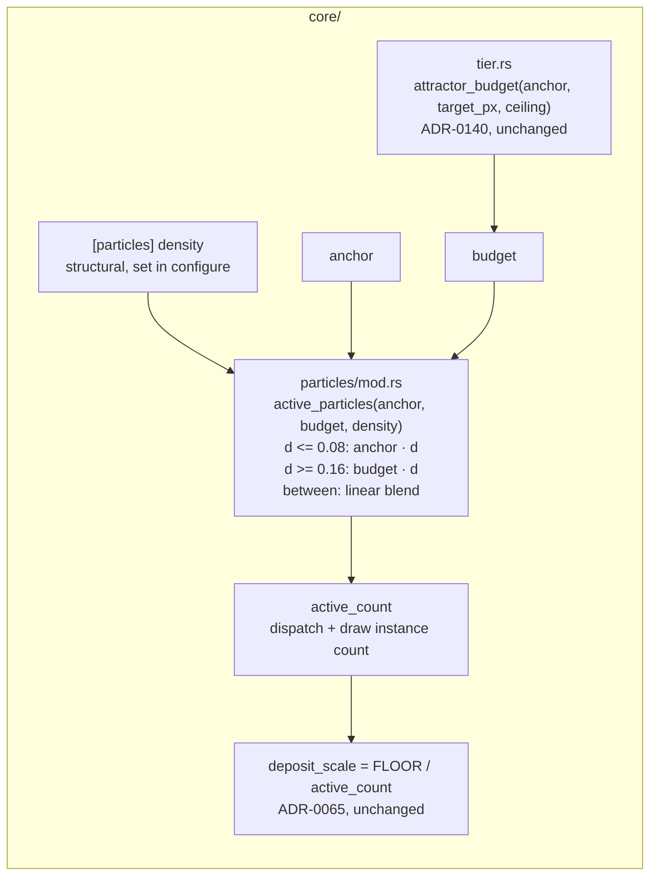

# 0183 — A low density is a trace count

> **Status:** draft
> **Created:** 2026-09-14
> **Owner skill(s):** `dev`, `human`
> **Related ADRs:** [0195](../adrs/0195-a-low-density-is-a-trace-count-and-the-law-scales-only-a-cloud.md) (proposed),
> [0140](../adrs/0140-a-sample-budget-is-a-density-against-the-render-target.md),
> [0069](../adrs/0069-the-attractor-trades-sample-count-for-trace-length.md),
> [0065](../adrs/0065-the-attractor-deposit-is-normalized-by-particle-count.md)
> **Closes:** design-backlog 0186

## TL;DR

An attractor preset at `[particles] density = 0.02` draws 3,000 trajectories at a 640x360 `Rich`
window, 12,000 at a 1080p window and 27,000 under a 1080p `--render`, each at a matching fraction of
the light. For a cloud that is ADR-0140 working as intended. For the ten trace worlds, whose look
*is* the count, it is a different picture on every display. This plan resolves the drawn count
against the tier's **anchor** at or below `density = 0.08` and against ADR-0140's budget at or above
`0.16`, blending linearly between the two (ADR-0195). A trace draws the count its author picked at
every size, a cloud is untouched, and no committed baseline moves. The first visible change is
`fragment_sumi` in a maximized `Rich` window reading as the calligraphy it reads as in a small one.

## Context & problem

Backlog 0186 has the finding and ADR-0195's Context has the arithmetic. Three facts shape this plan:

- **The quantity is invisible at the size every test runs at.** Goldens are `Floor` at 128x128,
  sanity is 96x96, and `Floor`'s live ceiling is its anchor. At all of these the budget equals the
  anchor and the law is a no-op. A test for this has to be written at a target above `REFERENCE_PX`
  (230,400 px) at `Rich`, or with the offline ceiling. Any test written at the usual sizes passes
  before and after the fix and proves nothing.
- **The count is resolved in two places in the scene, and both need the anchor.**
  `AttractorScene::set_target_size` calls `active_particles(self.budget, self.density)` after moving
  the budget, and `configure` calls it again when a preset switch sets `density`. The scene already
  stores `anchor` (it is the lower clamp ADR-0140 passes to `attractor_budget`). So the resolution
  gains one argument and neither call site needs new state.
- **The two stale preset headers become true rather than wrong.** `attractor_thomas.toml`'s *"1 000
  particles at the floor tier, 3 000 at rich"* and `fragment_sumi.toml`'s *"~1000 particles"* are the
  `Floor` and `Rich` anchor counts, and after the fix they hold at every size. What does go stale is
  the reader prose that promises the opposite. `presets/README.md` says *"`density = 0.02` is 1 000
  points on one and 3 000 on the other in a small window, and proportionally more in a big one"*, and
  its blockquote says *"a preset tuned in a small window keeps its look at 1080p rather than thinning
  out"* about the cloud case alone.

## Decision

Take ADR-0195: a transition band `TRACE_DENSITY = 0.08` to `CLOUD_DENSITY = 0.16`, with the effective
budget blended linearly from anchor to budget across it. We rejected retuning the trace presets per
display (ADR-0140's rejected per-preset duty, and a preset can only be tuned for one display), a
single threshold (a 4x-18x step in count at one density value), a per-preset scaling key (a name
whose correct value the density already implies for every shipped world) and a power law (never
exactly fixed for a trace).

## Architecture diagram



## Implementation phases

### Phase 1 — The count resolves against the anchor for a trace, proven at a size the law reaches

- **Owner skill:** dev
- **What:** `active_particles` takes the anchor and resolves ADR-0195's effective budget. Both call
  sites pass `self.anchor`. `TRACE_DENSITY` and `CLOUD_DENSITY` are named constants beside
  `MIN_PARTICLE_DENSITY`, with a doc comment that gives the formula, the two exact arms, the band's
  steepness and why the boundary sits where the authored population leaves a gap (the mechanism, not
  the decision record, per ADR-0127). The outer arms keep today's `f32` expression verbatim, so the
  cloud arm and the `budget == anchor` case are exact rather than within a rounding.
- **Files touched:** `core/src/render/scenes/particles/mod.rs` (`active_particles`, its two call
  sites, the two constants); GPU-free unit tests beside `active_particles`; the existing built-scene
  test `the_render_path_resolves_a_larger_budget_than_a_window_does` in
  `core/src/render/scenes/mod.rs` (its `resolved` closure already builds the attractor at 1920x1080
  under both ceilings), or a sibling beside it, extended with an active-count read. Add a `#[cfg(test)]` hook
  beside `sample_budget` if the count is otherwise unreachable, and keep it `cfg(test)` for the
  reason that function's doc gives.
- **Done when:**
  - **A trace is a fixed count, at a size the old law scales.** For `density` in
    `{0.0005, 0.006, 0.02, 0.06, 0.08}`, the resolved count at 640x360, 1280x720, 1920x1080 and
    3840x2160, under both `Rich` ceilings and both `Floor` ceilings, equals
    `(anchor as f32 * density).round() as u32` (floored at 1). Named values: `density = 0.02` gives
    **3,000** at `Rich` and **1,000** at `Floor` at every one of those sizes. The same assertion fails
    on today's tree at 1920x1080 `Rich` (12,000 live, 27,000 offline), which is the non-vacuity.
  - **A cloud is untouched.** For `density` in `{0.16, 0.18, 0.4, 0.5, 1.0}` at every size and
    ceiling above, the count equals today's `(budget as f32 * density).round() as u32`. Checked
    against the old expression evaluated in the test, not against a frozen number.
  - **Where the budget is the anchor, nothing changed at any density.** At 128x128 and 96x96 at both
    tiers and both ceilings, and at 1920x1080 `Floor` live, the count equals today's for a sweep of
    `density` from `MIN_PARTICLE_DENSITY` to `1.0` in steps of `0.0005`, including every value inside
    the band.
  - **Continuous and monotone.** Over the same sweep at 3840x2160 `Rich` offline (the steepest case,
    `budget / anchor = 18`), the count never decreases as `density` rises. At `0.08` and `0.16` it
    equals the adjacent arm's value exactly. The count at `0.16` is **432,000** and at `0.08` is
    **12,000**.
  - **The built scene agrees with the function.** In the GPU test, an attractor scene configured
    with `density = 0.02` and sized to 1920x1080 reports an active count of 3,000 under both
    `SampleBudget::Live` and `SampleBudget::Offline` at `Rich`, and its `sample_budget()` still
    reports 600,000 and 1,350,000. The budget is unchanged; only the drawn count moved.
  - `cargo nextest run --workspace` moves **no golden and no sanity baseline, with nothing blessed**.
    Every baseline is `Floor` at or under `REFERENCE_PX`, so property 3 is the reason, and a baseline
    that moves is a stop, not a re-bless. `node scripts/check-backlog-claims.mjs` is reported by exit
    code. Entry 0186's first probe matches `active_particles.self\.budget` and is expected to go red
    on delivery. `dev` reports it and leaves the entry alone.

### Phase 2 — The reader, the schema doc and the two headers say what a density buys

- **Owner skill:** dev
- **What:** Every prose surface that states how `density` scales gains the trace half beside the
  cloud half, count-free where possible. The `[particles] density` key's schema doc sentence names
  the band, and the editor schemas regenerate from it. The two preset headers get a comment-only edit
  saying the counts they quote hold at every window size.
- **Files touched:**
  - `presets/README.md`: the `### [particles] — for attractor` section, meaning the blockquote that
    begins *"`density` is a fraction of a budget that moves with the window"*, the bullet ending
    *"proportionally more in a big one"*, and the `density` row of the key table. Hand-written prose
    outside the generated params block.
  - `core/src/preset/schema/raw/particles.rs`: the `density` `KeyDesc` `doc`, then
    `presets/schema/*.schema.json` and `.taplo.toml` regenerated with `RLX_UPDATE_PRESET_SCHEMA=1`,
    never hand-edited.
  - `docs/capturing.md`: the `--render` budget table's surrounding prose. A density at or below the
    trace boundary draws the same count under `--render` as in a window of the same tier.
  - `docs/nfr.md`: the tier paragraph that explains ADR-0140's law.
  - `presets/attractor_thomas.toml`: the *"At the full 50 000 particles"* sentence becomes a
    statement about `density = 1.0`, and the ladder sentence says its counts hold at any window
    size. **Comments only.**
  - `presets/fragment_sumi.toml`: the *"~1000 particles"* header clause gains the tier and the
    size-independence. **Comments only.**
- **Done when:**
  - The README states both halves. Above the cloud boundary a density is a proportion of a budget
    that grows with the window. At or below the trace boundary it is a count that does not, and the
    count at each tier is `anchor * density`. The band between is named as scaling partly with the
    window.
  - No prose touched by this phase quotes a drawn count for a trace density as varying with window
    size. `grep -n "proportionally more in a big one" presets/README.md` returns nothing.
  - `presets/attractor_thomas.toml` and `presets/fragment_sumi.toml` render **byte-identically** to
    before the phase: the golden, sanity and per-preset sweeps pass with nothing blessed, which is
    the evidence that only comments moved.
  - `core/tests/preset_schema.rs` passes against the regenerated schemas.
  - `node scripts/check-doc-links.mjs`, `node scripts/check-reader-prose.mjs` and
    `node scripts/toc.mjs --check` exit 0.

### Phase 3 — The look gate at the size the defect lives at

- **Owner skill:** human
- **What:** A judgement session, in the `preset-author` lane or by the owner, on whether a trace now
  reads as the same drawing at every size. Render `fragment_sumi`, `attractor_thomas` and
  `attractor_lorenzgallery` at 640x360 and 1920x1080 `Rich`, as a still (live ceiling) and as a short
  `--render` (offline ceiling), on the tree before Phase 1 and after it. Put them side by side.
  Include `attractor_leviathan` and `attractor_fernmono` (the cloud and the sparsest figure) as the
  control for "a cloud did not move".
- **Files touched:** none committed. Captures land under `target/`, and the verdict goes into the
  implementation log.
- **Done when:**
  - The owner records a verdict for each trace world: whether the 1080p after-frame reads as the same
    pen drawing as the 640x360 frame, where the 1080p before-frame read as a denser, dimmer fog.
  - The two cloud controls are recorded as unchanged between before and after at 1080p.
  - **If a trace reads wrong at 1080p after the fix** (for example, strokes now read thin or faint
    against a large frame), the plan stops here with the verdict in the log. ADR-0195 is not accepted
    at close, and the finding goes back to `architect`. A fixed count may be necessary without being
    sufficient, and that is a design question, not a retune.

## Data shapes

```rust
// illustrative — not the final code
pub const TRACE_DENSITY: f32 = 0.08;
pub const CLOUD_DENSITY: f32 = 0.16;

fn active_particles(anchor: u32, budget: u32, density: f32) -> u32 {
    let drawn = if density <= TRACE_DENSITY {
        (anchor as f32 * density).round()
    } else if density >= CLOUD_DENSITY {
        (budget as f32 * density).round() // today's expression, verbatim
    } else {
        let w = (density - TRACE_DENSITY) / (CLOUD_DENSITY - TRACE_DENSITY);
        let effective = anchor as f32 + (budget - anchor) as f32 * w;
        (effective * density).round()
    };
    (drawn as u32).clamp(1, budget)
}
```

`budget >= anchor` holds by `attractor_budget`'s own lower clamp, so `budget - anchor` cannot
underflow. The blend arm's `f32` product stays exact enough: `effective * density` at the 4K offline
ceiling is below 432,000, well inside `f32`'s 2^24 integer range.

## Risks & open questions

- **A fixed count may not be the whole look.** The stroke's screen width comes from its NDC `size`,
  and each particle's deposit is normalized by count rather than by covered area. So a fixed count at
  a larger target should draw the same fraction of the frame at the same per-pixel level. That is
  reasoning from the draw, not a measurement, and Phase 3 is where it is judged.
- **A `--render` test or report at a large target on a trace preset moves a number.** Every such
  count is a comparison of one run against another (`shot_cli`'s byte-identical determinism), not
  against a frozen figure. That was checked by reading, not by running, so an assertion Phase 1's
  run turns red is a named stop in the log.
- **The band has no occupant, so it is untested by content.** Phase 1 asserts its arithmetic. How a
  world authored at 0.12 looks at two sizes is unknown, and ADR-0195's Negative section says so.
- **`nfr.md`'s pre-ADR-0140 frame-time readings stay stale either way.** This plan changes cost only
  for sparse worlds, and in the cheaper direction. Re-taking them is already owed to
  `docs/on-device-validation.md` and is not taken here.

## What this plan does NOT do

- **It does not change ADR-0140's budget, its ceilings or `REFERENCE_PX`.** `attractor_budget` and
  every tier constant are untouched. So is `shot --render`'s header, which prints the budget.
- **It does not retune any preset.** No density, `brightness`, `fade` or `size` value changes. The
  two header edits are comments.
- **It does not add a `[particles]` key** or a load warning for a density inside the band. A band
  value is legal and means something.
- **It does not touch `swarm` or `emitter`**, which have no `density` key.

## Implementation log

> Written by `dev` — one row per phase as that phase's commit lands, and the close block after the
> last one. **The phases above are the contract; everything here is what happened.**
> **Observations, never conclusions:** this says where to look, architect decides how it went.
> No per-criterion pass list, no self-assessment, no narrative — but a deviation from the plan or
> an unmet done-when is always disclosed. Stays shorter than `## Implementation phases` above.

**Lane:** _(`main` directly, or the worktree path plus its branch)_

| phase | owner | state | commit |
|---|---|---|---|
| 1 — The count resolves against the anchor for a trace | dev | not started | |
| 2 — The reader, the schema doc and the two headers | dev | not started | |
| 3 — The look gate at the size the defect lives at | human | not started | |

### Notes

### Close triggers

- **`presets/` touched:**
- **Plan header `Closes:`**
- **What shipped:**
- **Operator docs touched:**
- **Backlog probes (`node scripts/check-backlog-claims.mjs`):**
- **Full suite:**
- **Outstanding `human` phases:**

## Followups (after this lands)
