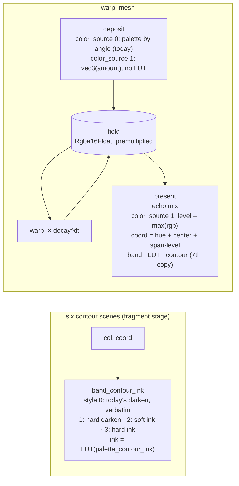

# 0184 — Limited ink: a contour that is an ink, and a warp field that bands

> **Status:** in-progress (2026-09-14)
> **Created:** 2026-09-14
> **Owner skill(s):** `dev`, `human`
> **Related ADRs:** [0197](../adrs/0197-the-contour-can-be-an-ink-and-the-warp-field-can-be-coloured-by-its-level.md) (proposed),
> [0133](../adrs/0133-the-band-contour-fires-where-the-ink-changes.md),
> [0138](../adrs/0138-limited-ink-is-a-supported-palette-class-defined-at-the-draw-seam.md),
> [0078](../adrs/0078-banding-is-a-palette-coordinate-operation.md),
> [0105](../adrs/0105-the-mark-roster-becomes-a-fullscreen-distance-field.md)
> **Closes:** design-backlog 0140, design-backlog 0146

## TL;DR

A limited-ink look has two walls today. The band contour can only be a soft darkening toward black,
so on `shape_contourmono` it takes the frame from 9 distinct colours to 684. And `warp_mesh` colours
its light at deposit time, before the feedback loop, so `palette_steps` cannot band the structure
the loop builds. This plan does both halves of ADR-0197. First, the contour gains a Structural
`palette_contour_style` (soft or hard, black or ink) and a `palette_contour_ink` coordinate on all
six scenes where it is live. Second, `warp_mesh` gains a Structural `color_source`: at `1`, the
deposit writes uncoloured light and the present pass colours the field by its own accumulated level.
Both default to today's arithmetic, and nothing blesses. The first visible change is a hard red key
on `shape_contourmono` that adds no colour the frame did not already have. The second is a mono
`warp_mesh` world whose decay contours band into a ladder marching outward.

## Context & problem

The two backlog entries and ADR-0197's Context carry the measurements. What shapes the phases:

- **The contour is six copies, and the drift test watches four.** `fn band_contour` is
  byte-identical in `fragment_field.rs`, `reaction_diffusion.rs`, `shape_field.rs`,
  `warp_mesh/shaders.rs`, `analytic_field/shader.rs` and `cellular/shader.rs` (checked 2026-09-14).
  `the_contour_reaches_the_fragment_sites_and_not_the_vertex_one` in `core/src/render/palette.rs`
  iterates only the first four, which is ADR-0133's Outcome recurring. This plan changes the
  function's signature, so the drift test has to cover every copy before the change, or the change
  can drift on arrival.
- **Every contour site packs its palette controls differently.** `fragment_field` puts the contour in
  `params.d.w`, `analytic_field` in `c.w`, `cellular` in `b.y`, `reaction_diffusion` in `d.y`, and
  `warp_mesh`'s deposit in `d.z` with `d.w` unused. Two more floats per site means a free slot where
  one exists and an appended `vec4` where one does not. Each is a WGSL struct, a Rust POD and a
  `min_binding_size`.
- **The reader is already behind the tree.** `docs/preset-palettes.md`'s scoping table lists
  `palette_contour` as live on four scenes and omits `analytic_field` and `cellular`, which both
  carry it. `palette.rs`'s module docs say contours reach "the fragment field and reaction-diffusion".
  The docs phase repairs both, because it rewrites the same table.
- **There is already a plateau-palette harness.** `core/tests/palette_contour.rs` builds one-run,
  two-run and smooth palettes on `fragment_field` and counts darkened pixels. The contour's new
  behaviour is asserted by extending it, not by building a second one.
- **The field's working level is not known.** `color_span` is declared `0..1`. Whether a full
  palette cycle fits in that span depends on how high the accumulated level typically sits under a
  preset's `deposit` and `decay`, and nothing has measured that. Phase 2 measures it before the look
  gate judges anything.

## Decision

Take ADR-0197 as written. We rejected a hard contour without an ink (the look that raised backlog
0140 wants its key in the palette's red), an ink derived from the two adjacent bands (a darker
neighbour on a two-ink boundary draws nothing visible), composing the two warp colour paths
(every intermediate is a mixture of inks, and a coloured deposit makes the level hue-dependent), and
a second level texture beside the coloured field (twice the field for a composition already
rejected).

## Architecture diagram



## Implementation phases

### Phase 1 — The contour copies are all watched, then the contour learns a style and an ink

- **Owner skill:** dev
- **What:**
  - **First, as its own commit inside the phase:** extend
    `the_contour_reaches_the_fragment_sites_and_not_the_vertex_one` (and
    `every_wgsl_sample_site_carries_the_same_banding_expression`, if it also skips a `band_coord` copy)
    to every scene that carries the function, `analytic_field/shader.rs` and `cellular/shader.rs`
    included. The test must pass on the unchanged tree.
  - **Then:** the canonical WGSL becomes `band_contour_ink(col, t, steps, amount, style, ink_t,
    lut_a, lut_b, lut_samp, mix_ab) -> vec3<f32>`, per ADR-0197 Decision 1, at all six sites in one
    commit. The early-out and the equality test stay first, ahead of every sample. The style-0 arm
    returns `col * (1.0 - clamp(amount, 0.0, 1.0) * (1.0 - smoothstep(0.0, w, d)))`, today's
    expression. `palette_contour_style` (Structural, `0`..`3`, rounded and decoded on the CPU like
    `echo_orient`) and `palette_contour_ink` (Modal, `0`..`1`) join `common::PaletteParams`, the
    `PALETTE_PARAMS` test roster, the source-text roster in `core/tests/preset.rs`, and the `PARAMS`
    of exactly the six contour scenes. Each site's uniform gains the two values. `palette.rs`'s module
    docs name the six scenes and the four styles.
  - The generated reference and the editor schemas regenerate in the same commit
    (`RLX_UPDATE_PARAM_REFERENCE=1`, `RLX_UPDATE_PRESET_SCHEMA=1`), never hand-edited.
- **Files touched:** `core/src/render/palette.rs` (canonical WGSL const, drift tests, module docs,
  CPU `band_contour_style` decode beside `band_contour`); `core/src/render/scenes/common.rs`;
  `fragment_field.rs`, `reaction_diffusion.rs`, `shape_field.rs`, `warp_mesh/{shaders,encode,mod}.rs`,
  `analytic_field/{shader,mod}.rs`, `cellular/{shader,mod}.rs` (WGSL copy, call site, uniform slot,
  `PARAMS`); `core/tests/preset.rs` (roster); `core/tests/palette_contour.rs` (new assertions);
  `presets/README.md` generated params block; `presets/schema/*.schema.json`, `.taplo.toml`.
- **Done when:**
  - **Every copy is watched.** The drift test names every file under `core/src/render/scenes/` whose
    source contains `fn band_contour_ink`, and no such file is outside its list. That is checked by a
    scan in the test, not by a hand-kept count, so a seventh site cannot be missed the way two were.
  - **Style 0 is today, at every site.** The golden, sanity, reactivity, animation and distinctness
    suites pass with **nothing blessed**, including `fixtures/composite_symmetry.toml` (`0.4`) and
    `fixtures/shape_field.toml` (`0.7`), the two baselines that render a non-zero contour. The
    existing `palette_contour.rs` tests pass unchanged.
  - **A hard contour adds no colour at full strength.** On `palette_contour.rs`'s two-run plateau
    probe at `palette_contour = 1.0`, the set of distinct RGB values in the style-1 capture is a
    subset of the set in the same probe's `palette_contour = 0` capture plus pure black. The style-0
    capture of the same probe has values outside that set, which is the non-vacuity.
  - **A hard contour draws where the soft one does and nowhere else.** The pixels a style-1 capture
    darkens relative to contour-off are a non-empty subset of the pixels the style-0 capture darkens.
    Inside a single plateau run, style 1 still darkens nothing (ADR-0133's rule holds for every
    style).
  - **An ink contour draws in the palette's colour.** On a three-run plateau probe (two inks plus a
    third, distinct ink that also renders as its own run), style 3 at `palette_contour = 1.0` with
    `palette_contour_ink` at the third ink's coordinate changes every pixel style 0 would darken to
    exactly the code value the third ink's own run renders at in the same capture, and changes no
    other pixel. With `palette_mix = 1` against a B palette carrying a different ink at that
    coordinate, the line takes the B ink's code value instead.
  - **The scoping holds.** Setting `palette_contour_style` on a scene outside the six
    (`attractor`, say) produces the unknown-parameter warning, not a silent no-op. This is the trap
    `palette_contour` itself has, and the new names do not inherit it.
  - `core/tests/preset_schema.rs` passes against the regenerated schemas.
  - Recorded, not asserted: the backlog-0140 reading repeated on `shape_contourmono` at 640x360,
    fully driven. Report distinct colours at `palette_contour_style` 0, 1 and 3 with the shipped
    `palette_contour = 1.0`, beside the entry's 9 and 684, with the adapter named.

### Phase 2 — `warp_mesh` colours by its own level

- **Owner skill:** dev
- **What:** `color_source` (Structural, `0`..`1`, rounded) joins `warp_mesh`'s `PARAMS` and is packed
  into the deposit uniform and the present uniform. At `1`, the deposit returns
  `vec4(vec3(amount), clamp(amount, 0, 1))`, with no LUT sample. The present pass gains the two LUTs
  and the LUT sampler in its bind group. After the echo mix, it computes
  `level = max(c.r, c.g, c.b)` and `coord = base + color_span * level` (`base` being
  `hue + color_center`, as the deposit packs today), bands it, samples A/B, applies `saturation` and
  `band_contour_ink` (a seventh copy, which Phase 1's scan picks up without an edit), and writes
  `ink * coverage` with today's coverage alpha. At `0`, both passes take today's arm through a branch
  on the uniform, and every sample in the present pass stays `textureSampleLevel`.
- **Files touched:** `core/src/render/scenes/warp_mesh/shaders.rs` (`DEPOSIT_SHADER`,
  `PRESENT_SHADER`, `DepositUniform`, `PresentUniform`); `warp_mesh/encode.rs` (packing);
  `warp_mesh/resources.rs` (present bind group layout and both bind groups gain the LUT views and
  sampler the deposit already owns); `warp_mesh/mod.rs` (`PARAMS`, field); a new
  `core/tests/fixtures/warp_mesh_ladder.toml` (a mono plateau palette, `color_source = 1`, a steady
  central deposit, a small outward zoom, a decay slow enough to leave several rungs); tests in
  `core/tests/warp_mesh.rs`; the generated reference and schemas, regenerated.
- **Done when:**
  - **Mode 0 is today.** Every `warp_mesh` golden (`warp_mesh`, `warp_mesh_shader`,
    `warp_mesh_quantize`, `warp_mesh_lit_backdrop`, `warp_mesh_milk`, `warp_mesh_stroke`, and the
    three `composite_warp_*`) passes with nothing blessed.
  - **The level is measured before it is judged.** A test on the ladder fixture (named
    `#[ignore]`d measurement or printed output, per ADR-0071) reports the distribution of
    `max(rgb)` over pixels with coverage above one half, at 640x360 after warm-up: median and p95,
    with the adapter named. The log records whether a full palette cycle fits inside
    `color_span <= 1` at that working level. If it does not, the phase stops with the reading, and
    the repair (a documented gain on the level, per ADR-0197's Negative) goes back to `architect`
    before Phase 5.
  - **The field bands.** Along a ray from the deposit centre to the frame edge on the ladder
    fixture's capture, every pixel whose coverage is 1 is exactly one of the palette's ink code
    values, and the ray crosses between inks at least three times. The same capture at
    `color_source = 0`, same palette and steps, has pixels on that ray that are none of the inks,
    which is backlog 0146's smear and the non-vacuity.
  - **The echo colours once.** With `echo_alpha = 0.5` on the fixture, every pixel whose coverage is
    1 is still exactly one of the palette's inks. The level is mixed first and coloured after, so no
    blend of two inks can appear. At `color_source = 0` the same echo produces blended values, which
    is the non-vacuity.
  - Motion (whether the rungs march outward) is judged at Phase 4, not asserted here. A steady
    deposit under a steady zoom converges to a stationary radial profile, so whether the ladder moves
    is a property of an authored, pulsed deposit and not of the mechanism.
  - **A converted preset is untouched.** `warp_mesh_milk` and `warp_mesh_shader` pass unblessed.
    Nothing in `milkconv/` emits `color_source`.
  - Recorded, not asserted (ADR-0071): the frame-time cost of `color_source = 1` against `0` on the
    ladder fixture at 1920x1080, contour off and on, interleaved in one process, with the adapter
    named.

### Phase 3 — The palette reader says what a contour can be and where the warp field takes its colour

- **Owner skill:** dev
- **What:** The hand-written palette docs catch up with both halves and with the scoping drift they
  already carried.
- **Files touched:** `docs/preset-palettes.md` (the `palette_contour` rows of the parameter table;
  `## Hard bands` gains the four styles, the ink coordinate, and the warning that a hard line
  aliases on a smooth palette; `### The scene scoping` table gains `analytic_field` and `cellular` and
  names the two new parameters' reach; a short section on `warp_mesh`'s `color_source` placed beside
  the `shape_field` coordinate section, naming the level, the wrap past `1 / color_span` and the
  fading fringe); `presets/README.md` (the hand-written `warp_mesh` prose that says the palette is
  laid down by angle); `docs/presets.md` only if it restates the contour's colour.
- **Done when:**
  - The scoping table matches the tree: every scene with a `band_contour_ink` copy is marked live for
    all three contour parameters, and no other scene is.
  - No reader document touched says the contour is only a darkening, or that `warp_mesh`'s palette
    coordinate is only its deposit angle.
  - `node scripts/check-doc-links.mjs`, `node scripts/check-reader-prose.mjs` and
    `node scripts/toc.mjs --check` exit 0. A new heading moves the contents block through `toc.mjs`,
    never by hand.

### Phase 4 — The look gate: a hard key on the mono print, and a ladder world

- **Owner skill:** human
- **What:** A `preset-author` session, in the Plan 0121 Phase 6 shape, proves the surface on content.
  `shape_contourmono` is re-authored onto whichever contour style the author judges right, and its
  header's ADR-0133 paragraph is replaced by what the style now does. A new mono `warp_mesh` world is
  authored on `color_source = 1` as the op-art ladder backlog 0146 asked for. Both land under
  ADR-0081 if the author approves them, or are recorded as rejected with the reason.
- **Files touched:** `presets/shape_contourmono.toml`; one new `presets/warp_*.toml` (the author names
  it); nothing in engine code.
- **Done when:**
  - The author records a verdict on `shape_contourmono` at the chosen style: whether the key reads as
    a drawn ink edge and the frame reads as a limited-ink print. The distinct-colour reading at
    640x360 goes in the log beside Phase 1's.
  - The author records a verdict on the ladder world: whether its bands read as decay contours
    marching outward. It includes the fringe question ADR-0197 leaves to this gate, whether the fading
    outer rungs read as the ladder dissolving or as shading.
  - Any preset that lands passes the five behavioural gates, and its `drive` and `rate` readings are
    in the log against family neighbours.
  - **If the fringe reads as shading**, the verdict goes back to `architect` as a named finding (a
    coverage threshold in level mode is the obvious candidate), and ADR-0197 is accepted at close
    with that recorded rather than silently tuned around.

## Data shapes

```wgsl
// illustrative — not the final text
fn band_contour_ink(col: vec3<f32>, t: f32, steps: f32, amount: f32, style: f32, ink_t: f32,
                    lut_a: texture_2d<f32>, lut_b: texture_2d<f32>, lut_samp: sampler,
                    mix_ab: f32) -> vec3<f32> {
    let f = t * steps;
    let w = max(fwidth(f), 1e-5);
    if (steps < 1.5 || amount <= 0.0) { return col; }
    // ...ADR-0133's lo/hi equality test, unchanged; equal -> return col...
    let d = min(fract(f), 1.0 - fract(f));
    if (style < 0.5) {
        return col * (1.0 - clamp(amount, 0.0, 1.0) * (1.0 - smoothstep(0.0, w, d)));
    }
    // `style` arrives rounded to 0..3 from the CPU, so the comparisons are exact.
    let hard = style == 1.0 || style == 3.0;
    let cover = select(1.0 - smoothstep(0.0, w, d), f32(d < w), hard);
    let ink_lut = mix(
        textureSampleLevel(lut_a, lut_samp, vec2<f32>(ink_t, 0.5), 0.0).rgb,
        textureSampleLevel(lut_b, lut_samp, vec2<f32>(ink_t, 0.5), 0.0).rgb,
        clamp(mix_ab, 0.0, 1.0)
    );
    let ink = select(vec3<f32>(0.0), ink_lut, style >= 2.0);
    return mix(col, ink, clamp(amount, 0.0, 1.0) * cover);
}
```

## Risks & open questions

- **A shader compiler contracts the style-0 arm differently from the old `col * band_contour(...)`
  call.** The expression is textually the same product, but it moves from a returned scalar to an
  inline product, and an FMA contraction could move a code value. The golden tolerance absorbs
  rasterizer-scale drift. A moved golden is still a stop to name, not a re-bless.
- **Uniform growth on six scenes collides with a live lane.** Plan 0175 touches no scene uniform, so
  there is no collision with the current roster, but any plan that re-lays out one of these six
  uniforms must sequence against Phase 1.
- **The level's working range may make `color_span` too small.** Phase 2 measures it and stops if so.
  That is priced, not hedged.
- **Level mode reads the draw layer's light too.** A native preset with waveforms or shapes in its
  draw layer contributes coloured light, and `max(rgb)` counts it at its intensity. No native preset
  ships a draw layer, but the docs phase says what happens.
- **Composite remaps after level colouring make non-ink values** (`brighten`'s square root,
  `solarize`). That is an author's choice on a flag, and it is stated rather than prevented.

## What this plan does NOT do

- **It does not change where the contour fires.** ADR-0133's equality rule is untouched for every
  style.
- **It does not give contours to the vertex-stage or CPU-sampled scenes** (attractor, swarm, emitter,
  line scenes). ADR-0078's scoping stands.
- **It does not anti-alias a hard contour** or add a line-width parameter. The hard footprint is the
  soft one's.
- **It does not compose the two `warp_mesh` colour paths**, and it does not add a second field
  texture.
- **It does not touch `milkconv/`** or a converted preset's colours.
- **It does not retune any shipped preset other than through Phase 4's authored session.**

## Implementation log

> Written by `dev` — one row per phase as that phase's commit lands, and the close block after the
> last one. **The phases above are the contract; everything here is what happened.**
> **Observations, never conclusions:** this says where to look, architect decides how it went.
> No per-criterion pass list, no self-assessment, no narrative — but a deviation from the plan or
> an unmet done-when is always disclosed. Stays shorter than `## Implementation phases` above.

**Lane:** _(`main` directly, or the worktree path plus its branch)_

| phase | owner | state | commit |
|---|---|---|---|
| 1 — The contour copies are all watched, then the contour learns a style and an ink | dev | not started | |
| 2 — `warp_mesh` colours by its own level | dev | not started | |
| 3 — The palette reader says what a contour can be and where the warp field takes its colour | dev | not started | |
| 4 — The look gate: a hard key on the mono print, and a ladder world | human | not started | |

### Notes

### Close triggers

- **`presets/` touched:**
- **Plan header `Closes:`**
- **What shipped:**
- **Operator docs touched:**
- **Backlog probes (`node scripts/check-backlog-claims.mjs`):**
- **Full suite:**
- **Outstanding `human` phases:**

## Followups (after this lands)
