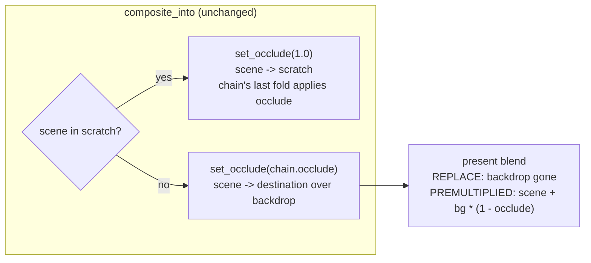

# 0185 — A fullscreen field lets the sky through with no post stage

> **Status:** in-progress
> **Created:** 2026-09-14
> **Owner skill(s):** `dev`
> **Related ADRs:** [0201](../adrs/0201-a-fullscreen-scene-presents-premultiplied-over-the-backdrop.md) (proposed),
> [0026](../adrs/0026-full-composite-coverage-fullscreen-scenes.md), [0056](../adrs/0056-additive-scenes-emit-premultiplied-alpha.md),
> [0085](../adrs/0085-how-much-a-scene-occludes-the-backdrop-is-one-number.md)
> **Closes:** design-backlog 0206

## TL;DR

`occlude = 0` is documented as "lets the sky through everywhere". On a fullscreen field with no
`[post]` stage it lets nothing through, because the field's pipeline blends with `REPLACE` and
overwrites the backdrop before `occlude` is read. The defect is wider than the backlog entry says:
**four** scenes have it, `fragment_field`, `analytic_field`, `shape_field` and `shape_collage`. This
plan gives all four the `PREMULTIPLIED_ALPHA_BLENDING` present that `reaction_diffusion`,
`cellular`, the attractor and `warp_mesh` already use. The renderer already hands a scene a literal
`occlude = 1` whenever a stage owns the seam, and at alpha 1 a premultiplied blend is exactly a
replace. So every frame that renders correctly today renders byte-identically after the change, and
only the broken path changes.

## Context & problem

`composite_into` (`core/src/render/composite.rs`) already decides who owns the backdrop seam. When
the chain routes the scene into a scratch (a stage is active, or an `over` layer is live), the scene
gets `set_occlude(1.0)` and the chain's last fold applies `occlude`. When the chain is empty, the
scene draws straight onto the backdrop and gets `set_occlude(chain.occlude())`, so the scene owns the
seam. `Scene::set_occlude`'s doc spells out that split.

The scenes' side of that contract is their present blend. It has to turn alpha into
`scene + bg * (1 - alpha)`, which is `PREMULTIPLIED_ALPHA_BLENDING`. Four fullscreen scenes write
`occlude` into their alpha (each shader comment says so), but their pipeline is built with
`wgpu::BlendState::REPLACE`:

| Scene | Pipeline built at | Alpha written |
|---|---|---|
| `fragment_field` | `core/src/render/scenes/fragment_field.rs`, `parts.finish(.., REPLACE, "fragment-field")` | `params.d.y` = occlude |
| `analytic_field` | `core/src/render/scenes/analytic_field/mod.rs`, `REPLACE, "analytic-field"` | occlude |
| `shape_field` | `core/src/render/scenes/shape_field.rs`, `REPLACE, "shape-field"` | `params.d.x` = occlude |
| `shape_collage` | `core/src/render/scenes/shape_collage.rs`, `REPLACE` | `params.d.x` = occlude |

Under `REPLACE` the alpha is written into the target and never read. Nothing downstream composites
the target's alpha on the no-stage path. The tonemap passes it through.

Backlog 0206 found this on `fragment_field` and `analytic_field`. The parity test
`occlude_behaves_as_it_does_on_fragment_field` (`core/tests/analytic_field.rs`) pins the two
systems together **including on the broken path**: its doc says "Both draw with a replacing blend, so
the sky under them does not show at either end". The entry frames the fix as "a chain question". It
is not. The chain has already answered, through the value it hands `set_occlude`. The scene just
cannot act on the answer.

`Scene::set_occlude`'s own doc is also wrong. It lists "reaction-diffusion, attractor, fragment
field" as the scenes that present premultiplied, and `fragment_field` does not.

**Which shipped presets move: none.** Six presets bind `occlude`. Four are on scenes that already
present premultiplied or additively (`attractor_lorenzknot`, `lsystem_icecrystal`,
`spectrum_radialbloom`, `swarm_murmuration`). The two on affected scenes, `fragment_etchingplate`
and `shape_strataheart`, both bind `occlude = "1.0"`. Every other preset takes the default, `1.0`.

**Why the change is exact at `occlude = 1`.** The composite target is `Rgba16Float`. Premultiplied
blending computes `src.rgb * 1 + dst.rgb * (1 - src.a)`. With `src.a` exactly `1.0` the destination
factor is exactly `0.0`, and `dst.rgb * 0.0` is `0.0` for a finite backdrop. The colour result is
`src.rgb`, which is what `REPLACE` writes. The alpha result is `1 + dst.a * 0`, which is `1.0` and
also what `REPLACE` writes. On the scratch path the renderer hands `1.0` unconditionally, so that
path is unchanged too.

## Decision

`fragment_field`, `analytic_field`, `shape_field` and `shape_collage` build their present pipeline
with `wgpu::BlendState::PREMULTIPLIED_ALPHA_BLENDING`, the same blend as the other scenes that
present over the backdrop (ADR-0026). No change to the chain, `composite_into` or `set_occlude`'s
routing.

We rejected three alternatives:

- **The chain selects the scene's blend state.** A pipeline's blend is fixed at construction, so
  this means two pipelines per scene, or a dynamic seam on the `Scene` trait. It buys nothing: the
  chain already passes its decision as `occlude = 1` on the scratch path, and premultiplied blending
  is exact there.
- **The field always renders into an offscreen, and the chain composites it.** That adds a target
  and a pass to the no-stage path, which is the cheapest path the engine has and exists precisely to
  avoid them.
- **Document `[post]` as a precondition of `occlude`.** It leaves an engine-wide parameter that
  does nothing on the simplest preset an author can write, and a parity test pinning the defect.

## Architecture diagram

## Implementation phases

### Phase 1 — The four fields present premultiplied, and the test says so

- **Owner skill:** dev
- **What:** Change the blend in the four constructors. Replace the parity test with one that asserts
  the documented behaviour on **both** paths for **all four** systems: at `occlude = 1` lighting the
  sky moves nothing, and at `occlude = 0` it raises the frame. Keep the existing `occlude_reading`
  helper and its thresholds. Correct `Scene::set_occlude`'s doc list and the stale "this fullscreen
  field is opaque, so it covers the backdrop" comment in `fragment_field.rs`'s `render`.
- **Files touched:** `core/src/render/scenes/fragment_field.rs`,
  `core/src/render/scenes/analytic_field/mod.rs`, `core/src/render/scenes/shape_field.rs`,
  `core/src/render/scenes/shape_collage.rs`, `core/src/render/scenes/mod.rs` (the `set_occlude` doc),
  `core/tests/analytic_field.rs`.
- **Done when:**
  - **The no-stage path adds at `occlude = 0`, on every one of the four systems.** Assert it
    outright: `adds(reading)` (raised fraction above the helper's 0.3) and `covers(reading)` (moved
    under 0.05 at `occlude = 1`), with no stage bound. This fails on the tree before the phase for all
    four, and the log records that.
  - **The stage-active path is unchanged.** The same two assertions pass with `trails` bound, as
    they do today.
  - **The test's doc no longer says the fields replace.** It states the property: the seam belongs
    to the scene with no stage and to the chain with one, and `occlude` means the same on both.
  - **Byte-identical where `occlude = 1`.** `cargo nextest run --workspace` moves **no golden**. The
    arithmetic above makes the blend exact at alpha 1, so any moved baseline is a stop. Name it in
    the log rather than blessing it. It would mean a present that reaches the backdrop with alpha
    below 1 somewhere this plan did not find.
  - The per-preset sweeps pass without retuning.

### Phase 2 — The reader says what the parameter does

- **Owner skill:** dev
- **What:** Check the `occlude` prose against the new behaviour and correct any sentence that
  hedges on a `[post]` stage or names a replacing field. The places to read are `presets/README.md`'s
  "Backdrop occlusion" section (hand-written, outside the generated params block),
  `docs/preset-palettes.md`'s table of what a darkening layer covers per system, and the `occlude`
  mention in `docs/presets.md`. If nothing hedges, the phase is a no-op and the log says so.
- **Files touched:** the three documents above, only if a sentence is wrong.
- **Done when:**
  - `node scripts/check-reader-prose.mjs`, `node scripts/check-doc-links.mjs` and
    `node scripts/toc.mjs --check` exit 0.
  - The generated params reference and `presets/schema/` are **not** regenerated. The `occlude`
    `ParamSpec` doc ("0 lets the sky through everywhere") was already correct, and is now also true.

## Risks & open questions

- **The destination alpha changes where `occlude < 1` with no stage.** Under `REPLACE` the target
  held alpha `occlude`. Under the new blend it holds `occlude + dst.a * (1 - occlude)`, which is `1`
  over the backdrop's opaque clear. The tonemap passes alpha through to the surface. An opaque swap
  chain ignores it. A capture readback or the `--stream` path could see it, so check whether either
  reads alpha. If one does, the new value (opaque) is the correct one for a composited frame.
- **A `[layer]` with `join = "under"` on one of these systems draws after the main scene into the
  same target.** At its default `occlude = 1` that is still an exact replace, unchanged. At
  `occlude = 0` it now adds over the main scene, which is what `occlude` means. No shipped preset
  does this.
- **DX12 WARP pipeline identity (ADR-0058).** That collision was about identical bind-group
  layouts, and this change touches no layout. It is listed because `fragment_field` splits its
  groups specifically to dodge it.
- **Backlog probes.** 0206's probes (`occlude` present in `fragment_field.rs`, the parity test's
  name present in `analytic_field.rs`) go red if the test is renamed. That is delivery, not decay.
  `dev` reports it and leaves the entry for the close.

## What this plan does NOT do

- **It does not change `composite_into`, the post chain, or how `occlude` is routed.**
- **It does not touch scenes that already present premultiplied or additively.**
- **It does not add an `occlude` binding to any preset**, and no preset is retuned.
- **It does not address cross-scene occlusion** (backlog 0069). That is about what is in front of
  what, not how a scene resolves against the backdrop.

## Implementation log

> Written by `dev` — one row per phase as that phase's commit lands, and the close block after the
> last one. **The phases above are the contract; everything here is what happened.**
> **Observations, never conclusions:** this says where to look, architect decides how it went.
> No per-criterion pass list, no self-assessment, no narrative — but a deviation from the plan or
> an unmet done-when is always disclosed. Stays shorter than `## Implementation phases` above.

**Lane:** `plan-0185-a-fullscreen-field-lets-the-sky-through-with-no-post-stage`, worktree `C:\Users\Igor Konovalov\WORK\rlx-plan-0185`

| phase | owner | state | commit |
|---|---|---|---|
| 1 — The four fields present premultiplied, and the test says so | dev | done | committed with this row |
| 2 — The reader says what the parameter does | dev | not started | |

### Notes

- Phase 1: the parity test is renamed to `occlude_lets_the_sky_through_on_every_fullscreen_field`,
  so backlog 0206's name probe goes red (see Risks). With the four blends put back to `REPLACE` the
  new test fails on the no-stage path only, all four systems reading `(0.0, 0.0)`; the stage-active
  path reads `(0.0, 1.0)` on all four both before and after.
- Phase 1: capture metrics (`core/src/render/metrics.rs`) ignore alpha; no alpha read found in the
  capture or stream code.

### Close triggers

- **`presets/` touched:**
- **Plan header `Closes:`**
- **What shipped:**
- **Operator docs touched:**
- **Backlog probes (`node scripts/check-backlog-claims.mjs`):**
- **Full suite:**
- **Outstanding `human` phases:**

## Followups (after this lands)
