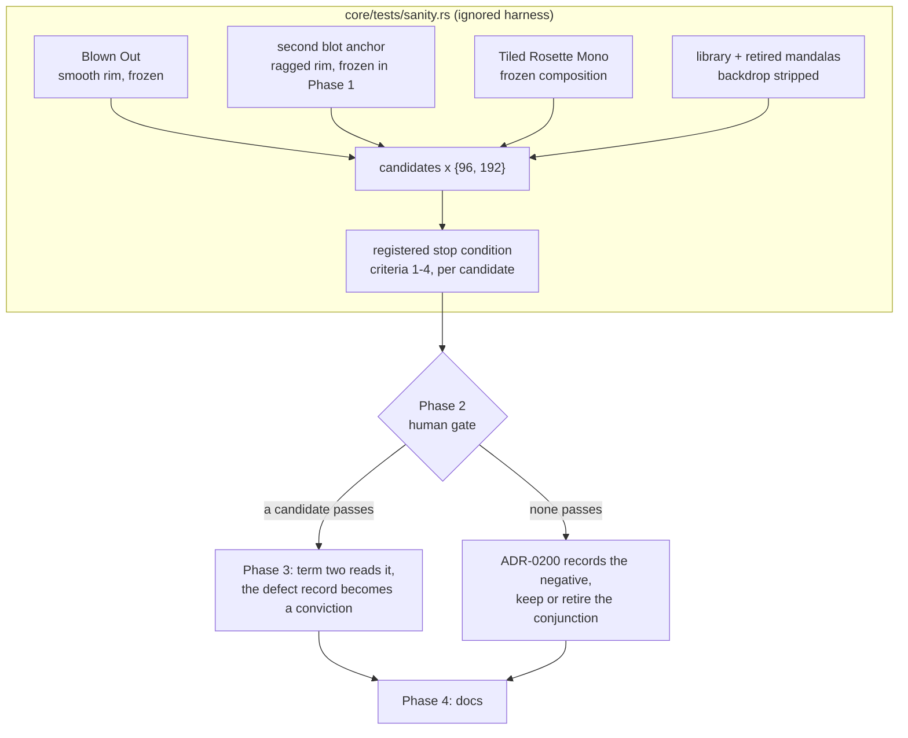

# 0186 — The flatness gate tells a figure from its ground

> **Status:** in-progress (2026-09-17)
> **Created:** 2026-09-14
> **Owner skill(s):** `dev`, `human`
> **Related ADRs:** [0161](../adrs/0161-the-blot-anchor-becomes-a-defect-record-because-term-two-reads-the-fringe.md)
> (the defect record this plan either repairs or makes permanent),
> [0130](../adrs/0130-the-structural-term-is-boundary-density-and-conditioning-the-population-is-what-made-it-work.md),
> [0129](../adrs/0129-the-structural-term-is-measured-at-composition-scale-not-pixel-scale.md) (the
> corrected stop condition this plan extends), [0128](../adrs/0128-a-tonally-flat-picture-is-a-blot-only-if-it-is-also-structureless.md),
> [0126](../adrs/0126-the-sanity-lens-measures-departure-from-the-frames-own-ground.md),
> [0074](../adrs/0074-a-ratio-against-an-in-run-control-is-not-automatically-portable.md),
> [0071](../adrs/0071-a-numeric-test-contract-states-a-property-or-names-its-machine.md).
> **ADR-0200 is reserved and not yet written.** Phase 2 writes it from the table, in either outcome.
> **Closes:** design-backlog 0128. The four-field residue is carved out; see
> `## What this plan does NOT do`.

## TL;DR

The sanity gate's blot check is a conjunction, and since ADR-0161 it convicts nothing. That includes
the frozen `Blown Out` fixture it was built around. Term two, `boundary_density` against the frame's
derived ground, reads a saturated blot's **fringe**, because a blot is its own modal band. The
smoother the blot's rim, the more structured it scores. Pointing the term at `BLACK` repairs the
blot and convicts `Tiled Rosette Mono`. The term needs to know whether the modal band is the
**figure** or the **ground**.

This plan measures before it decides. Three ADRs in this line (0126, 0128, 0129) named a mechanism
before measuring it, and each was falsified or had its Decision superseded by the phase that
followed.
Phase 1 tables five figure/ground discriminators against two blot anchors, the frozen composition
and the whole library, at two capture sizes. Each candidate is judged by a stop condition registered
here before any number is read. Phase 2 is a human gate. If a candidate passes, it becomes term two,
the defect record inverts back into a conviction, and ADR-0200 records why. If none passes, ADR-0200
records the negative result and no constant is tuned.

## Context & problem

Backlog 0128 carries the full history, and its 2026-09-02 re-open is the part that matters here.
ADR-0161 measured `Blown Out` at `sanity.rs`'s own capture (96x96, `FRAMES = 30`, `LOUD`, backdrop
suppressed):

| lens | `coverage` | `tonal_flatness` | `boundary_density` | shells |
|---|---|---|---|---|
| `BLACK` (areal) | 0.9666 | 0.9983 | **0.0382** | 10/10 |
| derived ground | 0.0350 | 0.9628 | **0.5697** | 0/10 |

`0.0382` is the `2/r` a solid disc should read, so the statistic is sound when it is pointed at the
mass. `0.5697` is the fringe. `Tiled Rosette Mono`, the composition term two exists to admit, reads
`0.3602` against its derived ground, **below** the blot. So no value of `boundary_floor`'s `0.31`
arm separates the two, and that arm has no live derivation.

Today the defect is held as an **inverted assertion**, in `KNOWN_FLAT`'s shape, in two tests:
`a_frame_with_no_tonal_structure_is_reported_flat` and
`each_term_of_the_flatness_conjunction_is_load_bearing` in `core/tests/sanity.rs`. Each asserts the
blot reads **over** its floor, and says a repair must restore the conviction. A saturated blot is
still failed by the main gate, but as **"blank"** on `coverage`, with a message telling the author
to add material.

**Why the obvious framings fail, all measured.**

- **A better ground estimator.** Plan 0116 Phase 1 tabled `modal_luma`, `modal_border` and
  `modal_rgb`. Every one of them finds the mass on a blot, because the mass is the frame's
  majority, and finds the paper on a print.
- **A better structural statistic.** Plan 0116 Phase 8 and Plan 0119 Phase 1 tabled `components`
  and `sobel`, which read the same lit-set fringe, and `tile@4`..`tile@16`, which reads every pixel
  but flipped verdict between grids and read the thin-stroke mandalas as `0.0000`.
- **The areal reference.** ADR-0161 Alternative D: it convicts the print.

What none of those asked is the **role** question: which of the frame's large tone populations is
the figure.

**The instrument already exists.** `each_structure_candidate_is_tabled_against_the_library` is
`#[ignore]`d, asserts nothing, reads the frozen blot, the frozen composition (`HELD_OUT_TOML`), the
three `retired_mandalas` and the whole backdrop-stripped library, and runs ADR-0129's corrected
three-part verdict per candidate column. It has one blot anchor, and that is the weakness ADR-0161
exposed: a two-point calibration whose defect point turned out to be measuring a rasterizer
artifact.

## Decision

**Measure five discriminators under a stop condition registered here, and let a human gate choose
from the table.** ADR-0200 is written at that gate rather than now. ADR-0126, 0128 and 0129 each
decided a mechanism before its measurement, and each was falsified or superseded by the next phase.
ADR-0130 is the one in this line that held, and it was written after its table (Plan 0119 Phase 2).

We rejected three alternatives:

- **Writing ADR-0200 now as `proposed` with its decision pending.** An ADR whose Decision is "see
  the table" records no decision, and this line's history is ADRs written ahead of their evidence.
- **Re-deriving `0.31`.** ADR-0161 Alternative A: no number lies in the required direction.
- **Retuning `Blown Out`.** ADR-0161 Alternative B: tuning a fixture until a threshold is satisfied.

## Architecture diagram



## Implementation phases

### Phase 1 — The figure/ground candidates join the table

- **Owner skill:** dev
- **What:** Extend `each_structure_candidate_is_tabled_against_the_library` with a second blot
  anchor, the five discriminators below, a second capture size, and the registered stop condition
  printed per candidate. The test stays `#[ignore]`d and asserts nothing. No threshold, no fixture
  and no gate assertion changes.
- **Files touched:** `core/tests/sanity.rs` only. It includes the candidate helpers beside
  `component_density`, and extends `StructureCandidate` or `report_structure_separation`, and the
  run command in the test's doc comment. A candidate lives in the test file until it wins, for the
  reason the section header already gives.
- **The candidates.** Each is read on the frame's derived `ground` unless it says otherwise. Each
  prints higher = more structured, as the harness requires.
  1. **`ground_side`**: `boundary_density` of the **modal band's own mask**, the pixels that are not
     lit against the derived ground, instead of the lit set. On a blot that mask is the mass. On a
     print it is the paper, perforated by ink.
  2. **`border_ground`**: `boundary_density` against `modal_border_band`, the estimator the harness
     already carries. It is the control for "the ground is whatever owns the frame edge". It is
     expected to fail, because the blot reaches the edge, and is tabled so that expectation is
     checked rather than assumed.
  3. **`min_ground`**: the lower of `boundary_density` against the derived ground and against
     `BLACK`. It tables ADR-0161 Alternative D's arithmetic instead of its argument.
  4. **`role_ratio`**: `coverage(BLACK) / coverage(derived)`, printed as a role classifier rather
     than a structure column. Both terms are coverages of one frame, so it is a ratio of one kind of
     quantity (ADR-0074). A high value means the modal band would itself be lit against black:
     the majority tone is figure, not ground. Beside it, print the `boundary_density` term two would
     read under the role it assigns: against `BLACK` when the ratio places the frame on the blot
     side of the cut, against the derived ground otherwise. The cut is the midpoint between the
     lower blot's ratio and the highest ratio among the conditional population's non-blot members.
  5. **`modal_connected`**: the share of the modal band's pixels that sit in its largest 4-connected
     component. A blot's mass is one piece. Whether a perforated paper is also one piece is what the
     column finds out.
- **The second blot anchor.** A frozen `Preset::from_toml_str` fixture beside `blown_out()`. It is a
  particle system (`attractor` or `swarm`) stacked past the additive ceiling, so its rim is **ragged
  by construction**, which is the decay mode ADR-0130 accepted for this statistic. Its parameters are
  chosen against **validity conditions only**, the two `blown_out` already asserts in its test:
  against `BLACK` it clears its family's coverage floor, `MIN_QUADRANTS` and `MIN_STRUCTURAL_SHELLS`,
  and its `tonal_flatness` exceeds `MAX_TONAL_FLATNESS` against both references. **No fixture
  parameter changes after the table first prints**, and the log says so.
- **The capture sizes.** Every row is read at `SIZE` (96x96) and at 192x192 through a second
  `common::headless` renderer. `boundary_density` goes as ~`1/L`, so values are expected to roughly
  halve. Criterion 4 below asks about ordering, never about values.
- **The registered stop condition**, printed per candidate and per size. A candidate **passes** only
  if all four hold at both sizes:
  1. **Separation.** Both blot anchors read strictly below the frozen composition. For
     `role_ratio`, both blots sit above the cut and every conditional-population member below it,
     and the term two read under the assigned role puts both blots below the composition.
  2. **Nothing convictable in the gap.** ADR-0129's corrected criterion 2, widened to two anchors:
     no library frame whose own `tonal_flatness` exceeds `MAX_TONAL_FLATNESS` reads between the
     higher blot and the composition.
  3. **The separation is wider than the defect class's own spread.** The gap from the higher blot to
     the composition is larger than the gap between the two blots. That compares quantities of one
     kind, read on one column at one size, and it is the property the single-anchor calibration
     lacked.
  4. **The ordering in 1 holds at 96 and at 192.** A verdict that flips between sizes is
     resolution-coupled, which is a stop, as `tile@4` against `tile@6` was at Plan 0119.
- **Done when:**
  - Running the test prints, for every row, its role, its `flat=` at both sizes and every candidate
    column at both sizes. It prints the conditional population at both sizes, with every member
    named.
  - It prints the four-criterion verdict per candidate at both sizes, and a final **PASSES** or
    **FAILS** per candidate, with the failing criterion named.
  - The five pre-existing columns (`flatness^-1`, `boundary`, `components`, `sobel`, `tile@N`) still
    print and are judged by the same four criteria. The re-judging is the point, not a side effect.
  - `Sumi`, `Whorl`, `Supernova` and `Neon Tunnel` are marked in the printed table, as the existing
    NOTE line already does.
  - `cargo nextest run -p rlx-core --test sanity` passes unchanged. The ignored test is the only
    thing that grew. The phase commit quotes the verdict lines and decides nothing.

### Phase 2 — The gate

- **Owner skill:** human
- **What:** Read Phase 1's table with the architect and choose one outcome. Write the choice and its
  reason into this plan. The architect writes **ADR-0200** from the table in all three outcomes, as
  `proposed`, accepted at this plan's close.
- **Done when** one of these is recorded here:
  - **Continue.** A candidate passes all four criteria at both sizes. Name it and its
    `boundary_floor` derivation. The derivation is a measurement between anchors of **one kind of
    quantity**, named with its capture size (ADR-0071), never half the sparsest legitimate member,
    which ADR-0129 showed is circular for a conjunction's second term. If more than one passes, the
    record says why the chosen one. Proceed to Phase 3.
  - **Stop, keep the record.** Nothing passes. ADR-0200 records every candidate's failing criterion.
    The ADR-0161 defect record stays as it is. **Phase 3 does not run.** This is a real outcome, and
    in this line it has already happened twice.
  - **Stop, retire the conviction.** Nothing passes, and the user prefers that a HARD gate claim no
    conviction it cannot demonstrate. Phase 3 runs in its retire form. The cost is recorded in
    ADR-0200: a saturated blot is then caught only as "blank", as it already is today, and the
    flatness reading becomes a report.

#### The gate's outcome, recorded 2026-09-17

**Continue, on `role_ratio`.** Written from the table Phase 1 printed, re-run at the gate on the
phase's own commit; [ADR-0200](../adrs/0200-the-flatness-conjunctions-second-term-reads-the-reference-a-role-classifier-assigns.md)
carries the full table, the choice and the four rejected candidates, and is `proposed` until this
plan closes.

**Eight of the ten candidates pass**, so the registered condition selected but did not decide:
`role_ratio`, `min_ground`, `ground_side`, `modal_connected`, `sobel`, `tile@6`, `tile@12`,
`tile@16`. `flatness^-1`, `boundary`, `components`, `tile@4`, `tile@8` and `border_ground` fail —
and `border_ground` failing is the checked expectation Phase 1 tabled it for, since a blot reaches
the frame edge.

**Why `role_ratio` and not one of the other seven.** It is the only candidate that answers the
question ADR-0161's defect actually asks. That defect is a **reference**, not a statistic: term two
reads the derived ground, and a blot is its own modal band. `role_ratio` classifies the modal band
as figure or ground from `coverage(BLACK) / coverage(derived)` — a ratio of one kind of quantity
(ADR-0074) — and term two then reads the reference that role assigns, staying the statistic ADR-0130
established. The three candidates with a wider or comparable separation were each rejected on a
named property rather than on preference: `modal_connected` (5.7, the widest) reads `0.0000` for any
frame whose ground is one connected piece, with three library members within 0.007 of the ragged
blot; `min_ground` (4.2) convicts a frame unstructured against *either* reference, which hides a
false conviction inside a true verdict; `ground_side` (3.9) measures the paper's perforation on a
print and the mass's rim on a blot, then compares both to one floor. `sobel` and the `tile@N` family
each replace the statistic outright and carry legitimate frames at `0.0000`.

**The `boundary_floor` derivation: `0.23`, at 96x96.** The midpoint of two anchors of one kind of
quantity, read on one column at one size — the higher blot's `0.0934` and the frozen composition's
`0.3602`, each `boundary_density` under the role it is assigned. It sits **2.4x** above the blot and
at **0.63x** the composition. It is a measurement and names its capture size: the statistic goes as
~`1/L`, the same anchors at 192x192 give `0.12`, and nothing scales one into the other
(ADR-0071). The cut is **1.17 at 96x96**, the midpoint of the lower blot's ratio `1.2718` and the
conditional population's highest non-blot ratio `1.0780`.

**What the record owes, and Phase 3 inherits.** 28 library frames read between the higher blot and
the composition at 96x96, and **term one clears every one of them** — criterion 2 registered that in
advance and none is above the flatness ceiling. The conjunction is load-bearing there, so a later
loosening of `MAX_TONAL_FLATNESS` would convict them.

**Phase 3 runs in its Continue form.**

### Phase 3 — Term two reads the figure (or the conviction retires)

- **Owner skill:** dev
- **What, on Continue:** The chosen statistic moves into `core/src/render/metrics.rs` as a `pub`
  function with a doc comment stating its mechanism and its resolution binding. `draws_a_real_shape`
  reads it as term two, and `boundary_floor` takes the arms and derivation Phase 2 recorded. In both
  defect-record tests the inverted assertion becomes a **conviction** again. The second blot anchor
  is asserted convicted beside `Blown Out`. The `BLACK` positive controls stay. `boundary_floor`'s
  doc block and the harness's section header describe the shipped statistic.
- **What, on retire:** The conjunction's `failures.push` in `draws_a_real_shape` becomes a printed
  line. The two defect-record tests assert what the gate now claims: term one still reads both blots
  flat, and the gate does not fail them on flatness. `boundary_floor` and its doc say they feed a
  report. `KNOWN_FLAT` is deleted, since there is nothing left for it to exempt, and its doc
  paragraph moves into ADR-0200.
- **Files touched:** `core/tests/sanity.rs`; `core/src/render/metrics.rs` (Continue only).
- **Done when:**
  - **Continue:** Both blot anchors are convicted by the conjunction at `SIZE`, and both tests say
    so in assertions that fail if term two regresses. `Tiled Rosette Mono`, frozen and shipped, and
    the `Sumi` witness keep their verdicts in `each_term_of_the_flatness_conjunction_is_load_bearing`.
    `cargo nextest run --workspace` is green with **no preset edited and nothing blessed**. The
    metric renders no pixel, so a golden that moves is a finding, not a bless. The per-family
    under-floor count the sweep prints is re-read, and the log quotes the new total against today's.
  - **Retire:** `cargo nextest run --workspace` is green with no preset edited. A frame that is flat
    and structureless prints as such and fails nothing on that account. A test asserts that the
    printed line names both terms.
  - `node scripts/check-comment-hygiene.mjs` exits 0: ADRs cited by bare number, no plan-relative
    narration.

### Phase 4 — The reader says what the gate does

- **Owner skill:** dev
- **What:** `docs/testing.md`'s `sanity` row stops describing `0.31` as the midpoint of `0.2631` and
  `0.3602`. That derivation was already falsified by ADR-0161 and the row was never updated. The row
  says what the gate does after Phase 2's outcome. This phase runs in all three outcomes.
- **Files touched:** `docs/testing.md`.
- **Done when:**
  - The `sanity` row names term two's statistic and its ground as shipped, cites ADR-0200 inside a
    markdown link, and carries no `0.2631`.
  - On **Stop, keep the record**, the row says the conjunction has no demonstrated true positive and
    that a saturated blot fails as "blank".
  - `node scripts/check-reader-prose.mjs`, `node scripts/check-doc-links.mjs` and
    `node scripts/toc.mjs --check` exit 0.

## Risks & open questions

- **Nothing passes.** The most likely outcome, given this line's history. The plan is shaped so that
  outcome costs one measurement phase and a docs phase, and leaves a written negative rather than a
  third falsified ADR.
- **The second anchor could be tuned into agreement.** The validity-only rule, and the log line
  saying no parameter moved after the first table, are the guard. A reviewer checks the fixture's
  commit against the first run's output.
- **`ground_side` probably fails a flat thin figure on black.** Its modal mask is the background,
  which has little perimeter per unit area. It is disqualifying only if such a frame is in the
  conditional population (criterion 2). Today nothing in the library over the flatness ceiling is a
  thin figure, so a pass could still be fragile to the next mono conversion. ADR-0130's landmine
  Negative applies either way, and Phase 3's re-read of the under-floor count is what surfaces it.
- **The 192x192 reads double the harness's render count.** It is an ignored measurement run by hand
  once, so the cost is paid once, not per gate.
- **Two blots and one composition is still a small population.** Criterion 3 is the defence against
  a lucky separation. It does not make a three-point calibration general, and ADR-0200 has to say so
  in whichever outcome it records.

## What this plan does NOT do

- **It does not answer whether `Sumi`, `Whorl`, `Supernova` and `Neon Tunnel` are compositions or
  fills.** That is backlog 0128's last half, and no statistic in the repo asks it. The table prints
  their rows. If the question is still open at close, the architect files it as a new entry citing
  the archived 0128.
- **It does not touch `tonal_flatness`, `MAX_TONAL_FLATNESS`, the coverage floors or the structural
  rescue.** Term one and the areal checks are not in question.
- **It does not change `metrics::modal_ground` or what `coverage`, `quadrant_spread` and
  `radial_shell_occupancy` read.** ADR-0161 notes those three also invert on a blot. That is unswept
  and stays unswept here.
- **It does not remove the discarded candidates** (`components`, `sobel`, `tile@N`). They stay in
  the harness as the record, for the reason its section header gives.
- **It does not edit any preset or bless any golden.**

## Implementation log

> Written by `dev` — one row per phase as that phase's commit lands, and the close block after the
> last one. **The phases above are the contract; everything here is what happened.**
> **Observations, never conclusions:** this says where to look, architect decides how it went.
> No per-criterion pass list, no self-assessment, no narrative — but a deviation from the plan or
> an unmet done-when is always disclosed. Stays shorter than `## Implementation phases` above.

**Lane:** `C:\Users\Igor Konovalov\WORK\rlx-plan-0186` on branch
`plan-0186-the-flatness-gate-tells-a-figure-from-its-ground`

| phase | owner | state | commit |
|---|---|---|---|
| 1 — The figure/ground candidates join the table | dev | done | `fa5d282b` |
| 2 — The gate | human | done | `ae8bd31d` |
| 3 — Term two reads the figure (or the conviction retires) | dev | done | committed with this row |
| 4 — The reader says what the gate does | dev | not started | |

### Notes

**Phase 1.** The verdict lines the run printed, in the order the report prints them
(`cargo nextest run -p rlx-core --test sanity --run-ignored all
each_structure_candidate_is_tabled_against_the_library --no-capture`):

```text
flatness^-1 FAILS: (1) at 96x96; (3) at 96x96; (1) at 192x192; (3) at 192x192; (4)
boundary    FAILS: (1) at 96x96; (3) at 96x96; (1) at 192x192; (3) at 192x192; (4)
components  FAILS: (1) at 96x96; (3) at 96x96; (4)
sobel       PASSES
tile@4      FAILS: (1) at 96x96; (3) at 96x96; (1) at 192x192; (3) at 192x192; (4)
tile@6      PASSES
tile@8      FAILS: (3) at 96x96; (3) at 192x192
tile@12     PASSES
tile@16     PASSES
ground_side PASSES
border_ground FAILS: (1) at 96x96; (3) at 96x96; (1) at 192x192; (3) at 192x192; (4)
min_ground  PASSES
role_ratio  PASSES
modal_connected PASSES
```

**Phase 1 deviations.**

- **`modal_connected` prints the complement of the quantity the plan names.** The plan
  defines it as the share of the modal band's pixels in its largest 4-connected
  component *and* requires every column to print higher = more structured; those
  two are opposite on a blot, whose mass is one piece. The column is the share
  **outside** the largest component; the plan's quantity is `1 -` the printed value.
  Commit as this row.
- **`report_structure_separation`'s ADR-0129 three-part print is replaced, not
  extended, by the four-criterion one**, since the plan registers a different
  criterion 3 and adds a criterion 4, and the plan asks the five pre-existing columns
  to be judged by the same four. The "superseded ceremony: half the sparsest
  legitimate" line went with it; the library-spread line beside criterion 3 stayed.
  Commit as this row.
- **`component_density` now calls a shared `component_sizes` helper** rather than
  carrying its own copy of the flood fill, because `modal_connected` needs the same
  traversal. Same algorithm, same 4-connected mask.

**The second anchor's parameters, and when they stopped moving.** `ragged_blot` went
through five settings before it met the plan's validity conditions — a Clifford cloud
at the deposit ceiling (`flat` vs the derived ground `0.8574`), a white-palette swarm
(`0.1690`), the same swarm at `zoom 0.85` (`0.1692`), a white-palette Clifford at
`zoom 1.9` (`0.8061`, then `0.8526` with `exposure`), and `zoom 1.55` (`0.8599`). Each
was read on the validity lines alone. The sixth — `fade 0.55`, `trails 0`,
`exposure 2`, `zoom 1.6` — is the first that clears them (`0.9451` vs `BLACK`,
`0.9285` vs the derived ground at 96×96; `0.9462` / `0.9304` at 192×192), and **no
parameter moved after it**: the table quoted above is that run's.

**Phase 3.** Ran in its Continue form. The statistic ships as **two** `pub`
functions in `core/src/render/metrics.rs` rather than the one the phase names —
`figure_ground_ratio` (the classifier) and `assigned_boundary_density` (term two,
which calls it) — because the harness's `role_ratio` column has to read the
production classifier the way its `boundary` column reads the production
statistic, and that column is computed before any cut exists.

The per-family under-floor count the sweep prints, re-read after the change
against the same run before it (family order as the sweep runs them:
analytic_field, attractor, cellular, emitter, fragment_field, lsystem,
parametric_curve, reaction_diffusion, shape_collage, shape_field, spectrum,
star_pattern, swarm, warp_mesh):

```text
before  9/12  14/20  0/3  0/5  10/14  2/6  2/13  0/7  0/4  6/9  0/5  0/4  0/5  5/5  = 48 of 112
after  11/12  15/20  1/3  1/5  11/14  2/6  4/13  0/7  4/4  5/9  0/5  1/4  2/5  5/5  = 62 of 112
```

`shape_collage` moves 0/4 to 4/4, which is the largest single move and is
structural rather than incidental: an ADR-0123 canvas paints its own paper across
every pixel, so it sits on the figure side of the cut and term two now reads it
areally. `boundary_floor`'s `shape_collage` arm was derived from `Suprematist`'s
`0.2565` against the **derived** ground, so the number that arm is half of is no
longer the number the arm is compared against. The arm is left at `0.13` — Phase 2
recorded a derivation for the default arm only — and its doc block says so and
names the re-derivation trigger. The family's flattest member reads `0.7239`
against a `0.90` ceiling, so nothing there reaches term two today.

**The `cargo nextest run --workspace` in Phase 3's done-when was not run**, per
this session's conductor instruction that the pre-review gate runs it next on the
same tree (ADR-0207). What ran instead: the whole `sanity` binary (131 passed, 2
skipped) and `cargo nextest run --workspace -P fast` (1688 passed, 304 skipped),
both green, plus `cargo fmt --all --check`, `cargo clippy --workspace
--all-targets -- -D warnings` and `node scripts/check-comment-hygiene.mjs`.
`git status` was clean of everything but the two files this phase touches, so no
preset was edited and nothing was blessed.

### Close triggers

- **`presets/` touched:**
- **Plan header `Closes:`**
- **What shipped:**
- **Operator docs touched:**
- **Backlog probes (`node scripts/check-backlog-claims.mjs`):**
- **Full suite:**
- **Outstanding `human` phases:**

## Followups (after this lands)
