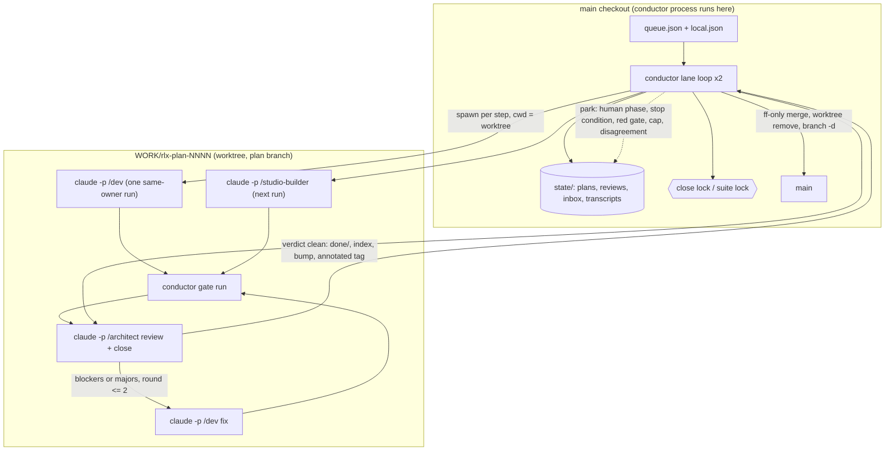

# 0187 — The conductor runs the lanes

> **Status:** in-progress
> **Created:** 2026-09-14
> **Owner skill(s):** `dev`, `human`
> **Related ADRs:** [0205](../adrs/0205-an-approved-plan-runs-under-a-conductor-and-every-judgement-it-cannot-make-parks-the-plan.md) (proposed),
> [0188](../adrs/0188-the-two-implementer-lanes-hand-off-automatically.md) (superseded in part),
> [0053](../adrs/0053-plan-lanes-run-in-git-worktrees.md), [0120](../adrs/0120-the-close-brief-is-a-section-of-the-plan.md),
> [0156](../adrs/0156-the-per-phase-gate-is-scoped-and-the-suite-is-owed-once-per-plan.md),
> [0193](../adrs/0193-a-test-that-reads-the-clock-runs-alone.md), [0005](../adrs/0005-versioning-and-release-cadence.md)
> **Closes:** none

## TL;DR

A Node program, `tools/conductor/`, takes approved plans off a queue and runs them in up to two git
worktree lanes with no owner action between approval and `main`: one fresh headless `claude -p`
session per contiguous same-owner run of phases, its own gate run, a fresh headless `architect`
session that reviews and closes the plan on the branch, a fast-forward of `main`, and removal of the
lane. Anything it cannot decide — a `human` phase, a plan's own stop condition, a red gate, a review
still failing after two fix rounds, a spend cap — **parks the plan** and the lane moves on. It never
pushes. The first behaviour an owner sees is `node tools/conductor/conductor.mjs run` taking Plan
0175 from `approved` to a merged, tagged `main` while they do something else.

## Context & problem

The owner asked, on 2026-09-14, for orchestration that spawns and retires fresh sessions itself —
the close ceremony included — merges each plan to `main`, runs two lanes, keeps human involvement to
what only a human can do, and never pushes. The interview settled four things: a review with blockers
or majors goes to a capped fix loop (two rounds) and otherwise closes; a `human` phase parks the plan
and the lane continues; the driver is Node over `claude -p`; spend is capped per step and a hit parks.

ADR-0205 carries the argument that the manual seams' purposes survive automation. What this plan has
to get right is mechanical and unforgiving: a driver that trusts a session's word, lets two lanes race
a version tag, runs two GPU suites at once, or deletes a worktree a process still holds, will produce
exactly the failures this project's close ceremony was written to stop — silently, overnight.

## Decision

Build the conductor in `tools/conductor/` as zero-dependency Node (ESM, `node --test`), driving the
installed `claude` CLI headless, with a committed queue, a machine-local limits file, and runtime
state under a gitignored directory. Teach the three skills a **conductor mode** that the conductor
selects through its appended system prompt, not through the skill's own trigger. Pilot on one lane
before two. We rejected an in-session Workflow (it ends with the session), the Agent SDK (a new
package for control `claude -p`, a settings file and hooks already give), and Agent-tool subagents
(refused git on the main checkout, and session-bound) — ADR-0205 records each.

## Architecture diagram



## Implementation phases

### Phase 1 — The headless contract, observed rather than assumed
- **Owner skill:** dev
- **What:** A throwaway spike, kept as `tools/conductor/spike/` evidence and a script, that runs real
  `claude -p` sessions against a disposable fixture plan in a disposable worktree and records what the
  CLI actually does on this machine. The conductor's design rests on every row; a row that comes back
  different is a stop, not a workaround.
- **Files touched:** `tools/conductor/spike/probe.mjs`, `tools/conductor/spike/fixture-plan.md`,
  `tools/conductor/spike/README.md` (the evidence table, dated, naming the CLI version).
- **Done when:** the evidence table answers, each with the observed output quoted:
  - a `-p` prompt beginning `/dev …` loads the project skill, and `CLAUDE.md` is in context;
  - the two existing `PreToolUse` deny hooks fire and their denial reaches the session as a tool
    error it can read;
  - `--permission-mode dontAsk` with an allowlist supplied through `--settings <file>`: an allowed
    `Bash(cargo …)` runs, a disallowed call is denied rather than hanging, and `Edit`/`Write` inside
    the worktree work;
  - `--output-format stream-json`: which event carries the final text, the session id, the cost and
    the error flag, and how a run ended by `--max-budget-usd` is distinguishable from a clean one
    (exit code and final event);
  - `--append-system-prompt-file` content is visible to the skill;
  - an environment variable set by the parent is visible to hooks;
  - on Windows, after the child exits, `git worktree remove` on its cwd succeeds (no handle left).
- **Stop condition:** if project skills or hooks do not load under `-p`, stop and route to
  `architect` — ADR-0205's design is void without them.

### Phase 2 — Conductor mode in the skills, and the hooks that make it safe
- **Owner skill:** dev
- **What:** Each of `dev`, `studio-builder` and `architect` gains a `## Conductor mode` section, and
  the repository gains two hooks and a lock wrapper. Conductor mode is entered only when the appended
  system prompt says so, never by a user phrase.
- **Files touched:** `.claude/skills/dev/SKILL.md`, `.claude/skills/studio-builder/SKILL.md`,
  `.claude/skills/architect/SKILL.md`, `.claude/skills/dev/references/close-ceremony-prompt.md`,
  `tools/conductor/prompts/{implement,fix,review}.md`, `tools/conductor/with-lock.mjs`,
  `.claude/hooks/block-push-and-history-rewrite.js`, `.claude/hooks/conductor-suite-lock.js`,
  `.claude/settings.json`, `tools/conductor/settings.conductor.json`.
- **The contract each mode states:**
  - **Implementers (`dev`, `studio-builder`):** the phase range in the prompt is the "go"; skip the
    restate-and-wait; implement exactly that range; never invoke a sibling through the Skill tool (the
    conductor starts the next run); never ask a question — a question, a wrong plan, a plan's stop
    condition or a red check the session cannot fix within the phase ends the session with a `parked`
    outcome naming it; run `nextest` only through `with-lock.mjs suite --`; the last dev run of a plan
    writes the close block but prints the outcome instead of the three-line pointer.
  - **`architect`:** run Mode 4 against the plan and lane named, write the review to the path named,
    and end with a `verdict` outcome that lists **every finding** (severity, `file:line`, one-line
    what); **only** when it carries no blockers and no majors, continue into the worktree close
    sequence steps 1-3 on the branch (merge `main`, gate, bookkeeping, version bump, studio sync,
    **annotated** tag) and end with `closed`; never fast-forward `main`, never remove the lane — the
    conductor does.
  - **The review is committed with the close.** In conductor mode the architect's close commit adds a
    `## Close review` section to the plan, after `## Implementation log`: the final round's review in
    full, and one line for every finding an earlier round raised and a fix round resolved, naming the
    fix commit. A conductor-run close has no reader in the room, so the review is the evidence of
    what was checked, and it travels with the plan into `done/` beside the log it graded.
    Human-started closes keep delivering the review in conversation.
  - **The outcome block**, the last thing each session prints, one fenced `rlx-outcome` JSON object
    (see Data shapes). It is a claim the conductor verifies, not a report it trusts.
- **Hooks:** `block-push-and-history-rewrite.js` is registered for every session and denies
  `git push`, `git reset --hard`, `git rebase`, `git commit --amend`, and `git filter-branch`.
  `conductor-suite-lock.js` acts only when `RLX_CONDUCTOR=1` and denies a `cargo nextest` or
  `cargo test` command not prefixed by the lock wrapper.
- **Done when:**
  - a human-started `/dev` session is unchanged: it restates and waits (the mode section is inert
    without the conductor's prompt);
  - each hook has a seeded bite check in `scripts/fixtures/` style that shows it denying the command
    it names and allowing a near miss (`git push` denied, `git log --oneline origin/main` allowed;
    wrapped `nextest` allowed, bare `nextest` denied only under `RLX_CONDUCTOR=1`);
  - `with-lock.mjs` holds a machine-wide lock across two concurrent invocations, and a lock whose
    holder PID is dead is taken over, shown by a test.

### Phase 3 — The conductor's core: queue, state, plan reading, locks, one step
- **Owner skill:** dev
- **What:** Everything except the lane state machine, tested against a fake `claude` executable so no
  test spends money or needs a network.
- **Files touched:** `tools/conductor/conductor.mjs` (entry), `tools/conductor/lib/{queue,state,plan,locks,step,git,outcome}.mjs`,
  `tools/conductor/queue.json`, `tools/conductor/local.example.json`,
  `tools/conductor/test/*.test.mjs`, `tools/conductor/test/fake-claude.mjs`, `.gitignore`.
- **Done when:**
  - `queue.json` validates: lanes, ordered plans, per-plan `after` dependencies and optional
    `add_dirs`; a plan that is not `Status: approved`, or depends on a plan not in the queue or in
    `done/`, is rejected with its name;
  - the conductor refuses to start without `local.json` carrying a per-step budget for each of
    `implement`, `fix`, `review`, and refuses a `claude --version` it has not been verified on
    (Phase 1's version);
  - the plan reader extracts, from a real plan in this repository, the phases with their owner tags,
    the contiguous same-owner runs, and which phases the `## Implementation log` table marks `done`;
  - a step spawns the fake executable with the worktree as cwd, `RLX_CONDUCTOR=1`, the settings file
    and the budget, stores the stream transcript under `state/`, and returns the parsed outcome; a
    missing or malformed outcome block is a `parked` result, never a pass;
  - state writes are atomic (write-then-rename) and a killed conductor restarts from the last
    completed step.

### Phase 4 — The lane loop, end to end against a scratch repository
- **Owner skill:** dev
- **What:** The state machine ADR-0205 describes, exercised in tests against a temporary git
  repository with a fake `claude` that makes commits and prints outcomes.
- **Files touched:** `tools/conductor/lib/{lane,gate,close,merge,cleanup,inbox}.mjs`,
  `tools/conductor/test/lane.test.mjs`.
- **The loop per plan:** open `WORK/rlx-plan-NNNN` on `plan-NNNN-<slug>` from `main` (refused past
  `max_open_worktrees` from `local.json`); for each same-owner run not yet done, one implement step,
  then **verify the claim** — the commits the log names exist, the rows match, the tree is clean; at a
  `human` phase, park; when every non-human phase is done, the conductor's gate — `cargo fmt --all --check`,
  `cargo clippy --workspace --all-targets -- -D warnings`, `cargo nextest run --workspace` under the
  suite lock, `RUSTDOCFLAGS=-D warnings cargo doc --workspace --no-deps`, and the Node gates the
  pre-push hook runs; take the close lock; review step; on `verdict` with blockers or majors, release
  the lock, fix step, gate, re-review — at most two rounds, then park; on `closed`, **verify the
  close** — plan under `docs/plans/done/` with `Status: done`, tree clean, and if a version moved, the
  tag is annotated (`git cat-file -t` is `tag`) and points at the branch tip; fast-forward `main` from
  the main checkout, refusing when the main checkout is dirty or not on `main`; if `main` moved, merge
  `main` into the branch in the worktree, re-run the gate, move the annotated tag onto the new tip
  with its message kept, retry once, then park; release the lock; remove the worktree, prune, and
  `git branch -d` — a removal failure is an inbox entry, not a park.
- **Done when**, each a test against the scratch repository:
  - a two-run plan (`dev` then `studio-builder`) with a clean review ends merged on `main`, tagged
    annotated, with the worktree and branch gone, and the merged plan carries a `## Close review`
    section — a `closed` outcome whose plan lacks one parks as a disagreement;
  - a plan with a `human` phase parks there with its worktree kept, and the lane opens the next plan
    in the queue whose `after` list is satisfied, while a plan that depends on the parked one is held;
  - a review with one major triggers exactly one fix step and a re-review; a review still carrying a
    blocker after two rounds parks;
  - a session whose outcome claims `phases_done` with no matching commit parks as a disagreement;
  - a lightweight tag on a `closed` plan parks rather than merging;
  - `main` advanced by a commit on a disjoint file between close and merge produces one automatic
    re-merge and a merged plan; a conflicting advance parks;
  - two lanes closing at once serialize on the close lock — the second's review starts only after the
    first's fast-forward;
  - a budget-exhausted step parks with its spend recorded in state.

### Phase 4b — The close digest: what happened, readable the morning after
- **Owner skill:** dev
- **What:** `tools/conductor/digest.md`, one gitignored file in the main checkout that the conductor
  regenerates from its state and `git` after every step and once more when a run ends — so an
  interrupted run still leaves a current digest. Newest run first; older runs stay below it. It
  lives outside `state/` and no command deletes it, and it is never written inside a worktree,
  because worktrees are removed.
- **Files touched:** `tools/conductor/lib/digest.mjs`, `tools/conductor/test/digest.test.mjs`,
  `.gitignore`.
- **Each run's section, in this order:**
  1. **Needs you** — every park, with its reason, the file to read, the worktree it holds and the
     `resume` command; then every plan that merged with minors, one line each. Empty says so in one
     line, because an empty section is the good news.
  2. **Closed** — per merged plan: title, version and annotated tag (or `none`), the merge commit,
     fix rounds taken, wall time, spend; then every finding as one line — severity, `file:line`, what
     — marked `resolved in <sha>` where a fix round closed it; then the path of the `## Close review`
     section it came from.
  3. **Failed and parked** — gate reds with the failing test names, disagreements with the claim
     and what `git` showed, spend-cap hits, API errors.
  4. **Totals** — per lane and for the run: plans merged, parked, wall time, spend, time spent
     waiting on each lock.
- **Done when:**
  - the Phase 4 scenario tests each assert the digest they leave: the clean two-run plan appears
    under **Closed** with its tag and zero fix rounds; the human-phase park appears under **Needs you**
    with a `resume` command that the CLI accepts; the one-major plan lists the major as resolved with
    the fix commit's sha; the spend-cap park appears under **Failed and parked** with its spend;
  - the digest is generated only from state and `git` — deleting it and running `status`
    regenerates an identical file;
  - a finding line carries only what the verdict outcome carried; the digest never summarizes review
    prose, so what it says is what the reviewer said.

### Phase 5 — The operator surface and the documents
- **Owner skill:** dev
- **What:** The commands an owner uses, the inbox, and the prose that tells a reader the seams changed.
- **Files touched:** `tools/conductor/conductor.mjs` (commands), `tools/conductor/README.md`,
  `docs/developing.md`, `CLAUDE.md` (the `tools/` entry and the `## How we work` seam paragraph),
  `docs/plans/README.md` `## Conventions` (one bullet: conductor-run plans), `.github/workflows/ci.yml`
  (`node --test tools/conductor` in the `links` job).
- **Done when:**
  - `run [--lane a|b] [--once]`, `status`, `resume NNNN`, `park NNNN`, `abort` exist; `status` prints
    per lane the plan, the step, the time in it, the spend so far and every parked plan with its
    reason, and ends with the digest's path; `resume NNNN` refuses a plan whose park reason is still true (a `human` phase the log does
    not mark done);
  - `state/inbox.md` gains one entry per park, naming the plan, the reason, the file to read and the
    command that resumes it;
  - `CLAUDE.md`'s seam paragraph states that a conductor-run plan's "go" is its approval and its close
    review is a separate process, and that everything else stays as ADR-0188 left it, citing ADR-0205;
  - CI runs the conductor's tests; `node scripts/check-doc-links.mjs` and `node scripts/check-reader-prose.mjs` exit 0.

### Phase 6 — The pilot: one lane, two plans, watched
- **Owner skill:** human
- **What:** The owner runs `node tools/conductor/conductor.mjs run --lane a` with the queue holding
  Plan 0175 then Plan 0185 — both `dev`-only, core-only, with no human phase — and watches the first
  plan through, then leaves the second unattended. If either has already closed by hand, the pilot
  takes the next two queued plans that are `dev`-only with no `human` phase (0181, 0182).
- **Done when:** both plans are closed on `main` with annotated tags, their worktrees and branches
  gone, with no owner action between `run` and the second merge; the owner has read
  `tools/conductor/digest.md` and both plans' `## Close review` sections, says whether the digest
  alone told them what happened, and pushed or did not push by their own call; and the owner reports to a fresh
  `architect` session the two runs' wall time, spend and every park or surprise. That session enables
  the second lane in `queue.json` — or does not, on what the pilot showed — and records the pilot in
  ADR-0205's `Outcome` at this plan's close.

## Data shapes

Illustrative — Phase 3 fixes the final form.

```json
// tools/conductor/queue.json (committed; architect-owned sequencing)
{
  "lanes": {
    "a": ["0175", "0185"],
    "b": []
  },
  "plans": {
    "0181": { "after": ["0185"] },
    "0180": { "add_dirs": ["../milkdrop-corpus"] }
  }
}
```

```json
// tools/conductor/local.json (gitignored; the owner's figures, no defaults)
{ "budget_usd": { "implement": 0, "fix": 0, "review": 0 }, "max_open_worktrees": 3 }
```

````text
```rlx-outcome
{"kind": "phases_done", "plan": "0175", "through": 3, "commits": ["abc1234", "def5678"]}
```
````

Outcome kinds: implementers `phases_done` or `parked` (`reason`: `human_phase` | `stop_condition` |
`plan_wrong` | `question` | `check_red`, plus `detail`); architect `verdict`
(`blockers`, `majors`, `minors`, `review_path`, and `findings`: a list of
`{severity, file, line, what}`), `closed` (`version`, `tag` or `null`), or `parked`.

```markdown
<!-- tools/conductor/digest.md (gitignored) - one run's section, illustrative -->
## Run 2026-09-15 01:12 -> 07:40 (lanes a, b)

### Needs you
- **0183 parked** at Phase 3 (`human` look gate). Read: the plan's Phase 3. Holds `WORK/rlx-plan-0183`.
  Resume: `node tools/conductor/conductor.mjs resume 0183`
- **0185 merged with 1 minor** - see Closed.

### Closed
- **0175 - An eased value arrives at its target** - v0.124.0, tag annotated, merge `a1b2c3d`,
  0 fix rounds, 1 h 52 min, spend recorded. Review: `docs/plans/done/0175-...md` `## Close review`.
  - major `core/src/preset/schema/easing.rs:88` snap test missing the alpha-near-1 case - resolved in `e4f5a6b`
- **0185 - A fullscreen field lets the sky through...** - v0.124.1, ...
  - minor `docs/presets.md:612` occlude row still says "with a stage"

### Failed and parked
- none

### Totals
- lane a: 1 merged, 1 parked; lane b: 1 merged. Suite-lock wait 38 min; close-lock wait 6 min.
```

## Risks & open questions

- **A session that improvises instead of parking.** The skill text says park; a model under a phase's
  pressure may still work around a wrong plan. The conductor's cross-checks catch a claim that
  disagrees with `git`, not a deviation disclosed honestly in the log. The review is the backstop, as
  it is today, and the owner's reading before a push is the last one.
- **The CLI moves under the conductor.** Flags and stream events change between versions. The version
  check refuses an unverified CLI; re-running Phase 1's probe is how a new version gets verified.
- **Rate or usage limits mid-step** end a session with an error, not an outcome. That parks with
  reason `api` and is resumable; the conductor does not retry on its own, because it cannot tell a
  limit that clears in a minute from one that clears tomorrow.
- **Parks accumulate disk.** Each parked plan keeps a worktree and its `target/` (ADR-0053: ~8 GB and
  up). `max_open_worktrees` bounds it; the inbox names the worktrees a park is holding.
- **The suite lock halves two-lane throughput at the gate.** Measured Phase 1 of Plan 0174 put `-P fast`
  at 398.2 s; two lanes queue behind each other there. The pilot's wall-time report is what decides
  whether the second lane is worth enabling.
- **The main checkout is shared with the owner.** A fast-forward refuses a dirty main checkout, so
  owner work in progress there parks every close. The README says to work in a lane, not in main,
  while the conductor runs.
- **Open: notification.** The inbox file and `status` are the whole channel in this plan. A desktop
  notification is a followup if the pilot shows parks going unseen.

## What this plan does NOT do

- **It does not push, ever**, and adds a hook that makes that true for every session.
- **It does not run `human` phases**, including their mechanical parts, and does not conduct the
  `preset-author` lane.
- **It does not approve plans or edit them.** Sequencing lives in `queue.json`, which the architect
  edits; a plan found wrong parks for a human-started `architect` session.
- **It does not run in the cloud or on a schedule.** It is a local process the owner starts; a
  scheduler around it is a later plan if one is wanted.
- **It does not retry a red gate.** A flake is a defect to fix under ADR-0193, and a conductor that
  retried would bury exactly the intermittent failures Plan 0174 exists to surface.
- **It does not change how a human-started session behaves.** Every conductor-mode rule is inert
  without the conductor's appended prompt.

## Implementation log

> Written by `dev` — one row per phase as that phase's commit lands, and the close block after the
> last one. **The phases above are the contract; everything here is what happened.**
> **Observations, never conclusions:** this says where to look, architect decides how it went.
> No per-criterion pass list, no self-assessment, no narrative — but a deviation from the plan or
> an unmet done-when is always disclosed. Stays shorter than `## Implementation phases` above.

**Lane:** `main` directly

| phase | owner | state | commit |
|---|---|---|---|
| 1 — The headless contract, observed rather than assumed | dev | done | `142e24a` |
| 2 — Conductor mode in the skills, and the hooks that make it safe | dev | done | `b6990c6` |
| 3 — The conductor's core: queue, state, plan reading, locks, one step | dev | done | `0a90ec7` |
| 4 — The lane loop, end to end against a scratch repository | dev | done | `fad5459` |
| 4b — The close digest: what happened, readable the morning after | dev | done | `35d6ef5` |
| 5 — The operator surface and the documents | dev | done | `96a78eb` |
| 6 — The pilot: one lane, two plans, watched | human | not started | |

### Notes

- Phase 1: the root `.gitignore`'s `spike/` rule matches `tools/conductor/spike/`, so its three files were staged with `git add -f`.
- Phase 1: `--max-budget-usd` is checked between turns - a `0.0001` cap spent `0.051` (spike README).
- Phase 2: the hook bite checks and the lock tests are `tools/conductor/test/hooks.test.mjs` and `with-lock.test.mjs` (Phase 3's test directory), not a `scripts/fixtures/` tree.
- Phase 2: outcome kinds added beyond the Data shapes list - `fixed` (fix round, with `resolved` finding-to-commit pairs), `closed` carries its `verdict`, and `merge_conflict` as a review park reason.
- Phase 3: added `tools/conductor/test/helpers.mjs` (shared fixtures) beside the listed test files; `.gitignore` also gains `!tools/conductor/spike/`.
- Phase 3: conductor-side park reasons `budget`, `api`, `no_outcome`, `bad_outcome` (`lib/step.mjs`).
- Phase 4: added `tools/conductor/test/lane-scenario.mjs` (the fake sessions' repository behaviour); a fix round goes to `/studio-builder` when every blocker and major names a file under `studio/`, else `/dev`.
- Phase 4: two scenarios beyond the done-when list - a red conductor gate parks before review, and `plan.mjs` normalizes CRLF (a scratch checkout under this machine's `core.autocrlf=true` read no phases).
- Phase 4b: the digest's scenario assertions went into `lane.test.mjs` (a Phase 4 file). That the CLI accepts the digest's `resume` command, and that `status` regenerates the digest, are tested in Phase 5, where those commands exist.
- Phase 5: CI runs `node --test "tools/conductor/test/*.test.mjs"` after an `actions/setup-node` 22 step, not `node --test tools/conductor` - a directory is not a test pattern on Node 22 (`Cannot find module`).
- Phase 5: `lib/step.mjs` (a Phase 3 file) gained `activeChildren` so `abort` and Ctrl+C end live sessions; command tests are in `test/cli.test.mjs`.
- Phase 5: `resume` refuses only `human_phase` (row not done) and `main_dirty` (checkout still dirty) as still true; every other reason is accepted, and `review_failed` grants two fresh fix rounds.
- Followup: no test runs the conductor against the real CLI; the review session writing its file under `state/reviews/` through `--add-dir`, and a real session honouring conductor mode end to end, are first exercised by Phase 6.
- Followup: the digest's per-run lock-wait totals add a plan's whole `lockWaits` to every run that plan touched, so a plan spanning two runs is counted in both.

### Close triggers

- **`presets/` touched:** no
- **Plan header `Closes:`** none
- **What shipped:** feature (repository tooling under `tools/conductor/`, two `.claude/hooks/`, conductor-mode sections in three skills; nothing in a shipped artifact)
- **Operator docs touched:** `docs/developing.md`, `CLAUDE.md`, `docs/plans/README.md` `## Conventions`, `tools/conductor/README.md` (new), `.github/workflows/ci.yml`
- **Backlog probes (`node scripts/check-backlog-claims.mjs`):** exit 0, no entry named
- **Full suite:** `cargo nextest run --workspace` - exit 0, `1933 tests run: 1933 passed (5 slow), 6 skipped` (605.9 s); `node --test "tools/conductor/test/*.test.mjs"` - 101 pass, 0 fail
- **Outstanding `human` phases:** Phase 6 (the pilot)

## Followups (after this lands)
